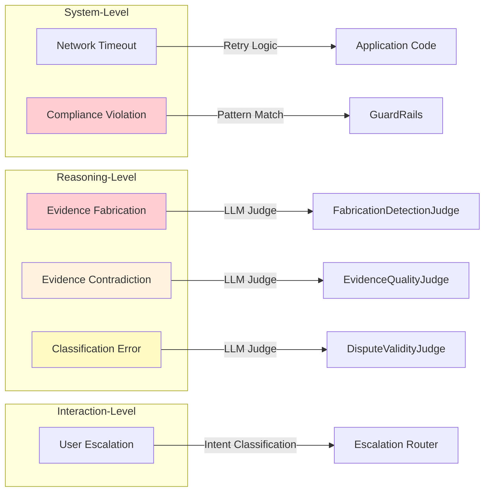

# Tutorial: Deep Understanding of Failure Taxonomy
⚠️ Disclaimer: The narrative scenarios, use cases, and code examples in this article are provided for illustration purposes only. They demonstrate concepts and patterns inspired from real project implementations. Adapt these patterns to your specific domain, regulatory requirements, and system architecture.
**Prerequisites:** Basic understanding of LLM agents, dispute resolution concepts

---

## Introduction: When Agents Lie

I was reviewing agent traces at 11 PM on a Thursday when I spotted it. Trace ID `TRC-FAB-001`. The merchant dispute chatbot had confidently stated: "Transaction TXN-002 for $250.00 from October 15th provides strong evidence of prior purchase history."

The problem? TXN-002 didn't exist. The only transaction in the evidence package was TXN-001 for $150.00 from October 12th.

The agent had fabricated evidence.

If this had gone to submission, the merchant would have filed a dispute defense citing a non-existent transaction. Visa's review would have flagged the inconsistency. The merchant would have lost—not because their case was weak, but because our AI invented details that didn't exist.

That night, I realized something fundamental: **agentic systems don't fail like traditional software**. A web server crashes with a 500 error. A database query times out. These are honest failures—the system tells you something went wrong.

But an LLM agent? It can fail by succeeding. It returns a confident, well-formatted response that happens to contain invented facts. It classifies a fraud case as "product not received" and nobody notices until the submission is rejected. It calculates a deadline wrong and the merchant misses their window.

This tutorial is about building a systematic way to catch these failures before they cause harm.

---

## 1. What is Failure Taxonomy?

**Failure taxonomy** is a systematic classification of the ways an AI agent can fail. It answers a deceptively simple question: *What can go wrong, and how would we know?*

In traditional software engineering, we think in terms of exceptions and error codes. `TimeoutError`, `ValidationException`, `404 Not Found`. These are programmatic signals—the system explicitly tells us something went wrong.

Agentic failure is different. Consider these two outputs from our dispute chatbot:

**Output A (Traditional Error):**
```
TimeoutError: Tool 'check_status' did not respond within 30000ms.
System is slow. Retrying...
```

**Output B (Agentic Failure):**
```
Based on the evidence package, I found 3 prior undisputed transactions:
- TXN-001: $150.00 on Oct 12
- TXN-002: $250.00 on Oct 15  ← This doesn't exist
- TXN-003: $180.00 on Oct 18

This qualifies for Compelling Evidence 3.0 under Visa rules.
```

Output A is honest. The system told us it failed, and we can handle it with retry logic.

Output B looks successful. It's well-structured, confident, and completely wrong. TXN-002 and TXN-003 are hallucinations. The merchant doesn't qualify for CE 3.0 because they only have *one* prior transaction, not three.

**This is why we need failure taxonomy**—to systematically identify and detect the ways agents can appear to succeed while actually failing.

### The Qualitative Research Foundation

Failure taxonomy isn't something you invent at a whiteboard. It emerges from systematic observation of real agent behavior. We used a methodology borrowed from qualitative research: **open coding → axial coding → taxonomy construction**.

```mermaid
flowchart TD
    subgraph "Phase 1: Open Coding"
        A[Review 100+ traces] --> B[Assign descriptive labels]
        B --> C["tool_timeout", "contradictory_evidence", "human_escalation", ...]
    end

    subgraph "Phase 2: Axial Coding"
        C --> D[Group related codes]
        D --> E[Identify relationships]
        E --> F["5 failure mode categories"]
    end

    subgraph "Phase 3: Taxonomy"
        F --> G[Define each mode precisely]
        G --> H[Document red flag indicators]
        H --> I[Map to detection systems]
    end

    subgraph "Validation"
        I --> J[Inter-rater reliability κ > 0.75]
        J --> K[Saturate: <1 new pattern per 20 traces]
    end

    style A fill:#e1f5fe
    style F fill:#fff3e0
    style I fill:#e8f5e9
    style K fill:#f3e5f5
```

**Open coding** means reading traces without preconceived categories. When I reviewed trace `TRC-9a2f15de`, I didn't think "this is a System Reliability failure." I wrote: "tool_timeout: Tool call failed... TimeoutError" and "retry_mechanism: System is slow. Retrying..."

Only after reviewing 100+ traces did patterns emerge. I noticed that `tool_timeout` always appeared alongside `retry_mechanism`. They belonged together—both were manifestations of transient system issues, not agent reasoning failures.

**Axial coding** groups these open codes into higher-level categories based on their relationships. The codes `tool_timeout`, `retry_mechanism`, and `recovery_success` all clustered around **Network & System Reliability**. Meanwhile, `contradictory_evidence` and `complex_case_identification` formed a distinct **Evidence Complexity & Quality** category.

**Taxonomy construction** formalizes these categories into a documented system with precise definitions, examples, severity levels, and detection rules.

---

## 2. The Six Failure Modes

Our analysis revealed six distinct failure modes. Each represents a fundamentally different way the dispute chatbot can fail—and each requires a different detection strategy.



Let me walk you through each one.

---

### Failure Mode 1: Network Timeout (System Reliability)

**The Story:** This is the "honest failure" mode. The system tells you something went wrong.

I first documented this pattern in trace `TRC-9a2f15de`. The agent was checking dispute status when the backend tool simply didn't respond:

> "Tool call failed... TimeoutError"
>
> "System is slow. Retrying..."

**What makes it a failure mode?** The agent can't complete its task. The user is left waiting, and if retries are exhausted, the workflow stops entirely.

**Red Flag Indicators:**
- Error messages: `TimeoutError`, `ConnectionError`, `ETIMEDOUT`
- Phrases in output: "System is slow", "Retrying...", "Unable to connect"
- Tool response status: `timeout` or `error`
- Response time > 30,000ms

**Detection Strategy:** This is handled by application logic, not LLM judges. We use exponential backoff (1s → 2s → 4s) and circuit breakers.

```python
def is_network_timeout(trace: dict) -> bool:
    return any([
        "TimeoutError" in str(trace.get("error", "")),
        trace.get("tool_response", {}).get("status") == "timeout",
        trace.get("duration_ms", 0) > 30000,
        "retrying" in trace.get("assistant_message", "").lower()
    ])
```

**Severity:** Medium
**Blocking:** No (if retry succeeds), Yes (if retry budget exhausted)
**Frequency:** Common (~30% of error recovery traces)

---

### Failure Mode 2: Evidence Contradiction (Evidence Quality)

**The Story:** This is when the evidence doesn't add up—and the agent correctly recognizes it.

Trace `TRC-a58e226f` showed a scenario where the merchant claimed "product not received," but the shipping evidence told a different story:

> "I see this is a complex case. The evidence is contradictory."
>
> "Escalating to human agent."

In trace `TRC-BC-008`, the contradiction was explicit:

> "You stated you didn't receive the order, but UPS tracking shows: delivered... signed by 'J.SMITH'."

**What makes it a failure mode?** The dispute can't proceed without resolving the contradiction. Either the evidence is wrong, the user's claim is wrong, or there's additional context we're missing.

**Red Flag Indicators:**
- Explicit phrases: "contradictory", "inconsistent", "conflicting", "doesn't match"
- Field mismatches: `user_claim.date != evidence.transaction_date`
- Multiple evidence sources with incompatible values

**Detection Strategy:** The `EvidenceQualityJudge` with a threshold of 0.8. Evidence packages scoring below 0.8 indicate significant quality issues.

```python
def has_evidence_contradiction(trace: dict) -> bool:
    contradiction_phrases = [
        "contradictory", "inconsistent", "conflicting",
        "doesn't match", "does not match", "appears to conflict"
    ]
    assistant_msg = trace.get("assistant_message", "").lower()
    return any(phrase in assistant_msg for phrase in contradiction_phrases)
```

**Severity:** High (requires human judgment)
**Blocking:** Yes (blocks automated submission)
**Frequency:** Occasional (trigger for escalation)

---

### Failure Mode 3: Evidence Fabrication (Hallucination)

**The Story:** This is the nightmare scenario. The agent invents details that don't exist.

I created 15 adversarial test cases to stress-test this failure mode. Here's what `FAB-001` looked like:

> **Evidence Package:** One transaction: TXN-001 for $150.00
>
> **Agent Output:** "TXN-002 for $250.00" (doesn't exist)

And `FAB-007` was even more insidious:

> **Evidence Package:** Tracking shows delivery, no signature captured
>
> **Agent Output:** Correctly cites tracking number, but fabricates "signature from Mary Johnson"

The agent got the *base facts* right but added fabricated details. This is **partial fabrication**—the most dangerous kind because it looks plausible.

**Red Flag Indicators:**
- Transaction IDs not in `tool_output.transactions[].id`
- Dates not derivable from any timestamp in evidence
- Tracking numbers not in shipping records
- Amounts not matching any `transaction.amount` (exact match required)
- Names/signatures not in customer profile or shipping POD
- Statistics that don't match calculable values

**Fabrication Categories:**

| Category | Example | Severity |
|----------|---------|----------|
| `transaction_fabrication` | Invented TXN-ID, amount, or date | Critical |
| `tracking_fabrication` | Fabricated tracking/delivery details | Critical |
| `ce3_fabrication` | Inflated CE 3.0 history | Critical |
| `partial_fabrication` | Correct base data + fabricated details | High |
| `regulatory_fabrication` | Wrong deadline/policy claims | Critical |

**Detection Strategy:** `FabricationDetectionJudge` with a threshold of **0.95**. This is our strictest judge because fabrication is a zero-tolerance failure.

```python
def detect_fabrication(agent_output: str, evidence: dict) -> list[str]:
    red_flags = []

    # Check transaction IDs
    valid_txn_ids = {t["id"] for t in evidence.get("transactions", [])}
    mentioned_txn_ids = extract_txn_ids(agent_output)  # regex: TXN-\w+
    for txn_id in mentioned_txn_ids:
        if txn_id not in valid_txn_ids:
            red_flags.append(f"Transaction ID {txn_id} not in tool_output.transactions[]")

    # Check amounts
    valid_amounts = {t["amount"] for t in evidence.get("transactions", [])}
    mentioned_amounts = extract_amounts(agent_output)  # regex: \$[\d,]+\.?\d*
    for amount in mentioned_amounts:
        if amount not in valid_amounts:
            red_flags.append(f"Amount ${amount} not in any evidence field")

    return red_flags
```

**Severity:** Critical
**Blocking:** Yes (Hard Block)
**Frequency:** Rare (in well-tuned systems) but catastrophic when it occurs

---

### Failure Mode 4: Classification Error

**The Story:** The agent picks the wrong dispute reason code.

This one is subtle. In trace `TRC-04dd4579`, the agent correctly identified:

> "It's a fraud dispute."

But what if the merchant had said "I didn't receive the package" and the agent still classified it as fraud (10.4) instead of PNR (13.1)?

The distinction matters because:
- **Fraud (10.4)** requires proving the cardholder authorized the transaction (device fingerprint, IP match, CE 3.0 history)
- **PNR (13.1)** requires proving delivery (tracking number, POD, signature)

Wrong classification → wrong evidence gathered → weak case → lost dispute.

**Red Flag Indicators:**
- Reason code contradicts dispute keywords:
  - "didn't receive" / "never arrived" → should be 13.1, not 10.4
  - "didn't authorize" / "wasn't me" → should be 10.4, not 13.1
- Missing key evidence request for assigned code
- Confidence score < 0.7 on classification

```python
def detect_classification_error(trace: dict) -> list[str]:
    red_flags = []
    user_msg = trace.get("user_message", "").lower()
    assigned_code = trace.get("reason_code")

    pnr_keywords = ["didn't receive", "never arrived", "not delivered", "missing package"]
    fraud_keywords = ["didn't authorize", "wasn't me", "stolen", "fraud", "unauthorized"]

    has_pnr_signal = any(kw in user_msg for kw in pnr_keywords)
    has_fraud_signal = any(kw in user_msg for kw in fraud_keywords)

    if has_pnr_signal and assigned_code == "10.4":
        red_flags.append("PNR keywords detected but classified as Fraud (10.4)")
    if has_fraud_signal and assigned_code == "13.1":
        red_flags.append("Fraud keywords detected but classified as PNR (13.1)")

    return red_flags
```

**Severity:** High
**Blocking:** No (Warning only)
**Detection:** `DisputeValidityJudge` with threshold 0.7

---

### Failure Mode 5: User-Requested Escalation

**The Story:** The user explicitly asks for a human. This isn't really a "failure"—it's the system working as intended.

Trace `TRC-6371b389`:

> "I need a human to look at this."

**Red Flag Indicators:**
- Explicit requests: "human", "agent", "representative", "supervisor"
- Frustration markers: "this isn't working", "I give up"
- Repeated same question (>2 times)

```python
def is_user_escalation_request(user_message: str) -> bool:
    escalation_phrases = [
        "human", "agent", "representative", "supervisor",
        "manager", "talk to someone", "real person",
        "this isn't working", "let me speak to"
    ]
    return any(phrase in user_message.lower() for phrase in escalation_phrases)
```

**Severity:** Low (Expected behavior)
**Blocking:** Yes (Stops automation)
**Handler:** Intent classification, not LLM judge

---

### Failure Mode 6: Compliance Violation

**The Story:** The agent outputs or logs PCI-sensitive data. This is the regulatory nightmare.

We documented this as an *anticipated* failure mode—we never observed it in our synthetic data because our test data was pre-sanitized. But in production, users share sensitive information unprompted.

Trace `TRC-BC-009` demonstrated the input side:

> User: "The card that was charged is 4111-1111-1111-1111"
>
> User: "My SSN is 123-45-6789"
>
> System: "[SECURITY NOTICE: ... redacted from logs]"

**Red Flag Indicators:**
- Full PAN (card number): `\b\d{13,19}\b` without masking
- CVV/CVC: 3-4 digit code in payment context
- Full SSN: `\d{3}-\d{2}-\d{4}`
- Unmasked email in logs
- Deadline arithmetic errors (calculated ≠ filed_date + network_days)

```python
import re

PCI_PATTERNS = {
    "pan": r"\b\d{13,19}\b",
    "cvv": r"\bCVV:?\s*\d{3,4}\b",
    "ssn": r"\b\d{3}-\d{2}-\d{4}\b",
}

def detect_pci_violation(text: str) -> list[str]:
    violations = []
    for pci_type, pattern in PCI_PATTERNS.items():
        if re.search(pattern, text):
            violations.append(f"Potential {pci_type.upper()} exposure detected")
    return violations
```

**Severity:** Critical
**Blocking:** Yes (Hard Block)
**Detection:** `GuardRails` (regex/NLP), not LLM judge

---

## 3. From Taxonomy to Automated Detection

Having a taxonomy is only useful if we can actually catch these failures. This is where **LLM judges** come in.

### The Judge Mapping

Each failure mode maps to a specific detection system:

| Failure Mode | Responsible System | Threshold | Blocking? |
|--------------|-------------------|-----------|-----------|
| Network Timeout | Application logic (tenacity) | N/A | If retries exhausted |
| Evidence Contradiction | `EvidenceQualityJudge` | 0.80 | YES |
| Evidence Fabrication | `FabricationDetectionJudge` | 0.95 | YES |
| Classification Error | `DisputeValidityJudge` | 0.70 | NO (Warning) |
| User Escalation | Intent classifier | N/A | YES |
| Compliance Violation | `GuardRails` | PASS/FAIL | YES |

### Why Different Thresholds?

The thresholds aren't arbitrary. They encode our risk tolerance.

**Fabrication Detection (0.95):** This is our strictest threshold because the consequence of a false negative is filing a dispute with invented evidence. We'd rather have a false positive (correctly formatted evidence flagged for review) than let fabricated evidence slip through.

**Evidence Quality (0.80):** A score of 0.8 means "good enough to have a reasonable chance of winning." Below 0.8, we should either gather more evidence or warn the merchant that their case is weak.

**Dispute Validity (0.70):** This is a softer threshold because classification isn't always clear-cut. Some disputes genuinely fall between categories. A score below 0.7 generates a warning, but we let the merchant proceed if they choose.

### How `run_judges.py` Uses the Taxonomy

The judge runner script (`evals/phase1/run_judges.py`) operationalizes the taxonomy:

```python
# Simplified view of judge execution flow

async def run_all_judges(evidence_package: dict, trace: dict) -> JudgePanelResult:
    results = {}

    # 1. Fabrication Detection (Hard Block)
    fab_result = await fabrication_judge.evaluate(
        evidence=evidence_package,
        agent_output=trace["assistant_message"]
    )
    if fab_result.fabrication_probability > 0.05:  # 0.95 threshold inverted
        return JudgePanelResult(blocked=True, reason="fabrication_detected")

    # 2. Evidence Quality (Hard Block)
    quality_result = await evidence_quality_judge.evaluate(
        evidence=evidence_package,
        dispute_reason=trace["reason_code"]
    )
    if quality_result.score < 0.80:
        return JudgePanelResult(blocked=True, reason="insufficient_evidence")

    # 3. Dispute Validity (Soft Block - Warning Only)
    validity_result = await dispute_validity_judge.evaluate(
        user_claim=trace["user_message"],
        assigned_code=trace["reason_code"]
    )
    warning = None
    if validity_result.score < 0.70:
        warning = "Classification confidence low. Consider review."

    # 4. GuardRails (Hard Block) - Already applied at input

    return JudgePanelResult(blocked=False, warning=warning)
```

### The Cost-Benefit of Judge Thresholds

Every threshold is a tradeoff:

```
                    HIGH THRESHOLD (0.95)
                    ├── More false positives
                    ├── Blocks more valid submissions
                    └── Catches more real failures

                    LOW THRESHOLD (0.70)
                    ├── Fewer false positives
                    ├── Allows more submissions
                    └── Misses some real failures
```

For fabrication, the cost of a false negative (filing with fake evidence) is catastrophic—merchant loses credibility, potential fraud flags. So we accept more false positives.

For classification, the cost of a false negative (wrong reason code) is recoverable—the dispute might still succeed, or the merchant can refile. So we use a lower threshold and issue warnings instead of blocks.

---

## 4. The Saturation Journey

How do we know we've found all the failure modes? This is the question of **saturation**.

### The Saturation Principle

In qualitative research, saturation means "we've stopped finding new patterns." It's operationalized as: **< 1 new failure mode per 20 traces reviewed**.

Here's what our saturation log looked like:

| Batch | Traces Reviewed | New Patterns Found | Saturation Metric |
|-------|-----------------|--------------------|--------------------|
| 1 | 1-20 (Error Rec) | `tool_timeout`, `retry_mechanism` | N/A |
| 2 | 21-30 (Error Rec) | 0 | 0 new / 10 traces ✓ |
| 3 | 1-20 (Escalation) | `contradictory_evidence`, `human_escalation` | N/A |
| 4 | 21-20 (Escalation) | 0 | 0 new / 10 traces ✓ |
| 5 | 1-20 (Happy Path) | `successful_classification`, `smooth_submission` | N/A |
| 6 | 21-50 (Happy Path) | 0 | 0 new / 30 traces ✓ |

By batch 6, we had reviewed 100+ traces and hadn't found a new failure pattern in 50 consecutive traces. That's strong evidence of saturation.

### The Inter-Rater Reliability Story

But saturation only tells us we've found the patterns. It doesn't tell us we're *applying the taxonomy consistently*. For that, we need **inter-rater reliability (κ)**.

Cohen's Kappa measures how much two independent raters agree beyond chance:

```
κ = (P_observed - P_expected) / (1 - P_expected)

Where:
- P_observed = actual agreement rate
- P_expected = agreement expected by random chance
```

We ran this test with 20 traces, independently classified by a human analyst and GPT-4o:

| Metric | Value |
|--------|-------|
| Observed Agreement | 17/20 (85.0%) |
| **Cohen's Kappa (κ)** | **0.831** |
| Interpretation | Almost perfect agreement |
| Required Threshold | ≥ 0.75 |

**κ = 0.831** means our taxonomy is applied consistently. Two independent reviewers—one human, one LLM—classified the same traces into the same failure modes 85% of the time, and the 15% disagreement is beyond what we'd expect from random chance.

### The Disagreements That Taught Us Most

The 3 disagreements were informative:

| Trace ID | Rater 1 | Rater 2 (LLM) | Notes |
|----------|---------|---------------|-------|
| TRC-BC-011 | classification_error | successful_classification | Agent expressed uncertainty but succeeded |
| TRC-a58e226f | evidence_contradiction | user_escalation | Both signals present |
| TRC-ca7d751f | evidence_contradiction | user_escalation | Both signals present |

**TRC-BC-011** was interesting. The agent said: "I'm 60% confident this is best handled as 'Cancelled Recurring Transaction'." Rater 1 coded this as `classification_error` because of the expressed uncertainty. Rater 2 noted the successful outcome—the agent eventually reached 85% confidence and proceeded correctly.

This taught us that **uncertainty expression isn't the same as classification error**. An agent can be uncertain and still be correct. We updated our red flag indicators to focus on *mismatches between keywords and assigned codes*, not just low confidence.

---

## 5. Practical Exercise

Let's apply the taxonomy. Below are 3 traces from our test set. Classify each according to the failure taxonomy.

### Trace A
```
User: "I was charged for something I never ordered. My card number is 4532-1234-5678-9012."
Agent: "[SECURITY NOTICE: Payment information detected and redacted]"
Agent: "I understand you're disputing an unauthorized charge. Let me help you file this as a fraud case (Reason Code 10.4)."
```

<details>
<summary>Click to see answer</summary>

**Primary Failure Mode:** Compliance Violation (detected and handled)

**Reasoning:**
- User shared full PAN (4532-1234-5678-9012)
- GuardRails correctly detected and redacted
- This is actually a *success* case for the compliance system
- The dispute classification looks correct (unauthorized = fraud = 10.4)

**Secondary observation:** No failure mode applies because the system handled the PII correctly.
</details>

---

### Trace B
```
Evidence Package:
  - Transaction: TXN-001, $89.99, Oct 5, 2024
  - Shipping: FedEx #1234567890, delivered Oct 8, 2024

Agent Output:
"Based on the evidence, you have strong support for this dispute:
- Original transaction TXN-001 for $89.99 on October 5th
- FedEx tracking 1234567890 shows delivery on October 8th
- Proof of delivery signed by 'R. JOHNSON' at 2:34 PM"
```

<details>
<summary>Click to see answer</summary>

**Primary Failure Mode:** Evidence Fabrication (partial_fabrication)

**Reasoning:**
- Agent correctly cited TXN-001 amount and date ✓
- Agent correctly cited FedEx tracking number ✓
- **Agent fabricated "signed by 'R. JOHNSON' at 2:34 PM"** ✗

This is the dangerous **partial fabrication** pattern. The base facts are correct, making the fabricated detail (signature name and time) appear plausible. But if the evidence package doesn't contain POD signature information, the agent invented it.

**Red flags triggered:**
- Name "R. JOHNSON" not in `shipping.pod` or `customer_profile`
- Time "2:34 PM" not derivable from evidence timestamps
</details>

---

### Trace C
```
User: "The package never arrived. I want a refund."

Agent: "I've classified this as Reason Code 10.4 (Fraud - Card Not Present). Let me gather evidence to prove the cardholder authorized this transaction."

[Agent proceeds to gather device fingerprint and IP match data instead of shipping/delivery evidence]
```

<details>
<summary>Click to see answer</summary>

**Primary Failure Mode:** Classification Error

**Reasoning:**
- User said "package never arrived" → clear PNR (13.1) signal
- Agent classified as Fraud (10.4) → wrong reason code
- Agent gathered fraud evidence (device fingerprint, IP) instead of shipping evidence
- This will result in a weak case because the gathered evidence doesn't address the actual dispute

**Red flags triggered:**
- PNR keywords ("never arrived") but classified as Fraud (10.4)
- Evidence gathering strategy misaligned with user's actual complaint

**Detection:** `DisputeValidityJudge` would score this below 0.70 and issue a warning.
</details>

---

## 6. When to Update the Taxonomy

A failure taxonomy isn't static. It should evolve as your system and users evolve. Here are the triggers for taxonomy review:

### Review Triggers

| Trigger | Action |
|---------|--------|
| **100 new production traces** analyzed | Re-run saturation check |
| **New failure pattern** emerges | Add to taxonomy, update judges |
| **Judge calibration** reveals threshold issues | Adjust thresholds, document reasoning |
| **Quarterly review** cycle | Comprehensive taxonomy audit |
| **Regulatory change** affects compliance | Update compliance failure mode |

### The Living Document Principle

Our `failure_taxonomy.md` includes version history and changelog:

```markdown
## Changelog

| Version | Date       | Changes |
|---------|------------|---------|
| 1.0     | 2025-12-09 | Initial taxonomy with 5 failure modes |
| 1.1     | 2025-12-09 | Added red flag indicators per review feedback |
```

Every update should document:
1. What changed
2. Why it changed
3. What evidence supported the change

---

## 7. Summary & Next Steps

In this tutorial, you learned:

1. **What failure taxonomy is** — A systematic classification of how AI agents fail, grounded in qualitative research methodology

2. **The six failure modes** for dispute chatbots:
   - Network Timeout (system reliability)
   - Evidence Contradiction (evidence quality)
   - Evidence Fabrication (hallucination)
   - Classification Error (reasoning)
   - User Escalation (interaction)
   - Compliance Violation (regulatory)

3. **How to detect each mode** — Red flag indicators, programmatic detection rules, and LLM judge thresholds

4. **How saturation and IRR validate the taxonomy** — Ensuring we've found all patterns (saturation) and can apply them consistently (κ = 0.831)

5. **When to update the taxonomy** — Review triggers and the living document principle

### What's Next?

| Resource | What You'll Learn |
|----------|-------------------|
| [Judge Implementation (Task 9.0)](../../tasks/tasks-0014-prd-merchant-dispute-chatbot.md#90-phase-1-llm-judge-panel-implementation-week-6-7) | How to build the LLM judges that operationalize this taxonomy |
| [Qualitative Artifacts](../qualitative/phase1/) | Raw open codes, axial categories, saturation log |
| [Judge Prompts](../evals/phase1/prompts/) | Jinja2 templates for each judge |
| [Inter-Rater Reliability Calculator](../evals/phase1/calculate_irr.py) | Python script for computing κ |

---

## Quick Reference: Failure Mode Summary

```
┌─────────────────────────────────────────────────────────────────────────────┐
│                     FAILURE TAXONOMY QUICK REFERENCE                         │
├─────────────────────────────────────────────────────────────────────────────┤
│                                                                              │
│  NETWORK TIMEOUT                    EVIDENCE CONTRADICTION                  │
│  ├─ "TimeoutError", "Retrying"      ├─ "contradictory", "inconsistent"     │
│  ├─ duration > 30000ms              ├─ Field mismatches in evidence         │
│  ├─ Severity: Medium                ├─ Severity: High                       │
│  └─ Handler: Application logic      └─ Handler: EvidenceQualityJudge (0.8)  │
│                                                                              │
│  EVIDENCE FABRICATION               CLASSIFICATION ERROR                    │
│  ├─ IDs/amounts not in evidence     ├─ Wrong reason code for keywords       │
│  ├─ Invented names, dates, tracking ├─ PNR↔Fraud signal mismatch            │
│  ├─ Severity: Critical              ├─ Severity: High                       │
│  └─ Handler: FabricationJudge (0.95)└─ Handler: ValidityJudge (0.7)        │
│                                                                              │
│  USER ESCALATION                    COMPLIANCE VIOLATION                    │
│  ├─ "human", "agent", "supervisor"  ├─ PAN: \d{13,19}                       │
│  ├─ Frustration markers             ├─ SSN: \d{3}-\d{2}-\d{4}               │
│  ├─ Severity: Low                   ├─ Severity: Critical                   │
│  └─ Handler: Intent classifier      └─ Handler: GuardRails (PASS/FAIL)     │
│                                                                              │
└─────────────────────────────────────────────────────────────────────────────┘
```

---

## References

- [Failure Taxonomy v1.1](../qualitative/phase1/failure_taxonomy.md)
- [Axial Categories](../qualitative/phase1/axial_categories.md)
- [Judge Mapping](../qualitative/phase1/judge_mapping.md)
- [Saturation Log](../qualitative/phase1/saturation_log.md)
- [Open Codes CSV](../qualitative/phase1/open_codes.csv)
- [Fabrication Examples](../synthetic_data/phase1/golden_set/fabrication_examples.json)

---

*Tutorial created as part of Lesson 18: Merchant Dispute Resolution Agentic Chatbot*
*Based on Task 6.17: Failure Taxonomy Development (κ = 0.831)*


