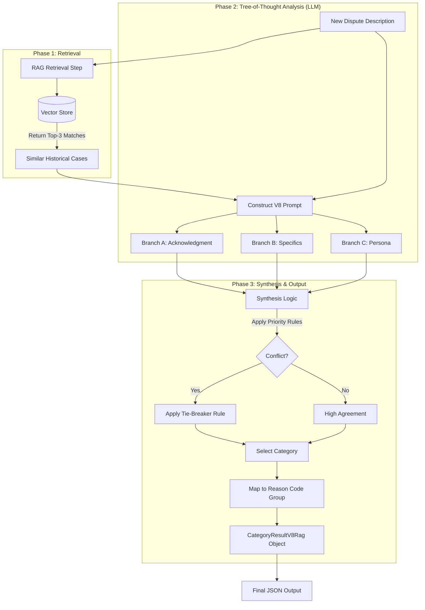
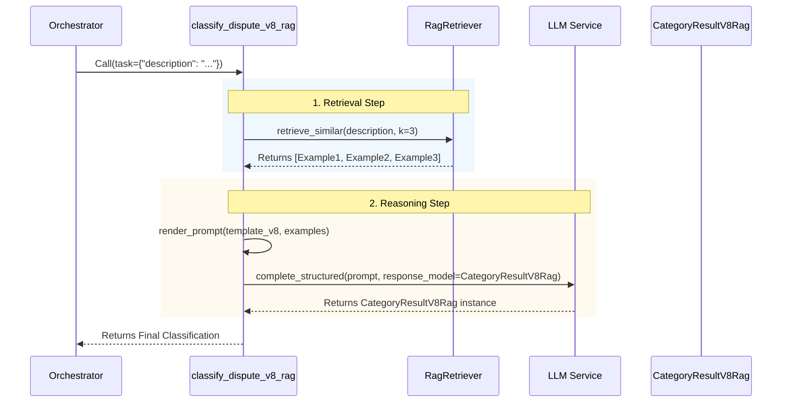

# RAG Classification Deep Dive: Implementing V8

## 1. Introduction: The Need for Institutional Memory

In the evolution of our Dispute Classification Chatbot, we have moved from simple keyword matching (V1) to advanced Tree-of-Thought reasoning (V5) and Hybrid systems (V7). While V7-Hybrid provided a strong framework for reasoning about disputes, it still relied solely on the LLM's internal logic to interpret ambiguous cases.

### The Problem: Reasoning in a Vacuum
Pure reasoning models sometimes struggle with edge cases where the "correct" answer is defined not by logic, but by policy precedent.
*   *Example:* A user says, "I never authorized this $50 charge." Logic says "Fraud". But if our policy says "Specific amounts imply billing disputes," logic might be wrong.
*   *The Gap:* Human analysts solve this by looking up "how we handled similar cases before." The AI lacked this "institutional memory."

### The Solution: V8 RAG (Retrieval-Augmented Generation)
V8 introduces a **Retrieval-Augmented Generation (RAG)** architecture. Instead of asking the AI to reason in a vacuum, we first:
1.  **Retrieve** the top 3 historical disputes that are semantically similar to the current one.
2.  **Inject** these "verified precedents" into the prompt.
3.  **Generate** a classification that aligns with both the logic of the current case and the established patterns of the past.

This approach effectively allows the AI to "copy the homework" of human experts, resolving ambiguity by following precedent.

---

## 2. Architecture Overview

The V8 architecture splits the problem into two distinct phases: **Offline Build** and **Online Retrieval**.

### High-Level Flow



---

## 3. Implementation Journey

### Step 1: Building the Memory (`scripts/build_vector_store.py`)

The foundation of RAG is the **Vector Store**. We need to convert our human-readable Golden Set (JSON) into machine-searchable vectors.

**The Model:** We chose `all-MiniLM-L6-v2`.
*   **Why?** It is lightweight, fast on CPU, and produces compact 384-dimensional embeddings. Ideally suited for a prototype running locally.

**The Artifact:** `backend/data/vector_store.pkl`
We used a simple Python pickle file to store the vectors. This avoids the complexity of a dedicated database for our small dataset (303 items).

```python
# Simplified Logic
model = SentenceTransformer('all-MiniLM-L6-v2')
embeddings = model.encode(descriptions)
vector_store = {
    "embeddings": embeddings,
    "metadata": data,  # The original JSON content
    "model_name": "all-MiniLM-L6-v2"
}
pickle.dump(vector_store, f)
```

### Step 2: The Retrieval Adapter (`backend/adapters/rag_retriever.py`)

We implemented the **Adapter Pattern** to isolate the storage mechanism from the business logic. The `RagRetriever` class handles the complexity of loading the `.pkl` file and performing cosine similarity searches.

**Key Challenge: Device Management**
During implementation, we encountered a mismatch where the query tensor was on the CPU but the stored embeddings were on the MPS (Mac GPU).
*   *Fix:* We added explicit device checks to ensure both tensors are on the same device before computing similarity.

```python
# The retrieval logic
scores = util.cos_sim(query_embedding, self.embeddings)[0]
top_results = sorted(zip(scores, self.metadata), reverse=True)[:k]
```

### Step 3: The Brain (`backend/phases/classify_v8_rag.py`)

This is the core orchestrator. It combines the V7-Hybrid logic with the new retrieval step.

**Sequence of Operations:**
1.  **Retrieve:** Call `RagRetriever` to get similar cases.
2.  **Reason:** Call LLM with the new prompt (including cases).
3.  **Refine:** Call LLM again to select the specific reason code.

**Data Models:**
We utilize Pydantic models to enforce strict reasoning paths:
*   `BranchAResult`: Forces analysis of "Did the user acknowledge the transaction?"
*   `BranchBResult`: Forces identification of "What specifically is wrong?" (Amount vs. Quality vs. Delivery).
*   `BranchCResult`: Forces analysis of the User Persona (Frustrated vs. Fraud-like Accusatory).



### Step 4: The Prompt (`prompts/DisputeClassifier_identify_category_v8_rag.j2`)

The prompt template was updated to include a dynamic section for precedents. This "Few-Shot RAG" approach gives the LLM immediate context.

```jinja2
## Similar Historical Cases

Below are similar disputes from our database with their correct classifications. Use these precedents to guide your decision.


**Precedent {{ loop.index }}** (Similarity: {{ "%.2f"|format(example.similarity_score) }})
Description: "{{ example.description }}"
Verified Category: **{{ example.category }}**

```

---

## 4. Trade-off Analysis: Vector Storage

For this prototype, we used a local file-based approach. However, for production scaling, we evaluated three options:

| Approach | Latency | Scalability | Cost | Recommendation |
| :--- | :--- | :--- | :--- | :--- |
| **File-Based (.pkl)** | **Best** (In-Memory) | Poor (<10k items) | Lowest (Free) | **Current Prototype.** Perfect for small, static golden sets. |
| **Postgres (pgvector)** | Good | High (Millions) | Moderate (RDS) | **Production Default.** Best if you already use Postgres. Keeps vectors with data. |
| **OpenSearch** | Variable | Massive (Billions) | High | **Enterprise.** Best for hybrid search (Text + Vector) or strict compliance needs. |

**Migration Path:**
When the dataset grows beyond memory limits, the `RagRetriever` adapter can be rewritten to query Postgres or OpenSearch without changing the rest of the application.

---

## 5. Evaluation & Verification

### Trace Evaluation
We created `scripts/evaluate_v8_rag_trace.py` to run the full pipeline against the Golden Set.
*   **Observation:** The system successfully retrieved relevant precedents.
*   **Result:** In manual spot-checks, the LLM correctly cited "Precedent 1" in its reasoning when explaining why it chose a specific category.

### Unit Testing
We added `tests/test_phases_classify_v8_rag.py` to verify:
1.  **Mocking:** Ensuring the retriever is called correctly.
2.  **Prompt Rendering:** Verifying that examples are actually injected into the context.
3.  **Schema Validation:** Ensuring the Pydantic models reject invalid outputs.

---

## 6. Conclusion

The V8 RAG implementation successfully adds a "Long-Term Memory" component to the Dispute Classification Chatbot. By grounding decisions in verified historical data, we reduce hallucination and ensure consistency with organizational policy. The architecture is modular (Adapter Pattern), allowing for easy scaling to robust vector databases in the future.

