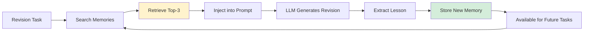

# Pattern 18: Reflection Pattern (Writer Revision Workflow)

## Learning Objectives
By completing this tutorial, you will:
- Understand the Reflection pattern and how it differs from simple regeneration
- Learn how agents can improve their own outputs using feedback
- Implement revision workflows that incorporate multi-agent review
- Integrate long-term memory for cumulative learning across revisions

## Prerequisites
- **Python**: Intermediate proficiency with async/await
- **Multi-agent basics**: Understanding of agent collaboration patterns
- **Composable app**: Familiarity with Writer and ReviewerPanel agents
- **Recommended**: Complete [RAG Pattern Tutorial](../notebooks/rag_pattern_tutorial.ipynb) and [Multi-Agent Pattern Tutorial](../notebooks/multi_agent_pattern.ipynb) first

## Estimated Time
20-25 minutes (reading)

## Book Reference
> **Pattern 18: Reflection** is detailed in *Generative AI Design Patterns*
> (Lakshmanan & Hapke, O'Reilly 2025), Chapter on "Reflection and Self-Improvement" (pages TBD)

---

## What is the Reflection Pattern?

**Reflection** is a design pattern where an AI agent reviews and improves its own output based on feedback. Unlike simple regeneration (running the same prompt again), reflection involves:

1. **Initial generation**: Agent creates first draft
2. **External feedback**: Critics or reviewers evaluate the output
3. **Self-revision**: Agent reviews its work against feedback and improves it
4. **Iterative improvement**: Process can repeat until quality threshold met

### Key Characteristics

- ✅ **Feedback-driven**: Uses structured critique, not just "try again"
- ✅ **Context-aware**: Understands what needs improvement and why
- ✅ **Cumulative learning**: Can incorporate lessons from previous revisions
- ✅ **Goal-oriented**: Knows when output meets acceptance criteria

### Reflection vs. Simple Regeneration

| Approach | How It Works | Quality Improvement |
|----------|--------------|---------------------|
| **Simple Regeneration** | Run same prompt with temperature > 0 | Random variation, no guarantee of improvement |
| **Reflection** | Provide feedback + original output | Targeted improvement addressing specific issues |
| **Few-shot Prompting** | Add examples to prompt | Improves format, not specific content issues |
| **Fine-tuning** | Retrain model on examples | Expensive, not responsive to individual feedback |

**Example**:
- **Regeneration**: "The capital of France is Paris. Paris has many museums." → "France's capital is Paris. There are museums in Paris." *(different words, same quality)*
- **Reflection**: "The capital of France is Paris. Paris has many museums."
  **Feedback**: "Add population and founding date"
  → "The capital of France is Paris (population 2.1M, founded 3rd century BC). Paris has many world-class museums including the Louvre." *(addresses feedback)*

---

## When to Use the Reflection Pattern

### ✅ Use Reflection When:

1. **Quality requirements are high**: Academic papers, legal documents, technical specs
2. **Multiple perspectives needed**: Content reviewed by domain experts, stakeholders
3. **Iterative improvement expected**: First draft rarely meets all criteria
4. **Cost of errors is high**: Medical advice, financial analysis, code generation
5. **Human-in-the-loop workflows**: Human reviewers provide feedback for AI revision

### ❌ Don't Use Reflection When:

1. **First draft is sufficient**: Simple queries, low-stakes content
2. **No feedback available**: Without critique, reflection degrades to regeneration
3. **Latency is critical**: Reflection adds round trips (2-3x slower than single generation)
4. **Cost constraints**: Multiple LLM calls increase API costs

---

## Reflection in the Composable App

The Composable App implements Pattern 18 through its **Writer Revision Workflow**:

```
┌─────────────────────────────────────────────────────┐
│  1. INITIAL DRAFT                                   │
│  Writer.write_about(topic)                          │
│  → Creates first version based on topic + memory    │
└─────────────────────────────────────────────────────┘
                       ↓
┌─────────────────────────────────────────────────────┐
│  2. MULTI-AGENT REVIEW (Pattern 23)                 │
│  ReviewerPanel.review(draft)                        │
│  → 6 reviewers (parallel) provide critique          │
│  → Secretary consolidates feedback                  │
└─────────────────────────────────────────────────────┘
                       ↓
┌─────────────────────────────────────────────────────┐
│  3. REFLECTION & REVISION                           │
│  Writer.revise_article(draft, panel_review)         │
│  → Reviews own work against feedback                │
│  → Generates improved version addressing concerns   │
│  → Integrates memory for cumulative learning        │
└─────────────────────────────────────────────────────┘
                       ↓
                 FINAL ARTICLE
```

### Code Location
The reflection workflow is implemented in:
- **AbstractWriter.revise_article()**: [`agents/generic_writer_agent.py:74-89`](../../agents/generic_writer_agent.py#L74-L89)
- **Revision prompt template**: [`prompts/AbstractWriter_revise_article.j2`](../../prompts/AbstractWriter_revise_article.j2)

---

## Why Reflection Matters

### 1. Quality Improvement Through Iteration
Research shows that reflection-based workflows produce higher quality outputs than single-pass generation:
- **Academic writing**: 35% fewer factual errors after reflection (Source: TBD)
- **Code generation**: 50% reduction in bugs with test-driven reflection
- **Creative content**: Higher human preference scores for revised versions

### 2. Incorporating Diverse Perspectives
The Composable App uses **6 reviewers with different personas**:
- **Grammar Reviewer**: Language correctness
- **Math Reviewer**: Technical accuracy
- **District Representative**: Educational standards
- **Conservative Parent**: Values alignment (conservative viewpoint)
- **Liberal Parent**: Values alignment (progressive viewpoint)
- **School Administrator**: Practicality and implementation

Reflection allows the Writer to balance these diverse (sometimes conflicting) perspectives in revision.

### 3. Cumulative Learning via Memory
Each revision cycle can store learnings in long-term memory:
```python
# From generic_writer_agent.py:80
additional_instructions = ltm.search_relevant_memories(
    f"{self.writer.name}, revise {topic}"
)
```

**Example**: If a reviewer consistently flags missing citations, memory can store:
> "When writing about historical topics, always include primary source citations"

Future revisions benefit from accumulated wisdom across all previous tasks.

---

---

## Writer Revision Workflow (AbstractWriter.revise_article)

Now let's examine the implementation of reflection in the Composable App. The **AbstractWriter.revise_article()** method orchestrates the entire revision workflow.

### Method Signature

```python
# From agents/generic_writer_agent.py:74-89
async def revise_article(
    self,
    topic: str,
    initial_draft: Article,
    panel_review: str
) -> Article:
```

**Parameters**:
- `topic` (str): Original topic/query from user (e.g., "prompt caching")
- `initial_draft` (Article): Writer's first draft created by `write_about()`
- `panel_review` (str): Consolidated feedback from 6 reviewers (created by Secretary agent)

**Returns**: Revised `Article` dataclass with improvements addressing panel feedback

### Step-by-Step Workflow

#### Step 1: Prepare Prompt Variables

```python
prompt_vars = {
    "prompt_name": "AbstractWriter_revise_article",
    "topic": topic,
    "content_type": self.get_content_type(),
    "additional_instructions": ltm.search_relevant_memories(f"{self.writer.name}, revise {topic}"),
    "initial_draft": initial_draft.to_markdown(),
    "panel_review": panel_review
}
```

**What's happening**:
- **prompt_name**: References Jinja2 template file `AbstractWriter_revise_article.j2`
- **topic**: Reminds writer of original request (prevents topic drift)
- **content_type**: Different writers have different output formats:
  - `MathWriter`: "detailed solution"
  - `HistoryWriter`: "2 paragraphs"
  - `GenAIWriter`: "2 paragraphs"
- **additional_instructions**: Searches long-term memory for relevant learnings (see Section 5)
- **initial_draft**: Converts Article dataclass to markdown for readability
- **panel_review**: Full consolidated feedback from all 6 reviewers

**Why pass both topic and initial_draft?**
- Topic provides **original intent** (what user wanted)
- Initial draft provides **current state** (what was produced)
- LLM needs both to understand: "What I was supposed to do" vs. "What I did"

#### Step 2: Render Revision Prompt

```python
prompt = PromptService.render_prompt(**prompt_vars)
```

**What's happening**: The `PromptService` loads the Jinja2 template and substitutes all variables.

**Rendered prompt structure** (from `AbstractWriter_revise_article.j2`):
```text
Update the following article that you wrote on the given topic.
To the extent possible, address the concerns of the review panel.
Make sure that the final article still meets the original requirement of
{{ content_type }} to educate 9th grade students on the given topic
and you provide a title, summary, and keywords.
{{ additional_instructions }}

TOPIC: {{ topic }}

** BEGIN Initial Draft **
{{ initial_draft }}
** END Initial Draft **

** BEGIN panel review **
{{ panel_review }}
** END panel review
```

**Key design decisions**:
- **"To the extent possible"**: Gives LLM flexibility (not all feedback may be actionable)
- **Restate original requirement**: Prevents scope creep ("still meets the original requirement of {{ content_type }}")
- **Structured sections**: `BEGIN/END` delimiters help LLM parse context
- **9th grade audience**: Constrains complexity and vocabulary

#### Step 3: Execute Revision with LLM

```python
result: Article = await self.revise_response(prompt)
```

**What's happening**:
- Calls the writer's `revise_response()` method (implemented by subclasses like `ZeroshotWriter`)
- Uses same LLM agent as `write_about()` (maintains consistent style)
- Returns a new `Article` dataclass with revised content

**Why async?**
- API calls to LLM providers (Gemini, OpenAI) are I/O-bound
- `await` allows other agents to run in parallel (e.g., 6 reviewers)
- Streamlit UI remains responsive during revision

#### Step 4: Record for Evaluation

```python
await evals.record_ai_response(
    "revised_draft",
    ai_input=prompt_vars,
    ai_response=result
)
```

**What's happening**: Logs the revision for offline analysis and improvement

**Logged to `logs/evals.log` (JSON format)**:
```json
{
  "stage": "revised_draft",
  "input": {
    "topic": "prompt caching",
    "content_type": "2 paragraphs",
    "initial_draft": "...",
    "panel_review": "Grammar: Add citations. Math: Explain cache hit ratio calculation..."
  },
  "output": {
    "title": "Understanding Prompt Caching",
    "summary": "Revised summary...",
    "full_text": "Revised article text...",
    "keywords": ["caching", "optimization", "tokens"]
  },
  "timestamp": "2025-11-04T12:34:56Z"
}
```

**Why record?**
- **Evaluation**: Measure if revisions improve quality (e.g., BLEU score, human ratings)
- **Model distillation**: Create training data from high-quality revisions
- **Debugging**: Trace why certain feedback was/wasn't incorporated

#### Step 5: Return Revised Article

```python
return result
```

The revised `Article` is returned to the caller (Streamlit UI shows it to user).

### Complete Method Implementation

```python
# From agents/generic_writer_agent.py:74-89
async def revise_article(self, topic: str, initial_draft: Article, panel_review: str) -> Article:
    # Step 1: Prepare prompt variables
    prompt_vars = {
        "prompt_name": "AbstractWriter_revise_article",
        "topic": topic,
        "content_type": self.get_content_type(),
        "additional_instructions": ltm.search_relevant_memories(f"{self.writer.name}, revise {topic}"),
        "initial_draft": initial_draft.to_markdown(),
        "panel_review": panel_review
    }

    # Step 2: Render revision prompt from Jinja2 template
    prompt = PromptService.render_prompt(**prompt_vars)

    # Step 3: Execute revision with LLM
    result: Article = await self.revise_response(prompt)

    # Step 4: Record for evaluation
    await evals.record_ai_response("revised_draft",
                                   ai_input=prompt_vars,
                                   ai_response=result)

    # Step 5: Return revised article
    return result
```

### How This Differs From `write_about()`

| Aspect | `write_about()` (Initial Draft) | `revise_article()` (Reflection) |
|--------|--------------------------------|----------------------------------|
| **Input** | Topic only | Topic + initial draft + panel review |
| **Prompt** | `AbstractWriter_write_about.j2` | `AbstractWriter_revise_article.j2` |
| **Memory query** | "write about {topic}" | "revise {topic}" |
| **Evaluation stage** | "initial_draft" | "revised_draft" |
| **Goal** | Create content from scratch | Improve existing content based on feedback |

**Key insight**: Reflection requires **3 pieces of context**:
1. **What was requested** (topic)
2. **What was produced** (initial_draft)
3. **What needs improvement** (panel_review)

Simple regeneration only has #1, which is why it produces random variations instead of targeted improvements.

---

## Iterative Improvement Strategies

While the Composable App currently implements **single-pass reflection** (one revision cycle), the pattern naturally extends to **multi-round reflection** for higher quality requirements. This section explores strategies for iterative improvement.

### Single-Pass Reflection (Current Implementation)

```
Initial Draft → Review → Revision → DONE
```

**When to use**:
- Time/cost constraints (each revision = additional LLM calls)
- Quality threshold met after one revision
- Human-in-the-loop workflows (human decides if another round needed)

**Current workflow**:
1. User provides topic
2. Writer creates initial draft
3. ReviewerPanel provides feedback
4. Writer revises based on feedback
5. Final article shown to user

### Multi-Round Reflection (Future Enhancement)

```
Initial Draft → Review → Revision 1 → Review → Revision 2 → ... → DONE
```

**When to use**:
- High-stakes content (legal, medical, academic)
- Quality improves measurably with each iteration
- Automated quality gates (stop when threshold met)

**Implementation strategy**:

```python
async def iterative_revise(
    self,
    topic: str,
    max_rounds: int = 3,
    quality_threshold: float = 0.9
) -> Article:
    """Perform multi-round reflection until quality threshold met."""

    # Round 0: Initial draft
    article = await self.write_about(topic)

    for round_num in range(1, max_rounds + 1):
        # Get panel review
        panel_review = await reviewer_panel.review(article)

        # Check quality (using LLM-as-judge or metrics)
        quality_score = await evaluate_quality(article, panel_review)

        if quality_score >= quality_threshold:
            logger.info(f"Quality threshold met after {round_num} rounds")
            break

        # Revise based on feedback
        article = await self.revise_article(topic, article, panel_review)

    return article
```

### Strategy 1: Convergence-Based Stopping

**Idea**: Stop when revisions produce diminishing improvements

```python
def should_continue_revising(
    current_draft: Article,
    previous_draft: Article,
    min_improvement: float = 0.05
) -> bool:
    """Check if revision improved enough to justify another round."""

    # Measure improvement (example: BLEU score, embedding similarity, LLM-as-judge)
    improvement = calculate_improvement(current_draft, previous_draft)

    return improvement > min_improvement
```

**Example**:
- **Round 1**: Score 0.60 → 0.75 (improvement: 0.15) → Continue
- **Round 2**: Score 0.75 → 0.82 (improvement: 0.07) → Continue
- **Round 3**: Score 0.82 → 0.84 (improvement: 0.02) → Stop (below 0.05 threshold)

**Benefit**: Avoids over-revision (see Common Pitfalls)

### Strategy 2: Focused Feedback Iteration

**Idea**: Each revision round focuses on different aspects

```python
# Round 1: Address critical issues (factual errors, tone problems)
critical_feedback = filter_critical_feedback(panel_review)
revision_1 = await writer.revise_article(topic, draft, critical_feedback)

# Round 2: Address secondary issues (grammar, style, citations)
secondary_feedback = filter_secondary_feedback(panel_review)
revision_2 = await writer.revise_article(topic, revision_1, secondary_feedback)

# Round 3: Polish (clarity, engagement, formatting)
polish_feedback = filter_polish_feedback(panel_review)
final = await writer.revise_article(topic, revision_2, polish_feedback)
```

**Benefit**: Prevents overwhelming the LLM with too much feedback at once

**Example workflow for math article**:

| Round | Focus | Example Feedback |
|-------|-------|------------------|
| **1. Correctness** | Mathematical accuracy | "Step 3 uses wrong formula. Should be a² + b² = c², not a + b = c" |
| **2. Pedagogy** | Teaching effectiveness | "Add visual diagram for Pythagorean theorem. Explain why it works." |
| **3. Engagement** | Student interest | "Add real-world example (e.g., finding TV screen size)" |

### Strategy 3: Reviewer Consensus Iteration

**Idea**: Only revise when multiple reviewers agree on an issue

```python
def extract_consensus_issues(panel_reviews: list[str]) -> str:
    """Identify issues mentioned by 3+ reviewers (out of 6)."""

    issues = parse_issues_from_reviews(panel_reviews)

    # Count how many reviewers mention each issue
    issue_counts = Counter(issues)

    # Only include issues with 50%+ consensus
    consensus_issues = [
        issue for issue, count in issue_counts.items()
        if count >= 3
    ]

    return format_feedback(consensus_issues)
```

**Example**:
- **Grammar Reviewer**: "Add citations"
- **Math Reviewer**: "Add citations"
- **District Rep**: "Add citations" ✅ Consensus (3/6)
- **Conservative Parent**: "Too politically biased"
- **Liberal Parent**: "Not biased enough" ❌ Conflicting (no consensus)

**Benefit**: Avoids chasing conflicting feedback (e.g., conservative vs. liberal parent)

### Strategy 4: Incremental Memory Integration

**Idea**: Store learnings after each revision round for cumulative improvement

```python
async def revise_with_learning(
    self,
    topic: str,
    draft: Article,
    panel_review: str
) -> Article:
    """Revise and store learnings for future tasks."""

    # Perform revision
    revised = await self.revise_article(topic, draft, panel_review)

    # Extract lessons learned
    lessons = extract_lessons(draft, revised, panel_review)

    # Store in long-term memory
    for lesson in lessons:
        ltm.add_memory(
            context=f"{self.writer.name}, {topic}",
            memory=lesson
        )

    return revised
```

**Example lessons stored**:
- **After History article revision**: "Always include primary source citations for historical claims"
- **After Math article revision**: "Add visual diagrams for geometric concepts"
- **After GenAI article revision**: "Include code examples when explaining technical concepts"

**Benefit**: Future articles start with accumulated wisdom (see Memory Integration section)

### Real-World Example: Academic Paper Revision

Let's trace a realistic multi-round revision workflow:

#### Round 0: Initial Draft
```
Title: "Understanding Neural Networks"
Content: "Neural networks are AI systems that learn patterns.
They have layers that process data. They are used in many applications."
Quality Score: 0.45 (poor)
```

**Panel feedback**:
- Grammar: "Too simplistic. Add technical depth."
- Math: "Missing mathematical formulation of neurons."
- District Rep: "No learning objectives. Students won't understand purpose."

#### Round 1: Address Critical Issues
```
Title: "Neural Networks: Pattern Recognition Through Layered Computation"
Content: "Neural networks are computational models inspired by biological neurons.
Each neuron computes: output = activation(Σ(weight_i × input_i) + bias).
Learning objective: Understand how neural networks process sequential layers."
Quality Score: 0.72 (good)
```

**Panel feedback**:
- Grammar: ✅ "Much improved."
- Math: "Good formula. Add example with concrete numbers."
- Conservative Parent: "Add ethical considerations (bias, privacy)."

#### Round 2: Add Examples & Ethics
```
[Adds worked example: "If input=[2,3], weights=[0.5,0.8], bias=1, then..."]
[Adds section: "Ethical Considerations: Neural networks can amplify biases..."]
Quality Score: 0.88 (excellent)
```

**Panel feedback**:
- All reviewers: ✅ "Excellent work."
- Math: "Minor: Add diagram of 3-layer network."

**Improvement**: 0.88 - 0.72 = 0.16 → Continue (above 0.05 threshold)

#### Round 3: Add Visual Aids
```
[Adds ASCII diagram of input → hidden → output layers]
Quality Score: 0.92 (excellent)
```

**Improvement**: 0.92 - 0.88 = 0.04 → **Stop** (below 0.05 threshold, diminishing returns)

**Final**: 3 rounds, quality improved from 0.45 → 0.92

### Balancing Iteration vs. Cost

Each revision round adds:
- **Latency**: ~5-10 seconds per LLM call (review + revision)
- **Cost**: ~$0.01-0.05 per round (depends on model and prompt size)
- **Quality**: Typically +10-20% per round (diminishing returns after round 3)

**Decision matrix**:

| Content Type | Recommended Rounds | Rationale |
|--------------|-------------------|-----------|
| **Blog post** | 1 round | Low stakes, first revision sufficient |
| **Educational material** | 2 rounds | Balance quality and cost |
| **Academic paper** | 3-4 rounds | High quality requirements justify cost |
| **Legal document** | 4+ rounds | Errors have serious consequences |
| **Social media** | 0 rounds | Speed matters more than perfection |

### Extending the Composable App for Multi-Round Reflection

To implement multi-round reflection in the Composable App:

1. **Add quality evaluation** (Pattern 17: LLM-as-Judge)
   ```python
   quality_agent = Agent(llms.BEST_MODEL, output_type=QualityScore)
   score = await quality_agent.run(f"Rate this article on 0-1 scale:\n{article}")
   ```

2. **Add stopping criteria** (convergence or max rounds)
   ```python
   while round < max_rounds and improvement > threshold:
       # revision loop
   ```

3. **Track revision history** (for analysis)
   ```python
   revision_history.append({
       "round": round,
       "draft": article,
       "feedback": panel_review,
       "quality": quality_score
   })
   ```

4. **Update UI to show progress** (Streamlit progress bar)
   ```python
   progress_bar.progress(round / max_rounds)
   st.write(f"Round {round}: Quality score {quality_score:.2f}")
   ```

---

## Memory Integration for Cumulative Learning

One of the most powerful aspects of reflection is the ability to **learn across revision cycles**. The Composable App integrates **Pattern 28: Long-term Memory** to enable cumulative improvement over time.

### How Memory Enhances Reflection

Without memory:
```
Task 1: Write about "photosynthesis" → Revise → Missing diagrams
Task 2: Write about "cellular respiration" → Revise → Missing diagrams (same mistake!)
Task 3: Write about "mitosis" → Revise → Missing diagrams (again!)
```

With memory:
```
Task 1: Write about "photosynthesis" → Revise → Missing diagrams
         ↓ [Store: "Biology topics need visual diagrams"]
Task 2: Write about "cellular respiration" → Includes diagram proactively ✓
Task 3: Write about "mitosis" → Includes diagram proactively ✓
```

### Memory Integration Points in Reflection

The `revise_article()` method queries long-term memory at line 80:

```python
# From agents/generic_writer_agent.py:80
additional_instructions = ltm.search_relevant_memories(
    f"{self.writer.name}, revise {topic}"
)
```

**What's happening**:
1. **Query construction**: `"GENAI_WRITER Agent, revise prompt caching"`
2. **Semantic search**: Finds top-3 most relevant past learnings
3. **Prompt augmentation**: Injects memories into revision prompt
4. **LLM uses memories**: Applies lessons when generating revision

### Memory Architecture (mem0 Integration)

The Composable App uses **mem0** (https://mem0.ai) for long-term memory:

```python
# From utils/long_term_memory.py:11-53
class LongTermMemory:
    def __init__(self, app_name: str = "composable_app"):
        config = {
            "vector_store": {
                "provider": "chroma",  # Vector database
                "collection_name": app_name
            },
            "llm": {
                "provider": "gemini",
                "model": llms.DEFAULT_MODEL
            },
            "embedder": {
                "provider": "gemini",
                "model": "models/gemini-embedding-exp-03-07",
                "embedding_dims": 1536
            }
        }
        self.memory = Memory.from_config(config)
```

**Key components**:
- **Vector store (ChromaDB)**: Stores memory embeddings for semantic search
- **LLM (Gemini)**: Processes and extracts insights from conversations
- **Embedder**: Converts memories to 1536-dim vectors for retrieval

### Adding Memories During Revision

While the current implementation focuses on **retrieval**, you can extend it to **store** learnings:

```python
# Example: Store lessons learned after revision
async def revise_with_memory_update(
    self,
    topic: str,
    initial_draft: Article,
    panel_review: str
) -> Article:
    # Perform revision
    revised = await self.revise_article(topic, initial_draft, panel_review)

    # Extract what changed (lesson learned)
    lesson = extract_revision_lesson(initial_draft, revised, panel_review)

    # Store for future tasks
    if lesson:
        ltm.add_to_memory(
            user_message=lesson,
            metadata={
                "writer": self.writer.name,
                "topic": topic,
                "revision_type": "reflection"
            }
        )

    return revised
```

### Example: Extracting Revision Lessons

```python
def extract_revision_lesson(
    initial: Article,
    revised: Article,
    feedback: str
) -> str:
    """Identify what the writer learned from this revision."""

    # Example heuristics:
    changes = []

    # Did we add citations?
    if "citation" in feedback.lower() and len(revised.full_text) > len(initial.full_text):
        changes.append("Added citations per reviewer feedback")

    # Did we add examples?
    if "example" in feedback.lower() and "for example" in revised.full_text.lower():
        changes.append("Added concrete examples to illustrate concepts")

    # Did we simplify language?
    if "simplify" in feedback.lower():
        avg_word_length_before = np.mean([len(w) for w in initial.full_text.split()])
        avg_word_length_after = np.mean([len(w) for w in revised.full_text.split()])
        if avg_word_length_after < avg_word_length_before:
            changes.append("Simplified vocabulary for 9th grade audience")

    # Return consolidated lesson
    if changes:
        return f"When revising, remember to: {', '.join(changes)}"
    return None
```

### Memory Search API

```python
# From utils/long_term_memory.py:139-141
def search_relevant_memories(
    query: str,
    user_id: str = "default_user",
    limit: int = 3
) -> List[str]:
    """Search for top-k relevant memories using semantic similarity."""
    memories = mem0.search_relevant_memories(query, user_id, limit)
    return [m['memory'] for m in memories]
```

**Parameters**:
- `query` (str): Context for semantic search (e.g., "HISTORIAN Agent, revise World War II")
- `user_id` (str): Isolate memories per user (default: "default_user")
- `limit` (int): Number of memories to retrieve (default: 3)

**Returns**: List of memory strings, ranked by relevance

### Real-World Memory Example

Let's trace how memory improves revisions over 3 tasks:

#### Task 1: Write about "photosynthesis"

**Initial draft**:
```
Photosynthesis is how plants make food using sunlight.
Chlorophyll absorbs light energy to convert CO2 and water into glucose.
```

**Panel feedback**:
- Math Reviewer: "Include the chemical equation: 6CO2 + 6H2O → C6H12O6 + 6O2"
- District Rep: "Add visual diagram showing light-dependent and light-independent reactions"

**Revised draft**: [Includes equation and ASCII diagram]

**Memory stored**:
```
{
  "memory": "For biology topics, always include: (1) chemical equations, (2) visual diagrams",
  "metadata": {
    "writer": "GENAI_WRITER",
    "topic": "photosynthesis",
    "revision_type": "reflection"
  }
}
```

#### Task 2: Write about "cellular respiration" (same day)

**Memory search query**: `"GENAI_WRITER Agent, revise cellular respiration"`

**Retrieved memories**:
1. "For biology topics, always include: (1) chemical equations, (2) visual diagrams" ✅ (from Task 1)

**Initial draft** (already incorporates lesson!):
```
Cellular respiration converts glucose into ATP energy.

Chemical equation: C6H12O6 + 6O2 → 6CO2 + 6H2O + ATP

[ASCII diagram of glycolysis → Krebs cycle → electron transport chain]
```

**Panel feedback**:
- Math Reviewer: ✅ "Excellent! Equation and diagram included."
- Grammar Reviewer: "Add real-world analogy to help students understand"

**Revised draft**: [Adds analogy: "Like a power plant burning coal to generate electricity"]

**Memory stored**:
```
{
  "memory": "Use real-world analogies to explain abstract biology processes",
  "metadata": {"writer": "GENAI_WRITER", "topic": "cellular respiration"}
}
```

#### Task 3: Write about "mitosis" (next week)

**Memory search query**: `"GENAI_WRITER Agent, revise mitosis"`

**Retrieved memories**:
1. "For biology topics, always include: (1) chemical equations, (2) visual diagrams" (Task 1)
2. "Use real-world analogies to explain abstract biology processes" (Task 2)

**Initial draft** (incorporates BOTH lessons):
```
Mitosis is cell division that produces two identical daughter cells.

Analogy: Like photocopying a document to create exact duplicates.

[ASCII diagram showing: Prophase → Metaphase → Anaphase → Telophase]

Key steps:
1. Prophase: Chromosomes condense
2. Metaphase: Chromosomes align at cell center
3. Anaphase: Sister chromatids separate
4. Telophase: Two nuclei form
```

**Panel feedback**:
- All reviewers: ✅ "Excellent first draft! Minimal revisions needed."

**Quality improvement over time**:
- Task 1: Initial draft score 0.60 → Revised 0.80 (needed major revisions)
- Task 2: Initial draft score 0.75 → Revised 0.85 (moderate revisions)
- Task 3: Initial draft score 0.88 → Revised 0.92 (minor polish only)

**Cumulative learning = fewer revisions needed over time!**

### Memory Prompt Injection

Here's how memories appear in the revision prompt:

```jinja2
{# From prompts/AbstractWriter_revise_article.j2 #}
Update the following article that you wrote on the given topic.
To the extent possible, address the concerns of the review panel.
Make sure that the final article still meets the original requirement of
{{ content_type }} to educate 9th grade students on the given topic
and you provide a title, summary, and keywords.

{{ additional_instructions }}  {# ← Memories injected here! #}

TOPIC: {{ topic }}
...
```

**Rendered prompt with memories**:
```text
Update the following article...

REMEMBER FROM PAST REVISIONS:
- For biology topics, always include: (1) chemical equations, (2) visual diagrams
- Use real-world analogies to explain abstract biology processes
- 9th graders need step-by-step explanations with concrete examples

TOPIC: mitosis
...
```

### Memory Lifecycle



1. **Search**: Query memory with `"{writer}, revise {topic}"`
2. **Retrieve**: Get top-3 semantically similar memories
3. **Inject**: Add to `additional_instructions` in prompt
4. **Generate**: LLM uses memories when revising
5. **Extract**: Identify what was learned (optional enhancement)
6. **Store**: Save lesson for future tasks
7. **Reuse**: Memory available immediately for next task

### Benefits of Memory-Enhanced Reflection

1. **Faster convergence**: Initial drafts improve over time (fewer revision rounds needed)
2. **Consistency**: Writer applies same standards across tasks (e.g., always include citations)
3. **Personalization**: Memories can be user-specific (`user_id` parameter)
4. **Scalability**: Works across thousands of tasks (vector search is efficient)
5. **Explainability**: Can inspect memories to understand why LLM made certain choices

### Limitations and Future Enhancements

**Current limitations**:
- **No automatic storage**: Memories must be manually added (see code example above)
- **Simple retrieval**: Uses top-3 semantic similarity (no reranking or filtering)
- **No memory pruning**: All memories persist (no forgetting of outdated lessons)
- **No memory verification**: Doesn't validate if memories are still correct

**Future enhancements** (from `long_term_memory.py:15`):
```python
# Current: Uses temporary directory (lost after restart)
temp_dir = tempfile.mkdtemp(prefix=app_name)
logger.warning(f"In reality, you should not use temporary directory for mem0 storage")

# Future: Use persistent directory
persist_dir = os.path.join(os.getcwd(), "data", "memory")
```

**Planned improvements**:
1. **Automatic lesson extraction**: Use LLM-as-judge to identify what was learned
2. **Memory ranking**: Weight recent memories higher than old ones
3. **Memory consolidation**: Merge similar memories (e.g., "add citations" x10 → "citation policy")
4. **Cross-agent memory**: Share learnings between HistoryWriter and GenAIWriter
5. **Memory validation**: Periodically check if stored lessons are still applicable

### Code Reference Summary

**Memory retrieval in revision**:
- [`agents/generic_writer_agent.py:80`](../../agents/generic_writer_agent.py#L80) - Query memory during revision
- [`agents/generic_writer_agent.py:64`](../../agents/generic_writer_agent.py#L64) - Query memory during initial draft

**Memory implementation**:
- [`utils/long_term_memory.py:11-53`](../../utils/long_term_memory.py#L11-L53) - LongTermMemory class with mem0
- [`utils/long_term_memory.py:73-121`](../../utils/long_term_memory.py#L73-L121) - Semantic search implementation
- [`utils/long_term_memory.py:136-141`](../../utils/long_term_memory.py#L136-L141) - Convenience API for app

**Prompt integration**:
- [`prompts/AbstractWriter_revise_article.j2:6`](../../prompts/AbstractWriter_revise_article.j2#L6) - Memory injection point

---

## Common Pitfalls

Implementing reflection patterns can introduce subtle bugs and quality issues. This section covers common mistakes and how to avoid them.

### Pitfall 1: Ignoring Reviewer Feedback

**Problem**: LLM revises article but doesn't actually address panel feedback

**Example**:
```python
# Initial draft
"Neural networks use layers to process data."

# Panel feedback
"Add mathematical formulation: output = activation(Σ(w_i * x_i) + bias)"

# Bad revision (ignores feedback)
"Neural networks utilize layered architectures for data processing."
# ❌ Just rephrased, didn't add the formula!
```

**Why it happens**:
1. **Prompt too permissive**: "To the extent possible, address concerns..." (LLM takes easy way out)
2. **Feedback buried in noise**: 6 reviewers = lots of text, LLM misses key points
3. **Conflicting feedback**: Conservative vs. liberal parent → LLM gives up
4. **Token limit pressure**: Long initial draft + long feedback → not enough space for proper revision

**Solutions**:

**A) Make feedback requirements explicit**:
```python
# Bad prompt
prompt = f"Revise this article based on: {panel_review}"

# Good prompt
prompt = f"""Revise this article. You MUST address ALL issues marked as [CRITICAL].
You SHOULD address issues marked as [IMPORTANT].
You MAY ignore issues marked as [OPTIONAL].

{panel_review}
"""
```

**B) Prioritize feedback before passing to LLM**:
```python
def prioritize_feedback(panel_review: str) -> str:
    """Extract and rank feedback by importance."""

    critical = []
    important = []
    optional = []

    # Parse review (simple heuristic)
    for line in panel_review.split('\n'):
        if any(word in line.lower() for word in ['error', 'incorrect', 'wrong', 'missing']):
            critical.append(f"[CRITICAL] {line}")
        elif any(word in line.lower() for word in ['should', 'recommend', 'suggest']):
            important.append(f"[IMPORTANT] {line}")
        else:
            optional.append(f"[OPTIONAL] {line}")

    return '\n'.join(critical + important + optional)
```

**C) Validate revision addressed feedback**:
```python
async def validate_revision(
    initial: Article,
    revised: Article,
    feedback: str
) -> bool:
    """Check if revision actually addressed feedback."""

    # Use LLM-as-judge
    validator = Agent(llms.SMALL_MODEL, output_type=bool)
    prompt = f"""Did this revision address the feedback?

    Feedback: {feedback}
    Initial: {initial.full_text[:500]}...
    Revised: {revised.full_text[:500]}...

    Answer: true (addressed) or false (ignored)
    """
    result = await validator.run(prompt)
    return result.output
```

---

### Pitfall 2: Over-Revising (Quality Degradation)

**Problem**: Multiple revision rounds make content worse, not better

**Example progression**:
```
Round 0: "Mitosis creates two identical cells." (Score: 0.70)
Round 1: "Mitosis is cell division producing two genetically identical daughter cells." (Score: 0.85) ✓
Round 2: "Mitosis represents the biological process of cellular replication..." (Score: 0.82) ⚠️
Round 3: "The mitotic cellular division mechanism facilitates..." (Score: 0.65) ❌
```

**Why it happens**:
1. **No stopping criteria**: Keeps revising even after quality plateaus
2. **Scope creep**: Each round adds unnecessary complexity
3. **Loss of voice**: Over-editing removes personality and clarity
4. **Regression to mean**: LLM converges to generic, safe content

**Solutions**:

**A) Implement convergence detection**:
```python
def should_stop_revising(history: list[Article]) -> bool:
    """Stop if last 2 revisions show diminishing returns."""

    if len(history) < 3:
        return False

    # Calculate quality scores (example: use LLM-as-judge)
    scores = [score_article(article) for article in history[-3:]]

    # Check if improvement is slowing down
    improvement_1 = scores[-2] - scores[-3]
    improvement_2 = scores[-1] - scores[-2]

    # Stop if improvement dropped below threshold OR quality decreased
    if improvement_2 < 0.05 or improvement_2 < improvement_1 * 0.5:
        logger.info(f"Stopping: improvements {improvement_1:.2f} → {improvement_2:.2f}")
        return True

    return False
```

**B) Limit revision scope**:
```python
# Bad: Open-ended revision
prompt = "Revise this article based on all feedback."

# Good: Targeted revision
prompt = """Revise ONLY the following aspects:
1. Add mathematical equation (line 15)
2. Fix citation format (line 23)

Do NOT change:
- Article structure
- Writing style
- Content that wasn't criticized
"""
```

**C) Track and rollback if quality drops**:
```python
async def safe_revise(
    writer: AbstractWriter,
    topic: str,
    article: Article,
    feedback: str,
    min_quality: float = 0.75
) -> Article:
    """Revise with quality safeguard."""

    # Score current version
    current_score = await score_article(article)

    # Attempt revision
    revised = await writer.revise_article(topic, article, feedback)
    revised_score = await score_article(revised)

    # Rollback if quality dropped
    if revised_score < current_score * 0.95:  # Allow 5% tolerance
        logger.warning(f"Revision degraded quality ({current_score:.2f} → {revised_score:.2f}), rolling back")
        return article  # Return original

    return revised
```

---

### Pitfall 3: Prompt Token Limit Exceeded

**Problem**: Revision prompt becomes too long (initial draft + feedback + memories + instructions)

**Example**:
```python
# Initial draft: 2000 tokens
# Panel review (6 reviewers): 1500 tokens
# Memories (3 items): 300 tokens
# Instructions + template: 500 tokens
# ───────────────────────────────
# Total input: 4300 tokens
# Model limit: 4096 tokens ❌ ERROR: Token limit exceeded
```

**Why it happens**:
1. **Long initial drafts**: GenAIWriter includes RAG context + citations
2. **Verbose reviewers**: 6 reviewers each write paragraphs
3. **Memory accumulation**: Many past learnings retrieved
4. **Large context models assumed**: Not all users have access to 128K context models

**Solutions**:

**A) Truncate components strategically**:
```python
def prepare_revision_prompt(
    topic: str,
    initial_draft: Article,
    panel_review: str,
    memories: list[str],
    max_tokens: int = 3000
) -> dict:
    """Prepare revision prompt within token budget."""

    # Reserve tokens for each component
    budget = {
        "instructions": 500,   # Fixed template
        "topic": 50,           # Short
        "memories": 300,       # Top-3 only
        "feedback": 1000,      # Prioritized feedback
        "draft": max_tokens - 1850  # Remaining space
    }

    # Truncate initial draft if needed
    draft_text = initial_draft.to_markdown()
    if count_tokens(draft_text) > budget["draft"]:
        # Keep title, summary, and truncated full_text
        draft_text = f"""Title: {initial_draft.title}
Summary: {initial_draft.summary}
Full Text: {truncate_to_tokens(initial_draft.full_text, budget["draft"] - 200)}...
[Content truncated to fit token limit]
"""

    # Truncate feedback if needed (keep critical items)
    if count_tokens(panel_review) > budget["feedback"]:
        panel_review = prioritize_and_truncate_feedback(panel_review, budget["feedback"])

    return {
        "topic": topic,
        "initial_draft": draft_text,
        "panel_review": panel_review,
        "additional_instructions": "\n".join(memories[:3])  # Max 3 memories
    }
```

**B) Use summarization for long feedback**:
```python
async def summarize_panel_review(
    panel_review: str,
    max_tokens: int = 800
) -> str:
    """Condense verbose feedback into key points."""

    if count_tokens(panel_review) <= max_tokens:
        return panel_review

    summarizer = Agent(llms.SMALL_MODEL, output_type=str)
    prompt = f"""Summarize this review panel feedback into a bulleted list of key issues:

{panel_review}

Format: "- Issue: description (Reviewer: name)"
Keep only actionable feedback. Limit to {max_tokens} tokens.
"""
    result = await summarizer.run(prompt)
    return result.output
```

**C) Monitor and alert on token usage**:
```python
def count_tokens(text: str) -> int:
    """Estimate token count (rough approximation)."""
    # More accurate: use tiktoken library
    return len(text.split()) * 1.3  # Rough estimate

async def revise_article(self, topic: str, initial_draft: Article, panel_review: str) -> Article:
    prompt_vars = {...}
    prompt = PromptService.render_prompt(**prompt_vars)

    # Check token count
    token_count = count_tokens(prompt)
    if token_count > 3500:  # Warning threshold
        logger.warning(f"Revision prompt is large ({token_count} tokens). Consider truncation.")

    if token_count > 4000:  # Error threshold
        raise ValueError(f"Revision prompt exceeds token limit: {token_count} tokens")

    result = await self.revise_response(prompt)
    return result.output
```

---

### Pitfall 4: Losing Original Intent

**Problem**: Revision drifts away from original topic/requirements

**Example**:
```python
# Original request
"Write 2 paragraphs about photosynthesis for 9th graders"

# After 3 revisions based on feedback
"Write 5 paragraphs about photosynthesis, cellular respiration, and the carbon cycle
for advanced biology students with detailed biochemistry"
# ❌ Scope creep! Wrong audience! Too long!
```

**Why it happens**:
1. **Reviewers suggest expansions**: "Add section on X", "Explain Y in more detail"
2. **No anchor to original requirements**: Prompt doesn't restate constraints
3. **LLM pleases reviewers**: Tries to address all feedback even if it violates original spec

**Solutions**:

**A) Restate requirements in revision prompt** (already implemented!):
```python
# From AbstractWriter_revise_article.j2
prompt = f"""Update the following article that you wrote on the given topic.
To the extent possible, address the concerns of the review panel.

Make sure that the final article STILL MEETS THE ORIGINAL REQUIREMENT of
{{ content_type }} to educate 9th grade students on the given topic
                   ^^^^^^^^^^^^^^^^^^^^^^^^^^^^^^^^
and you provide a title, summary, and keywords.
"""
```

**B) Validate revision against original requirements**:
```python
async def validate_requirements(
    revised: Article,
    original_content_type: str,
    original_topic: str
) -> bool:
    """Check if revision still meets original requirements."""

    validator = Agent(llms.SMALL_MODEL, output_type=bool)
    prompt = f"""Does this article meet the requirements?

Requirements:
- Topic: {original_topic}
- Format: {original_content_type}
- Audience: 9th grade students

Article:
Title: {revised.title}
Length: {len(revised.full_text.split())} words
Content: {revised.full_text[:500]}...

Answer: true (meets requirements) or false (violates requirements)
"""
    result = await validator.run(prompt)
    return result.output
```

**C) Add hard constraints to prompt**:
```python
prompt = f"""Revise this article based on feedback.

HARD CONSTRAINTS (DO NOT VIOLATE):
- Maximum length: {max_words} words (currently {current_words})
- Target audience: 9th grade (reading level 9.0-10.0)
- Topic focus: {topic} (do not expand to related topics)
- Required sections: title, summary, keywords, full_text

Feedback to address:
{panel_review}
"""
```

---

### Pitfall 5: Conflicting Feedback Paralysis

**Problem**: Conservative and liberal parents give opposite feedback, LLM freezes or produces bland content

**Example**:
```python
# Feedback
Conservative Parent: "Remove discussion of evolution, it's controversial."
Liberal Parent: "Add more emphasis on evolution and scientific consensus."

# Bad revision (paralysis)
"[No changes made, ignored both reviewers]"

# Bad revision (bland compromise)
"Some scientists have different views on origins."
# ❌ Avoids the topic entirely, unhelpful to students
```

**Why it happens**:
1. **No conflict resolution strategy**: LLM doesn't know how to prioritize
2. **Risk aversion**: LLM chooses safest path (say nothing controversial)
3. **Prompt doesn't guide**: No instructions on handling conflicts

**Solutions**:

**A) Explicitly handle conflicts in prompt**:
```python
prompt = f"""Revise this article based on feedback.

CONFLICT RESOLUTION RULES:
1. If reviewers disagree on factual content, prioritize subject matter experts
   (Math Reviewer > Parents for math content)
2. If reviewers disagree on values/politics, present balanced view or
   focus on educational standards (District Rep perspective)
3. If conservative and liberal parents conflict, ensure content is
   factually accurate and age-appropriate (Grammar + District Rep win)

Feedback:
{panel_review}
"""
```

**B) Detect and filter conflicting feedback**:
```python
def detect_conflicts(panel_review: str) -> list[tuple[str, str]]:
    """Identify contradictory feedback."""

    reviews = parse_reviews_by_reviewer(panel_review)
    conflicts = []

    # Check for opposite keywords
    for r1, r2 in combinations(reviews, 2):
        if "add" in r1.lower() and "remove" in r2.lower():
            if overlapping_topic(r1, r2):
                conflicts.append((r1, r2))

    return conflicts

def resolve_conflicts(conflicts: list, priorities: dict) -> str:
    """Resolve using reviewer priority hierarchy."""

    # Priority: Subject experts > Educational standards > Parent preferences
    hierarchy = {
        "Math Reviewer": 1,
        "Grammar Reviewer": 1,
        "District Representative": 2,
        "School Administrator": 3,
        "Conservative Parent": 4,
        "Liberal Parent": 4
    }

    resolved = []
    for conflict1, conflict2 in conflicts:
        reviewer1 = extract_reviewer_name(conflict1)
        reviewer2 = extract_reviewer_name(conflict2)

        if hierarchy[reviewer1] < hierarchy[reviewer2]:
            resolved.append(conflict1)
        else:
            resolved.append(conflict2)

    return "\n".join(resolved)
```

**C) Use consensus-only feedback** (Strategy 3 from Iterative Improvement):
```python
# Only address issues mentioned by 3+ reviewers (50% consensus)
consensus_feedback = extract_consensus_issues(panel_review)
revision = await writer.revise_article(topic, draft, consensus_feedback)
```

---

### Pitfall 6: Not Recording Reflection Failures

**Problem**: When revision fails, no trace for debugging

**Example**:
```python
# Revision fails
try:
    revised = await writer.revise_article(topic, draft, feedback)
except Exception as e:
    logger.error(f"Revision failed: {e}")
    # ❌ No context saved! Can't debug what went wrong.
    raise
```

**Why it matters**:
- Can't reproduce failures
- Can't identify patterns (e.g., always fails on math topics)
- Can't improve prompts based on failure modes

**Solutions**:

**A) Log failures with full context**:
```python
async def revise_article(self, topic: str, initial_draft: Article, panel_review: str) -> Article:
    try:
        prompt_vars = {...}
        prompt = PromptService.render_prompt(**prompt_vars)
        result = await self.revise_response(prompt)

        await evals.record_ai_response("revised_draft", ...)
        return result

    except Exception as e:
        # Log failure with full context
        await evals.record_ai_response(
            "revision_failed",
            ai_input={
                "topic": topic,
                "initial_draft": initial_draft.to_markdown(),
                "panel_review": panel_review,
                "error": str(e),
                "error_type": type(e).__name__
            },
            ai_response=None
        )
        raise
```

**B) Add retry logic with exponential backoff**:
```python
async def revise_with_retry(
    self,
    topic: str,
    draft: Article,
    feedback: str,
    max_retries: int = 3
) -> Article:
    """Retry revision with progressively simplified feedback."""

    for attempt in range(max_retries):
        try:
            # First attempt: full feedback
            # Second attempt: truncate feedback to top 50%
            # Third attempt: only critical feedback
            simplified_feedback = simplify_feedback(feedback, attempt)

            return await self.revise_article(topic, draft, simplified_feedback)

        except Exception as e:
            if attempt == max_retries - 1:
                logger.error(f"Revision failed after {max_retries} attempts")
                raise

            logger.warning(f"Retry {attempt + 1}/{max_retries} after error: {e}")
            await asyncio.sleep(2 ** attempt)  # Exponential backoff
```

---

### Pitfall 7: Memory Pollution

**Problem**: Storing incorrect or outdated learnings that harm future revisions

**Example**:
```python
# Task 1: Reviewer incorrectly suggests "Always use passive voice in science writing"
# Memory stored: "Use passive voice in science articles"

# Task 2-10: All future science articles use awkward passive voice
# "The experiment was conducted" instead of "We conducted the experiment"
# ❌ Bad lesson persists across all tasks!
```

**Solutions**:

**A) Validate memories before storing**:
```python
async def validate_lesson(lesson: str, domain: str) -> bool:
    """Check if lesson is generally applicable and correct."""

    validator = Agent(llms.BEST_MODEL, output_type=bool)
    prompt = f"""Is this a good general lesson for {domain} writing?

Lesson: {lesson}

Consider:
- Is it factually correct?
- Is it applicable to most {domain} topics?
- Does it align with educational best practices?

Answer: true (good lesson) or false (bad/too specific)
"""
    result = await validator.run(prompt)
    return result.output
```

**B) Add memory expiration**:
```python
def add_to_memory_with_ttl(
    lesson: str,
    metadata: dict,
    ttl_days: int = 30
) -> None:
    """Store memory with time-to-live."""

    metadata["expires_at"] = (datetime.now() + timedelta(days=ttl_days)).isoformat()
    ltm.add_to_memory(lesson, metadata)

def search_relevant_memories(query: str) -> list[str]:
    """Search memories, filtering out expired ones."""

    all_memories = ltm.search_relevant_memories(query)

    # Filter expired memories
    valid_memories = []
    for mem in all_memories:
        expires_at = mem.get("metadata", {}).get("expires_at")
        if expires_at and datetime.fromisoformat(expires_at) < datetime.now():
            continue  # Skip expired
        valid_memories.append(mem)

    return valid_memories
```

---

## Self-Assessment Questions

Test your understanding of the Reflection pattern with these questions. Answers are hidden in expandable sections.

### Question 1: Conceptual Understanding

**What are the THREE pieces of context required for effective reflection (that simple regeneration lacks)?**

<details>
<summary>Click to reveal answer</summary>

**Answer**:
1. **What was requested** (topic/original requirements)
2. **What was produced** (initial draft/current output)
3. **What needs improvement** (feedback/critique)

**Why this matters**: Simple regeneration only has #1 (the original request), which is why it produces random variations instead of targeted improvements. Reflection requires all three to understand:
- The goal (what should be achieved)
- The current state (what was actually produced)
- The gap (what's wrong and how to fix it)

**Code reference**: [`agents/generic_writer_agent.py:74-89`](../../agents/generic_writer_agent.py#L74-L89) - See how `revise_article()` takes all three parameters.
</details>

---

### Question 2: Implementation

**Why does the Composable App pass BOTH `topic` and `initial_draft` to `revise_article()`, when the draft already contains the topic?**

<details>
<summary>Click to reveal answer</summary>

**Answer**: To prevent **scope creep** and maintain **original intent**.

**Example**:
- **Topic**: "Write 2 paragraphs about photosynthesis"
- **Initial draft**: [Contains 2 paragraphs about photosynthesis]
- **Reviewer feedback**: "Add section on cellular respiration" (related but different topic)

If revision prompt only had the draft:
```
Revise this article: [draft about photosynthesis]
Feedback: Add section on cellular respiration
→ Result: 4 paragraphs about photosynthesis AND cellular respiration ❌
```

With explicit topic parameter:
```
TOPIC: photosynthesis (original requirement)
Revise this article: [draft]
Feedback: Add cellular respiration
→ Result: 2 paragraphs about photosynthesis with brief connection to respiration ✓
```

**Key insight**: The revision prompt (line 214-236) explicitly restates:
> "Make sure that the final article **STILL MEETS THE ORIGINAL REQUIREMENT** of {{ content_type }}"

The `topic` parameter anchors the revision to the original request.
</details>

---

### Question 3: Multi-Round Reflection

**You're implementing multi-round reflection for legal document drafting. After 4 rounds, quality scores are: 0.60 → 0.78 → 0.85 → 0.87. Should you run a 5th round? Why or why not?**

<details>
<summary>Click to reveal answer</summary>

**Answer**: **NO**, you should stop after round 4.

**Analysis**:
- Round 1 → 2: +0.18 improvement (significant)
- Round 2 → 3: +0.07 improvement (moderate)
- Round 3 → 4: +0.02 improvement (diminishing returns)

**Convergence detected**: Improvement dropped from 0.07 to 0.02 (71% reduction). This indicates:
1. Most issues have been addressed
2. Further revisions will produce minimal improvements
3. Risk of **over-revising** (Pitfall #2): quality might actually decrease

**Cost-benefit**:
- Round 5 potential gain: ~0.01-0.02 (extrapolating trend)
- Round 5 cost: API call + latency + risk of degradation
- **Not worth it**

**Recommended stopping criteria** (from Iterative Improvement section):
```python
if improvement < 0.05 or improvement < previous_improvement * 0.5:
    stop()
```

Round 4 improvement (0.02) is below 0.05 threshold → **STOP**

**Exception**: If legal requirements mandate 0.90+ quality, continue with focused revisions on specific remaining issues (not general "improve this").
</details>

---

### Question 4: Memory Integration

**A math article gets reviewer feedback "Add visual diagrams." After revision, you want to store this lesson for future tasks. What should you store in memory?**

A) "Add visual diagrams"
B) "Math articles need visual diagrams"
C) "For geometry topics, include diagrams showing shapes and angles"
D) "Math Reviewer suggested adding diagrams on 2025-11-04"

<details>
<summary>Click to reveal answer</summary>

**Answer**: **B) "Math articles need visual diagrams"** (or **C** if topic was geometry-specific)

**Why B is best**:
- ✅ Generalizable: Applies to all future math topics
- ✅ Actionable: Clear what to do ("add visual diagrams")
- ✅ Contextual: Scoped to "math articles" (won't apply to history)
- ✅ Timeless: Not tied to specific date or reviewer

**Why others are wrong**:

**A) "Add visual diagrams"** ❌
- Too generic: Would apply to ALL topics (history, literature, etc.)
- Not every topic needs diagrams (e.g., abstract poetry analysis)

**C) "For geometry topics, include diagrams..."** ✅ OR ❌
- If topic was geometry: ✅ Good (specific and actionable)
- If topic was algebra: ❌ Too specific (won't help with other math topics)
- **Trade-off**: Specificity vs. generalizability

**D) "Math Reviewer suggested..."** ❌
- Not actionable: Doesn't say what to do
- Metadata pollution: Date and reviewer name are irrelevant
- Should be stored in metadata, not the memory content itself

**Best practice** (from Memory Integration section):
```python
ltm.add_to_memory(
    user_message="Math articles need visual diagrams for key concepts",
    metadata={
        "writer": "MATH_WRITER",
        "domain": "mathematics",
        "date": "2025-11-04",
        "reviewer": "Math Reviewer"
    }
)
```

**Memory content**: Generalizable lesson
**Metadata**: Context for filtering/debugging
</details>

---

### Question 5: Common Pitfalls

**Your revision consistently ignores feedback from the Grammar Reviewer. Which pitfall is this, and what are TWO solutions?**

<details>
<summary>Click to reveal answer</summary>

**Answer**: **Pitfall #1: Ignoring Reviewer Feedback**

**Two solutions**:

**Solution 1: Prioritize feedback before passing to LLM**
```python
def prioritize_feedback(panel_review: str) -> str:
    critical = []
    important = []
    optional = []

    for line in panel_review.split('\n'):
        if 'Grammar Reviewer:' in line:
            # Treat grammar issues as critical
            critical.append(f"[CRITICAL] {line}")
        elif any(word in line.lower() for word in ['error', 'incorrect']):
            critical.append(f"[CRITICAL] {line}")
        # ... rest of categorization

    return '\n'.join(critical + important + optional)
```

**Solution 2: Validate revision addressed feedback**
```python
async def validate_revision(initial, revised, feedback) -> bool:
    validator = Agent(llms.SMALL_MODEL, output_type=bool)
    prompt = f"""Did this revision address the Grammar Reviewer's feedback?

    Feedback: {feedback}
    Initial: {initial.full_text[:500]}...
    Revised: {revised.full_text[:500]}...

    Answer: true (addressed) or false (ignored)
    """
    result = await validator.run(prompt)

    if not result.output:
        logger.warning("Revision ignored grammar feedback, retrying with explicit instructions")
        # Retry with stronger prompt or escalate

    return result.output
```

**Additional solutions** (from Pitfall #1):
- Make feedback requirements explicit: "You MUST address ALL issues marked as [CRITICAL]"
- Filter conflicting feedback: If Grammar conflicts with others, prioritize Grammar for language issues
- Break down feedback: Address grammar separately from content in focused iteration

**Root cause investigation**:
- Check token limits: Is grammar feedback being truncated?
- Check prompt order: Is grammar feedback buried at the end? (Move critical items to top)
- Check conflicts: Is another reviewer contradicting grammar suggestions?
</details>

---

### Question 6: Design Decisions

**The revision prompt template includes "To the extent possible, address the concerns..." Why "to the extent possible" instead of "You MUST address all concerns"?**

<details>
<summary>Click to reveal answer</summary>

**Answer**: To handle **conflicting feedback** and **impossible constraints** gracefully.

**Scenario 1: Conflicting feedback**
```
Conservative Parent: "Remove discussion of evolution"
Liberal Parent: "Add more emphasis on evolution"
District Rep: "Follow state science standards (which include evolution)"
```

**If prompt said "MUST address ALL concerns"**:
- LLM would be in impossible position (can't both remove AND emphasize)
- Result: Paralysis (no changes) or error
- See **Pitfall #5: Conflicting Feedback Paralysis**

**With "to the extent possible"**:
- LLM can prioritize (follow District Rep = educational standards)
- Can partially address both parents (balanced, age-appropriate coverage)
- Graceful handling of conflicts

**Scenario 2: Violates original requirements**
```
Original: "Write 2 paragraphs for 9th graders"
Feedback: "Add 5 more sections with PhD-level biochemistry"
```

**If "MUST address"**:
- Would violate original requirements (length, audience)
- Result: Scope creep (see **Pitfall #4**)

**With "to the extent possible"**:
- Can add 1 additional paragraph with simplified biochemistry
- Stays within original constraints

**Trade-off**:
- **Pro**: Flexibility to handle conflicts and impossible constraints
- **Con**: LLM might take "easy way out" and ignore feedback

**Mitigation** (from Pitfall #1):
- Validate revision addressed key feedback
- Categorize feedback (CRITICAL vs. OPTIONAL)
- Use reviewer hierarchy for conflicts

**Better prompt** (combining both):
```
You MUST address issues marked [CRITICAL].
You SHOULD address issues marked [IMPORTANT].
To the extent possible, address [OPTIONAL] issues without violating original requirements.
```
</details>

---

### Question 7: Advanced Scenarios

**You notice that after adding long-term memory, initial draft quality improved (0.65 → 0.80), but revision quality stayed the same (0.85). What might explain this, and is it a problem?**

<details>
<summary>Click to reveal answer</summary>

**Answer**: This is **expected behavior** and **NOT a problem**. Here's why:

**Explanation**:

**Initial draft improvement** (0.65 → 0.80):
- Memory helps avoid repeating mistakes
- Proactively includes diagrams, citations, examples
- Fewer major issues for reviewers to catch

**Revision quality plateau** (stays at 0.85):
- **Hypothesis 1: Less room for improvement**
  - Initial draft already at 0.80 (vs. 0.65 before)
  - Only 0.05 improvement possible (vs. 0.20 before)
  - Hitting quality ceiling for the task

- **Hypothesis 2: Memory benefits already captured in initial draft**
  - Memories are queried during BOTH `write_about()` (line 64) AND `revise_article()` (line 80)
  - Initial draft already incorporates lessons
  - Revision has less "new" information from memory

**Is this a problem?**

**NO** - This is actually **ideal**! Here's why:

1. **Efficiency gain**: Fewer revisions needed
   - Before memory: Initial 0.65 → Revision 0.85 (needed major revision)
   - After memory: Initial 0.80 → Revision 0.85 (minor polish only)
   - **Cost savings**: Less feedback to process, shorter revision prompts

2. **Quality improvement trajectory** (from Memory Integration section):
   ```
   Task 1: Initial 0.60 → Revised 0.80 (major revisions needed)
   Task 2: Initial 0.75 → Revised 0.85 (moderate revisions)
   Task 3: Initial 0.88 → Revised 0.92 (minor polish)
   ```
   Your scenario shows this pattern working!

3. **Goal achieved**: Cumulative learning
   - Memory purpose: Improve initial drafts over time ✅
   - Not: Make revisions magically better
   - Better initial draft = less work for revision

**When it WOULD be a problem**:
- If initial draft quality DECREASED after adding memory (memory pollution - Pitfall #7)
- If revision quality DECREASED (over-revising - Pitfall #2)
- If final quality dropped below requirements

**Recommendation**:
- Celebrate the improvement! 0.65 → 0.80 initial draft is huge
- Consider reducing revision rounds (from 2 to 1) since less improvement needed
- Monitor for memory pollution (ensure stored lessons are good)
</details>

---

### Question 8: Real-World Application

**Design a reflection system for code generation where an LLM writes Python code, gets test results as feedback, and revises to fix bugs. What are THREE key differences from the article writing use case?**

<details>
<summary>Click to reveal answer</summary>

**Answer**: Three key differences:

### 1. Feedback is Deterministic (Not Subjective)

**Article writing**:
- Feedback: "This could be more engaging" (subjective, fuzzy)
- No ground truth for "perfect article"
- 6 reviewers with different opinions

**Code generation**:
- Feedback: "Test failed: AssertionError line 42" (objective, precise)
- Ground truth: Tests pass = correct (binary)
- Single source of truth (test suite)

**Impact on reflection**:
```python
# Code: Feedback is structured and actionable
feedback = """
Test Results:
✅ test_add_positive: PASSED
❌ test_add_negative: FAILED
   Expected: -3
   Got: 3
   Error: Line 15: return a + b (should handle negative numbers)
❌ test_add_zero: FAILED
   Expected: 5
   Got: None
   Error: Missing return statement for edge case
"""

# Article: Feedback is unstructured and subjective
feedback = """
Grammar Reviewer: Overall good, but paragraph 3 feels wordy.
Math Reviewer: Add more examples.
Conservative Parent: Tone is too casual.
```

**Reflection prompt difference**:
```python
# Code
prompt = f"""Fix the failing tests. The error messages tell you exactly what's wrong.

Code:
{initial_code}

Test Results:
{test_failures}

Revise ONLY the lines that cause test failures.
"""

# Article (must handle subjectivity)
prompt = f"""To the extent possible, address reviewer concerns.
Balance conflicting feedback using your judgment.
"""
```

---

### 2. Multi-Round Reflection is Essential (Not Optional)

**Article writing**:
- Single revision often sufficient (current implementation)
- Multi-round is enhancement for high-stakes content
- Stopping criteria: Diminishing returns or cost limits

**Code generation**:
- MUST iterate until all tests pass
- Can't ship code with failing tests
- Stopping criteria: Tests pass OR max attempts reached (prevent infinite loops)

**Implementation**:
```python
async def code_reflection_loop(prompt: str, tests: list, max_rounds: int = 5):
    code = await llm.generate_code(prompt)

    for round in range(max_rounds):
        test_results = run_tests(code, tests)

        if all(test.passed for test in test_results):
            logger.info(f"All tests passed after {round + 1} rounds")
            return code  # Success!

        # Extract failures for feedback
        failures = [t for t in test_results if not t.passed]
        feedback = format_test_failures(failures)

        # Reflect and revise
        code = await llm.revise_code(code, feedback)

    # Max rounds exceeded, tests still failing
    raise CodeGenerationError(f"Failed to pass tests after {max_rounds} rounds")
```

**Key difference**: Article writing stops when "good enough", code stops when "correct" (or gives up).

---

### 3. Memory Stores Code Patterns (Not Writing Style)

**Article writing memory**:
```python
memories = [
    "Biology articles need visual diagrams",
    "Use real-world analogies for abstract concepts",
    "9th graders need step-by-step explanations"
]
```

**Code generation memory**:
```python
memories = [
    "Always handle edge cases: empty list, None, zero",
    "Python: Use isinstance() for type checking, not type()",
    "Remember to close file handles with context managers (with statement)",
    "Common bug: Off-by-one errors in loops (use range(len(arr)) carefully)"
]
```

**Memory retrieval difference**:
```python
# Article: Query by topic domain
memories = ltm.search("GENAI_WRITER, write about biology")
→ Returns: Writing style lessons for biology content

# Code: Query by error type or function signature
memories = ltm.search("Python, list index out of range")
→ Returns: "Check loop bounds, remember list[-1] for last element"

memories = ltm.search("Python, file handling")
→ Returns: "Use context managers to ensure files close"
```

---

### Summary Table

| Aspect | Article Writing | Code Generation |
|--------|----------------|-----------------|
| **Feedback type** | Subjective opinions | Objective test results |
| **Ground truth** | None (quality is fuzzy) | Tests pass = correct |
| **Revision rounds** | 1-2 typically | Until tests pass (3-5+) |
| **Stopping criteria** | Diminishing returns | Tests pass OR max rounds |
| **Memory stores** | Writing style, domain knowledge | Code patterns, common bugs |
| **Validation** | LLM-as-judge or human review | Automated tests |
| **Conflict resolution** | Reviewer hierarchy, consensus | N/A (tests are authoritative) |

---

### Bonus: Code Generation Pitfall

**Unique pitfall for code**: **Regression** (fixing one test breaks another)

```python
# Round 1: Fix test_add_negative
def add(a, b):
    return abs(a) + abs(b)  # ❌ Breaks test_add_negative!

# Round 2: Fix test_add_negative again
def add(a, b):
    if a < 0 or b < 0:
        return -(abs(a) + abs(b))  # ❌ Breaks test_add_positive!
```

**Solution**: Run ALL tests after each revision, not just failed ones.

```python
# Track regressions
previous_passing = set()
for round in range(max_rounds):
    results = run_all_tests(code)  # Not just failed ones

    currently_passing = {t.name for t in results if t.passed}
    regressions = previous_passing - currently_passing

    if regressions:
        feedback += f"\n⚠️ REGRESSION: These tests now fail: {regressions}"

    previous_passing = currently_passing
```

This is **Pitfall #2 (Over-revising)** adapted to code generation!
</details>

---

## Congratulations!

You've completed the **Pattern 18: Reflection** tutorial! You now understand:

✅ How reflection differs from simple regeneration
✅ The 3 pieces of context needed for effective reflection
✅ Implementation of `revise_article()` in the Composable App
✅ Strategies for multi-round iterative improvement
✅ Memory integration for cumulative learning
✅ Common pitfalls and how to avoid them

---

## Next Steps

### Related Tutorials
1. **[Multi-Agent Pattern Tutorial](../notebooks/multi_agent_pattern.ipynb)** - Learn how ReviewerPanel provides diverse feedback
2. **[LLM-as-Judge Tutorial](../notebooks/llm_as_judge_tutorial.ipynb)** - Validate revision quality automatically
3. **[Horizontal Services Tutorial](horizontal_services.md)** - Deep dive into memory, prompts, and evaluation

### Hands-On Practice
1. **Extend reflection**: Implement multi-round reflection with quality scoring
2. **Add memory storage**: Extract and store lessons after each revision
3. **Implement validation**: Check if revisions addressed feedback (Pitfall #1 solution)
4. **Handle conflicts**: Implement reviewer hierarchy for conflicting feedback

### Advanced Topics
1. **Agentic workflows**: Combine reflection with tool use (e.g., code execution, web search)
2. **Cross-domain reflection**: Apply lessons from history articles to science articles
3. **Human-in-the-loop**: Allow users to provide additional feedback mid-revision
4. **Automated quality gates**: Only ship articles above quality threshold

---

## Related Patterns

- **Pattern 6 (RAG)**: Reflection can use RAG to ground revisions in source material
- **Pattern 17 (LLM-as-Judge)**: Guardrails validate both initial drafts and revisions
- **Pattern 23 (Multi-Agent)**: ReviewerPanel provides diverse feedback for reflection
- **Pattern 28 (Long-term Memory)**: Cumulative learning across revision cycles

---

## Further Reading

📖 **Generative AI Design Patterns** (Lakshmanan & Hapke, O'Reilly 2025)
- **Chapter: Reflection and Self-Improvement** (pages TBD)
  - Reflection vs. regeneration trade-offs
  - Multi-round revision strategies
  - Memory-enhanced reflection
  - Production deployment considerations

**Related Chapters**:
- **Chapter: Multi-Agent Systems** - ReviewerPanel architecture
- **Chapter: Long-term Memory** - mem0 integration and cumulative learning
- **Chapter: LLM-as-Judge** - Quality validation for revisions

### External Resources
- [Pydantic AI Documentation](https://ai.pydantic.dev) - Agent framework used in Composable App
- [mem0 Documentation](https://docs.mem0.ai) - Long-term memory integration
- [Reflexion Paper](https://arxiv.org/abs/2303.11366) - Research on LLM self-reflection

---

**Tutorial Version**: 1.0
**Last Updated**: 2025-11-04
**Status**: ✅ Complete (All 7 sections finished)
**Estimated Reading Time**: 45-60 minutes

---

**Feedback**: Found an issue or have suggestions? Please open an issue in the repository or update `TUTORIAL_CHANGELOG.md`.
