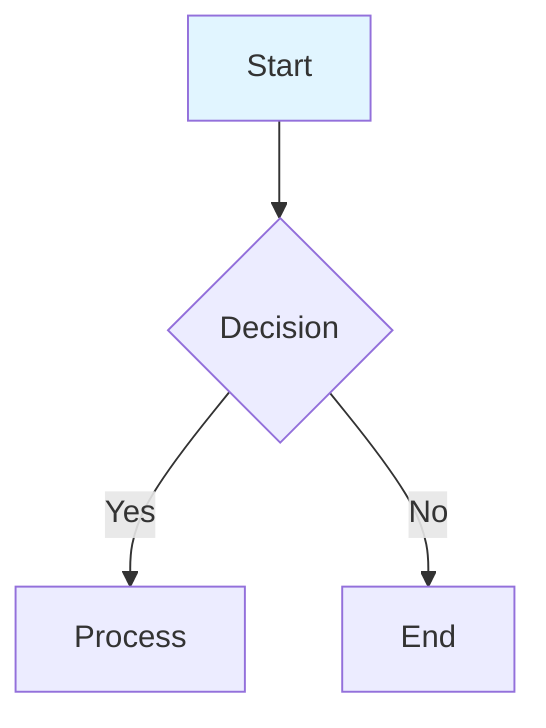

# Composable App Tutorial Diagrams

This directory contains Mermaid diagrams (`.mmd` source files) and exported PNG images for the tutorial system.

## Diagrams

### 1. Workflow Diagram (`workflow.mmd` / `workflow.png`)
**Purpose**: End-to-end content generation workflow showing all design patterns in action

**Patterns illustrated**:
- Pattern 32: Guardrails (input validation)
- Pattern 28: Long-term Memory (user preferences)
- Pattern 6: RAG (GenAIWriter retrieval)
- Pattern 23: Multi-agent (ReviewerPanel parallelism)
- Pattern 18: Reflection (revision based on feedback)

**Used in**:
- `TUTORIAL_INDEX.md`
- `concepts/multi_agent_workflow.md` (if created)
- `concepts/architecture_deep_dive.md`

### 2. RAG Flow Diagram (`rag_flow.mmd` / `rag_flow.png`)
**Purpose**: Detailed RAG implementation showing indexing and query phases

**Components**:
- **Indexing Phase**: PDF → OpenParse → Chunks → Embeddings → Vector Store
- **Query Phase**: User Query → Embed → Similarity Search → Top-K → LLM with Citations

**Used in**:
- `notebooks/rag_pattern_tutorial.ipynb`
- `concepts/architecture_deep_dive.md`

### 3. Reviewer Panel Architecture (`reviewer_panel.mmd` / `reviewer_panel.png`)
**Purpose**: Multi-agent parallel review architecture with timing annotations

**Components**:
- 3 Specialist Reviewers (Grammar, Math, District Rep)
- 3 Adversarial Reviewers (Conservative Parent, Liberal Parent, School Admin)
- Secretary consolidation
- Performance comparison: Sequential (12s) vs Parallel (2-3s)

**Used in**:
- `notebooks/multi_agent_pattern.ipynb`
- `concepts/prompt_engineering.md` (if created)
- `concepts/architecture_deep_dive.md`

## Regenerating Diagrams

To regenerate PNG files from Mermaid source (e.g., after editing `.mmd` files):

```bash
# Navigate to diagrams directory
cd composable_app/tutorials/diagrams

# Regenerate all diagrams
npx -p @mermaid-js/mermaid-cli mmdc -i workflow.mmd -o workflow.png -b transparent
npx -p @mermaid-js/mermaid-cli mmdc -i rag_flow.mmd -o rag_flow.png -b transparent
npx -p @mermaid-js/mermaid-cli mmdc -i reviewer_panel.mmd -o reviewer_panel.png -b transparent
```

**Requirements**:
- Node.js and npm installed
- `@mermaid-js/mermaid-cli` package (auto-installed via npx)

## Editing Diagrams

### Online Editor (Recommended for quick edits)
1. Copy `.mmd` file contents
2. Open [Mermaid Live Editor](https://mermaid.live/)
3. Paste and edit
4. Copy updated syntax back to `.mmd` file
5. Regenerate PNG using command above

### Local Editor
Edit `.mmd` files directly in any text editor. The syntax is Mermaid markdown.

**Key syntax**:
- `graph TD` or `graph TB`: Top-down flow
- `[Node]`: Rectangle node
- `([Node])`: Stadium/pill-shaped node (start/end)
- `{Node}`: Diamond node (decision)
- `[(Node)]`: Cylindrical node (database)
- `-->`: Arrow
- `-.->`: Dotted arrow
- `subgraph "Title"`: Group nodes
- `style NodeName fill:#color`: Color nodes

**Example**:


## Accessibility

All diagrams embedded in tutorials include:
- **Alt text**: Descriptive text for screen readers
- **Caption**: Context for what the diagram shows
- **High resolution**: PNGs are 2x resolution for clarity

**Example embedding**:
```markdown


*Figure 1: End-to-end content generation workflow. User input flows through input guardrails (Pattern 32), writer selection with memory (Pattern 28), optional RAG (Pattern 6), parallel review panel (Pattern 23), and revision (Pattern 18).*
```

## Maintenance

**When to update diagrams**:
- When adding new agents (writers, reviewers)
- When adding new services (guardrails, etc.)
- When workflow changes significantly
- When design patterns are added/removed

**Update checklist**:
1. Edit `.mmd` source file
2. Regenerate PNG using npx command
3. Update alt text in tutorials referencing the diagram
4. Update `TUTORIAL_CHANGELOG.md` with diagram changes

## File Sizes

- **Source files** (`.mmd`): 1-3 KB (text)
- **PNG exports**: 50-110 KB (high-resolution images)

Total directory size: ~260 KB

---

**Last Updated**: 2025-11-05
**Mermaid Version**: 11.12.0
