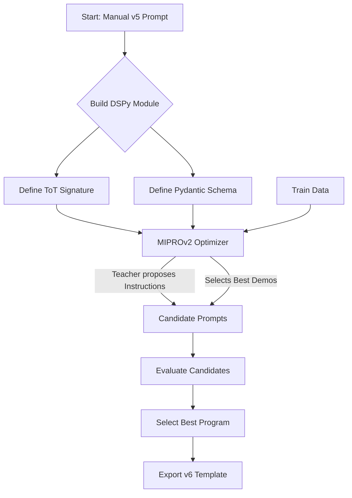

# DSPy Optimization Flow

```mermaid
graph TD

    A[Start: Manual v5 Prompt] --> B{Build DSPy Module}

    B --> C[Define ToT Signature]

    B --> D[Define Pydantic Schema]

    C --> E[MIPROv2 Optimizer]

    D --> E

    F[Train Data] --> E

    E -->|Teacher proposes Instructions| G[Candidate Prompts]

    E -->|Selects Best Demos| G

    G --> H[Evaluate Candidates]

    H --> I[Select Best Program]

    I --> J[Export v6 Template]
```

