# Context Engineering Terminology Reference

**Purpose:** Critical distinctions that prevent common mistakes when implementing context-aware AI systems.

**⚠️ READ THIS FIRST:** Misusing these terms leads to systems that send entire conversation histories to LLMs, treat memory as saved chat logs, and fail at scale. This reference provides precise definitions with side-by-side comparisons.

---

## 1. Session History vs. Context Window

### Definitions

| **Session History** | **Context Window** |
|---------------------|-------------------|
| The **complete, chronological record** of all events in a conversation (user inputs, agent outputs, tool calls, timestamps) | The **curated subset** of information sent to the LLM at inference time |
| **Storage:** Persistent (database, event log) | **Usage:** Temporary (model input) |
| **Size:** Can grow unbounded (50 turns = 50K tokens) | **Size:** Fixed constraint (8K tokens for GPT-4) |
| **Purpose:** Audit trail, debugging, session recovery | **Purpose:** Provide just enough context for accurate response |

### Visual Relationship


**Diagram Explanation:**
- **Session History (Blue):** Full conversation stored in database (50 turns, 50K tokens)
- **Compression Trigger (Red):** Activates at 95% capacity (7,600/8,000 tokens)
- **Compression Process (Orange):** Identifies protected context, summarizes compressible events
- **Context Window (Green):** Curated subset sent to LLM (8K tokens with protected + compressed + recent + memory + RAG)

### Wrong vs. Right

| ❌ **WRONG** | ✅ **RIGHT** |
|-------------|-------------|
| Sending entire session history to LLM every turn | Compress session history, send curated context window |
| "Let's just pass all 50 turns to the model" | "Identify protected events, compress the rest, stay under 8K tokens" |
| Treating session history as context window | Session history is raw material; context window is refined input |

### Bhagavad Gita Chatbot Example

**Scenario:** User has 50-turn conversation exploring karma yoga concepts.

- **Session History:** All 50 turns stored in database (user questions, agent responses, verse retrievals, timestamps)
- **Context Window (Turn 51):**
  - Turn 0: Initial objective "Help me understand karma yoga"
  - Turn 15: User constraint "Please use Swami Sivananda translations"
  - Turns 48-50: Recent conversation context
  - Memory: "User prefers Sivananda commentary"
  - RAG: Retrieved verses from Chapter 3 relevant to current question

**Token Math:** 50K tokens (history) → 7.8K tokens (context window) = 84% compression while preserving critical information.

---

## 2. Memory vs. RAG (Retrieval-Augmented Generation)

### Definitions

| **Memory** | **RAG** |
|-----------|---------|
| **User-specific, personalized knowledge** extracted from conversation history | **General, factual knowledge** retrieved from external corpus |
| Like a **personal assistant** who remembers your preferences | Like a **research librarian** who fetches relevant documents |
| **Source:** This user's past sessions | **Source:** General knowledge base (e.g., all Gita verses) |
| **Mutability:** Evolves as user preferences change | **Mutability:** Static corpus (unless re-indexed) |
| **Examples:** "User prefers morning meditation sessions", "User is studying Chapter 3" | **Examples:** "Chapter 3, Verse 5 discusses inherent nature", "Swami Sivananda's commentary on 3.5" |

### Visual Comparison



**Diagram Explanation:**
- **Memory System (Blue):** User-specific knowledge from past sessions (preferences, learning patterns)
- **RAG System (Orange):** General knowledge corpus shared across all users (Gita verses, commentaries)
- **The Test (Red):** Is this true for ALL users? YES → RAG, NO → Memory
- **LLM Input (Green):** Receives both memory (personalization) and RAG (factual knowledge)

### Wrong vs. Right

| ❌ **WRONG** | ✅ **RIGHT** |
|-------------|-------------|
| Storing "Chapter 3 discusses karma yoga" as Memory | That's general knowledge → belongs in RAG corpus |
| Treating Memory as saved chat history | Memory = **extracted insights** about user preferences, not raw turns |
| Retrieving user's past questions from RAG | Past questions are session history, not RAG corpus |

### Bhagavad Gita Chatbot Example

| **Memory (Personal)** | **RAG (General)** |
|----------------------|-------------------|
| "User prefers Swami Sivananda translations" | "Swami Sivananda's commentary on 3.5: 'One cannot remain...'" |
| "User is studying karma yoga (Chapter 3)" | "Chapter 3, Verse 5: 'Verily none can ever remain...'" |
| "User asked about karma yoga 3 times this week" | "Related concepts: nishkama karma (selfless action)" |
| "User's native language is Hindi" | "Hindi translation of Chapter 3" |

**Key Test:** If it's true for **all users**, it's RAG. If it's true for **this user only**, it's Memory.

---

## 3. Proactive vs. Reactive Retrieval

### Definitions

| **Proactive Retrieval** | **Reactive Retrieval** |
|------------------------|------------------------|
| **Automatically load** context before LLM inference | **Agent decides** when to call retrieval tool during inference |
| **Trigger:** Every turn (or rule-based, e.g., user asks question) | **Trigger:** LLM agent tool call |
| **Pros:** No missed retrievals, consistent context | **Pros:** Lower token usage (only retrieve when needed) |
| **Cons:** Higher token usage (always include retrievals) | **Cons:** Requires smart agent, risk of missed retrievals |
| **Use Case:** High-stakes domains (medical, legal) where missing context is costly | **Use Case:** Open-ended chat where retrieval isn't always relevant |

### Decision Tree



**Diagram Explanation:**
- **Proactive Strategy (Blue):** Auto-retrieve before LLM inference (high-stakes domains, no missed retrievals)
- **Reactive Strategy (Orange):** Agent decides when to call retrieval tool (lower token usage, requires smart agent)
- **Hybrid Strategy (Green):** Rule-based triggers (e.g., verse reference detected → proactive, else reactive)
- **Decision Tree (Red):** Is missing context catastrophic? YES → Proactive, NO → Check if rules definable → Hybrid or Reactive

### Wrong vs. Right

| ❌ **WRONG** | ✅ **RIGHT** |
|-------------|-------------|
| Using reactive retrieval for medical diagnosis (agent might forget to retrieve critical drug interaction) | Proactive: Always retrieve drug interactions before responding |
| Using proactive retrieval for weather chatbot (wastes tokens on "Hello" messages) | Reactive: Only retrieve weather data when user asks |
| Mixing proactive and reactive without clear rules | Pick one strategy per use case, document decision |

### Bhagavad Gita Chatbot Example

**Strategy:** **Hybrid (Rule-Based Proactive)**

- **Proactive:** If user query contains verse reference (e.g., "Chapter 3, Verse 5") → auto-retrieve verse before LLM inference
- **Reactive:** If user asks general philosophical question → let agent decide whether to call `retrieve_verses` tool
- **Memory:** Always proactively load user preferences (language, commentary preference)

**Example:**

```python
# Turn 23: User asks "What does 3.5 say about action?"
# Proactive: Detect "3.5" → auto-retrieve Chapter 3, Verse 5
# Proactive: Load memory {"preferred_commentary": "Sivananda"}
# LLM receives: query + verse + Sivananda commentary + recent context
```

---

## 4. Events Log vs. Session State

### Definitions

| **Events Log** | **Session State** |
|---------------|------------------|
| **Immutable, append-only** record of what happened | **Mutable scratchpad** of current session status |
| **Analogy:** Bank transaction history | **Analogy:** Current account balance |
| **Structure:** List of timestamped events | **Structure:** Dictionary of current values |
| **Purpose:** Audit trail, debugging, replay | **Purpose:** Quick access to current context |
| **Example:** `[{"turn": 1, "user": "Hello", "ts": ...}, ...]` | **Example:** `{"current_chapter": 3, "compression_count": 2}` |

### Visual Relationship

```
Events Log (Append-Only):
    Turn 1: User asked about karma yoga
    Turn 5: Agent retrieved Chapter 3, Verse 5
    Turn 10: Compression triggered (95% capacity)
    Turn 15: User corrected translation preference

    ↓ [Derive state from events]

Session State (Mutable):
    current_chapter: 3
    preferred_commentary: "Sivananda"
    compression_count: 1
    last_compression_turn: 10
```

### Wrong vs. Right

| ❌ **WRONG** | ✅ **RIGHT** |
|-------------|-------------|
| Storing "current_chapter: 3" in events log | Session state is derived from events, not stored in events |
| Mutating past events ("Let's fix turn 5's timestamp") | Events are immutable; add new event to correct errors |
| Using session state for debugging | Events log preserves full history; state is current snapshot |

### Bhagavad Gita Chatbot Example

**Events Log (Immutable):**
```json
[
  {"turn": 0, "type": "objective", "content": "Help me understand karma yoga", "ts": "2025-01-15T10:00:00Z"},
  {"turn": 1, "type": "user_input", "content": "What is Chapter 3 about?", "ts": "2025-01-15T10:01:23Z"},
  {"turn": 1, "type": "rag_retrieval", "verses": ["3.1", "3.2", "3.3"], "ts": "2025-01-15T10:01:24Z"},
  {"turn": 1, "type": "agent_response", "content": "Chapter 3 discusses...", "ts": "2025-01-15T10:01:30Z"}
]
```

**Session State (Mutable):**
```json
{
  "current_chapter": 3,
  "preferred_commentary": "Sivananda",
  "total_turns": 15,
  "total_tokens": 7600,
  "compression_triggered": false,
  "last_retrieval_turn": 1
}
```

**Key Test:** If you need to replay the conversation, use **Events Log**. If you need current status, use **Session State**.

---

## 5. Compression vs. Truncation

### Definitions

| **Compression** | **Truncation** |
|----------------|---------------|
| **Intelligently summarize** non-critical events to reduce tokens | **Naively discard** oldest events when hitting token limit |
| **Preserves:** Protected context, recent turns, semantic meaning | **Preserves:** Only recent turns (loses early context) |
| **Example:** Turn 5-40 → "User explored karma yoga concepts with focus on selfless action" | **Example:** Delete turns 1-30, keep turns 31-50 |
| **Pros:** Retains critical information, respects protected context | **Pros:** Simple to implement (sliding window) |
| **Cons:** Requires LLM call or heuristic summarization | **Cons:** Loses objectives, constraints, context |

### Visual Comparison

```
Original Session (50 turns, 50K tokens)

COMPRESSION:
    ✅ Turn 0: "Help me understand karma yoga" [PROTECTED]
    ✅ Turn 5: "Use Sivananda translations" [PROTECTED]
    📦 Turns 6-44: → "User studied Ch 3 karma yoga..." [SUMMARIZED]
    ✅ Turns 45-50: [RECENT, PRESERVED]
    Result: 7.8K tokens

TRUNCATION:
    ❌ Turns 1-30: [DISCARDED]
    ✅ Turns 31-50: [PRESERVED]
    Result: 8K tokens BUT lost initial objective and constraints
```

### Wrong vs. Right

| ❌ **WRONG** | ✅ **RIGHT** |
|-------------|-------------|
| Deleting turns 1-20 when hitting token limit | Mark turns 0-5 as protected, compress turns 6-40, preserve 41-50 |
| "Just keep the last 20 turns" | "Identify protected context, summarize compressible events" |
| Treating all events as equally important | Some events (objectives, constraints) are more important than others |

### Bhagavad Gita Chatbot Example

**Scenario:** 50-turn conversation, 50K tokens, approaching 8K context limit.

**Truncation Approach (❌ WRONG):**
```
Keep turns 31-50 (8K tokens)
Result: Lost "Help me understand karma yoga" objective
        Lost "Use Sivananda translations" constraint
        Agent might use wrong commentary in turn 51
```

**Compression Approach (✅ RIGHT):**
```
Protected:
  - Turn 0: Initial objective
  - Turn 5: Translation preference

Compressed (6-44):
  - "User asked 15 questions about karma yoga in Ch 3"
  - "Agent provided Sivananda commentary per user preference"
  - "User expressed confusion about nishkama karma concept"

Recent (45-50): Full preservation

Result: 7.8K tokens, all critical context preserved
```

---

## 6. Protected Context vs. Compressible Context

### Definitions

| **Protected Context** | **Compressible Context** |
|----------------------|-------------------------|
| **Must never be summarized or discarded** | **Can be safely summarized** to reduce tokens |
| **Examples:** Initial objectives, explicit constraints, authentication checkpoints, user corrections | **Examples:** Acknowledgments ("Thanks!", "OK"), exploratory questions, rephrased queries |
| **Identification:** Turn 0 events, constraint keywords ("always", "never", "must"), user corrections | **Identification:** Casual conversation, redundant information, non-critical chitchat |
| **Trigger:** Explicit user instructions or system-critical events | **Trigger:** Everything else (default) |

### Identification Rules

```python
def is_protected(event: dict) -> bool:
    """Identify if event should be protected from compression."""
    # Rule 1: Turn 0 (initial objective)
    if event["turn"] == 0:
        return True

    # Rule 2: Explicit constraints ("always", "never", "must", "don't")
    constraint_keywords = ["always", "never", "must", "don't", "only", "prefer"]
    if any(kw in event["content"].lower() for kw in constraint_keywords):
        return True

    # Rule 3: User corrections ("Actually,", "I meant", "Correction:")
    correction_keywords = ["actually", "i meant", "correction", "no,", "wrong"]
    if any(kw in event["content"].lower() for kw in correction_keywords):
        return True

    # Rule 4: Authentication/authorization checkpoints
    if event["type"] == "auth_checkpoint":
        return True

    return False  # Default: compressible
```

### Wrong vs. Right

| ❌ **WRONG** | ✅ **RIGHT** |
|-------------|-------------|
| Compressing turn 0 objective: "Help me understand karma yoga" | Protect turn 0 → always preserve in context window |
| Protecting "Thanks for the explanation!" | Compressible → can be summarized or discarded |
| Treating all user inputs as equally important | Identify protected events, compress the rest |

### Bhagavad Gita Chatbot Example

**Protected Context:**
```json
[
  {"turn": 0, "content": "Help me understand karma yoga", "reason": "initial_objective"},
  {"turn": 5, "content": "Always use Swami Sivananda translations", "reason": "explicit_constraint"},
  {"turn": 12, "content": "Actually, I prefer Hindi translations", "reason": "user_correction"},
  {"turn": 20, "content": "Don't include Shankara commentary", "reason": "explicit_constraint"}
]
```

**Compressible Context:**
```json
[
  {"turn": 3, "content": "Thanks for the explanation!", "reason": "acknowledgment"},
  {"turn": 7, "content": "What about Chapter 2?", "reason": "exploratory_question"},
  {"turn": 11, "content": "Can you explain that again?", "reason": "rephrased_query"}
]
```

**Compression Result:**
```
Protected events: Preserved verbatim (4 events)
Compressible events: → "User expressed gratitude, explored Ch 2, requested clarification" (1 summary)
Token savings: 600 tokens → 50 tokens (92% compression)
```

---

## Quiz: Test Your Understanding

### Question 1: Session History vs. Context Window

**Scenario:** A user has a 30-turn conversation with the Bhagavad Gita chatbot (25K tokens total). The LLM context limit is 8K tokens.

Which statement is correct?

A) Send all 30 turns to the LLM (25K tokens) and let the model handle truncation
B) Delete turns 1-15, send turns 16-30 to the LLM (8K tokens)
C) Store all 30 turns in session history, compress non-protected events, send curated 7.5K token context window to LLM

<details>
<summary>Answer</summary>

**C is correct.**

- **Session History:** All 30 turns stored in database (25K tokens)
- **Context Window:** Curated subset (7.5K tokens) with protected context + compressed events + recent turns
- A is wrong: Exceeds context limit
- B is wrong: Loses critical early context (objectives, constraints)
</details>

---

### Question 2: Memory vs. RAG

**Scenario:** The chatbot learns the following information during a conversation:

1. "User prefers Swami Sivananda translations"
2. "Chapter 3, Verse 5 discusses inherent nature and action"
3. "User is studying karma yoga this week"
4. "Swami Sivananda's commentary on 3.5: 'One cannot remain truly action-less...'"

Which items belong in **Memory** and which in **RAG**?

<details>
<summary>Answer</summary>

**Memory (User-Specific):**
- "User prefers Swami Sivananda translations" (personal preference)
- "User is studying karma yoga this week" (current focus)

**RAG (General Knowledge):**
- "Chapter 3, Verse 5 discusses inherent nature and action" (factual content)
- "Swami Sivananda's commentary on 3.5: 'One cannot remain truly action-less...'" (commentary text)

**Key Test:** If it's true for **all users**, it's RAG. If it's true for **this user only**, it's Memory.
</details>

---

### Question 3: Protected vs. Compressible Context

**Scenario:** A session contains these events:

1. Turn 0: "Help me understand the concept of dharma"
2. Turn 3: "Thanks for the explanation!"
3. Turn 5: "Always cite the Sanskrit verse along with translation"
4. Turn 8: "What about karma yoga?"
5. Turn 12: "Actually, I prefer concise responses without long commentary"

Which events are **Protected** and which are **Compressible**?

<details>
<summary>Answer</summary>

**Protected Context:**
- Turn 0: "Help me understand the concept of dharma" (initial objective)
- Turn 5: "Always cite the Sanskrit verse along with translation" (explicit constraint: "Always")
- Turn 12: "Actually, I prefer concise responses without long commentary" (user correction: "Actually")

**Compressible Context:**
- Turn 3: "Thanks for the explanation!" (acknowledgment)
- Turn 8: "What about karma yoga?" (exploratory question, no constraint)

**Result:** Protect 3 events, compress 2 events.
</details>

---

### Question 4: Compression vs. Truncation

**Scenario:** A 40-turn conversation (35K tokens) needs to fit in an 8K context window.

**Option A (Truncation):** Delete turns 1-25, keep turns 26-40
**Option B (Compression):** Protect turn 0 + constraint events, summarize turns 5-35, preserve turns 36-40

Which approach preserves the initial objective "Help me understand renunciation in the Gita"?

<details>
<summary>Answer</summary>

**Option B (Compression) is correct.**

**Option A (Truncation):**
- Deletes turns 1-25
- Loses initial objective (turn 0)
- Agent might forget user's original goal
- Result: Context-aware for recent turns only

**Option B (Compression):**
- Protects turn 0: "Help me understand renunciation in the Gita"
- Summarizes turns 5-35: "User explored sannyasa and karma yoga concepts"
- Preserves turns 36-40: Recent context
- Result: 7.8K tokens with full context awareness
</details>

---

### Question 5: Proactive vs. Reactive Retrieval

**Scenario:** You're building a Bhagavad Gita chatbot. User queries fall into two categories:

- **Type A:** "What does Chapter 2, Verse 47 say?" (specific verse lookup)
- **Type B:** "How can I apply Gita wisdom to modern life?" (general philosophical question)

Should you use proactive or reactive retrieval?

<details>
<summary>Answer</summary>

**Hybrid (Rule-Based Proactive):**

**Type A (Proactive):**
- Detect verse reference pattern (e.g., "2.47", "Chapter 2, Verse 47")
- Auto-retrieve verse before LLM inference
- Reason: High certainty that retrieval is needed

**Type B (Reactive):**
- Let agent decide whether to call `retrieve_verses` tool
- Agent might retrieve related verses or answer from general knowledge
- Reason: Retrieval isn't always necessary for philosophical discussions

**Implementation:**
```python
if verse_reference_detected(query):
    # Proactive: Auto-retrieve
    context = retrieve_verse(chapter, verse)
else:
    # Reactive: Let agent decide
    context = None  # Agent will call tool if needed
```
</details>

---

## Next Steps

1. **Study the diagrams:** See [diagrams/session_vs_context.mmd](diagrams/session_vs_context.mmd), [diagrams/memory_vs_rag.mmd](diagrams/memory_vs_rag.mmd), [diagrams/proactive_vs_reactive.mmd](diagrams/proactive_vs_reactive.mmd)
2. **Read pattern guides:** See [Sessions Pattern](../patterns/sessions-tutorial.md) ([Quick Ref](../patterns/sessions-quickref.md)), [Memory Pattern](../patterns/memory-tutorial.md) ([Quick Ref](../patterns/memory-quickref.md))
3. **Implement protected context:** Follow TDD workflow in Phase 2 tasks
4. **Test your understanding:** Build a 50-turn conversation and verify protected context survives compression

**For questions or clarifications, refer to:**
- [TUTORIAL_INDEX.md](TUTORIAL_INDEX.md) - Complete learning paths
- [context_engineering_tutorial.md](context_engineering_tutorial.md) - Deep-dive tutorial
- [../CLAUDE.md](../CLAUDE.md) - Project-specific context engineering principles
