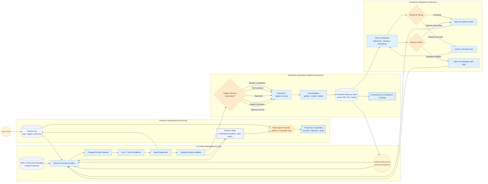
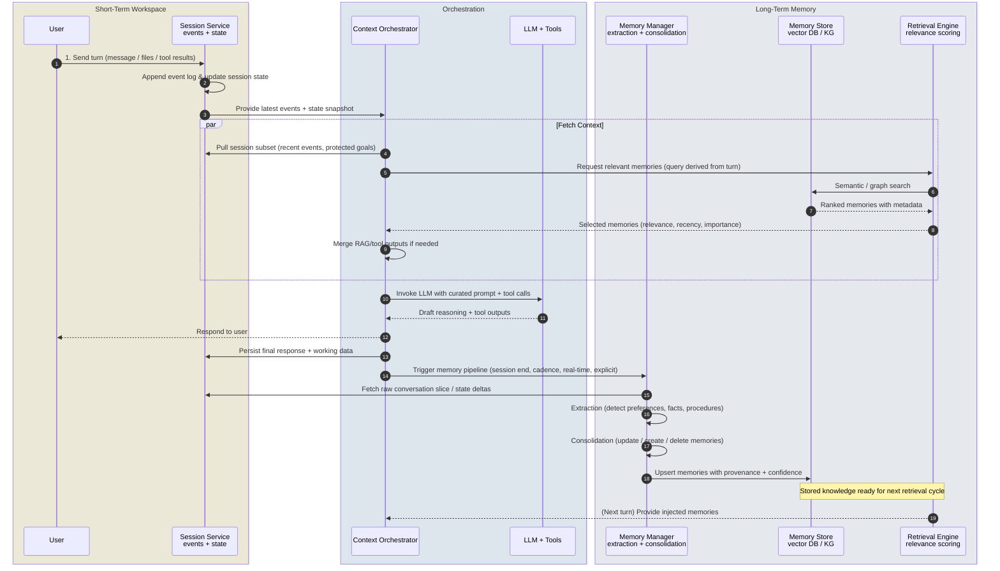

# Building Stateful AI Agents with Context Engineering

Google's November 2025 context engineering whitepaper argues that great AI agents emerge from orchestration, not just larger models. This tutorial distills the paper into a practical guide you can reference while designing systems that juggle short-term sessions, long-term memory, retrieval, and tooling.

## 1. Sessions vs. Memory: Two Workspaces

- **Sessions = the active desk.** They keep an append-only event log plus mutable state (scratchpads, carts, running plans) for one conversation. Multi-agent systems either share one history for tight coordination or maintain private logs for isolation and privacy.
- **Memory = the climate-controlled archive.** Consolidated, structured facts outlive any one chat. Distinguish declarative vs. procedural, explicit vs. implicit, and scope memories as user-, session-, or org-level.
- **RAG vs. Memory.** Retrieval-augmented generation is the research librarian for static corpora; memory is the personal assistant capturing evolving user specifics. Treat them as complementary channels feeding the same context window.
- **Production guardrails.** Sessions need lifecycle rules (TTL, archival, deletion), access control, and scalable storage so that context infrastructure matures alongside your agents.

## 2. The Context Management Loop

The loop fetches all relevant signals, prepares the prompt payload, invokes LLMs/tools, responds, and uploads new state. The flow diagram below captures how sessions, memory, and RAG collaborate.

**How to read the flow:**

- **Fetch.** Pull a curated slice of recent events, protected goals, scratchpad state, previously retrieved memories, and fresh RAG/tool results. Use heuristics or learned policies so the context window holds only the most relevant turns.
- **Prepare & Invoke.** Craft system instructions, user message, tool schema, and injected memories. LLM/tool iterations keep updating the session log for transparency.
- **Upload.** Persist every turn plus structured state so that future retrieval or audits can replay the exact conversation.
- **Trigger memory.** Decide when to run the ETL-style pipeline using cadence, session endings, explicit commands, or memory-as-a-tool. Provenance metadata (source session, timestamps, confidence) prevents hallucinated personalization.

## 3. Designing the Memory Pipeline

1. **Extraction (Signal vs. Noise).** Teach the LLM what counts as a memory via schemas, few-shot exemplars, and guardrails. Typical signals: user preferences, procedural insights, decisions, and domain-specific facts.
2. **Consolidation (Update/Create/Delete).** Compare new signals against existing memories to merge duplicates, resolve conflicts (preference shifts), and decay stale data.
3. **Storage Strategies.** Vector DBs handle semantic similarity; knowledge graphs encode relationships; hybrids give both. Always attach metadata for provenance tracking and confidence evolution.
4. **Retrieval Contracts.** Score candidates with relevance (embedding similarity), recency, and importance (user-confirmed vs. inferred). Decide whether retrieval is proactive (auto-load summaries each turn) or reactive (expose `search_memories` as a tool the agent calls when needed).

## 4. Sequence Diagram: Service Choreography

Where the Section 2 flowchart shows *what* happens, the sequence diagram shows *who* owns each responsibility. Embed it in design docs to align product, compliance, and engineering teams, and refer back here when narrating the Section 5 case study.

Use the numbered lifelines to narrate compliance-sensitive processes (like the dispute workflow) so non-engineering stakeholders can trace how context flows between services.

## 5. Case Study: Disputing a Fraudulent Charge

The `dispute_transaction_sequence.md` narrative maps directly onto the diagrams above. Here it is verbatim, with all nineteen interactions preserved so you can line each one up with the Section 2 flowchart and Section 4 sequence diagram:

1. **Customer submission** – Jordan opens a secure chat, describes the unauthorized $450 debit from Metro Electronics, and uploads a screenshot.
2. **Session logging** – The session service appends the entire turn and updates scratchpad fields like `dispute_amount=450` and `merchant="Metro Electronics"`.
3. **State handoff** – A fresh snapshot of events + state is shared with the context orchestrator so downstream components stay in sync.
4. **Session slicing** – The orchestrator retrieves protected conversation slices (initial complaint, authentication checks, compliance notices) needed for prompt assembly.
5. **Memory request** – In parallel it asks the retrieval engine for Jordan-specific memories such as prior disputes or notification preferences.
6. **Store query** – The retrieval engine performs semantic and graph searches against long-term memory stores.
7. **Candidate memories** – The store returns items like “Filed fraud claim in 2024,” “Card has travel restrictions,” “Prefers SMS follow-ups.”
8. **Filtering** – Retrieval keeps only the most relevant subset (recent fraud history, SMS preference) based on relevance, recency, and importance scores.
9. **Policy enrichment** – The orchestrator fetches RAG snippets (latest dispute procedures, Metro Electronics risk bulletin) and merges any required tool outputs.
10. **LLM invocation** – With curated session turns, injected memories, and policy excerpts, the orchestrator calls the LLM/tool stack.
11. **Reasoning + tool calls** – The LLM queries internal fraud services (merchant risk score, device fingerprint) and drafts a personalized remediation plan.
12. **Customer response** – The orchestrator sends Jordan the plan confirming provisional credit and next steps.
13. **Session persistence** – The outgoing message plus structured state (`case_id=FD-88341`, `temporary_credit=true`, `notified_channel=SMS`) are logged.
14. **Memory trigger** – Because fraud cases require archival, the orchestrator signals the memory manager to start extraction/consolidation.
15. **Context fetch for memory** – The memory manager retrieves the relevant conversation slice and session-state deltas.
16. **Extraction** – It isolates new insights such as “Metro Electronics repeatedly disputed,” “Customer insists on SMS confirmations,” “Automatic credits reduce frustration.”
17. **Consolidation** – Those insights merge with prior memories, updating confidence scores and removing stale contradictions where needed.
18. **Upsert** – The refined memories, tagged with provenance pointing to case `FD-88341`, are stored in the vector/graph database.
19. **Next-turn readiness** – On Jordan’s next interaction (e.g., status check) the retrieval engine can instantly surface these memories so the assistant proactively addresses loyalty, fraud, and notification expectations.

## 6. Implementation Checklist

- **Session hygiene.** Define retention policies, protected slices, and trimming/summarization rules (auto-compact past 95% context usage, protect objectives and constraints from pruning).
- **Memory triggers.** Pick a default cadence (e.g., every N turns) plus overrides for explicit “remember this” commands and critical workflows (fraud, healthcare, legal).
- **Storage + provenance.** Store embeddings, graph edges, and metadata fields: confidence score, source session, timestamps, lineage, tags.
- **Retrieval policies.** Tune weights for relevance, recency, and importance. Combine vector search with keyword or graph traversal for higher accuracy.
- **Tool contracts.** Define JSON schemas for `create_memory` and `search_memories`, including guidance on when agents should call them to avoid unnecessary LLM invocations.
- **Observability.** Log which memories were injected, which were ignored, and why. Use this data to improve scoring heuristics and detect context poison/conflicts early.

## 7. Where to Go Next

- Prototype the flow in a notebook: simulate session growth, run summarization/trimming policies, and measure token savings.
- Implement the memory ETL as a background worker so that latency-sensitive turns stay fast while memories remain fresh.
- Extend the dispute case into other regulated workflows (loan origination, healthcare triage) to validate that your context engineering stack generalizes with minimal changes.

Treat this document as a living playbook: embed the diagrams in design reviews, reuse the dispute walkthrough when onboarding new engineers, and iterate on the checklists as your agents take on new responsibilities.

