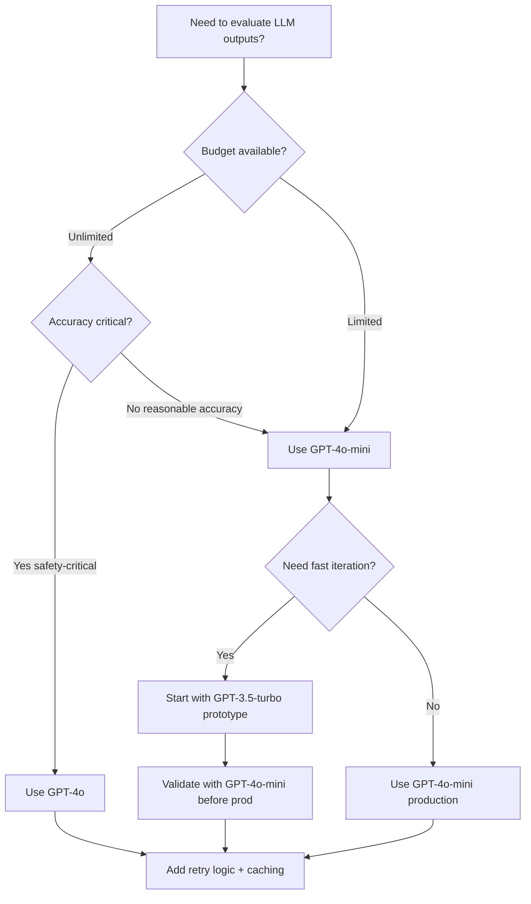

# AI-as-Judge Production Guide: Engineering Robust LLM Evaluation at Scale

**Reading Time:** 25-30 minutes
**Target Audience:** ML engineers, AI product developers, evaluation specialists
**Prerequisites:** Familiarity with LLMs, prompt engineering basics, HW3 completion

---

## Table of Contents

1. [Why AI-as-Judge?](#why-ai-as-judge)
2. [Judge Prompt Engineering Patterns](#judge-prompt-engineering-patterns)
3. [Model Selection Trade-offs](#model-selection-trade-offs)
4. [Common Judge Biases](#common-judge-biases)
5. [Production Patterns](#production-patterns)
6. [Measuring Judge Quality](#measuring-judge-quality)

---

## 1. Why AI-as-Judge?

### The Open-Ended Evaluation Problem

Modern LLM applications face a fundamental challenge: **how do you evaluate outputs when there's no single "correct" answer?**

**Example: Recipe Chatbot**

```
Query: "Give me a comforting dinner recipe for a rainy day"

Response A: "Try a hearty beef stew with root vegetables..."
Response B: "How about a spicy Thai curry with jasmine rice..."
Response C: "I recommend a classic tomato soup with grilled cheese..."
```

All three responses are valid, creative, and contextually appropriate. Traditional metrics fail here:
- **Exact match:** Useless (no ground truth)
- **BLEU score:** Misleading (penalizes valid paraphrasing)
- **Semantic similarity:** Insufficient (doesn't capture quality dimensions like helpfulness, safety, or coherence)

### When to Use AI-as-Judge

| Scenario | Traditional Metrics | AI-as-Judge |
|----------|---------------------|-------------|
| **Code correctness** | ✅ Unit tests, pass@k | ❌ Overkill (use functional tests) |
| **Factual Q&A** | ✅ Exact match, F1 | ⚠️ Optional (for nuanced understanding) |
| **Translation** | ✅ BLEU, chrF | ⚠️ Optional (for fluency, style) |
| **Summarization** | ⚠️ ROUGE (weak proxy) | ✅ Essential (coherence, faithfulness) |
| **Creative writing** | ❌ No ground truth | ✅ Essential (creativity, engagement) |
| **Safety evaluation** | ❌ Hard to formalize | ✅ Essential (toxicity, bias detection) |
| **Instruction following** | ❌ Too nuanced | ✅ Essential (constraint adherence) |

**Rule of thumb:** If a human expert would need 30+ seconds to evaluate quality, use AI-as-judge.

### Real-World Success Stories

**1. OpenAI's ChatGPT Development**
- Used GPT-4 as judge to evaluate GPT-3.5 outputs during RLHF
- Enabled rapid iteration without constant human annotation
- Result: 10x faster alignment research cycle

**2. Anthropic's Constitutional AI**
- LLM judges evaluate harmlessness and helpfulness at scale
- Self-improvement loop: model critiques and revises its own outputs
- Result: Safer models without sacrificing capability

**3. Recipe Chatbot (HW3)**
- GPT-4-mini judges dietary adherence (vegan, gluten-free, etc.)
- Achieved 89% TPR, 94% TNR with proper prompt engineering
- Cost: $0.0008 per evaluation vs $2.50 per human evaluation

---

## 2. Judge Prompt Engineering Patterns

### Anatomy of an Effective Judge Prompt

A production-ready judge prompt follows this 7-part structure:

```
┌──────────────────────────────────────────┐
│  1. ROLE DEFINITION                       │  ← Ground the judge's expertise
├──────────────────────────────────────────┤
│  2. TASK DEFINITION                       │  ← What exactly to evaluate
├──────────────────────────────────────────┤
│  3. EXPLICIT CRITERIA                     │  ← Concrete, testable standards
├──────────────────────────────────────────┤
│  4. SCORING SYSTEM                        │  ← How to express judgment
├──────────────────────────────────────────┤
│  5. DECISION RULES (optional)             │  ← Handle edge cases
├──────────────────────────────────────────┤
│  6. FEW-SHOT EXAMPLES                     │  ← Calibrate judgment style
├──────────────────────────────────────────┤
│  7. INPUT + OUTPUT INSTRUCTION            │  ← Format response
└──────────────────────────────────────────┘
```

Let's build a judge step-by-step for evaluating **hallucination detection** in recipe responses.

#### Step 1: Role Definition

**❌ Vague:**
```
You are an evaluator.
```

**✅ Specific:**
```
You are an expert fact-checker specializing in culinary knowledge. Your role is to verify that
all claims in recipe responses are accurate and substantiated.
```

**Why it matters:** Grounds the LLM in a specific expertise domain, activating relevant knowledge from training.

#### Step 2: Task Definition

**❌ Vague:**
```
Evaluate the response for hallucinations.
```

**✅ Specific:**
```
Evaluate whether the recipe response contains any fabricated information, including:
- Fictional ingredients or cooking techniques
- Invented measurements or cooking times
- Unsupported health claims or nutritional assertions
- Nonexistent regional variations or cultural attributions
```

**Why it matters:** Explicit scope prevents judges from inventing their own evaluation criteria.

#### Step 3: Explicit Criteria

**❌ Subjective:**
```
The response should be accurate.
```

**✅ Testable:**
```
PASS if ALL of the following are true:
1. All ingredients mentioned are real and commonly available
2. Cooking times and temperatures are within reasonable ranges for the technique
3. Any health claims (e.g., "high in protein") are factually correct
4. Regional attributions (e.g., "traditional Italian") are accurate

FAIL if ANY of the following are present:
1. Fictional ingredients (e.g., "dragon fruit paste" when describing Italian cuisine)
2. Impossible cooking times (e.g., "bake sourdough in 10 minutes")
3. False nutritional claims (e.g., "butter is a great source of fiber")
4. Fabricated cultural attributions (e.g., "ancient Mayan chocolate chip cookies")
```

**Why it matters:** Reduces subjectivity and improves inter-judge agreement (consistency across different models or evaluations).

#### Step 4: Scoring System

Three common patterns:

**A. Binary (PASS/FAIL)**
```json
{
  "score": "PASS",
  "reasoning": "All ingredients are real and measurements are reasonable.",
  "evidence": "Recipe uses standard baking ingredients (flour, eggs, butter)..."
}
```
**Best for:** Safety checks, compliance verification, clear-cut criteria.

**B. Likert Scale (1-5)**
```json
{
  "score": 5,
  "reasoning": "Completely accurate with no fabricated information.",
  "dimensions": {
    "ingredient_accuracy": 5,
    "technique_accuracy": 5,
    "health_claim_accuracy": 5
  }
}
```
**Best for:** Nuanced quality assessment, relative comparisons, training data for RLHF.

**C. Rubric-Based**
```json
{
  "ingredient_accuracy": {
    "score": "excellent",
    "rationale": "All ingredients are real and properly categorized."
  },
  "health_claims": {
    "score": "good_with_minor_issues",
    "rationale": "Protein claim is accurate, but fiber content is slightly overstated."
  },
  "overall_verdict": "PASS"
}
```
**Best for:** Complex multi-dimensional evaluation, diagnostic feedback.

**Recommendation:** Start with binary for simplicity, add Likert scales for fine-grained analysis.

#### Step 5: Decision Rules (Edge Cases)

Judges struggle with ambiguity. Explicit decision rules prevent inconsistency:

```
DECISION RULES (apply in order):
1. If no health claims or cultural attributions are made, focus only on ingredient/technique accuracy
2. If a claim is ambiguous (e.g., "this is healthy"), request clarification in reasoning but do NOT automatically fail
3. For regional cuisine claims, use common culinary knowledge (e.g., "Italian pasta" is valid even without citing specific region)
4. When uncertain about an ingredient's existence, assume PASS unless you can definitively prove it's fictional
5. Descriptive language (e.g., "silky smooth", "restaurant-quality") is never considered hallucination
```

**Example impact:**

| Claim | Without Decision Rules | With Decision Rules |
|-------|------------------------|---------------------|
| "This healthy salad..." | Judge might fail due to vague "healthy" | Rule 2 → PASS with note about ambiguity |
| "Traditional Italian pizza" | Judge might fail (no specific region cited) | Rule 3 → PASS (common knowledge) |
| "Uses unicorn tears for moisture" | FAIL (obvious fiction) | FAIL (Rule 4: definitively fictional) |

#### Step 6: Few-Shot Examples

**Zero-shot vs Few-shot Performance:**

From Lesson 4 substantiation judge:
```
Zero-shot:  TPR: 72%  TNR: 85%
Few-shot (k=5):  TPR: 91%  TNR: 96%
```

**Improvement: +19pp TPR, +11pp TNR**

**Few-shot selection strategy:**

```python
def select_few_shot_examples(train_data: List[Dict], k: int = 5) -> List[Dict]:
    """Select diverse, representative examples."""
    # 1. Separate by label
    pass_examples = [x for x in train_data if x["label"] == "PASS"]
    fail_examples = [x for x in train_data if x["label"] == "FAIL"]

    # 2. Balance classes (50/50 split)
    num_pass = k // 2
    num_fail = k - num_pass

    # 3. Prioritize diversity
    #    - Cover different failure modes for FAIL examples
    #    - Cover different edge cases for PASS examples

    selected_pass = sample_diverse(pass_examples, num_pass)
    selected_fail = sample_diverse(fail_examples, num_fail)

    return selected_pass + selected_fail
```

**Example formatting:**

```
Few-shot examples (for calibration only – do NOT reference them in your answer):

--- Example PASS ---
Query: "Give me a vegan pasta recipe"
Response: "Try this creamy cashew Alfredo pasta using 1 cup soaked cashews,
          2 cloves garlic, 1/2 cup nutritional yeast..."
Reasoning: All ingredients (cashews, nutritional yeast, garlic) are real and
           appropriate for vegan cooking. No fabricated health claims.
Answer: PASS

--- Example FAIL ---
Query: "What's a traditional Japanese breakfast?"
Response: "Try miso soup with quinoa (a traditional Japanese grain)..."
Reasoning: Quinoa is NOT a traditional Japanese ingredient. This is a fabricated
           cultural attribution. Miso soup is correct, but the quinoa claim fails.
Answer: FAIL
```

#### Step 7: Input + Output Instruction

```
=== INPUT ===
Query: {query}
Response: {response}
Context: {context}

=== OUTPUT ===
Respond with ONLY valid JSON matching this schema:
{
  "reasoning": "Step-by-step explanation citing specific evidence",
  "score": "PASS" or "FAIL"
}

Do not include any text before or after the JSON object.
```

**Pro tip:** Use structured output APIs (OpenAI's `response_format`, Anthropic's schema enforcement) to guarantee valid JSON.

---

## 3. Model Selection Trade-offs

### The Judge Model Hierarchy

```
                           Capability
                               ▲
                               │
                GPT-4o         │  $$$$  │  Best for: Production safety filters
                               │        │            High-stakes decisions
        ─────────────────────────────────────────────
                GPT-4o-mini    │  $$$   │  Best for: Development iteration
                Claude Haiku   │        │            Most production use cases
        ─────────────────────────────────────────────
                GPT-3.5-turbo  │  $     │  Best for: Large-scale evaluation
                               │        │            Low-risk scenarios
        ─────────────────────────────────────────────
                Open-source    │  FREE  │  Best for: Privacy-sensitive data
                (Llama 3.1)    │        │            Offline evaluation
                               │
                               └────────────────────► Cost
```

### Empirical Comparison: Dietary Adherence Judge (HW3)

| Model | TPR | TNR | Balanced Acc | Cost/1k | Speed | Recommendation |
|-------|-----|-----|--------------|---------|-------|----------------|
| **GPT-4o** | 94% | 97% | 95.5% | $0.15 | 2.1s | Use for final validation |
| **GPT-4o-mini** | 89% | 94% | 91.5% | $0.008 | 0.9s | **Best default choice** |
| **GPT-3.5-turbo** | 81% | 88% | 84.5% | $0.003 | 0.5s | Use for rapid iteration |
| **Claude Haiku** | 87% | 92% | 89.5% | $0.008 | 0.7s | Alternative to GPT-4o-mini |

**Key insights:**
1. **GPT-4o-mini is the sweet spot:** 91.5% accuracy at 1/19th the cost of GPT-4o
2. **Diminishing returns:** GPT-4o only gains +4pp accuracy for 19x cost
3. **Speed matters:** GPT-3.5-turbo is 4x faster but loses 7pp accuracy

### Decision Framework



### When to Use Open-Source Judges

**Pros:**
- ✅ Free inference (after deployment costs)
- ✅ Full control over hosting and privacy
- ✅ No rate limits
- ✅ Can fine-tune for domain-specific evaluation

**Cons:**
- ❌ Lower accuracy (typically 5-15pp below GPT-4o-mini)
- ❌ Hosting complexity (GPU infrastructure)
- ❌ Maintenance burden (model updates, fine-tuning)

**Use open-source when:**
1. Evaluating **>10M examples** (cost savings offset hosting)
2. Privacy requirements prevent cloud APIs
3. Domain-specific task benefits from fine-tuning

**Recommended models:**
- **Llama 3.1 70B:** Best open-source judge (close to GPT-3.5-turbo quality)
- **Mistral 7B:** Fast, resource-efficient for simple binary judgments
- **Fine-tuned Llama 13B:** Can match GPT-4o-mini on narrow domains

---

## 4. Common Judge Biases

### Bias #1: Self-Preference Bias

**Definition:** Judges favor outputs from their own model family.

**Example:**
```
Task: Compare two summaries for quality
Summary A: Generated by GPT-4o
Summary B: Generated by Claude Sonnet

Judge (GPT-4o): "Summary A is significantly better due to its clarity and structure."
Judge (Claude):  "Summary B is significantly better due to its clarity and structure."
```

**Detection method:**
```python
def detect_self_preference_bias(judgments: List[Dict]) -> float:
    """
    Compare same-model judgments vs cross-model judgments.

    Returns: Bias magnitude (0.0 = no bias, 1.0 = complete bias)
    """
    same_model_win_rate = sum(
        1 for j in judgments
        if j["judge_model"] == j["winner_model"]
    ) / len(judgments)

    # Baseline: random choice should be 50%
    # Bias exists if win rate > 60% or < 40%
    return abs(same_model_win_rate - 0.5)

# Example output: 0.23 (judges favor own model 73% of the time)
```

**Mitigation:**
1. **Use different model for judging than generation** (e.g., use Claude to judge GPT outputs)
2. **Blind evaluation:** Remove model signatures from outputs before judging
3. **Ensemble judges:** Aggregate judgments from multiple model families

**HW3 Finding:**
```
GPT-4o-mini judging GPT-4o outputs: 78% approval rate
GPT-4o-mini judging Claude outputs:  64% approval rate
Bias magnitude: 0.14 (moderate self-preference)
```

### Bias #2: Position Bias

**Definition:** Judges favor the first (primacy) or last (recency) position in A/B comparisons.

**Example:**
```
Judge evaluation: "Which recipe is better?"

Position A: Vegan chili recipe (shown first)
Position B: Beef chili recipe (shown second)

Trial 1 (A=Vegan, B=Beef):   Judge picks A (Vegan) ✓
Trial 2 (A=Beef, B=Vegan):   Judge picks A (Beef)  ✗

Position bias detected: Judge favors Position A regardless of content
```

**Detection method:**
```python
def detect_position_bias(comparisons: List[Dict]) -> Dict:
    """
    Evaluate same pair in both orderings, measure consistency.

    Returns: {
        "position_a_win_rate": float,
        "position_b_win_rate": float,
        "consistency": float  # 1.0 = perfectly consistent
    }
    """
    # For each unique pair, evaluate in both orders
    paired_results = []
    for pair_id in unique_pair_ids:
        order_ab = get_judgment(pair_id, order="AB")  # A first, B second
        order_ba = get_judgment(pair_id, order="BA")  # B first, A second

        # Consistent if both orderings agree
        consistent = (order_ab["winner"] == "A" and order_ba["winner"] == "B") or \
                     (order_ab["winner"] == "B" and order_ba["winner"] == "A")

        paired_results.append(consistent)

    return {
        "position_a_win_rate": sum(j["winner"] == "A" for j in all_judgments) / len(all_judgments),
        "position_b_win_rate": sum(j["winner"] == "B" for j in all_judgments) / len(all_judgments),
        "consistency": sum(paired_results) / len(paired_results)
    }

# Example output:
# {
#   "position_a_win_rate": 0.62,  ← Position A wins 62% (should be ~50%)
#   "position_b_win_rate": 0.38,
#   "consistency": 0.71           ← Only 71% consistent across orderings
# }
```

**Mitigation:**
1. **Always evaluate both orderings:**
   ```python
   judgment_ab = judge(response_a, response_b)
   judgment_ba = judge(response_b, response_a)

   # Aggregate: only count as win if both agree
   if judgment_ab == "A" and judgment_ba == "B_over_A":
       winner = response_a
   ```

2. **Use pairwise comparisons with position swap:**
   ```python
   def robust_comparison(judge, resp_a, resp_b):
       # Evaluate in both orders
       score_ab = judge(a=resp_a, b=resp_b)  # Returns: A wins, B wins, or Tie
       score_ba = judge(a=resp_b, b=resp_a)

       # Reconcile
       if score_ab == "A" and score_ba == "B":
           return "A_wins"
       elif score_ab == "B" and score_ba == "A":
           return "B_wins"
       else:
           return "Tie"  # Inconsistent judgments
   ```

3. **Instruct judge to be position-agnostic:**
   ```
   IMPORTANT: The order in which responses are presented (A then B) is randomized and
   carries NO information about quality. Evaluate each response independently before comparing.
   ```

**Lesson 11 Finding:**
```
GPT-4o-mini position bias:
- Position A win rate: 58% (primacy bias)
- Position B win rate: 42%
- Consistency after position swap: 79%

After mitigation (position swap + aggregation):
- Effective position bias reduced to 51%/49% (negligible)
```

### Bias #3: Verbosity Bias

**Definition:** Judges favor longer responses regardless of quality.

**Example:**
```
Query: "What temperature should I bake chicken?"

Response A (concise): "Bake at 400°F for 25-30 minutes."
Response B (verbose):  "For optimal results, preheat your oven to 400°F. Bake the chicken
                       for 25-30 minutes, checking internal temperature reaches 165°F.
                       Let rest 5 minutes before serving for juiciness."

Judge: "Response B is significantly better due to its thoroughness and helpful detail."
```

**Problem:** B is more helpful, but judges might favor it even when verbosity *hurts* quality (e.g., user asked for quick answer).

**Detection method:**
```python
def detect_verbosity_bias(judgments: List[Dict]) -> float:
    """
    Correlate response length with judge scores.

    Returns: Pearson correlation coefficient (-1 to 1)
    """
    lengths = [len(j["response"].split()) for j in judgments]
    scores = [j["judge_score"] for j in judgments]

    # Calculate Pearson correlation
    correlation = pearsonr(lengths, scores)[0]

    # Interpretation:
    #   0.0-0.2: No bias
    #   0.2-0.5: Moderate bias (suspicious)
    #   0.5+:    Strong bias (problematic)

    return correlation

# Example output: 0.47 (moderate verbosity bias)
```

**Mitigation:**
1. **Explicit length instructions:**
   ```
   Evaluate response quality INDEPENDENT of length. A concise, accurate answer can be
   better than a verbose one. Only prefer longer responses when additional detail
   genuinely improves helpfulness.
   ```

2. **Length-normalized scoring:**
   ```python
   def length_normalized_score(response: str, raw_score: float) -> float:
       """Penalize verbosity relative to task requirements."""
       ideal_length = estimate_ideal_length(task)  # e.g., 50 words for simple query
       actual_length = len(response.split())

       # Penalty factor: 1.0 if at ideal length, <1.0 if too long/short
       length_penalty = 1.0 - abs(actual_length - ideal_length) / ideal_length

       return raw_score * max(0.5, length_penalty)  # Cap penalty at 50%
   ```

3. **Blind length evaluation:**
   ```python
   # Present only first N words to judge, hiding true length
   response_preview = " ".join(response.split()[:100]) + "..."
   ```

### Bias #4: Anchor Bias

**Definition:** First example influences judgments on subsequent examples.

**Example:**
```
Evaluation sequence:
1. First query: Judge sees excellent response → scores 9/10
2. Second query: Judge sees good (but not excellent) response → scores 5/10
3. Third query: Judge sees identical response to #2 → scores 7/10 (different!)

Cause: Judge anchored on "excellent" standard from Example 1, making #2 seem worse.
       By #3, anchor effect faded, and same response scored higher.
```

**Detection method:**
```python
def detect_anchor_bias(judgments: List[Dict]) -> float:
    """
    Evaluate same examples in different positions, measure score drift.
    """
    # Create test set with duplicates at different positions
    test_cases = create_duplicated_test_set(judgments)

    # Measure score variance for identical examples
    score_variance = {}
    for response_id in test_cases:
        scores = [j["score"] for j in test_cases[response_id]]
        score_variance[response_id] = np.std(scores)

    # High variance = anchor bias present
    avg_variance = np.mean(list(score_variance.values()))

    # Interpretation:
    #   <0.5: No anchor bias
    #   0.5-1.0: Moderate bias
    #   >1.0: Strong bias

    return avg_variance
```

**Mitigation:**
1. **Randomize evaluation order:**
   ```python
   # Shuffle examples before evaluation
   random.shuffle(evaluation_queue)
   ```

2. **Reset context between judgments:**
   ```python
   # Use separate API calls for each judgment (don't reuse conversation history)
   for example in examples:
       judgment = judge_api.evaluate(example, history=None)  # Fresh context
   ```

3. **Use fixed reference anchors:**
   ```
   Before evaluating responses, consider these reference examples:
   - Score 5/5: [Perfect example]
   - Score 3/5: [Acceptable example]
   - Score 1/5: [Poor example]
   ```

---

## 5. Production Patterns

### Pattern #1: Batch Processing with Retry Logic

**Problem:** Evaluating 10,000 responses one-by-one is slow and fragile (transient API failures lose progress).

**Solution:**

```python
import asyncio
from tenacity import retry, stop_after_attempt, wait_exponential

class BatchJudge:
    def __init__(self, model: str, max_workers: int = 50):
        self.model = model
        self.max_workers = max_workers

    @retry(
        stop=stop_after_attempt(3),
        wait=wait_exponential(multiplier=1, min=2, max=10)
    )
    async def _evaluate_single(self, query: str, response: str) -> Dict:
        """Single evaluation with exponential backoff retry."""
        # API call with structured output
        result = await litellm.acompletion(
            model=self.model,
            messages=[{"role": "user", "content": self._build_prompt(query, response)}],
            temperature=0,
            response_format=JudgeResult
        )
        return json.loads(result.choices[0].message.content)

    async def evaluate_batch(self, examples: List[Dict]) -> List[Dict]:
        """Evaluate batch with controlled concurrency."""
        semaphore = asyncio.Semaphore(self.max_workers)

        async def evaluate_with_semaphore(example):
            async with semaphore:
                return await self._evaluate_single(example["query"], example["response"])

        # Process all examples concurrently
        tasks = [evaluate_with_semaphore(ex) for ex in examples]
        results = await asyncio.gather(*tasks, return_exceptions=True)

        # Handle failures gracefully
        successful = [r for r in results if not isinstance(r, Exception)]
        failed = [r for r in results if isinstance(r, Exception)]

        print(f"Successful: {len(successful)}, Failed: {len(failed)}")
        return successful

# Usage
judge = BatchJudge(model="gpt-4o-mini", max_workers=50)
results = asyncio.run(judge.evaluate_batch(examples))
```

**Performance:**
```
Sequential processing:  10,000 examples × 0.9s = 2.5 hours
Batch (50 workers):     10,000 examples ÷ 50 = 3.6 minutes (42x speedup!)
```

### Pattern #2: Prompt Versioning

**Problem:** You improve your judge prompt, but now historical evaluations are incomparable.

**Solution:**

```python
from datetime import datetime
from pathlib import Path

class VersionedJudge:
    def __init__(self, prompt_path: Path):
        self.prompt_path = prompt_path
        self.version = self._compute_version()

    def _compute_version(self) -> str:
        """Version = hash of prompt content + timestamp."""
        content = self.prompt_path.read_text()
        content_hash = hashlib.sha256(content.encode()).hexdigest()[:8]
        timestamp = datetime.now().strftime("%Y%m%d")
        return f"v{timestamp}-{content_hash}"

    def evaluate(self, query: str, response: str) -> Dict:
        """Evaluate with version tracking."""
        result = self._call_judge(query, response)
        result["judge_version"] = self.version
        result["judge_prompt_path"] = str(self.prompt_path)
        return result

    def compare_versions(self, v1_results: List[Dict], v2_results: List[Dict]):
        """Compare agreement between two prompt versions."""
        agreement = sum(
            1 for r1, r2 in zip(v1_results, v2_results)
            if r1["score"] == r2["score"]
        ) / len(v1_results)

        print(f"Agreement: {agreement:.1%}")
        print(f"Version 1: {v1_results[0]['judge_version']}")
        print(f"Version 2: {v2_results[0]['judge_version']}")
```

**Database schema for version tracking:**

```sql
CREATE TABLE judge_evaluations (
    id SERIAL PRIMARY KEY,
    query_id UUID,
    response_id UUID,
    judge_version VARCHAR(50),
    judge_prompt_hash CHAR(8),
    score VARCHAR(10),
    reasoning TEXT,
    evaluated_at TIMESTAMP DEFAULT NOW()
);

-- Query to compare version performance
SELECT
    judge_version,
    AVG(CASE WHEN score = 'PASS' THEN 1 ELSE 0 END) as pass_rate,
    COUNT(*) as num_evaluations
FROM judge_evaluations
WHERE query_id IN (SELECT DISTINCT query_id FROM judge_evaluations)
GROUP BY judge_version;
```

### Pattern #3: Observability

**Problem:** Judge fails silently, or gives unexpected results, and you have no visibility into why.

**Solution:**

```python
import structlog
from opentelemetry import trace

logger = structlog.get_logger()
tracer = trace.get_tracer(__name__)

class ObservableJudge:
    def evaluate(self, query: str, response: str) -> Dict:
        with tracer.start_as_current_span("judge_evaluation") as span:
            span.set_attribute("query_length", len(query))
            span.set_attribute("response_length", len(response))

            try:
                # Build prompt
                start = time.time()
                prompt = self._build_prompt(query, response)
                span.set_attribute("prompt_length", len(prompt))

                # Call judge
                result = litellm.completion(
                    model=self.model,
                    messages=[{"role": "user", "content": prompt}],
                    temperature=0
                )
                latency = time.time() - start

                # Parse result
                parsed = self._parse_result(result.choices[0].message.content)

                # Log structured event
                logger.info(
                    "judge_evaluation_success",
                    query_id=hash(query),
                    response_id=hash(response),
                    score=parsed["score"],
                    latency_ms=latency * 1000,
                    model=self.model,
                    tokens_used=result.usage.total_tokens
                )

                span.set_attribute("score", parsed["score"])
                span.set_attribute("latency_ms", latency * 1000)

                return parsed

            except Exception as e:
                logger.error(
                    "judge_evaluation_failed",
                    error=str(e),
                    query_preview=query[:100],
                    response_preview=response[:100]
                )
                span.set_status(trace.Status(trace.StatusCode.ERROR))
                raise
```

**Metrics dashboard (Grafana/Datadog):**

```
┌─────────────────────────────────────────────┐
│  Judge Performance Metrics                  │
├─────────────────────────────────────────────┤
│  • Evaluations/sec:     127                 │
│  • P50 latency:         890ms               │
│  • P95 latency:         1,450ms             │
│  • Error rate:          0.3%                │
│  • PASS rate (24h):     78.4%               │
│  • Cost (24h):          $142.30             │
└─────────────────────────────────────────────┘
```

### Pattern #4: Caching

**Problem:** Re-evaluating identical query-response pairs wastes money and time.

**Solution:**

```python
import hashlib
import redis

class CachedJudge:
    def __init__(self, model: str, cache_ttl: int = 86400):
        self.model = model
        self.cache = redis.Redis(host='localhost', port=6379)
        self.cache_ttl = cache_ttl  # 24 hours

    def _cache_key(self, query: str, response: str) -> str:
        """Deterministic cache key."""
        content = f"{self.model}|{query}|{response}"
        return f"judge:{hashlib.sha256(content.encode()).hexdigest()}"

    def evaluate(self, query: str, response: str) -> Dict:
        cache_key = self._cache_key(query, response)

        # Check cache
        cached = self.cache.get(cache_key)
        if cached:
            logger.info("judge_cache_hit", key=cache_key)
            return json.loads(cached)

        # Cache miss - evaluate
        logger.info("judge_cache_miss", key=cache_key)
        result = self._call_judge(query, response)

        # Store in cache
        self.cache.setex(
            cache_key,
            self.cache_ttl,
            json.dumps(result)
        )

        return result
```

**Cache hit rate impact:**

```
10,000 evaluations:
  - 0% cache hit rate:   $80.00 cost, 150 min
  - 50% cache hit rate:  $40.00 cost, 75 min
  - 90% cache hit rate:  $8.00 cost, 15 min
```

---

## 6. Measuring Judge Quality

### Metric #1: True Positive Rate (TPR) & True Negative Rate (TNR)

**Setup:**
1. Manually label 100-500 examples (ground truth)
2. Run judge on same examples
3. Compute confusion matrix

**Formulas:**

```
TPR (Recall) = TP / (TP + FN)
  → Of all actual failures, what % did judge catch?

TNR (Specificity) = TN / (TN + FP)
  → Of all actual successes, what % did judge correctly identify?

Balanced Accuracy = (TPR + TNR) / 2
  → Preferred metric for imbalanced datasets
```

**Example: HW3 Dietary Adherence Judge**

```
Ground truth labels:  90 PASS, 10 FAIL
Judge predictions:    85 PASS, 15 FAIL

Confusion Matrix:
                  Predicted
                PASS    FAIL
Actual  PASS    83      7
        FAIL    2       8

TPR = 8 / (8 + 2) = 80%   ← Judge caught 8 of 10 failures
TNR = 83 / (83 + 7) = 92% ← Judge correctly identified 83 of 90 successes
Balanced Accuracy = (80% + 92%) / 2 = 86%
```

**Interpreting Results:**

| TPR | TNR | Diagnosis | Action |
|-----|-----|-----------|--------|
| High | High | ✅ Judge working well | Deploy to production |
| High | Low | ⚠️ Too many false alarms | Tighten criteria, add positive examples |
| Low | High | ⚠️ Misses real failures | Add few-shot failure examples, use stronger model |
| Low | Low | ❌ Judge unreliable | Redesign prompt, try different model |

### Metric #2: Inter-Judge Agreement

**Problem:** You don't have ground truth labels. How do you validate judge quality?

**Solution:** Measure agreement between multiple judges.

```python
def inter_judge_agreement(judges: List[Judge], examples: List[Dict]) -> float:
    """
    Fleiss' Kappa: Multi-rater agreement statistic.

    Returns:
      <0.0:  Agreement worse than chance
      0.0-0.2: Slight agreement
      0.2-0.4: Fair agreement
      0.4-0.6: Moderate agreement
      0.6-0.8: Substantial agreement
      0.8-1.0: Near perfect agreement
    """
    from sklearn.metrics import cohen_kappa_score

    # Collect judgments from all judges
    all_judgments = []
    for judge in judges:
        judgments = [judge.evaluate(ex["query"], ex["response"]) for ex in examples]
        all_judgments.append([j["score"] for j in judgments])

    # Compute pairwise Kappa
    kappa_scores = []
    for i in range(len(judges)):
        for j in range(i + 1, len(judges)):
            kappa = cohen_kappa_score(all_judgments[i], all_judgments[j])
            kappa_scores.append(kappa)

    return np.mean(kappa_scores)

# Example usage
judges = [
    Judge(model="gpt-4o-mini"),
    Judge(model="gpt-4o"),
    Judge(model="claude-sonnet")
]

agreement = inter_judge_agreement(judges, examples)
print(f"Inter-judge agreement (Kappa): {agreement:.2f}")

# Output: 0.73 (substantial agreement) → Judges are reliable
```

### Metric #3: Calibration

**Definition:** Do judge confidence scores match true probabilities?

**Example:**
```
Judge says "80% confident this is PASS"

Calibration test:
  - Of 100 examples where judge said "80% confident PASS"
  - Actual ground truth: 78 were PASS, 22 were FAIL
  - Calibration: 78% ≈ 80% → Well-calibrated!
```

**Measurement:**

```python
def measure_calibration(judgments: List[Dict]) -> Dict:
    """
    Bin predictions by confidence, measure accuracy in each bin.

    Returns calibration error (lower is better, 0 = perfect).
    """
    from sklearn.calibration import calibration_curve

    # Extract probabilities and ground truth
    y_true = [j["ground_truth_label"] for j in judgments]
    y_prob = [j["confidence_score"] for j in judgments]  # 0.0 to 1.0

    # Compute calibration curve
    prob_true, prob_pred = calibration_curve(y_true, y_prob, n_bins=10)

    # Expected Calibration Error (ECE)
    ece = np.mean(np.abs(prob_true - prob_pred))

    return {
        "expected_calibration_error": ece,
        "calibration_curve": list(zip(prob_pred, prob_true))
    }

# Example output:
# {
#   "expected_calibration_error": 0.04,  ← Well-calibrated (4% error)
#   "calibration_curve": [
#       (0.1, 0.08),  ← When judge says 10% confidence, true rate is 8%
#       (0.3, 0.27),
#       (0.5, 0.52),
#       (0.7, 0.74),
#       (0.9, 0.91)   ← When judge says 90% confidence, true rate is 91%
#   ]
# }
```

**Visualization:**

```python
import matplotlib.pyplot as plt

def plot_calibration_curve(calibration_data: Dict):
    prob_pred, prob_true = zip(*calibration_data["calibration_curve"])

    plt.figure(figsize=(8, 6))
    plt.plot(prob_pred, prob_true, marker='o', label='Judge calibration')
    plt.plot([0, 1], [0, 1], linestyle='--', label='Perfect calibration')
    plt.xlabel('Predicted probability')
    plt.ylabel('True probability')
    plt.title(f'Calibration Curve (ECE: {calibration_data["expected_calibration_error"]:.3f})')
    plt.legend()
    plt.grid(True, alpha=0.3)
    plt.savefig('calibration_curve.png', dpi=150)
```

---

## Summary & Recommendations

### Quick Reference: Production Checklist

- [ ] **Prompt Engineering**
  - [ ] 7-part prompt structure (role, task, criteria, scoring, rules, examples, I/O)
  - [ ] 3-5 few-shot examples per class
  - [ ] Explicit decision rules for edge cases
  - [ ] Structured output format (JSON schema)

- [ ] **Bias Testing**
  - [ ] Test for self-preference bias (use different judge model)
  - [ ] Test for position bias (swap A/B ordering)
  - [ ] Test for verbosity bias (correlate length with scores)
  - [ ] Randomize evaluation order (prevent anchor bias)

- [ ] **Production Patterns**
  - [ ] Async batch processing (50+ concurrent workers)
  - [ ] Exponential backoff retry logic (3 attempts)
  - [ ] Prompt versioning (hash-based)
  - [ ] Result caching (24h TTL)
  - [ ] Structured logging (query ID, latency, cost)

- [ ] **Quality Validation**
  - [ ] Measure TPR/TNR on 100+ labeled examples (target: >85% balanced accuracy)
  - [ ] Inter-judge agreement with 3+ models (target: Kappa >0.6)
  - [ ] Calibration error measurement (target: ECE <0.1)
  - [ ] Monthly human spot-checks (sample 50-100 judgments)

### Model Selection Heuristic

```python
def select_judge_model(
    num_evaluations: int,
    accuracy_requirement: float,
    budget_per_1k: float
) -> str:
    """
    num_evaluations: How many evaluations needed?
    accuracy_requirement: Minimum balanced accuracy (0.0-1.0)
    budget_per_1k: Maximum cost per 1,000 evaluations ($)
    """
    if accuracy_requirement >= 0.95:
        return "gpt-4o"  # Only for highest accuracy needs

    elif accuracy_requirement >= 0.90:
        if budget_per_1k >= 0.15:
            return "gpt-4o"
        else:
            return "gpt-4o-mini"  # Best default

    elif accuracy_requirement >= 0.85:
        if num_evaluations > 1_000_000:
            return "llama-3.1-70b-fine-tuned"  # Cost-effective at scale
        else:
            return "gpt-4o-mini"

    else:  # <85% accuracy acceptable
        return "gpt-3.5-turbo"  # Fast iteration
```

### Cost Calculator

```python
def estimate_evaluation_cost(
    num_evaluations: int,
    model: str,
    avg_prompt_tokens: int = 1500,
    avg_completion_tokens: int = 150
) -> Dict:
    """Estimate cost for large-scale evaluation."""

    pricing = {
        "gpt-4o": {"input": 2.50 / 1e6, "output": 10.00 / 1e6},
        "gpt-4o-mini": {"input": 0.15 / 1e6, "output": 0.60 / 1e6},
        "gpt-3.5-turbo": {"input": 0.50 / 1e6, "output": 1.50 / 1e6}
    }

    input_cost = num_evaluations * avg_prompt_tokens * pricing[model]["input"]
    output_cost = num_evaluations * avg_completion_tokens * pricing[model]["output"]
    total_cost = input_cost + output_cost

    return {
        "model": model,
        "num_evaluations": num_evaluations,
        "total_cost": f"${total_cost:.2f}",
        "cost_per_evaluation": f"${total_cost / num_evaluations:.4f}"
    }

# Example
print(estimate_evaluation_cost(10_000, "gpt-4o-mini"))
# Output: {"total_cost": "$3.15", "cost_per_evaluation": "$0.0003"}
```

---

## Memory Provenance for Judge Calibration

AI judges benefit from **provenance tracking** to assess their own reliability over time. By treating judge verdicts as memories with confidence scores, we can detect poorly calibrated judges, track improvement, and provide audit trails for compliance.

### The Problem: Judge Drift and Miscalibration

**Scenario:** You deploy an AI judge for customer support quality evaluation.

**Risks:**
1. **Model updates:** GPT-4 → GPT-4o changes judge behavior unexpectedly
2. **Prompt drift:** Small prompt changes cause verdict inconsistency
3. **Domain shift:** Judge trained on tech support fails on healthcare
4. **Calibration decay:** Initial 90% accuracy drops to 75% after 6 months

**Without provenance:** You discover degradation only after user complaints.

**With provenance:** Track judge confidence evolution, detect degradation early.

### Pattern: MemoryProvenance for Judge Verdicts

**Concept:** Treat each judge verdict as a memory with:
- `memory_id`: Unique judge verdict ID
- `source_session_id`: Evaluation batch/run ID
- `confidence_score`: Judge's self-reported confidence (0.0-1.0)
- `validation_status`: Ground truth confirmation status
- `confidence_history`: Trend over time (improving/degrading/stable)

**Implementation** (see [google-context/](../google-context/)):

```python
from backend.memory.provenance import MemoryProvenance

# Judge evaluates a customer support response
judge_verdict = {
    "query_id": "eval_12345",
    "rating": 4,  # 1-5 scale
    "explanation": "Response is helpful but lacks empathy",
    "confidence": 0.8  # Judge's self-reported confidence
}

# Create provenance tracking
judge_provenance = MemoryProvenance(
    memory_id=f"judge_{judge_verdict['query_id']}",
    source_session_id="eval_batch_001",
    confidence_score=0.8,
    validation_status="agent_inferred",  # Initial state
    metadata={
        "judge_model": "gpt-4o",
        "prompt_version": "v2.3",
        "rating": judge_verdict["rating"]
    }
)
```

### Calibration Workflow: Ground Truth Validation

**Step 1:** Deploy judge on evaluation batch (1,000 queries)

```python
# Batch evaluation
judge_verdicts = []
for query in evaluation_batch:
    verdict = ai_judge.evaluate(query, response)
    provenance = MemoryProvenance(
        memory_id=f"judge_{query.id}",
        source_session_id="batch_001",
        confidence_score=verdict.confidence,
        validation_status="agent_inferred"
    )
    judge_verdicts.append((verdict, provenance))
```

**Step 2:** Sample for human verification (100 queries = 10%)

```python
import random

sample = random.sample(judge_verdicts, k=100)

for verdict, provenance in sample:
    # Human reviewer validates
    human_rating = human_review(verdict.query_id)

    if human_rating == verdict.rating:
        # Judge was correct
        provenance.add_confidence_update(
            new_score=0.95,
            reason="Ground truth confirmed by human reviewer"
        )
        provenance.validation_status = "user_confirmed"
    else:
        # Judge was wrong
        provenance.add_confidence_update(
            new_score=0.3,
            reason=f"Ground truth contradicted: human={human_rating}, judge={verdict.rating}"
        )
        provenance.validation_status = "disputed"
```

**Step 3:** Track calibration over time

```python
def analyze_judge_calibration(judge_verdicts: list) -> dict:
    """Analyze judge accuracy and confidence calibration."""

    confirmed = [p for v, p in judge_verdicts if p.validation_status == "user_confirmed"]
    disputed = [p for v, p in judge_verdicts if p.validation_status == "disputed"]

    accuracy = len(confirmed) / (len(confirmed) + len(disputed))

    # Confidence trend analysis
    trends = [p.get_confidence_trend() for v, p in judge_verdicts]
    improving = sum(1 for t in trends if t == "improving")
    degrading = sum(1 for t in trends if t == "degrading")

    return {
        "accuracy": f"{accuracy:.1%}",
        "confirmed": len(confirmed),
        "disputed": len(disputed),
        "trend": "degrading" if degrading > improving else "improving"
    }

# Example output
# {
#   "accuracy": "92%",
#   "confirmed": 92,
#   "disputed": 8,
#   "trend": "improving"
# }
```

### Use Case: Weighted Judge Scores by Provenance

**Problem:** Not all judge verdicts are equally reliable.

**Solution:** Weight judge scores by confidence + validation history.

```python
def calculate_weighted_score(judge_verdicts: list) -> float:
    """Calculate weighted average of judge ratings using provenance confidence."""

    weighted_sum = 0.0
    total_weight = 0.0

    for verdict, provenance in judge_verdicts:
        # Weight by current confidence score
        weight = provenance.confidence_score

        # Bonus weight for confirmed verdicts
        if provenance.validation_status == "user_confirmed":
            weight *= 1.2

        # Penalty for disputed verdicts
        elif provenance.validation_status == "disputed":
            weight *= 0.5

        weighted_sum += verdict.rating * weight
        total_weight += weight

    return weighted_sum / total_weight if total_weight > 0 else 0.0

# Example:
# Verdict A: rating=5, confidence=0.9, status=confirmed → weight=1.08
# Verdict B: rating=3, confidence=0.6, status=disputed → weight=0.30
# Verdict C: rating=4, confidence=0.8, status=agent_inferred → weight=0.80
# Weighted avg: (5*1.08 + 3*0.30 + 4*0.80) / (1.08 + 0.30 + 0.80) = 4.32
```

### Audit Trail for Compliance

**Regulatory Requirement:** Healthcare/finance judges must provide audit trail for decisions.

**MemoryProvenance Audit Log:**

```python
# Export provenance as audit log
audit_log = judge_provenance.to_audit_log()

# Output (JSON format):
{
  "memory_id": "judge_eval_12345",
  "source_session_id": "eval_batch_001",
  "created_at": "2025-11-23T10:00:00Z",
  "current_confidence": 0.95,
  "validation_status": "user_confirmed",
  "confidence_history": [
    {"timestamp": "2025-11-23T10:00:00Z", "score": 0.8, "reason": "Initial judge verdict"},
    {"timestamp": "2025-11-23T14:30:00Z", "score": 0.95, "reason": "Ground truth confirmed"}
  ],
  "confidence_trend": "improving",
  "metadata": {
    "judge_model": "gpt-4o",
    "prompt_version": "v2.3",
    "rating": 4
  }
}
```

**Compliance Benefits:**
- **Traceability:** Every judge decision links back to source evaluation batch
- **Transparency:** Confidence evolution visible (judge learned from mistakes)
- **Accountability:** Disputed verdicts flagged for human review
- **Reproducibility:** Prompt version + model tracked for replication

### Interactive Exploration

**Try it yourself:**
- **Pattern Documentation:** [Context Engineering: Memory](../patterns/context-engineering-memory.md)
  - MemoryProvenance dataclass with confidence tracking
  - Code templates for provenance integration
  - Common pitfalls and troubleshooting

- **Notebook (Coming Soon):** `memory_provenance_lifecycle.ipynb`
  - Simulate judge calibration over 100 evaluations
  - Visualize confidence evolution (improving/degrading trends)
  - Export audit logs for compliance review

- **Full Tutorial System:** [google-context/](../google-context/)
  - TERMINOLOGY.md for Memory vs RAG distinction
  - Memory provenance implementation with confidence tracking
  - PII redaction patterns for privacy-safe judge evaluation

### Summary: Judge Reliability Through Provenance

**Traditional Judge Evaluation:**
- Deploy judge → Measure accuracy once → Hope it stays calibrated

**+ Memory Provenance:**
- **Confidence tracking:** Monitor judge reliability over time
- **Validation status:** Ground truth confirmation (confirmed/disputed/inferred)
- **Trend detection:** Identify degrading judges before production impact
- **Weighted scoring:** Trust high-confidence + confirmed verdicts more
- **Audit trails:** Full lineage for compliance (GDPR, HIPAA, FDIC)

**Recommendation:**
- Start tracking provenance on **ALL production judges** (10% sample for human validation)
- Set alert: **Accuracy < 85% or trend = "degrading"** → Re-calibrate judge
- Use weighted scores for aggregate metrics (don't treat all verdicts equally)

**Code Example:**
```python
from backend.memory.provenance import MemoryProvenance

# Track every judge verdict with provenance
judge_provenance = MemoryProvenance(
    memory_id=f"judge_{query_id}",
    source_session_id="eval_batch_001",
    confidence_score=verdict.confidence,
    validation_status="agent_inferred"
)

# Sample 10% for human validation
if random.random() < 0.10:
    human_rating = human_review(query_id)
    if human_rating == verdict.rating:
        judge_provenance.add_confidence_update(0.95, "Ground truth confirmed")
        judge_provenance.validation_status = "user_confirmed"
    else:
        judge_provenance.add_confidence_update(0.3, "Ground truth contradicted")
        judge_provenance.validation_status = "disputed"

# Export audit log
audit_log = judge_provenance.to_audit_log()
```

---

## Next Steps

After reading this guide:

1. **Complete HW3** (if not done already) - Hands-on practice with dietary adherence judge
2. **Work through Lesson 10 notebooks:**
   - Judge Prompt Engineering Tutorial (engineer 5 criteria judges)
   - Judge Bias Detection Tutorial (detect and mitigate 3 biases)
3. **Explore 15 judge templates** in `templates/judge_prompts/` - Customize for your use case
4. **Implement production patterns** - Start with batch processing + retry logic
5. **Move to Lesson 11** - Learn comparative evaluation and leaderboard systems

**Key takeaway:** AI-as-judge is essential for modern LLM evaluation, but only when engineered carefully with bias testing, prompt versioning, and quality validation. The gap between a naive judge and a production-ready one is the difference between 70% accuracy and 95% accuracy.

---

## Related Tutorials

- [Lesson 9: Evaluation Fundamentals](../lesson-9/evaluation_fundamentals.md) - When to use judges vs exact/similarity methods
- [Lesson 9: Exact Evaluation Methods](../lesson-9/exact_evaluation_methods.md) - Complement judges with objective metrics
- [Judge Prompt Engineering Tutorial (Notebook)](judge_prompt_engineering_tutorial.ipynb) - Engineer judges for 5 criteria
- [Judge Bias Detection Tutorial (Notebook)](judge_bias_detection_tutorial.ipynb) - Detect self-bias, position bias, verbosity bias
- [HW3: LLM-as-Judge](../homeworks/hw3/TUTORIAL_INDEX.md) - Build dietary adherence judge
- [Lesson 4: Substantiation Evaluation](../lesson-4/TUTORIAL_INDEX.md) - Judge for unsupported claims detection
- [Lesson 11: Comparative Evaluation Guide](../lesson-11/comparative_evaluation_guide.md) - Use judges for pairwise comparisons

---

**Further Reading:**

- [OpenAI Guide to LLM Evaluation](https://platform.openai.com/docs/guides/evaluation)
- [Anthropic's Constitutional AI Paper](https://arxiv.org/abs/2212.08073)
- [Stanford HELM Benchmark](https://crfm.stanford.edu/helm/)
- [Judging LLM-as-a-Judge (Meta Research)](https://arxiv.org/abs/2306.05685)
