```mermaid
flowchart TD
    Root[Agent Failure Modes] --> Planning[Planning Failures]
    Root --> Execution[Execution Failures]
    Root --> Efficiency[Efficiency Failures]

    Planning --> PlanningTypes[Planning Error Types]

    PlanningTypes --> P1[1. Wrong Tool Selection]
    PlanningTypes --> P2[2. Invalid Arguments]
    PlanningTypes --> P3[3. Goal Misalignment]
    PlanningTypes --> P4[4. Incomplete Plan]
    PlanningTypes --> P5[5. Dependency Violation]

    P1 --> P1Ex["Example: Uses search_web<br/>when search_recipes available"]
    P2 --> P2Ex["Example: Passes string '5'<br/>instead of int 5"]
    P3 --> P3Ex["Example: Plans for Italian recipes<br/>but user wanted Chinese"]
    P4 --> P4Ex["Example: Forgets to check user<br/>dietary restrictions"]
    P5 --> P5Ex["Example: Calls filter_recipes<br/>before search_recipes"]

    Execution --> ExecutionTypes[Execution Error Types]

    ExecutionTypes --> E1[1. Tool Unavailable]
    ExecutionTypes --> E2[2. API Rate Limit]
    ExecutionTypes --> E3[3. Timeout]
    ExecutionTypes --> E4[4. Invalid Response]
    ExecutionTypes --> E5[5. Resource Error]

    E1 --> E1Ex["Example: Database service down<br/>returns 503"]
    E2 --> E2Ex["Example: OpenAI rate limit<br/>429 Too Many Requests"]
    E3 --> E3Ex["Example: Web scraping takes >30s<br/>connection timeout"]
    E4 --> E4Ex["Example: API returns HTML error page<br/>instead of JSON"]
    E5 --> E5Ex["Example: Out of memory<br/>processing large dataset"]

    Efficiency --> EfficiencyTypes[Efficiency Issue Types]

    EfficiencyTypes --> F1[1. Excessive Steps]
    EfficiencyTypes --> F2[2. Redundant Actions]
    EfficiencyTypes --> F3[3. Suboptimal Ordering]
    EfficiencyTypes --> F4[4. Over-Retrieval]
    EfficiencyTypes --> F5[5. Unnecessary Iterations]

    F1 --> F1Ex["Example: Takes 15 steps<br/>when 3 would suffice"]
    F2 --> F2Ex["Example: Calls get_user_prefs<br/>3 times in same session"]
    F3 --> F3Ex["Example: Searches 500 recipes<br/>then filters preferences<br/>Should filter first"]
    F4 --> F4Ex["Example: Retrieves top-100 docs<br/>when top-10 sufficient"]
    F5 --> F5Ex["Example: Loops through options<br/>instead of direct search"]

    Planning --> PlanFix[How to Fix]
    Execution --> ExecFix[How to Fix]
    Efficiency --> EffFix[How to Fix]

    PlanFix --> PF1["✓ Use Validator Agent<br/>✓ Schema validation<br/>✓ LLM-as-Judge for goals<br/>✓ Dependency graph checks"]

    ExecFix --> EF1["✓ Retry with exponential backoff<br/>✓ Fallback tools<br/>✓ Circuit breaker pattern<br/>✓ Graceful degradation"]

    EffFix --> FF1["✓ Track step count metrics<br/>✓ Detect redundant calls<br/>✓ Plan optimization<br/>✓ Cost/latency budgets"]

    style Root fill:#e3f2fd,stroke:#2196f3,stroke-width:3px
    style Planning fill:#fff3e0,stroke:#ff9800,stroke-width:2px
    style Execution fill:#fce4ec,stroke:#e91e63,stroke-width:2px
    style Efficiency fill:#f3e5f5,stroke:#9c27b0,stroke-width:2px

    style P1Ex fill:#ffe0b2
    style P2Ex fill:#ffe0b2
    style P3Ex fill:#ffe0b2
    style P4Ex fill:#ffe0b2
    style P5Ex fill:#ffe0b2

    style E1Ex fill:#f8bbd0
    style E2Ex fill:#f8bbd0
    style E3Ex fill:#f8bbd0
    style E4Ex fill:#f8bbd0
    style E5Ex fill:#f8bbd0

    style F1Ex fill:#e1bee7
    style F2Ex fill:#e1bee7
    style F3Ex fill:#e1bee7
    style F4Ex fill:#e1bee7
    style F5Ex fill:#e1bee7

    style PlanFix fill:#c8e6c9
    style ExecFix fill:#c8e6c9
    style EffFix fill:#c8e6c9

    classDef planStyle fill:#fff3e0,stroke:#ff9800
    classDef execStyle fill:#fce4ec,stroke:#e91e63
    classDef effStyle fill:#f3e5f5,stroke:#9c27b0
    classDef fixStyle fill:#c8e6c9,stroke:#4caf50

    class PlanningTypes,P1,P2,P3,P4,P5 planStyle
    class ExecutionTypes,E1,E2,E3,E4,E5 execStyle
    class EfficiencyTypes,F1,F2,F3,F4,F5 effStyle
    class PF1,EF1,FF1 fixStyle
```

## Taxonomy Description

This diagram provides a **comprehensive taxonomy of agent failure modes** organized into three major categories, helping developers diagnose and fix agent system issues.

---

## 1. Planning Failures 🧠 (Orange)

**Definition:** Errors in the agent's reasoning or plan generation phase **before** execution.

**Root Cause:** LLM reasoning errors, insufficient context, prompt ambiguity, or model limitations.

### Planning Failure Types

**1.1 Wrong Tool Selection**
- **Description:** Agent selects inappropriate tool when better option exists
- **Example:** Uses `search_web(query="Italian recipes")` when `search_recipes(cuisine="Italian")` is available and more appropriate
- **Detection:** Tool inventory mismatch, semantic analysis of tool purpose
- **Impact:** Plan executes but achieves wrong goal or returns poor results

**1.2 Invalid Arguments**
- **Description:** Generated arguments don't match tool schema (type/constraint violations)
- **Example:** Tool expects `max_results: int`, agent provides `max_results: "five"` (string)
- **Detection:** Schema validation before execution
- **Impact:** Tool execution fails with type error

**1.3 Goal Misalignment**
- **Description:** Plan will not achieve user's stated objective
- **Example:** User wants Chinese recipes, agent plans for Italian recipes (misunderstood query)
- **Detection:** LLM-as-Judge comparing plan to goal
- **Impact:** Complete plan failure, user dissatisfaction

**1.4 Incomplete Plan**
- **Description:** Plan missing critical steps to achieve goal
- **Example:** Forgets to check user dietary restrictions before recipe search
- **Detection:** Completeness check (are all sub-goals addressed?)
- **Impact:** Partial goal achievement, missing constraints

**1.5 Dependency Violation**
- **Description:** Tool call ordering violates dependencies (Step B needs output from Step A, but A comes after B)
- **Example:** `filter_recipes(recipes)` called before `search_recipes()` provides recipe list
- **Detection:** Dependency graph validation
- **Impact:** Execution error (missing required input)

### How to Fix Planning Failures

```python
# Use Validator Agent (PVE Pattern)
validator = ValidatorAgent()
validation = validator.validate(plan, tools, goal)

if validation["status"] == "REJECTED":
    # Provide feedback to planner for retry
    planner.retry_with_feedback(validation["feedback"])

# Schema validation
for step in plan["steps"]:
    schema = get_tool_schema(step["tool"])
    if not validate_schema(step["args"], schema):
        raise ValidationError("Invalid arguments")

# LLM-as-Judge for goal alignment
judge_result = llm_judge_goal_alignment(plan, goal)
if judge_result["aligned"] < 0.8:
    reject_plan("Goal misalignment detected")
```

---

## 2. Execution Failures ⚙️ (Pink)

**Definition:** Errors during tool execution phase **after** planning, caused by external systems or resources.

**Root Cause:** External service failures, network issues, resource constraints, or API limitations.

### Execution Failure Types

**2.1 Tool Unavailable**
- **Description:** External service or API is down or unreachable
- **Example:** Database service returns `503 Service Unavailable`, recipe search fails
- **Detection:** HTTP status codes, connection errors
- **Impact:** Complete execution failure for that step

**2.2 API Rate Limit**
- **Description:** Too many API requests in time window
- **Example:** OpenAI API returns `429 Too Many Requests` (rate limit exceeded)
- **Detection:** 429 status code, rate limit headers
- **Impact:** Temporary failure, can succeed with retry + backoff

**2.3 Timeout**
- **Description:** Tool execution exceeds time limit
- **Example:** Web scraping takes >30 seconds, connection timeout
- **Detection:** Timeout exception, no response within deadline
- **Impact:** Execution halted, partial or no results

**2.4 Invalid Response**
- **Description:** Tool returns unexpected format or error response
- **Example:** API returns HTML error page instead of expected JSON
- **Detection:** JSON parsing error, schema mismatch
- **Impact:** Cannot process result, downstream steps fail

**2.5 Resource Error**
- **Description:** Insufficient memory, disk space, or compute resources
- **Example:** Out of memory processing large dataset (10GB recipe corpus)
- **Detection:** OOM exception, disk full error
- **Impact:** Execution crash, data loss

### How to Fix Execution Failures

```python
from tenacity import retry, stop_after_attempt, wait_exponential

# Retry with exponential backoff
@retry(stop=stop_after_attempt(3), wait=wait_exponential(multiplier=1, min=2, max=10))
def execute_tool(tool_name, args):
    try:
        return tools[tool_name](**args)
    except RateLimitError:
        # Wait and retry (handled by @retry)
        raise
    except ServiceUnavailableError:
        # Try fallback tool
        return execute_fallback(tool_name, args)
    except TimeoutError:
        # Reduce workload and retry
        args["max_results"] = args.get("max_results", 100) // 2
        return tools[tool_name](**args)

# Circuit breaker pattern
if service_failure_rate > 0.5:
    use_cached_results()  # Graceful degradation
```

---

## 3. Efficiency Failures 🚀 (Purple)

**Definition:** Plan executes successfully but uses excessive resources (cost, latency, steps).

**Root Cause:** Suboptimal planning, redundant operations, or lack of optimization.

### Efficiency Failure Types

**3.1 Excessive Steps**
- **Description:** Agent takes many more steps than necessary to achieve goal
- **Example:** Takes 15 steps when optimal plan requires only 3 steps
- **Detection:** Compare actual steps to optimal plan length
- **Impact:** High cost, slow response time, poor user experience

**3.2 Redundant Actions**
- **Description:** Agent repeats same action multiple times unnecessarily
- **Example:** Calls `get_user_preferences()` 3 times in same conversation session
- **Detection:** Action deduplication analysis
- **Impact:** Wasted API calls, increased cost

**3.3 Suboptimal Ordering**
- **Description:** Actions ordered inefficiently (should filter before retrieving)
- **Example:** Searches 500 recipes THEN filters by user preferences → should apply preferences filter in search query
- **Detection:** Execution order analysis, identify filter-after-retrieval patterns
- **Impact:** Unnecessary processing, high latency

**3.4 Over-Retrieval**
- **Description:** Retrieves more data than needed for task
- **Example:** Fetches top-100 search results when top-10 sufficient
- **Detection:** Retrieved count vs. used count mismatch
- **Impact:** Bandwidth waste, processing overhead

**3.5 Unnecessary Iterations**
- **Description:** Loops when direct approach available
- **Example:** Iterates through 50 recipe options one-by-one instead of using targeted search
- **Detection:** Loop count vs. complexity analysis
- **Impact:** O(N) when O(1) possible, poor scalability

### How to Fix Efficiency Failures

```python
# Track step count metrics
def evaluate_efficiency(trajectory):
    optimal_steps = estimate_optimal_plan_length(task)
    actual_steps = len(trajectory)
    efficiency_score = optimal_steps / actual_steps
    return efficiency_score

# Detect redundant calls
def find_redundant_actions(trajectory):
    action_counts = {}
    for action in trajectory:
        key = (action["tool"], tuple(sorted(action["args"].items())))
        action_counts[key] = action_counts.get(key, 0) + 1

    redundant = {k: v for k, v in action_counts.items() if v > 1}
    return redundant

# Plan optimization
def optimize_plan(plan):
    # Reorder for efficiency
    if has_filter_after_retrieval(plan):
        plan = move_filter_before_retrieval(plan)

    # Remove redundant steps
    plan = deduplicate_actions(plan)

    # Reduce over-retrieval
    for step in plan:
        if step["tool"] == "search_recipes":
            step["args"]["max_results"] = min(step["args"].get("max_results", 100), 20)

    return plan
```

---

## Failure Mode Detection Strategy

### Step 1: Identify Failure Category

```python
def classify_failure(result):
    if not result["plan_valid"]:
        return "PLANNING_FAILURE"
    elif not result["execution_success"]:
        return "EXECUTION_FAILURE"
    elif result["efficiency_score"] < 0.5:
        return "EFFICIENCY_FAILURE"
    else:
        return "SUCCESS"
```

### Step 2: Diagnose Specific Type

```python
def diagnose_planning_failure(plan, tools, goal):
    issues = []

    # Check tool selection
    if uses_wrong_tool(plan, tools):
        issues.append("WRONG_TOOL_SELECTION")

    # Check arguments
    if has_invalid_arguments(plan, tools):
        issues.append("INVALID_ARGUMENTS")

    # Check goal alignment
    if not achieves_goal(plan, goal):
        issues.append("GOAL_MISALIGNMENT")

    # Check completeness
    if plan_incomplete(plan, goal):
        issues.append("INCOMPLETE_PLAN")

    # Check dependencies
    if violates_dependencies(plan):
        issues.append("DEPENDENCY_VIOLATION")

    return issues
```

### Step 3: Apply Targeted Fix

```python
def fix_failure(failure_type, context):
    if failure_type == "PLANNING_FAILURE":
        # Retry planning with validator
        return retry_with_validation(context)

    elif failure_type == "EXECUTION_FAILURE":
        # Retry with exponential backoff or fallback
        return retry_with_backoff(context)

    elif failure_type == "EFFICIENCY_FAILURE":
        # Optimize plan
        return optimize_and_retry(context)
```

---

## Metrics for Failure Mode Analysis

```python
# Planning failure rate
planning_failure_rate = (invalid_plans / total_plans) * 100

# Execution failure rate (for valid plans)
execution_failure_rate = (failed_executions / valid_plans) * 100

# Efficiency score (for successful executions)
efficiency_score = optimal_steps / actual_steps

# Overall success rate
overall_success_rate = (successful_tasks / total_tasks) * 100

# Decomposition
overall_success_rate = (
    (1 - planning_failure_rate) *
    (1 - execution_failure_rate) *
    efficiency_score
)
```

---

## Real-World Example: Debugging Recipe Agent

**Scenario:** User reports agent failures for "Find vegan pasta recipes"

**Step 1: Collect failure data**
```
10 attempts:
- 2 planning failures (goal misalignment)
- 3 execution failures (database timeout)
- 5 successes but slow (avg 12 steps)
```

**Step 2: Diagnose**
```
Planning failures (20%):
- Agent misunderstood "vegan" as "vegetarian" (2 cases)
- Fix: Add few-shot examples clarifying vegan ≠ vegetarian

Execution failures (30%):
- Database timeouts due to broad query (millions of results)
- Fix: Add query constraints in planning (limit to Italian cuisine, <30min)

Efficiency issues (50%):
- Agent searches ALL recipes then filters (suboptimal ordering)
- Fix: Optimize plan to apply filters in search query
```

**Step 3: Implement fixes**
```python
# Fix 1: Improve planning prompt with examples
planner_prompt += """
Examples:
- "vegan" means NO animal products (eggs, dairy, meat, honey)
- "vegetarian" means NO meat but allows eggs/dairy
"""

# Fix 2: Add query constraints
def plan_with_constraints(query, preferences):
    constraints = extract_constraints(preferences)
    return f"{query} cuisine:{constraints['cuisine']} time:<{constraints['max_time']}min"

# Fix 3: Optimize plan ordering
def optimize_search_plan(plan):
    # Move filters into search step instead of separate filter step
    search_step = plan["steps"][0]
    filter_step = plan["steps"][1]

    search_step["args"].update(filter_step["args"])
    plan["steps"].remove(filter_step)

    return plan
```

**Result:** Planning failure rate: 20% → 2%, Execution failure rate: 30% → 5%, Avg steps: 12 → 4

---

## Usage in Evaluation

```python
from backend.agent_evaluation import FailureModeAnalyzer

analyzer = FailureModeAnalyzer()

# Analyze batch of agent executions
results = []
for query, expected_output in test_cases:
    result = agent.run(query)
    failure_mode = analyzer.classify(result, expected_output)
    results.append({
        "query": query,
        "failure_mode": failure_mode,
        "details": analyzer.diagnose(result, failure_mode)
    })

# Generate failure report
report = analyzer.generate_report(results)
print(f"Planning failures: {report['planning_failure_rate']:.1%}")
print(f"Execution failures: {report['execution_failure_rate']:.1%}")
print(f"Efficiency score: {report['avg_efficiency']:.2f}")
print(f"\nTop issues:")
for issue, count in report['top_issues']:
    print(f"  - {issue}: {count} occurrences")
```

---

## Summary

**Key Takeaways:**

1. **Three categories**: Planning, Execution, Efficiency
2. **Different root causes**: LLM reasoning vs. external systems vs. optimization
3. **Different fixes**: Validation vs. retry vs. plan optimization
4. **Separate metrics**: Track each category independently for targeted improvement

**Failure Mode Checklist:**

- ✅ Planning: Use validator, schema checks, LLM-as-judge
- ✅ Execution: Retry logic, fallbacks, circuit breakers
- ✅ Efficiency: Metrics tracking, plan optimization, deduplication

**Related Tutorials:**
- [Agent Planning Evaluation](../agent_planning_evaluation.md) - Validating plans before execution
- [ReAct & Reflexion](../react_reflexion_patterns.md) - Learning from failures
- [Multi-Agent Orchestration](../multi_agent_orchestration.md) - Separating concerns for better debugging
