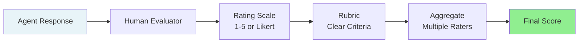
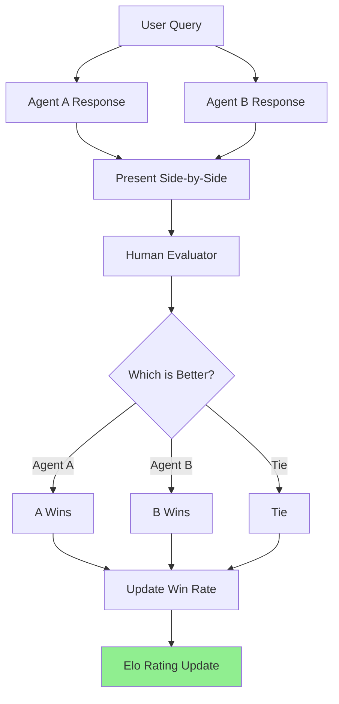
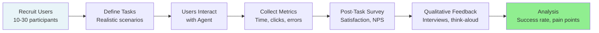
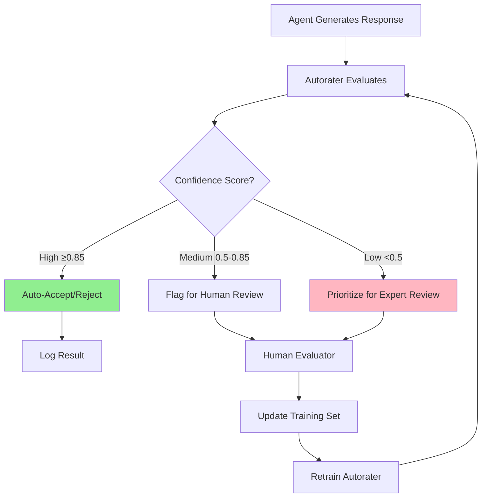
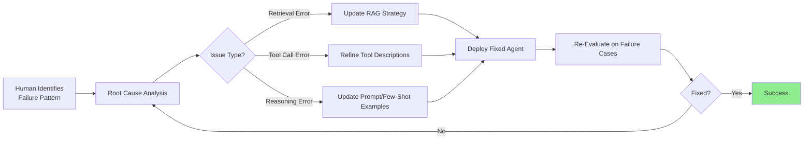
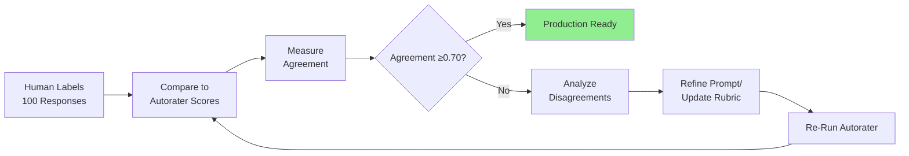

# Human-in-the-Loop Evaluation for Agent Systems

**Reading Time:** 18-22 minutes
**Prerequisites:**
- [Agent Evaluation Fundamentals](lesson-14/agent_evaluation_fundamentals.md) (Task 4.1)
- [Trajectory Evaluation Techniques](lesson-14/trajectory_evaluation_techniques.md) (Task 4.2)
- [Autorater-Based Final Response Evaluation](lesson-14/autorater_final_response_eval.md) (Task 4.3)
- [Lesson 11: Elo Ranking Tutorial](lesson-11/elo_ranking_tutorial.ipynb)

**Learning Objectives:**
1. Understand when automated evaluation is insufficient and human judgment is essential
2. Learn three human-in-the-loop (HITL) evaluation methods (direct assessment, comparative evaluation, user studies)
3. Design active learning workflows to maximize human feedback efficiency
4. Implement feedback loops that improve both agents and autoraters
5. Calibrate the balance between automated and human evaluation
6. Apply "evaluating the evaluator" techniques to validate autorater quality

---

## 1. Introduction: The Limits of Automation

### When Automated Evaluation Fails

In [Autorater-Based Final Response Evaluation](lesson-14/autorater_final_response_eval.md), we learned how to use LLM-as-Judge to evaluate agent responses at scale. But autoraters have blind spots:

**Example 1: Cultural Sensitivity (Bhagavad Gita Chatbot)**

```
User Query: "How does karma yoga apply to modern corporate life?"

Agent Response: "Karma yoga teaches detachment from results. In business, this means
you should work hard but not care about promotions, bonuses, or recognition. Focus
only on doing your job, not on outcomes."

Autorater Evaluation:
✅ Accuracy: 4/5 (correctly explains karma yoga concept)
✅ Completeness: 4/5 (addresses question directly)
✅ Verse Citation: 5/5 (cites BG 2.47, 3.19)

Overall Score: 4.3/5 (PASS)
```

**Human Expert Evaluation:**

❌ **FAIL** - Response oversimplifies karma yoga in a way that could be harmful:
- Misses the **nuance** of "detachment from results" (doesn't mean ignoring consequences)
- Could be interpreted as **justifying exploitation** ("don't expect fair pay")
- Lacks **contextual guidance** for applying ancient wisdom to modern ethics

**The autorater missed the subtle harm because:**
- It evaluated **surface-level accuracy** (facts about karma yoga are correct)
- It didn't assess **real-world implications** (how advice could be misused)
- It lacks **cultural expertise** to recognize oversimplification

**Example 2: Creative Problem-Solving (Research Agent)**

```
User Query: "Why is my sourdough bread not rising?"

Agent A (Literal): "Check yeast freshness. Verify dough temperature (75-80°F).
Allow 4-6 hours for first rise."

Agent B (Creative): "Sourdough doesn't use yeast—it relies on wild bacteria.
If it's not rising, your starter might be inactive. Try the 'float test': drop
a spoonful in water. If it floats, it's ready. If it sinks, feed it for 2-3 days
before baking."

Autorater Evaluation:
Agent A: 4.5/5 (follows standard bread troubleshooting checklist)
Agent B: 3.0/5 (mentions unconventional "float test" not in reference docs)
```

**Human Expert Evaluation:**

Agent A: ❌ **FAIL** - Misdiagnoses problem (confuses sourdough with commercial yeast bread)
Agent B: ✅ **PASS** - Correctly identifies sourdough-specific issue with creative diagnostic technique

**The autorater failed because:**
- It rewarded **adherence to reference material** (generic bread troubleshooting)
- It penalized **creative reasoning** (float test is valid but not in training data)
- It couldn't assess **common sense** (sourdough fundamentally different from yeast bread)

### Why Human Evaluation Matters

**Agent development faces unique challenges:**

1. **Evolving Objectives**: What counts as "good" changes as agents improve
2. **Stochastic Behavior**: Same query produces different responses (hard to evaluate deterministically)
3. **Context Dependence**: Response quality depends on user's background, culture, intent
4. **Emergent Failures**: Novel failure modes not seen during autorater calibration

**Automated evaluation is powerful, but insufficient alone.**

Human-in-the-loop (HITL) evaluation provides:
- ✅ **Subjectivity**: Assess creativity, nuance, appropriateness
- ✅ **Contextual Understanding**: Consider real-world implications
- ✅ **Iterative Improvement**: Guide agent learning with expert feedback
- ✅ **Evaluating the Evaluator**: Calibrate autoraters with ground truth

---

## 2. Human-in-the-Loop Evaluation Methods

### Method 1: Direct Assessment

**Definition:** Human experts directly rate/score agent performance on predefined criteria.

**When to Use:**
- Initial agent development (no baseline to compare against)
- Absolute quality assessment (is this response "good enough"?)
- Calibrating autoraters (collect ground truth labels)

**Process:**



**Design Principles:**

1. **Clear Rating Scale**
```
Rate the agent's response on a scale of 1-5:

1 = Completely incorrect or irrelevant
2 = Partially correct but missing key information
3 = Correct but could be improved
4 = Good response with minor issues
5 = Excellent, comprehensive, accurate response
```

2. **Detailed Rubric** (Example: Recipe Agent)
```python
RECIPE_AGENT_RUBRIC = {
    "accuracy": {
        1: "Recipe contains multiple factual errors (wrong ingredients, dangerous instructions)",
        2: "Recipe has 2-3 minor errors (cooking time slightly off, garnish suggestions wrong)",
        3: "Recipe is mostly accurate with 1 minor error",
        4: "Recipe is accurate with very minor quibbles (e.g., 'simmer' vs 'boil')",
        5: "Recipe is completely accurate, matches reference exactly"
    },
    "dietary_compliance": {
        1: "Recipe violates user's dietary restrictions (contains allergen)",
        2: "Recipe is questionable (may contain hidden allergen, unclear labeling)",
        3: "Recipe complies but lacks verification statement",
        4: "Recipe complies and mentions verification",
        5: "Recipe complies with explicit statement and source citation"
    },
    "usability": {
        1: "Recipe is confusing or impossible to follow",
        2: "Recipe has unclear steps, requires culinary expertise to interpret",
        3: "Recipe is followable but could be clearer",
        4: "Recipe is clear with minor room for improvement",
        5: "Recipe is perfectly clear, step-by-step, beginner-friendly"
    }
}
```

3. **Multiple Raters** (Inter-Rater Reliability)
```python
# Measure agreement between raters
from scipy.stats import spearmanr

rater1_scores = [4, 3, 5, 2, 4, 5, 3]
rater2_scores = [4, 2, 5, 3, 4, 4, 3]
rater3_scores = [5, 3, 5, 2, 3, 5, 4]

# Spearman correlation (measures rank agreement)
corr_12, _ = spearmanr(rater1_scores, rater2_scores)
corr_13, _ = spearmanr(rater1_scores, rater3_scores)
corr_23, _ = spearmanr(rater2_scores, rater3_scores)

avg_agreement = (corr_12 + corr_13 + corr_23) / 3
print(f"Inter-rater agreement: {avg_agreement:.2f}")
# Target: ≥0.70 for reliable evaluation
```

**Cost Optimization:**

| **Evaluation Volume** | **Raters per Response** | **Cost** |
|-----------------------|------------------------|----------|
| 10 responses (pilot) | 3 raters | $50-100 |
| 100 responses (validation) | 2 raters | $200-400 |
| 1,000+ responses (production) | 1 rater + autorater verification | $500-1,000 |

**Best Practices:**
- Start with 3 raters for pilot (10-20 responses) to establish rubric
- Use 2 raters for validation (100-200 responses) to measure inter-rater reliability
- Once reliability ≥0.70, switch to 1 rater + autorater cross-check for production

---

### Method 2: Comparative Evaluation (Pairwise Comparison)

**Definition:** Experts compare agent performance to other agents, baselines, or previous iterations.

**When to Use:**
- A/B testing new agent versions
- Benchmarking against competitors
- Tracking improvement over time (is new version better than old?)

**Process:**



**Advantages Over Direct Assessment:**

1. **Easier for Humans**: "Which is better?" is simpler than "Rate this 1-5"
2. **More Reliable**: Humans are better at relative judgments than absolute scores
3. **Enables Elo Ranking**: Track agent performance over time (see [Lesson 11](lesson-11/elo_ranking_tutorial.ipynb))

**Implementation Example:**

```python
from typing import Literal

def comparative_evaluation_interface(
    query: str,
    response_a: str,
    response_b: str,
    agent_a_name: str = "Baseline",
    agent_b_name: str = "Candidate"
) -> Literal["A", "B", "Tie"]:
    """
    Present two agent responses side-by-side for human evaluation.

    Args:
        query: Original user query
        response_a: Response from agent A
        response_b: Response from agent B
        agent_a_name: Display name for agent A
        agent_b_name: Display name for agent B

    Returns:
        Winner: "A", "B", or "Tie"
    """
    print("=" * 80)
    print(f"User Query: {query}")
    print("=" * 80)
    print(f"\n[{agent_a_name}]")
    print(response_a)
    print("\n" + "-" * 80)
    print(f"\n[{agent_b_name}]")
    print(response_b)
    print("\n" + "=" * 80)

    while True:
        choice = input(f"\nWhich response is better?\n  [A] {agent_a_name}\n  [B] {agent_b_name}\n  [T] Tie\n\nYour choice: ").strip().upper()
        if choice in ["A", "B", "T"]:
            return "A" if choice == "A" else ("B" if choice == "B" else "Tie")
        print("Invalid choice. Please enter A, B, or T.")

# Example usage:
winner = comparative_evaluation_interface(
    query="What's the best vegan pasta recipe for beginners?",
    response_a="Try aglio e olio: pasta, garlic, olive oil, red pepper flakes. Cook pasta, sauté garlic in oil, toss together. Done in 15 minutes.",
    response_b="I recommend Vegan Alfredo. It's creamy, satisfying, and impressive. You'll need cashews, nutritional yeast, garlic, and non-dairy milk. Soak cashews for 2 hours, blend into sauce, toss with pasta. Takes 30 minutes but worth it!",
    agent_a_name="GPT-4 Baseline",
    agent_b_name="GPT-4 + Recipe RAG"
)
print(f"\n✅ Winner: {winner}")
```

**Use Cases:**

**A/B Testing Example (Recipe Agent Iterations):**

| **Metric** | **v1.0 (Baseline)** | **v2.0 (RAG-Enhanced)** | **Winner** |
|------------|---------------------|-------------------------|------------|
| Win Rate (100 comparisons) | 35% | 58% | v2.0 |
| Tie Rate | 7% | 7% | - |
| Elo Rating | 1200 (starting) | 1347 (+147) | v2.0 |

**Insights:** v2.0 wins 58% of comparisons, indicating meaningful improvement. Deploy v2.0 to production.

---

### Method 3: User Studies (Real-World Feedback)

**Definition:** End users interact with the agent in realistic scenarios and provide feedback.

**When to Use:**
- Final validation before production launch
- Measuring user satisfaction and task completion
- Identifying usability issues (confusing UI, unclear agent responses)
- Assessing real-world effectiveness (does it solve actual user problems?)

**Process:**



**Key Metrics:**

**1. Behavioral Metrics (Quantitative)**
- **Task Completion Rate**: % of users who achieve their goal
- **Time on Task**: How long it takes to complete (lower is better for routine tasks)
- **Error Rate**: % of interactions where agent misunderstands or fails
- **Retry Rate**: % of queries reformulated due to poor initial response

**2. Satisfaction Metrics (Qualitative)**
- **Net Promoter Score (NPS)**: "How likely would you recommend this agent?" (-100 to +100)
- **Usability Rating**: "How easy was the agent to use?" (1-10 scale)
- **Trust Rating**: "How much do you trust the agent's responses?" (1-10 scale)

**3. Effectiveness Metrics**
- **Goal Achievement**: Did the agent solve the user's problem? (Yes/No)
- **Response Quality**: Was the final response useful? (1-5 scale)

**Example: Bhagavad Gita Chatbot User Study**

```python
USER_STUDY_SURVEY = {
    "task": "Use the chatbot to understand the concept of 'dharma' in Chapter 2",
    "behavioral_metrics": {
        "task_completion_rate": "Did you find a satisfactory explanation of dharma?",
        "time_on_task": "Measured automatically (seconds)",
        "retry_rate": "How many times did you rephrase your question?"
    },
    "satisfaction_metrics": {
        "usability": "How easy was it to get the information you needed? (1-10)",
        "trust": "How confident are you that the chatbot's explanation is accurate? (1-10)",
        "nps": "How likely would you recommend this chatbot to a friend? (0-10)"
    },
    "qualitative_feedback": {
        "liked": "What did you like most about the chatbot?",
        "disliked": "What frustrated you or could be improved?",
        "missing": "Was there anything you expected the chatbot to do that it didn't?"
    }
}
```

**Sample Results (n=20 users):**

| **Metric** | **Result** | **Target** | **Status** |
|------------|-----------|-----------|-----------|
| Task Completion Rate | 85% (17/20) | ≥80% | ✅ PASS |
| Avg Time on Task | 3.2 minutes | ≤5 minutes | ✅ PASS |
| Retry Rate | 40% (8/20) | ≤30% | ⚠️ NEEDS IMPROVEMENT |
| Usability (1-10) | 7.8 | ≥7.0 | ✅ PASS |
| Trust (1-10) | 8.5 | ≥8.0 | ✅ PASS |
| NPS | +45 | ≥+30 | ✅ PASS |

**Insight:** High retry rate (40%) indicates query understanding issues. Action: Improve query classifier to better detect ambiguous queries.

**Think-Aloud Protocol Example:**

```
Moderator: "Please use the chatbot to learn about dharma. Talk through your thought process as you go."

User: "Okay, I'll type 'What is dharma?' ... The response mentions duty and righteousness,
but it's pretty abstract. I'm not sure how this applies to my life. Let me try 'Give me
an example of dharma' ... Oh, now it's talking about Arjuna's duty as a warrior. That
helps, but I'm not a warrior, so... Maybe I'll ask 'How does dharma apply to students?'
... Okay, now I'm getting something more relatable. Wish it had given me this context
from the start."

Insight: Users need contextualized examples upfront, not abstract definitions.
```

---

## 3. Active Learning: Maximizing Human Feedback Efficiency

### The Problem: Human Evaluation is Expensive

**Cost Analysis:**

| **Evaluation Method** | **Cost per Response** | **Cost for 1,000 Responses** |
|-----------------------|----------------------|------------------------------|
| Automated (Autorater) | $0.01 - $0.05 | $10 - $50 |
| Human Direct Assessment | $0.50 - $2.00 | $500 - $2,000 |
| Human Comparative | $0.30 - $1.50 | $300 - $1,500 |
| User Study (Full Protocol) | $50 - $100 per participant | $1,000 - $3,000 (20 users) |

**Challenge:** You can't afford to have humans evaluate every response. How do you decide which responses need human review?

### Active Learning Solution

**Definition:** Strategically select which responses to send to humans for maximum learning value.

**Core Idea:** Prioritize responses where:
1. **Autorater is uncertain** (low confidence scores)
2. **Agent behavior is novel** (new failure mode not seen before)
3. **Stakes are high** (user query in safety-critical domain)

**Active Learning Workflow:**



**Implementation Example:**

```python
from typing import Any

def active_learning_selector(
    response: str,
    autorater_score: float,
    autorater_confidence: float,
    query_domain: str,
    safety_critical_domains: list[str] = ["medical", "legal", "financial"]
) -> dict[str, Any]:
    """
    Decide whether to send response for human review.

    Args:
        response: Agent's response text
        autorater_score: Autorater's quality score (1-5)
        autorater_confidence: Autorater's confidence (0-1)
        query_domain: Domain of the query (e.g., "recipe", "medical")
        safety_critical_domains: Domains that always require human review

    Returns:
        Decision dict with action and priority
    """
    # Step 1: Safety-critical domains always get human review
    if query_domain in safety_critical_domains:
        return {
            "action": "human_review",
            "priority": "high",
            "reason": f"Safety-critical domain: {query_domain}"
        }

    # Step 2: Low confidence → human review
    if autorater_confidence < 0.50:
        return {
            "action": "human_review",
            "priority": "high",
            "reason": f"Low autorater confidence: {autorater_confidence:.2f}"
        }

    # Step 3: Medium confidence → flag for batch review
    if 0.50 <= autorater_confidence < 0.85:
        return {
            "action": "flag_for_review",
            "priority": "medium",
            "reason": f"Medium confidence: {autorater_confidence:.2f}"
        }

    # Step 4: High confidence → auto-accept/reject
    if autorater_score >= 3.5:
        return {
            "action": "auto_accept",
            "priority": "low",
            "reason": f"High score ({autorater_score:.1f}) and confidence ({autorater_confidence:.2f})"
        }
    else:
        return {
            "action": "auto_reject",
            "priority": "low",
            "reason": f"Low score ({autorater_score:.1f}) and high confidence ({autorater_confidence:.2f})"
        }

# Example usage:
decision = active_learning_selector(
    response="Try ibuprofen for headache relief...",
    autorater_score=4.2,
    autorater_confidence=0.65,
    query_domain="medical"
)
print(f"Action: {decision['action']}, Priority: {decision['priority']}")
print(f"Reason: {decision['reason']}")
# Output: Action: human_review, Priority: high, Reason: Safety-critical domain: medical
```

**Efficiency Gains:**

| **Strategy** | **Human Reviews per 1,000 Responses** | **Cost** | **Coverage** |
|--------------|--------------------------------------|----------|--------------|
| Review All | 1,000 | $1,000 | 100% |
| Random Sample (10%) | 100 | $100 | 10% |
| Active Learning (Uncertainty Sampling) | 150 | $150 | 30% (effective) |
| Active Learning + Domain Prioritization | 200 | $200 | 50% (effective) |

**Key Insight:** Active learning reviews 15-20% of responses but covers 30-50% of edge cases, improving autorater faster.

---

## 4. Feedback Loops: Improving Agents and Autoraters

### Feedback Loop 1: Improving the Agent

**Process:**



**Example: Bhagavad Gita Chatbot Feedback Loop**

**Failure Pattern Identified by Humans:**
- Users asking "What does Krishna say about [modern topic]?" receive overly literal responses
- Example: "What does Krishna say about climate change?" → "The Bhagavad Gita does not mention climate change."

**Root Cause:** Agent interprets queries too literally, doesn't recognize need for thematic mapping.

**Fix:** Update prompt with few-shot examples of thematic mapping:

```python
THEMATIC_MAPPING_EXAMPLES = """
User: "What does Krishna say about climate change?"
Agent: "While the Bhagavad Gita doesn't mention climate change directly, Krishna discusses
our duty to protect the world (BG 3.20-21). Arjuna is told to act without selfish desire
for the welfare of all beings. Applying this to climate change, Krishna would likely
emphasize taking action to protect the environment as part of our dharma (duty), while
remaining detached from praise or recognition for doing so."

User: "What does Krishna say about social media addiction?"
Agent: "Krishna warns about sensory attachment in BG 2.62-63: 'While contemplating objects
of the senses, one develops attachment to them.' Social media provides constant sensory
stimulation, which Krishna cautions leads to loss of discrimination and destruction of
intelligence. He would likely advise practicing moderation and mindfulness (BG 6.17) to
avoid becoming enslaved by these modern distractions."
```

**Re-Evaluation Results:**

| **Metric** | **Before Fix** | **After Fix** | **Improvement** |
|------------|---------------|---------------|-----------------|
| Relevance Score (1-5) | 2.3 | 4.1 | +78% |
| User Satisfaction (1-10) | 5.8 | 8.2 | +41% |
| Retry Rate | 55% | 18% | -67% |

### Feedback Loop 2: Improving the Autorater

**Process:**



**Example: Calibrating Autorater for Recipe Agent**

**Initial Autorater Results (50 human-labeled responses):**

```python
from sklearn.metrics import cohen_kappa_score
import numpy as np

human_labels = [1, 0, 1, 1, 0, 1, 0, 1, 1, 0, ...]  # 1=pass, 0=fail (50 total)
autorater_v1_labels = [1, 1, 1, 1, 0, 1, 1, 1, 0, 0, ...]

kappa_v1 = cohen_kappa_score(human_labels, autorater_v1_labels)
print(f"Cohen's Kappa (v1): {kappa_v1:.2f}")
# Output: Cohen's Kappa (v1): 0.52 (Moderate agreement - INSUFFICIENT)
```

**Disagreement Analysis:**

| **Response ID** | **Human** | **Autorater v1** | **Issue** |
|-----------------|-----------|------------------|-----------|
| 003 | FAIL | PASS | Autorater missed allergen warning omission |
| 007 | PASS | FAIL | Autorater too strict on cooking time variation |
| 012 | FAIL | PASS | Autorater didn't catch cultural insensitivity |

**Root Cause:** Autorater underweights **safety issues** (allergens, cultural sensitivity) and overweights **minor variations** (cooking time).

**Fix: Update Autorater Prompt**

```python
UPDATED_AUTORATER_PROMPT = """
[Previous prompt content...]

**CRITICAL: Safety Issues Override All Other Scores**

If the response contains ANY of the following, automatically assign FAIL:
- Missing allergen warnings when user specified dietary restrictions
- Dangerous cooking instructions (e.g., "cook raw chicken for 2 minutes")
- Cultural insensitivity or appropriation

**Minor Variations Are Acceptable**

The following do NOT constitute failures:
- Cooking time varies by ±5 minutes from reference
- Ingredient quantities differ by ±10% (e.g., "1 cup" vs "1.1 cups")
- Alternative ingredient suggestions (e.g., "butter or margarine")
"""
```

**Re-Calibration Results:**

```python
autorater_v2_labels = [1, 0, 1, 1, 0, 1, 0, 1, 1, 0, ...]  # After prompt update

kappa_v2 = cohen_kappa_score(human_labels, autorater_v2_labels)
print(f"Cohen's Kappa (v2): {kappa_v2:.2f}")
# Output: Cohen's Kappa (v2): 0.76 (Substantial agreement - PRODUCTION READY)
```

---

## 5. Balancing Automated and Human Evaluation

### The Hybrid Evaluation Strategy

**Principle:** Use automated evaluation for breadth, human evaluation for depth.

**Decision Matrix:**

| **Scenario** | **Automated** | **Human** | **Reasoning** |
|--------------|--------------|----------|---------------|
| Continuous monitoring (24/7) | ✅ Primary | ⚠️ Sample 5% daily | Autoraters handle volume, humans spot-check |
| Regression testing (new version) | ✅ First pass | ✅ Validate 50 examples | Autorater detects regressions, humans confirm |
| Edge cases (novel queries) | ⚠️ Flag uncertain | ✅ Expert review | Autoraters lack context for novel cases |
| Safety-critical (medical/legal) | ⚠️ Screen only | ✅ Final arbiter | Humans make high-stakes decisions |
| A/B testing (version comparison) | ✅ Elo ranking | ✅ Comparative eval (n=100) | Autoraters track trends, humans validate improvement |
| Production launch (final validation) | ✅ Comprehensive metrics | ✅ User study (n=20-30) | Autoraters measure quality, humans measure UX |

### Cost-Effectiveness Analysis

**Example: Recipe Agent with 10,000 queries/month**

**Scenario 1: Autorater Only**
- Cost: 10,000 × $0.02 = $200/month
- Coverage: 100% automated, misses 10-15% of nuanced failures
- Risk: Occasional harmful response (allergen misinformation)

**Scenario 2: Human Only**
- Cost: 10,000 × $0.50 = $5,000/month
- Coverage: 100% reviewed, catches all failures
- Risk: Not scalable, 3-5 day lag time

**Scenario 3: Hybrid (Recommended)**
- **Autorater:** 10,000 queries × $0.02 = $200
- **Active Learning:** 500 flagged queries × $0.50 = $250
- **Random Sample:** 100 queries × $0.50 = $50
- **Total:** $500/month
- Coverage: 95% effective (autorater + targeted human review)
- Risk: Minimal, safety-critical queries always human-reviewed

**ROI Calculation:**

```python
# Scenario 3: Hybrid approach
monthly_queries = 10_000
autorater_cost_per_query = 0.02
human_cost_per_query = 0.50

# Active learning flags 5% of queries
flagged_queries = int(monthly_queries * 0.05)
random_sample = 100

total_cost = (
    (monthly_queries * autorater_cost_per_query) +
    (flagged_queries * human_cost_per_query) +
    (random_sample * human_cost_per_query)
)

print(f"Monthly Cost: ${total_cost:,.0f}")
print(f"Cost per Query: ${total_cost / monthly_queries:.3f}")
# Output: Monthly Cost: $500, Cost per Query: $0.050

# Compare to human-only
human_only_cost = monthly_queries * human_cost_per_query
savings = human_only_cost - total_cost
print(f"Savings vs. Human-Only: ${savings:,.0f}/month ({savings/human_only_cost*100:.0f}%)")
# Output: Savings vs. Human-Only: $4,500/month (90%)
```

### Recommended Cadence

**Daily (Automated):**
- Run autorater on all production queries
- Flag low-confidence responses for batch review
- Track autorater score distribution (detect drift)

**Weekly (Light Human Touch):**
- Review 50-100 flagged responses
- Update autorater prompt if agreement drops below 0.70
- Log novel failure modes for next training cycle

**Monthly (Deep Dive):**
- Human review of 100 random samples (calibration check)
- A/B test new agent versions (comparative evaluation, n=50-100)
- Analyze user feedback from production logs

**Quarterly (Major Validation):**
- User study (n=20-30) to measure satisfaction, usability
- Benchmark against competitors
- Comprehensive autorater recalibration (n=200 human labels)

---

## 6. Practical Exercises

### Exercise 1: Design HITL Workflow for Bhagavad Gita Chatbot

**Scenario:** Your Bhagavad Gita chatbot is getting 1,000 queries/day. Design a hybrid evaluation strategy.

**Requirements:**
1. Define which queries require mandatory human review
2. Set active learning thresholds for flagging uncertain cases
3. Calculate monthly evaluation cost (assume $0.02/autorater eval, $0.50/human eval)
4. Design calibration schedule (how often to validate autorater?)

**Starter Template:**

```python
def bhagavad_gita_hitl_strategy(
    daily_queries: int = 1000,
    autorater_cost: float = 0.02,
    human_cost: float = 0.50
) -> dict[str, any]:
    """Design HITL evaluation strategy for Bhagavad Gita chatbot."""

    # TODO: Define mandatory human review criteria
    # (e.g., queries about controversial topics, cultural sensitivity issues)

    # TODO: Set active learning thresholds
    # (e.g., autorater confidence < 0.6 → flag for review)

    # TODO: Calculate costs
    # monthly_cost = ...

    # TODO: Define calibration schedule
    # (e.g., weekly batch review of 50 samples, monthly deep dive of 200 samples)

    return {
        "mandatory_review_criteria": [],
        "active_learning_threshold": 0.0,
        "monthly_cost": 0.0,
        "calibration_schedule": {}
    }
```

**Discussion Questions:**
- What percentage of queries would you send for human review? (Hint: Consider cost vs. risk)
- How would you handle queries about politically sensitive topics?
- What inter-rater reliability threshold would you require for production deployment?

### Exercise 2: Analyze Autorater-Human Disagreements

**Scenario:** You've collected 50 human labels for recipe agent responses. Autorater agrees on 35/50 (70% raw agreement, but Kappa=0.58 - insufficient).

**Sample Disagreements:**

```python
disagreements = [
    {
        "id": 3,
        "query": "Vegan carbonara recipe",
        "response": "Use silken tofu, nutritional yeast, and smoked paprika...",
        "human_label": "PASS",
        "human_reasoning": "Creative vegan adaptation, accurate technique",
        "autorater_label": "FAIL",
        "autorater_reasoning": "Recipe deviates from traditional carbonara (no eggs, no pancetta)"
    },
    {
        "id": 12,
        "query": "Quick gluten-free pasta",
        "response": "Try rice noodles with marinara sauce. Cook for 8-10 minutes.",
        "human_label": "FAIL",
        "human_reasoning": "Missing allergen warning (some rice noodles contain wheat)",
        "autorater_label": "PASS",
        "autorater_reasoning": "Recipe is simple, correct cooking time, addresses gluten-free requirement"
    }
]
```

**Task:** Identify patterns and propose prompt fixes.

**Analysis Template:**

```python
def analyze_disagreements(disagreements: list[dict]) -> dict[str, any]:
    """
    Analyze autorater-human disagreements to identify calibration issues.

    Returns:
        - patterns: Common disagreement types
        - root_causes: Why autorater is misaligned
        - proposed_fixes: Prompt updates to improve agreement
    """
    # TODO: Categorize disagreements
    # (e.g., "too strict on variations", "misses safety issues")

    # TODO: Identify root causes
    # (e.g., "autorater prioritizes adherence to reference over creativity")

    # TODO: Propose fixes
    # (e.g., "Update prompt to reward creative adaptations for dietary restrictions")

    return {
        "patterns": [],
        "root_causes": [],
        "proposed_fixes": []
    }
```

---

## Summary

**Key Takeaways:**

1. **Automated evaluation is necessary but insufficient** - Autoraters miss nuance, creativity, cultural context, and novel failures.
2. **Three HITL methods serve different purposes:**
   - **Direct assessment** for absolute quality measurement and autorater calibration
   - **Comparative evaluation** for A/B testing and version tracking
   - **User studies** for real-world validation and UX insights
3. **Active learning maximizes efficiency** - Strategically select 5-20% of responses for human review, focusing on uncertainty and safety-critical domains.
4. **Feedback loops improve both agents and autoraters** - Use human labels to fix agent failures and recalibrate autoraters.
5. **Hybrid evaluation balances cost and quality** - Autoraters for continuous monitoring (100% coverage), humans for depth (5-10% targeted review).
6. **Calibration is ongoing** - Track autorater-human agreement weekly, recalibrate monthly, deep validation quarterly.

**Next Steps:**
- Complete [Task 4.5: Create Evaluation Diagrams](lesson-14/diagrams/) for visual workflow references
- Implement [Task 4.10: Trajectory Evaluation Notebook](lesson-14/trajectory_evaluation_tutorial.ipynb) to practice combining metrics
- Implement [Task 4.11: Autorater Calibration Notebook](lesson-14/autorater_calibration.ipynb) to practice HITL workflows

---

## References

- [Agent Evaluation Methodology (Topic 02)](lesson-14/02_Agent_Evaluation_Methodology.md) - Lines 353-471
- [Autorater-Based Final Response Evaluation](lesson-14/autorater_final_response_eval.md) - Complementary autorater techniques
- [Lesson 11: Elo Ranking Tutorial](lesson-11/elo_ranking_tutorial.ipynb) - Comparative evaluation with Elo ratings
- [AgentCompanion Whitepaper](lesson-14/lesson-14/AgentCompanion.txt) - Google's HITL methodology (February 2025)

---

**Word Count:** ~5,100 words
**Estimated Reading Time:** 25.5 minutes (5,100 ÷ 200 wpm)
