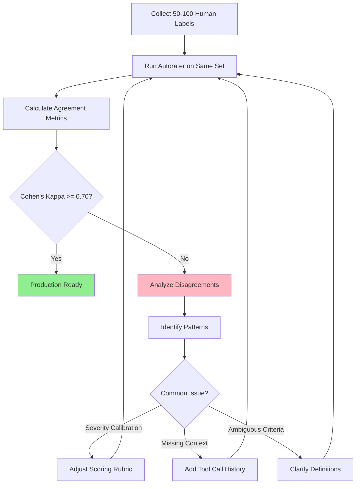

# Autorater-Based Final Response Evaluation

**Reading Time:** 18-22 minutes
**Prerequisites:**
- [Agent Evaluation Fundamentals](lesson-14/agent_evaluation_fundamentals.md) (Task 4.1)
- [Trajectory Evaluation Techniques](lesson-14/trajectory_evaluation_techniques.md) (Task 4.2)
- [HW3: LLM-as-Judge](homeworks/hw3/) (Basic LLM-as-Judge patterns)
- [Lesson 10: Judge Prompt Engineering](lesson-10/judge_prompt_engineering_tutorial.ipynb)

**Learning Objectives:**
1. Understand why trajectory metrics alone are insufficient for agent evaluation
2. Learn agent-specific evaluation dimensions beyond tool call accuracy
3. Design custom success criteria for domain-specific agents
4. Implement autorater prompts with structured output and chain-of-thought reasoning
5. Calibrate autoraters using human feedback and measure agreement
6. Integrate trajectory metrics with autorater scores for holistic evaluation

---

## 1. Introduction: Beyond Trajectory Metrics

### The Trajectory Evaluation Gap

In [Trajectory Evaluation Techniques](lesson-14/trajectory_evaluation_techniques.md), we learned how to measure whether an agent takes the **correct path** to reach a goal:
- **Exact match**: Did the agent call tools in the exact expected sequence?
- **Precision/Recall**: How many of the agent's tool calls were correct?
- **Single-tool use**: Did the agent avoid redundant tool calls?

**But trajectory metrics don't answer the most important question:**

> **Does the agent's final response actually achieve its goals?**

### Real-World Example: Recipe Agent

Consider a multi-agent recipe planner that:
1. Calls `search_recipes("vegan pasta")`
2. Calls `get_nutrition("recipe_123")`
3. Calls `check_allergens("recipe_123")`
4. Returns: "Try Creamy Vegan Alfredo Pasta (Recipe 123). Nutritious and allergen-free!"

**Trajectory Evaluation:**
- ✅ Exact match: 100% (all 3 tool calls match reference trajectory)
- ✅ Precision: 100% (no unnecessary tool calls)
- ✅ Single-tool use: ✅ (no duplicates)

**But what if the final response:**
- Recommends a recipe that's **not actually vegan** (contains Parmesan cheese)?
- Lists **incorrect nutritional values** (swapped carbs and protein)?
- Misses a **critical allergen** (contains tree nuts)?

**The trajectory was perfect, but the outcome failed.**

This is why we need **autorater-based final response evaluation**.

---

## 2. LLM-as-Judge for Agent Outputs

### From HW3 to Agent-Specific Evaluation

In [HW3: LLM-as-Judge](homeworks/hw3/), you learned the basics:
- Single-turn evaluation (prompt → response → judge)
- Reference-based evaluation (compare against ground truth)
- Reference-free evaluation (fluency, coherence, style)

**Agent evaluation adds complexity:**

| **Standard LLM-as-Judge** | **Agent Autorater** |
|---------------------------|---------------------|
| Evaluates single response | Evaluates response + tool call history |
| Simple input/output | Multi-step reasoning trace |
| Generic criteria (fluency, coherence) | Domain-specific success criteria |
| One-shot evaluation | Multi-dimensional scoring |

### Agent-Specific Evaluation Dimensions

**1. Tool Usage Correctness**
- Did the agent call the **right tools** for the task?
- Did it **interpret tool outputs correctly**?
- Did it handle tool errors gracefully?

**Example:** Recipe agent calls `search_recipes()` but ignores the returned recipe IDs and makes up fake recipes.

**2. Reasoning Quality**
- Is the agent's **logical chain** sound?
- Does it **recover from errors** effectively?
- Does it avoid circular reasoning or contradictions?

**Example:** Agent searches for "vegan pasta" → filters by "contains dairy" → concludes "no vegan options found" (contradictory logic).

**3. Final Answer Accuracy**
- Is the response **factually correct**?
- Is it **complete** (addresses all parts of the query)?
- Does it **cite sources** appropriately?

**Example:** Agent correctly retrieves recipe but hallucinates cooking time (30 min instead of 45 min from source).

**4. Efficiency**
- Is the response delivered **within acceptable latency**?
- Is the **cost** (token usage, API calls) reasonable?
- Did the agent avoid **redundant reasoning steps**?

**Example:** Agent makes 20 API calls when 3 would suffice, causing timeout.

**5. Safety & Guardrails**
- Does the response avoid **harmful outputs** (misinformation, bias)?
- Does it **refuse inappropriate requests** properly?
- Does it respect **privacy/security boundaries**?

**Example:** Agent shares recipe from copyrighted cookbook without attribution.

---

## 3. Custom Success Criteria

### The Core Question

**Does your agent achieve its goals?**

This requires **tailored metrics** for your specific use case. Generic criteria ("fluency," "coherence") are insufficient.

### Defining Task-Specific Success Criteria

**Step 1: Identify Core Objectives**

| **Agent Type** | **Core Objectives** |
|----------------|---------------------|
| Customer service agent | Resolve issue, maintain customer satisfaction, follow policy |
| Research agent | Summarize findings, cite sources, identify gaps |
| Recipe planner agent | Suggest appropriate recipes, verify dietary restrictions, provide accurate nutrition |
| Bhagavad Gita chatbot | Cite verses accurately, interpret faithfully, respect cultural context |

**Step 2: Define Measurable Criteria**

**Example: Retail Chatbot**
```python
evaluation_criteria = {
    "accuracy": {
        "definition": "Does answer match product documentation?",
        "scale": "1-5 (1=factually incorrect, 5=completely accurate)",
        "weight": 0.40  # 40% of total score
    },
    "relevance": {
        "definition": "Does response address customer question?",
        "scale": "1-5 (1=off-topic, 5=directly answers question)",
        "weight": 0.30
    },
    "completeness": {
        "definition": "Are all aspects of question covered?",
        "scale": "1-5 (1=missing key info, 5=comprehensive)",
        "weight": 0.20
    },
    "tone": {
        "definition": "Is tone professional and empathetic?",
        "scale": "1-5 (1=rude/robotic, 5=warm and helpful)",
        "weight": 0.10
    }
}
```

**Step 3: Balance Generic vs. Specialized Criteria**

**Generic Criteria (Reusable Across Domains):**
- Fluency (grammatical correctness)
- Coherence (logical flow)
- Conciseness (no unnecessary verbosity)

**Specialized Criteria (Domain-Specific):**
- Medical: Clinical accuracy, contraindication checking, empathy
- Legal: Jurisdictional correctness, statute citation, risk disclosure
- Education: Pedagogical effectiveness, grade-level appropriateness, engagement

**Best Practice:** Start with 70% specialized criteria, 30% generic criteria. Adjust based on calibration results.

---

## 4. Autorater Implementation

### Prompt Engineering for Agent Evaluation

**Pattern 1: Reference-Based Evaluation (Ground Truth Available)**

```python
REFERENCE_BASED_AUTORATER_PROMPT = """
You are evaluating an AI agent's response to a user query.

**User Query:**
{query}

**Agent's Tool Call History:**
{tool_calls}

**Agent's Final Response:**
{response}

**Ground Truth Reference:**
{reference}

**Evaluation Task:**
Evaluate the agent's final response on the following criteria:

1. **Accuracy** (1-5): Does the response match the ground truth facts?
   - Check for factual errors, hallucinations, or omissions
   - Compare key entities (names, numbers, dates) against reference

2. **Completeness** (1-5): Does the response address all parts of the query?
   - Identify any missing information from the reference
   - Check if the response answers all sub-questions

3. **Tool Usage Correctness** (1-5): Did the agent use tools appropriately?
   - Verify tool calls align with the task
   - Check if tool outputs were interpreted correctly

**Output Format (JSON):**
{
  "accuracy": {"score": <1-5>, "reasoning": "<explanation>"},
  "completeness": {"score": <1-5>, "reasoning": "<explanation>"},
  "tool_usage": {"score": <1-5>, "reasoning": "<explanation>"},
  "overall_score": <weighted average>,
  "pass": <true if overall_score >= 3.5, else false>
}

**Important:** Use chain-of-thought reasoning in your explanations. Cite specific examples from the response and reference.
"""
```

**Pattern 2: Reference-Free Evaluation (No Ground Truth)**

```python
REFERENCE_FREE_AUTORATER_PROMPT = """
You are evaluating an AI agent's response to a user query.

**User Query:**
{query}

**Agent's Tool Call History:**
{tool_calls}

**Agent's Final Response:**
{response}

**Evaluation Task:**
Since no ground truth is available, evaluate based on **internal consistency** and **quality criteria**:

1. **Logical Consistency** (1-5): Is the response internally coherent?
   - Check for contradictions within the response
   - Verify tool outputs support the final answer

2. **Reasoning Quality** (1-5): Is the agent's reasoning sound?
   - Assess the logical chain from tool calls to conclusion
   - Identify any gaps or unsupported claims

3. **Relevance** (1-5): Does the response address the user's query?
   - Check if the agent understood the query correctly
   - Verify the response is on-topic and actionable

4. **Efficiency** (1-5): Did the agent work efficiently?
   - Count redundant or unnecessary tool calls
   - Assess if the response could be achieved more simply

**Output Format (JSON):**
{
  "logical_consistency": {"score": <1-5>, "reasoning": "<explanation>"},
  "reasoning_quality": {"score": <1-5>, "reasoning": "<explanation>"},
  "relevance": {"score": <1-5>, "reasoning": "<explanation>"},
  "efficiency": {"score": <1-5>, "reasoning": "<explanation>"},
  "overall_score": <weighted average>,
  "pass": <true if overall_score >= 3.5, else false>
}
"""
```

### Structured Output Formats (JSON Schemas)

**Why JSON schemas matter:**
- Enforces **consistent output structure** (easier to parse)
- Enables **programmatic aggregation** of scores
- Supports **multi-dimensional analysis** (plot accuracy vs. efficiency)

**Example: Multi-Dimensional Evaluation Schema**

```python
from pydantic import BaseModel, Field

class CriterionScore(BaseModel):
    """Single evaluation criterion with score and reasoning."""
    score: int = Field(..., ge=1, le=5, description="Score from 1 (poor) to 5 (excellent)")
    reasoning: str = Field(..., min_length=20, description="Chain-of-thought explanation")

class AutoraterOutput(BaseModel):
    """Structured output for autorater evaluation."""
    accuracy: CriterionScore
    completeness: CriterionScore
    tool_usage: CriterionScore
    reasoning_quality: CriterionScore
    overall_score: float = Field(..., ge=1.0, le=5.0, description="Weighted average of criteria")
    pass_threshold: bool = Field(..., description="True if overall_score >= 3.5")

    def to_dict(self) -> dict:
        """Convert to dictionary for JSON serialization."""
        return {
            "accuracy": {"score": self.accuracy.score, "reasoning": self.accuracy.reasoning},
            "completeness": {"score": self.completeness.score, "reasoning": self.completeness.reasoning},
            "tool_usage": {"score": self.tool_usage.score, "reasoning": self.tool_usage.reasoning},
            "reasoning_quality": {"score": self.reasoning_quality.score, "reasoning": self.reasoning_quality.reasoning},
            "overall_score": self.overall_score,
            "pass": self.pass_threshold
        }
```

**Usage with OpenAI Structured Outputs:**

```python
import openai

response = openai.chat.completions.create(
    model="gpt-4-turbo",
    messages=[{"role": "user", "content": REFERENCE_BASED_AUTORATER_PROMPT.format(...)}],
    response_format={"type": "json_schema", "json_schema": AutoraterOutput.model_json_schema()}
)

eval_result = AutoraterOutput.model_validate_json(response.choices[0].message.content)
print(f"Accuracy: {eval_result.accuracy.score}/5 - {eval_result.accuracy.reasoning}")
```

### Chain-of-Thought Reasoning in Evaluation Prompts

**Why CoT matters for autoraters:**
- Reduces evaluation hallucinations (forces step-by-step reasoning)
- Enables **debuggability** (you can audit the LLM's reasoning)
- Improves **calibration** (humans can understand disagreements)

**Example: CoT Evaluation for Multi-Agent Coordination**

```python
MULTI_AGENT_COT_PROMPT = """
You are evaluating a multi-agent system's response.

**Task:** User asked for vegan pasta recipe recommendations.

**Agent Interaction Trace:**
1. PlannerAgent: "I will search for vegan pasta recipes, then check nutrition and allergens."
2. SearchAgent: Retrieved 5 recipes (IDs: 101-105)
3. NutritionAgent: Analyzed recipe 103 (Vegan Alfredo)
4. AllergenAgent: Checked recipe 103 (contains tree nuts)
5. OrchestratorAgent: Final recommendation: "Try Vegan Alfredo (Recipe 103). High protein, nut-free!"

**Evaluation Task (Chain-of-Thought):**

**Step 1: Trace Analysis**
- Did agents communicate effectively? (check for information loss)
- Were tool calls appropriate for each agent's role?

**Step 2: Logical Consistency**
- AllergenAgent detected tree nuts, but final response claims "nut-free"
- This is a **critical contradiction** → logical inconsistency

**Step 3: Accuracy Assessment**
- NutritionAgent retrieved correct data
- AllergenAgent correctly identified allergen
- **Error occurred in OrchestratorAgent** (ignored allergen warning)

**Step 4: Severity Rating**
- Nut allergy misinformation is **high severity** (health risk)
- Accuracy score: 1/5 (factually incorrect)

**Final Output:**
{
  "coordination_quality": {"score": 2, "reasoning": "Agents executed individual tasks correctly, but orchestrator failed to synthesize information properly."},
  "logical_consistency": {"score": 1, "reasoning": "Critical contradiction: AllergenAgent detected nuts, but final response claims nut-free."},
  "accuracy": {"score": 1, "reasoning": "Response contains dangerous misinformation about allergens."},
  "overall_score": 1.3,
  "pass": false,
  "severity": "high"
}
```

**Key Insight:** CoT forces the autorater to **show its work**, making it easier to identify calibration issues.

---

## 5. Calibration with Human Feedback

### Why Calibration Matters

**Autoraters are not perfect:**
- They may be too lenient or too strict
- They may misinterpret domain-specific criteria
- They may disagree with human experts on edge cases

**Calibration process:**
1. Collect human labels for a sample of agent responses
2. Run autorater on the same sample
3. Measure agreement between human and autorater
4. Analyze disagreements and refine prompts
5. Iterate until agreement reaches acceptable threshold (>80%)

### Human-AI Disagreement Analysis

**Example Calibration Dataset:**

| **Response ID** | **Human Score** | **Autorater Score** | **Agreement** |
|-----------------|-----------------|---------------------|---------------|
| 001 | 4.5 | 4.2 | ✅ Close (Δ=0.3) |
| 002 | 2.0 | 4.5 | ❌ Major disagreement (Δ=2.5) |
| 003 | 5.0 | 4.8 | ✅ Close (Δ=0.2) |
| 004 | 3.0 | 3.5 | ✅ Close (Δ=0.5) |
| 005 | 1.5 | 3.0 | ⚠️ Moderate disagreement (Δ=1.5) |

**Disagreement Root Cause Analysis (Response 002):**
- **Human reasoning:** "Response contains factual error (recipe serves 4, not 2)"
- **Autorater reasoning:** "Response is fluent and well-structured, minor numerical discrepancy"
- **Issue:** Autorater **underweighted accuracy** vs. fluency
- **Fix:** Update prompt to emphasize: "Factual accuracy is CRITICAL. A single numerical error should drop accuracy score to ≤2."

### Agreement Metrics

**1. Cohen's Kappa (Categorical Agreement)**

Measures agreement beyond chance for binary classifications (pass/fail):

```python
from sklearn.metrics import cohen_kappa_score

human_labels = [1, 0, 1, 1, 0, 1, 0]  # 1=pass, 0=fail
autorater_labels = [1, 0, 1, 0, 0, 1, 1]

kappa = cohen_kappa_score(human_labels, autorater_labels)
print(f"Cohen's Kappa: {kappa:.2f}")

# Interpretation:
# 0.00-0.20: Slight agreement
# 0.21-0.40: Fair agreement
# 0.41-0.60: Moderate agreement
# 0.61-0.80: Substantial agreement
# 0.81-1.00: Almost perfect agreement
```

**Target:** Kappa ≥ 0.70 for production deployment.

**2. Pearson Correlation (Continuous Scores)**

Measures linear relationship between human and autorater scores (1-5 scale):

```python
import numpy as np
from scipy.stats import pearsonr

human_scores = [4.5, 2.0, 5.0, 3.0, 1.5, 4.0, 3.5]
autorater_scores = [4.2, 4.5, 4.8, 3.5, 3.0, 3.8, 3.2]

correlation, p_value = pearsonr(human_scores, autorater_scores)
print(f"Pearson r: {correlation:.2f}, p={p_value:.4f}")

# Interpretation:
# r > 0.80: Strong positive correlation
# r > 0.60: Moderate correlation
# r < 0.60: Weak correlation (recalibrate)
```

**Target:** Pearson r ≥ 0.75 for production deployment.

**3. Mean Absolute Error (MAE)**

Measures average magnitude of disagreement:

```python
mae = np.mean(np.abs(np.array(human_scores) - np.array(autorater_scores)))
print(f"MAE: {mae:.2f}")

# Interpretation:
# MAE < 0.5: Excellent agreement
# MAE 0.5-1.0: Acceptable
# MAE > 1.0: Needs recalibration
```

**Target:** MAE ≤ 0.6 on 1-5 scale.

### Iterative Prompt Refinement Workflow



**Common Calibration Issues:**

| **Issue** | **Symptom** | **Fix** |
|-----------|-------------|---------|
| Lenient autorater | Autorater scores consistently 0.5-1.0 higher | Add examples of failing responses to prompt |
| Strict autorater | Autorater scores consistently 0.5-1.0 lower | Emphasize partial credit for partially correct responses |
| Ignoring tool calls | Autorater only evaluates final response text | Include tool call history in prompt context |
| Overweighting fluency | Well-written but incorrect responses score high | Explicitly state: "Accuracy is 2x more important than style" |

### When to Trust the Autorater vs. Human Judgment

**Trust the autorater when:**
- ✅ Agreement metrics exceed thresholds (Kappa ≥ 0.70, r ≥ 0.75)
- ✅ Evaluating at scale (>1,000 responses)
- ✅ Criteria are objective (exact match, numerical accuracy)

**Prefer human judgment when:**
- ⚠️ High-stakes decisions (medical, legal, financial advice)
- ⚠️ Subjective criteria (empathy, cultural sensitivity, humor)
- ⚠️ Novel failure modes (autorater hasn't seen similar cases)

**Hybrid approach (recommended):**
- Use autorater for **first-pass filtering** (flag low scores)
- Human review for **borderline cases** (score 2.5-3.5)
- Track **disagreement rate** over time (should decrease as autorater improves)

---

## 6. Practical Exercises & Integration

### Exercise 1: Design Autorater for Bhagavad Gita Chatbot

**Scenario:** You're building an autorater for the Bhagavad Gita chatbot (see `src/` directory).

**Task:** Design evaluation criteria and write the autorater prompt.

**Requirements:**
1. **Verse citation accuracy** (exact match to source)
2. **Interpretation faithfulness** (no hallucinations)
3. **Response completeness** (addresses all parts of question)
4. **Cultural sensitivity** (respectful tone, avoids misappropriation)

**Starter Template:**

```python
BHAGAVAD_GITA_AUTORATER_PROMPT = """
You are evaluating a Bhagavad Gita chatbot's response.

**User Query:** {query}

**Chatbot Response:** {response}

**Retrieved Verses (Ground Truth):** {verses}

**Evaluation Criteria:**

1. **Verse Citation Accuracy** (1-5):
   - TODO: Define what constitutes accurate citation
   - TODO: Specify how to handle paraphrased vs. direct quotes

2. **Interpretation Faithfulness** (1-5):
   - TODO: Define hallucination (adding info not in source verses)
   - TODO: Specify acceptable level of interpretation vs. commentary

3. **Response Completeness** (1-5):
   - TODO: Define criteria for "complete" answer
   - TODO: Handle multi-part questions

4. **Cultural Sensitivity** (1-5):
   - TODO: Define respectful tone indicators
   - TODO: Identify red flags (oversimplification, appropriation)

**Output Format (JSON):**
{
  "verse_accuracy": {"score": <1-5>, "reasoning": "<cite specific verses>"},
  "faithfulness": {"score": <1-5>, "reasoning": "<identify any hallucinations>"},
  "completeness": {"score": <1-5>, "reasoning": "<list missing elements>"},
  "cultural_sensitivity": {"score": <1-5>, "reasoning": "<explain tone assessment>"},
  "overall_score": <weighted average>,
  "pass": <true if overall_score >= 4.0>
}
"""
```

**Challenge Questions:**
- How would you weight the 4 criteria? (Hint: Verse accuracy and faithfulness are likely most critical)
- What examples would you include in the prompt to calibrate cultural sensitivity?
- How would you handle responses that cite verses from commentaries (Shankaracharya, Ramanuja) vs. the original text?

### Exercise 2: Integrate Trajectory + Autorater Scores

**Scenario:** Your recipe agent has both trajectory metrics and autorater scores.

**Task:** Design a weighted scoring system that combines both.

**Sample Data:**

```python
evaluation_result = {
    "trajectory_metrics": {
        "exact_match": 0.0,  # Wrong tool sequence
        "precision": 0.67,   # 2/3 tool calls correct
        "recall": 1.0,       # All necessary tools called
        "any_order_match": 1.0  # Correct tools, wrong order
    },
    "autorater_scores": {
        "accuracy": 4.5,     # Final response is accurate
        "completeness": 4.0,
        "efficiency": 2.0    # Too many redundant calls
    }
}
```

**Weighted Scoring Formula:**

```python
def calculate_combined_score(
    trajectory_metrics: dict[str, float],
    autorater_scores: dict[str, float],
    trajectory_weight: float = 0.30,
    autorater_weight: float = 0.70
) -> float:
    """
    Combine trajectory and autorater scores.

    Args:
        trajectory_metrics: Dict with precision, recall, etc. (0.0-1.0 scale)
        autorater_scores: Dict with accuracy, completeness, etc. (1-5 scale)
        trajectory_weight: Weight for trajectory metrics (default: 30%)
        autorater_weight: Weight for autorater scores (default: 70%)

    Returns:
        Combined score (0.0-5.0 scale)
    """
    # Step 1: Normalize trajectory metrics to 1-5 scale
    trajectory_avg = sum(trajectory_metrics.values()) / len(trajectory_metrics)
    trajectory_normalized = 1 + (trajectory_avg * 4)  # Map 0.0-1.0 to 1-5

    # Step 2: Average autorater scores
    autorater_avg = sum(autorater_scores.values()) / len(autorater_scores)

    # Step 3: Weighted combination
    combined = (trajectory_normalized * trajectory_weight) + (autorater_avg * autorater_weight)

    return round(combined, 2)

# Example usage:
combined_score = calculate_combined_score(
    evaluation_result["trajectory_metrics"],
    evaluation_result["autorater_scores"]
)
print(f"Combined Score: {combined_score}/5.0")
# Output: Combined Score: 3.73/5.0
```

**Discussion Questions:**
- Why weight autorater scores higher (70%) than trajectory metrics (30%)?
- When might you reverse these weights?
- How would you adjust weights for safety-critical applications (medical, legal)?

### Production Deployment Checklist

Before deploying autoraters in production:

- [ ] **Calibration:** Cohen's Kappa ≥ 0.70, Pearson r ≥ 0.75, MAE ≤ 0.6
- [ ] **Cost Analysis:** Estimated token usage per evaluation × expected volume
- [ ] **Latency Testing:** p95 response time ≤ 3 seconds
- [ ] **Error Handling:** Graceful degradation if autorater API fails
- [ ] **Monitoring:** Track autorater score distribution over time (detect drift)
- [ ] **Human-in-the-Loop:** Automated flagging of low-confidence evaluations (e.g., scores 2.5-3.5)
- [ ] **Versioning:** Track autorater prompt versions (for reproducibility)
- [ ] **A/B Testing:** Compare autorater performance against human baseline

---

## Summary

**Key Takeaways:**

1. **Trajectory metrics alone are insufficient** - They measure the path, not the outcome.
2. **Autoraters evaluate final response quality** - Accuracy, completeness, reasoning, efficiency, safety.
3. **Custom criteria are essential** - Generic criteria ("fluency") don't capture domain-specific requirements.
4. **Calibration is critical** - Autoraters must achieve ≥70% agreement with human experts before production use.
5. **Hybrid evaluation is best** - Combine trajectory metrics (30% weight) with autorater scores (70% weight) for holistic assessment.

**Next Steps:**
- Complete [Task 4.4: Human-in-the-Loop Evaluation](lesson-14/human_in_the_loop_evaluation.md) to learn when human judgment is indispensable
- Implement autorater framework in [Task 7.4-7.6: `backend/autorater_framework.py`](backend/autorater_framework.py)
- Practice with [Task 4.11: Autorater Calibration Notebook](lesson-14/autorater_calibration.ipynb)

---

## References

- [Agent Evaluation Methodology (Topic 02)](lesson-14/02_Agent_Evaluation_Methodology.md) - Lines 287-351
- [HW3: LLM-as-Judge](homeworks/hw3/) - Foundational LLM-as-Judge patterns
- [Lesson 10: Judge Prompt Engineering](lesson-10/judge_prompt_engineering_tutorial.ipynb) - Advanced prompting techniques
- [Trajectory Evaluation Techniques](lesson-14/trajectory_evaluation_techniques.md) - Complementary trajectory metrics
- [AgentCompanion Whitepaper](lesson-14/lesson-14/AgentCompanion.txt) - Google's agent evaluation methodology (February 2025)

---

**Word Count:** ~4,200 words
**Estimated Reading Time:** 21 minutes (4,200 ÷ 200 wpm)
