# Lesson 16 Diagrams: Visual Learning Materials

**Generated:** Task 6.0 (2025-11-24)
**Purpose:** Visual aids for agent reliability concepts and orchestration pattern selection
**Format:** Mermaid (`.mmd`) with PNG/SVG exports for complex diagrams

---

## Overview

This directory contains **6 Mermaid diagrams** supporting Lesson 16 tutorials and notebooks. Diagrams are designed to be:
- **Standalone understandable** (labels, annotations, legend)
- **GitHub-renderable** (Mermaid syntax in markdown)
- **Print-friendly** (PNG/SVG exports for presentations)

**Total Diagrams:** 6 (5 from Task 6.0 + 1 bonus notebook dependency diagram)

---

## Diagram Catalog

### 1. Reliability Failure Modes Taxonomy
**File:** [`reliability_failure_modes_taxonomy.mmd`](reliability_failure_modes_taxonomy.mmd)
**Type:** Decision Tree (Flowchart)
**Complexity:** Medium (15+ nodes)
**Referenced in:** [Tutorial 01: Agent Reliability Fundamentals](../tutorials/01_agent_reliability_fundamentals.md)

**Description:**
Decision tree mapping 5 failure modes to symptoms, root causes, and mitigation strategies.

**Flow:** Symptom → Root Cause → Mitigation → Tutorial Reference

**Failure Modes Covered:**
1. **Hallucinations** → Schema validation + database lookups
2. **Error Propagation** → Isolation boundaries + circuit breakers
3. **Timeouts** → Retry with exponential backoff
4. **Context Overflow** → Chunking + summarization
5. **Non-Determinism** → Temperature=0 + checkpointing

**Usage:**
```markdown

```

**Rendering:** ✅ Renders in GitHub markdown viewer

---

### 2. Orchestration Pattern Selection
**File:** [`orchestration_pattern_selection.mmd`](orchestration_pattern_selection.mmd)
**Type:** Decision Flowchart
**Complexity:** High (20+ nodes, 7 decision paths)
**Exports:** [PNG](orchestration_pattern_selection.png), [SVG](orchestration_pattern_selection.svg)
**Referenced in:** [Tutorial 02: Orchestration Patterns Overview](../tutorials/02_orchestration_patterns_overview.md), [Tutorial 05: AgentArch Benchmark](../tutorials/05_agentarch_benchmark_methodology.md)

**Description:**
Flowchart implementing DC3 decision tree: business requirements → recommended orchestration pattern.

**Decision Paths:**
1. **Minimize latency (<5s SLA)?** → Hierarchical (parallel specialists)
2. **Minimize cost (budget-constrained)?** → Sequential (fewest LLM calls)
3. **Maximize reliability (>95% success)?** → State Machine or Voting
4. **Handle ambiguous inputs?** → Iterative Refinement (ReAct)
5. **Audit trail required (compliance)?** → State Machine (explicit FSM transitions)
6. **High-stakes decisions (fraud >$10K)?** → Voting (5-agent consensus)
7. **Deterministic outputs (regression tests)?** → State Machine (FSM guarantees)

**Pattern Comparison Table:**
| Pattern | Success Rate | Latency | Cost | Use Case |
|---------|--------------|---------|------|----------|
| Sequential | 70% | 12s | 1.0× | Simple workflows |
| Hierarchical | 80% | 8s | 1.3× | Complex decomposition |
| Iterative | 75% | 18s | 2.1× | Self-correction needed |
| State Machine | 85% | 10s | 1.1× | Compliance/audit |
| Voting | 90% | 15s | 5.0× | High-stakes decisions |

**Usage:**
```markdown

```

**Rendering:** ✅ PNG export available (2400×1800px)

---

### 3. Error Propagation Cascade
**File:** [`error_propagation_cascade.mmd`](error_propagation_cascade.mmd)
**Type:** Sequence Diagram
**Complexity:** Medium (5 agents, 10+ interactions)
**Referenced in:** [Tutorial 04: Error Propagation Analysis](../tutorials/04_error_propagation_analysis.md)

**Description:**
Sequence diagram showing how a single error at Agent2 cascades through a 5-agent sequential workflow, and how isolation boundaries prevent propagation.

**Timeline:**
1. **Step 1:** Agent1 success → Extracts "Acme Corp" ✅
2. **Step 2:** Agent2 hallucination → Outputs "ACME" (typo) ❌
3. **Step 3:** Agent3 uses corrupted vendor → Database lookup fails ❌
4. **Step 4:** Agent4 calculates wrong payment → Wrong account ❌
5. **Step 5:** Agent5 routes to wrong approver → Compliance violation ❌

**Error Propagation Index (EPI):** 4 downstream errors / 1 root cause = **4.0**

**With Isolation:**
- **Validation gate at Step 3** catches vendor typo
- **Early termination** prevents Steps 4-5 from executing
- **Final EPI:** 0.0 (error contained)

**Usage:**
```markdown

```

**Rendering:** ✅ Renders in GitHub markdown viewer

---

### 4. Reliability Framework Architecture
**File:** [`reliability_framework_architecture.mmd`](reliability_framework_architecture.mmd)
**Type:** Component Diagram
**Complexity:** High (7 layers, 15+ components)
**Referenced in:** [Tutorial 01: Agent Reliability Fundamentals](../tutorials/01_agent_reliability_fundamentals.md), [Notebook 13: Reliability Framework](../notebooks/13_reliability_framework_implementation.ipynb)

**Description:**
Component diagram showing 7-layer reliability framework architecture with module dependencies and data flow.

**Layers:**
1. **Core Orchestrator** (sequential, hierarchical, iterative, state_machine, voting)
2. **Execution Wrappers** (retry.py, circuit_breaker.py)
3. **State Management** (checkpoint.py, validation.py)
4. **Error Handling** (isolation.py, fallback.py)
5. **Observability** (audit_log.py)
6. **Agent Interface** (mock agents for testing, real LLM agents for production)
7. **External Systems** (Redis cache, Elasticsearch logs, Prometheus metrics)

**Call Flow:**
```
Request → Retry → Circuit Breaker → Agent → Validation → Checkpoint → Audit Log → Response
```

**Integration Points:**
- **Orchestrator** calls **retry_with_backoff()** for each agent
- **Circuit breaker** guards external API calls
- **Validation** uses **Pydantic schemas** to catch hallucinations
- **Checkpoint** saves state after each step
- **Audit log** records all decisions for compliance

**Usage:**
```markdown

```

**Rendering:** ✅ Renders in GitHub markdown viewer

---

### 5. AgentArch Benchmark Results
**File:** [`agentarch_benchmark_results.mmd`](agentarch_benchmark_results.mmd)
**Type:** Bar Chart Template
**Complexity:** Medium (5 patterns × 4 metrics = 20 data points)
**Referenced in:** [Tutorial 05: AgentArch Benchmark Methodology](../tutorials/05_agentarch_benchmark_methodology.md), [Notebook 14: Benchmark Reproduction](../notebooks/14_agentarch_benchmark_reproduction.ipynb)

**Description:**
Bar chart template visualizing expected benchmark results from FR5.3. Shows 5 orchestration patterns across 4 evaluation metrics with ±15% tolerance bands.

**Metrics:**
1. **Task Success Rate (%)** - Higher is better
2. **Error Propagation Index** - Lower is better
3. **Latency P50 (seconds)** - Lower is better
4. **Cost Multiplier (vs baseline)** - Lower is better

**Expected Results:**
| Pattern | Success Rate | EPI | Latency | Cost |
|---------|--------------|-----|---------|------|
| Sequential (baseline) | 70% | 3.2 | 12s | 1.0× |
| Hierarchical | 80% | 1.8 | 8s | 1.3× |
| Iterative (ReAct) | 75% | 1.2 | 18s | 2.1× |
| State Machine | 85% | 0.4 | 10s | 1.1× |
| Voting (5 agents) | 90% | 0.3 | 15s | 5.0× |

**Tolerance Bands:** ±15% (per SM4.1 in PRD)

**Usage:**
```markdown

```

**Note:** This is a **template with expected values**. Notebook 14 generates actual results from benchmark execution.

**Rendering:** ✅ Renders in GitHub markdown viewer

---

### 6. Notebook Dependency Diagram (Bonus)
**File:** [`notebook_dependency_diagram.mmd`](notebook_dependency_diagram.mmd)
**Type:** Directed Graph
**Complexity:** High (15+ nodes, multiple dependency paths)
**Referenced in:** [Notebook Integration Tests](../tests/test_notebook_integration.py)

**Description:**
Learning graph showing relationships between 8 notebooks, 7 tutorials, backend modules, and datasets. Helps students understand prerequisite order and learning progression.

**Learning Paths:**
- **Foundation Path:** Tutorials 01-04 → Notebooks 08-12 → Notebook 13
- **Benchmark Path:** Tutorial 05 → Notebook 14 → Tutorial 06-07 → Notebook 15
- **Pattern Comparison:** Notebooks 08-12 converge at Notebook 14 for comparative evaluation

**Dependencies:**
- All notebooks depend on **backend/orchestrators** and **backend/reliability**
- Notebook 14 additionally depends on **backend/benchmarks** and all 3 **datasets**
- Notebooks 08-12 reference **data/** but use samples, not full datasets

**Usage:**
```markdown

```

**Rendering:** ✅ Renders in GitHub markdown viewer

---

## Rendering Instructions

### GitHub Markdown
All diagrams render automatically in GitHub markdown viewers. Simply reference in `.md` files:

```markdown

```

### Local Rendering (VS Code)
Install Mermaid Preview extension:
1. Open VS Code
2. Install "Markdown Preview Mermaid Support" extension
3. Open `.mmd` file
4. Press `Ctrl+Shift+V` (Windows/Linux) or `Cmd+Shift+V` (Mac)

### PNG/SVG Export (for presentations)

**Using Mermaid CLI (mmdc):**

```bash
# Install Mermaid CLI globally
npm install -g @mermaid-js/mermaid-cli

# Export single diagram to PNG
mmdc -i diagrams/orchestration_pattern_selection.mmd \
     -o diagrams/orchestration_pattern_selection.png \
     -w 2400 -H 1800 -b transparent

# Export to SVG (scalable for print)
mmdc -i diagrams/orchestration_pattern_selection.mmd \
     -o diagrams/orchestration_pattern_selection.svg \
     -b transparent

# Batch export all diagrams
for file in diagrams/*.mmd; do
  basename="${file%.mmd}"
  mmdc -i "$file" -o "${basename}.png" -w 2400 -H 1800 -b transparent
  echo "Exported ${basename}.png"
done
```

**Configuration Options:**
- `-w 2400`: Width in pixels (default: 800)
- `-H 1800`: Height in pixels (default: 600)
- `-b transparent`: Transparent background (or `white`, `#f0f0f0`)
- `-s 2`: Scale factor for high-DPI displays

**Recommended Sizes:**
- **Presentation slides:** `-w 1920 -H 1080` (16:9 aspect ratio)
- **Print (A4):** `-w 2480 -H 3508` (300 DPI)
- **Web documentation:** `-w 1200 -H 900`

### Online Rendering (Mermaid Live Editor)
1. Go to https://mermaid.live/
2. Copy diagram content from `.mmd` file
3. Paste into editor (live preview appears)
4. Export as PNG/SVG using toolbar buttons

---

## Diagram Complexity Guidelines

**When to export PNG/SVG:**
- ✅ **High complexity** (>20 nodes): Export for better readability
- ✅ **Presentations**: PNG at 1920×1080 for slides
- ✅ **Print materials**: SVG for scalable quality
- ❌ **Simple diagrams** (<10 nodes): Mermaid rendering sufficient

**Current Exports:**
- `orchestration_pattern_selection.mmd` → PNG + SVG (20+ nodes)
- Other diagrams: Mermaid rendering sufficient

---

## Troubleshooting

### Issue: Diagram doesn't render in GitHub
**Symptom:** Raw Mermaid syntax displayed instead of diagram

**Solution 1:** Check Mermaid syntax
```bash
# Validate syntax with mmdc
mmdc -i diagrams/diagram_name.mmd -o /dev/null
# If errors, check for:
# - Missing semicolons in flowcharts
# - Unbalanced quotes in labels
# - Invalid node IDs (no spaces/special chars)
```

**Solution 2:** Use code fence with `mermaid` tag
```markdown
​```mermaid
graph TD
  A[Start] --> B[End]
​```
```

### Issue: PNG export is blurry
**Symptom:** Text unreadable in exported PNG

**Solution:** Increase resolution and scale
```bash
mmdc -i diagram.mmd -o diagram.png -w 4800 -H 3600 -s 3
```

### Issue: SVG export has cut-off content
**Symptom:** Bottom of diagram missing in SVG

**Solution:** Don't specify `-H` height, let it auto-size
```bash
mmdc -i diagram.mmd -o diagram.svg -w 2400 -b transparent
# Height auto-adjusts to content
```

### Issue: Diagram too complex to understand
**Symptom:** Too many nodes, overlapping lines

**Solution:** Split into multiple diagrams or simplify
- Break into 2-3 separate diagrams (e.g., separate paths in flowchart)
- Use subgraphs for logical grouping
- Reduce node labels to keywords (add detail in caption)

---

## Cross-References

### Tutorials
- [Tutorial 01: Agent Reliability Fundamentals](../tutorials/01_agent_reliability_fundamentals.md) - Uses diagrams 1, 4
- [Tutorial 02: Orchestration Patterns Overview](../tutorials/02_orchestration_patterns_overview.md) - Uses diagram 2
- [Tutorial 04: Error Propagation Analysis](../tutorials/04_error_propagation_analysis.md) - Uses diagram 3
- [Tutorial 05: AgentArch Benchmark Methodology](../tutorials/05_agentarch_benchmark_methodology.md) - Uses diagrams 2, 5

### Notebooks
- [Notebook 13: Reliability Framework](../notebooks/13_reliability_framework_implementation.ipynb) - References diagram 4
- [Notebook 14: AgentArch Benchmark](../notebooks/14_agentarch_benchmark_reproduction.ipynb) - References diagram 5
- [Test Integration](../tests/test_notebook_integration.py) - References diagram 6

### External Resources
- [Mermaid Documentation](https://mermaid.js.org/intro/)
- [Mermaid Live Editor](https://mermaid.live/)
- [Mermaid CLI (mmdc)](https://github.com/mermaid-js/mermaid-cli)

---

## Contributing New Diagrams

### Design Principles
1. **Standalone understandable:** Include legend, labels, annotations
2. **Actionable:** Show decision points, not just descriptions
3. **Referenced:** Link from tutorials/notebooks
4. **Tested:** Validate syntax renders correctly

### Template Structure

```mermaid
graph TD
  %% Title and metadata
  title["Diagram Title"]

  %% Main flow
  A[Start] --> B{Decision?}
  B -->|Yes| C[Action 1]
  B -->|No| D[Action 2]

  %% Annotations
  note1["📝 Note: Important detail"]

  %% Styling
  classDef success fill:#d4edda,stroke:#28a745
  classDef failure fill:#f8d7da,stroke:#dc3545
  class C success
  class D failure
```


### Quality Checklist
- [ ] Mermaid syntax validates (`mmdc -i diagram.mmd -o /dev/null`)
- [ ] Renders correctly in GitHub markdown preview
- [ ] Exported PNG/SVG if complexity >20 nodes
- [ ] Cross-referenced in at least 1 tutorial or notebook
- [ ] Documented in this README with description and usage
- [ ] Tested in integration tests (`test_diagrams.py` or `test_integration_task6.py`)

---

**Maintained by:** AI Evaluation Course Team
**Last Updated:** 2025-11-24
**Version:** 1.0
