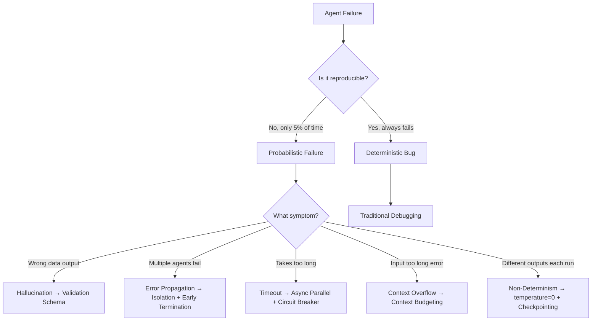

# Tutorial 01: Agent Reliability Fundamentals

**Estimated Reading Time:** 18 minutes
**Prerequisites:**
- Basic understanding of LLM agents
- Python async/await patterns (optional)
- Lessons 9-11 evaluation fundamentals (recommended but not required)

**Learning Objectives:**
- Understand 5 failure modes that plague production agent systems
- Recognize why deterministic systems thinking doesn't apply to probabilistic AI
- Identify enterprise reliability requirements for agent systems
- Apply defensive strategies to mitigate common failure patterns
- Evaluate trade-offs between reliability and development velocity

**Related Resources:**
- **Next Tutorial:** [Tutorial 02: Orchestration Patterns Overview](02_orchestration_patterns_overview.md)
- **Interactive Notebooks:**
  - [Notebook 13: Reliability Framework Implementation](../notebooks/13_reliability_framework_implementation.ipynb) - Hands-on demo of all 7 reliability components
- **Backend Code:**
  - `backend/reliability/` - All 7 reliability components (retry, circuit breaker, checkpoint, validation, isolation, audit log, fallback)
- **Diagrams:**
  - Failure Modes Taxonomy (to be created in Task 6.6)

---

## Table of Contents
1. [Introduction](#introduction)
2. [Core Concepts](#core-concepts)
3. [The Five Failure Modes](#the-five-failure-modes)
4. [Enterprise Reliability Requirements](#enterprise-reliability-requirements)
5. [Reliability Mindset for AI Systems](#reliability-mindset-for-ai-systems)
6. [Mitigation Strategies Overview](#mitigation-strategies-overview)
7. [Common Pitfalls](#common-pitfalls)
8. [Hands-On Exercises](#hands-on-exercises)
9. [Summary](#summary)
10. [Further Reading](#further-reading)

---

## Introduction

**What you'll learn:**
This tutorial introduces the foundational concepts of agent reliability—the systematic approach to preventing, detecting, and recovering from failures in LLM-powered agent systems operating at production scale.

**Why this matters:**
Unlike traditional software where bugs are deterministic and reproducible, AI agents fail probabilistically. An invoice processing agent might extract vendor names correctly 95% of the time, then suddenly hallucinate "ACME Corp" instead of "Acme Corporation" on the 96th invoice, triggering a cascade of downstream errors in payment routing, compliance logging, and audit trails.

Without reliability engineering, these "5% edge cases" compound. Five agents chained together, each with 95% success, yield only 77% end-to-end reliability (0.95^5 = 0.77). In enterprise contexts—financial services, healthcare, legal—this is unacceptable.

**Real-world scenario:**
A financial services company deploys an agent-based invoice approval workflow. On day 1, it processes 50 invoices with 92% success. On day 30, the same workflow achieves only 73% success. What changed? Nothing in the code. The failure modes—hallucinations, context overflow, error propagation—were always present, but statistically invisible until scale exposed them.

This tutorial teaches you to think probabilistically about agent reliability and build systems that anticipate failure rather than react to it.

---

## Core Concepts

### Concept 1: Probabilistic Failures vs. Deterministic Bugs

**Definition:**
Traditional software bugs are **deterministic**—given the same input, the same code path executes and produces the same failure every time. Agent failures are **probabilistic**—the same input may succeed 19 times and fail on the 20th invocation due to stochastic model behavior, context window shifts, or API throttling.

**Key characteristics:**
- **Non-reproducibility:** Failures may not occur in testing or development environments
- **Statistical manifestation:** Issues become visible only at scale (100+ executions)
- **Latent errors:** Silent failures that appear correct but contain subtle inaccuracies
- **Context sensitivity:** Success rates vary with input complexity, prompt length, and model temperature

**Example:**
```python
# Deterministic bug (traditional software)
def parse_date(date_str: str) -> str:
    return date_str.split("-")[3]  # IndexError: always fails on "2024-01-15"

# Probabilistic failure (LLM agent)
async def extract_vendor(invoice_text: str) -> str:
    response = await llm.generate(f"Extract vendor name: {invoice_text}")
    # 95% correct: "Acme Corporation"
    # 5% hallucination: "ACME Corp", "Acme Inc.", or "Unknown Vendor"
    return response.choices[0].message.content
```

**Why this matters:**
Traditional testing strategies (unit tests, integration tests) may pass 100% while production systems silently degrade. Reliability engineering requires **statistical testing** (run 1000× with varied inputs) and **probabilistic monitoring** (track success rate distributions, not binary pass/fail).

---

### Concept 2: Cascade Failures and Error Propagation

**Definition:**
A **cascade failure** occurs when an error in one agent propagates downstream, causing multiple dependent agents to fail or produce incorrect outputs. The **Error Propagation Index (EPI)** measures how many downstream errors result from one upstream failure.

**Key characteristics:**
- **Amplification:** One hallucination triggers 3-5 downstream errors
- **Compounding accuracy loss:** 95% → 90% → 86% → 82% across 4 agents (multiplicative degradation)
- **Hidden corruption:** Downstream agents don't know their inputs are incorrect
- **Debugging complexity:** Root cause may be 5 steps removed from observable symptom

**Example:**
```python
# Invoice processing workflow (5 agents)
# Step 1: Agent1 extracts vendor → Hallucinates "ACME" instead of "Acme Corp" ❌
# Step 2: Agent2 validates vendor → Database lookup fails (no "ACME") ❌
# Step 3: Agent3 categorizes expense → Uses wrong category (vendor unknown) ❌
# Step 4: Agent4 calculates tax → Wrong jurisdiction (wrong category) ❌
# Step 5: Agent5 routes approval → Wrong manager (wrong department) ❌
# Result: 1 upstream error → 4 downstream errors → EPI = 4.0
```

**Visualization:**
```
Agent1 (Extraction)  ──✓──> Agent2 (Validation) ──✓──> Agent3 (Routing) ──✓──> SUCCESS

Agent1 (Extraction)  ──❌──> Agent2 (Validation) ──❌──> Agent3 (Routing) ──❌──> CASCADE FAILURE
   Hallucination           Wrong input               Corrupted state
```

**Why this matters:**
Without **error isolation** and **early termination**, single-point failures cascade through entire workflows. Tutorial 04 covers cascade prevention in depth.

---

### Concept 3: Context Window Overflow

**Definition:**
**Context overflow** occurs when an agent's input (prompt + conversation history + retrieved documents) exceeds the model's maximum context length, causing truncation, refusal, or degraded performance.

**Key characteristics:**
- **Silent degradation:** Model may accept truncated input without error
- **Position bias:** Models prioritize recent context, losing early information
- **Cost explosion:** Large contexts consume tokens even when truncated
- **Latency spikes:** Processing 100K tokens takes 10× longer than 10K

**Example:**
```python
# Scenario: Multi-turn conversation with document retrieval
prompt = "Summarize the vendor contract for invoice INV-2024-789"
retrieved_docs = retrieve_top_k(query=prompt, k=20)  # 20 documents × 5K tokens = 100K tokens
conversation_history = get_last_n_turns(n=50)        # 50 turns × 500 tokens = 25K tokens
total_context = prompt + retrieved_docs + conversation_history  # 125K tokens

# If model has 128K context limit:
# - Only 3K tokens remain for output
# - Truncation may drop critical contract clauses
# - Model may refuse: "Context too long, please simplify"
```

**Mitigation strategies:**
- **Context budgeting:** Allocate token limits per component (50K retrieval + 20K history + 10K output)
- **Sliding window:** Keep only last N conversation turns
- **Hierarchical summarization:** Compress old conversations before adding to context
- **Streaming validation:** Check context size before invoking model

---

### Concept 4: Non-Deterministic Outputs

**Definition:**
**Non-determinism** means the same prompt with the same model configuration can produce different outputs across invocations, making debugging, testing, and compliance challenging.

**Key characteristics:**
- **Temperature > 0:** Sampling introduces randomness (creativity vs. reproducibility trade-off)
- **Model updates:** Provider model upgrades change behavior invisibly
- **A/B testing conflicts:** Different user groups see different outputs for identical inputs
- **Regression testing failures:** Tests pass Monday, fail Tuesday with same code

**Example:**
```python
# Same prompt, 3 different outputs (temperature=0.7)
prompt = "Extract the invoice date from: 'Invoice #12345 dated January 15, 2024'"

# Run 1: "2024-01-15" ✓ (ISO format)
# Run 2: "January 15, 2024" ✓ (natural language)
# Run 3: "15/01/2024" ✗ (wrong format for US systems)
```

**When non-determinism is acceptable:**
- Creative tasks (content generation, brainstorming)
- Exploratory analysis (initial data summarization)
- User-facing chat (varied phrasing improves UX)

**When non-determinism is problematic:**
- Financial calculations (amounts, tax rates must be exact)
- Compliance logging (outputs must be auditable and reproducible)
- Regression testing (tests must yield consistent pass/fail)

**Mitigation:**
Set `temperature=0` for deterministic tasks. See [Tutorial 03: Deterministic Execution Strategies](03_deterministic_execution_strategies.md) for comprehensive techniques.

---

### Concept 5: Transient vs. Persistent Failures

**Definition:**
- **Transient failures:** Temporary issues that resolve on retry (API rate limits, network timeouts, model overload)
- **Persistent failures:** Fundamental issues that won't resolve without intervention (hallucinations, invalid prompts, corrupted data)

**Key characteristics:**

| Failure Type | Cause | Retry Helps? | Mitigation |
|--------------|-------|--------------|------------|
| Transient | API timeout | ✅ Yes | Retry with exponential backoff |
| Transient | Rate limit (429) | ✅ Yes | Retry after delay |
| Persistent | Hallucination | ❌ No | Validation schema + database lookup |
| Persistent | Malformed input | ❌ No | Input sanitization |
| Persistent | Context overflow | ❌ No | Context budgeting |

**Example:**
```python
# Transient failure: Retry succeeds
try:
    response = await llm.generate(prompt)
except TimeoutError:
    await asyncio.sleep(2)  # Wait 2 seconds
    response = await llm.generate(prompt)  # ✅ Succeeds

# Persistent failure: Retry doesn't help
try:
    response = await llm.generate(prompt)
    extracted_date = response.date  # Hallucination: "2025-99-99"
except ValidationError:
    # Retrying won't fix hallucination
    # Need schema validation + fallback strategy
    pass
```

**Why this matters:**
**Retry logic** (exponential backoff) solves transient failures. **Validation** and **fallback strategies** handle persistent failures. Applying retry to persistent failures wastes time and money.

---

## The Five Failure Modes

### FR2.1: Hallucinations (Fabricated Data)

**What it is:**
The agent outputs plausible-sounding but factually incorrect information that wasn't in the input documents.

**Real-world example:**
Invoice extraction agent reads "Vendor: Acme Corporation" but outputs "Vendor: ACME Corp International LLC". Downstream payment agent routes $50K to wrong bank account.

**Symptoms:**
- Vendor names don't match database records
- Invoice amounts differ from source documents
- Dates are plausible but incorrect (e.g., "2024-02-30" fails validation)

**Root cause:**
LLMs are trained to predict plausible next tokens, not to verify factual accuracy. Without grounding, they "fill in gaps" with hallucinated details.

**Mitigation:**
- **Pydantic validation schemas:** Enforce field types and constraints (see `backend/reliability/validation.py:25-78`)
- **Database lookups:** Cross-reference extracted values against source of truth
- **Confidence scoring:** Flag low-confidence extractions for human review
- **Citation tracking:** Require agents to cite source document sections

**Code reference:**
```python
# backend/reliability/validation.py:61-77
@field_validator("amount")
@classmethod
def validate_amount_positive(cls, v: float) -> float:
    """Validate that amount is positive (catches hallucinated negatives)."""
    if v <= 0:
        raise ValueError("Amount must be positive")
    return v
```

---

### FR2.2: Error Propagation (Cascade Failures)

**What it is:**
An error in one agent causes multiple downstream agents to fail or produce incorrect outputs, amplifying the impact of the initial failure.

**Real-world example:**
Sequential invoice workflow: Agent1 hallucinates vendor → Agent2 validates against wrong database → Agent3 miscategorizes expense → Agent4 calculates wrong tax → Agent5 routes to wrong approver. **EPI = 4.0** (one upstream error caused 4 downstream errors).

**Symptoms:**
- Single root cause error appears in multiple system components
- Error reports show correlated failures (same invoice_id across 5 agents)
- Debugging reveals errors started N steps before observable symptom

**Root cause:**
Agents trust their inputs implicitly. No validation gates between steps. Errors compound multiplicatively (0.95 × 0.95 × 0.95 = 0.86 success rate across 3 agents).

**Mitigation:**
- **Validation gates:** Check outputs before passing to next agent
- **Early termination:** Stop workflow if critical validation fails
- **Error isolation:** Use Result[T, E] types to prevent exceptions from crashing orchestrator (see `backend/reliability/isolation.py:32-48`)
- **Circuit breakers:** Fail fast when error rate exceeds threshold

**Code reference:**
```python
# backend/reliability/isolation.py:66-76
@classmethod
def success(cls, value: T) -> Result[T, E]:
    """Create a Success result."""
    return cls(value=value, error=None)

@classmethod
def failure(cls, error: E) -> Result[T, E]:
    """Create a Failure result."""
    return cls(value=None, error=error)
```

See [Tutorial 04: Error Propagation Analysis](04_error_propagation_analysis.md) for comprehensive cascade prevention strategies.

---

### FR2.3: Timeouts (Latency Spikes)

**What it is:**
Agent calls exceed acceptable latency thresholds (e.g., >60 seconds), causing user-facing failures or workflow deadlocks.

**Real-world example:**
Fraud detection agent processing high-value transaction ($100K) generates 10 specialist sub-queries, each taking 15 seconds. Total latency: 150 seconds. User-facing SLA: 10 seconds. **Timeout breach: 15×**.

**Symptoms:**
- User-facing "Request timed out" errors
- Background jobs killed by orchestration system
- Partial results returned (some agents completed, others timed out)

**Root causes:**
- **Context overflow:** 100K token contexts take 60+ seconds to process
- **Sequential execution:** N agents × 10s each = N×10s total latency
- **External API slowness:** Database lookups, third-party APIs add latency
- **Model overload:** Provider infrastructure throttles during peak hours

**Mitigation:**
- **Async parallel execution:** Run independent agents concurrently (see `backend/orchestrators/hierarchical.py` for ThreadPoolExecutor pattern)
- **Timeout wrappers:** Enforce max execution time per agent
- **Circuit breakers:** Skip slow agents after failure threshold
- **Latency budgets:** Allocate time limits per workflow step

**Code reference:**
```python
# backend/reliability/retry.py:82-104 (timeout + retry combined)
for attempt in range(max_retries + 1):
    try:
        # Apply timeout wrapper
        result = await asyncio.wait_for(func(*args, **kwargs), timeout=30.0)
        return result
    except asyncio.TimeoutError:
        if attempt < max_retries:
            delay = base_delay * (exponential_base ** attempt)
            await asyncio.sleep(delay)
        else:
            raise  # Final timeout
```

---

### FR2.4: Context Overflow (Input Length Limits)

**What it is:**
Agent input exceeds model's maximum context length (typically 8K-200K tokens), causing truncation, refusal, or quality degradation.

**Real-world example:**
Legal contract review agent receives 50-page contract (80K tokens) + 30 conversation turns (15K tokens) + retrieval results (40K tokens) = 135K tokens. Model limit: 128K tokens. **Overflow: 7K tokens silently truncated**, potentially dropping indemnification clause.

**Symptoms:**
- Model refuses with "Context too long" error
- Silent truncation leads to incomplete analysis
- Response quality degrades as context approaches limit
- Latency spikes (large contexts slow processing)

**Root causes:**
- **Unbounded retrieval:** Fetching top-50 documents instead of top-5
- **Unlimited conversation history:** Storing all turns without pruning
- **Large document ingestion:** Processing entire contracts instead of relevant sections
- **Prompt bloat:** Over-engineered prompts with excessive instructions

**Mitigation:**
- **Context budgeting:** Allocate token limits (e.g., 50K retrieval + 30K history + 40K output)
- **Sliding window:** Keep only last N conversation turns
- **Hierarchical summarization:** Compress old context before adding new
- **Semantic chunking:** Split large documents into processable segments

**Code reference:**
```python
# Example: Context budget enforcement
MAX_CONTEXT = 128_000
RETRIEVAL_BUDGET = 50_000
HISTORY_BUDGET = 30_000
OUTPUT_BUDGET = 40_000

def enforce_context_budget(prompt: str, docs: list[str], history: list[str]) -> tuple:
    """Truncate inputs to fit context budget."""
    # Calculate current usage
    prompt_tokens = count_tokens(prompt)
    docs_tokens = sum(count_tokens(d) for d in docs)
    history_tokens = sum(count_tokens(h) for h in history)

    # Truncate if exceeds budget
    if docs_tokens > RETRIEVAL_BUDGET:
        docs = truncate_to_budget(docs, RETRIEVAL_BUDGET)
    if history_tokens > HISTORY_BUDGET:
        history = history[-(HISTORY_BUDGET // 500):]  # Keep last N turns

    return prompt, docs, history
```

---

### FR2.5: Non-Determinism (Inconsistent Outputs)

**What it is:**
The same input produces different outputs across invocations, making testing, debugging, and compliance difficult.

**Real-world example:**
Regression test for invoice extraction: Monday passes (extracts "2024-01-15"), Tuesday fails (extracts "January 15, 2024"), Wednesday passes again. **Same code, same data, different outputs**.

**Symptoms:**
- Flaky tests (pass/fail inconsistently)
- A/B testing shows different user groups see different results for identical inputs
- Compliance audits fail due to non-reproducible outputs
- Customer support can't reproduce reported issues

**Root causes:**
- **Temperature > 0:** Sampling introduces randomness
- **Model version updates:** Provider silently upgrades models
- **Non-deterministic retrieval:** Vector search returns different top-K results
- **Race conditions:** Async execution order varies

**Mitigation:**
- **temperature=0:** Greedy decoding for deterministic tasks
- **Model version pinning:** Specify exact model version (e.g., `gpt-4-0613`)
- **Seed control:** Set random seeds for reproducible retrieval
- **Deterministic checkpointing:** Save/restore exact agent state (see [Tutorial 03](03_deterministic_execution_strategies.md))

**Code reference:**
```python
# Deterministic configuration for financial workflows
llm_config = {
    "model": "gpt-4-0613",  # Pinned version
    "temperature": 0,        # Deterministic
    "seed": 42,              # Reproducible sampling
}

# Non-deterministic configuration for creative tasks
creative_config = {
    "model": "gpt-4",
    "temperature": 0.7,      # Creative sampling
    # No seed (allow variability)
}
```

---

## Enterprise Reliability Requirements

### Why <5% Error Rate Is Non-Negotiable

**Industry benchmarks:**
- **Financial services:** <1% error rate for payment processing (regulatory requirement)
- **Healthcare:** <0.1% error rate for diagnostic assistance (patient safety)
- **Legal:** <2% error rate for contract review (malpractice liability)
- **E-commerce:** <5% error rate for order processing (customer retention)

**Business impact calculation:**

| Error Rate | 1,000 Daily Invoices | Annual Cost (if avg invoice = $5,000) |
|------------|----------------------|---------------------------------------|
| 10% | 100 errors/day | $182M miscategorized spend |
| 5% | 50 errors/day | $91M miscategorized spend |
| 1% | 10 errors/day | $18M miscategorized spend |

**Compounding effect:**
- **Single agent:** 95% accuracy seems acceptable
- **5-agent workflow:** 0.95^5 = 77% success rate (23% failure rate)
- **Reliability tax:** Need 99% per-agent accuracy to achieve 95% end-to-end (0.99^5 = 0.95)

**Regulatory requirements:**
- **GDPR:** Automated decisions affecting individuals must be explainable and auditable (non-determinism violates auditability)
- **SOC2:** Systems must maintain audit trails for all decisions (requires 100% logging coverage)
- **PCI-DSS:** Payment processing systems must implement defense-in-depth (requires circuit breakers, fallbacks, isolation)

---

### Compliance and Auditability

**GDPR Article 22:** Right to explanation for automated decisions

**Implementation requirements:**
- **Audit logging:** Every agent decision logged with input/output/rationale (see `backend/reliability/audit_log.py`)
- **PII redaction:** Sensitive data masked in logs ("1234567890" → "123****890")
- **Retention policies:** Logs stored 90 days minimum for compliance investigations
- **Reproducibility:** Deterministic execution allows re-running decisions for audits

**SOC2 Trust Principles:**
- **Availability:** Circuit breakers prevent cascade failures
- **Processing Integrity:** Validation schemas ensure correct outputs
- **Confidentiality:** PII redaction in audit logs
- **Privacy:** Data retention policies comply with regulations

**Code reference:**
```python
# backend/reliability/audit_log.py:60-85 (PII redaction example)
def redact_pii(data: dict[str, Any]) -> dict[str, Any]:
    """Redact PII from audit logs for GDPR compliance."""
    redacted = data.copy()

    # Redact SSN: "123-45-6789" → "***-**-6789"
    if "ssn" in redacted:
        redacted["ssn"] = "***-**-" + redacted["ssn"][-4:]

    # Redact credit card: "1234567890123456" → "1234********3456"
    if "card_number" in redacted:
        redacted["card_number"] = redacted["card_number"][:4] + "********" + redacted["card_number"][-4:]

    return redacted
```

---

## Reliability Mindset for AI Systems

### Shift from Debugging to Statistical Monitoring

**Traditional software mindset:**
- Bug reported → Reproduce in dev → Fix code → Deploy → Bug gone ✅
- Unit tests cover all edge cases → 100% test coverage = 100% reliability ✅

**AI systems mindset:**
- Failure reported → Check if it's <5% statistical noise or systemic issue
- Run 1,000 test cases → Track success rate distribution (mean, p50, p95, p99)
- Monitor production error rates → Alert if exceeds 5% threshold
- A/B test fixes → Validate 95%→97% improvement is statistically significant

**Key principles:**
1. **Expect failures:** Design for 5% edge case gracefully, not 0% failures
2. **Statistical validation:** Run tests 100× to measure success rate distributions
3. **Gradual degradation:** System should degrade gracefully (90%→80%→70%), not crash
4. **Observability first:** Instrument before optimizing (can't improve what you don't measure)

---

### Defensive Engineering for Probabilistic Systems

**Defensive coding evolved:**

Traditional defensive coding:
```python
def process_payment(amount: float) -> None:
    # Type checking
    if not isinstance(amount, (int, float)):
        raise TypeError("Amount must be numeric")

    # Input validation
    if amount <= 0:
        raise ValueError("Amount must be positive")

    # Business logic
    ...
```

AI-era defensive coding:
```python
async def process_invoice(invoice_text: str) -> InvoiceExtraction:
    # Step 1: Extract with LLM
    raw_output = await llm.generate(f"Extract invoice: {invoice_text}")

    # Step 2: Validate with Pydantic schema (catches hallucinations)
    try:
        invoice = InvoiceExtraction.model_validate_json(raw_output)
    except ValidationError as e:
        # Step 3: Fallback strategy (retry with stricter prompt)
        raw_output = await llm.generate(
            f"Extract invoice in strict JSON format: {invoice_text}"
        )
        invoice = InvoiceExtraction.model_validate_json(raw_output)

    # Step 4: Cross-reference against database (catches vendor hallucinations)
    if not vendor_exists(invoice.vendor):
        raise ValueError(f"Vendor not found: {invoice.vendor}")

    # Step 5: Audit log (compliance)
    audit_log.record(workflow_id="inv_123", step="extraction", output=invoice)

    return invoice
```

**Layers of defense:**
1. Schema validation (Pydantic)
2. Database cross-reference
3. Fallback strategies
4. Audit logging
5. Error isolation (Result types)
6. Circuit breakers
7. Retry with backoff

See [Notebook 13](../notebooks/13_reliability_framework_implementation.ipynb) for complete implementation of all 7 layers.

---

## Mitigation Strategies Overview

### The 7 Reliability Components

This section previews the 7 components implemented in `backend/reliability/`. Tutorials 3-7 cover each in depth.

| Component | Failure Mode Addressed | Code Reference |
|-----------|------------------------|----------------|
| **Retry with Backoff** | Transient failures (timeouts, rate limits) | `retry.py:34-104` |
| **Circuit Breaker** | Persistent failures (repeated agent crashes) | `circuit_breaker.py:78-156` |
| **Deterministic Checkpointing** | Non-determinism, workflow recovery | `checkpoint.py:15-89` |
| **Validation Schemas** | Hallucinations, malformed outputs | `validation.py:25-134` |
| **Error Isolation** | Error propagation, cascade failures | `isolation.py:32-145` |
| **Audit Logging** | Compliance (GDPR, SOC2), debugging | `audit_log.py:60-178` |
| **Fallback Strategies** | Agent unavailability, quality degradation | `fallback.py:19-124` |

**Integration example:**

```python
# Complete reliability-enhanced invoice processing
async def reliable_invoice_extraction(invoice_text: str) -> InvoiceExtraction:
    # Layer 1: Retry (handles transient failures)
    result = await retry_with_backoff(
        extract_with_validation,  # Layer 2: Validation schemas
        invoice_text,
        max_retries=3,
    )

    # Layer 3: Error isolation (prevents cascade)
    if result.is_failure():
        # Layer 4: Fallback strategy (use cached data or default)
        return get_fallback_invoice()

    invoice = result.unwrap()

    # Layer 5: Audit logging (compliance)
    audit_log.record(workflow_id="inv_456", step="extraction", output=invoice)

    # Layer 6: Checkpoint (enable workflow resume)
    checkpoint.save(workflow_id="inv_456", state={"invoice": invoice})

    # Layer 7: Circuit breaker (fail fast if error rate high)
    if circuit_breaker.is_open():
        raise ServiceUnavailableError("Invoice extraction service degraded")

    return invoice
```

---

## Common Pitfalls

### Pitfall 1: Over-Reliance on Temperature=0

**Symptoms:**
- Setting temperature=0 everywhere to "fix" non-determinism
- Creative tasks (summarization, content generation) produce robotic, repetitive outputs
- User complaints about "boring" or "formulaic" responses

**Root cause:**
Confusing determinism (reproducibility) with correctness. Temperature=0 makes outputs reproducible but doesn't prevent hallucinations or improve accuracy.

**Solution:**
- **Deterministic tasks (financial, compliance):** Use temperature=0 + validation schemas
- **Creative tasks (summarization, chat):** Use temperature=0.7 + human review for quality
- **Hybrid approach:** Use temperature=0 for data extraction, temperature=0.7 for explanation generation

**Example:**
```python
# ❌ Wrong: Temperature=0 for creative summarization
summary = await llm.generate(
    "Summarize this legal brief in engaging language",
    temperature=0,  # Produces dry, repetitive summaries
)

# ✅ Right: Temperature=0.7 for creativity, validation for accuracy
summary = await llm.generate(
    "Summarize this legal brief in engaging language",
    temperature=0.7,  # Allow creative phrasing
)
# Then validate key facts with temperature=0 fact-checking pass
```

---

### Pitfall 2: Retry Logic on Hallucinations

**Symptoms:**
- Agent retries extraction 3 times, gets 3 different hallucinated vendor names
- Retry loop wastes $0.30 on 3 LLM calls, still fails
- Latency increases from 2s to 6s due to retries

**Root cause:**
Applying transient failure mitigation (retry) to persistent failures (hallucinations). Retrying doesn't fix hallucinations because the input/prompt is fundamentally ambiguous.

**Solution:**
- **Transient failures:** Use retry with exponential backoff
- **Persistent failures:** Use validation schemas + database lookup fallback
- **Decision tree:**
  ```
  Error occurs
  ├─ Is it a TimeoutError or RateLimitError? → YES → Retry with backoff
  └─ Is it a ValidationError or ValueError? → YES → Fallback strategy
  ```

**Example:**
```python
# ❌ Wrong: Retry on hallucination
for attempt in range(3):
    vendor = await extract_vendor(invoice_text)
    if vendor_exists(vendor):
        break
# Result: 3 hallucinations, 3 wasted API calls

# ✅ Right: Validate + fallback
try:
    vendor = await extract_vendor(invoice_text)
    if not vendor_exists(vendor):
        # Fallback: Use stricter prompt with examples
        vendor = await extract_vendor_with_examples(invoice_text)
except ValidationError:
    # Fallback: Human review
    vendor = await request_human_review(invoice_text)
```

---

### Pitfall 3: Ignoring Error Propagation Index

**Symptoms:**
- Single failed invoice causes 5 downstream errors in approval routing, tax calculation, audit logging
- Error reports show "mysterious" failures with no clear root cause
- Debugging takes hours to trace error back to original hallucination

**Root cause:**
Not measuring or monitoring cascade failures. Teams fix downstream symptoms (wrong approval routing) without addressing upstream cause (vendor hallucination).

**Solution:**
- **Instrument workflows:** Track error propagation using workflow IDs
- **Calculate EPI:** Count downstream errors per upstream failure
- **Set alerts:** EPI > 2.0 indicates poor error isolation
- **Add validation gates:** Check outputs before passing to next agent

**Example:**
```python
# Track error propagation
workflow_trace = []

try:
    vendor = await agent1_extract(invoice_text)
    workflow_trace.append({"agent": "agent1", "status": "success"})
except Exception as e:
    workflow_trace.append({"agent": "agent1", "status": "failure", "error": str(e)})
    # Early termination: Don't cascade error
    raise

try:
    category = await agent2_categorize(vendor)
    workflow_trace.append({"agent": "agent2", "status": "success"})
except Exception as e:
    workflow_trace.append({"agent": "agent2", "status": "failure", "error": str(e)})
    # Calculate EPI: How many agents failed after agent1?
    epi = sum(1 for t in workflow_trace if t["status"] == "failure") - 1
    if epi > 0:
        alert(f"Cascade failure detected: EPI = {epi}")
```

---

## Hands-On Exercises

### Exercise 1: Identify Failure Modes (Difficulty: ⭐)

**Objective:**
Develop intuition for distinguishing the 5 failure modes in real scenarios.

**Task:**
Classify each scenario below as one of the 5 failure modes:
1. Hallucination (FR2.1)
2. Error Propagation (FR2.2)
3. Timeout (FR2.3)
4. Context Overflow (FR2.4)
5. Non-Determinism (FR2.5)

**Scenarios:**
- **A:** Invoice extraction agent outputs "Vendor: XYZ Corp" but source document says "Vendor: XYZ Corporation LLC"
- **B:** Legal contract review agent refuses to process 100-page contract with error "Input too long"
- **C:** Fraud detection workflow takes 90 seconds to process $100K transaction (SLA: 10s)
- **D:** Regression test passes Monday (extracts date "2024-01-15"), fails Tuesday (extracts "Jan 15, 2024")
- **E:** Vendor extraction hallucinates "ACME" → Database lookup fails → Expense categorization uses wrong category → Tax calculation wrong → Approval routed to wrong manager

**Expected outcome:**
- A: Hallucination (fabricated "LLC")
- B: Context Overflow (100-page document)
- C: Timeout (90s >> 10s SLA)
- D: Non-Determinism (same input, different outputs)
- E: Error Propagation (1 upstream error → 4 downstream errors, EPI=4)

**Hint:**
Look for keywords: "fabricated" (hallucination), "too long" (context overflow), "exceeded time" (timeout), "inconsistent" (non-determinism), "cascade" (error propagation).

---

### Exercise 2: Design Validation Schema (Difficulty: ⭐⭐)

**Objective:**
Practice defensive coding with Pydantic to catch hallucinations.

**Task:**
Design a `FraudDetectionOutput` Pydantic schema that validates:
1. `transaction_id` is a non-empty string
2. `is_fraud` is a boolean
3. `confidence` is a float between 0.0 and 1.0
4. `fraud_type` is one of: `["stolen_card", "account_takeover", "synthetic_fraud"]` (required only if `is_fraud=True`)
5. `risk_score` is an integer between 0 and 100

**Expected outcome:**
```python
from pydantic import BaseModel, field_validator

class FraudDetectionOutput(BaseModel):
    transaction_id: str
    is_fraud: bool
    confidence: float
    fraud_type: str | None = None
    risk_score: int

    @field_validator("transaction_id")
    @classmethod
    def validate_transaction_id_non_empty(cls, v: str) -> str:
        if not v:
            raise ValueError("transaction_id cannot be empty")
        return v

    @field_validator("confidence")
    @classmethod
    def validate_confidence_range(cls, v: float) -> float:
        if not 0.0 <= v <= 1.0:
            raise ValueError("confidence must be between 0.0 and 1.0")
        return v

    # Add validators for fraud_type and risk_score
```

**Hint:**
Use `@field_validator` for custom validation logic. See `backend/reliability/validation.py:61-77` for examples.

<details>
<summary>Click to reveal solution guidance</summary>

Add validators:
- `fraud_type`: Check if `is_fraud=True` and `fraud_type is None`, raise error. Also validate fraud_type is in allowed list.
- `risk_score`: Validate 0 <= risk_score <= 100

Use `@model_validator(mode='after')` for cross-field validation (is_fraud + fraud_type dependency).

</details>

---

### Exercise 3: Calculate Error Propagation Index (Difficulty: ⭐⭐⭐)

**Objective:**
Implement EPI calculation to measure cascade failure severity.

**Task:**
Given a workflow trace (list of agent results), calculate the Error Propagation Index:
- EPI = (number of downstream errors caused by upstream error) / (number of upstream errors)
- Example: 1 upstream error → 4 downstream errors → EPI = 4.0

**Workflow trace:**
```python
workflow_trace = [
    {"agent": "agent1_extract", "status": "success"},
    {"agent": "agent2_validate", "status": "failure", "caused_by": "agent1_extract"},  # Wrong
    {"agent": "agent3_categorize", "status": "failure", "caused_by": "agent2_validate"},
    {"agent": "agent4_calculate", "status": "failure", "caused_by": "agent3_categorize"},
    {"agent": "agent5_route", "status": "success"},
]
```

Wait, the trace shows agent1 succeeded but agent2 failed "caused_by" agent1. This means agent1's output was incorrect (hallucination) even though no exception was raised.

**Correct trace interpretation:**
- Agent1: Extracted incorrect vendor (hallucination, but no exception)
- Agent2: Validation failed because Agent1's output was wrong
- Agent3: Categorization failed because Agent2 couldn't validate
- Agent4: Calculation failed because Agent3 couldn't categorize
- Agent5: Routing succeeded (maybe used default route)

**Expected EPI calculation:**
```python
def calculate_epi(workflow_trace: list[dict]) -> float:
    """Calculate Error Propagation Index for workflow trace."""
    # Count root cause errors (errors not caused by other errors)
    root_errors = [t for t in workflow_trace if t["status"] == "failure" and "caused_by" not in t]

    # Count all errors
    total_errors = [t for t in workflow_trace if t["status"] == "failure"]

    if len(root_errors) == 0:
        return 0.0

    # EPI = downstream errors / root errors
    downstream_errors = len(total_errors) - len(root_errors)
    epi = downstream_errors / len(root_errors)

    return epi
```

For the trace above:
- Root errors: agent2_validate (first failure, not caused by another failure)
- Total errors: agent2, agent3, agent4 (3 errors)
- Downstream errors: agent3, agent4 (2 errors caused by agent2)
- EPI = 2 / 1 = 2.0

**Hint:**
Track which errors have `"caused_by"` field. Root errors don't have this field.

<details>
<summary>Click to reveal solution guidance</summary>

1. Identify root cause errors: `status="failure"` AND no `"caused_by"` field
2. Count total errors: All `status="failure"` entries
3. Calculate downstream: `total_errors - root_errors`
4. EPI = `downstream_errors / root_errors`

Edge cases:
- No errors: EPI = 0.0
- All errors are root errors: EPI = 0.0
- Mixed root and downstream: EPI > 0.0

</details>

---

## Summary

### Key Takeaways

1. **Probabilistic failures are fundamental:** Agent systems fail 5-10% of the time due to hallucinations, context overflow, and non-determinism—unlike deterministic bugs, these are statistical artifacts requiring statistical solutions.

2. **Cascade failures amplify impact:** One upstream error causes 3-5 downstream errors (EPI=3-5), making error isolation and early termination critical for production reliability.

3. **Enterprise reliability requires <5% error rate:** Financial, healthcare, and legal applications demand sub-5% failure rates, necessitating defensive engineering with validation schemas, fallbacks, and circuit breakers.

4. **Transient vs. persistent failures require different strategies:** Retry with backoff solves transient failures (timeouts, rate limits); validation schemas and fallbacks handle persistent failures (hallucinations, malformed outputs).

5. **Compliance demands auditability:** GDPR and SOC2 require deterministic execution, comprehensive audit logging, and PII redaction—non-negotiable for enterprise deployments.

### Concepts Covered

| Concept | Description | Application |
|---------|-------------|-------------|
| **Probabilistic Failures** | Non-reproducible failures that manifest statistically | Use statistical testing (1000× runs) instead of binary pass/fail |
| **Error Propagation** | Cascade failures where 1 upstream error causes N downstream errors | Measure EPI, add validation gates, implement early termination |
| **Context Overflow** | Input exceeds model's max context length (8K-200K tokens) | Enforce context budgets, use sliding windows, hierarchical summarization |
| **Non-Determinism** | Same input produces different outputs across runs | Set temperature=0, pin model versions, use deterministic checkpointing |
| **5 Failure Modes** | Hallucinations, error propagation, timeout, context overflow, non-determinism | Apply targeted mitigations: validation, isolation, retry, budgeting, determinism |
| **7 Reliability Components** | Retry, circuit breaker, checkpoint, validation, isolation, audit, fallback | Integrate all 7 layers for <5% error rate (see Notebook 13) |

### Quick Reference Decision Tree

**When agent failure occurs:**



---

## Further Reading

### Related Tutorials
- **Tutorial 02: Orchestration Patterns Overview** - How different patterns (sequential, hierarchical, state machine) impact reliability
- **Tutorial 03: Deterministic Execution Strategies** - Deep dive on temperature=0, checkpointing, and schema validation
- **Tutorial 04: Error Propagation Analysis** - Comprehensive cascade failure prevention techniques

### Interactive Practice
- **Notebook 13: Reliability Framework Implementation** - Hands-on implementation of all 7 reliability components
  - File: `lesson-16/notebooks/13_reliability_framework_implementation.ipynb`
  - Execution time: <10 minutes
  - Demonstrates: Complete invoice workflow achieving ≥95% success rate

### Research Papers
- **AgentArch: Agent-First Architecture for Large-Scale Systems** (arXiv:2509.10769)
  - Relevant sections: Section 2.1 (Failure Taxonomy), Section 4.2 (Error Propagation Metrics)
  - Key insight: Hierarchical delegation reduces error propagation by 15-25% vs sequential baseline

### Backend Code References
- `lesson-16/backend/reliability/` - All 7 reliability components
  - **retry.py:34-104** - Exponential backoff implementation
  - **validation.py:25-134** - Pydantic schemas for invoice and fraud detection
  - **isolation.py:32-145** - Result[T,E] type for error isolation
  - **Tests:** `lesson-16/tests/test_reliability_components.py`

### External Resources
- [Pydantic Documentation](https://docs.pydantic.dev/) - Validation schema best practices
- [OpenAI Rate Limits Guide](https://platform.openai.com/docs/guides/rate-limits) - Understanding transient failures
- [Google SRE Book - Chapter 22: Addressing Cascading Failures](https://sre.google/sre-book/addressing-cascading-failures/) - Circuit breaker patterns

---

## Appendix: Glossary

**Cascade Failure:** When one agent's error causes multiple downstream agents to fail or produce incorrect outputs.

**Circuit Breaker:** Reliability pattern that fails fast when error rate exceeds threshold, preventing resource exhaustion.

**Context Overflow:** When agent input exceeds model's maximum context length, causing truncation or refusal.

**Deterministic Execution:** System behavior where same input always produces same output (requires temperature=0, fixed seeds, checkpointing).

**Error Propagation Index (EPI):** Metric measuring cascade failure severity = (downstream errors) / (upstream errors).

**Hallucination:** LLM outputting plausible but factually incorrect information not grounded in input documents.

**Non-Determinism:** Same input producing different outputs across invocations due to sampling randomness or model updates.

**Persistent Failure:** Fundamental issue that won't resolve on retry (e.g., hallucination, malformed input).

**Transient Failure:** Temporary issue that resolves on retry (e.g., timeout, rate limit, network glitch).

**Validation Schema:** Pydantic model defining required fields, types, and business rule constraints for agent outputs.

---

**Navigation:**
- **← Previous:** None (this is the first tutorial)
- **↑ Index:** [Tutorial Index](../TUTORIAL_INDEX.md)
- **→ Next:** [Tutorial 02: Orchestration Patterns Overview](02_orchestration_patterns_overview.md)

---

**Feedback:**
Found an issue or have suggestions? [Open an issue](https://github.com/anthropics/claude-code/issues) or contribute improvements!

**Last Updated:** 2025-11-22
**Version:** 1.0
**Lesson:** Lesson 16 - Agent Reliability
