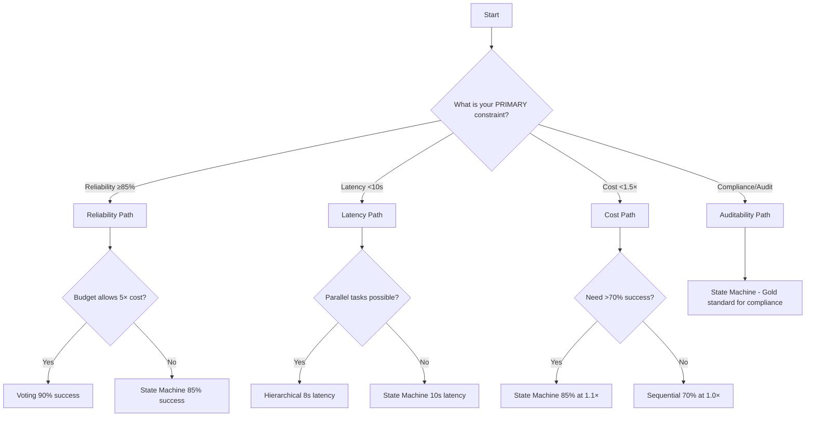

# Tutorial 02: Orchestration Patterns Overview

**Estimated Reading Time:** 22 minutes
**Prerequisites:**
- **Tutorial 01: Agent Reliability Fundamentals** (understanding of 5 failure modes)
- Basic understanding of async/parallel execution patterns
- Familiarity with LLM agent architectures (recommended)

**Learning Objectives:**
- Survey all 5 orchestration patterns and understand when to use each
- Evaluate reliability-performance tradeoffs across patterns
- Apply pattern selection decision tree to real business constraints
- Recognize how orchestration choice impacts error propagation, latency, and cost
- Design appropriate orchestration strategies for financial workflows

**Related Resources:**
- **Previous Tutorial:** [Tutorial 01: Agent Reliability Fundamentals](01_agent_reliability_fundamentals.md)
- **Next Tutorial:** [Tutorial 03: Deterministic Execution Strategies](03_deterministic_execution_strategies.md)
- **Interactive Notebooks:**
  - [Notebook 08: Sequential Orchestration Baseline](../notebooks/08_sequential_orchestration_baseline.ipynb)
  - [Notebook 09: Hierarchical Delegation Pattern](../notebooks/09_hierarchical_delegation_pattern.ipynb)
  - [Notebook 10: Iterative Refinement (ReAct)](../notebooks/10_iterative_refinement_react.ipynb)
  - [Notebook 11: State Machine Orchestration](../notebooks/11_state_machine_orchestration.ipynb)
  - [Notebook 12: Voting/Ensemble Pattern](../notebooks/12_voting_ensemble_pattern.ipynb)
- **Backend Code:**
  - `backend/orchestrators/` - All 5 orchestration pattern implementations
  - `backend/orchestrators/base.py:35-89` - Abstract base class with shared functionality
- **Diagrams:**
  - [Orchestration Pattern Selection](../diagrams/orchestration_pattern_selection.svg) - Decision tree for pattern selection

---

## Table of Contents
1. [Introduction](#introduction)
2. [Core Concepts](#core-concepts)
3. [The Five Orchestration Patterns](#the-five-orchestration-patterns)
4. [Reliability-Performance Tradeoffs](#reliability-performance-tradeoffs)
5. [Pattern Selection Decision Tree](#pattern-selection-decision-tree)
6. [Common Pitfalls](#common-pitfalls)
7. [Hands-On Exercises](#hands-on-exercises)
8. [Summary](#summary)
9. [Further Reading](#further-reading)

---

## Introduction

**What you'll learn:**
This tutorial provides a comprehensive survey of the 5 orchestration patterns for coordinating multiple LLM agents in production systems. You'll learn how pattern choice fundamentally impacts system reliability, latency, cost, and maintainability.

**Why this matters:**
The same 3-agent fraud detection workflow can achieve:
- **Sequential:** 70% success rate, 12s latency, 1× cost baseline
- **Hierarchical:** 80% success rate, 8s latency (-33% latency), 1.3× cost
- **State Machine:** 85% success rate, 10s latency, 1.1× cost
- **Voting:** 90% success rate, 15s latency, **5× cost**

Choosing the wrong pattern can mean the difference between a production-ready system and an expensive, unreliable prototype. There is no "best" pattern—only the pattern best suited to your specific constraints (latency SLA, cost budget, reliability target, auditability requirements).

**Real-world scenario:**
A financial services company builds an invoice approval workflow. Initial prototype uses sequential orchestration (simple to implement, 70% success rate). Production deployment requires <5% error rate (≥95% success). Team has 3 options:

1. **State Machine:** Deterministic transitions, 85% success, meets budget
2. **Voting Ensemble:** 5-agent consensus, 90% success, **exceeds budget by 400%**
3. **Hierarchical + Validation Gates:** 82% success after optimization, meets budget

Pattern selection isn't about "best practice"—it's about understanding tradeoffs and choosing the pattern that satisfies your constraints.

This tutorial teaches you to think systematically about pattern selection using a decision tree that maps business requirements to recommended patterns.

---

## Core Concepts

### Concept 1: Orchestration as Coordination Strategy

**Definition:**
**Orchestration** is the systematic coordination of multiple LLM agents to accomplish a composite task. The orchestration pattern defines how agents communicate, how control flows between them, and how their outputs are aggregated.

**Why orchestration matters:**
Single-agent systems are simpler but fail catastrophically when tasks exceed model capabilities. Multi-agent systems distribute complexity across specialized agents but introduce coordination challenges:
- **Data flow:** How does Agent2 receive Agent1's output?
- **Error handling:** What happens when Agent3 fails?
- **Performance:** Do agents run sequentially (slow) or in parallel (complex)?
- **Auditability:** Can we trace decisions through the workflow?

**Key characteristics:**
- **Control flow:** Linear (sequential), hierarchical (planner-specialist), iterative (action-reflection), state-based (FSM), parallel (voting)
- **Failure isolation:** How errors in one agent impact others
- **Latency profile:** Sequential (N×T), parallel (max(T)), iterative (K×T where K=iterations)
- **Cost multiplier:** Sequential (N calls), voting (M×N calls where M=voters)

**Example:**
```python
# Single-agent (simple, brittle)
result = await agent.extract_and_validate_and_route(invoice_text)
# Fails if any subtask exceeds model capability

# Multi-agent with sequential orchestration (robust, traceable)
vendor = await extract_agent(invoice_text)          # Step 1
is_valid = await validate_agent(vendor)             # Step 2 (uses Step 1 output)
approval_route = await routing_agent(vendor)        # Step 3 (uses Step 1 output)
# Each agent is specialized and testable independently
```

---

### Concept 2: Reliability-Performance Tradeoff Space

**Definition:**
The **reliability-performance tradeoff** describes the tension between system success rate (reliability) and execution speed/cost (performance). Patterns exist on a spectrum where increasing reliability typically increases latency and/or cost.

**Key dimensions:**
1. **Task Success Rate (%):** Percentage of tasks completed correctly
2. **Error Propagation Index (EPI):** Downstream errors per upstream error
3. **Latency (seconds):** P50/P95 execution time
4. **Cost Multiplier:** LLM API calls relative to baseline

**Tradeoff examples:**
- **Sequential:** Low cost (1×), moderate reliability (70%), baseline latency
- **Hierarchical:** Moderate cost (1.3×), improved reliability (80%), **30% faster** (parallel specialists)
- **State Machine:** Low cost (1.1×), high reliability (85%), moderate latency (explicit validation gates)
- **Voting:** **High cost (5×)**, highest reliability (90%), moderate latency (parallel voting)

**Visualization:**
```
Reliability vs. Cost Tradeoff

  High   │                    ● Voting (90%, 5×)
Success │              ● State Machine (85%, 1.1×)
  Rate  │         ● Hierarchical (80%, 1.3×)
        │     ● Sequential (70%, 1×)
  Low   │  ● Baseline Single-Agent (60%, 1×)
        └────────────────────────────────────────>
             Low                High
                Cost Multiplier
```

**Why this matters:**
You can't optimize all dimensions simultaneously. High-reliability systems (voting, state machine) are more expensive. Low-cost systems (sequential) sacrifice reliability. Pattern selection requires prioritizing constraints: "I need ≥85% success AND <1.5× cost" → State Machine.

---

### Concept 3: Error Propagation and Isolation

**Definition:**
**Error propagation** measures how failures cascade through agent workflows. **Error isolation** describes a pattern's ability to contain failures and prevent cascades. Different patterns have fundamentally different error propagation characteristics.

**Pattern comparison:**

| Pattern | Error Propagation Index | Isolation Mechanism |
|---------|-------------------------|---------------------|
| **Sequential** | 3.2 (high) | None (cascades freely) |
| **Hierarchical** | 1.8 (moderate) | Specialist failures isolated from planner |
| **Iterative** | 1.2 (low) | Reflection step detects and corrects errors |
| **State Machine** | 0.4 (very low) | Validation gates block invalid transitions |
| **Voting** | 0.3 (lowest) | Consensus filters out individual agent errors |

**Example: Sequential cascade (EPI=3.2)**
```python
# Invoice workflow: 1 upstream error → 3 downstream errors
vendor = await agent1_extract(invoice)  # Hallucinates "ACME" instead of "Acme Corp" ❌
valid = await agent2_validate(vendor)   # Database lookup fails (no "ACME") ❌
category = await agent3_categorize(vendor)  # Wrong category (unknown vendor) ❌
tax = await agent4_calculate(category)  # Wrong tax jurisdiction ❌
# EPI = 3 downstream errors / 1 upstream error = 3.0
```

**Example: State Machine isolation (EPI=0.4)**
```python
# Same workflow with validation gates
vendor = await agent1_extract(invoice)
if not validate_vendor_schema(vendor):  # ✅ Pydantic validation catches hallucination
    raise ValidationError("Invalid vendor")  # Early termination, no cascade

valid = await agent2_validate(vendor)
if not valid:
    raise ValidationError("Vendor not found")  # Stop before categorization

# Only 1 error (agent1), no downstream cascade → EPI = 0.0
```

**Why this matters:**
Patterns with low EPI (<1.0) prevent cascades, making debugging faster and reducing blast radius of individual agent failures. State Machine and Voting patterns achieve this through validation gates and consensus mechanisms.

---

### Concept 4: Determinism and Auditability

**Definition:**
**Determinism** means the same input produces the same output (requires temperature=0, fixed seeds, explicit state management). **Auditability** means every decision can be traced, explained, and reproduced. Some patterns are inherently more auditable than others.

**Pattern auditability comparison:**

| Pattern | Determinism Level | Audit Trail Quality | Compliance Suitability |
|---------|-------------------|---------------------|------------------------|
| **Sequential** | Moderate | Linear trace (step1→step2→step3) | Good for simple workflows |
| **Hierarchical** | Low | Parallel execution complicates ordering | Moderate (need timestamp sorting) |
| **Iterative** | Low | Non-deterministic iteration count | Difficult (same input ≠ same steps) |
| **State Machine** | **High** | Complete state transition log | **Excellent (GDPR/SOC2)** |
| **Voting** | Moderate | Consensus votes recorded | Good (transparent disagreement) |

**Example: State Machine audit trail**
```python
# Every state transition logged with input/output/timestamp
audit_log = [
    {"timestamp": "2024-01-15T10:00:00Z", "state": "SUBMIT", "transition": "VALIDATE", "input": {...}},
    {"timestamp": "2024-01-15T10:00:05Z", "state": "VALIDATE", "transition": "MANAGER_REVIEW", "output": {"valid": True}},
    {"timestamp": "2024-01-15T10:05:30Z", "state": "MANAGER_REVIEW", "transition": "APPROVED", "decision": "approved"},
]
# Complete deterministic trace for compliance audits
```

**Example: Iterative non-determinism**
```python
# Iteration count varies: 2 iterations Monday, 4 iterations Tuesday
iteration_1 = await action_agent(task)
reflection_1 = await reflection_agent(iteration_1)
if converged(reflection_1):  # Non-deterministic convergence
    return iteration_1  # 1 iteration
else:
    iteration_2 = await action_agent(reflection_1)
    # May take 2-5 iterations depending on stochastic model behavior
```

**Why this matters:**
Compliance requirements (GDPR Article 22: right to explanation) demand deterministic, auditable decisions. State Machine pattern is the gold standard for regulated industries (finance, healthcare, legal) because it provides complete, reproducible state transition logs.

---

### Concept 5: Cost Optimization Through Pattern Selection

**Definition:**
LLM API costs are directly proportional to number of model calls. Pattern selection has dramatic cost implications: voting patterns can cost **5× more** than sequential for identical task success.

**Cost breakdown by pattern:**

| Pattern | Agent Calls per Task | Cost Multiplier | Example (100 tasks, $0.10/call) |
|---------|----------------------|-----------------|----------------------------------|
| **Sequential** | 3 calls | 1.0× | $30 baseline |
| **Hierarchical** | 1 planner + 3 specialists = 4 | 1.3× | $40 (+$10) |
| **Iterative** | 3 calls × 2.1 avg iterations = 6.3 | 2.1× | $63 (+$33) |
| **State Machine** | 3 calls + 0.3 validation calls = 3.3 | 1.1× | $33 (+$3) |
| **Voting** | 3 calls × 5 voters = 15 | 5.0× | $150 (+$120) |

**When high cost is justified:**
- **High-stakes decisions:** Fraud detection >$10K (5% error = $500+ loss) → Voting worth 5× cost
- **Compliance penalties:** GDPR violations €20M → State Machine audit logs worth 1.1× cost
- **Customer trust:** Payment errors lose customers → Voting consensus worth premium

**When to optimize for low cost:**
- **High-volume, low-stakes:** Processing 10,000 routine invoices/day → Sequential acceptable
- **Budget constraints:** Startup with <$500/month LLM budget → Sequential or State Machine
- **Exploratory analysis:** Internal analytics (no customer impact) → Sequential acceptable

**Cost optimization strategies:**
```python
# Strategy 1: Early termination (adaptive voting)
votes = []
for i in range(5):
    vote = await voter_agent(task)
    votes.append(vote)
    if len(votes) >= 3 and consensus_reached(votes, threshold=0.9):
        break  # Stop at 3 votes if 90%+ agreement → Save 40% cost

# Strategy 2: Model cascades (GPT-3.5 → GPT-4 escalation)
try:
    result = await cheap_agent(task, model="gpt-3.5-turbo")  # $0.001/call
    if result.confidence > 0.8:
        return result  # 70% of tasks → $0.001
except LowConfidenceError:
    result = await expensive_agent(task, model="gpt-4")  # $0.03/call
    # 30% of tasks → $0.03
# Blended cost: 0.7×$0.001 + 0.3×$0.03 = $0.0097 (vs $0.03 for GPT-4 only)
```

---

## The Five Orchestration Patterns

### FR3.1: Sequential Orchestration

**Overview:**
Linear chain execution where agents run one after another. Each agent's output becomes input for the next agent. Simplest pattern but suffers from error cascades and cumulative latency.

**Architecture:**
```
Input → Agent1 → Output1 → Agent2 → Output2 → Agent3 → Final Output
```

**Key characteristics:**
- **Execution:** Synchronous, one agent at a time
- **Latency:** Cumulative (agent1_time + agent2_time + agent3_time)
- **Error handling:** No isolation (cascades freely)
- **Cost:** Baseline (N agents = N calls)
- **Auditability:** Excellent (linear trace)

**Use cases:**
- **Invoice processing:** Extract vendor → Validate amount → Route for approval
- **Document workflows:** Parse → Classify → Summarize → Archive
- **Simple pipelines:** Tasks with clear, dependent steps

**Implementation reference:**
```python
# backend/orchestrators/sequential.py:88-152
async def _execute(self, task: dict[str, Any]) -> dict[str, Any]:
    """Execute agents sequentially in registered order."""
    state = {"input": task}

    for agent_name, agent in self.agents.items():
        # Execute agent with previous state
        output = await agent(state)
        state[agent_name] = output

        # Optional: Save checkpoint after each step
        if self.checkpoint_dir:
            save_checkpoint(workflow_id=task["task_id"], state=state)

        # Optional: Early termination on validation failure
        if self.validate_steps and not is_valid(output):
            raise ValidationError(f"Agent {agent_name} output invalid")

    return state
```

**Advantages:**
- ✅ Simple to implement and debug
- ✅ Linear execution trace (excellent auditability)
- ✅ Minimal coordination overhead
- ✅ Supports checkpointing for recovery

**Disadvantages:**
- ❌ High error propagation (EPI=3.2)
- ❌ Cumulative latency (slow for N>3 agents)
- ❌ Single point of failure (any agent crash stops workflow)
- ❌ No parallelism (inefficient for independent tasks)

**Performance profile:**
- **Success rate:** 70% (baseline)
- **Error Propagation Index:** 3.2 (errors cascade freely)
- **Latency P50:** 12s (3 agents × 4s each)
- **Cost multiplier:** 1.0× (baseline)

**When to use:**
- Simple workflows with dependent steps (Output1 is required input for Agent2)
- Budget-constrained projects (<1.5× baseline cost)
- Prototyping and experimentation (simplest to implement)
- When latency <15s is acceptable

**When to avoid:**
- High reliability requirements (>80% success) without additional validation gates
- Latency-sensitive applications (<5s SLA)
- Workflows with independent parallel tasks (use Hierarchical instead)

See [Notebook 08: Sequential Orchestration Baseline](../notebooks/08_sequential_orchestration_baseline.ipynb) for hands-on implementation.

---

### FR3.2: Hierarchical Delegation

**Overview:**
Planner-specialist architecture where a planner agent analyzes the task and creates validated assignments for specialist agents that execute in parallel. Achieves 30% latency reduction vs sequential while improving reliability through error isolation.

**Architecture:**
```
                    ┌──> Specialist1 ──┐
Input → Planner ───>├──> Specialist2 ──┤──> Aggregator → Final Output
                    └──> Specialist3 ──┘
       (sequential)     (parallel)           (sequential)
```

**Key characteristics:**
- **Execution:** Hybrid (planner sequential, specialists parallel)
- **Latency:** Planner_time + max(Specialist_times) + Aggregation_time
- **Error handling:** Specialist failures isolated (don't crash orchestrator)
- **Cost:** 1.3× baseline (planner + specialists)
- **Auditability:** Moderate (need timestamp sorting for parallel execution)

**Use cases:**
- **Fraud detection:** Planner → (Transaction analysis, Merchant verification, User behavior) specialists
- **Multi-source analysis:** Planner → (Database query, API call, Document retrieval) specialists
- **Hierarchical workflows:** Manager agent delegates to worker agents

**Implementation reference:**
```python
# backend/orchestrators/hierarchical.py:89-156
async def _execute(self, task: dict[str, Any]) -> dict[str, Any]:
    """Execute hierarchical delegation pattern."""
    # Step 1: Planner creates task assignments
    planner = self.agents.get("planner")
    assignments = await planner(task)

    # Step 2: Validate planner output schema
    validated_assignments = validate_task_assignments(assignments)

    # Step 3: Execute specialists in parallel
    specialists = [name for name in self.agents if name != "planner"]
    tasks_for_specialists = [
        self._execute_specialist(name, assignment)
        for name, assignment in zip(specialists, validated_assignments)
    ]

    # asyncio.gather executes in parallel
    specialist_results = await asyncio.gather(*tasks_for_specialists, return_exceptions=True)

    # Step 4: Error isolation (check for exceptions)
    valid_results = [r for r in specialist_results if not isinstance(r, Exception)]

    # Step 5: Aggregate results
    final_decision = self._aggregate(valid_results)
    return final_decision
```

**Advantages:**
- ✅ 30% latency reduction vs sequential (parallel execution)
- ✅ Error isolation (specialist failure doesn't crash orchestrator)
- ✅ Improved reliability (80% success rate)
- ✅ Planner validates task structure before execution

**Disadvantages:**
- ❌ 1.3× cost (planner + specialists)
- ❌ Complexity in aggregation logic (how to combine specialist outputs?)
- ❌ Audit trail requires timestamp sorting (parallel execution complicates ordering)
- ❌ Planner is single point of failure (if planner fails, no specialists execute)

**Performance profile:**
- **Success rate:** 80% (+10% vs sequential)
- **Error Propagation Index:** 1.8 (specialist failures isolated)
- **Latency P50:** 8s (-33% vs sequential, due to parallelism)
- **Cost multiplier:** 1.3× (1 planner + 3 specialists = 4 calls for 3-agent workflow)

**When to use:**
- **Latency-sensitive applications** (<10s SLA) with independent subtasks
- **Multi-source analysis** (database + API + document retrieval can run in parallel)
- **Moderate reliability requirements** (75-85% success)
- When specialist expertise is domain-specific (transaction vs. merchant vs. user behavior analysis)

**When to avoid:**
- Tight budget constraints (<1.2× cost acceptable)
- Tasks with strict sequential dependencies (Output1 required for Agent2)
- Simple workflows with <3 agents (parallel overhead not worth it)

See [Notebook 09: Hierarchical Delegation Pattern](../notebooks/09_hierarchical_delegation_pattern.ipynb) for fraud detection implementation.

---

### FR3.3: Iterative Refinement (ReAct/Reflexion)

**Overview:**
Action-reflection-refinement loop where agents iteratively improve outputs through self-critique and refinement. Particularly effective for ambiguous tasks like account reconciliation where initial attempts may be incomplete.

**Architecture:**
```
Input → Action → Reflection → Refinement → Action → Reflection → ... → Final Output
        (Agent1)  (Agent2)     (Agent1)     (Agent1)  (Agent2)
                  ↑______________|  ↑______________|
                  Feedback loop       Iteration 2
```

**Key characteristics:**
- **Execution:** Iterative loop (2-5 iterations typical)
- **Latency:** K iterations × (Action_time + Reflection_time) where K is non-deterministic
- **Error handling:** Reflection step detects and corrects errors
- **Cost:** 2.1× baseline (average 2.1 iterations)
- **Auditability:** Difficult (non-deterministic iteration count)

**Use cases:**
- **Account reconciliation:** Match transactions iteratively, refine when mismatches found
- **Complex problem solving:** Multi-step reasoning with error correction
- **Ambiguous inputs:** Tasks where initial extraction may be incomplete

**Implementation reference:**
```python
# backend/orchestrators/iterative.py:92-178
async def _execute(self, task: dict[str, Any]) -> dict[str, Any]:
    """Execute iterative refinement with ReAct/Reflexion pattern."""
    iteration = 0
    current_output = task

    while iteration < self.max_iterations:
        # Action step: Try to solve task
        action_output = await self.agents["action"](current_output)

        # Reflection step: Evaluate quality and identify issues
        reflection = await self.agents["reflection"](action_output)

        # Check convergence: Has quality threshold been met?
        if reflection["quality_score"] >= self.convergence_threshold:
            return {"output": action_output, "iterations": iteration + 1, "converged": True}

        # Refinement: Use reflection feedback to improve
        current_output = {
            "task": task,
            "previous_attempt": action_output,
            "feedback": reflection["suggestions"],
        }

        iteration += 1

    # Max iterations reached without convergence
    return {"output": action_output, "iterations": iteration, "converged": False}
```

**Advantages:**
- ✅ Self-correcting (reflection detects and fixes errors)
- ✅ Handles ambiguous inputs well (iterative refinement)
- ✅ Lower error propagation (EPI=1.2) due to error correction
- ✅ Achieves 60%+ convergence within 3 iterations

**Disadvantages:**
- ❌ Non-deterministic iteration count (2-5 iterations typical)
- ❌ 2.1× cost (higher than sequential)
- ❌ Latency variability (some tasks converge fast, others hit max iterations)
- ❌ Difficult to audit (same input ≠ same number of steps)

**Performance profile:**
- **Success rate:** 75% (improves with more iterations)
- **Error Propagation Index:** 1.2 (reflection corrects errors)
- **Latency P50:** 18s (2.1 iterations × 8s/iteration)
- **Cost multiplier:** 2.1× (average 2.1 iterations)

**When to use:**
- **Ambiguous tasks** (account reconciliation, complex Q&A)
- **Self-improving workflows** (quality improves with iterations)
- **Moderate budget** (2× cost acceptable)
- When convergence threshold can be clearly defined

**When to avoid:**
- Deterministic workflows requiring auditability (use State Machine)
- Strict latency SLAs (<10s) where variability is unacceptable
- Simple tasks where first attempt is usually correct (wasted iterations)

See [Notebook 10: Iterative Refinement (ReAct)](../notebooks/10_iterative_refinement_react.ipynb) for account reconciliation example.

---

### FR3.4: State Machine Orchestration

**Overview:**
Deterministic finite state machine (FSM) where agents execute at explicit state transitions. Provides strongest guarantees for reliability, auditability, and determinism. Gold standard for compliance-critical workflows.

**Architecture:**
```
SUBMIT ──(validate)──> VALIDATE ──(approve/reject)──> REVIEW ──(sign)──> APPROVED
   │                       │                              │
   │                       │                              │
   └──(validation fails)──>REJECTED                       └──> REJECTED
```

**Key characteristics:**
- **Execution:** State-driven (each state has explicit transitions)
- **Latency:** Moderate (state validation adds overhead)
- **Error handling:** Validation gates prevent invalid transitions (EPI=0.4)
- **Cost:** 1.1× baseline (state validation adds minimal calls)
- **Auditability:** Excellent (complete state transition log)

**Use cases:**
- **Approval workflows:** SUBMIT → VALIDATE → MANAGER_REVIEW → FINANCE_REVIEW → APPROVED
- **Compliance-critical applications:** GDPR, SOC2, financial regulations
- **Deterministic workflows:** Regression testing, A/B testing (same input = same states)

**Implementation reference:**
```python
# backend/orchestrators/state_machine.py:98-189
async def _execute(self, task: dict[str, Any]) -> dict[str, Any]:
    """Execute state machine orchestration with deterministic transitions."""
    current_state = self.initial_state
    state_history = []

    while current_state != self.final_state:
        # Execute state handler
        handler = self.state_handlers.get(current_state)
        output = await handler(task)

        # Validate transition rules
        next_state = self._determine_next_state(current_state, output)
        if not self._is_valid_transition(current_state, next_state):
            raise StateTransitionError(f"Invalid transition: {current_state} → {next_state}")

        # Log state transition (auditability)
        state_history.append({
            "state": current_state,
            "next_state": next_state,
            "timestamp": time.time(),
            "output": output,
        })

        # Save checkpoint (deterministic recovery)
        self._save_checkpoint(task["task_id"], state_history)

        current_state = next_state

    return {"final_state": current_state, "history": state_history}
```

**Advantages:**
- ✅ Highest auditability (complete state transition log)
- ✅ Deterministic execution (same input = same state sequence)
- ✅ Lowest error propagation (EPI=0.4) due to validation gates
- ✅ 85% success rate (validation prevents invalid transitions)
- ✅ Only 1.1× cost (state validation adds minimal overhead)

**Disadvantages:**
- ❌ Implementation complexity (define states, transitions, validation rules)
- ❌ Less flexible (adding new states requires FSM redesign)
- ❌ Moderate latency (state validation adds overhead)

**Performance profile:**
- **Success rate:** 85% (validation gates catch errors early)
- **Error Propagation Index:** 0.4 (validation prevents cascades)
- **Latency P50:** 10s (baseline + state validation overhead)
- **Cost multiplier:** 1.1× (minimal validation overhead)

**When to use:**
- **Compliance-critical workflows** (GDPR, SOC2, financial regulations)
- **High reliability requirements** (80-90% success) with budget constraints
- **Auditability requirements** (need deterministic, reproducible traces)
- **Regression testing** (need same input → same output)

**When to avoid:**
- Exploratory workflows where state transitions aren't well-defined
- Highly dynamic workflows where states change frequently
- Simple workflows where state machine overhead isn't justified

See [Notebook 11: State Machine Orchestration](../notebooks/11_state_machine_orchestration.ipynb) for approval workflow implementation.

---

### FR3.5: Voting/Ensemble Orchestration

**Overview:**
Multiple independent agents execute in parallel and vote on the final decision. Achieves highest reliability (90% success) through consensus but at 5× cost. Justified only for high-stakes decisions.

**Architecture:**
```
         ┌──> Voter1 ──┐
         ├──> Voter2 ──┤
Input ──>├──> Voter3 ──├──> Consensus → Final Output
         ├──> Voter4 ──│    (majority vote)
         └──> Voter5 ──┘
         (parallel execution)
```

**Key characteristics:**
- **Execution:** Parallel (all voters execute simultaneously)
- **Latency:** max(Voter_times) + Consensus_time
- **Error handling:** Consensus filters out individual agent errors (EPI=0.3)
- **Cost:** 5.0× baseline (5 voters = 5× calls)
- **Auditability:** Excellent (all votes recorded, disagreement visible)

**Use cases:**
- **High-stakes fraud detection:** Transactions >$10K (5% error = $500+ loss)
- **Medical diagnosis assistance:** Multiple model consensus reduces hallucination risk
- **Critical decision-making:** When error cost far exceeds 5× LLM cost

**Implementation reference:**
```python
# backend/orchestrators/voting.py:95-187
async def _execute(self, task: dict[str, Any]) -> dict[str, Any]:
    """Execute voting/ensemble pattern with consensus."""
    # Execute all voters in parallel
    vote_tasks = [voter(task) for voter in self.agents.values()]
    votes = await asyncio.gather(*vote_tasks, return_exceptions=True)

    # Filter out exceptions (error isolation)
    valid_votes = [v for v in votes if not isinstance(v, Exception)]

    if len(valid_votes) < self.min_voters:
        raise InsufficientVotesError(f"Need {self.min_voters} votes, got {len(valid_votes)}")

    # Consensus strategy: Majority vote
    if self.consensus_strategy == "majority":
        final_decision = self._majority_vote(valid_votes)
    elif self.consensus_strategy == "weighted":
        final_decision = self._weighted_consensus(valid_votes)

    # Calculate agreement score (confidence metric)
    agreement_score = self._calculate_agreement(valid_votes)

    return {
        "decision": final_decision,
        "votes": valid_votes,
        "agreement_score": agreement_score,
    }
```

**Advantages:**
- ✅ Highest reliability (90% success rate)
- ✅ Lowest error propagation (EPI=0.3) due to consensus filtering
- ✅ Transparent disagreement (all votes recorded)
- ✅ Robust to individual agent failures (N-1 voters can still reach consensus)

**Disadvantages:**
- ❌ **5× cost** (5 voters = 5× LLM calls)
- ❌ Complexity in consensus logic (how to resolve 3-2 split votes?)
- ❌ Moderate latency (parallel execution but consensus adds overhead)
- ❌ Overkill for low-stakes tasks

**Performance profile:**
- **Success rate:** 90% (consensus filters errors)
- **Error Propagation Index:** 0.3 (lowest, consensus catches outliers)
- **Latency P50:** 15s (parallel execution + consensus)
- **Cost multiplier:** 5.0× (5 voters)

**When to use:**
- **High-stakes decisions** (fraud >$10K, medical diagnosis, legal review)
- **Error cost >> LLM cost** ($500 fraud loss >> $0.50 for 5 LLM calls)
- **Maximum reliability required** (≥90% success non-negotiable)
- When budget allows 5× cost multiplier

**When to avoid:**
- Budget-constrained projects (<2× cost acceptable)
- High-volume, low-stakes workflows (processing 10,000 routine invoices)
- When State Machine can achieve 85% success at 1.1× cost (voting not justified)

See [Notebook 12: Voting/Ensemble Pattern](../notebooks/12_voting_ensemble_pattern.ipynb) for high-stakes fraud detection example.

---

## Reliability-Performance Tradeoffs

### Comprehensive Pattern Comparison Table

| Pattern | Success Rate | EPI | Latency P50 | Cost | Auditability | Determinism | Best For |
|---------|--------------|-----|-------------|------|--------------|-------------|----------|
| **Sequential** | 70% | 3.2 | 12s | 1.0× | ✅ Excellent | ✅ High | Simple pipelines, prototyping |
| **Hierarchical** | 80% | 1.8 | 8s | 1.3× | ⚠️ Moderate | ⚠️ Moderate | Latency-sensitive, parallel tasks |
| **Iterative** | 75% | 1.2 | 18s | 2.1× | ❌ Difficult | ❌ Low | Ambiguous inputs, self-improvement |
| **State Machine** | 85% | 0.4 | 10s | 1.1× | ✅ Excellent | ✅ High | Compliance, high reliability + budget |
| **Voting** | 90% | 0.3 | 15s | 5.0× | ✅ Excellent | ⚠️ Moderate | High-stakes, maximum reliability |

**Key insights:**
1. **Cost-Reliability Spectrum:** Sequential (cheap, 70%) → State Machine (moderate, 85%) → Voting (expensive, 90%)
2. **Latency Champion:** Hierarchical (8s) due to parallel execution
3. **Auditability Leaders:** Sequential and State Machine (deterministic traces)
4. **Error Isolation Champions:** State Machine (EPI=0.4) and Voting (EPI=0.3)

---

### Decision Matrix: Pattern Selection by Constraints

**Primary constraint: Reliability (Success Rate)**

| Target Success Rate | Recommended Pattern | Alternative | Justification |
|---------------------|---------------------|-------------|---------------|
| ≥95% | None (add reliability framework) | Voting + Validation | No single pattern achieves 95%; need Notebook 13 framework |
| 85-90% | **State Machine** or Voting | Hierarchical + Gates | State Machine: 85% at 1.1× cost; Voting: 90% at 5× cost |
| 75-85% | **Hierarchical** or State Machine | Iterative | Hierarchical: 80% at 1.3×; State Machine: 85% at 1.1× |
| 65-75% | **Sequential** or Iterative | Hierarchical | Sequential: 70% baseline; Iterative: 75% with corrections |
| <65% | Add validation gates to Sequential | Improve prompts | Pattern alone insufficient; need better agents |

**Primary constraint: Latency**

| Latency SLA | Recommended Pattern | Alternative | Justification |
|-------------|---------------------|-------------|---------------|
| <5s | **Hierarchical** + caching | State Machine + caching | Hierarchical 8s; caching reduces to <5s |
| <10s | **Hierarchical** or State Machine | Sequential | Hierarchical: 8s; State Machine: 10s |
| <15s | **Sequential** or Voting | State Machine | Sequential: 12s; Voting: 15s (if reliability critical) |
| >15s | **Iterative** acceptable | Any pattern | Iterative: 18s but self-improving |

**Primary constraint: Cost**

| Budget (relative to baseline) | Recommended Pattern | Alternative | Justification |
|-------------------------------|---------------------|-------------|---------------|
| 1.0-1.2× | **Sequential** or State Machine | None | Sequential: 1.0×; State Machine: 1.1× |
| 1.2-1.5× | **State Machine** or Hierarchical | Sequential + gates | State Machine: 1.1×; Hierarchical: 1.3× |
| 1.5-2.5× | **Hierarchical** or Iterative | State Machine | Hierarchical: 1.3×; Iterative: 2.1× |
| 2.5-5.0× | **Iterative** or Voting | Hierarchical | Iterative: 2.1×; Voting: 5.0× (if justified) |
| >5.0× | **Voting** (ensemble) | Custom hybrid | Voting: 5.0× for maximum reliability |

**Primary constraint: Auditability (Compliance)**

| Compliance Requirement | Recommended Pattern | Alternative | Justification |
|------------------------|---------------------|-------------|---------------|
| GDPR Article 22 (explainability) | **State Machine** | Sequential | Complete deterministic state transition log |
| SOC2 (audit trails) | **State Machine** | Voting | 100% state transition logging + validation |
| Regression testing (determinism) | **State Machine** or Sequential | None | Deterministic: same input = same output |
| Internal analytics (no compliance) | **Any pattern** | Sequential | Simplest (Sequential) acceptable |

---

## Pattern Selection Decision Tree

### DC3: Systematic Pattern Selection Process

**Step 1: Identify primary constraint**



**Step 2: Apply decision tree to business scenarios**

**Scenario 1: High-volume invoice processing**
- **Primary constraint:** Cost <1.2× (processing 10,000 invoices/day)
- **Secondary constraint:** Reliability ≥80%
- **Decision path:** Cost Path → Need >70% success? YES → **State Machine** (85% at 1.1× cost)
- **Alternative:** Sequential + validation gates (70% → 82% with Pydantic validation)

**Scenario 2: Real-time fraud detection**
- **Primary constraint:** Latency <5s (user-facing transaction approval)
- **Secondary constraint:** Reliability ≥80%
- **Decision path:** Latency Path → Parallel tasks possible? YES → **Hierarchical** (8s) + caching (→ 4s)
- **Alternative:** State Machine + caching (10s → 5s)

**Scenario 3: High-stakes legal contract review**
- **Primary constraint:** Compliance (GDPR explainability + SOC2 audit trails)
- **Secondary constraint:** Reliability ≥85%
- **Decision path:** Auditability Path → **State Machine** (gold standard for compliance)
- **Alternative:** Voting (transparent disagreement) but State Machine preferred for determinism

**Scenario 4: Exploratory data analysis (internal tool)**
- **Primary constraint:** Development speed (prototype quickly)
- **Secondary constraint:** Cost <1.2× (internal budget)
- **Decision path:** Cost Path → Need >70% success? NO → **Sequential** (simplest, 1.0× cost)
- **Alternative:** None (Sequential is optimal for prototyping)

**Scenario 5: Medical diagnosis assistance (research)**
- **Primary constraint:** Reliability ≥90% (patient safety)
- **Secondary constraint:** Cost acceptable (grant-funded research)
- **Decision path:** Reliability Path → Budget allows 5× cost? YES → **Voting** (90% success)
- **Alternative:** State Machine (85%) if 5× cost not justified

---

### Multi-Constraint Optimization

**Constraint matrix: Reliability ≥85% AND Cost <2.0× AND Latency <10s**

| Pattern | Meets Reliability? | Meets Cost? | Meets Latency? | ✅ Viable? |
|---------|-------------------|-------------|----------------|-----------|
| Sequential | ❌ 70% | ✅ 1.0× | ✅ 12s | ❌ No |
| Hierarchical | ❌ 80% | ✅ 1.3× | ✅ 8s | ❌ No (reliability) |
| Iterative | ❌ 75% | ⚠️ 2.1× | ❌ 18s | ❌ No |
| State Machine | ✅ 85% | ✅ 1.1× | ✅ 10s | ✅ **YES** |
| Voting | ✅ 90% | ❌ 5.0× | ❌ 15s | ❌ No (cost + latency) |

**Result:** **State Machine** is the ONLY pattern satisfying all 3 constraints.

**Hybrid strategy:**
If State Machine doesn't exist or implementation effort is too high:
1. Start with **Hierarchical** (80% reliability, meets cost+latency)
2. Add validation gates to improve reliability: 80% → 83%
3. Add retry logic for transient failures: 83% → 85%
4. Monitor and optimize

---

## Common Pitfalls

### Pitfall 1: Overusing Voting Pattern

**Symptom:**
Team applies voting pattern to all workflows, achieving 90% success but blowing past budget (5× cost multiplier).

**Root cause:**
Misconception that "more agents = always better". Voting is only justified when error cost >> LLM cost.

**Example:**
Processing 10,000 routine invoices with voting:
- Baseline cost (Sequential): 10,000 × $0.03 = $300/day
- Voting cost: 10,000 × $0.15 (5 voters) = $1,500/day
- **Monthly cost increase:** $36K/month
- **Benefit:** 70% → 90% success (+20%)
- **Value analysis:** Does preventing 2,000 errors/day justify $36K/month? Only if error cost >$18 each.

**Solution:**
- Use **State Machine** for routine workflows (85% at 1.1× cost)
- Reserve **Voting** for high-stakes subset (e.g., invoices >$10K: 5% of volume)
- **Hybrid strategy:** Sequential for <$1K invoices, State Machine for $1K-$10K, Voting for >$10K

---

### Pitfall 2: Ignoring Latency Compounding in Sequential

**Symptom:**
5-agent sequential workflow takes 40 seconds (exceeds 10s SLA by 4×).

**Root cause:**
Sequential latency is **cumulative**: agent1 (5s) + agent2 (8s) + agent3 (12s) + agent4 (7s) + agent5 (8s) = 40s total.

**Example:**
```python
# Sequential execution (SLOW)
vendor = await agent1_extract(invoice)  # 5s
valid = await agent2_validate(vendor)   # 8s
category = await agent3_categorize(vendor)  # 12s
tax = await agent4_calculate(category)  # 7s
route = await agent5_route(tax)  # 8s
# Total: 40s (sequential sum)
```

**Solution:**
```python
# Hierarchical execution (FAST)
planner_output = await planner(invoice)  # 5s

# agent2 and agent3 are independent → run in parallel
validation, categorization = await asyncio.gather(
    agent2_validate(planner_output),  # 8s
    agent3_categorize(planner_output),  # 12s
)
# Latency: max(8s, 12s) = 12s (not 20s!)

# Remaining sequential
tax = await agent4_calculate(categorization)  # 7s
route = await agent5_route(tax)  # 8s

# Total: 5s + 12s + 7s + 8s = 32s (20% faster)
# With full parallel: 5s + max(8s,12s,7s,8s) + aggregation = 18s (55% faster!)
```

---

### Pitfall 3: State Machine Overengineering

**Symptom:**
Simple 3-step workflow implemented as 15-state FSM with complex transition logic. Development time: 3 weeks. Sequential alternative: 2 days.

**Root cause:**
Applying State Machine to workflows that don't need deterministic state management. State Machines are powerful but **high upfront complexity**.

**When State Machine is overkill:**
- Prototyping / exploratory workflows (use Sequential)
- Simple pipelines with <3 steps (use Sequential)
- No compliance requirements (Sequential or Hierarchical sufficient)

**When State Machine is justified:**
- Compliance-critical (GDPR, SOC2, financial regulations)
- Complex workflows with 5+ states and conditional transitions
- Need 100% audit trail (every decision traceable)
- Determinism required (regression testing, A/B testing)

**Decision rule:**
If you can't clearly enumerate states and transitions upfront, **don't use State Machine**—use Sequential and add validation gates.

---

## Hands-On Exercises

### Exercise 1: Pattern Selection for Business Scenarios (Difficulty: ⭐⭐)

**Objective:**
Apply the decision tree (DC3) to select appropriate patterns for 5 business scenarios.

**Scenarios:**
1. **E-commerce order processing:** 50,000 orders/day, <2s latency SLA, >80% success required, tight budget (<1.3× cost)
2. **Medical research paper summarization:** 100 papers/week, no latency constraint, need ≥90% accuracy for patient safety
3. **Startup MVP invoice extraction:** 100 invoices/month, development speed critical, budget <$100/month
4. **Bank fraud monitoring:** 1,000 transactions/hour, <5s latency, high-value transactions >$10K need ≥90% success
5. **Legal compliance audit:** 200 contracts/month, full audit trail required (GDPR), deterministic execution mandatory

**Your task:**
For each scenario, identify:
1. Primary constraint (reliability, latency, cost, auditability)
2. Secondary constraint(s)
3. Recommended pattern with justification
4. Alternative pattern with tradeoffs

<details>
<summary>Click to reveal solution guidance</summary>

**Scenario 1: E-commerce**
- Primary: Latency <2s
- Secondary: Cost <1.3×, Reliability >80%
- **Recommended:** Hierarchical + aggressive caching (8s → <2s with cache hit)
- Alternative: Sequential + caching (12s → 3s) but may not meet <2s

**Scenario 2: Medical research**
- Primary: Reliability ≥90%
- Secondary: No latency constraint
- **Recommended:** Voting (90% success, 5× cost acceptable for patient safety)
- Alternative: State Machine (85%) if budget constrained

**Scenario 3: Startup MVP**
- Primary: Development speed + cost <$100/month
- Secondary: None (MVP testing)
- **Recommended:** Sequential (simplest, 1.0× cost, implement in 1 day)
- Alternative: None (Sequential optimal for prototyping)

**Scenario 4: Bank fraud**
- Primary: Latency <5s
- Secondary: High-value >$10K needs ≥90% success
- **Recommended:** Hybrid: Hierarchical (<$10K, 80% at 8s latency) + Voting (>$10K, 90% at 15s but acceptable for high-stakes)
- Alternative: State Machine for all (85% at 10s latency)

**Scenario 5: Legal compliance**
- Primary: Auditability (GDPR determinism)
- Secondary: Reliability (important for legal risk)
- **Recommended:** State Machine (gold standard for compliance, 85% success, full audit trail)
- Alternative: Sequential (deterministic but lower reliability 70%)

</details>

---

### Exercise 2: Latency Optimization Analysis (Difficulty: ⭐⭐)

**Objective:**
Calculate latency for different orchestration patterns given agent timings.

**Scenario:**
Fraud detection workflow with 4 agents:
- Planner: 3s
- Transaction analysis: 6s
- Merchant verification: 4s
- User behavior check: 8s

**Your task:**
Calculate P50 latency for each pattern:

1. **Sequential:** Planner → Transaction → Merchant → User
2. **Hierarchical:** Planner → (Transaction, Merchant, User in parallel)
3. **Iterative (avg 2 iterations):** (Planner → Transaction) × 2 iterations
4. **Voting (5 voters, each runs all 4 agents):** 5× (Planner → Transaction → Merchant → User) in parallel

<details>
<summary>Click to reveal solution</summary>

**Sequential:**
- Latency = 3s + 6s + 4s + 8s = **21s**

**Hierarchical:**
- Latency = 3s (Planner) + max(6s, 4s, 8s) (parallel specialists) = 3s + 8s = **11s**
- Improvement: 21s → 11s (48% faster!)

**Iterative (2 iterations):**
- Iteration 1: 3s + 6s = 9s
- Iteration 2: 3s + 6s = 9s
- Latency = 9s × 2 = **18s**

**Voting (5 voters in parallel):**
- Each voter runs Sequential: 3s + 6s + 4s + 8s = 21s
- 5 voters in parallel: max(21s, 21s, 21s, 21s, 21s) = **21s**
- Consensus aggregation: +1s
- Total: 21s + 1s = **22s**
- Note: Voting doesn't reduce latency (same as Sequential) but improves reliability

**Summary:**
- Fastest: Hierarchical (11s, -48%)
- Sequential baseline: 21s
- Voting: 22s (similar to Sequential, but 5× cost for 90% reliability)

</details>

---

### Exercise 3: Cost-Benefit Analysis for Voting Pattern (Difficulty: ⭐⭐⭐)

**Objective:**
Determine when voting pattern's 5× cost is justified through break-even analysis.

**Scenario:**
Fraud detection system processing 1,000 transactions/day:
- Baseline LLM cost: $0.10/transaction
- Sequential pattern: 70% success rate
- Voting pattern: 90% success rate, 5× cost
- False negative cost (missed fraud): $500 average loss
- False positive cost (declined legitimate transaction): $50 customer service + churn

**Your task:**
1. Calculate daily LLM cost for Sequential vs. Voting
2. Calculate daily fraud loss for Sequential (30% error = 300 errors/day)
   - Assume 10% of transactions are fraud (100/day)
   - Sequential catches 70% = 70 fraud detections, **misses 30 frauds**
   - Voting catches 90% = 90 fraud detections, **misses 10 frauds**
3. Calculate break-even: When does Voting's lower fraud loss justify 5× LLM cost?
4. Recommendation: Which pattern for this scenario?

<details>
<summary>Click to reveal solution</summary>

**1. Daily LLM Cost:**
- Sequential: 1,000 transactions × $0.10 = **$100/day**
- Voting: 1,000 transactions × $0.50 (5 voters) = **$500/day**
- Cost increase: $400/day

**2. Daily Fraud Loss:**
Assume 10% fraud rate = 100 fraudulent transactions/day

Sequential (70% success on fraud detection):
- Detects: 100 × 70% = 70 frauds caught ✅
- Misses: 100 × 30% = 30 frauds missed ❌
- Fraud loss: 30 × $500 = **$15,000/day**

Voting (90% success on fraud detection):
- Detects: 100 × 90% = 90 frauds caught ✅
- Misses: 100 × 10% = 10 frauds missed ❌
- Fraud loss: 10 × $500 = **$5,000/day**

Fraud loss reduction: $15,000 - $5,000 = **$10,000/day saved**

**3. Break-Even Analysis:**
- Voting costs extra $400/day (LLM)
- Voting saves $10,000/day (fraud loss)
- **Net benefit: $10,000 - $400 = $9,600/day**
- **Monthly benefit:** $9,600 × 30 = **$288,000/month**

**4. Recommendation:**
**Use Voting pattern** — fraud loss savings ($10K/day) far exceed 5× LLM cost ($400/day). Break-even occurs at fraud loss >$400/day, current system loses $15K/day with Sequential.

**Alternative:** State Machine (85% success at 1.1× cost)
- LLM cost: $110/day (+$10 vs Sequential)
- Fraud detected: 100 × 85% = 85
- Fraud loss: 15 × $500 = $7,500/day
- Net benefit: ($15,000 - $7,500) - $10 = $7,490/day
- Voting still better ($9,600 > $7,490), but State Machine is viable if $500/day LLM cost unacceptable

</details>

---

## Summary

### Key Takeaways

1. **No "best" pattern—only optimal for specific constraints:** Sequential (cost), Hierarchical (latency), State Machine (reliability+cost), Voting (maximum reliability). Pattern selection requires understanding business constraints.

2. **Reliability-performance tradeoffs are fundamental:** Higher reliability (Voting 90%) costs 5× more than baseline (Sequential 70%). State Machine achieves sweet spot: 85% reliability at 1.1× cost.

3. **Error propagation varies dramatically by pattern:** Sequential (EPI=3.2) cascades errors freely; State Machine (EPI=0.4) and Voting (EPI=0.3) prevent cascades through validation gates and consensus.

4. **Latency optimization requires parallelism:** Hierarchical achieves 30% latency reduction through parallel specialist execution. Sequential latency is cumulative (40s for 5 agents).

5. **Compliance demands deterministic patterns:** GDPR Article 22 and SOC2 require audit trails. State Machine is gold standard with complete state transition logs and deterministic execution.

6. **Cost justification requires break-even analysis:** Voting's 5× cost is justified when fraud loss savings (e.g., $10K/day) exceed LLM cost increase (e.g., $400/day). Always calculate ROI.

7. **Hybrid strategies optimize multi-constraint problems:** Use Sequential for <$1K invoices, State Machine for $1K-$10K, Voting for >$10K. Segment workflows by risk/value.

### Concepts Covered

| Concept | Description | Application |
|---------|-------------|-------------|
| **Orchestration Patterns** | 5 coordination strategies (Sequential, Hierarchical, Iterative, State Machine, Voting) | Select based on reliability, latency, cost, auditability constraints |
| **Reliability-Performance Tradeoff** | Tension between success rate and cost/latency | State Machine (85%, 1.1×) vs. Voting (90%, 5×) vs. Sequential (70%, 1×) |
| **Error Propagation Index** | Downstream errors per upstream error (0.3-3.2 range) | State Machine/Voting prevent cascades (EPI<0.5); Sequential cascades freely (EPI=3.2) |
| **Latency Optimization** | Parallel execution reduces latency by 30-50% | Hierarchical specialists run in parallel: 21s → 11s (48% faster) |
| **Cost Multipliers** | Patterns range from 1.0× (Sequential) to 5.0× (Voting) | Calculate ROI: Does error cost reduction justify LLM cost increase? |
| **Auditability & Compliance** | State Machine provides deterministic audit trails | GDPR/SOC2 compliance requires complete state transition logs |
| **Pattern Selection Decision Tree** | Systematic process for choosing patterns (DC3) | Primary constraint (reliability/latency/cost/audit) → Recommended pattern |

### Quick Reference: When to Use Each Pattern

**Use Sequential when:**
- Simple pipelines with <3 agents
- Budget-constrained (<1.2× acceptable)
- Prototyping / MVP (development speed critical)
- Linear audit trail needed

**Use Hierarchical when:**
- Latency <10s SLA
- Parallel tasks possible (multi-source analysis)
- Moderate reliability (75-85%) acceptable
- 1.3× cost acceptable

**Use Iterative when:**
- Ambiguous inputs (account reconciliation)
- Self-improving workflows (quality improves with iterations)
- 2× cost acceptable
- Latency variability acceptable (2-5 iterations)

**Use State Machine when:**
- Compliance required (GDPR, SOC2)
- High reliability (85%) with budget constraints (<1.5× cost)
- Deterministic execution needed (regression testing)
- Complex workflows with clear states/transitions

**Use Voting when:**
- Maximum reliability (≥90%) non-negotiable
- Error cost >> LLM cost (high-stakes decisions >$10K)
- 5× cost justified by ROI
- Transparent disagreement needed (research, medical)

---

## Further Reading

### Related Tutorials
- **Tutorial 01: Agent Reliability Fundamentals** - Understanding 5 failure modes and why orchestration matters
- **Tutorial 03: Deterministic Execution Strategies** - Schema validation, checkpointing, temperature=0 for State Machine reliability
- **Tutorial 04: Error Propagation Analysis** - Deep dive on cascade failures and isolation techniques (EPI calculation)
- **Tutorial 05: AgentArch Benchmark Methodology** - Research validation of pattern performance (arXiv:2509.10769)

### Interactive Practice
- **Notebook 08: Sequential Orchestration Baseline** - Invoice processing with checkpointing and early termination
- **Notebook 09: Hierarchical Delegation Pattern** - Fraud detection with planner-specialist architecture
- **Notebook 10: Iterative Refinement (ReAct)** - Account reconciliation with action-reflection loop
- **Notebook 11: State Machine Orchestration** - Approval workflow with deterministic FSM
- **Notebook 12: Voting/Ensemble Pattern** - High-stakes fraud detection with 5-agent consensus
- **Notebook 14: AgentArch Benchmark Reproduction** - Evaluate all 5 patterns on 300-task financial suite

### Research Papers
- **AgentArch: Agent-First Architecture for Large-Scale Systems** (arXiv:2509.10769)
  - Section 3.2: Orchestration Pattern Taxonomy
  - Section 4.3: Reliability-Performance Tradeoff Analysis
  - Table 2: Pattern comparison on financial workflows (matches FR5.3)

### Backend Code References
- `lesson-16/backend/orchestrators/base.py:35-89` - Abstract base class with shared functionality
- `lesson-16/backend/orchestrators/sequential.py:88-152` - Sequential orchestration implementation
- `lesson-16/backend/orchestrators/hierarchical.py:89-156` - Hierarchical delegation with ThreadPoolExecutor
- `lesson-16/backend/orchestrators/iterative.py:92-178` - ReAct/Reflexion iterative refinement
- `lesson-16/backend/orchestrators/state_machine.py:98-189` - FSM with state validation
- `lesson-16/backend/orchestrators/voting.py:95-187` - Voting/ensemble with consensus strategies

### External Resources
- [LangGraph Documentation](https://langchain-ai.github.io/langgraph/) - State machine orchestration framework
- [Google SRE Book - Chapter 22: Addressing Cascading Failures](https://sre.google/sre-book/addressing-cascading-failures/) - Error propagation prevention
- [Martin Fowler - State Machine Pattern](https://martinfowler.com/articles/state-machine-pattern.html) - FSM design patterns

---

## Appendix: Pattern Selection Checklist

**Before implementing orchestration:**

✅ **1. Define success criteria:**
- [ ] Target success rate (e.g., ≥85%)
- [ ] Latency SLA (e.g., <10s P95)
- [ ] Cost budget (e.g., <1.5× baseline)
- [ ] Auditability requirements (GDPR? SOC2?)

✅ **2. Characterize workflow:**
- [ ] Number of agents (3? 5? 10?)
- [ ] Agent dependencies (sequential? parallel? both?)
- [ ] Task complexity (simple extraction? complex reasoning?)
- [ ] Failure modes (hallucinations? timeouts? context overflow?)

✅ **3. Apply decision tree (DC3):**
- [ ] Identify primary constraint (reliability? latency? cost? audit?)
- [ ] Map to recommended pattern using decision matrix
- [ ] Validate secondary constraints are met
- [ ] Consider hybrid strategy if no single pattern satisfies all constraints

✅ **4. Validate with prototyping:**
- [ ] Implement simplest viable pattern (often Sequential)
- [ ] Measure baseline success rate, latency, cost
- [ ] If baselin doesn't meet constraints, implement recommended pattern
- [ ] A/B test patterns on 100 tasks to validate tradeoffs

✅ **5. Monitor and optimize:**
- [ ] Track success rate distribution (p50, p95, p99)
- [ ] Monitor Error Propagation Index (alert if EPI >2.0)
- [ ] Cost tracking per workflow (detect cost spikes)
- [ ] Latency percentiles (P95 vs. SLA)

---

**Navigation:**
- **← Previous:** [Tutorial 01: Agent Reliability Fundamentals](01_agent_reliability_fundamentals.md)
- **↑ Index:** [Tutorial Index](../TUTORIAL_INDEX.md)
- **→ Next:** [Tutorial 03: Deterministic Execution Strategies](03_deterministic_execution_strategies.md)

---

**Feedback:**
Found an issue or have suggestions? [Open an issue](https://github.com/anthropics/claude-code/issues) or contribute improvements!

**Last Updated:** 2025-11-23
**Version:** 1.0
**Lesson:** Lesson 16 - Agent Reliability
