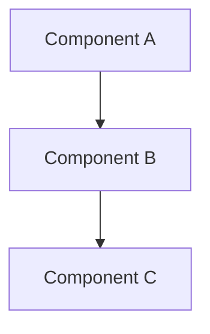

# [Tutorial Number]: [Tutorial Title]

**Estimated Reading Time:** [15-30] minutes
**Prerequisites:** [List required knowledge/tutorials]
**Learning Objectives:**
- [Objective 1]
- [Objective 2]
- [Objective 3]

**Related Resources:**
- **Previous Tutorial:** [Link to previous tutorial]
- **Next Tutorial:** [Link to next tutorial]
- **Interactive Notebooks:** [Link to related .ipynb files]
- **Backend Code:** [Link to implementation files with line numbers]
- **Diagrams:** [Link to related .mmd/.png files]

---

## Table of Contents
1. [Introduction](#introduction)
2. [Core Concepts](#core-concepts)
3. [Technical Deep Dive](#technical-deep-dive)
4. [Practical Applications](#practical-applications)
5. [Best Practices](#best-practices)
6. [Common Pitfalls](#common-pitfalls)
7. [Hands-On Exercises](#hands-on-exercises)
8. [Summary](#summary)
9. [Further Reading](#further-reading)

---

## Introduction

**What you'll learn:**
[2-3 sentence overview of the tutorial's value proposition]

**Why this matters:**
[Real-world context: How does this solve actual problems in production agent systems?]

**Real-world scenario:**
[Brief example scenario that motivates the tutorial content]

---

## Core Concepts

### Concept 1: [Name]

**Definition:**
[Clear, concise definition in 1-2 sentences]

**Key characteristics:**
- [Characteristic 1]
- [Characteristic 2]
- [Characteristic 3]

**Example:**
```python
# Simple code example demonstrating the concept
# Keep it minimal and focused
```

**Visualization:**
[Optional: ASCII diagram or reference to Mermaid diagram]

---

### Concept 2: [Name]

[Repeat structure from Concept 1]

---

## Technical Deep Dive

### How It Works

**Step-by-step breakdown:**

1. **Step 1: [Name]**
   - What happens: [Description]
   - Why it matters: [Rationale]
   - Code reference: `backend/[module]/[file].py:[line_number]`

2. **Step 2: [Name]**
   [Repeat structure]

3. **Step 3: [Name]**
   [Repeat structure]

**Architecture diagram:**
[Reference to diagram file or include inline Mermaid]



---

### Implementation Details

**Code walkthrough:**

```python
# Reference from actual backend implementation
# Include file path and line numbers in comments
# lesson-16/backend/[module]/[file].py:XX-YY

def example_function(param: Type) -> ReturnType:
    """
    Docstring explaining the function's role in the concept.
    """
    # Step 1: Type validation (defensive coding)
    if not isinstance(param, Type):
        raise TypeError("param must be Type")

    # Step 2: Main logic
    result = process(param)

    # Step 3: Return
    return result
```

**Key design decisions:**
- **Decision 1:** [Rationale for why it's implemented this way]
- **Decision 2:** [Trade-offs considered]
- **Decision 3:** [Alternative approaches and why they weren't chosen]

---

## Practical Applications

### Use Case 1: [Scenario Name]

**Business context:**
[Describe the business problem this solves]

**Solution approach:**
[How the concept applies to solve this problem]

**Expected outcomes:**
- Metric 1: [Improvement expected]
- Metric 2: [Improvement expected]

**Code example:**
```python
# Practical application example
# Show how to use the concept in a real workflow
```

---

### Use Case 2: [Scenario Name]

[Repeat structure from Use Case 1]

---

## Best Practices

### Do's ✅

1. **[Practice 1]**
   - Why: [Explanation]
   - Example: [Code snippet or scenario]

2. **[Practice 2]**
   [Repeat structure]

3. **[Practice 3]**
   [Repeat structure]

---

### Don'ts ❌

1. **[Anti-pattern 1]**
   - Why it's problematic: [Explanation]
   - What to do instead: [Alternative]

2. **[Anti-pattern 2]**
   [Repeat structure]

3. **[Anti-pattern 3]**
   [Repeat structure]

---

## Common Pitfalls

### Pitfall 1: [Issue Name]

**Symptoms:**
- [How you'll know this is happening]
- [Observable behavior]

**Root cause:**
[Why this happens]

**Solution:**
```python
# Code showing the fix
# Include before/after comparison if helpful
```

**Prevention:**
[How to avoid this issue in the first place]

---

### Pitfall 2: [Issue Name]

[Repeat structure from Pitfall 1]

---

## Hands-On Exercises

### Exercise 1: [Title] (Difficulty: ⭐)

**Objective:**
[What skill this exercise develops]

**Task:**
[Step-by-step instructions]

1. [Step 1]
2. [Step 2]
3. [Step 3]

**Expected outcome:**
[What the solution should demonstrate]

**Hint:**
[Optional guidance if stuck]

**Solution approach:**
<details>
<summary>Click to reveal solution guidance</summary>

[High-level approach without giving away the complete answer]

</details>

---

### Exercise 2: [Title] (Difficulty: ⭐⭐)

[Repeat structure from Exercise 1]

---

### Exercise 3: [Title] (Difficulty: ⭐⭐⭐)

[Repeat structure from Exercise 1]

---

## Summary

### Key Takeaways

1. **[Takeaway 1]**: [One-sentence summary]
2. **[Takeaway 2]**: [One-sentence summary]
3. **[Takeaway 3]**: [One-sentence summary]

### Concepts Covered

| Concept | Description | Application |
|---------|-------------|-------------|
| [Concept 1] | [Brief description] | [When to use] |
| [Concept 2] | [Brief description] | [When to use] |
| [Concept 3] | [Brief description] | [When to use] |

### Quick Reference

**Decision tree: When to use [this concept]**

```mermaid
graph TD
    A{Do you need [capability]?} -->|Yes| B{Is [condition] true?}
    A -->|No| C[Use alternative approach]
    B -->|Yes| D[Use [this concept]]
    B -->|No| E[Consider [alternative]]
```

---

## Further Reading

### Related Tutorials
- **Tutorial [X]:** [Title] - [How it connects to this tutorial]
- **Tutorial [Y]:** [Title] - [How it connects to this tutorial]

### Interactive Practice
- **Notebook [N]:** [Title] - Hands-on implementation of concepts from this tutorial
  - File: `lesson-16/notebooks/[NN]_[name].ipynb`
  - Execution time: <[X] minutes

### Research Papers
- **[Paper Title]** ([arXiv:XXXX.XXXXX](https://arxiv.org/abs/XXXX.XXXXX))
  - Relevant sections: [Which parts to read]
  - Key insights: [Main takeaways for this tutorial]

### Backend Code References
- `lesson-16/backend/[module]/[file].py` - [What to explore]
  - Key functions: `[function_1]`, `[function_2]`
  - Tests: `lesson-16/tests/test_[module].py`

### External Resources
- [Resource Title](URL) - [Why it's valuable]
- [Resource Title](URL) - [Why it's valuable]

---

## Appendix: Glossary

**[Term 1]:** [Definition]

**[Term 2]:** [Definition]

**[Term 3]:** [Definition]

---

**Navigation:**
- **← Previous:** [Link to previous tutorial]
- **↑ Index:** [Link to TUTORIAL_INDEX.md](../TUTORIAL_INDEX.md)
- **→ Next:** [Link to next tutorial]

---

**Feedback:**
Found an issue or have suggestions? [Open an issue](https://github.com/anthropics/claude-code/issues) or contribute improvements!

**Last Updated:** [YYYY-MM-DD]
**Version:** 1.0
**Lesson:** Lesson 16 - Agent Reliability
