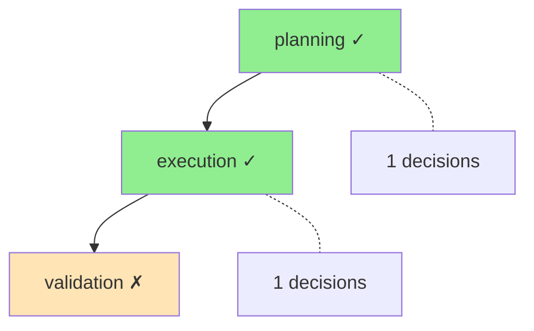

# PhaseLogger Integration: A First-Principles Explanation

**Created:** 2024-11-30
**Purpose:** Deep exploration of how PhaseLogger integrates with the lesson-17 explainability framework
**Approach:** First-principles teaching methodology

---

## 1. The Problem Before the Solution

### Why PhaseLogger Exists

**The Pain Point:** When an AI agent completes a multi-step workflow, you can see *what* it produced but not *why* it made specific decisions.

```
Without PhaseLogger:
┌─────────────────────────────────────────────────────────┐
│  Agent Input: "Analyze customer churn data"             │
│                                                         │
│              ??? BLACK BOX ???                          │
│                                                         │
│  Agent Output: "Churn rate is 12.5%"                    │
└─────────────────────────────────────────────────────────┘

Questions you can't answer:
- Why did the agent choose method A over method B?
- What alternatives were considered and rejected?
- How confident was the agent in each decision?
- Which phase failed when something goes wrong?
```

**The Solution:** PhaseLogger tracks decision-making through workflow phases with explicit reasoning, alternatives, and confidence scores.

---

## 2. The Real-World Analogy

Think of PhaseLogger like a **research lab notebook**:

| Research Lab Notebook | PhaseLogger |
|----------------------|-------------|
| Lab phases (Planning, Experiment, Analysis) | `WorkflowPhase` enum (PLANNING → EXECUTION → VALIDATION) |
| "Decided to use mass spectrometry because..." | `log_decision(decision, reasoning, alternatives)` |
| Photos/charts attached to entries | `log_artifact(name, path, type)` |
| "Experiment 3 failed due to contamination" | `log_error("Contamination detected")` |
| Lab notebook audit for publication | `export_workflow_log()` / `visualize_workflow()` |

---

## 3. The Four Pillars: Where PhaseLogger Fits

The lesson-17 explainability framework has **four pillars**, each answering a different question:

```
┌─────────────────────────────────────────────────────────────────────────────┐
│                    THE FOUR PILLARS OF EXPLAINABILITY                        │
├─────────────────────────────────────────────────────────────────────────────┤
│                                                                              │
│   ┌─────────────┐  ┌─────────────┐  ┌─────────────┐  ┌─────────────┐       │
│   │  RECORDING  │  │  IDENTITY   │  │ VALIDATION  │  │  REASONING  │       │
│   │             │  │             │  │             │  │             │       │
│   │  What       │  │  Who        │  │  What       │  │  Why        │       │
│   │  happened?  │  │  did it?    │  │  was        │  │  was it     │       │
│   │             │  │             │  │  checked?   │  │  done?      │       │
│   └──────┬──────┘  └──────┬──────┘  └──────┬──────┘  └──────┬──────┘       │
│          │                │                │                │              │
│          ▼                ▼                ▼                ▼              │
│   ┌─────────────┐  ┌─────────────┐  ┌─────────────┐  ┌─────────────┐       │
│   │ BlackBox    │  │ AgentFacts  │  │ GuardRails  │  │ PhaseLogger │ ◀──── YOU ARE HERE
│   │ Recorder    │  │ Registry    │  │ Validator   │  │             │       │
│   └─────────────┘  └─────────────┘  └─────────────┘  └─────────────┘       │
│                                                                              │
└─────────────────────────────────────────────────────────────────────────────┘
```

| Pillar | Component | Question Answered | File Location |
|--------|-----------|-------------------|---------------|
| Recording | `BlackBoxRecorder` | What happened? | `backend/explainability/black_box.py` |
| Identity | `AgentFacts` | Who did it? | `backend/explainability/agent_facts.py` |
| Validation | `GuardRails` | What was checked? | `backend/explainability/guardrails.py` |
| **Reasoning** | **`PhaseLogger`** | **Why was it done?** | **`backend/explainability/phase_logger.py`** |

### The Fifth Component: PolicyBridge

There's also a **bridge component** that connects pillars:

| Component | Purpose | File Location |
|-----------|---------|---------------|
| `PolicyBridge` | Converts AgentFacts policies → GuardRails constraints | `backend/explainability/policy_bridge.py` |

---

## 4. Single Responsibility Decomposition

PhaseLogger has **5 core responsibilities**:

```
PhaseLogger → Tracks workflow phases
     │
     ├── 1. Phase Lifecycle    → start_phase() / end_phase()
     │
     ├── 2. Decision Logging   → log_decision() with reasoning + alternatives
     │
     ├── 3. Artifact Tracking  → log_artifact() for produced outputs
     │
     ├── 4. Error Recording    → log_error() with recoverable flag
     │
     └── 5. Visualization      → visualize_workflow() → Mermaid diagrams
```

Each does **one thing**:

| Model | Responsibility |
|-------|----------------|
| `WorkflowPhase` | Defines standard phases (PLANNING → EXECUTION → VALIDATION → COMPLETED) |
| `Decision` | Records a single decision with reasoning and alternatives |
| `Artifact` | Records an output produced during a phase |
| `PhaseOutcome` | Records how a phase ended (success/failure/partial) |
| `PhaseSummary` | Aggregates statistics across all phases |

### WorkflowPhase Enum

```python
class WorkflowPhase(str, Enum):
    PLANNING = "planning"
    LITERATURE_REVIEW = "literature_review"
    DATA_COLLECTION = "data_collection"
    EXECUTION = "execution"
    EXPERIMENT = "experiment"
    VALIDATION = "validation"
    REPORTING = "reporting"
    COMPLETED = "completed"
    FAILED = "failed"
```

---

## 5. Data Flow: Following a Decision Through the System

```
┌─────────────────────────────────────────────────────────────────────────────┐
│ STEP 1: Start Phase                                                          │
├─────────────────────────────────────────────────────────────────────────────┤
│   logger.start_phase(WorkflowPhase.PLANNING)                                │
│                                                                              │
│   → Creates: _current_phase = PLANNING                                       │
│   → Creates: _phase_start_time = now()                                       │
│   → Persists: {"event": "phase_start", "phase": "planning"} to JSONL        │
└───────────────────────────────────────┬─────────────────────────────────────┘
                                        │
                                        ▼
┌─────────────────────────────────────────────────────────────────────────────┐
│ STEP 2: Log Decision                                                         │
├─────────────────────────────────────────────────────────────────────────────┤
│   logger.log_decision(                                                       │
│       decision="Use GPT-4",                                                  │
│       reasoning="Higher accuracy needed for complex extraction",             │
│       alternatives=["GPT-3.5", "Claude"],                                    │
│       selected_because="Cost acceptable for high-value invoices",            │
│       confidence=0.85                                                        │
│   )                                                                          │
│                                                                              │
│   → Creates: Decision(decision_id="dec-workflow-1", ...)                     │
│   → Stores: _decisions[PLANNING].append(decision)                            │
│   → Persists: {"event": "decision", "data": {...}} to JSONL                 │
└───────────────────────────────────────┬─────────────────────────────────────┘
                                        │
                                        ▼
┌─────────────────────────────────────────────────────────────────────────────┐
│ STEP 3: End Phase                                                            │
├─────────────────────────────────────────────────────────────────────────────┤
│   outcome = logger.end_phase("success")                                      │
│                                                                              │
│   → Calculates: duration_ms = (now - start_time) * 1000                     │
│   → Creates: PhaseOutcome(phase=PLANNING, status="success", ...)            │
│   → Stores: _outcomes.append(outcome)                                        │
│   → Persists: {"event": "phase_end", "data": {...}} to JSONL                │
│   → Resets: _current_phase = None                                            │
└───────────────────────────────────────┬─────────────────────────────────────┘
                                        │
                                        ▼
┌─────────────────────────────────────────────────────────────────────────────┐
│ STEP 4: Query or Export                                                      │
├─────────────────────────────────────────────────────────────────────────────┤
│   summary = logger.get_phase_summary()                                       │
│   diagram = logger.visualize_workflow()                                      │
│   logger.export_workflow_log(Path("output.json"))                           │
│                                                                              │
│   → Returns: PhaseSummary(total_phases=1, completed_phases=1, ...)          │
│   → Returns: Mermaid diagram string                                          │
│   → Writes: Complete workflow log to JSON                                    │
└─────────────────────────────────────────────────────────────────────────────┘
```

---

## 6. Integration with Other Pillars

PhaseLogger doesn't work in isolation—it integrates with the other three pillars:

### Integration Pattern 1: PhaseLogger + BlackBoxRecorder (Research Workflows)

```python
# PhaseLogger tracks WHY (reasoning)
# BlackBoxRecorder tracks WHAT (events)

from pathlib import Path
from backend.explainability.phase_logger import PhaseLogger, WorkflowPhase
from backend.explainability.black_box import BlackBoxRecorder, TaskPlan, PlanStep

logger = PhaseLogger(workflow_id="research-001", storage_path=Path("cache/"))
recorder = BlackBoxRecorder(workflow_id="research-001", storage_path=Path("cache/"))

# Phase: Planning
logger.start_phase(WorkflowPhase.PLANNING)
logger.log_decision("Use semantic search", "Better recall for abstract queries", ["keyword", "hybrid"])

# BlackBox: Record the plan
recorder.record_task_plan("research", TaskPlan(
    plan_id="plan-001",
    task_id="research",
    steps=[PlanStep(step_id="search", description="Search literature", agent_id="searcher")]
))

logger.end_phase("success")
```

### Integration Pattern 2: PhaseLogger + GuardRails (Validated Workflows)

```python
# PhaseLogger tracks reasoning
# GuardRails validates outputs

from backend.explainability.guardrails import GuardRailValidator, GuardRail, BuiltInValidators

validator = GuardRailValidator()
guardrail = GuardRail(
    name="output_validation",
    constraints=[BuiltInValidators.required_fields(["result", "confidence"])]
)

logger.start_phase(WorkflowPhase.VALIDATION)

# Validate output before proceeding
result = validator.validate(output_data, guardrail)
if result.is_valid:
    logger.log_decision("Accept output", f"Passed {len(result.entries)} constraints", ["reject", "retry"])
    logger.end_phase("success")
else:
    logger.log_error(f"Validation failed: {result.total_errors} errors")
    logger.end_phase("failure")
```

### Integration Pattern 3: All Four Pillars (Healthcare Example)

```python
from pathlib import Path
from backend.explainability.black_box import BlackBoxRecorder, TraceEvent, EventType
from backend.explainability.agent_facts import AgentFactsRegistry, AgentFacts, Policy
from backend.explainability.guardrails import GuardRailValidator, GuardRail, BuiltInValidators
from backend.explainability.phase_logger import PhaseLogger, WorkflowPhase

# IDENTITY: Register compliant agent
registry = AgentFactsRegistry(storage_path=Path("cache/"))
registry.register(AgentFacts(
    agent_id="diagnosis-v2",
    agent_name="Diagnosis Assistant",
    owner="healthcare-team",
    version="2.0.0",
    policies=[Policy(
        policy_id="hipaa-001",
        name="HIPAA Compliance",
        description="Protect PHI",
        policy_type="data_access",
        constraints={"pii_handling_mode": "redact"}
    )]
))

# RECORDING: Initialize black box
recorder = BlackBoxRecorder(workflow_id="case-123", storage_path=Path("cache/"))

# REASONING: Track diagnostic phases
logger = PhaseLogger(workflow_id="case-123", storage_path=Path("cache/"))

# VALIDATION: Enforce PHI protection
validator = GuardRailValidator()
phi_guardrail = GuardRail(
    name="phi_protection",
    constraints=[BuiltInValidators.no_pii()]
)

# Workflow execution with all four pillars
logger.start_phase(WorkflowPhase.DATA_COLLECTION)
recorder.add_trace_event("task-1", TraceEvent(
    event_id="evt-001",
    event_type=EventType.STEP_START,
    agent_id="diagnosis-v2"
))
logger.log_decision("Review lab results first", "Most recent data available", ["imaging", "history"])
validation_result = validator.validate({"output": "Patient shows elevated markers"}, phi_guardrail)
logger.end_phase("success")
```

---

## 7. Why PhaseLogger Over BlackBoxRecorder for Reasoning?

| Aspect | BlackBoxRecorder | PhaseLogger |
|--------|------------------|-------------|
| **Focus** | Events (what happened) | Decisions (why it happened) |
| **Granularity** | Every trace event | Significant decisions only |
| **Alternatives** | Not tracked | First-class (`alternatives_considered`) |
| **Confidence** | Not tracked | First-class (`confidence: float`) |
| **Phases** | Implicit via events | Explicit lifecycle (`start_phase` → `end_phase`) |
| **Visualization** | JSON export | Mermaid diagram generation |

**Use BlackBoxRecorder when:** You need complete event replay for debugging cascade failures.

**Use PhaseLogger when:** You need to explain decision-making to stakeholders, auditors, or courts.

---

## 8. Key Code Locations

| Component | File | Key Lines |
|-----------|------|-----------|
| Phase lifecycle | `phase_logger.py:207-234` | `start_phase()` |
| Decision logging | `phase_logger.py:236-282` | `log_decision()` |
| Artifact tracking | `phase_logger.py:284-321` | `log_artifact()` |
| Phase outcome | `phase_logger.py:339-378` | `end_phase()` |
| Mermaid visualization | `phase_logger.py:474-510` | `visualize_workflow()` |
| Export | `phase_logger.py:439-472` | `export_workflow_log()` |

---

## 9. Mermaid Visualization Example

PhaseLogger generates Mermaid diagrams for workflow visualization:

```python
logger = PhaseLogger(workflow_id="demo", storage_path=Path("cache/"))

# Execute workflow
logger.start_phase(WorkflowPhase.PLANNING)
logger.log_decision("Use hybrid search", "Balance precision and recall", ["keyword", "semantic"])
logger.end_phase("success")

logger.start_phase(WorkflowPhase.EXECUTION)
logger.log_decision("Process batch of 100", "Optimal batch size for memory", ["50", "200"])
logger.end_phase("success")

logger.start_phase(WorkflowPhase.VALIDATION)
logger.end_phase("partial")

# Generate diagram
print(logger.visualize_workflow())
```

Output:


---

## 10. Decision Model Deep Dive

The `Decision` model captures rich decision metadata:

```python
class Decision(BaseModel):
    decision_id: str              # Unique identifier
    timestamp: datetime           # When decision was made
    decision: str                 # The decision that was made
    reasoning: str                # Why this decision was made
    alternatives_considered: list[str]  # Other options considered
    selected_because: str         # Why this option was selected
    confidence: float             # Confidence in the decision (0-1)
    agent_id: str | None          # Agent that made the decision
    reversible: bool              # Whether decision can be undone
    phase: WorkflowPhase | None   # Phase when decision was made
```

### Example Decision Record

```json
{
  "decision_id": "dec-invoice-001-3",
  "timestamp": "2024-11-30T10:15:32.123456+00:00",
  "decision": "Use GPT-4 for extraction",
  "reasoning": "Invoice contains handwritten notes requiring advanced OCR",
  "alternatives_considered": ["GPT-3.5", "Claude-3-Haiku", "Tesseract OCR"],
  "selected_because": "GPT-4 has 95% accuracy on handwritten text vs 72% for alternatives",
  "confidence": 0.92,
  "agent_id": "extraction-router-v2",
  "reversible": true,
  "phase": "execution"
}
```

---

## 11. Summary

PhaseLogger is the **Reasoning Pillar** of lesson-17's explainability framework:

1. **Problem:** Agent workflows produce outputs but don't explain decision-making
2. **Solution:** Phase-based logging with explicit reasoning and alternatives
3. **Integration:** Works alongside BlackBox (events), AgentFacts (identity), and GuardRails (validation)
4. **Unique Value:** Tracks *why* decisions were made, not just *what* happened

### Quick Reference Card

```
┌─────────────────────────────────────────────────────────────────────────────┐
│                     PHASELOGGER QUICK REFERENCE                              │
├─────────────────────────────────────────────────────────────────────────────┤
│                                                                              │
│  PHASE LIFECYCLE                        DECISION LOGGING                    │
│  ├─ start_phase(WorkflowPhase)          ├─ log_decision(decision,           │
│  ├─ end_phase(status)                   │     reasoning, alternatives,      │
│  └─ get_current_phase()                 │     selected_because, confidence) │
│                                         └─ get_phase_decisions(phase)       │
│                                                                              │
│  ARTIFACT TRACKING                      EXPORT & VISUALIZATION              │
│  ├─ log_artifact(name, path, type)      ├─ export_workflow_log(filepath)    │
│  └─ get_phase_artifacts(phase)          ├─ visualize_workflow() → Mermaid   │
│                                         └─ get_phase_summary()              │
│                                                                              │
│  ERROR HANDLING                                                              │
│  └─ log_error(error, recoverable=True)                                      │
│                                                                              │
└─────────────────────────────────────────────────────────────────────────────┘
```

---

## Related Files

- **Source Code:** `lesson-17/backend/explainability/phase_logger.py`
- **Tests:** `lesson-17/tests/test_phase_logger.py`
- **Tutorial:** `lesson-17/tutorials/01_explainability_fundamentals.md`
- **Notebook:** `lesson-17/notebooks/04_phase_logger_workflow.ipynb`
- **Reflection:** `lesson-17/PHASE_LOGGER_REFLECTION.md`

---

*Exploration created using first-principles teaching methodology from `.claude/skills/first-principles-teaching.md`*
