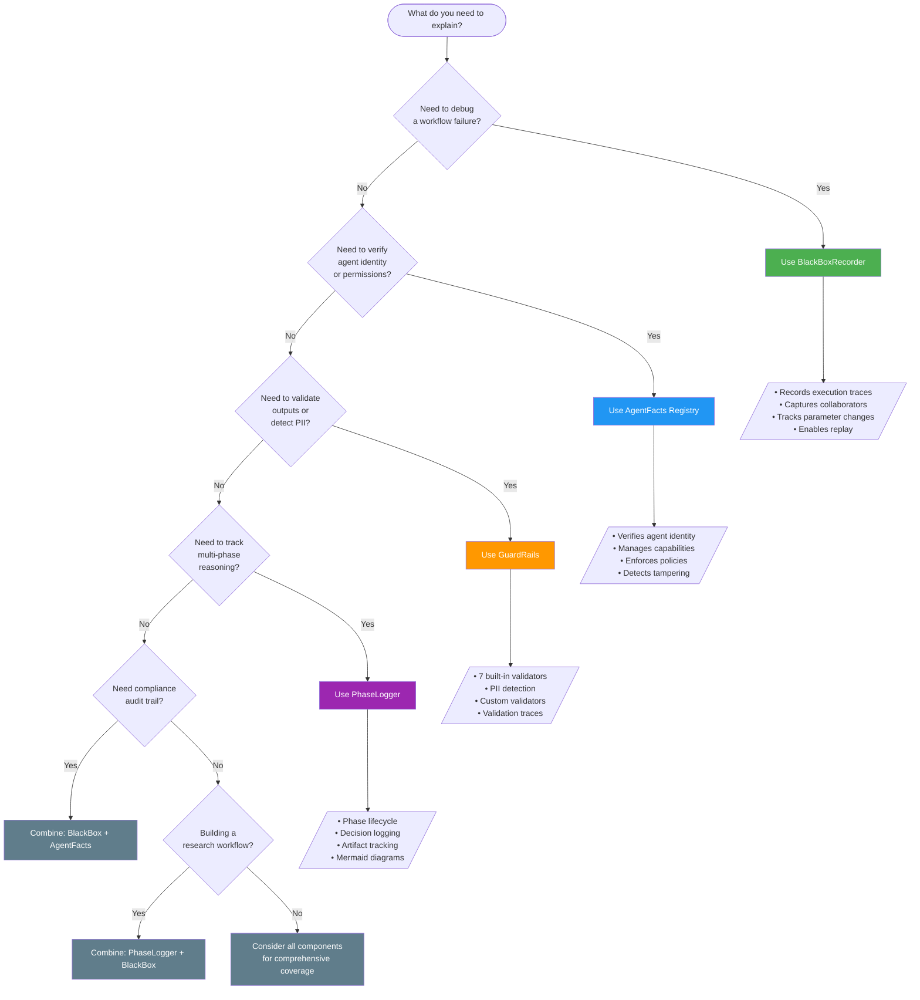

# Tutorial 1: Explainability Fundamentals

**Duration:** ~20 minutes  
**Level:** Beginner  
**Prerequisites:** Basic understanding of AI agents and multi-agent systems

---

## Introduction

Last year, I was deep in a post-incident review. A multi-agent invoice processing system had approved a payment it shouldn't have. I had logs—plenty of them. I could see *what* happened.

But the finance director kept asking questions I couldn't answer: *Which agent approved it? What version was running? Did the validation checks pass or were they skipped? Why did the system choose auto-approval instead of routing for review?*

I realized I'd been thinking about explainability all wrong. Recording events wasn't enough. I needed to answer fundamentally different questions.

As AI agents become increasingly autonomous—making decisions, invoking tools, and collaborating with other agents—the need for **explainability** has never been greater. This tutorial introduces the fundamentals of AI agent explainability and provides a framework for building transparent, auditable agent systems.

After that incident, I started paying closer attention to the questions stakeholders actually ask. Developers want different things than compliance officers. Operations teams have different needs than auditors. But I noticed a pattern. Regardless of who was asking, the questions fell into four categories:

1. **What happened?**
2. **Who did it?**
3. **What was checked?**
4. **Why was it done?**

These became what I now think of as the four pillars of agent explainability. Each addresses a distinct aspect of transparency, and together they provide comprehensive coverage for debugging, compliance, and governance.

---

## 1. What is AI Agent Explainability?

**AI Agent Explainability** is the ability to understand, trace, and verify *what an agent did*, *why it did it*, and *how it arrived at its decisions*. Unlike traditional software where execution paths are deterministic, AI agents operate with:

- **Probabilistic reasoning** - Decisions based on model outputs with confidence scores
- **Dynamic tool selection** - Runtime choices about which capabilities to invoke
- **Multi-agent collaboration** - Handoffs and coordination between autonomous entities
- **Adaptive behavior** - Parameter adjustments based on intermediate results

### Why Explainability Matters

| Stakeholder | Need |
|-------------|------|
| **Developers** | Debug failures, optimize performance, understand agent behavior |
| **Operations** | Monitor production systems, investigate incidents, ensure SLAs |
| **Compliance** | Meet regulatory requirements (HIPAA, SOX, GDPR), audit trails |
| **Users** | Trust AI decisions, understand recommendations, verify accuracy |

---

## 2. Agent Explainability vs. Model Interpretability

A critical distinction exists between **agent-level explainability** and **model-level interpretability**. Understanding this difference is essential for choosing the right tools.

### Model Interpretability (LIME, SHAP)

**Model interpretability** focuses on understanding *why a specific ML model produced a particular output*. Tools like LIME and SHAP answer questions such as:

- "Which features contributed most to this prediction?"
- "How would changing input X affect the output?"
- "What is the decision boundary for this classifier?"

**Example: SHAP for Sentiment Analysis**

```python
import shap

# SHAP explains which words influenced a sentiment prediction
explainer = shap.Explainer(sentiment_model)
shap_values = explainer(["The product quality is excellent but shipping was slow"])

# Output: "excellent" → +0.45 (positive), "slow" → -0.23 (negative)
```

**Limitations for Agent Systems:**
- SHAP/LIME explain a *single model call*, not a *workflow*
- They don't capture agent decisions like "which tool to call"
- No visibility into multi-step reasoning or collaboration
- Cannot trace parameter changes across execution

### Agent Explainability (This Framework)

**Agent explainability** operates at a higher level, answering questions about the *entire agent workflow*:

- "What steps did the agent take to complete this task?"
- "Why did the agent choose Tool A over Tool B?"
- "Which agents collaborated and what did each contribute?"
- "What parameters changed during execution and why?"
- "Where did the cascade failure originate?"

**Example: BlackBox Recording for Invoice Processing**

```python
from backend.explainability.black_box import BlackBoxRecorder, TraceEvent, EventType

# Record agent-level decisions, not just model outputs
recorder = BlackBoxRecorder(workflow_id="invoice-001", storage_path=Path("cache/"))

# Track the decision to use OCR before extraction
recorder.add_trace_event("task-1", TraceEvent(
    event_id="evt-001",
    event_type=EventType.DECISION,
    agent_id="document-classifier",
    metadata={
        "decision": "Use OCR preprocessing",
        "reasoning": "Document is a scanned PDF, not digital text",
        "alternatives_considered": ["Direct text extraction", "Skip preprocessing"],
        "confidence": 0.92
    }
))
```

### Comparison Table

| Aspect | Model Interpretability (LIME/SHAP) | Agent Explainability (This Framework) |
|--------|-----------------------------------|--------------------------------------|
| **Scope** | Single model prediction | End-to-end workflow |
| **Focus** | Feature importance | Decisions, actions, collaborations |
| **Granularity** | Token/feature level | Step/phase level |
| **Temporal** | Point-in-time | Full execution timeline |
| **Multi-agent** | Not applicable | First-class support |
| **Use Case** | "Why this prediction?" | "Why this outcome?" |

### When to Use Each

```
┌─────────────────────────────────────────────────────────────────┐
│                     Explainability Decision Tree                 │
├─────────────────────────────────────────────────────────────────┤
│                                                                  │
│   Question: "Why did the AI do X?"                              │
│                                                                  │
│   ├── Is X a single model output (classification, embedding)?   │
│   │   └── YES → Use LIME/SHAP for feature attribution          │
│   │                                                              │
│   ├── Is X a multi-step workflow with tool calls?               │
│   │   └── YES → Use BlackBoxRecorder for execution traces       │
│   │                                                              │
│   ├── Is X related to agent identity or permissions?            │
│   │   └── YES → Use AgentFacts for governance                   │
│   │                                                              │
│   ├── Is X a validation/safety concern (PII, format)?           │
│   │   └── YES → Use GuardRails for validation traces            │
│   │                                                              │
│   └── Is X a research workflow with phases?                     │
│       └── YES → Use PhaseLogger for decision tracking           │
│                                                                  │
└─────────────────────────────────────────────────────────────────┘
```

### Complementary, Not Competing

These approaches are **complementary**. A production agent system might use:

1. **SHAP** - To explain why the extraction model identified "Acme Corp" as the vendor
2. **BlackBoxRecorder** - To trace the full invoice processing workflow
3. **AgentFacts** - To verify which agent version processed the invoice
4. **GuardRails** - To ensure PII was redacted before storage

---

## 3. The Four Pillars of Agent Explainability

Our framework is built on **four foundational pillars**, each addressing a distinct aspect of agent transparency. Together, they provide comprehensive coverage for debugging, compliance, and governance.

```
┌─────────────────────────────────────────────────────────────────────────────┐
│                    THE FOUR PILLARS OF EXPLAINABILITY                        │
├─────────────────────────────────────────────────────────────────────────────┤
│                                                                              │
│   ┌─────────────┐  ┌─────────────┐  ┌─────────────┐  ┌─────────────┐       │
│   │  RECORDING  │  │  IDENTITY   │  │ VALIDATION  │  │  REASONING  │       │
│   │             │  │             │  │             │  │             │       │
│   │  What       │  │  Who        │  │  What       │  │  Why        │       │
│   │  happened?  │  │  did it?    │  │  was        │  │  was it     │       │
│   │             │  │             │  │  checked?   │  │  done?      │       │
│   └──────┬──────┘  └──────┬──────┘  └──────┬──────┘  └──────┬──────┘       │
│          │                │                │                │              │
│          ▼                ▼                ▼                ▼              │
│   ┌─────────────┐  ┌─────────────┐  ┌─────────────┐  ┌─────────────┐       │
│   │ BlackBox    │  │ AgentFacts  │  │ GuardRails  │  │ PhaseLogger │       │
│   │ Recorder    │  │ Registry    │  │ Validator   │  │             │       │
│   └─────────────┘  └─────────────┘  └─────────────┘  └─────────────┘       │
│                                                                              │
└─────────────────────────────────────────────────────────────────────────────┘
```

### Pillar 1: Recording — "What Happened?"

This is where I usually start, and for good reason. I've found I need a complete record of everything that occurred during agent execution—the steps that were planned versus what actually ran, the inputs and outputs at each stage, timing information, and any parameter changes along the way.

**Purpose:** Capture a complete, immutable record of everything that occurred during agent execution.

**Analogy:** Like an aviation black box (CVR + FDR), this pillar records the "flight data" of your agent workflows for post-incident analysis. After a flight, investigators can reconstruct exactly what happened, in what order, and where things started to go wrong.

**Key Questions Answered:**
- What steps were planned vs. actually executed?
- What inputs/outputs flowed between steps?
- When did each event occur and how long did it take?
- What parameters changed and why?
- Where did a cascade failure originate?

In practice, this means capturing task plans, execution traces, which agents collaborated, and checkpoints you can roll back to. When a cascade failure happens, this pillar lets you trace it back to the originating event.

**What Gets Recorded:**

| Data Type | Description | Example |
|-----------|-------------|---------|
| **Task Plans** | Intended execution steps with dependencies | 5-step invoice extraction pipeline |
| **Execution Traces** | Actual events in chronological order | Step started → Decision made → Error |
| **Collaborators** | Which agents participated | Extractor, Validator, Formatter agents |
| **Parameter Substitutions** | Runtime parameter changes | `confidence_threshold: 0.8 → 0.95` |
| **Checkpoints** | Safe rollback points | After step 2 validation passed |

**When You Need It:**
- Debugging production failures
- Compliance audits requiring execution history
- Performance optimization
- Root cause analysis of cascade failures

I've found this is necessary but not sufficient. Knowing *what* happened doesn't tell you *who* was responsible or *why* decisions were made.

---

### Pillar 2: Identity — "Who Did It?"

This one took me longer to appreciate. In a multi-agent system, I realized that simply knowing "the approval agent" handled something wasn't specific enough. I needed to know which version, what configuration it was running, who owns it, and whether anyone tampered with it.

**Purpose:** Establish and verify the identity, capabilities, and governance policies of each agent.

**Analogy:** Like a passport and professional license combined—proves who the agent is, what it's qualified to do, and what rules it must follow.

**Key Questions Answered:**
- Which agent (version, owner) processed this request?
- What capabilities does this agent declare?
- What policies govern this agent's behavior?
- Has the agent's configuration been tampered with?
- Who is responsible for this agent?

In practice, this means tracking agent identity (ID, version, owner), declared capabilities, operational policies, and some form of signature verification to detect tampering. For compliance-heavy environments, this is often the pillar auditors care most about.

**What Gets Tracked:**

| Data Type | Description | Example |
|-----------|-------------|---------|
| **Agent Identity** | Unique ID, name, version, owner | `invoice-extractor-v1.2.3` by `finance-team` |
| **Capabilities** | Declared functions with schemas | `extract_vendor(input: Invoice) → VendorInfo` |
| **Policies** | Operational constraints | Rate limit: 100 req/min, requires approval for >$10k |
| **Signature Hash** | SHA256 for tamper detection | `a3f2b1c4...` (recomputed on verify) |
| **Audit Trail** | All changes to agent facts | Registered → Updated → Verified |

**When You Need It:**
- Multi-tenant environments requiring agent isolation
- Compliance requiring clear accountability
- Cost attribution and chargeback
- Model lineage tracking
- Capability-based agent discovery

I initially underestimated how often "which agent version processed this?" becomes a critical question during incident review.

---

### Pillar 3: Validation — "What Was Checked?"

This pillar answers what constraints were applied and whether outputs passed them. Did the response meet length requirements? Was PII detected and handled? Were required fields present? Did confidence scores fall within acceptable ranges?

**Purpose:** Declaratively define and enforce constraints on agent inputs/outputs with full transparency.

**Analogy:** Like a customs inspection form—declares what's expected, checks what's actual, and documents every inspection result.

**Key Questions Answered:**
- What validation rules were applied?
- Did the output pass all constraints?
- What specific checks failed and why?
- Was any sensitive data (PII) detected?
- What action was taken on failure?

The key insight for me was that validation isn't just about catching problems. It's about *proving* that checks happened. When a compliance officer asks whether customer data was properly handled, having validation traces allows me to show exactly what was checked and what actions were taken.

**What Gets Validated:**

| Validator | Purpose | Example |
|-----------|---------|---------|
| **length_check** | String length bounds | Response between 10-5000 chars |
| **regex_match** | Pattern matching | Email format, phone numbers |
| **no_pii** | Sensitive data detection | SSN, credit card, email, phone |
| **confidence_range** | Score bounds | Confidence must be 0.0-1.0 |
| **required_fields** | Mandatory fields | `vendor`, `amount`, `date` required |
| **json_parseable** | Valid JSON | Output must be parseable |
| **value_in_list** | Enumeration check | Status in ["approved", "rejected", "pending"] |

**Failure Actions:**

| Action | Behavior | Use Case |
|--------|----------|----------|
| `REJECT` | Stop processing, return error | Critical validation failures |
| `FIX` | Attempt automatic correction | Minor format issues |
| `ESCALATE` | Send to human review | Uncertain classifications |
| `LOG` | Record and continue | Warnings, non-blocking checks |
| `RETRY` | Retry with modified prompt | Recoverable LLM errors |

Different failures might warrant different responses: reject and stop, attempt automatic correction, escalate to human review, or just log and continue. Tracking these decisions creates audit evidence.

**When You Need It:**
- Output quality assurance
- PII detection and redaction
- Schema compliance
- Safety guardrails for LLM outputs

---

### Pillar 4: Reasoning — "Why Was It Done?"

This is the pillar I'm still grappling with the most. It attempts to track the decision-making process—not just what choice was made, but why that approach was selected over alternatives.

**Purpose:** Track the decision-making process through workflow phases with explicit reasoning.

**Analogy:** Like a research lab notebook—documents not just results, but the reasoning behind each decision and alternatives considered. Scientists don't just record results; they document their reasoning, the hypotheses they considered, and why they chose one experimental design over another.

**Key Questions Answered:**
- What phase is the workflow currently in?
- Why was this particular approach chosen?
- What alternatives were considered and rejected?
- What artifacts were produced at each phase?
- How confident was the agent in its decisions?

In my experiments, this means logging decisions with explicit reasoning, the alternatives that were considered and rejected, what artifacts were produced, and how confident the agent was. For the regulated workflows I've seen, this kind of documentation seems to be the difference between a defensible methodology and an unexplainable black box.

**What Gets Logged:**

| Data Type | Description | Example |
|-----------|-------------|---------|
| **Phases** | Workflow stages | Planning → Execution → Validation → Reporting |
| **Decisions** | Choices with reasoning | "Use GPT-4 because accuracy > speed for this task" |
| **Alternatives** | Options not selected | "Considered: GPT-3.5 (faster), Claude (cheaper)" |
| **Artifacts** | Produced outputs | `report.pdf`, `extracted_data.json` |
| **Errors** | Issues encountered | `[recoverable] Timeout on first attempt` |

**Standard Workflow Phases:**

```
PLANNING → LITERATURE_REVIEW → DATA_COLLECTION → EXECUTION → EXPERIMENT → VALIDATION → REPORTING
                                                                                         ↓
                                                                              COMPLETED or FAILED
```

**When You Need It:**
- Research workflows requiring methodology transparency
- Decision audits for regulated industries
- Knowledge transfer and documentation
- Post-mortem analysis of complex workflows

---

### How the Pillars Work Together

I've come to see these not as competing approaches, but as complementary pieces of a puzzle. A robust production system likely needs all four simultaneously.

In a production system, these pillars integrate to provide comprehensive coverage:

```python
# Example: Healthcare diagnosis agent with all four pillars

from backend.explainability.black_box import BlackBoxRecorder
from backend.explainability.agent_facts import AgentFactsRegistry, AgentFacts
from backend.explainability.guardrails import GuardRailValidator, BuiltInValidators
from backend.explainability.phase_logger import PhaseLogger, WorkflowPhase

# IDENTITY: Register the agent with capabilities and policies
registry = AgentFactsRegistry(storage_path=Path("cache/"))
registry.register(AgentFacts(
    agent_id="diagnosis-assistant-v2",
    agent_name="Medical Diagnosis Assistant",
    owner="healthcare-ai-team",
    version="2.1.0",
    capabilities=[...],  # Declared capabilities
    policies=[...]       # HIPAA compliance policies
))

# RECORDING: Initialize black box for this patient case
recorder = BlackBoxRecorder(
    workflow_id=f"case-{patient_id}",
    storage_path=Path("cache/")
)

# REASONING: Track phases of the diagnosis workflow
logger = PhaseLogger(
    workflow_id=f"case-{patient_id}",
    storage_path=Path("cache/")
)

# VALIDATION: Set up guardrails for PHI protection
validator = GuardRailValidator()
phi_guardrail = GuardRail(
    name="phi_protection",
    constraints=[BuiltInValidators.no_pii()]  # Detect PHI before storage
)

# During execution, all four pillars capture their respective data
logger.start_phase(WorkflowPhase.DATA_COLLECTION)
recorder.add_trace_event(...)
logger.log_decision("Review lab results first", "Most recent data available", [...])
validation_result = validator.validate(output_data, phi_guardrail)
logger.end_phase("success")
```

Consider a healthcare AI reviewing medical scans:
- **Recording** captures the full processing sequence for each case
- **Identity** verifies which agent version (with FDA-cleared configuration) handled the analysis
- **Validation** ensures no patient PHI leaks into logs
- **Reasoning** documents why the AI flagged specific regions for radiologist review

Each pillar answers different questions for different stakeholders. The radiologist wants to understand the reasoning. The compliance officer wants identity verification and validation traces. The operations team needs recording for incident investigation.

This integration ensures:
- **Complete audit trail** (Recording)
- **Clear accountability** (Identity)  
- **Safety guarantees** (Validation)
- **Transparent reasoning** (Reasoning)

---

## 4. Choosing the Right Component

Use this decision flowchart to select the appropriate component(s) for your use case:



### Quick Reference Matrix

| Use Case | BlackBox | AgentFacts | GuardRails | PhaseLogger |
|----------|:--------:|:----------:|:----------:|:-----------:|
| Debug cascade failures | ✅ | | | |
| Post-incident analysis | ✅ | | | |
| Compliance audit | ✅ | ✅ | | |
| Agent identity verification | | ✅ | | |
| Capability discovery | | ✅ | | |
| Tamper detection | | ✅ | | |
| Output validation | | | ✅ | |
| PII detection/redaction | | | ✅ | |
| Schema enforcement | | | ✅ | |
| Research workflow tracking | ✅ | | | ✅ |
| Decision documentation | | | | ✅ |
| Artifact management | | | | ✅ |
| Multi-tenant isolation | | ✅ | | |
| Cost attribution | | ✅ | | |
| Safety guardrails | | | ✅ | |

### Component Selection by Industry

| Industry | Primary Components | Key Requirements |
|----------|-------------------|------------------|
| **Healthcare** | AgentFacts + GuardRails | HIPAA compliance, PHI protection, audit trails |
| **Finance** | BlackBox + AgentFacts | SOX compliance, transaction tracing, accountability |
| **Legal** | PhaseLogger + BlackBox | Discovery support, reasoning documentation |
| **Research** | PhaseLogger + BlackBox | Methodology transparency, reproducibility |
| **Customer Service** | GuardRails + BlackBox | PII protection, conversation tracing |

---

## 5. Real-World Scenarios

These scenarios demonstrate how the explainability framework addresses real industry challenges.

### Scenario 1: Healthcare — HIPAA-Compliant Diagnosis Assistant

**Context:** A hospital deploys an AI agent to assist radiologists with preliminary scan analysis. The system must comply with HIPAA regulations and provide complete audit trails for patient safety reviews.

**Challenge:** 
- Patient PHI must never be logged or exposed
- Every diagnosis suggestion must be traceable
- Agents must be version-controlled for FDA compliance
- Radiologists need to understand *why* the AI flagged an anomaly

**Solution:**

```python
# Components Used: AgentFacts + GuardRails + PhaseLogger

# 1. IDENTITY: Register compliant agent with HIPAA policies
registry.register(AgentFacts(
    agent_id="radiology-assistant-v3.2.1",
    owner="radiology-ai-team",
    version="3.2.1",
    policies=[
        Policy(
            policy_id="hipaa-phi-protection",
            name="PHI Protection Policy",
            policy_type="data_access",
            constraints={
                "phi_fields_blocked": ["patient_name", "ssn", "dob", "mrn"],
                "audit_all_access": True,
                "retention_days": 2555  # 7 years per HIPAA
            }
        )
    ]
))

# 2. VALIDATION: Ensure no PHI in outputs
phi_guardrail = GuardRail(
    name="phi_protection",
    constraints=[
        BuiltInValidators.no_pii(),
        BuiltInValidators.required_fields(["finding", "confidence", "region"])
    ],
    on_fail_default=FailAction.REJECT
)

# 3. REASONING: Document diagnostic reasoning
logger.start_phase(WorkflowPhase.EXECUTION)
logger.log_decision(
    decision="Flag region for radiologist review",
    reasoning="Detected potential nodule with characteristics matching training data",
    alternatives=["Mark as normal", "Request additional scan"],
    selected_because="Confidence score 0.78 exceeds review threshold of 0.70",
    confidence=0.78
)
```

**Audit Query:** "Show me all decisions made for scan ID 12345"
```python
# PhaseLogger provides complete decision trail
decisions = logger.get_phase_decisions(WorkflowPhase.EXECUTION)
for d in decisions:
    print(f"{d.timestamp}: {d.decision}")
    print(f"  Reasoning: {d.reasoning}")
    print(f"  Alternatives: {d.alternatives_considered}")
```

---

### Scenario 2: Finance — SOX-Compliant Invoice Processing

**Context:** A fintech company uses a multi-agent system to process vendor invoices. SOX compliance requires complete traceability of all financial transactions, and auditors must be able to reconstruct any processing decision.

**Challenge:**
- Auditors need to trace every invoice from receipt to payment
- Parameter changes (like approval thresholds) must be logged with justification
- System must identify which agent (and version) approved each transaction
- Cascade failures must be diagnosable without accessing production

**Solution:**

```python
# Components Used: BlackBoxRecorder + AgentFacts

# 1. RECORDING: Capture complete processing pipeline
recorder = BlackBoxRecorder(
    workflow_id=f"invoice-{invoice_id}",
    storage_path=Path("audit_logs/")
)

# Record the task plan
recorder.record_task_plan("process-invoice", TaskPlan(
    plan_id=f"plan-{invoice_id}",
    task_id="process-invoice",
    steps=[
        PlanStep(step_id="ocr", description="Extract text from PDF", agent_id="ocr-agent-v2"),
        PlanStep(step_id="extract", description="Extract fields", agent_id="extractor-v3"),
        PlanStep(step_id="validate", description="Validate against vendor DB", agent_id="validator-v1"),
        PlanStep(step_id="approve", description="Route for approval", agent_id="approval-router-v2"),
    ],
    dependencies={"extract": ["ocr"], "validate": ["extract"], "approve": ["validate"]},
    rollback_points=["ocr", "extract"]
))

# Log parameter changes with justification
recorder.record_parameter_substitution(
    task_id="process-invoice",
    param="approval_threshold",
    old_val=5000,
    new_val=10000,
    reason="Q4 policy update: increased threshold per CFO directive dated 2024-10-15",
    agent_id="approval-router-v2"
)

# 2. IDENTITY: Verify agent handling high-value invoices
if invoice_amount > 50000:
    agent = registry.get("approval-router-v2")
    if not registry.verify("approval-router-v2"):
        raise SecurityError("Agent signature verification failed - possible tampering")
```

**Audit Query:** "Reconstruct processing for invoice INV-2024-5432"
```python
# Export complete black box for auditors
recorder.export_black_box(
    task_id="process-invoice",
    filepath=Path(f"sox_audit/invoice-{invoice_id}-blackbox.json")
)

# Replay events chronologically
for event in recorder.replay("process-invoice"):
    print(f"{event.timestamp}: {event.event_type} - {event.data}")
```

---

### Scenario 3: Legal — E-Discovery Support System

**Context:** A law firm uses AI agents to review documents for litigation discovery. The system must document its reasoning for including or excluding documents, as this reasoning may be challenged in court.

**Challenge:**
- Every document classification decision must be defensible
- Methodology must be transparent and reproducible
- Attorneys need to understand why documents were flagged as relevant
- System must track all artifacts produced during review

**Solution:**

```python
# Components Used: PhaseLogger + BlackBoxRecorder

# 1. REASONING: Track review methodology phases
logger = PhaseLogger(
    workflow_id=f"case-{case_id}-discovery",
    storage_path=Path("case_files/")
)

# Document planning phase
logger.start_phase(WorkflowPhase.PLANNING)
logger.log_decision(
    decision="Use keyword + semantic hybrid search",
    reasoning="Case involves technical documents where exact terminology matters",
    alternatives=["Keyword only", "Semantic only", "Manual review"],
    selected_because="Hybrid approach balances precision (keywords) with recall (semantics)"
)
logger.log_artifact(
    artifact_name="search_terms.json",
    artifact_path=Path("case_files/search_terms.json"),
    artifact_type="configuration"
)
logger.end_phase("success")

# Document review phase
logger.start_phase(WorkflowPhase.EXECUTION)
for doc in documents:
    logger.log_decision(
        decision=f"Classify document {doc.id} as {'relevant' if doc.relevant else 'not_relevant'}",
        reasoning=doc.classification_reasoning,
        alternatives=["relevant", "not_relevant", "needs_attorney_review"],
        selected_because=f"Confidence {doc.confidence:.2f}, matched terms: {doc.matched_terms}",
        confidence=doc.confidence
    )
logger.end_phase("success")

# 2. RECORDING: Full execution trace for reproducibility
recorder = BlackBoxRecorder(
    workflow_id=f"case-{case_id}-discovery",
    storage_path=Path("case_files/")
)
# ... record all processing events
```

**Court Challenge Response:** "Explain why document DOC-4521 was classified as not relevant"
```python
# Generate methodology documentation
workflow_diagram = logger.visualize_workflow()
summary = logger.get_phase_summary()

# Find specific decision
for phase, decisions in logger._decisions.items():
    for d in decisions:
        if "DOC-4521" in d.decision:
            print(f"Decision: {d.decision}")
            print(f"Reasoning: {d.reasoning}")
            print(f"Alternatives Considered: {d.alternatives_considered}")
            print(f"Selected Because: {d.selected_because}")
            print(f"Confidence: {d.confidence}")
```

---

### Scenario 4: Customer Service — PII-Safe Chatbot

**Context:** An e-commerce company deploys a customer service chatbot. The system must never store or log customer PII, even if customers voluntarily provide it in conversation.

**Challenge:**
- Customers often share credit card numbers, SSNs, or emails unprompted
- Chat logs are needed for quality assurance but must be PII-free
- System must detect and redact PII in real-time
- Audit trail must prove PII was never persisted

**Solution:**

```python
# Components Used: GuardRails + BlackBoxRecorder

# 1. VALIDATION: Detect and redact PII before storage
validator = GuardRailValidator()

pii_guardrail = GuardRail(
    name="customer_pii_protection",
    description="Detect and redact PII in customer messages",
    constraints=[
        BuiltInValidators.no_pii(),  # Detects SSN, credit card, email, phone
    ],
    on_fail_default=FailAction.FIX  # Redact and continue
)

# Custom redaction logic
def process_customer_message(message: str) -> str:
    result = validator.validate({"output": message}, pii_guardrail)
    
    if not result.is_valid:
        # Redact detected PII
        redacted = message
        for entry in result.entries:
            if not entry.passed and "detected" in entry.message.lower():
                # Apply redaction patterns
                redacted = redact_pii_patterns(redacted)
        return redacted
    return message

# 2. RECORDING: Log conversation (PII-free) for QA
recorder = BlackBoxRecorder(
    workflow_id=f"chat-{session_id}",
    storage_path=Path("chat_logs/")
)

# Record sanitized message
sanitized = process_customer_message(customer_message)
recorder.add_trace_event("chat-task", TraceEvent(
    event_id=f"msg-{msg_id}",
    event_type=EventType.STEP_END,
    metadata={
        "message_sanitized": sanitized,
        "pii_detected": not result.is_valid,
        "pii_types": [e.message for e in result.entries if not e.passed]
    }
))

# Export validation trace proving PII handling
validator.export_trace(Path(f"compliance/chat-{session_id}-pii-trace.json"))
```

**Compliance Audit:** "Prove that session CHAT-9876 did not store PII"
```python
# Load validation trace
with open(f"compliance/chat-CHAT-9876-pii-trace.json") as f:
    trace = json.load(f)

print(f"Total validations: {trace['entry_count']}")
for entry in trace['entries']:
    if not entry['passed']:
        print(f"PII detected and handled: {entry['message']}")
        print(f"Action taken: redacted before storage")
```

---

### Key Takeaways from Scenarios

| Scenario | Primary Challenge | Components Used | Key Benefit |
|----------|------------------|-----------------|-------------|
| Healthcare | HIPAA compliance, PHI protection | AgentFacts + GuardRails + PhaseLogger | Regulatory compliance with decision transparency |
| Finance | SOX audit trail, accountability | BlackBox + AgentFacts | Complete transaction traceability |
| Legal | Defensible methodology | PhaseLogger + BlackBox | Court-ready documentation |
| Customer Service | PII protection | GuardRails + BlackBox | Privacy compliance with QA capability |

---

## 6. Next Steps

Now that you understand the fundamentals of agent explainability, dive deeper into each component:

### Deep-Dive Tutorials

| Tutorial | Focus | What You'll Learn |
|----------|-------|-------------------|
| [Tutorial 2: BlackBox Recording for Debugging](02_black_box_recording_debugging.md) | Recording Pillar | Post-incident analysis workflow, cascade failure debugging, replay and export |
| [Tutorial 3: AgentFacts for Governance](03_agentfacts_governance.md) | Identity Pillar | Agent identity verification, capability declarations, SHA256 signature verification |
| [Tutorial 4: GuardRails for Validation and PII Detection](04_guardrails_validation_pii.md) | Validation Pillar | All 7 built-in validators, custom validators, PII detection patterns |

### Interactive Notebooks

For hands-on practice, try these Jupyter notebooks:

| Notebook | Component | Duration |
|----------|-----------|----------|
| [01_black_box_recording_demo.ipynb](../notebooks/01_black_box_recording_demo.ipynb) | BlackBoxRecorder | ~15 min |
| [02_agent_facts_verification.ipynb](../notebooks/02_agent_facts_verification.ipynb) | AgentFacts Registry | ~15 min |
| [03_guardrails_validation_traces.ipynb](../notebooks/03_guardrails_validation_traces.ipynb) | GuardRails | ~15 min |
| [04_phase_logger_workflow.ipynb](../notebooks/04_phase_logger_workflow.ipynb) | PhaseLogger | ~15 min |

### Learning Path

```
                    ┌─────────────────────────────────┐
                    │  You Are Here!                  │
                    │  Tutorial 1: Fundamentals       │
                    └───────────────┬─────────────────┘
                                    │
            ┌───────────────────────┼───────────────────────┐
            │                       │                       │
            ▼                       ▼                       ▼
    ┌───────────────┐      ┌───────────────┐      ┌───────────────┐
    │  Tutorial 2   │      │  Tutorial 3   │      │  Tutorial 4   │
    │  BlackBox     │      │  AgentFacts   │      │  GuardRails   │
    │  (Recording)  │      │  (Identity)   │      │  (Validation) │
    └───────┬───────┘      └───────┬───────┘      └───────┬───────┘
            │                       │                       │
            └───────────────────────┼───────────────────────┘
                                    │
                                    ▼
                    ┌─────────────────────────────────┐
                    │  Notebook 04: PhaseLogger       │
                    │  (Reasoning)                    │
                    └─────────────────────────────────┘
```

---

## Summary

In this tutorial, you learned:

1. **What agent explainability is** — The ability to understand, trace, and verify agent decisions and actions
2. **How it differs from model interpretability** — Agent-level (workflows) vs. model-level (features)
3. **The four pillars** — Recording, Identity, Validation, Reasoning
4. **Component mapping** — BlackBox, AgentFacts, GuardRails, PhaseLogger
5. **When to use each component** — Decision flowchart and industry guidance
6. **Real-world applications** — Healthcare, Finance, Legal, Customer Service scenarios

Framing explainability around these four questions has given me a clearer way to think about what I'm actually trying to capture—and to identify gaps before they become problems in production.

---

## Quick Reference Card

```
┌─────────────────────────────────────────────────────────────────────────────┐
│                     EXPLAINABILITY QUICK REFERENCE                           │
├─────────────────────────────────────────────────────────────────────────────┤
│                                                                              │
│  RECORDING (BlackBoxRecorder)         IDENTITY (AgentFacts)                 │
│  ├─ record_task_plan()                ├─ register()                         │
│  ├─ record_collaborators()            ├─ verify()                           │
│  ├─ record_parameter_substitution()   ├─ get_capabilities()                 │
│  ├─ add_trace_event()                 ├─ export_for_audit()                 │
│  └─ export_black_box()                └─ find_by_capability()               │
│                                                                              │
│  VALIDATION (GuardRails)              REASONING (PhaseLogger)               │
│  ├─ length_check()                    ├─ start_phase()                      │
│  ├─ regex_match()                     ├─ log_decision()                     │
│  ├─ no_pii()                          ├─ log_artifact()                     │
│  ├─ confidence_range()                ├─ end_phase()                        │
│  ├─ required_fields()                 ├─ get_phase_summary()                │
│  ├─ json_parseable()                  └─ visualize_workflow()               │
│  └─ value_in_list()                                                         │
│                                                                              │
└─────────────────────────────────────────────────────────────────────────────┘
```

---

*Tutorial created as part of Lesson 17: Agent Explainability Framework*

