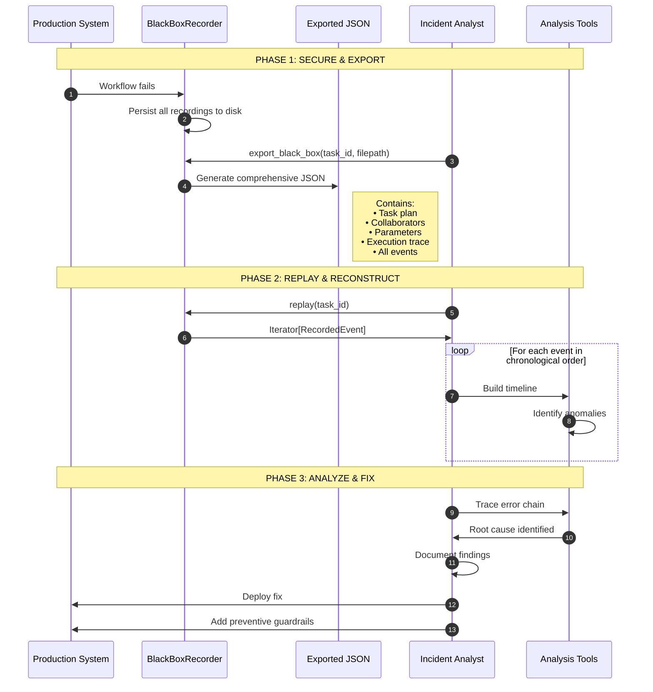

# Tutorial 2: BlackBox Recording for Debugging

**Duration:** ~25 minutes  
**Level:** Intermediate  
**Prerequisites:** [Tutorial 1: Explainability Fundamentals](01_explainability_fundamentals.md)

---

## Introduction

When a complex multi-agent workflow fails, the question isn't *if* you'll need to debug it—it's *how*. Without proper instrumentation, you're left guessing at root causes from incomplete logs, reproducing issues in isolation, and hoping the problem recurs so you can catch it.

The **BlackBoxRecorder** solves this problem by borrowing a proven concept from aviation: the flight recorder, or "black box." Just as aviation investigators can reconstruct every moment of a flight from recorder data, you can reconstruct every moment of an agent workflow—every decision, every parameter change, every collaboration—from a BlackBox recording.

This tutorial teaches you how to:
1. Instrument multi-agent workflows with comprehensive recording
2. Capture all 9 event types for complete visibility
3. Perform post-incident analysis using export and replay
4. Debug cascade failures with real-world examples

> 📓 **Hands-on Notebook Available**: This tutorial has an accompanying interactive notebook
> [01_black_box_recording_demo.ipynb](../notebooks/01_black_box_recording_demo.ipynb) where you can
> run the code examples yourself. Start with the tutorial concepts, then practice in the notebook.

---

## 1. The Aviation Black Box Analogy

### A Brief History

On May 2, 1953, BOAC Flight 783 crashed shortly after takeoff from Calcutta, killing all 43 people aboard. The cause remained a mystery until investigators meticulously analyzed debris patterns. This tragedy—and others like it—led Australian researcher David Warren to propose a simple but revolutionary idea: **record everything**.

By 1960, Australia became the first country to mandate flight recorders. Today, every commercial aircraft carries two "black boxes" (actually bright orange for visibility):

1. **CVR (Cockpit Voice Recorder)** — Records all audio in the cockpit
2. **FDR (Flight Data Recorder)** — Records hundreds of flight parameters

Together, these devices have transformed aviation into the safest form of transportation. When accidents occur, investigators don't guess—they *know* what happened.

### Mapping Aviation to Multi-Agent Systems

The parallels between aircraft operation and multi-agent workflows are striking:

```
┌─────────────────────────────────────────────────────────────────────────────┐
│                    AVIATION → MULTI-AGENT SYSTEM MAPPING                     │
├─────────────────────────────────────────────────────────────────────────────┤
│                                                                              │
│   AVIATION                          MULTI-AGENT SYSTEMS                      │
│   ─────────                         ────────────────────                     │
│                                                                              │
│   ┌─────────────────┐               ┌─────────────────┐                     │
│   │  COCKPIT VOICE  │               │  DECISION AND   │                     │
│   │  RECORDER (CVR) │      →        │  REASONING LOG  │                     │
│   │                 │               │                 │                     │
│   │  • Pilot        │               │  • Agent        │                     │
│   │    conversations│               │    decisions    │                     │
│   │  • ATC comms    │               │  • Inter-agent  │                     │
│   │  • Alerts/alarms│               │    messages     │                     │
│   │  • Ambient sound│               │  • Error alerts │                     │
│   └─────────────────┘               └─────────────────┘                     │
│                                                                              │
│   ┌─────────────────┐               ┌─────────────────┐                     │
│   │  FLIGHT DATA    │               │  EXECUTION      │                     │
│   │  RECORDER (FDR) │      →        │  TRACE          │                     │
│   │                 │               │                 │                     │
│   │  • Altitude     │               │  • Step timing  │                     │
│   │  • Speed        │               │  • Input/output │                     │
│   │  • Heading      │               │    data hashes  │                     │
│   │  • Control      │               │  • Parameter    │                     │
│   │    positions    │               │    values       │                     │
│   │  • Engine data  │               │  • Agent states │                     │
│   └─────────────────┘               └─────────────────┘                     │
│                                                                              │
│   ┌─────────────────┐               ┌─────────────────┐                     │
│   │  FLIGHT PLAN    │               │  TASK PLAN      │                     │
│   │                 │      →        │                 │                     │
│   │  • Route        │               │  • Steps        │                     │
│   │  • Waypoints    │               │  • Dependencies │                     │
│   │  • Alternates   │               │  • Rollback     │                     │
│   │  • Fuel         │               │    points       │                     │
│   │    requirements │               │  • Timeouts     │                     │
│   └─────────────────┘               └─────────────────┘                     │
│                                                                              │
│   ┌─────────────────┐               ┌─────────────────┐                     │
│   │  CREW MANIFEST  │               │  COLLABORATORS  │                     │
│   │                 │      →        │                 │                     │
│   │  • Captain      │               │  • Lead agent   │                     │
│   │  • First Officer│               │  • Support      │                     │
│   │  • Flight crew  │               │    agents       │                     │
│   │  • Qualifications               │  • Capabilities │                     │
│   └─────────────────┘               └─────────────────┘                     │
│                                                                              │
└─────────────────────────────────────────────────────────────────────────────┘
```

### The CVR/FDR Mapping in Detail

| Aviation Concept | Agent System Equivalent | Captured By |
|-----------------|------------------------|-------------|
| **CVR: Pilot speech** | Decision reasoning and rationale | `TraceEvent(DECISION, metadata={reasoning: ...})` |
| **CVR: ATC communications** | Inter-agent message passing | `TraceEvent(COLLABORATOR_JOIN/LEAVE)` |
| **CVR: Alerts/warnings** | Error events and warnings | `TraceEvent(ERROR, metadata={is_recoverable: ...})` |
| **FDR: Altitude** | Workflow phase/step position | `TraceEvent(STEP_START/STEP_END)` |
| **FDR: Speed** | Processing duration | `TraceEvent.duration_ms` |
| **FDR: Control positions** | Parameter values | `ParameterSubstitution` |
| **FDR: Engine status** | Agent health/state | `TraceEvent.metadata` |
| **Flight plan** | Task execution plan | `TaskPlan` with steps, dependencies |
| **Crew manifest** | Agent collaborators | `AgentInfo` with roles, capabilities |
| **Waypoints** | Rollback points | `TaskPlan.rollback_points` |

### Why This Analogy Works

The aviation analogy isn't just a teaching tool—it reflects deep structural similarities:

| Characteristic | Aviation | Multi-Agent Systems |
|---------------|----------|---------------------|
| **Multiple autonomous actors** | Pilots, ATC, ground crew | Multiple specialized agents |
| **Complex dependencies** | Takeoff → cruise → landing | Extract → validate → approve |
| **Failure cascades** | Engine failure → fuel imbalance → loss of control | Validation error → approval skip → bad output |
| **Post-incident opacity** | "What happened in the cockpit?" | "Why did the agent do that?" |
| **Regulatory scrutiny** | FAA, NTSB investigations | HIPAA, SOX audits |
| **Need for reproducibility** | Simulate incident in flight simulator | Replay workflow from recording |

### The Investigation Mindset

Aviation accident investigators follow a rigorous methodology:

1. **Secure the recorders** — Prevent data loss or tampering
2. **Extract the data** — Export to analysis tools
3. **Build a timeline** — Chronological event reconstruction
4. **Identify anomalies** — What deviated from expected?
5. **Trace causation** — Root cause analysis
6. **Recommend fixes** — Prevent recurrence

The BlackBoxRecorder enables the *same methodology* for agent workflows:

```
┌─────────────────────────────────────────────────────────────────────────────┐
│                    POST-INCIDENT INVESTIGATION WORKFLOW                      │
├─────────────────────────────────────────────────────────────────────────────┤
│                                                                              │
│   1. SECURE                2. EXTRACT               3. TIMELINE              │
│   ┌─────────────┐          ┌─────────────┐          ┌─────────────┐         │
│   │ BlackBox    │    →     │ export_     │    →     │ replay()    │         │
│   │ Recorder    │          │ black_box() │          │ iterator    │         │
│   │ (persisted) │          │ to JSON     │          │ ordered by  │         │
│   └─────────────┘          └─────────────┘          │ timestamp   │         │
│                                                     └─────────────┘         │
│                                                            │                 │
│                                                            ▼                 │
│   6. FIX                   5. ROOT CAUSE            4. ANOMALIES             │
│   ┌─────────────┐          ┌─────────────┐          ┌─────────────┐         │
│   │ Update code │    ←     │ Trace       │    ←     │ Find ERROR  │         │
│   │ Add guards  │          │ parameter   │          │ events, bad │         │
│   │ Add checks  │          │ changes,    │          │ outcomes    │         │
│   └─────────────┘          │ decisions   │          └─────────────┘         │
│                            └─────────────┘                                   │
│                                                                              │
└─────────────────────────────────────────────────────────────────────────────┘
```

### Real-World Impact

Just as flight recorders have made aviation safer through systematic learning from failures, the BlackBoxRecorder enables:

- **Faster incident resolution** — Minutes instead of hours to find root cause
- **Pattern detection** — Identify recurring failure modes across workflows
- **Compliance confidence** — Prove exactly what happened to auditors
- **Team knowledge** — New team members can study past incidents
- **Continuous improvement** — Data-driven workflow optimization

---

## 2. Recordable Data Types

The BlackBoxRecorder captures four distinct categories of data, each serving a specific purpose in post-incident analysis.

### 2.1 TaskPlan — The Intended Execution Path

A **TaskPlan** captures what the workflow *intended* to do before execution began. This is crucial for identifying deviations—where did actual execution diverge from the plan?

```python
from backend.explainability.black_box import (
    BlackBoxRecorder, TaskPlan, PlanStep
)
from pathlib import Path

# Initialize the recorder
recorder = BlackBoxRecorder(
    workflow_id="invoice-processing-001",
    storage_path=Path("cache/")
)

# Define the intended execution plan
plan = TaskPlan(
    plan_id="plan-invoice-001",
    task_id="process-invoice",
    steps=[
        PlanStep(
            step_id="step-1-ocr",
            description="Extract text from invoice PDF using OCR",
            agent_id="ocr-agent-v2",
            expected_inputs=["invoice_pdf"],
            expected_outputs=["raw_text", "confidence_score"],
            timeout_seconds=60,
            is_critical=True,  # Failure stops workflow
            order=1
        ),
        PlanStep(
            step_id="step-2-extract",
            description="Extract structured fields from raw text",
            agent_id="extraction-agent-v3",
            expected_inputs=["raw_text"],
            expected_outputs=["vendor_name", "amount", "date", "line_items"],
            timeout_seconds=45,
            is_critical=True,
            order=2
        ),
        PlanStep(
            step_id="step-3-validate",
            description="Validate extracted data against vendor database",
            agent_id="validation-agent-v1",
            expected_inputs=["vendor_name", "amount"],
            expected_outputs=["validation_result", "vendor_id", "risk_score"],
            timeout_seconds=30,
            is_critical=True,
            order=3
        ),
        PlanStep(
            step_id="step-4-approve",
            description="Route for approval based on amount and risk",
            agent_id="approval-router-v2",
            expected_inputs=["validation_result", "amount", "risk_score"],
            expected_outputs=["approval_status", "approver_id"],
            timeout_seconds=120,
            is_critical=False,  # Can continue with manual fallback
            order=4
        )
    ],
    # Dependencies define execution order constraints
    dependencies={
        "step-2-extract": ["step-1-ocr"],      # Extract requires OCR output
        "step-3-validate": ["step-2-extract"],  # Validate requires extraction
        "step-4-approve": ["step-3-validate"]   # Approve requires validation
    },
    # Rollback points define safe recovery positions
    rollback_points=["step-1-ocr", "step-2-extract"],
    # Additional metadata for context
    metadata={
        "invoice_id": "INV-2024-5678",
        "vendor": "Acme Corp",
        "submitted_by": "finance-team"
    }
)

# Record the plan
recorder.record_task_plan("process-invoice", plan)
print(f"✓ Recorded task plan with {len(plan.steps)} steps")
print(f"  Dependencies: {plan.dependencies}")
print(f"  Rollback points: {plan.rollback_points}")
```

**Key Fields:**

| Field | Purpose | Investigation Use |
|-------|---------|-------------------|
| `steps` | Ordered list of execution steps | Compare planned vs actual |
| `dependencies` | Step execution constraints | Identify if constraints were violated |
| `rollback_points` | Safe recovery positions | Understand recovery options that were available |
| `is_critical` | Whether step failure is fatal | Explain why workflow stopped or continued |
| `timeout_seconds` | Maximum step duration | Identify timeout-related failures |

### 2.2 AgentInfo — The Collaborators

**AgentInfo** records which agents participated in the workflow, when they joined, and what capabilities they brought. This answers the question: "Who was involved?"

```python
from backend.explainability.black_box import AgentInfo
from datetime import datetime, UTC

# Define collaborating agents
collaborators = [
    AgentInfo(
        agent_id="ocr-agent-v2",
        agent_name="Document OCR Processor",
        role="extraction",
        joined_at=datetime.now(UTC),
        capabilities=["pdf_ocr", "image_ocr", "handwriting_recognition"]
    ),
    AgentInfo(
        agent_id="extraction-agent-v3",
        agent_name="Invoice Field Extractor",
        role="extraction",
        joined_at=datetime.now(UTC),
        capabilities=["invoice_parsing", "receipt_parsing", "po_parsing"]
    ),
    AgentInfo(
        agent_id="validation-agent-v1",
        agent_name="Vendor Validator",
        role="validation",
        joined_at=datetime.now(UTC),
        capabilities=["vendor_lookup", "amount_validation", "duplicate_check"]
    ),
    AgentInfo(
        agent_id="approval-router-v2",
        agent_name="Approval Workflow Router",
        role="orchestration",
        joined_at=datetime.now(UTC),
        capabilities=["threshold_routing", "escalation", "notification"]
    )
]

# Record collaborators
recorder.record_collaborators("process-invoice", collaborators)

print(f"✓ Recorded {len(collaborators)} collaborating agents:")
for agent in collaborators:
    print(f"  • {agent.agent_name} ({agent.agent_id})")
    print(f"    Role: {agent.role}, Capabilities: {agent.capabilities}")
```

**Investigation Use Cases:**

- **Version mismatch debugging**: "Was the correct agent version used?"
- **Capability verification**: "Did the agent have the required capability?"
- **Timeline reconstruction**: "When did each agent join the workflow?"
- **Resource attribution**: "Which agents consumed the most time?"

### 2.3 ParameterSubstitution — Configuration Changes

**ParameterSubstitution** logs every parameter change during execution with before/after values and justification. This is critical for root cause analysis—many cascade failures originate from parameter changes.

```python
# Record a parameter change (this is often the root cause of failures!)
recorder.record_parameter_substitution(
    task_id="process-invoice",
    param="confidence_threshold",
    old_val=0.8,
    new_val=0.95,
    reason="Compliance team requested higher accuracy for Q4 audit",
    agent_id="extraction-agent-v3"
)

# Record another parameter change
recorder.record_parameter_substitution(
    task_id="process-invoice",
    param="auto_approve_limit",
    old_val=5000,
    new_val=10000,
    reason="CFO approved increased threshold per memo dated 2024-10-15",
    agent_id="approval-router-v2"
)

print("✓ Recorded parameter substitutions")
print("  These changes are now part of the audit trail!")
```

**Why This Matters:**

In the real-world case study later in this tutorial, a parameter change from `confidence_threshold: 0.8 → 0.95` caused a cascade failure. Without parameter substitution logging, this root cause would have been extremely difficult to find.

| Field | Purpose | Example |
|-------|---------|---------|
| `param_name` | Which parameter changed | `confidence_threshold` |
| `old_value` | Previous value | `0.8` |
| `new_value` | New value | `0.95` |
| `reason` | Why it changed | "Compliance team request" |
| `agent_id` | Who changed it | `extraction-agent-v3` |
| `timestamp` | When it changed | `2024-11-27T14:00:10Z` |

### 2.4 ExecutionTrace — What Actually Happened

The **ExecutionTrace** is the complete chronicle of execution events. While TaskPlan captures intent, ExecutionTrace captures reality.

```python
from backend.explainability.black_box import ExecutionTrace, TraceEvent, EventType
from datetime import datetime, UTC

# Build execution trace with events
trace = ExecutionTrace(
    trace_id="trace-invoice-001",
    task_id="process-invoice",
    start_time=datetime.now(UTC),
    events=[
        TraceEvent(
            event_id="evt-001",
            event_type=EventType.STEP_START,
            agent_id="ocr-agent-v2",
            step_id="step-1-ocr",
            metadata={"input_size_bytes": 1024576}
        ),
        TraceEvent(
            event_id="evt-002",
            event_type=EventType.CHECKPOINT,
            agent_id="ocr-agent-v2",
            step_id="step-1-ocr",
            metadata={
                "checkpoint_id": "chk-001",
                "state_snapshot": {"pages_processed": 3}
            }
        ),
        TraceEvent(
            event_id="evt-003",
            event_type=EventType.STEP_END,
            agent_id="ocr-agent-v2",
            step_id="step-1-ocr",
            duration_ms=8500,
            input_hash="a3f2b1c4...",
            output_hash="e7d9c2a1...",
            metadata={"success": True, "confidence": 0.94}
        )
    ],
    final_outcome="success"  # or "failure", "timeout", "cancelled"
)

# Record the complete trace
recorder.record_execution_trace("process-invoice", trace)

print(f"✓ Recorded execution trace with {len(trace.events)} events")
print(f"  Trace ID: {trace.trace_id}")
print(f"  Final outcome: {trace.final_outcome}")
```

**Key Fields in ExecutionTrace:**

| Field | Purpose | Investigation Use |
|-------|---------|-------------------|
| `events` | Chronological event list | Build timeline |
| `final_outcome` | success/failure/timeout/cancelled | Quick status check |
| `error_chain` | List of errors for cascades | Trace failure propagation |
| `start_time` / `end_time` | Execution bounds | Calculate total duration |

---

## 3. The 9 Event Types

Every event in an execution trace has a type that categorizes it. Understanding these types is essential for effective debugging.

```
┌─────────────────────────────────────────────────────────────────────────────┐
│                           THE 9 EVENT TYPES                                  │
├─────────────────────────────────────────────────────────────────────────────┤
│                                                                              │
│   LIFECYCLE EVENTS              DECISION EVENTS         RECOVERY EVENTS      │
│   ─────────────────             ───────────────         ───────────────      │
│   ▶ STEP_START                  ◆ DECISION              🔄 ROLLBACK          │
│   ■ STEP_END                    ⚙ PARAMETER_CHANGE                           │
│   → COLLABORATOR_JOIN                                                        │
│   ← COLLABORATOR_LEAVE          ERROR EVENT             STATE EVENT          │
│                                 ───────────             ───────────          │
│                                 ✗ ERROR                 💾 CHECKPOINT         │
│                                                                              │
└─────────────────────────────────────────────────────────────────────────────┘
```

### 3.1 STEP_START — Execution Begins

Records when a workflow step begins execution.

```python
TraceEvent(
    event_id="evt-001",
    event_type=EventType.STEP_START,
    agent_id="extraction-agent-v3",
    step_id="step-2-extract",
    metadata={
        "input_size": 15000,  # bytes
        "input_keys": ["raw_text", "confidence_score"]
    }
)
```

**Investigation Questions Answered:**
- Did the step actually start?
- When did it start relative to other events?
- What inputs were provided?

### 3.2 STEP_END — Execution Completes

Records when a workflow step completes (successfully or not).

```python
TraceEvent(
    event_id="evt-006",
    event_type=EventType.STEP_END,
    agent_id="extraction-agent-v3",
    step_id="step-2-extract",
    duration_ms=3200,
    input_hash="a3f2b1c4d5e6f7a8b9c0...",  # SHA256 of inputs
    output_hash="1a2b3c4d5e6f7a8b9c0d...",  # SHA256 of outputs
    metadata={
        "success": True,
        "output_keys": ["vendor_name", "amount", "date", "line_items"],
        "confidence": 0.92
    }
)
```

**Investigation Questions Answered:**
- Did the step succeed or fail?
- How long did it take?
- Can we verify input/output integrity via hashes?

### 3.3 DECISION — Choices Made

Records decisions made by agents, including alternatives considered.

```python
TraceEvent(
    event_id="evt-003",
    event_type=EventType.DECISION,
    agent_id="extraction-agent-v3",
    step_id="step-2-extract",
    metadata={
        "decision": "Use GPT-4 for field extraction",
        "alternatives_considered": [
            "GPT-3.5 (faster, less accurate)",
            "Claude (comparable accuracy)",
            "Rule-based extraction (fastest, limited)"
        ],
        "selected_because": "Invoice contains handwritten notes requiring higher capability",
        "confidence": 0.88
    }
)
```

**Investigation Questions Answered:**
- Why did the agent make this choice?
- What alternatives were considered?
- Was the reasoning sound given the context?

### 3.4 ERROR — Failures and Exceptions

Records errors with full context for debugging.

```python
TraceEvent(
    event_id="evt-010",
    event_type=EventType.ERROR,
    agent_id="validation-agent-v1",
    step_id="step-3-validate",
    metadata={
        "error_type": "ValidationError",
        "error_message": "Confidence threshold too high (0.95) - all results filtered out",
        "is_recoverable": False,
        "stack_trace": "Traceback (most recent call last):\n  File...",
        "context": {
            "threshold": 0.95,
            "max_confidence_found": 0.92,
            "records_filtered": 15
        }
    }
)
```

**Investigation Questions Answered:**
- What error occurred?
- Is it recoverable or fatal?
- What was the state when the error happened?

### 3.5 CHECKPOINT — State Snapshots

Records state snapshots at safe recovery points.

```python
TraceEvent(
    event_id="evt-005",
    event_type=EventType.CHECKPOINT,
    agent_id="ocr-agent-v2",
    step_id="step-1-ocr",
    metadata={
        "checkpoint_id": "chk-001",
        "checkpoint_type": "rollback_point",
        "state_snapshot": {
            "pages_processed": 3,
            "total_pages": 5,
            "partial_results": {...}
        },
        "disk_path": "/cache/checkpoints/chk-001.json"
    }
)
```

**Investigation Questions Answered:**
- What state was saved?
- Can we recover from this point?
- What progress was made before the checkpoint?

### 3.6 PARAMETER_CHANGE — Runtime Configuration

Records parameter changes during execution (also captured by `ParameterSubstitution`).

```python
TraceEvent(
    event_id="evt-004",
    event_type=EventType.PARAMETER_CHANGE,
    agent_id="extraction-agent-v3",
    step_id="step-2-extract",
    metadata={
        "parameter": "confidence_threshold",
        "old_value": 0.8,
        "new_value": 0.95,
        "reason": "Compliance team request",
        "approved_by": "admin@company.com"
    }
)
```

**Investigation Questions Answered:**
- What changed and when?
- Why was it changed?
- Who approved the change?

### 3.7 COLLABORATOR_JOIN — Agent Enters

Records when an agent joins the workflow.

```python
TraceEvent(
    event_id="evt-002",
    event_type=EventType.COLLABORATOR_JOIN,
    agent_id="extraction-agent-v3",
    step_id="step-2-extract",
    metadata={
        "role": "extraction",
        "capabilities": ["invoice_parsing", "receipt_parsing"],
        "version": "3.2.1"
    }
)
```

**Investigation Questions Answered:**
- Which agent version was active?
- Did the right agent handle this step?

### 3.8 COLLABORATOR_LEAVE — Agent Exits

Records when an agent leaves the workflow.

```python
TraceEvent(
    event_id="evt-007",
    event_type=EventType.COLLABORATOR_LEAVE,
    agent_id="extraction-agent-v3",
    step_id="step-2-extract",
    metadata={
        "exit_reason": "step_complete",
        "time_active_ms": 3500
    }
)
```

**Investigation Questions Answered:**
- Why did the agent leave?
- How long was it active?
- Was the exit expected or premature?

### 3.9 ROLLBACK — Recovery Attempts

Records when the system attempts to recover by rolling back.

```python
TraceEvent(
    event_id="evt-013",
    event_type=EventType.ROLLBACK,
    agent_id="workflow-orchestrator",
    step_id="step-2-extract",
    metadata={
        "rollback_reason": "Cascade failure detected in validation",
        "rollback_from": "step-3-validate",
        "rollback_to": "step-2-extract",
        "steps_rolled_back": ["step-3-validate"],
        "recovery_action": "Retry with original parameters",
        "attempt_number": 1
    }
)
```

**Investigation Questions Answered:**
- What triggered the rollback?
- How far back did we roll?
- What recovery action was attempted?

### Event Types Summary Table

| Event Type | Symbol | Purpose | Key Metadata |
|------------|--------|---------|--------------|
| `STEP_START` | ▶ | Step begins | input_size, input_keys |
| `STEP_END` | ■ | Step completes | duration_ms, success, output_hash |
| `DECISION` | ◆ | Agent choice | decision, alternatives, reasoning |
| `ERROR` | ✗ | Failure | error_type, message, is_recoverable |
| `CHECKPOINT` | 💾 | State saved | checkpoint_id, state_snapshot |
| `PARAMETER_CHANGE` | ⚙ | Config change | old_value, new_value, reason |
| `COLLABORATOR_JOIN` | → | Agent enters | role, capabilities, version |
| `COLLABORATOR_LEAVE` | ← | Agent exits | exit_reason, time_active_ms |
| `ROLLBACK` | 🔄 | Recovery | rollback_from/to, recovery_action |

---

## 4. Post-Incident Analysis Workflow

When an agent workflow fails in production, you need a systematic approach to investigate. The BlackBoxRecorder enables a methodology inspired by aviation accident investigation.

### The Three-Phase Investigation Process



### Step-by-Step Investigation Guide

#### Phase 1: Secure and Export

**Objective:** Capture all available data before it's overwritten or lost.

```python
from pathlib import Path
from backend.explainability.black_box import BlackBoxRecorder

# Step 1: Connect to the recorder (data persists on disk)
recorder = BlackBoxRecorder(
    workflow_id="invoice-processing-001",  # The failed workflow
    storage_path=Path("cache/")
)

# Step 2: Export everything to a single file for analysis
export_path = Path("incidents/2024-11-27/invoice-processing-001-blackbox.json")
recorder.export_black_box("process-invoice", export_path)

print(f"✓ Black box exported to: {export_path}")
```

**Export Contents:**

```json
{
  "workflow_id": "invoice-processing-001",
  "task_id": "process-invoice",
  "exported_at": "2024-11-27T15:30:00Z",
  "task_plan": {
    "steps": [...],
    "dependencies": {...},
    "rollback_points": [...]
  },
  "collaborators": [...],
  "parameter_substitutions": [...],
  "execution_trace": {
    "events": [...],
    "final_outcome": "failed",
    "error_chain": [...]
  },
  "all_events": [...]
}
```

#### Phase 2: Replay and Reconstruct

**Objective:** Build a chronological timeline of what happened.

```python
import json
from datetime import datetime

# Load the exported black box
with open(export_path) as f:
    blackbox_data = json.load(f)

# Or replay directly from the recorder
print("Timeline Reconstruction")
print("=" * 70)

event_timeline = []
for event in recorder.replay("process-invoice"):
    event_timeline.append({
        "time": event.timestamp,
        "type": event.event_type,
        "data": event.data
    })
    
# Sort and display
for evt in sorted(event_timeline, key=lambda x: x["time"]):
    timestamp = evt["time"].strftime("%H:%M:%S.%f")[:-3]
    print(f"[{timestamp}] {evt['type']}")

# Identify anomalies
print("\n" + "=" * 70)
print("Anomaly Detection")
print("=" * 70)

errors = [e for e in event_timeline if "error" in e["type"].lower()]
param_changes = [e for e in event_timeline if "parameter" in e["type"].lower()]

print(f"Errors found: {len(errors)}")
print(f"Parameter changes: {len(param_changes)}")

for error in errors:
    print(f"\n⚠️  ERROR at {error['time']}:")
    print(f"   {error['data'].get('metadata', {}).get('error_message', 'Unknown')}")
```

#### Phase 3: Analyze and Fix

**Objective:** Identify root cause and implement prevention.

```python
# Trace the error chain
trace = recorder.get_execution_trace("process-invoice")

if trace and trace.error_chain:
    print("Error Chain Analysis")
    print("=" * 70)
    for i, error in enumerate(trace.error_chain, 1):
        print(f"{i}. {error}")

# Correlate with parameter changes
print("\nParameter Change Correlation")
print("=" * 70)

# Find parameter changes that occurred before errors
error_time = None
for evt in trace.events:
    if evt.event_type.value == "error":
        error_time = evt.timestamp
        break

if error_time:
    suspicious_changes = []
    for evt in trace.events:
        if evt.event_type.value == "parameter_change" and evt.timestamp < error_time:
            suspicious_changes.append(evt)
    
    for change in suspicious_changes:
        meta = change.metadata
        print(f"⚙️  {meta.get('parameter')}: {meta.get('old_value')} → {meta.get('new_value')}")
        print(f"   Reason: {meta.get('reason')}")
        print(f"   Time before error: {(error_time - change.timestamp).total_seconds()}s")
```

### Investigation Checklist

Use this checklist when investigating workflow failures:

```
┌─────────────────────────────────────────────────────────────────────────────┐
│                    POST-INCIDENT INVESTIGATION CHECKLIST                     │
├─────────────────────────────────────────────────────────────────────────────┤
│                                                                              │
│  □ PHASE 1: SECURE                                                          │
│    □ Export black box immediately (before data rotation)                    │
│    □ Note the workflow_id and task_id                                       │
│    □ Record when the incident was reported                                  │
│    □ Preserve any external logs (API responses, etc.)                       │
│                                                                              │
│  □ PHASE 2: RECONSTRUCT                                                     │
│    □ Build event timeline using replay()                                    │
│    □ Identify all ERROR events                                              │
│    □ Map STEP_START/STEP_END pairs (find incomplete steps)                  │
│    □ Note all PARAMETER_CHANGE events                                       │
│    □ Check CHECKPOINT events (what state was saved?)                        │
│    □ Review DECISION events (were choices reasonable?)                      │
│                                                                              │
│  □ PHASE 3: ANALYZE                                                         │
│    □ Compare TaskPlan (intended) vs ExecutionTrace (actual)                 │
│    □ Check if dependencies were respected                                   │
│    □ Identify cascade failure chain                                         │
│    □ Correlate parameter changes with errors                                │
│    □ Verify agent versions (correct collaborators?)                         │
│    □ Check for timeout violations                                           │
│                                                                              │
│  □ PHASE 4: REMEDIATE                                                       │
│    □ Document root cause                                                    │
│    □ Implement fix                                                          │
│    □ Add guardrails to prevent recurrence                                   │
│    □ Update monitoring/alerting                                             │
│    □ Share learnings with team                                              │
│                                                                              │
└─────────────────────────────────────────────────────────────────────────────┘
```

---

## 5. Case Study: Invoice Processing Cascade Failure

This section walks through a real-world debugging scenario using actual BlackBox data from a failed invoice processing workflow. You'll learn to apply the investigation methodology to identify and fix a cascade failure.

### The Incident Report

**Incident ID:** INC-2024-1127-001  
**Severity:** P2 (High)  
**Reported By:** Finance Operations Team  
**Time Detected:** 2024-11-27 14:05 UTC

> "Invoice processing has stopped working. Invoices are getting stuck at validation 
> and never reaching approval. We have 47 invoices queued and the backlog is growing.
> This started about an hour ago after we requested compliance changes."

### The Black Box Data

Let's examine the exported black box recording from workflow `invoice-processing-001`:

```json
{
  "workflow_id": "invoice-processing-001",
  "workflow_name": "Invoice Processing Workflow",
  "task_plan": {
    "steps": [
      {"step_id": "extract_vendor", "agent_id": "invoice-extractor-v2", "order": 1},
      {"step_id": "validate_amount", "agent_id": "invoice-validator-v1", "order": 2},
      {"step_id": "approve_invoice", "agent_id": "invoice-approver-v1", "order": 3}
    ],
    "dependencies": {
      "validate_amount": ["extract_vendor"],
      "approve_invoice": ["validate_amount"]
    }
  },
  "outcome": {
    "status": "failed",
    "steps_completed": 1,
    "steps_failed": 1,
    "steps_skipped": 1
  }
}
```

### Step 1: Reconstruct the Timeline

Using the execution trace events, we build a chronological view:

```
┌─────────────────────────────────────────────────────────────────────────────┐
│              TIMELINE: Invoice Processing Workflow Failure                   │
├─────────────────────────────────────────────────────────────────────────────┤
│                                                                              │
│  14:00:00  ▶ STEP_START: extract_vendor                                     │
│            → COLLABORATOR_JOIN: invoice-extractor-v2 (role: extraction)      │
│                                                                              │
│  14:00:05  ◆ DECISION: "Use GPT-4 for OCR correction"                       │
│              Alternatives: GPT-3.5, Claude, Rule-based                       │
│              Rationale: "Higher accuracy needed for noisy scans"             │
│                                                                              │
│  14:00:10  ⚙ PARAMETER_CHANGE: confidence_threshold                         │
│              0.8 → 0.95  ← ⚠️ ROOT CAUSE                                    │
│                                                                              │
│  14:00:11  💾 CHECKPOINT: chk-001                                            │
│              State: {vendor_name: "Acme Corp", amount: 4523.50}              │
│                                                                              │
│  14:00:12  ■ STEP_END: extract_vendor                                        │
│              Duration: 12,000ms | Success: true | Confidence: 0.92          │
│            ← COLLABORATOR_LEAVE: invoice-extractor-v2                        │
│                                                                              │
│  14:00:12  ▶ STEP_START: validate_amount                                     │
│            → COLLABORATOR_JOIN: invoice-validator-v1 (role: validation)      │
│                                                                              │
│  14:00:15  ✗ ERROR: ValidationError                                          │
│              "Confidence threshold too high (0.95) - no valid results"       │
│              is_recoverable: false                                           │
│                                                                              │
│  14:00:18  ■ STEP_END: validate_amount                                       │
│              Duration: 6,000ms | Success: false                              │
│              Failure reason: threshold_exceeded                              │
│            ← COLLABORATOR_LEAVE: invoice-validator-v1                        │
│                                                                              │
│  -------- WORKFLOW TERMINATED --------                                       │
│           Step 'approve_invoice' was never started (SKIPPED)                 │
│                                                                              │
└─────────────────────────────────────────────────────────────────────────────┘
```

### Step 2: Identify Anomalies

Scanning the timeline, several anomalies stand out:

**Anomaly 1: Parameter Change During Execution**
```python
# From the black box parameter_substitutions
{
    "parameter_name": "confidence_threshold",
    "old_value": 0.8,
    "new_value": 0.95,
    "justification": "Reduce false positives per compliance team request",
    "changed_by": "invoice-extractor-v2",
    "timestamp": "2025-11-27T14:00:10+00:00"
}
```

**Anomaly 2: Confidence Below New Threshold**
```python
# From extraction step completion
{
    "success": True,
    "confidence": 0.92  # Below the new 0.95 threshold!
}
```

**Anomaly 3: Non-Recoverable Error**
```python
# From the ERROR event
{
    "error_message": "Confidence threshold too high (0.95) - no valid results",
    "error_type": "ValidationError", 
    "is_recoverable": False  # System couldn't self-correct
}
```

### Step 3: Trace the Cascade

Now we can trace the failure cascade from root cause to final outcome:

```
┌─────────────────────────────────────────────────────────────────────────────┐
│                           CASCADE FAILURE ANALYSIS                           │
├─────────────────────────────────────────────────────────────────────────────┤
│                                                                              │
│   ROOT CAUSE                                                                 │
│   ┌─────────────────────────────────────────────────────────────────────┐   │
│   │ Parameter Change: confidence_threshold 0.8 → 0.95                    │   │
│   │ Justification: "Reduce false positives per compliance team request"  │   │
│   │ Made by: invoice-extractor-v2 at 14:00:10                           │   │
│   └─────────────────────────────────────────────────────────────────────┘   │
│                                     │                                        │
│                                     ▼                                        │
│   IMMEDIATE EFFECT                                                           │
│   ┌─────────────────────────────────────────────────────────────────────┐   │
│   │ Extraction output confidence: 0.92                                   │   │
│   │ New threshold requirement: 0.95                                      │   │
│   │ Gap: 0.03 (output failed to meet new requirement)                    │   │
│   └─────────────────────────────────────────────────────────────────────┘   │
│                                     │                                        │
│                                     ▼                                        │
│   PROPAGATION                                                                │
│   ┌─────────────────────────────────────────────────────────────────────┐   │
│   │ Validation agent received confidence=0.92, threshold=0.95           │   │
│   │ All validation candidates filtered out (none met threshold)          │   │
│   │ Empty result set → ValidationError                                   │   │
│   └─────────────────────────────────────────────────────────────────────┘   │
│                                     │                                        │
│                                     ▼                                        │
│   SYSTEM RESPONSE                                                            │
│   ┌─────────────────────────────────────────────────────────────────────┐   │
│   │ Error marked as non-recoverable                                      │   │
│   │ Validation step failed (step_end success=false)                      │   │
│   │ Downstream step (approve_invoice) skipped                            │   │
│   │ Workflow terminated with status=failed                               │   │
│   └─────────────────────────────────────────────────────────────────────┘   │
│                                     │                                        │
│                                     ▼                                        │
│   BUSINESS IMPACT                                                            │
│   ┌─────────────────────────────────────────────────────────────────────┐   │
│   │ Invoice INV-2024-1234 for $4,523.50 from Acme Corp not processed    │   │
│   │ 47 invoices queued behind it                                         │   │
│   │ Payment delays affecting vendor relationships                        │   │
│   └─────────────────────────────────────────────────────────────────────┘   │
│                                                                              │
└─────────────────────────────────────────────────────────────────────────────┘
```

### Step 4: Compare Plan vs. Execution

| Aspect | Planned | Actual | Analysis |
|--------|---------|--------|----------|
| **Step 1 (extract_vendor)** | Execute with timeout=60s | Completed in 12s | ✅ Normal |
| **Step 2 (validate_amount)** | Execute with timeout=30s | Failed in 6s | ❌ Threshold error |
| **Step 3 (approve_invoice)** | Execute with timeout=120s | Never started | ⚠️ Skipped |
| **Confidence threshold** | 0.8 (default) | 0.95 (changed mid-run) | ⚠️ Unvalidated change |
| **Total duration** | ~3 min expected | 18s (premature termination) | ❌ Incomplete |

### Step 5: Root Cause Summary

```
┌─────────────────────────────────────────────────────────────────────────────┐
│                         ROOT CAUSE ANALYSIS REPORT                           │
├─────────────────────────────────────────────────────────────────────────────┤
│                                                                              │
│  INCIDENT: Invoice Processing Cascade Failure                                │
│  DATE: 2024-11-27                                                            │
│  WORKFLOW: invoice-processing-001                                            │
│                                                                              │
│  ═══════════════════════════════════════════════════════════════════════    │
│                                                                              │
│  PRIMARY CAUSE:                                                              │
│  A runtime parameter change (confidence_threshold: 0.8 → 0.95) created an    │
│  impossible condition where the extraction output (confidence=0.92) could    │
│  never satisfy the validation requirement (threshold=0.95).                  │
│                                                                              │
│  CONTRIBUTING FACTORS:                                                       │
│  1. No validation of parameter changes against current state                 │
│  2. Parameter change applied to in-flight workflow                           │
│  3. No guard checking if threshold was achievable                            │
│  4. Error marked non-recoverable (no retry with original params)             │
│                                                                              │
│  EVIDENCE:                                                                   │
│  • Event evt-004: PARAMETER_CHANGE at 14:00:10                              │
│  • Event evt-006: STEP_END extraction confidence=0.92                        │
│  • Event evt-010: ERROR "threshold too high (0.95) - no valid results"       │
│  • outcome.root_cause confirms this analysis                                 │
│                                                                              │
│  ═══════════════════════════════════════════════════════════════════════    │
│                                                                              │
│  RECOMMENDATIONS:                                                            │
│  1. Add GuardRails validator for parameter changes                           │
│  2. Implement threshold sanity check (new threshold ≤ max possible conf)     │
│  3. Make such errors recoverable with automatic rollback                     │
│  4. Add alerting for parameter changes during workflow execution             │
│                                                                              │
└─────────────────────────────────────────────────────────────────────────────┘
```

### Implementing the Fix

Based on the root cause analysis, we implement two preventive measures:

**Fix 1: Add Parameter Validation Guard**

```python
from backend.explainability.guardrails import GuardRails, Constraint

# Create guardrail to validate parameter changes
parameter_guard = GuardRails()
parameter_guard.add_constraint(
    Constraint(
        name="confidence_threshold_sanity",
        validator="value_in_range",
        parameters={"min": 0.0, "max": 0.9},  # Cap threshold at 90%
        fail_action="reject",
        message="Confidence threshold cannot exceed 0.9 to avoid empty result sets"
    )
)

# Apply before parameter change
result = parameter_guard.validate({"confidence_threshold": 0.95})
if not result.passed:
    print(f"❌ Parameter change blocked: {result.violations[0].message}")
    # Output: ❌ Parameter change blocked: Confidence threshold cannot exceed 0.9
```

**Fix 2: Add Rollback on Threshold Error**

```python
# In the workflow orchestrator, catch threshold errors and rollback
try:
    validation_result = validator.validate(extraction_output)
except ValidationError as e:
    if "threshold" in str(e).lower():
        # Rollback to checkpoint and retry with original parameters
        recorder.record_event(
            EventType.ROLLBACK,
            agent_id="workflow-orchestrator",
            step_id="validate_amount",
            metadata={
                "rollback_reason": "Threshold error - attempting recovery",
                "rollback_to_checkpoint": "chk-001",
                "recovery_action": "Restore original confidence_threshold=0.8"
            }
        )
        # Restore original parameter
        confidence_threshold = 0.8
        # Retry validation
        validation_result = validator.validate(extraction_output)
```

### Key Takeaways from This Case Study

1. **Parameter changes are high-risk** — The BlackBox recording clearly showed the parameter change as the root cause. Always log parameter changes with justification.

2. **Timestamps reveal causation** — The 5-second gap between parameter change (14:00:10) and error (14:00:15) made the correlation obvious.

3. **Checkpoints enable recovery** — The checkpoint at 14:00:11 captured valid extraction state, enabling potential rollback.

4. **Compare plan vs. execution** — The TaskPlan expected all three steps to complete; the ExecutionTrace showed only one completed. This deviation signaled the problem.

5. **Non-recoverable errors need review** — The system marked the error as non-recoverable, but it could have been made recoverable with a rollback strategy.

---

## 6. Best Practices

Effective use of the BlackBoxRecorder requires thoughtful decisions about checkpoint frequency, rollback point placement, and storage management. This section provides production-tested guidelines.

### 6.1 Checkpoint Frequency

Checkpoints capture state snapshots that enable recovery. Too few checkpoints limit recovery options; too many create storage overhead and performance impact.

**Decision Framework:**

```
┌─────────────────────────────────────────────────────────────────────────────┐
│                      CHECKPOINT FREQUENCY GUIDELINES                         │
├─────────────────────────────────────────────────────────────────────────────┤
│                                                                              │
│  CHECKPOINT WHEN:                        DON'T CHECKPOINT WHEN:              │
│  ─────────────────                       ─────────────────────               │
│  ✓ After expensive operations            ✗ Every few seconds                 │
│    (API calls, LLM inference)              (creates storage bloat)           │
│                                                                              │
│  ✓ Before risky operations               ✗ During atomic operations          │
│    (external service calls)                (partial state is useless)        │
│                                                                              │
│  ✓ At natural workflow boundaries        ✗ When state is invalid             │
│    (between steps, phases)                 (would checkpoint an error)       │
│                                                                              │
│  ✓ After parameter changes               ✗ For read-only operations          │
│    (capture pre/post state)                (no state change to save)         │
│                                                                              │
│  ✓ When state is recoverable             ✗ Every iteration of loops          │
│    (can safely resume from here)           (use summary checkpoints)         │
│                                                                              │
└─────────────────────────────────────────────────────────────────────────────┘
```

**Frequency Guidelines by Workflow Type:**

| Workflow Type | Recommended Frequency | Rationale |
|---------------|----------------------|-----------|
| **Short workflows** (<5 steps) | After each step | Low overhead, maximum recoverability |
| **Long workflows** (5-20 steps) | Every 3-5 steps + critical points | Balance storage vs. recovery |
| **High-throughput** (>100/min) | Only at critical points | Minimize storage I/O |
| **Compliance-critical** | After every state change | Full audit trail required |
| **Real-time** (<1s latency) | Async checkpoints only | Don't block critical path |

**Code Example: Strategic Checkpoint Placement**

```python
from backend.explainability.black_box import (
    BlackBoxRecorder, TraceEvent, EventType
)
from pathlib import Path
from datetime import datetime, UTC

recorder = BlackBoxRecorder(
    workflow_id="strategic-checkpoints-demo",
    storage_path=Path("cache/")
)

def process_document_workflow(document_id: str):
    """Example workflow with strategic checkpoint placement."""
    
    task_id = f"process-{document_id}"
    
    # ✓ CHECKPOINT: Before expensive OCR operation
    recorder.add_trace_event(task_id, TraceEvent(
        event_id="chk-pre-ocr",
        event_type=EventType.CHECKPOINT,
        agent_id="orchestrator",
        step_id="ocr",
        metadata={
            "checkpoint_type": "pre_operation",
            "reason": "Before expensive OCR API call",
            "state": {"document_id": document_id, "status": "pending_ocr"}
        }
    ))
    
    # Perform expensive OCR
    ocr_result = perform_ocr(document_id)  # Costs $0.02, takes 3s
    
    # ✓ CHECKPOINT: After expensive operation completed successfully
    recorder.add_trace_event(task_id, TraceEvent(
        event_id="chk-post-ocr",
        event_type=EventType.CHECKPOINT,
        agent_id="orchestrator",
        step_id="ocr",
        metadata={
            "checkpoint_type": "post_operation",
            "reason": "OCR completed - save results",
            "state": {
                "document_id": document_id,
                "ocr_text_hash": BlackBoxRecorder.compute_hash(ocr_result),
                "status": "ocr_complete"
            }
        }
    ))
    
    # ✗ NO CHECKPOINT: Simple local validation (fast, deterministic)
    validation_result = validate_ocr_output(ocr_result)
    
    # ✓ CHECKPOINT: Before external API call (might fail, rate limit)
    recorder.add_trace_event(task_id, TraceEvent(
        event_id="chk-pre-enrichment",
        event_type=EventType.CHECKPOINT,
        agent_id="orchestrator",
        step_id="enrichment",
        metadata={
            "checkpoint_type": "pre_external_call",
            "reason": "Before external enrichment API",
            "state": {
                "document_id": document_id,
                "validated": validation_result,
                "status": "pending_enrichment"
            }
        }
    ))
    
    # External API call
    enriched_data = enrich_via_external_api(ocr_result)
    
    # ✓ CHECKPOINT: Workflow phase boundary (extraction → classification)
    recorder.add_trace_event(task_id, TraceEvent(
        event_id="chk-phase-boundary",
        event_type=EventType.CHECKPOINT,
        agent_id="orchestrator",
        step_id="classification",
        metadata={
            "checkpoint_type": "phase_boundary",
            "reason": "Extraction phase complete, starting classification",
            "state": {
                "document_id": document_id,
                "phase": "classification",
                "enriched_data_hash": BlackBoxRecorder.compute_hash(enriched_data)
            }
        }
    ))
```

### 6.2 Rollback Point Placement

Rollback points define safe positions where workflow execution can restart after a failure. Poor placement leads to either data loss or wasted recomputation.

**Rollback Point Placement Rules:**

```
┌─────────────────────────────────────────────────────────────────────────────┐
│                      ROLLBACK POINT PLACEMENT RULES                          │
├─────────────────────────────────────────────────────────────────────────────┤
│                                                                              │
│  RULE 1: IDEMPOTENCY REQUIREMENT                                            │
│  ─────────────────────────────────                                          │
│  Only place rollback points after operations that can be safely re-run.     │
│                                                                              │
│    ✓ Safe: After database READ                                              │
│    ✗ Unsafe: After database WRITE (might duplicate)                         │
│    ✓ Safe after write: If write is idempotent (upsert, not insert)          │
│                                                                              │
│  RULE 2: CONSISTENCY BOUNDARY                                               │
│  ───────────────────────────────                                            │
│  Place rollback points only where data is in a consistent state.            │
│                                                                              │
│    ✓ Safe: After transaction commits                                        │
│    ✗ Unsafe: Mid-transaction (partial state)                                │
│    ✓ Safe: After all related updates complete                               │
│                                                                              │
│  RULE 3: EXTERNAL STATE AWARENESS                                           │
│  ─────────────────────────────────                                          │
│  Consider external system state when placing rollback points.               │
│                                                                              │
│    ✓ Safe: Before external API call (can retry)                             │
│    ⚠️ Risky: After payment API call (might double-charge)                   │
│    ✓ Safe after payment: If payment ID tracked for idempotency              │
│                                                                              │
│  RULE 4: COST-BENEFIT ANALYSIS                                              │
│  ─────────────────────────────────                                          │
│  More rollback points = more options but more storage/complexity.           │
│                                                                              │
│    • High cost operation before? → Add rollback point after                 │
│    • Low cost, fast operation? → Skip rollback point                        │
│    • Critical compliance step? → Always add rollback point                  │
│                                                                              │
└─────────────────────────────────────────────────────────────────────────────┘
```

**Code Example: Rollback Point Configuration**

```python
from backend.explainability.black_box import TaskPlan, PlanStep

# Example: Invoice processing with strategic rollback points
invoice_plan = TaskPlan(
    plan_id="plan-invoice-001",
    task_id="process-invoice",
    steps=[
        PlanStep(
            step_id="step-1-ocr",
            description="Extract text from invoice image",
            agent_id="ocr-agent",
            timeout_seconds=60,
            is_critical=True,
            order=1
        ),
        PlanStep(
            step_id="step-2-extract",
            description="Extract structured fields from text",
            agent_id="extraction-agent",
            timeout_seconds=45,
            is_critical=True,
            order=2
        ),
        PlanStep(
            step_id="step-3-validate",
            description="Validate against vendor database",
            agent_id="validation-agent",
            timeout_seconds=30,
            is_critical=True,
            order=3
        ),
        PlanStep(
            step_id="step-4-approve",
            description="Route for approval",
            agent_id="approval-agent",
            timeout_seconds=120,
            is_critical=False,  # Can proceed with manual fallback
            order=4
        ),
        PlanStep(
            step_id="step-5-payment",
            description="Initiate payment processing",
            agent_id="payment-agent",
            timeout_seconds=60,
            is_critical=True,
            order=5
        )
    ],
    dependencies={
        "step-2-extract": ["step-1-ocr"],
        "step-3-validate": ["step-2-extract"],
        "step-4-approve": ["step-3-validate"],
        "step-5-payment": ["step-4-approve"]
    },
    # Strategic rollback point placement:
    rollback_points=[
        "step-1-ocr",     # ✓ After expensive OCR - don't repeat
        "step-2-extract", # ✓ After extraction - data is valuable
        # step-3-validate omitted - cheap, fast, no external state
        "step-4-approve", # ✓ After approval - before payment
        # step-5-payment NOT a rollback point - payment is not idempotent!
    ]
)

# Why step-5-payment is NOT a rollback point:
# - Rolling back TO step-4-approve and re-running would duplicate payment
# - Instead: Handle payment errors with compensation (refund) logic
```

**Rollback Strategy Decision Matrix:**

| Scenario | Rollback To | Recovery Action |
|----------|-------------|-----------------|
| Validation failed | `step-2-extract` | Re-extract with different parameters |
| Approval timeout | `step-3-validate` | Re-validate, then retry approval |
| Payment failed (network) | `step-4-approve` | Retry payment with same idempotency key |
| Payment failed (declined) | `step-4-approve` | Escalate to manual resolution |
| OCR quality too low | Beginning | Reject document, request re-scan |

### 6.3 Storage Management

BlackBox recordings can accumulate significant storage over time. Proper management is essential for cost control and performance.

**Storage Architecture:**

```
┌─────────────────────────────────────────────────────────────────────────────┐
│                        STORAGE ARCHITECTURE                                  │
├─────────────────────────────────────────────────────────────────────────────┤
│                                                                              │
│   cache/                                                                     │
│   └── black_box_recordings/                                                  │
│       ├── workflow-001/                                                      │
│       │   ├── task-abc_plan.json          (~2-5 KB)                         │
│       │   ├── task-abc_collaborators.json (~1-3 KB)                         │
│       │   ├── task-abc_params.json        (~0.5-2 KB)                       │
│       │   └── task-abc_trace.json         (~5-50 KB, varies with events)    │
│       │                                                                      │
│       ├── workflow-002/                                                      │
│       │   └── ...                                                            │
│       │                                                                      │
│       └── workflow-003/                                                      │
│           └── ...                                                            │
│                                                                              │
│   STORAGE ESTIMATE:                                                          │
│   • Per workflow: ~10-60 KB (simple) to ~500 KB (complex)                   │
│   • 1000 workflows/day × 30 days × 100 KB avg = ~3 GB/month                 │
│                                                                              │
└─────────────────────────────────────────────────────────────────────────────┘
```

**Retention Policies:**

| Data Type | Hot Storage | Warm Storage | Cold/Archive | Delete |
|-----------|-------------|--------------|--------------|--------|
| **Failed workflows** | 30 days | 90 days | 2 years | After 2 years |
| **Successful workflows** | 7 days | 30 days | 1 year | After 1 year |
| **Compliance-critical** | 90 days | 1 year | 7 years | Per regulation |
| **Debug/development** | 1 day | — | — | After 1 day |

**Storage Management Code Example:**

```python
import os
import json
from pathlib import Path
from datetime import datetime, UTC, timedelta

def cleanup_old_recordings(
    storage_path: Path,
    retention_days: int = 30,
    archive_path: Path | None = None,
    dry_run: bool = True
) -> dict:
    """
    Clean up old black box recordings based on retention policy.
    
    Args:
        storage_path: Root path for recordings
        retention_days: Days to keep in hot storage
        archive_path: Optional path for archiving (instead of deleting)
        dry_run: If True, only report what would be deleted
    
    Returns:
        Summary of cleanup actions
    """
    recordings_path = storage_path / "black_box_recordings"
    cutoff_date = datetime.now(UTC) - timedelta(days=retention_days)
    
    summary = {
        "workflows_checked": 0,
        "workflows_to_archive": [],
        "workflows_to_delete": [],
        "bytes_to_free": 0
    }
    
    if not recordings_path.exists():
        return summary
    
    for workflow_dir in recordings_path.iterdir():
        if not workflow_dir.is_dir():
            continue
        
        summary["workflows_checked"] += 1
        
        # Find most recent trace file to determine age
        trace_files = list(workflow_dir.glob("*_trace.json"))
        if not trace_files:
            continue
        
        most_recent = max(trace_files, key=lambda f: f.stat().st_mtime)
        file_date = datetime.fromtimestamp(most_recent.stat().st_mtime, tz=UTC)
        
        if file_date < cutoff_date:
            # Calculate size
            workflow_size = sum(f.stat().st_size for f in workflow_dir.rglob("*"))
            summary["bytes_to_free"] += workflow_size
            
            # Check if workflow failed (keep failed workflows longer)
            is_failed = _check_if_failed(workflow_dir)
            
            if archive_path and is_failed:
                summary["workflows_to_archive"].append(workflow_dir.name)
            else:
                summary["workflows_to_delete"].append(workflow_dir.name)
            
            if not dry_run:
                if archive_path and is_failed:
                    _archive_workflow(workflow_dir, archive_path)
                else:
                    _delete_workflow(workflow_dir)
    
    return summary


def _check_if_failed(workflow_dir: Path) -> bool:
    """Check if any trace in this workflow failed."""
    for trace_file in workflow_dir.glob("*_trace.json"):
        with open(trace_file) as f:
            trace = json.load(f)
            if trace.get("final_outcome") == "failure":
                return True
    return False


def _archive_workflow(workflow_dir: Path, archive_path: Path) -> None:
    """Move workflow to archive storage."""
    import shutil
    dest = archive_path / workflow_dir.name
    dest.parent.mkdir(parents=True, exist_ok=True)
    shutil.move(str(workflow_dir), str(dest))


def _delete_workflow(workflow_dir: Path) -> None:
    """Delete workflow recordings."""
    import shutil
    shutil.rmtree(workflow_dir)


# Usage example
if __name__ == "__main__":
    summary = cleanup_old_recordings(
        storage_path=Path("cache/"),
        retention_days=30,
        archive_path=Path("archive/"),
        dry_run=True  # Set to False to actually clean up
    )
    
    print("Storage Cleanup Summary")
    print("=" * 50)
    print(f"Workflows checked: {summary['workflows_checked']}")
    print(f"To archive (failed): {len(summary['workflows_to_archive'])}")
    print(f"To delete (success): {len(summary['workflows_to_delete'])}")
    print(f"Space to free: {summary['bytes_to_free'] / 1024 / 1024:.2f} MB")
```

**Storage Optimization Tips:**

1. **Compress old recordings** — Use gzip for archived traces (70-80% size reduction)
2. **Use hash references** — Store large inputs/outputs once, reference by hash
3. **Tiered storage** — Move old recordings to cheaper storage (S3 Glacier, etc.)
4. **Sampling for high-volume** — For >1000 workflows/day, sample successful ones
5. **Index metadata separately** — Keep searchable index even after archiving full data

```python
# Example: Compressed export for archival
import gzip
import json

def export_compressed(recorder, task_id: str, filepath: Path) -> None:
    """Export black box as compressed JSON for archival."""
    export_data = {
        "workflow_id": recorder.workflow_id,
        "task_id": task_id,
        # ... collect all data ...
    }
    
    # Write compressed
    with gzip.open(filepath.with_suffix('.json.gz'), 'wt', encoding='utf-8') as f:
        json.dump(export_data, f)
    
    # ~70% smaller than uncompressed
```

---

## 7. Integration with GuardRails

The BlackBoxRecorder becomes even more powerful when combined with GuardRails validation. This integration pattern captures both *what happened* (recording) and *whether it should have happened* (validation) in a single audit trail.

### Why Integrate?

```
┌─────────────────────────────────────────────────────────────────────────────┐
│                  BLACKBOX + GUARDRAILS INTEGRATION VALUE                     │
├─────────────────────────────────────────────────────────────────────────────┤
│                                                                              │
│   WITHOUT INTEGRATION                 WITH INTEGRATION                       │
│   ───────────────────                 ────────────────                       │
│                                                                              │
│   Recording: "Step completed"         Recording: "Step completed"            │
│   Question: "Was output valid?"       + Validation: "Output passed 5/5      │
│   Answer: Unknown 🤷                     constraints, no PII detected"       │
│                                       Answer: Fully documented ✓             │
│                                                                              │
│   Recording: "Error at 14:00:15"      Recording: "Error at 14:00:15"         │
│   Question: "What failed?"            + Validation trace: "Constraint        │
│   Answer: Need to check logs 📋         'confidence_range' failed:           │
│                                         0.92 < min threshold 0.95"           │
│                                       Answer: Root cause clear ✓             │
│                                                                              │
│   Recording: "PII in output"          Recording: "PII blocked at 14:00:10"   │
│   Question: "What PII? Where?"        + Validation: "SSN pattern detected    │
│   Answer: Need manual review 🔍          in field 'customer_notes',           │
│                                         action: REJECT"                      │
│                                       Answer: Specific location ✓            │
│                                                                              │
└─────────────────────────────────────────────────────────────────────────────┘
```

### Integration Architecture

```
┌─────────────────────────────────────────────────────────────────────────────┐
│                       VALIDATION + RECORDING FLOW                            │
├─────────────────────────────────────────────────────────────────────────────┤
│                                                                              │
│                         ┌─────────────────┐                                  │
│                         │  Agent Output   │                                  │
│                         └────────┬────────┘                                  │
│                                  │                                           │
│                                  ▼                                           │
│              ┌───────────────────────────────────────┐                       │
│              │           GuardRails                   │                       │
│              │  ┌─────────────────────────────────┐  │                       │
│              │  │ Constraint 1: length_check      │  │                       │
│              │  │ Constraint 2: no_pii            │  │                       │
│              │  │ Constraint 3: confidence_range  │  │                       │
│              │  │ Constraint 4: required_fields   │  │                       │
│              │  └─────────────────────────────────┘  │                       │
│              └───────────────────┬───────────────────┘                       │
│                                  │                                           │
│                                  ▼                                           │
│              ┌───────────────────────────────────────┐                       │
│              │       ValidationResult                │                       │
│              │  • is_valid: true/false               │                       │
│              │  • entries: [constraint results]      │                       │
│              │  • action_taken: REJECT/LOG/...       │                       │
│              └───────────────────┬───────────────────┘                       │
│                                  │                                           │
│              ┌───────────────────┴───────────────────┐                       │
│              │                                       │                       │
│              ▼                                       ▼                       │
│   ┌──────────────────────┐            ┌──────────────────────┐              │
│   │  BlackBoxRecorder    │            │   Workflow Action     │              │
│   │                      │            │                       │              │
│   │  record_event(       │            │  if valid:            │              │
│   │    DECISION,         │            │    continue           │              │
│   │    validation_result │            │  else:                │              │
│   │  )                   │            │    handle_failure()   │              │
│   └──────────────────────┘            └──────────────────────┘              │
│                                                                              │
└─────────────────────────────────────────────────────────────────────────────┘
```

### Complete Integration Example

Here's a production-ready pattern for integrating BlackBoxRecorder with GuardRails:

```python
from pathlib import Path
from datetime import datetime, UTC

from backend.explainability.black_box import (
    BlackBoxRecorder, TraceEvent, EventType
)
from backend.explainability.guardrails import (
    GuardRail, GuardRailValidator, Constraint, 
    BuiltInValidators, FailAction, Severity
)


class ValidatedWorkflowExecutor:
    """Executes workflow steps with integrated validation and recording."""
    
    def __init__(self, workflow_id: str, storage_path: Path):
        self.recorder = BlackBoxRecorder(
            workflow_id=workflow_id,
            storage_path=storage_path
        )
        self.validator = GuardRailValidator()
        self.task_id = f"task-{workflow_id}"
    
    def execute_step_with_validation(
        self,
        step_id: str,
        agent_id: str,
        step_fn: callable,
        input_data: dict,
        guardrail: GuardRail
    ) -> dict:
        """Execute a step with validation and full recording.
        
        Args:
            step_id: Unique step identifier
            agent_id: Agent performing the step
            step_fn: Function to execute
            input_data: Input data for the step
            guardrail: GuardRail to validate output
            
        Returns:
            Step output if validation passes
            
        Raises:
            ValidationError: If validation fails and action is REJECT
        """
        # Record step start
        self.recorder.add_trace_event(self.task_id, TraceEvent(
            event_id=f"evt-{step_id}-start",
            event_type=EventType.STEP_START,
            agent_id=agent_id,
            step_id=step_id,
            metadata={"input_keys": list(input_data.keys())}
        ))
        
        start_time = datetime.now(UTC)
        
        try:
            # Execute the step
            output = step_fn(input_data)
            
            # Validate the output
            validation_result = self.validator.validate(output, guardrail)
            
            # Record the validation as a DECISION event
            self.recorder.add_trace_event(self.task_id, TraceEvent(
                event_id=f"evt-{step_id}-validation",
                event_type=EventType.DECISION,
                agent_id=agent_id,
                step_id=step_id,
                metadata={
                    "decision": "output_validation",
                    "guardrail_name": guardrail.name,
                    "is_valid": validation_result.is_valid,
                    "total_errors": validation_result.total_errors,
                    "total_warnings": validation_result.total_warnings,
                    "validation_time_ms": validation_result.validation_time_ms,
                    "action_taken": (
                        validation_result.action_taken.value 
                        if validation_result.action_taken else None
                    ),
                    "constraint_results": [
                        {
                            "name": entry.constraint_name,
                            "passed": entry.passed,
                            "message": entry.message,
                            "severity": entry.severity.value
                        }
                        for entry in validation_result.entries
                    ]
                }
            ))
            
            # Handle validation result
            if not validation_result.is_valid:
                action = validation_result.action_taken or guardrail.on_fail_default
                
                if action == FailAction.REJECT:
                    # Record error and raise
                    self._record_validation_error(
                        step_id, agent_id, validation_result, start_time
                    )
                    raise ValidationError(
                        f"Validation failed: {validation_result.total_errors} errors"
                    )
                
                elif action == FailAction.LOG:
                    # Record warning but continue
                    self.recorder.add_trace_event(self.task_id, TraceEvent(
                        event_id=f"evt-{step_id}-warning",
                        event_type=EventType.ERROR,
                        agent_id=agent_id,
                        step_id=step_id,
                        metadata={
                            "error_type": "ValidationWarning",
                            "error_message": "Validation failed but continuing (LOG action)",
                            "is_recoverable": True,
                            "validation_errors": validation_result.total_errors
                        }
                    ))
                
                elif action == FailAction.ESCALATE:
                    # Record escalation
                    self.recorder.add_trace_event(self.task_id, TraceEvent(
                        event_id=f"evt-{step_id}-escalate",
                        event_type=EventType.DECISION,
                        agent_id=agent_id,
                        step_id=step_id,
                        metadata={
                            "decision": "escalate_for_human_review",
                            "reason": "Validation failed, requires human review",
                            "validation_errors": validation_result.total_errors
                        }
                    ))
            
            # Record successful completion
            duration_ms = int((datetime.now(UTC) - start_time).total_seconds() * 1000)
            self.recorder.add_trace_event(self.task_id, TraceEvent(
                event_id=f"evt-{step_id}-end",
                event_type=EventType.STEP_END,
                agent_id=agent_id,
                step_id=step_id,
                duration_ms=duration_ms,
                input_hash=BlackBoxRecorder.compute_hash(input_data),
                output_hash=BlackBoxRecorder.compute_hash(output),
                metadata={
                    "success": True,
                    "validation_passed": validation_result.is_valid
                }
            ))
            
            return output
            
        except Exception as e:
            # Record failure
            duration_ms = int((datetime.now(UTC) - start_time).total_seconds() * 1000)
            self.recorder.add_trace_event(self.task_id, TraceEvent(
                event_id=f"evt-{step_id}-error",
                event_type=EventType.ERROR,
                agent_id=agent_id,
                step_id=step_id,
                duration_ms=duration_ms,
                metadata={
                    "error_type": type(e).__name__,
                    "error_message": str(e),
                    "is_recoverable": False
                }
            ))
            raise
    
    def _record_validation_error(
        self, 
        step_id: str, 
        agent_id: str, 
        validation_result,
        start_time: datetime
    ):
        """Record detailed validation error."""
        duration_ms = int((datetime.now(UTC) - start_time).total_seconds() * 1000)
        
        # Collect failed constraints
        failed_constraints = [
            entry for entry in validation_result.entries 
            if not entry.passed
        ]
        
        self.recorder.add_trace_event(self.task_id, TraceEvent(
            event_id=f"evt-{step_id}-validation-error",
            event_type=EventType.ERROR,
            agent_id=agent_id,
            step_id=step_id,
            duration_ms=duration_ms,
            metadata={
                "error_type": "ValidationError",
                "error_message": f"Output failed {len(failed_constraints)} constraints",
                "is_recoverable": False,
                "failed_constraints": [
                    {
                        "name": entry.constraint_name,
                        "message": entry.message,
                        "severity": entry.severity.value,
                        "input_excerpt": entry.input_excerpt
                    }
                    for entry in failed_constraints
                ]
            }
        ))


class ValidationError(Exception):
    """Raised when validation fails with REJECT action."""
    pass
```

### Usage Example

```python
from pathlib import Path

# Create executor
executor = ValidatedWorkflowExecutor(
    workflow_id="invoice-extraction-001",
    storage_path=Path("cache/")
)

# Define guardrail for invoice extraction output
invoice_guardrail = GuardRail(
    name="invoice_extraction_output",
    description="Validates extracted invoice data",
    version="1.0.0",
    constraints=[
        BuiltInValidators.required_fields(["vendor_name", "amount", "date"]),
        BuiltInValidators.no_pii(),
        BuiltInValidators.confidence_range(min_conf=0.7, max_conf=1.0),
        Constraint(
            name="amount_positive",
            description="Invoice amount must be positive",
            check_fn="confidence",  # Reusing confidence check for numeric range
            params={"min_conf": 0.01, "max_conf": 1000000, "field": "amount"},
            severity=Severity.ERROR
        )
    ],
    on_fail_default=FailAction.REJECT
)

# Define step function
def extract_invoice(input_data: dict) -> dict:
    """Simulated invoice extraction."""
    return {
        "vendor_name": "Acme Corp",
        "amount": 4523.50,
        "date": "2024-11-27",
        "confidence": 0.92
    }

# Execute with validation
try:
    result = executor.execute_step_with_validation(
        step_id="extract-invoice",
        agent_id="extraction-agent-v2",
        step_fn=extract_invoice,
        input_data={"invoice_text": "Invoice #12345..."},
        guardrail=invoice_guardrail
    )
    print(f"✓ Extraction successful: {result}")
except ValidationError as e:
    print(f"✗ Validation failed: {e}")
    # Export black box for investigation
    executor.recorder.export_black_box(
        executor.task_id,
        Path(f"incidents/{executor.task_id}-blackbox.json")
    )
```

### Recorded Output Structure

When you export the black box after running the integrated workflow, you get comprehensive data:

```json
{
  "workflow_id": "invoice-extraction-001",
  "task_id": "task-invoice-extraction-001",
  "execution_trace": {
    "events": [
      {
        "event_id": "evt-extract-invoice-start",
        "event_type": "step_start",
        "agent_id": "extraction-agent-v2",
        "step_id": "extract-invoice",
        "metadata": {"input_keys": ["invoice_text"]}
      },
      {
        "event_id": "evt-extract-invoice-validation",
        "event_type": "decision",
        "agent_id": "extraction-agent-v2",
        "step_id": "extract-invoice",
        "metadata": {
          "decision": "output_validation",
          "guardrail_name": "invoice_extraction_output",
          "is_valid": true,
          "total_errors": 0,
          "total_warnings": 0,
          "validation_time_ms": 2,
          "constraint_results": [
            {"name": "required_fields", "passed": true, "message": "All required fields present"},
            {"name": "no_pii", "passed": true, "message": "No PII patterns detected"},
            {"name": "confidence_range", "passed": true, "message": "Confidence 0.92 is within range"},
            {"name": "amount_positive", "passed": true, "message": "Amount validation passed"}
          ]
        }
      },
      {
        "event_id": "evt-extract-invoice-end",
        "event_type": "step_end",
        "agent_id": "extraction-agent-v2",
        "step_id": "extract-invoice",
        "duration_ms": 45,
        "input_hash": "a3f2b1c4d5e6...",
        "output_hash": "7d9c2a1b8e3f...",
        "metadata": {"success": true, "validation_passed": true}
      }
    ]
  }
}
```

### Key Benefits of Integration

| Benefit | Without Integration | With Integration |
|---------|--------------------|--------------------|
| **Audit completeness** | Recording only | Recording + validation proof |
| **Debugging speed** | Check multiple systems | Single export has everything |
| **Compliance evidence** | "We validated" | Timestamped validation trace |
| **Root cause analysis** | Manual correlation | Constraints + timing linked |
| **Reproducibility** | Partial state | Full input/output hashes + rules |

---

## Next Steps

### 📓 Hands-on Practice

Ready to try these concepts yourself? The **[01_black_box_recording_demo.ipynb](../notebooks/01_black_box_recording_demo.ipynb)** notebook lets you:

- Create a BlackBoxRecorder and record task plans
- Log collaborating agents and parameter substitutions
- Build execution traces with all 9 event types
- Export recordings to JSON and replay events
- Practice the post-incident investigation workflow

The notebook uses the same invoice processing scenario from the case study, so you can explore the data hands-on.

### Continue Learning

- **Next Tutorial**: [Tutorial 3: AgentFacts for Governance](03_agentfacts_governance.md) — Learn how to establish agent identity, capabilities, and policy enforcement
- **Related Tutorial**: [Tutorial 4: GuardRails for Validation](04_guardrails_validation_pii.md) — Deep dive into the validation framework shown in the integration section

---

*Tutorial created as part of Lesson 17: Agent Explainability Framework*

