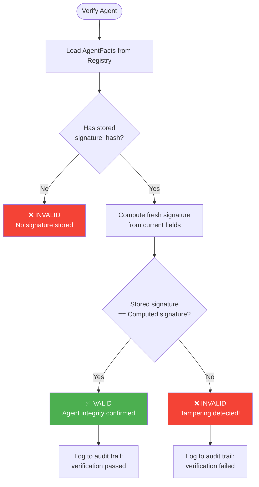

# Tutorial 3: AgentFacts for Governance

**Duration:** ~25 minutes  
**Level:** Intermediate  
**Prerequisites:** [Tutorial 1: Explainability Fundamentals](01_explainability_fundamentals.md)

---

## Introduction

When you deploy a single AI agent, tracking "who did what" is straightforward. But as organizations scale to dozens or hundreds of agents—each with different capabilities, owners, and compliance requirements—a fundamental question emerges: **How do you govern agents you didn't build, verify agents you didn't deploy, and audit agents you don't fully control?**

The **AgentFacts Registry** answers this challenge by providing a cryptographically verifiable metadata standard for AI agents. Based on research from arXiv:2506.13794, it establishes the **Identity Pillar** of our explainability framework, ensuring that every agent has a verifiable identity, declared capabilities, and enforceable policies.

This tutorial teaches you how to:
1. Understand why agent identity is critical for enterprise governance
2. Declare agent capabilities with input/output schemas and SLAs
3. Implement policies for rate limiting, approval workflows, and data access
4. Use SHA256 signatures to detect unauthorized modifications
5. Export audit trails for regulatory compliance

> 📓 **Hands-on Notebook Available**: This tutorial has an accompanying interactive notebook
> [02_agent_facts_verification.ipynb](../notebooks/02_agent_facts_verification.ipynb) where you can
> run the code examples yourself. Start with the tutorial concepts, then practice in the notebook.

---

## 1. Why Agent Identity Matters

In traditional software systems, identity is implicit—you know what code runs because you wrote it, deployed it, and control its execution environment. AI agents break this assumption in fundamental ways:

- **Agents are autonomous** — They make decisions without explicit programming for every case
- **Agents evolve** — Model updates, fine-tuning, and prompt changes alter behavior
- **Agents collaborate** — Multi-agent systems delegate to agents you may not control
- **Agents are black boxes** — Even their creators can't predict every output

Without a robust identity framework, organizations face critical governance gaps:

```
┌─────────────────────────────────────────────────────────────────────────────┐
│                    THE AGENT IDENTITY PROBLEM                                │
├─────────────────────────────────────────────────────────────────────────────┤
│                                                                              │
│   QUESTION                        WITHOUT IDENTITY     WITH AGENTFACTS       │
│   ────────                        ────────────────     ────────────────      │
│                                                                              │
│   "Which agent processed         "Some agent"          invoice-extractor-   │
│    invoice INV-5432?"                                  v2.1.0 by finance-   │
│                                                        team, verified ✓     │
│                                                                              │
│   "Did this agent have           "Probably?"           Yes: capability      │
│    permission to access                                'extract_vendor'     │
│    vendor data?"                                       declared with        │
│                                                        data_access policy   │
│                                                                              │
│   "Has this agent been           "I think it's         No: signature hash   │
│    modified since audit?"         the same version"    a3f2b1c4 matches     │
│                                                        registered hash ✓    │
│                                                                              │
│   "Who is responsible for        "The AI team?"        owner: finance-team  │
│    this agent's errors?"                               contact: admin@      │
│                                                        finance-team.com     │
│                                                                              │
│   "What did this agent           "We'd have to         $0.02/call ×         │
│    cost us this month?"           estimate..."         1,247 calls =        │
│                                                        $24.94 (tracked)     │
│                                                                              │
│   "Which GPT version             "4-something?"        metadata.model:      │
│    powers this agent?"                                 gpt-4-turbo-2024     │
│                                                        -04-09               │
│                                                                              │
└─────────────────────────────────────────────────────────────────────────────┘
```

### 1.1 Multi-Tenancy Isolation

In enterprise environments, multiple teams deploy agents that share infrastructure. Without proper identity isolation:

- **Finance team's invoice agent** might accidentally process HR documents
- **Marketing's content agent** could access customer PII it shouldn't see
- **One team's buggy agent** could affect another team's SLAs

**AgentFacts Solution:**

```python
from backend.explainability.agent_facts import (
    AgentFacts, AgentFactsRegistry, Capability, Policy
)
from pathlib import Path

# Each team registers their agents with clear ownership
registry = AgentFactsRegistry(storage_path=Path("cache/agent_facts"))

# Finance team's agent
finance_agent = AgentFacts(
    agent_id="invoice-extractor-v2",
    agent_name="Invoice Data Extractor",
    owner="finance-team",  # Clear ownership
    version="2.1.0",
    description="Extracts structured data from vendor invoices",
    metadata={
        "team_email": "finance-ai@company.com",
        "cost_center": "CC-FIN-001",
        "data_classification": "confidential"
    }
)

# HR team's agent (completely isolated)
hr_agent = AgentFacts(
    agent_id="resume-screener-v1",
    agent_name="Resume Screening Agent",
    owner="hr-team",  # Different owner
    version="1.0.0",
    description="Screens resumes for job requirements",
    metadata={
        "team_email": "hr-ai@company.com",
        "cost_center": "CC-HR-001",
        "data_classification": "highly-confidential"
    }
)

# Register both agents
registry.register(finance_agent, registered_by="finance-admin@company.com")
registry.register(hr_agent, registered_by="hr-admin@company.com")

# Find all agents owned by a specific team
finance_agents = registry.find_by_owner("finance-team")
print(f"Finance team owns {len(finance_agents)} agent(s)")
# Output: Finance team owns 1 agent(s)
```

**Isolation Enforcement Patterns:**

| Pattern | Implementation | Benefit |
|---------|---------------|---------|
| **Owner-based filtering** | `registry.find_by_owner(team)` | Only see your team's agents |
| **Capability-based access** | Check capabilities before delegation | Prevent unauthorized operations |
| **Policy enforcement** | `data_access` policies per agent | Restrict data access by agent |
| **Audit by owner** | `export_for_audit()` filtered by team | Team-specific compliance reports |

### 1.2 Compliance Attribution

Regulatory frameworks like **HIPAA**, **SOX**, **GDPR**, and industry standards require clear accountability for automated decisions. When an AI agent processes patient data, approves financial transactions, or makes decisions affecting individuals, auditors need answers:

- **Who** (which agent) made the decision?
- **What version** was deployed at the time?
- **What rules** governed its behavior?
- **Can we prove** it hasn't been tampered with?

**AgentFacts Solution:**

```python
# Healthcare agent with HIPAA compliance metadata
hipaa_agent = AgentFacts(
    agent_id="diagnosis-assistant-v1",
    agent_name="Medical Diagnosis Assistant",
    owner="healthcare-ai-team",
    version="1.4.9",
    description="Assists physicians with differential diagnosis",
    metadata={
        "compliance_frameworks": ["HIPAA", "HITECH"],
        "data_retention_days": 2555,  # 7 years per HIPAA
        "audit_frequency": "continuous",
        "last_security_review": "2024-10-15",
        "fda_classification": "Class II Medical Device Software"
    }
)

# When auditors ask "which agent processed patient #12345?"
# The answer is precise and verifiable:
agent = registry.get("diagnosis-assistant-v1")
print(f"Agent: {agent.agent_name}")
print(f"Version: {agent.version}")
print(f"Owner: {agent.owner}")
print(f"Compliance: {agent.metadata['compliance_frameworks']}")
print(f"Signature Valid: {registry.verify('diagnosis-assistant-v1')}")
```

**Compliance Evidence Chain:**

```
┌─────────────────────────────────────────────────────────────────────────────┐
│                    COMPLIANCE EVIDENCE CHAIN                                 │
├─────────────────────────────────────────────────────────────────────────────┤
│                                                                              │
│   AUDITOR QUESTION              AGENTFACTS EVIDENCE                          │
│   ────────────────              ────────────────────                         │
│                                                                              │
│   "Prove this agent             → AgentFacts.signature_hash                  │
│    hasn't been modified"          SHA256: a3f2b1c4d5e6f7...                  │
│                                   verify() returns True ✓                   │
│                                                                              │
│   "Show me all changes          → registry.audit_trail(agent_id)             │
│    to this agent"                 [register, update, verify, ...]            │
│                                   with timestamps and changed_by             │
│                                                                              │
│   "Export agent config          → registry.export_for_audit(                 │
│    for our records"                 [agent_ids], filepath)                   │
│                                   JSON with facts + audit trail              │
│                                                                              │
│   "What policies govern         → agent.policies filtered by                 │
│    this agent today?"              is_effective(datetime.now())              │
│                                   Only currently active policies             │
│                                                                              │
└─────────────────────────────────────────────────────────────────────────────┘
```

### 1.3 Cost Tracking and Attribution

AI agents consume resources—LLM API calls, compute time, external service fees. Without per-agent cost tracking, organizations struggle with:

- **Budget allocation** — Which teams consume the most?
- **Optimization** — Which agents are inefficient?
- **Chargeback** — How do we bill internal teams?
- **ROI calculation** — Is this agent worth its cost?

**AgentFacts Solution:**

```python
# Agent with cost tracking in capabilities
cost_tracked_agent = AgentFacts(
    agent_id="fraud-detector-v2",
    agent_name="Transaction Fraud Detector",
    owner="security-team",
    version="1.4.6",
    capabilities=[
        Capability(
            name="score_transaction",
            description="Calculates fraud risk score for a transaction",
            estimated_latency_ms=350,
            cost_per_call=0.01,  # $0.01 per transaction scored
            tags=["fraud", "ml", "real-time"]
        ),
        Capability(
            name="explain_score",
            description="Provides explanation for fraud score decision",
            estimated_latency_ms=500,
            cost_per_call=0.015,  # $0.015 per explanation
            tags=["explainability", "fraud"]
        )
    ],
    metadata={
        "cost_center": "CC-SEC-001",
        "monthly_budget": 5000,
        "billing_contact": "security-finance@company.com"
    }
)

# Calculate monthly cost from usage logs
def calculate_monthly_cost(agent_id: str, usage_log: list) -> dict:
    """Calculate cost attribution for an agent."""
    agent = registry.get(agent_id)
    if not agent:
        return {"error": "Agent not found"}
    
    # Build cost lookup from capabilities
    cost_lookup = {
        cap.name: cap.cost_per_call or 0 
        for cap in agent.capabilities
    }
    
    # Calculate from usage
    total_cost = 0
    breakdown = {}
    for entry in usage_log:
        cap_name = entry["capability"]
        count = entry["count"]
        cap_cost = cost_lookup.get(cap_name, 0)
        cost = count * cap_cost
        total_cost += cost
        breakdown[cap_name] = {"calls": count, "cost": cost}
    
    return {
        "agent_id": agent_id,
        "owner": agent.owner,
        "cost_center": agent.metadata.get("cost_center"),
        "total_cost": total_cost,
        "breakdown": breakdown
    }

# Example usage
usage = [
    {"capability": "score_transaction", "count": 50000},
    {"capability": "explain_score", "count": 2500}
]
cost_report = calculate_monthly_cost("fraud-detector-v2", usage)
print(f"Agent: {cost_report['agent_id']}")
print(f"Owner: {cost_report['owner']}")
print(f"Total Cost: ${cost_report['total_cost']:.2f}")
# Output: Total Cost: $537.50
```

### 1.4 Model Lineage

As LLM technology evolves rapidly, agents may use different underlying models over time. Model lineage tracking answers critical questions:

- **Which GPT version** was used when this decision was made?
- **Has the underlying model** changed since last audit?
- **Can we reproduce** results with the same model version?

**AgentFacts Solution:**

```python
# Agent with detailed model lineage
lineage_tracked_agent = AgentFacts(
    agent_id="contract-reviewer-v1",
    agent_name="Legal Contract Analyzer",
    owner="legal-tech-team",
    version="2.1.7",
    description="Reviews contracts for risk and compliance",
    metadata={
        # Model lineage
        "model_provider": "openai",
        "model_name": "gpt-4-turbo",
        "model_version": "gpt-4-turbo-2024-04-09",
        "model_snapshot_date": "2024-04-09",
        
        # Training lineage
        "fine_tuned": False,
        "prompt_version": "v3.2.1",
        "prompt_last_updated": "2024-10-20",
        
        # Embedding model for RAG
        "embedding_model": "text-embedding-3-large",
        "embedding_dimensions": 3072,
        
        # Performance baseline
        "baseline_accuracy": 0.94,
        "baseline_date": "2024-09-15"
    }
)

# When debugging a decision from 6 months ago:
# "What model version was this agent using?"
agent = registry.get("contract-reviewer-v1")
audit_trail = registry.audit_trail("contract-reviewer-v1")

# Find the version at a specific time
from datetime import datetime, UTC
query_time = datetime(2024, 9, 1, tzinfo=UTC)

# Get agent state at that time from audit trail
relevant_entry = None
for entry in audit_trail:
    if entry.timestamp <= query_time:
        relevant_entry = entry
    else:
        break

if relevant_entry:
    print(f"Agent state at {query_time}: {relevant_entry.action}")
```

### Summary: The Four Pillars of Agent Identity

| Pillar | Challenge | AgentFacts Solution |
|--------|-----------|---------------------|
| **Multi-Tenancy** | Which team owns this agent? | `owner` field + `find_by_owner()` |
| **Compliance** | Can we prove agent integrity? | SHA256 `signature_hash` + `verify()` |
| **Cost Attribution** | What does this agent cost? | `cost_per_call` in capabilities |
| **Model Lineage** | Which model version? | `metadata` with model details |

---

## 2. Capability Declarations

A **Capability** defines what an agent can do, with machine-readable specifications that enable both governance and discovery. Unlike informal documentation, capabilities are structured data that the system can validate and enforce.

### 2.1 The Capability Model

Every capability includes:

```python
from backend.explainability.agent_facts import Capability

capability = Capability(
    # Identity
    name="extract_vendor",
    description="Extracts vendor name and details from invoice documents",
    
    # Contract (what goes in, what comes out)
    input_schema={
        "type": "object",
        "properties": {
            "document_text": {"type": "string"},
            "document_type": {"type": "string", "enum": ["invoice", "receipt", "po"]}
        },
        "required": ["document_text"]
    },
    output_schema={
        "type": "object",
        "properties": {
            "vendor_name": {"type": "string"},
            "vendor_id": {"type": "string"},
            "confidence": {"type": "number", "minimum": 0, "maximum": 1}
        },
        "required": ["vendor_name", "confidence"]
    },
    
    # Performance SLAs
    estimated_latency_ms=500,  # Expected response time
    cost_per_call=0.005,       # Cost per invocation
    
    # Governance
    requires_approval=False,   # Does this need human approval?
    
    # Discovery
    tags=["extraction", "ocr", "vendor", "invoice"]
)
```

### 2.2 Input/Output Schemas

Schemas serve multiple purposes:

1. **Validation** — Ensure inputs/outputs match expectations
2. **Documentation** — Self-documenting API contracts
3. **Discovery** — Find agents that accept/produce specific data types
4. **Integration** — Enable automated agent-to-agent handoffs

**Example: Complex Schema for Fraud Detection**

```python
fraud_scoring_capability = Capability(
    name="score_transaction",
    description="Calculates fraud risk score for a financial transaction",
    
    input_schema={
        "type": "object",
        "properties": {
            "transaction_id": {"type": "string"},
            "amount": {"type": "number", "minimum": 0},
            "merchant": {"type": "string"},
            "timestamp": {"type": "string", "format": "date-time"},
            "user_id": {"type": "string"},
            "location": {
                "type": "object",
                "properties": {
                    "country": {"type": "string"},
                    "city": {"type": "string"}
                }
            },
            "device_fingerprint": {"type": "string"}
        },
        "required": ["transaction_id", "amount"]
    },
    
    output_schema={
        "type": "object",
        "properties": {
            "fraud_score": {
                "type": "number",
                "minimum": 0,
                "maximum": 1,
                "description": "Probability of fraud (0=legitimate, 1=fraudulent)"
            },
            "risk_level": {
                "type": "string",
                "enum": ["low", "medium", "high"],
                "description": "Categorical risk assessment"
            },
            "flags": {
                "type": "array",
                "items": {"type": "string"},
                "description": "List of triggered fraud indicators"
            },
            "explanation": {
                "type": "string",
                "description": "Human-readable explanation of the score"
            }
        },
        "required": ["fraud_score", "risk_level"]
    },
    
    estimated_latency_ms=350,
    cost_per_call=0.01,
    requires_approval=False,
    tags=["fraud", "ml", "real-time", "security"]
)
```

### 2.3 Performance SLAs

Capabilities include performance expectations that enable:

- **SLA monitoring** — Alert when latency exceeds estimates
- **Capacity planning** — Calculate throughput based on latency
- **Cost forecasting** — Estimate costs before deployment

```python
# Performance-focused capabilities
capabilities = [
    Capability(
        name="quick_classification",
        description="Fast document type classification",
        estimated_latency_ms=50,  # Very fast
        cost_per_call=0.001,      # Very cheap
        tags=["classification", "fast"]
    ),
    Capability(
        name="deep_analysis",
        description="Comprehensive document analysis with multiple passes",
        estimated_latency_ms=5000,  # Slow but thorough
        cost_per_call=0.10,         # More expensive
        tags=["analysis", "comprehensive"]
    )
]

# Compare capabilities by performance
def compare_capabilities(caps: list[Capability]) -> None:
    print("Capability Performance Comparison")
    print("=" * 60)
    for cap in sorted(caps, key=lambda c: c.estimated_latency_ms):
        print(f"{cap.name}:")
        print(f"  Latency: {cap.estimated_latency_ms}ms")
        print(f"  Cost: ${cap.cost_per_call}")
        print(f"  Throughput: {1000 / cap.estimated_latency_ms:.1f} calls/sec (theoretical)")

compare_capabilities(capabilities)
```

### 2.4 Approval Requirements

For high-risk operations, capabilities can require human approval:

```python
# High-risk capability requiring approval
high_risk_capability = Capability(
    name="analyze_symptoms",
    description="Analyzes patient symptoms for potential conditions",
    input_schema={
        "type": "object",
        "properties": {
            "symptoms": {"type": "array", "items": {"type": "string"}},
            "patient_history": {"type": "object"},
            "vital_signs": {"type": "object"}
        },
        "required": ["symptoms"]
    },
    output_schema={
        "type": "object",
        "properties": {
            "potential_conditions": {"type": "array"},
            "confidence_scores": {"type": "object"},
            "recommended_tests": {"type": "array"},
            "urgency_level": {"type": "string", "enum": ["routine", "urgent", "emergency"]}
        }
    },
    estimated_latency_ms=2000,
    cost_per_call=0.05,
    requires_approval=True,  # ⚠️ Requires physician review
    tags=["healthcare", "diagnosis", "high-risk"]
)

# Enforcement pattern
def execute_capability(agent_id: str, capability_name: str, input_data: dict) -> dict:
    """Execute a capability with approval checks."""
    agent = registry.get(agent_id)
    capability = agent.get_capability(capability_name)
    
    if capability.requires_approval:
        approval = get_human_approval(
            agent_id=agent_id,
            capability=capability_name,
            input_summary=summarize(input_data)
        )
        if not approval.granted:
            raise ApprovalRequiredError(
                f"Capability '{capability_name}' requires approval. "
                f"Request ID: {approval.request_id}"
            )
    
    # Execute the capability
    return agent.execute(capability_name, input_data)
```

### 2.5 Capability Discovery

The registry enables finding agents by their capabilities:

```python
# Find all agents that can extract vendor information
vendor_extractors = registry.find_by_capability("extract_vendor")
print(f"Found {len(vendor_extractors)} agents with vendor extraction capability:")

for agent in vendor_extractors:
    cap = agent.get_capability("extract_vendor")
    print(f"\n  {agent.agent_name} ({agent.agent_id})")
    print(f"    Owner: {agent.owner}")
    print(f"    Version: {agent.version}")
    print(f"    Latency: {cap.estimated_latency_ms}ms")
    print(f"    Cost: ${cap.cost_per_call}")
    print(f"    Requires Approval: {cap.requires_approval}")

# Find agents by tag
def find_by_tag(registry: AgentFactsRegistry, tag: str) -> list:
    """Find agents with capabilities tagged with a specific tag."""
    matching = []
    for agent_id in registry.list_all():
        agent = registry.get(agent_id)
        for cap in agent.capabilities:
            if tag in cap.tags:
                matching.append((agent, cap))
                break
    return matching

# Find all ML-based agents
ml_agents = find_by_tag(registry, "ml")
print(f"\nFound {len(ml_agents)} ML-based agents")
```

---

## 3. Policy Management

**Policies** define operational constraints that govern agent behavior. Unlike capabilities (what an agent *can* do), policies define what an agent *may* or *must* do under specific conditions.

### 3.1 The Policy Model

```python
from backend.explainability.agent_facts import Policy
from datetime import datetime, timedelta, UTC

policy = Policy(
    policy_id="rate-limit-001",
    name="API Rate Limit",
    description="Limits API calls to prevent abuse and control costs",
    policy_type="rate_limit",  # Type categorization
    
    # Policy-specific constraints
    constraints={
        "max_calls_per_minute": 60,
        "max_calls_per_hour": 1000,
        "burst_limit": 10
    },
    
    # Temporal bounds
    effective_from=datetime.now(UTC),
    effective_until=None,  # No expiration
    
    # Active status
    is_active=True
)
```

### 3.2 Policy Types

The framework supports multiple policy types, each with specific constraint schemas:

#### Rate Limit Policies

Control API call frequency to prevent abuse and manage costs:

```python
rate_limit_policy = Policy(
    policy_id="invoice-extractor-rate-limit",
    name="Invoice Processing Rate Limit",
    description="Prevents runaway processing and controls LLM costs",
    policy_type="rate_limit",
    constraints={
        "max_calls_per_minute": 100,
        "max_calls_per_hour": 2000,
        "max_calls_per_day": 10000,
        "burst_limit": 20,  # Max concurrent calls
        "cooldown_seconds": 5  # Wait time after burst
    }
)

# Enforcement example
class RateLimiter:
    def check_rate_limit(self, agent_id: str) -> bool:
        """Check if agent is within rate limits."""
        agent = registry.get(agent_id)
        rate_policies = [
            p for p in agent.get_active_policies()
            if p.policy_type == "rate_limit"
        ]
        
        for policy in rate_policies:
            constraints = policy.constraints
            current_minute_calls = self.get_calls_in_window(agent_id, minutes=1)
            
            if current_minute_calls >= constraints.get("max_calls_per_minute", float("inf")):
                return False
        
        return True
```

#### Data Access Policies

Control what data an agent can access:

```python
data_access_policy = Policy(
    policy_id="hipaa-data-access",
    name="HIPAA Data Access Controls",
    description="Restricts access to PHI per HIPAA requirements",
    policy_type="data_access",
    constraints={
        "allowed_data_sources": ["patient_records_anonymized", "lab_results_summary"],
        "restricted_fields": ["ssn", "full_name", "date_of_birth", "address"],
        "pii_handling_mode": "redact",  # Options: redact, hash, block
        "requires_encryption": True,
        "audit_all_access": True,
        "data_retention_days": 2555  # 7 years per HIPAA
    }
)

# Enforcement example
def filter_data_access(agent_id: str, requested_data: dict) -> dict:
    """Filter data access based on agent policies."""
    agent = registry.get(agent_id)
    access_policies = [
        p for p in agent.get_active_policies()
        if p.policy_type == "data_access"
    ]
    
    filtered = requested_data.copy()
    
    for policy in access_policies:
        restricted = policy.constraints.get("restricted_fields", [])
        pii_mode = policy.constraints.get("pii_handling_mode", "block")
        
        for field in restricted:
            if field in filtered:
                if pii_mode == "redact":
                    filtered[field] = "[REDACTED]"
                elif pii_mode == "hash":
                    filtered[field] = hash_value(filtered[field])
                else:  # block
                    del filtered[field]
    
    return filtered
```

#### Approval Required Policies

Define when human approval is needed:

```python
approval_policy = Policy(
    policy_id="high-value-approval",
    name="High-Value Transaction Approval",
    description="Requires human approval for transactions above threshold",
    policy_type="approval_required",
    constraints={
        "threshold_amount": 10000,
        "auto_approve_below": 1000,
        "approval_role": "finance_manager",
        "escalation_timeout_minutes": 60,
        "auto_escalate": True,
        "max_pending_hours": 24
    }
)

# Enforcement example
def process_with_approval_check(
    agent_id: str, 
    transaction: dict, 
    approver_service
) -> dict:
    """Process transaction with approval check if required."""
    agent = registry.get(agent_id)
    approval_policies = [
        p for p in agent.get_active_policies()
        if p.policy_type == "approval_required"
    ]
    
    amount = transaction.get("amount", 0)
    
    for policy in approval_policies:
        constraints = policy.constraints
        auto_approve = constraints.get("auto_approve_below", 0)
        threshold = constraints.get("threshold_amount", float("inf"))
        
        if amount < auto_approve:
            return {"status": "auto_approved", "amount": amount}
        
        if amount >= threshold:
            approval = approver_service.request_approval(
                transaction=transaction,
                required_role=constraints.get("approval_role"),
                timeout_minutes=constraints.get("escalation_timeout_minutes")
            )
            
            if not approval.granted:
                return {"status": "pending_approval", "approval_id": approval.id}
    
    return {"status": "approved", "amount": amount}
```

### 3.3 Time-Based Policies

Policies can have temporal bounds for scenarios like:
- **Maintenance windows** — Disable agent during updates
- **Business hours** — Different limits for peak vs. off-peak
- **Temporary overrides** — Short-term policy changes

```python
from datetime import datetime, timedelta, UTC

# Policy effective only during business hours
business_hours_policy = Policy(
    policy_id="business-hours-limits",
    name="Business Hours Rate Limits",
    description="Higher rate limits during business hours",
    policy_type="rate_limit",
    constraints={
        "max_calls_per_minute": 200,  # Higher during business hours
        "max_calls_per_hour": 5000
    },
    effective_from=datetime(2024, 1, 1, 9, 0, tzinfo=UTC),   # 9 AM
    effective_until=datetime(2024, 12, 31, 17, 0, tzinfo=UTC), # 5 PM
    is_active=True
)

# Temporary override policy (expires in 7 days)
temporary_override = Policy(
    policy_id="q4-surge-capacity",
    name="Q4 Surge Capacity Override",
    description="Temporarily increased limits for Q4 processing surge",
    policy_type="rate_limit",
    constraints={
        "max_calls_per_minute": 500,
        "max_calls_per_hour": 20000
    },
    effective_from=datetime.now(UTC),
    effective_until=datetime.now(UTC) + timedelta(days=7),  # Expires in 7 days
    is_active=True
)

# Check policy effectiveness
print(f"Business hours policy active: {business_hours_policy.is_effective()}")
print(f"Override policy active: {temporary_override.is_effective()}")

# Check at specific time
future_time = datetime.now(UTC) + timedelta(days=10)
print(f"Override active in 10 days: {temporary_override.is_effective(future_time)}")
# Output: Override active in 10 days: False (expired)
```

### 3.4 Policy Precedence and Conflicts

When multiple policies apply, you need rules for resolving conflicts:

```python
def get_effective_constraints(agent_id: str, policy_type: str) -> dict:
    """Get merged constraints from all active policies of a type.
    
    Precedence rules:
    1. More specific policies override general policies
    2. Lower limits take precedence (conservative approach)
    3. Most recently activated policy wins for conflicts
    """
    agent = registry.get(agent_id)
    applicable = [
        p for p in agent.get_active_policies()
        if p.policy_type == policy_type
    ]
    
    # Sort by effective_from (most recent first for conflict resolution)
    applicable.sort(key=lambda p: p.effective_from, reverse=True)
    
    merged = {}
    for policy in applicable:
        for key, value in policy.constraints.items():
            if key not in merged:
                merged[key] = value
            elif isinstance(value, (int, float)):
                # For numeric limits, use the lower (more restrictive) value
                merged[key] = min(merged[key], value)
            elif isinstance(value, list):
                # For lists (like allowed_fields), intersect
                merged[key] = list(set(merged[key]) & set(value))
            # For other types, first (most recent) wins
    
    return merged
```

---

## 4. Signature Verification

The cornerstone of AgentFacts trust is **cryptographic signature verification**. Every registered agent has a SHA256 signature computed from its essential fields. If any field changes without going through the registry's update process, the signature won't match—immediately detecting tampering.

### 4.1 How Signature Computation Works

```python
import hashlib
import json

def compute_signature(agent_facts: AgentFacts) -> str:
    """Compute SHA256 hash of essential agent fields.
    
    This function mirrors AgentFacts.compute_signature() to explain the process.
    """
    # Fields included in signature (everything except signature_hash itself)
    hash_data = {
        "agent_id": agent_facts.agent_id,
        "agent_name": agent_facts.agent_name,
        "owner": agent_facts.owner,
        "version": agent_facts.version,
        "description": agent_facts.description,
        "capabilities": [
            cap.model_dump(mode="json") 
            for cap in agent_facts.capabilities
        ],
        "policies": [
            pol.model_dump(mode="json") 
            for pol in agent_facts.policies
        ],
        "created_at": agent_facts.created_at.isoformat(),
        "updated_at": agent_facts.updated_at.isoformat(),
        "parent_agent_id": agent_facts.parent_agent_id,
        "metadata": agent_facts.metadata,
    }
    
    # Serialize deterministically (sorted keys ensure consistent ordering)
    serialized = json.dumps(hash_data, sort_keys=True, default=str)
    
    # Compute SHA256 hash
    return hashlib.sha256(serialized.encode()).hexdigest()

# Example
agent = AgentFacts(
    agent_id="test-agent",
    agent_name="Test Agent",
    owner="test-team",
    version="1.0.0"
)

signature = compute_signature(agent)
print(f"Signature: {signature}")
# Output: Signature: 7a3f2b1c4d5e6f... (64 hex characters = 256 bits)
```

### 4.2 Signature Verification Flow



### 4.3 Tamper Detection in Action

```python
# Register an agent (signature is automatically computed)
registry = AgentFactsRegistry(storage_path=Path("cache/agent_facts"))

original_agent = AgentFacts(
    agent_id="secure-agent-v1",
    agent_name="Secure Processing Agent",
    owner="security-team",
    version="1.0.0",
    capabilities=[
        Capability(
            name="process_data",
            description="Processes sensitive data",
            requires_approval=True  # Requires human approval
        )
    ]
)

registry.register(original_agent, registered_by="security-admin@company.com")

# Verify - should pass
print(f"Initial verification: {registry.verify('secure-agent-v1')}")
# Output: Initial verification: True

# Simulate tampering: Someone modifies the agent file directly
# (bypassing the registry's update() method)
import json

agent_file = Path("cache/agent_facts/agent_facts_registry/secure-agent-v1.json")
with open(agent_file) as f:
    tampered_data = json.load(f)

# Attacker tries to remove the approval requirement
tampered_data["capabilities"][0]["requires_approval"] = False

with open(agent_file, "w") as f:
    json.dump(tampered_data, f)

# Reload and verify - TAMPERING DETECTED!
registry2 = AgentFactsRegistry(storage_path=Path("cache/agent_facts"))
verification = registry2.verify("secure-agent-v1")

print(f"After tampering: {verification}")
# Output: After tampering: False

# The stored signature no longer matches the computed signature
agent = registry2.get("secure-agent-v1")
print(f"Stored signature:   {agent.signature_hash[:40]}...")
print(f"Computed signature: {agent.compute_signature()[:40]}...")
# These will be DIFFERENT, proving tampering occurred
```

### 4.4 Security Considerations

| Threat | Mitigation | Implementation |
|--------|------------|----------------|
| **Direct file modification** | Signature verification | `verify()` detects any field change |
| **Signature forgery** | SHA256 collision resistance | Computationally infeasible to forge |
| **Replay attacks** | Timestamps in signature | `created_at`, `updated_at` included |
| **Audit log tampering** | Separate audit trail | Audit entries are append-only |
| **Registry bypass** | Verification at execution | Check `verify()` before agent execution |

**Best Practice: Verify Before Execute**

```python
def execute_agent_safely(agent_id: str, input_data: dict) -> dict:
    """Execute an agent only after verifying its integrity."""
    
    # ALWAYS verify before execution
    if not registry.verify(agent_id):
        raise SecurityError(
            f"Agent '{agent_id}' failed integrity verification. "
            "Possible tampering detected. Execution blocked."
        )
    
    agent = registry.get(agent_id)
    
    # Additional checks
    if not agent.get_active_policies():
        raise PolicyError(
            f"Agent '{agent_id}' has no active policies. "
            "Execution requires at least one governing policy."
        )
    
    # Safe to execute
    return agent.execute(input_data)
```

---

## 5. Audit Trail Export for Compliance

The AgentFacts Registry maintains a complete audit trail of all changes to agent metadata. This trail is essential for regulatory compliance, providing timestamped evidence of:

- When agents were registered, updated, or removed
- Who made each change
- What specific fields changed
- Signature hashes before and after each change

### 5.1 Audit Trail Structure

Every operation on the registry creates an `AuditEntry`:

```python
from backend.explainability.agent_facts import AuditEntry

# Example audit entries for an agent's lifecycle
audit_examples = [
    AuditEntry(
        timestamp=datetime(2024, 1, 15, 10, 30, tzinfo=UTC),
        action="register",
        changed_by="admin@healthcare-team.com",
        changes={"action": "initial_registration"},
        previous_signature=None,
        new_signature="a3f2b1c4d5e6f7a8b9c0d1e2f3a4b5c6..."
    ),
    AuditEntry(
        timestamp=datetime(2024, 6, 20, 14, 15, tzinfo=UTC),
        action="update",
        changed_by="developer@healthcare-team.com",
        changes={
            "version": "1.1.0",
            "capabilities": "added 'interpret_labs' capability"
        },
        previous_signature="a3f2b1c4d5e6f7a8b9c0d1e2f3a4b5c6...",
        new_signature="b4a3c2d1e0f9a8b7c6d5e4f3a2b1c0d9..."
    ),
    AuditEntry(
        timestamp=datetime(2024, 11, 1, 9, 0, tzinfo=UTC),
        action="verify",
        changed_by="system",
        changes={"result": "valid"},
        previous_signature=None,
        new_signature=None
    )
]
```

### 5.2 Export for Compliance Audits

The registry provides a comprehensive export function designed for compliance audits:

```python
from pathlib import Path

# Export specific agents for audit
agent_ids = ["diagnosis-assistant-v1", "prescription-validator-v1"]
export_path = Path("compliance_exports/hipaa_audit_2024_q4.json")

registry.export_for_audit(agent_ids, export_path)
```

**Export Format (HIPAA/SOX Compatible):**

```json
{
  "exported_at": "2024-11-27T16:00:00+00:00",
  "agent_count": 2,
  "agents": {
    "diagnosis-assistant-v1": {
      "facts": {
        "agent_id": "diagnosis-assistant-v1",
        "agent_name": "Medical Diagnosis Assistant",
        "owner": "healthcare-ai-team",
        "version": "1.4.9",
        "description": "Assists physicians with differential diagnosis",
        "capabilities": [...],
        "policies": [...],
        "created_at": "2024-01-15T10:30:00+00:00",
        "updated_at": "2024-06-20T14:15:00+00:00",
        "signature_hash": "b4a3c2d1e0f9a8b7c6d5e4f3a2b1c0d9...",
        "metadata": {
          "compliance_frameworks": ["HIPAA", "HITECH"],
          "model_version": "gpt-4-turbo-2024-04-09"
        }
      },
      "is_valid": true,
      "audit_trail": [
        {
          "timestamp": "2024-01-15T10:30:00+00:00",
          "action": "register",
          "changed_by": "admin@healthcare-team.com",
          "changes": {"action": "initial_registration"},
          "new_signature": "a3f2b1c4..."
        },
        {
          "timestamp": "2024-06-20T14:15:00+00:00",
          "action": "update",
          "changed_by": "developer@healthcare-team.com",
          "changes": {"version": "1.1.0"},
          "previous_signature": "a3f2b1c4...",
          "new_signature": "b4a3c2d1..."
        }
      ]
    }
  }
}
```

### 5.3 Compliance Report Generation

```python
def generate_compliance_report(
    registry: AgentFactsRegistry,
    framework: str,  # "HIPAA", "SOX", "GDPR"
    export_dir: Path
) -> dict:
    """Generate a compliance report for a specific regulatory framework."""
    
    # Find agents with this compliance framework
    all_agents = registry.list_all()
    compliant_agents = []
    
    for agent_id in all_agents:
        agent = registry.get(agent_id)
        frameworks = agent.metadata.get("compliance_frameworks", [])
        if framework in frameworks:
            compliant_agents.append(agent_id)
    
    # Export all compliant agents
    export_path = export_dir / f"{framework.lower()}_audit_{datetime.now().strftime('%Y%m%d')}.json"
    registry.export_for_audit(compliant_agents, export_path)
    
    # Generate summary
    summary = {
        "framework": framework,
        "generated_at": datetime.now(UTC).isoformat(),
        "total_agents": len(compliant_agents),
        "agents_verified": 0,
        "agents_failed_verification": 0,
        "export_path": str(export_path)
    }
    
    for agent_id in compliant_agents:
        if registry.verify(agent_id):
            summary["agents_verified"] += 1
        else:
            summary["agents_failed_verification"] += 1
    
    # Save summary
    summary_path = export_dir / f"{framework.lower()}_summary_{datetime.now().strftime('%Y%m%d')}.json"
    with open(summary_path, "w") as f:
        json.dump(summary, f, indent=2)
    
    return summary

# Generate HIPAA compliance report
report = generate_compliance_report(
    registry=registry,
    framework="HIPAA",
    export_dir=Path("compliance_exports/")
)

print(f"HIPAA Compliance Report")
print(f"=======================")
print(f"Total agents: {report['total_agents']}")
print(f"Verified: {report['agents_verified']}")
print(f"Failed: {report['agents_failed_verification']}")
```

### 5.4 HIPAA vs. SOX Export Considerations

| Aspect | HIPAA | SOX |
|--------|-------|-----|
| **Retention Period** | 6 years minimum | 7 years minimum |
| **Key Data** | PHI access controls, audit logs | Financial transaction trail, approval workflows |
| **Required Fields** | data_access policies, pii_handling | approval_required policies, threshold_amount |
| **Encryption** | Required for PHI | Required for financial data |
| **Access Logging** | Every PHI access | Every financial decision |

**HIPAA-Specific Export Fields:**

```python
hipaa_agent = AgentFacts(
    agent_id="hipaa-compliant-agent",
    agent_name="HIPAA-Compliant Processor",
    owner="healthcare-team",
    version="1.0.0",
    metadata={
        # HIPAA-specific metadata
        "compliance_frameworks": ["HIPAA", "HITECH"],
        "phi_categories_accessed": ["diagnoses", "lab_results"],
        "minimum_necessary_standard": True,
        "encryption_at_rest": True,
        "encryption_in_transit": True,
        "access_control_model": "RBAC",
        "audit_log_retention_days": 2190,  # 6 years
        "breach_notification_contact": "privacy@healthcare.com",
        "last_risk_assessment": "2024-10-01",
        "business_associate_agreement": "BAA-2024-001"
    },
    policies=[
        Policy(
            policy_id="hipaa-phi-access",
            name="PHI Access Controls",
            policy_type="data_access",
            constraints={
                "pii_handling_mode": "redact",
                "audit_all_access": True,
                "requires_encryption": True
            }
        )
    ]
)
```

**SOX-Specific Export Fields:**

```python
sox_agent = AgentFacts(
    agent_id="sox-compliant-agent",
    agent_name="Financial Processing Agent",
    owner="finance-team",
    version="2.0.0",
    metadata={
        # SOX-specific metadata
        "compliance_frameworks": ["SOX", "PCI-DSS"],
        "financial_statement_impact": True,
        "internal_control_category": "financial_reporting",
        "segregation_of_duties": True,
        "audit_trail_retention_years": 7,
        "change_management_process": "ITIL",
        "last_control_assessment": "2024-09-15",
        "external_auditor": "Big4 LLP"
    },
    policies=[
        Policy(
            policy_id="sox-approval-workflow",
            name="Financial Approval Requirements",
            policy_type="approval_required",
            constraints={
                "threshold_amount": 10000,
                "approval_role": "finance_controller",
                "dual_approval_above": 50000
            }
        )
    ]
)
```

---

## 6. Case Study: Healthcare Agent Governance with HIPAA Compliance

This case study demonstrates implementing a complete healthcare agent governance system that meets HIPAA requirements.

### The Scenario

**HealthTech Medical Center** deploys AI agents to assist physicians with:
1. **Symptom Analysis** — Suggests differential diagnoses based on symptoms
2. **Lab Interpretation** — Interprets laboratory results in clinical context
3. **Treatment Suggestions** — Recommends treatment options

HIPAA compliance requires:
- Audit trails for all PHI access
- Access controls based on "minimum necessary" standard
- Encryption of PHI
- Tamper detection for agent configurations
- Physician approval for all diagnostic suggestions

### Implementation

```python
from backend.explainability.agent_facts import (
    AgentFacts, AgentFactsRegistry, Capability, Policy
)
from pathlib import Path
from datetime import datetime, UTC

# Initialize registry
registry = AgentFactsRegistry(storage_path=Path("cache/healthcare_registry"))

# Create HIPAA-compliant diagnosis assistant
diagnosis_agent = AgentFacts(
    agent_id="diagnosis-assistant-v2",
    agent_name="Medical Diagnosis Assistant",
    owner="healthcare-ai-team",
    version="2.0.0",
    description="AI assistant for differential diagnosis, requires physician approval for all suggestions",
    
    capabilities=[
        Capability(
            name="analyze_symptoms",
            description="Analyzes patient symptoms for potential conditions",
            input_schema={
                "type": "object",
                "properties": {
                    "symptoms": {"type": "array", "items": {"type": "string"}},
                    "duration_days": {"type": "integer"},
                    "severity": {"type": "string", "enum": ["mild", "moderate", "severe"]},
                    "patient_age_range": {"type": "string"},  # No exact DOB per minimum necessary
                    "relevant_history": {"type": "array", "items": {"type": "string"}}
                },
                "required": ["symptoms"]
            },
            output_schema={
                "type": "object",
                "properties": {
                    "differential_diagnoses": {
                        "type": "array",
                        "items": {
                            "type": "object",
                            "properties": {
                                "condition": {"type": "string"},
                                "probability": {"type": "number"},
                                "supporting_evidence": {"type": "array"}
                            }
                        }
                    },
                    "recommended_tests": {"type": "array"},
                    "urgency": {"type": "string", "enum": ["routine", "urgent", "emergency"]},
                    "confidence": {"type": "number", "minimum": 0, "maximum": 1}
                }
            },
            estimated_latency_ms=2000,
            cost_per_call=0.05,
            requires_approval=True,  # All diagnoses require physician review
            tags=["healthcare", "diagnosis", "hipaa", "phi"]
        ),
        Capability(
            name="interpret_labs",
            description="Interprets laboratory results in clinical context",
            input_schema={
                "type": "object",
                "properties": {
                    "lab_results": {"type": "object"},
                    "test_type": {"type": "string"},
                    "reference_ranges": {"type": "object"}
                },
                "required": ["lab_results", "test_type"]
            },
            output_schema={
                "type": "object",
                "properties": {
                    "interpretation": {"type": "string"},
                    "abnormal_values": {"type": "array"},
                    "clinical_significance": {"type": "string"},
                    "follow_up_recommendations": {"type": "array"}
                }
            },
            estimated_latency_ms=1500,
            cost_per_call=0.03,
            requires_approval=True,
            tags=["healthcare", "labs", "hipaa"]
        )
    ],
    
    policies=[
        Policy(
            policy_id="hipaa-phi-protection",
            name="HIPAA PHI Protection Policy",
            description="Ensures HIPAA-compliant handling of Protected Health Information",
            policy_type="data_access",
            constraints={
                "allowed_data_sources": ["ehr_anonymized", "lab_results", "imaging_reports"],
                "restricted_fields": ["patient_name", "ssn", "address", "phone", "email", "mrn"],
                "pii_handling_mode": "redact",
                "requires_encryption": True,
                "audit_all_access": True,
                "minimum_necessary_standard": True,
                "data_retention_days": 2190  # 6 years per HIPAA
            }
        ),
        Policy(
            policy_id="physician-approval-required",
            name="Physician Approval Requirement",
            description="All diagnostic suggestions require physician review and approval",
            policy_type="approval_required",
            constraints={
                "approval_role": "physician",
                "approval_required_for": ["differential_diagnoses", "treatment_recommendations"],
                "max_pending_hours": 24,
                "auto_escalate": True,
                "escalation_contact": "chief_medical_officer"
            }
        ),
        Policy(
            policy_id="healthcare-rate-limit",
            name="Healthcare Processing Rate Limit",
            description="Rate limits to ensure quality and prevent system overload",
            policy_type="rate_limit",
            constraints={
                "max_calls_per_minute": 30,  # Lower limit for careful processing
                "max_calls_per_hour": 500,
                "burst_limit": 5
            }
        )
    ],
    
    metadata={
        # Compliance metadata
        "compliance_frameworks": ["HIPAA", "HITECH", "FDA_SaMD"],
        "fda_classification": "Class II Medical Device Software",
        "hipaa_safeguards": ["administrative", "physical", "technical"],
        
        # Model lineage
        "model_provider": "openai",
        "model_name": "gpt-4-turbo",
        "model_version": "gpt-4-turbo-2024-04-09",
        "fine_tuned": False,
        "training_data_description": "Medical literature, clinical guidelines (no PHI)",
        
        # Operational metadata
        "deployment_environment": "production",
        "last_security_review": "2024-10-01",
        "last_bias_assessment": "2024-09-15",
        "incident_response_contact": "security@healthtech-medical.com",
        
        # Performance baseline
        "baseline_accuracy": 0.89,
        "baseline_sensitivity": 0.92,
        "baseline_specificity": 0.87,
        "validation_dataset": "MIMIC-IV subset (de-identified)"
    }
)

# Register the agent
registry.register(diagnosis_agent, registered_by="cmo@healthtech-medical.com")
print(f"✓ Registered: {diagnosis_agent.agent_name}")
print(f"  Signature: {diagnosis_agent.signature_hash[:32]}...")
```

### Verification Workflow

```python
# Daily verification check (run by compliance system)
def daily_compliance_check(registry: AgentFactsRegistry) -> dict:
    """Perform daily HIPAA compliance verification."""
    results = {
        "timestamp": datetime.now(UTC).isoformat(),
        "agents_checked": 0,
        "verification_passed": 0,
        "verification_failed": [],
        "expired_policies": [],
        "high_risk_capabilities": []
    }
    
    for agent_id in registry.list_all():
        results["agents_checked"] += 1
        agent = registry.get(agent_id)
        
        # Verify signature integrity
        if registry.verify(agent_id):
            results["verification_passed"] += 1
        else:
            results["verification_failed"].append({
                "agent_id": agent_id,
                "owner": agent.owner,
                "alert": "SIGNATURE_MISMATCH"
            })
        
        # Check for expired policies
        for policy in agent.policies:
            if not policy.is_effective():
                results["expired_policies"].append({
                    "agent_id": agent_id,
                    "policy_id": policy.policy_id,
                    "policy_name": policy.name,
                    "expired_at": policy.effective_until.isoformat() if policy.effective_until else "N/A"
                })
        
        # Flag high-risk capabilities
        for cap in agent.capabilities:
            if cap.requires_approval and "phi" in cap.tags:
                results["high_risk_capabilities"].append({
                    "agent_id": agent_id,
                    "capability": cap.name,
                    "requires_approval": cap.requires_approval
                })
    
    return results

# Run daily check
compliance_results = daily_compliance_check(registry)
print(f"\n=== Daily Compliance Check ===")
print(f"Agents checked: {compliance_results['agents_checked']}")
print(f"Verification passed: {compliance_results['verification_passed']}")
print(f"Verification failed: {len(compliance_results['verification_failed'])}")
print(f"Expired policies: {len(compliance_results['expired_policies'])}")
print(f"High-risk capabilities: {len(compliance_results['high_risk_capabilities'])}")
```

### Audit Export for HIPAA Audit

```python
# Quarterly HIPAA audit export
def hipaa_quarterly_audit(registry: AgentFactsRegistry, quarter: str, year: int) -> Path:
    """Generate quarterly HIPAA audit package."""
    
    # Find all HIPAA-compliant agents
    hipaa_agents = []
    for agent_id in registry.list_all():
        agent = registry.get(agent_id)
        if "HIPAA" in agent.metadata.get("compliance_frameworks", []):
            hipaa_agents.append(agent_id)
    
    # Create audit directory
    audit_dir = Path(f"hipaa_audits/{year}_Q{quarter}")
    audit_dir.mkdir(parents=True, exist_ok=True)
    
    # Export agent facts and audit trails
    export_path = audit_dir / "agent_facts_export.json"
    registry.export_for_audit(hipaa_agents, export_path)
    
    # Generate summary report
    summary = {
        "audit_period": f"{year} Q{quarter}",
        "generated_at": datetime.now(UTC).isoformat(),
        "total_hipaa_agents": len(hipaa_agents),
        "agents": []
    }
    
    for agent_id in hipaa_agents:
        agent = registry.get(agent_id)
        audit_trail = registry.audit_trail(agent_id)
        
        summary["agents"].append({
            "agent_id": agent_id,
            "agent_name": agent.agent_name,
            "owner": agent.owner,
            "version": agent.version,
            "signature_valid": registry.verify(agent_id),
            "active_policies": len(agent.get_active_policies()),
            "total_audit_entries": len(audit_trail),
            "last_updated": agent.updated_at.isoformat(),
            "phi_capabilities": [
                cap.name for cap in agent.capabilities 
                if "phi" in cap.tags
            ]
        })
    
    summary_path = audit_dir / "audit_summary.json"
    with open(summary_path, "w") as f:
        json.dump(summary, f, indent=2)
    
    print(f"✓ HIPAA audit package created: {audit_dir}")
    print(f"  - Agent facts export: {export_path}")
    print(f"  - Audit summary: {summary_path}")
    print(f"  - Total agents: {len(hipaa_agents)}")
    
    return audit_dir

# Generate Q4 2024 audit
audit_package = hipaa_quarterly_audit(registry, quarter="4", year=2024)
```

### Key Takeaways from Case Study

| Requirement | Implementation | Evidence |
|-------------|---------------|----------|
| **PHI Protection** | `data_access` policy with `pii_handling_mode: redact` | Policy constraints in export |
| **Audit Trail** | All operations logged via `audit_trail()` | Full trail in export JSON |
| **Tamper Detection** | SHA256 signature verification | `is_valid: true` in export |
| **Physician Approval** | `requires_approval: True` on capabilities | Capability metadata |
| **Minimum Necessary** | Restricted fields in data_access policy | `restricted_fields` list |
| **Encryption** | `requires_encryption: True` in policy | Policy constraints |

---

## 7. Best Practices

### 7.1 Agent Registration

| Practice | Rationale |
|----------|-----------|
| **Register at deployment time** | Ensures all production agents are tracked |
| **Include compliance metadata** | Enables framework-specific audits |
| **Set clear ownership** | Establishes accountability |
| **Version semantically** | Enables meaningful change tracking |

### 7.2 Signature Verification

| Practice | Rationale |
|----------|-----------|
| **Verify before execution** | Prevents running tampered agents |
| **Log verification failures** | Creates security audit trail |
| **Alert on failures** | Enables rapid incident response |
| **Re-verify after updates** | Confirms update integrity |

### 7.3 Policy Management

| Practice | Rationale |
|----------|-----------|
| **Set expiration dates** | Forces regular policy review |
| **Use time-based policies** | Enables maintenance windows |
| **Apply least privilege** | Minimizes risk exposure |
| **Document policy rationale** | Aids future maintenance |

### 7.4 Audit Trail Management

| Practice | Rationale |
|----------|-----------|
| **Export regularly** | Protects against data loss |
| **Retain per regulations** | Ensures compliance |
| **Include verification status** | Proves integrity at export time |
| **Separate storage** | Protects audit data from agent data |

---

## Next Steps

### 📓 Hands-on Practice

Ready to try these concepts yourself? The **[02_agent_facts_verification.ipynb](../notebooks/02_agent_facts_verification.ipynb)** notebook lets you:

- Load and explore synthetic agent metadata
- Register agents and explore diverse policy types
- Verify signatures and detect tampering
- Use `get_capabilities()` and `get_policies()` methods
- Discover agents by capability and owner
- Export audit data for compliance

### Continue Learning

- **Previous Tutorial**: [Tutorial 2: BlackBox Recording for Debugging](02_black_box_recording_debugging.md) — Learn how to record and replay agent execution traces
- **Next Tutorial**: [Tutorial 4: GuardRails for Validation and PII Detection](04_guardrails_validation_pii.md) — Learn how to validate agent outputs and detect PII

---

## Summary

In this tutorial, you learned:

1. **Why agent identity matters** — Multi-tenancy isolation, compliance attribution, cost tracking, and model lineage
2. **Capability declarations** — Structured definitions of what agents can do with schemas, SLAs, and approval requirements
3. **Policy management** — Rate limits, data access controls, approval workflows, and time-based policies
4. **Signature verification** — SHA256-based tamper detection to ensure agent integrity
5. **Audit trail export** — Compliance-ready exports for HIPAA, SOX, and other regulatory frameworks
6. **Healthcare case study** — Complete implementation of HIPAA-compliant agent governance

---

## Quick Reference Card

```
┌─────────────────────────────────────────────────────────────────────────────┐
│                     AGENTFACTS QUICK REFERENCE                               │
├─────────────────────────────────────────────────────────────────────────────┤
│                                                                              │
│  REGISTRATION                        VERIFICATION                            │
│  ────────────                        ────────────                            │
│  registry = AgentFactsRegistry(      registry.verify(agent_id)              │
│      storage_path=Path("cache/")     # Returns True if signature valid      │
│  )                                                                           │
│  registry.register(agent_facts,      agent.verify_signature()               │
│      registered_by="admin@...")      # Instance method for same check       │
│                                                                              │
│  CAPABILITIES                        POLICIES                                │
│  ────────────                        ────────                                │
│  Capability(                         Policy(                                 │
│      name="...",                         policy_id="...",                    │
│      description="...",                  policy_type="rate_limit",          │
│      input_schema={...},                 constraints={...},                  │
│      output_schema={...},                effective_from=datetime,            │
│      estimated_latency_ms=500,           effective_until=datetime,           │
│      cost_per_call=0.01,                 is_active=True                      │
│      requires_approval=False,        )                                       │
│      tags=["..."]                                                            │
│  )                                   policy.is_effective()                   │
│                                      # Checks time bounds + is_active        │
│                                                                              │
│  DISCOVERY                           AUDIT                                   │
│  ─────────                           ─────                                   │
│  registry.find_by_capability(name)   registry.audit_trail(agent_id)         │
│  registry.find_by_owner(owner)       registry.export_for_audit(             │
│  registry.list_all()                     agent_ids, filepath)               │
│  agent.get_capability(name)          # Returns list of AuditEntry           │
│  agent.get_active_policies()                                                 │
│                                                                              │
│  POLICY TYPES                        SIGNATURE                               │
│  ────────────                        ─────────                               │
│  • rate_limit                        agent.compute_signature()               │
│  • data_access                       # Returns SHA256 hex string             │
│  • approval_required                 agent.signature_hash                    │
│                                      # Stored signature for comparison       │
│                                                                              │
└─────────────────────────────────────────────────────────────────────────────┘
```

---

*Tutorial created as part of Lesson 17: Agent Explainability Framework*

