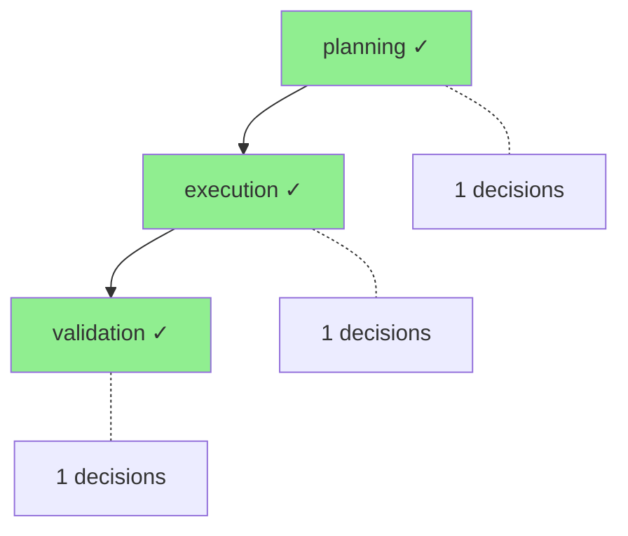

# PhaseLogger Deep Dive: From First Principles

**Reading Time:** 25-30 minutes
**Prerequisites:** Basic Python knowledge
**Outcome:** Complete understanding of phase-based workflow logging for explainable AI agents

---

## Table of Contents

1. [Why PhaseLogger Exists](#1-why-phaselogger-exists)
2. [Prerequisites: Python Fundamentals](#2-prerequisites-python-fundamentals)
3. [The Data Layer: 5 Core Models](#3-the-data-layer-5-core-models)
4. [The Processing Pipeline](#4-the-processing-pipeline)
5. [PhaseLogger Class Architecture](#5-phaselogger-class-architecture)
6. [Practical Examples](#6-practical-examples)
7. [Integration Patterns](#7-integration-patterns)
8. [Key Takeaways](#8-key-takeaways)

---

## 1. Why PhaseLogger Exists

### The Problem: Black Box Agent Workflows

When an AI agent completes a multi-step workflow, you can see *what* it produced but not *why* it made specific decisions.

```
┌─────────────────────────────────────────────────────────────┐
│  Agent Input: "Analyze customer churn data"                 │
│                                                             │
│                  ??? BLACK BOX ???                          │
│                                                             │
│  Agent Output: "Churn rate is 12.5%"                        │
└─────────────────────────────────────────────────────────────┘

Questions you CANNOT answer:
├─ Why did the agent choose regression over classification?
├─ What alternatives were considered and rejected?
├─ How confident was the agent in each decision?
├─ Which phase failed when something goes wrong?
└─ Can we audit the decision trail for compliance?
```

**Without PhaseLogger**, you're flying blind—hoping the agent made good decisions with no way to verify or explain them to stakeholders.

### The Solution: Phase-Based Decision Logging

PhaseLogger tracks decision-making through workflow phases with explicit reasoning, alternatives, and confidence scores.

```
┌─────────────────────────────────────────────────────────────┐
│  WITH PhaseLogger:                                          │
├─────────────────────────────────────────────────────────────┤
│                                                             │
│  PLANNING PHASE                                             │
│  ├─ Decision: "Use regression analysis"                     │
│  │  └─ Reasoning: "Continuous target variable"              │
│  │  └─ Alternatives: ["classification", "clustering"]       │
│  │  └─ Confidence: 0.92                                     │
│  └─ Duration: 234ms ✓                                       │
│                                                             │
│  EXECUTION PHASE                                            │
│  ├─ Decision: "Use XGBoost model"                           │
│  │  └─ Reasoning: "Best performance on tabular data"        │
│  │  └─ Alternatives: ["RandomForest", "LinearRegression"]   │
│  │  └─ Confidence: 0.87                                     │
│  ├─ Artifact: "model_v1.pkl" (file)                         │
│  └─ Duration: 1523ms ✓                                      │
│                                                             │
│  VALIDATION PHASE                                           │
│  ├─ Decision: "Accept model (R² = 0.91)"                    │
│  └─ Duration: 89ms ✓                                        │
│                                                             │
└─────────────────────────────────────────────────────────────┘
```

### Real-World Analogy: Research Lab Notebook

Think of PhaseLogger like a **research lab notebook**:

| Research Lab Notebook | PhaseLogger |
|----------------------|-------------|
| Lab phases (Planning, Experiment, Analysis) | `WorkflowPhase` enum (PLANNING → EXECUTION → VALIDATION) |
| "Decided to use mass spectrometry because..." | `log_decision(decision, reasoning, alternatives)` |
| Photos/charts attached to entries | `log_artifact(name, path, type)` |
| "Experiment 3 failed due to contamination" | `log_error("Contamination detected")` |
| Lab notebook audit for publication | `export_workflow_log()` / `visualize_workflow()` |

Just as a lab notebook provides a defensible audit trail for scientific claims, PhaseLogger provides an audit trail for AI agent decisions.

---

## 2. Prerequisites: Python Fundamentals

Before diving into PhaseLogger, you need to understand **4 Python concepts** that make the implementation possible. If you already know these, [skip to Section 3](#3-the-data-layer-5-core-models).

### Concept 1: Pydantic BaseModel

**One-liner:** Pydantic validates data types automatically and converts objects to/from JSON.

**The problem without Pydantic:**

```python
# Without Pydantic - manual validation everywhere
class Decision:
    def __init__(self, decision_id, decision, confidence):
        # Manual type checking (tedious and error-prone)
        if not isinstance(decision_id, str):
            raise TypeError("decision_id must be a string")
        if not isinstance(confidence, (int, float)):
            raise TypeError("confidence must be a number")
        if not 0 <= confidence <= 1:
            raise ValueError("confidence must be between 0 and 1")

        self.decision_id = decision_id
        self.decision = decision
        self.confidence = confidence

    def to_dict(self):  # Manual serialization
        return {"decision_id": self.decision_id, ...}
```

**With Pydantic:**

```python
from pydantic import BaseModel, Field

class Decision(BaseModel):
    decision_id: str
    decision: str
    confidence: float = Field(ge=0, le=1)  # Validation built-in!

    class Config:
        extra = "forbid"  # Reject unknown fields

# Automatic validation
d = Decision(decision_id="dec-1", decision="Use GPT-4", confidence=0.85)

# Automatic serialization
d.model_dump()  # → {"decision_id": "dec-1", "decision": "Use GPT-4", "confidence": 0.85}
d.model_dump(mode="json")  # → JSON-safe (datetime → ISO string)
```

**Character-by-character breakdown:**

```
confidence: float = Field(ge=0, le=1)
^^^^^^^^^   ^^^^^   ^^^^^^^^^^^^^^^^
    |         |           |
    |         |           └─ Field() with constraints: ge=greater-or-equal, le=less-or-equal
    |         └─ Type hint: must be a float
    └─ Attribute name
```

**Where it appears in PhaseLogger:** All 5 data models (`Decision`, `Artifact`, `PhaseOutcome`, `PhaseSummary`, `WorkflowPhase`) inherit from `BaseModel` (`phase_logger.py:49-160`).

---

### Concept 2: Enum Classes

**One-liner:** Enums prevent "magic string" bugs by defining a fixed set of valid values.

**The problem without Enums:**

```python
# Without Enum - string typos cause silent bugs
def start_phase(phase: str):
    if phase == "planing":  # Typo! No error raised
        ...

start_phase("planing")  # Bug: misspelled "planning"
start_phase("PLANNING")  # Bug: wrong case
start_phase("plan")  # Bug: wrong value
```

**With Enum:**

```python
from enum import Enum

class WorkflowPhase(str, Enum):
    PLANNING = "planning"
    EXECUTION = "execution"
    VALIDATION = "validation"

def start_phase(phase: WorkflowPhase):  # Type hint catches errors
    ...

start_phase(WorkflowPhase.PLANNING)  # ✓ Correct
start_phase("planning")  # ✗ TypeError at runtime
start_phase(WorkflowPhase.PLANING)  # ✗ AttributeError - typo caught!
```

**Character-by-character breakdown:**

```
class WorkflowPhase(str, Enum):
                    ^^^  ^^^^
                     |    |
                     |    └─ Makes this a proper enumeration
                     └─ Inherits from str: members ARE strings (serializable)

WorkflowPhase.PLANNING.value  # → "planning" (the string)
WorkflowPhase.PLANNING.name   # → "PLANNING" (the attribute name)
```

**Where it appears in PhaseLogger:** `WorkflowPhase` enum defines 9 standard phases (`phase_logger.py:35-46`).

---

### Concept 3: datetime with UTC

**One-liner:** UTC timestamps ensure consistent time comparisons across time zones.

**The problem without UTC:**

```python
from datetime import datetime

# Without UTC - ambiguous timestamps
t1 = datetime.now()  # Local time - which timezone?
# If server moves from PST to EST, all timestamps shift!
```

**With UTC:**

```python
from datetime import datetime, UTC

# With UTC - always unambiguous
t1 = datetime.now(UTC)  # → 2024-11-30 18:30:00+00:00

# Calculate duration correctly
start = datetime.now(UTC)
# ... do work ...
end = datetime.now(UTC)
duration_ms = int((end - start).total_seconds() * 1000)
```

**Character-by-character breakdown:**

```
timestamp: datetime = Field(default_factory=lambda: datetime.now(UTC))
                            ^^^^^^^^^^^^^^^^^^^^^^^^^^^^^^^^^^^^^^^
                                              |
                                              └─ default_factory: called when no value provided
                                                 lambda creates a NEW timestamp each time
                                                 (NOT the same timestamp for all instances)
```

**Where it appears in PhaseLogger:** All models use `datetime.now(UTC)` for timestamps (`phase_logger.py:66, 97, 157`).

---

### Concept 4: Path Objects

**One-liner:** `Path` provides cross-platform file operations without string manipulation.

**The problem without Path:**

```python
# Without Path - OS-specific bugs
log_dir = "cache/phase_logs/" + workflow_id + "/workflow.jsonl"  # Unix only!
# On Windows: "cache\\phase_logs\\" - different separator

import os
log_dir = os.path.join("cache", "phase_logs", workflow_id)  # Better but verbose
os.makedirs(log_dir, exist_ok=True)
```

**With Path:**

```python
from pathlib import Path

storage_path = Path("cache/")
logs_path = storage_path / "phase_logs" / workflow_id  # Works on all OS!
logs_path.mkdir(parents=True, exist_ok=True)  # Create nested directories

log_file = logs_path / "workflow_log.jsonl"
with open(log_file, "a") as f:  # Path works with open()
    f.write(json.dumps(event) + "\n")
```

**Character-by-character breakdown:**

```
self._logs_path = storage_path / "phase_logs" / workflow_id
                               ^              ^
                               |              |
                               └──────────────┴─ "/" operator joins paths (platform-aware)

logs_path.mkdir(parents=True, exist_ok=True)
                ^^^^^^^^^^^^^  ^^^^^^^^^^^^^
                     |              |
                     |              └─ Don't error if directory exists
                     └─ Create parent directories if they don't exist
```

**Where it appears in PhaseLogger:** Constructor creates log directory (`phase_logger.py:193-196`).

---

## 3. The Data Layer: 5 Core Models

PhaseLogger uses **5 Pydantic models** to capture workflow data. Each does **one thing**.

```
PhaseLogger Data Models
│
├── WorkflowPhase (Enum)      → Defines standard phases
├── Decision (BaseModel)      → Records a single decision with reasoning
├── Artifact (BaseModel)      → Records an output produced during a phase
├── PhaseOutcome (BaseModel)  → Records how a phase ended
└── PhaseSummary (BaseModel)  → Aggregates statistics across all phases
```

### Model 1: WorkflowPhase

**Purpose:** Define the standard phases an agent workflow can go through.

```python
class WorkflowPhase(str, Enum):
    PLANNING = "planning"
    LITERATURE_REVIEW = "literature_review"
    DATA_COLLECTION = "data_collection"
    EXECUTION = "execution"
    EXPERIMENT = "experiment"
    VALIDATION = "validation"
    REPORTING = "reporting"
    COMPLETED = "completed"
    FAILED = "failed"
```

**Typical workflow progression:**

```
PLANNING → DATA_COLLECTION → EXECUTION → VALIDATION → COMPLETED
                                              │
                                              └──→ FAILED (if errors)
```

---

### Model 2: Decision

**Purpose:** Capture a single decision with full reasoning context.

**The data (JSON):**

```json
{
  "decision_id": "dec-invoice-001-3",
  "timestamp": "2024-11-30T10:15:32.123456+00:00",
  "decision": "Use GPT-4 for extraction",
  "reasoning": "Invoice contains handwritten notes requiring advanced OCR",
  "alternatives_considered": ["GPT-3.5", "Claude-3-Haiku", "Tesseract OCR"],
  "selected_because": "GPT-4 has 95% accuracy on handwritten text vs 72% for alternatives",
  "confidence": 0.92,
  "agent_id": "extraction-router-v2",
  "reversible": true,
  "phase": "execution"
}
```

**The code that produces this:**

```python
class Decision(BaseModel):
    decision_id: str
    timestamp: datetime = Field(default_factory=lambda: datetime.now(UTC))
    decision: str                              # What was decided
    reasoning: str                             # Why it was decided
    alternatives_considered: list[str] = []   # What else was considered
    selected_because: str = ""                 # Why THIS option won
    confidence: float = 1.0                    # How sure (0-1)
    agent_id: str | None = None                # Which agent decided
    reversible: bool = True                    # Can we undo this?
    phase: WorkflowPhase | None = None         # During which phase
```

**Key insight:** The `alternatives_considered` and `selected_because` fields are what make PhaseLogger different from simple logging—they capture the *decision space*, not just the outcome.

---

### Model 3: Artifact

**Purpose:** Track outputs produced during workflow execution.

**The data (JSON):**

```json
{
  "artifact_id": "art-research-001-2",
  "name": "Churn Analysis Report",
  "path": "/outputs/churn_report_v1.pdf",
  "artifact_type": "report",
  "created_at": "2024-11-30T10:45:00.000000+00:00",
  "phase": "reporting",
  "metadata": {
    "pages": 12,
    "format": "PDF",
    "charts_included": 5
  }
}
```

**The code that produces this:**

```python
class Artifact(BaseModel):
    artifact_id: str
    name: str                                  # Human-readable name
    path: str                                  # Where it's stored
    artifact_type: str = "file"                # Type: file, data, model, report
    created_at: datetime = Field(default_factory=lambda: datetime.now(UTC))
    phase: WorkflowPhase | None = None
    metadata: dict[str, Any] = {}              # Flexible additional info
```

---

### Model 4: PhaseOutcome

**Purpose:** Record how a phase ended (success, failure, partial).

**The data (JSON):**

```json
{
  "phase": "execution",
  "status": "success",
  "start_time": "2024-11-30T10:00:00.000000+00:00",
  "end_time": "2024-11-30T10:25:30.500000+00:00",
  "duration_ms": 1530500,
  "decisions_made": 3,
  "artifacts_produced": ["model_v1.pkl", "feature_importance.csv"],
  "errors": [],
  "next_phase": "validation",
  "metadata": {}
}
```

**The code that produces this:**

```python
class PhaseOutcome(BaseModel):
    phase: WorkflowPhase
    status: str                                # success, failure, partial, skipped
    start_time: datetime
    end_time: datetime
    duration_ms: int
    decisions_made: int = 0
    artifacts_produced: list[str] = []
    errors: list[str] = []
    next_phase: WorkflowPhase | None = None
    metadata: dict[str, Any] = {}
```

---

### Model 5: PhaseSummary

**Purpose:** Aggregate statistics across all phases for the entire workflow.

**The data (JSON):**

```json
{
  "workflow_id": "research-001",
  "total_phases": 4,
  "completed_phases": 3,
  "total_decisions": 8,
  "total_duration_ms": 2345678,
  "phase_outcomes": [/* array of PhaseOutcome */],
  "overall_status": "partial",
  "created_at": "2024-11-30T11:00:00.000000+00:00"
}
```

**Status determination logic:**

```
overall_status =
    "success"     if ALL phases succeeded
    "failure"     if ANY phase failed
    "partial"     if ANY phase was partial (but none failed)
    "in_progress" if workflow is still running
```

---

## 4. The Processing Pipeline

### Data Flow: Following a Decision Through the System

```
┌─────────────────────────────────────────────────────────────────────────────┐
│ STEP 1: Start Phase                                                          │
├─────────────────────────────────────────────────────────────────────────────┤
│   logger.start_phase(WorkflowPhase.PLANNING)                                │
│                                                                              │
│   Internal State Changes:                                                    │
│   ├─ _current_phase = PLANNING                                              │
│   ├─ _phase_start_time = datetime.now(UTC)                                  │
│   ├─ _decisions[PLANNING] = []                                              │
│   ├─ _artifacts[PLANNING] = []                                              │
│   └─ _errors[PLANNING] = []                                                 │
│                                                                              │
│   Persisted to JSONL:                                                        │
│   {"event": "phase_start", "phase": "planning", "timestamp": "..."}         │
└───────────────────────────────────────┬─────────────────────────────────────┘
                                        │
                                        ▼
┌─────────────────────────────────────────────────────────────────────────────┐
│ STEP 2: Log Decision                                                         │
├─────────────────────────────────────────────────────────────────────────────┤
│   decision = logger.log_decision(                                            │
│       decision="Use GPT-4",                                                  │
│       reasoning="Higher accuracy needed",                                    │
│       alternatives=["GPT-3.5", "Claude"],                                    │
│       confidence=0.85                                                        │
│   )                                                                          │
│                                                                              │
│   Internal State Changes:                                                    │
│   ├─ _decision_counter += 1  (now = 1)                                      │
│   ├─ Creates Decision(decision_id="dec-workflow-1", ...)                    │
│   └─ _decisions[PLANNING].append(decision)                                  │
│                                                                              │
│   Persisted to JSONL:                                                        │
│   {"event": "decision", "data": {"decision_id": "dec-...", ...}}            │
│                                                                              │
│   Returns: Decision object (for chaining or inspection)                      │
└───────────────────────────────────────┬─────────────────────────────────────┘
                                        │
                                        ▼
┌─────────────────────────────────────────────────────────────────────────────┐
│ STEP 3: Log Artifact (Optional)                                              │
├─────────────────────────────────────────────────────────────────────────────┤
│   artifact = logger.log_artifact(                                            │
│       artifact_name="Plan Document",                                         │
│       artifact_path=Path("outputs/plan.md"),                                 │
│       artifact_type="document"                                               │
│   )                                                                          │
│                                                                              │
│   Internal State Changes:                                                    │
│   ├─ _artifact_counter += 1                                                 │
│   └─ _artifacts[PLANNING].append(artifact)                                  │
│                                                                              │
│   Persisted to JSONL:                                                        │
│   {"event": "artifact", "data": {"artifact_id": "art-...", ...}}            │
└───────────────────────────────────────┬─────────────────────────────────────┘
                                        │
                                        ▼
┌─────────────────────────────────────────────────────────────────────────────┐
│ STEP 4: End Phase                                                            │
├─────────────────────────────────────────────────────────────────────────────┤
│   outcome = logger.end_phase("success")                                      │
│                                                                              │
│   Calculations:                                                              │
│   ├─ end_time = datetime.now(UTC)                                           │
│   ├─ duration_ms = (end_time - start_time) * 1000                           │
│   └─ decisions_made = len(_decisions[PLANNING])                             │
│                                                                              │
│   Internal State Changes:                                                    │
│   ├─ Creates PhaseOutcome(phase=PLANNING, status="success", ...)            │
│   ├─ _outcomes.append(outcome)                                              │
│   ├─ _current_phase = None                                                  │
│   └─ _phase_start_time = None                                               │
│                                                                              │
│   Persisted to JSONL:                                                        │
│   {"event": "phase_end", "data": {"phase": "planning", "status": "success"}}│
│                                                                              │
│   Returns: PhaseOutcome object                                               │
└───────────────────────────────────────┬─────────────────────────────────────┘
                                        │
                                        ▼
┌─────────────────────────────────────────────────────────────────────────────┐
│ STEP 5: Query or Export (Anytime)                                            │
├─────────────────────────────────────────────────────────────────────────────┤
│                                                                              │
│   summary = logger.get_phase_summary()                                       │
│   → Returns: PhaseSummary with aggregated stats                              │
│                                                                              │
│   diagram = logger.visualize_workflow()                                      │
│   → Returns: Mermaid diagram string                                          │
│                                                                              │
│   logger.export_workflow_log(Path("output.json"))                           │
│   → Writes: Complete workflow log to JSON file                               │
│                                                                              │
└─────────────────────────────────────────────────────────────────────────────┘
```

### JSONL Persistence Format

PhaseLogger writes to a JSONL (JSON Lines) file—one JSON object per line:

```jsonl
{"event": "phase_start", "phase": "planning", "timestamp": "2024-11-30T10:00:00+00:00", "metadata": {}}
{"event": "decision", "data": {"decision_id": "dec-research-001-1", "decision": "Use GPT-4", ...}}
{"event": "artifact", "data": {"artifact_id": "art-research-001-1", "name": "Plan", ...}}
{"event": "phase_end", "data": {"phase": "planning", "status": "success", "duration_ms": 1234, ...}}
{"event": "phase_start", "phase": "execution", "timestamp": "2024-11-30T10:01:00+00:00", "metadata": {}}
...
```

**Why JSONL?**
- Append-only (crash-safe)
- Each line is independent (easy to parse/filter)
- Can process large logs without loading entire file

---

## 5. PhaseLogger Class Architecture

### Constructor: Defensive Validation

```python
def __init__(self, workflow_id: str, storage_path: Path) -> None:
    # Step 1: Type checking (defensive)
    if not isinstance(workflow_id, str):
        raise TypeError("workflow_id must be a string")
    if not isinstance(storage_path, Path):
        raise TypeError("storage_path must be a Path")

    # Step 2: Value validation (defensive)
    if not workflow_id.strip():
        raise ValueError("workflow_id cannot be empty")

    # Step 3: Initialize state
    self.workflow_id = workflow_id
    self.storage_path = storage_path
    self._logs_path = storage_path / "phase_logs" / workflow_id

    # Step 4: Create storage directory
    self._logs_path.mkdir(parents=True, exist_ok=True)

    # Step 5: Initialize internal state
    self._current_phase: WorkflowPhase | None = None
    self._phase_start_time: datetime | None = None
    self._decisions: dict[WorkflowPhase, list[Decision]] = {}
    self._artifacts: dict[WorkflowPhase, list[Artifact]] = {}
    self._errors: dict[WorkflowPhase, list[str]] = {}
    self._outcomes: list[PhaseOutcome] = []
    self._decision_counter = 0
    self._artifact_counter = 0
```

### State Management

PhaseLogger maintains **7 pieces of internal state**:

| State Variable | Type | Purpose |
|---------------|------|---------|
| `_current_phase` | `WorkflowPhase \| None` | Currently active phase (None if between phases) |
| `_phase_start_time` | `datetime \| None` | When current phase started |
| `_decisions` | `dict[WorkflowPhase, list[Decision]]` | All decisions, organized by phase |
| `_artifacts` | `dict[WorkflowPhase, list[Artifact]]` | All artifacts, organized by phase |
| `_errors` | `dict[WorkflowPhase, list[str]]` | All errors, organized by phase |
| `_outcomes` | `list[PhaseOutcome]` | Completed phase outcomes |
| `_decision_counter` | `int` | Auto-incrementing decision ID |

### Design Patterns Used

| Pattern | Where | **Why It's Needed** |
|---------|-------|---------------------|
| **State Pattern** | `_current_phase` tracking | Ensures phase lifecycle is enforced (can't log decisions without starting a phase) |
| **Repository Pattern** | `_decisions`, `_artifacts` dicts | Organizes data by phase for efficient querying |
| **Factory Pattern** | `log_decision()`, `log_artifact()` | Creates properly initialized model instances with auto-generated IDs |
| **Builder Pattern** | `visualize_workflow()` | Incrementally constructs Mermaid diagram from phase data |

### Key Methods at a Glance

| Method | Line | Purpose |
|--------|------|---------|
| `start_phase()` | 207-234 | Begin a new phase, initialize state |
| `log_decision()` | 236-282 | Record a decision with full reasoning |
| `log_artifact()` | 284-321 | Record an output file/data |
| `log_error()` | 323-337 | Record an error during phase |
| `end_phase()` | 339-378 | Complete phase, calculate duration |
| `get_phase_summary()` | 410-437 | Aggregate statistics across phases |
| `export_workflow_log()` | 439-472 | Write complete log to JSON |
| `visualize_workflow()` | 474-510 | Generate Mermaid diagram |

---

## 6. Practical Examples

Each example adds exactly **one new concept**.

### Example 1: Single Phase, Single Decision (Simplest)

```python
from pathlib import Path
from backend.explainability.phase_logger import PhaseLogger, WorkflowPhase

# Initialize logger
logger = PhaseLogger(workflow_id="demo-001", storage_path=Path("cache/"))

# Single phase lifecycle
logger.start_phase(WorkflowPhase.PLANNING)

logger.log_decision(
    decision="Use semantic search",
    reasoning="Query is abstract, not keyword-based"
)

outcome = logger.end_phase("success")

print(f"Phase: {outcome.phase.value}")
print(f"Duration: {outcome.duration_ms}ms")
print(f"Decisions: {outcome.decisions_made}")
```

**Output:**
```
Phase: planning
Duration: 12ms
Decisions: 1
```

---

### Example 2: Add Artifact Tracking (+1 Concept)

```python
logger = PhaseLogger(workflow_id="demo-002", storage_path=Path("cache/"))

logger.start_phase(WorkflowPhase.EXECUTION)

# Decision with more context
logger.log_decision(
    decision="Use GPT-4",
    reasoning="Complex extraction task",
    alternatives=["GPT-3.5", "Claude"],
    selected_because="Highest accuracy on benchmark",
    confidence=0.88
)

# NEW: Log artifact produced
artifact = logger.log_artifact(
    artifact_name="Extraction Results",
    artifact_path=Path("outputs/results.json"),
    artifact_type="data",
    metadata={"records": 150, "format": "JSON"}
)

outcome = logger.end_phase("success")

print(f"Artifacts: {outcome.artifacts_produced}")
```

**Output:**
```
Artifacts: ['Extraction Results']
```

---

### Example 3: Add Error Handling (+1 Concept)

```python
logger = PhaseLogger(workflow_id="demo-003", storage_path=Path("cache/"))

logger.start_phase(WorkflowPhase.VALIDATION)

# Simulate validation check
data_valid = False

if not data_valid:
    # NEW: Log error (recoverable)
    logger.log_error("Schema validation failed: missing 'timestamp' field", recoverable=True)

    logger.log_decision(
        decision="Retry with fallback parser",
        reasoning="Primary parser failed, fallback has looser schema",
        confidence=0.65
    )

# End with partial status (not full failure)
outcome = logger.end_phase("partial")

print(f"Status: {outcome.status}")
print(f"Errors: {outcome.errors}")
```

**Output:**
```
Status: partial
Errors: ['[recoverable] Schema validation failed: missing 'timestamp' field']
```

---

### Example 4: Multi-Phase Workflow (+1 Concept)

```python
logger = PhaseLogger(workflow_id="research-001", storage_path=Path("cache/"))

# Phase 1: Planning
logger.start_phase(WorkflowPhase.PLANNING)
logger.log_decision("Focus on recent papers", "Last 2 years most relevant", ["all-time", "last-5-years"])
logger.end_phase("success")

# Phase 2: Data Collection
logger.start_phase(WorkflowPhase.DATA_COLLECTION)
logger.log_decision("Use ArXiv API", "Free, comprehensive coverage", ["Semantic Scholar", "Google Scholar"])
logger.log_artifact("raw_papers", Path("data/papers.json"), "data")
logger.end_phase("success")

# Phase 3: Execution
logger.start_phase(WorkflowPhase.EXECUTION)
logger.log_decision("Cluster by topic", "Better organization", ["chronological", "by-author"])
logger.end_phase("success")

# Get summary
summary = logger.get_phase_summary()
print(f"Total phases: {summary.total_phases}")
print(f"Total decisions: {summary.total_decisions}")
print(f"Overall status: {summary.overall_status}")
```

**Output:**
```
Total phases: 3
Total decisions: 3
Overall status: success
```

---

### Example 5: Full Integration with Export and Visualization

```python
from pathlib import Path
from backend.explainability.phase_logger import PhaseLogger, WorkflowPhase

logger = PhaseLogger(workflow_id="invoice-processing", storage_path=Path("cache/"))

# Phase 1: Planning
logger.start_phase(WorkflowPhase.PLANNING)
logger.log_decision(
    decision="Use hybrid extraction",
    reasoning="Invoice has both structured tables and free-text notes",
    alternatives=["OCR-only", "Template-matching"],
    selected_because="Hybrid handles both data types",
    confidence=0.90,
    agent_id="planning-agent-v2"
)
logger.end_phase("success")

# Phase 2: Execution
logger.start_phase(WorkflowPhase.EXECUTION)
logger.log_decision(
    decision="Use GPT-4 for free-text",
    reasoning="Handwritten annotations require vision model",
    alternatives=["GPT-3.5", "Tesseract"],
    confidence=0.85
)
logger.log_artifact("extracted_data", Path("outputs/invoice_data.json"), "data")
logger.end_phase("success")

# Phase 3: Validation
logger.start_phase(WorkflowPhase.VALIDATION)
logger.log_decision(
    decision="Accept extraction",
    reasoning="All required fields present, confidence > 80%",
    confidence=0.92
)
logger.end_phase("success")

# Export complete log
logger.export_workflow_log(Path("outputs/invoice_workflow.json"))

# Generate Mermaid diagram
mermaid = logger.visualize_workflow()
print(mermaid)
```

**Output (Mermaid diagram):**


---

## 7. Integration Patterns

PhaseLogger works alongside the other three pillars of lesson-17's explainability framework.

### Pattern 1: PhaseLogger + BlackBoxRecorder (Events + Reasoning)

**When to use:** Research workflows where you need both event replay (what) and decision trail (why).

```python
from pathlib import Path
from backend.explainability.phase_logger import PhaseLogger, WorkflowPhase
from backend.explainability.black_box import BlackBoxRecorder, TaskPlan, PlanStep

# Initialize both
logger = PhaseLogger(workflow_id="research-001", storage_path=Path("cache/"))
recorder = BlackBoxRecorder(workflow_id="research-001", storage_path=Path("cache/"))

# PhaseLogger: Track reasoning
logger.start_phase(WorkflowPhase.PLANNING)
logger.log_decision(
    decision="Use semantic search",
    reasoning="Better recall for abstract queries",
    alternatives=["keyword", "hybrid"]
)

# BlackBoxRecorder: Track events
recorder.record_task_plan("research", TaskPlan(
    plan_id="plan-001",
    task_id="research",
    steps=[
        PlanStep(step_id="search", description="Search literature", agent_id="searcher"),
        PlanStep(step_id="analyze", description="Analyze papers", agent_id="analyzer")
    ]
))

logger.end_phase("success")

# Result:
# - PhaseLogger: "We chose semantic search because..."
# - BlackBoxRecorder: "Step 1 started at T1, completed at T2, produced artifact X"
```

---

### Pattern 2: PhaseLogger + GuardRails (Validated Workflows)

**When to use:** Workflows that must validate outputs before proceeding.

```python
from pathlib import Path
from backend.explainability.phase_logger import PhaseLogger, WorkflowPhase
from backend.explainability.guardrails import GuardRailValidator, GuardRail, BuiltInValidators

logger = PhaseLogger(workflow_id="extraction-001", storage_path=Path("cache/"))
validator = GuardRailValidator()

# Define validation rules
output_guardrail = GuardRail(
    name="output_validation",
    constraints=[
        BuiltInValidators.required_fields(["result", "confidence", "source"]),
        BuiltInValidators.no_pii()
    ]
)

logger.start_phase(WorkflowPhase.VALIDATION)

# Validate output
output_data = {
    "result": "Churn rate is 12.5%",
    "confidence": 0.91,
    "source": "CRM database Q3 2024"
}

result = validator.validate(output_data, output_guardrail)

if result.is_valid:
    logger.log_decision(
        decision="Accept output",
        reasoning=f"Passed all {len(result.entries)} validation constraints",
        alternatives=["reject", "retry"],
        confidence=0.95
    )
    logger.end_phase("success")
else:
    logger.log_error(f"Validation failed: {result.total_errors} errors")
    logger.log_decision(
        decision="Reject output",
        reasoning=f"Failed constraints: {[e.constraint_name for e in result.entries if not e.passed]}",
        confidence=0.99
    )
    logger.end_phase("failure")
```

---

### Pattern 3: All Four Pillars (Healthcare Compliance Example)

**When to use:** High-stakes workflows requiring full audit trail.

```python
from pathlib import Path
from backend.explainability.black_box import BlackBoxRecorder, TraceEvent, EventType
from backend.explainability.agent_facts import AgentFactsRegistry, AgentFacts, Policy
from backend.explainability.guardrails import GuardRailValidator, GuardRail, BuiltInValidators
from backend.explainability.phase_logger import PhaseLogger, WorkflowPhase

# PILLAR 1 - IDENTITY: Register compliant agent
registry = AgentFactsRegistry(storage_path=Path("cache/"))
registry.register(AgentFacts(
    agent_id="diagnosis-v2",
    agent_name="Diagnosis Assistant",
    owner="healthcare-team",
    version="2.0.0",
    policies=[Policy(
        policy_id="hipaa-001",
        name="HIPAA Compliance",
        description="Protect PHI",
        policy_type="data_access",
        constraints={"pii_handling_mode": "redact"}
    )]
))

# PILLAR 2 - RECORDING: Initialize black box
recorder = BlackBoxRecorder(workflow_id="case-123", storage_path=Path("cache/"))

# PILLAR 3 - REASONING: Track diagnostic phases
logger = PhaseLogger(workflow_id="case-123", storage_path=Path("cache/"))

# PILLAR 4 - VALIDATION: Enforce PHI protection
validator = GuardRailValidator()
phi_guardrail = GuardRail(
    name="phi_protection",
    constraints=[BuiltInValidators.no_pii()]
)

# Execute workflow with all four pillars
logger.start_phase(WorkflowPhase.DATA_COLLECTION)

# Record event (what happened)
recorder.add_trace_event("task-1", TraceEvent(
    event_id="evt-001",
    event_type=EventType.STEP_START,
    agent_id="diagnosis-v2"
))

# Log decision (why it happened)
logger.log_decision(
    decision="Review lab results first",
    reasoning="Most recent data available (24h old)",
    alternatives=["imaging", "patient history"],
    confidence=0.88,
    agent_id="diagnosis-v2"
)

# Validate output (what was checked)
output = {"diagnosis_notes": "Patient shows elevated inflammatory markers"}
validation_result = validator.validate(output, phi_guardrail)

if validation_result.is_valid:
    logger.end_phase("success")
else:
    logger.log_error("PHI detected in output", recoverable=False)
    logger.end_phase("failure")

# Full audit trail:
# 1. AgentFacts: Who made decisions (diagnosis-v2, HIPAA-compliant)
# 2. BlackBoxRecorder: What events occurred (event timeline)
# 3. PhaseLogger: Why decisions were made (reasoning trail)
# 4. GuardRails: What was validated (PHI protection)
```

---

## 8. Key Takeaways

### Mental Model

```
┌─────────────────────────────────────────────────────────────────────────────┐
│                     PHASELOGGER MENTAL MODEL                                 │
├─────────────────────────────────────────────────────────────────────────────┤
│                                                                              │
│   PhaseLogger answers: "WHY did the agent make these decisions?"            │
│                                                                              │
│   BlackBoxRecorder answers: "WHAT events occurred?"                          │
│   AgentFacts answers: "WHO was responsible?"                                 │
│   GuardRails answers: "WHAT constraints were enforced?"                      │
│                                                                              │
│   Together, they provide complete explainability for AI agent workflows.     │
│                                                                              │
└─────────────────────────────────────────────────────────────────────────────┘
```

### When to Use PhaseLogger

| Scenario | Use PhaseLogger? | Why |
|----------|------------------|-----|
| Debugging a failed workflow | ✓ | See which phase failed and why |
| Explaining decisions to stakeholders | ✓ | Decision trail with reasoning |
| Compliance audit (healthcare, finance) | ✓ | Defensible decision log |
| Simple single-step operations | ✗ | Overhead not justified |
| Real-time monitoring dashboards | ✗ | Use BlackBoxRecorder instead |

### Code Location Quick Reference

| Component | File | Lines |
|-----------|------|-------|
| `WorkflowPhase` enum | `phase_logger.py` | 35-46 |
| `Decision` model | `phase_logger.py` | 49-78 |
| `Artifact` model | `phase_logger.py` | 80-102 |
| `PhaseOutcome` model | `phase_logger.py` | 105-133 |
| `PhaseSummary` model | `phase_logger.py` | 136-160 |
| `PhaseLogger.__init__` | `phase_logger.py` | 174-205 |
| `start_phase()` | `phase_logger.py` | 207-234 |
| `log_decision()` | `phase_logger.py` | 236-282 |
| `log_artifact()` | `phase_logger.py` | 284-321 |
| `end_phase()` | `phase_logger.py` | 339-378 |
| `visualize_workflow()` | `phase_logger.py` | 474-510 |

### Common Pitfalls

| Pitfall | Symptom | Fix |
|---------|---------|-----|
| Forgetting to call `start_phase()` | `ValueError: No phase in progress` | Always start a phase before logging |
| Starting phase without ending previous | `ValueError: Cannot start phase X, phase Y still in progress` | Call `end_phase()` before `start_phase()` |
| Using string instead of enum | `TypeError: phase must be a WorkflowPhase` | Use `WorkflowPhase.PLANNING`, not `"planning"` |
| Using string instead of Path | `TypeError: storage_path must be a Path` | Use `Path("cache/")`, not `"cache/"` |

### Quick Reference Card

```
┌─────────────────────────────────────────────────────────────────────────────┐
│                     PHASELOGGER QUICK REFERENCE                              │
├─────────────────────────────────────────────────────────────────────────────┤
│                                                                              │
│  INITIALIZATION                                                              │
│  logger = PhaseLogger(workflow_id="my-workflow", storage_path=Path("cache/"))│
│                                                                              │
│  PHASE LIFECYCLE                        DECISION LOGGING                    │
│  ├─ start_phase(WorkflowPhase.X)        ├─ log_decision(decision,           │
│  ├─ end_phase(status)                   │     reasoning, alternatives,      │
│  └─ get_current_phase()                 │     selected_because, confidence) │
│                                         └─ get_phase_decisions(phase)       │
│                                                                              │
│  ARTIFACT TRACKING                      EXPORT & VISUALIZATION              │
│  ├─ log_artifact(name, path, type)      ├─ export_workflow_log(filepath)    │
│  └─ get_phase_artifacts(phase)          ├─ visualize_workflow() → Mermaid   │
│                                         └─ get_phase_summary()              │
│                                                                              │
│  ERROR HANDLING                                                              │
│  └─ log_error(error, recoverable=True)                                      │
│                                                                              │
└─────────────────────────────────────────────────────────────────────────────┘
```

---

## Related Files

- **Source Code:** `lesson-17/backend/explainability/phase_logger.py`
- **Tests:** `lesson-17/tests/test_phase_logger.py`
- **Exploration Doc:** `lesson-17/EXPLORATION_PHASELOGGER_INTEGRATION.md`
- **Fundamentals Tutorial:** `lesson-17/tutorials/01_explainability_fundamentals.md`
- **Interactive Notebook:** `lesson-17/notebooks/04_phase_logger_workflow.ipynb`

---

*Created using first-principles teaching methodology from `patterns/first-principles-teaching.md`*
