# Bank Authentication System Integration Summary

## Overview
This conversation analyzed the existing chat application's authentication system and developed a comprehensive plan to replace the current authentication with an enterprise banking authentication system while maintaining minimal changes to the existing architecture.

## Current System Analysis
- **Frontend**: React application with existing authentication system
- **Backend**: LangGraph with JWT validation
- **Authentication Flow**: Current auth → JWT → LangGraph validation
- **User Management**: Existing user database and session management

## Target Bank Authentication System

### Technology Stack Identified
- **Authentication**: Bank SAML SSO
- **JWT Management**: Enterprise JWT with RS256 signing
- **Identity Provider**: Corporate SAML IdP
- **Token Validation**: Bank Auth API
- **Security**: Enterprise-grade security with banking compliance

### Key Components Explained

#### 1. AuthContext
- **Purpose**: Centralized React state management for authentication
- **Function**: Provides global authentication state and methods across the app
- **Responsibilities**: User session management, state synchronization, prop drilling elimination

#### 2. AuthService
- **Purpose**: Service layer encapsulating authentication business logic
- **Function**: Abstracts authentication complexity from UI components
- **Responsibilities**: SAML flow initiation, token management, API communication, error handling

#### 3. SAML (Security Assertion Markup Language)
- **Purpose**: Enterprise standard for Single Sign-On (SSO) authentication
- **Function**: Enables users to authenticate once and access multiple applications
- **Banking Benefits**: 
  - Centralized identity management
  - Enterprise compliance (SOX, PCI DSS, FFIEC)
  - Integration with corporate Active Directory
  - Scalable across large banking organizations

#### 4. AuthAPI
- **Purpose**: Backend API endpoints handling authentication operations
- **Function**: Processes SAML assertions and manages user sessions
- **Responsibilities**: JWT generation, token validation, session management, security enforcement

## Architecture Comparison

### Current Architecture
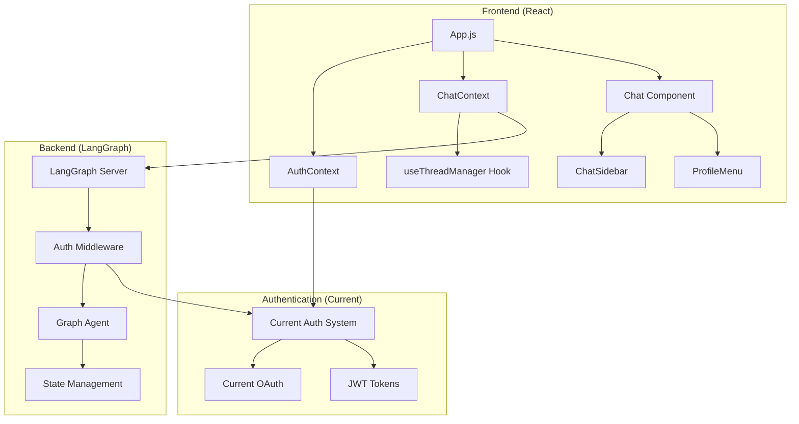

### Target Architecture (Bank Auth)
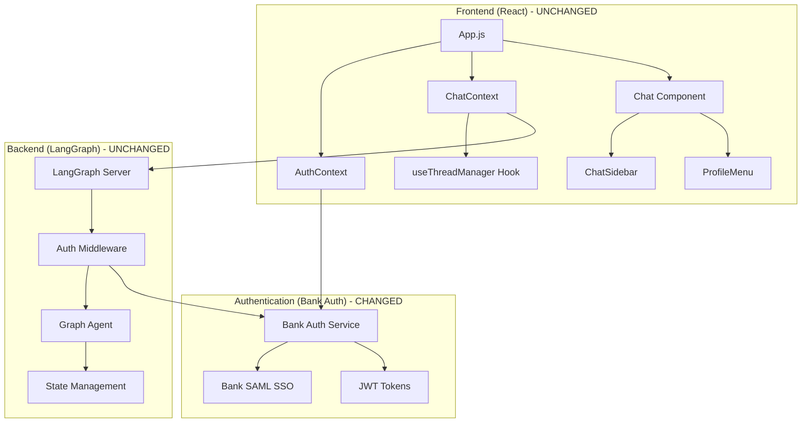

## Authentication Flow Diagrams

### Current Authentication Flow
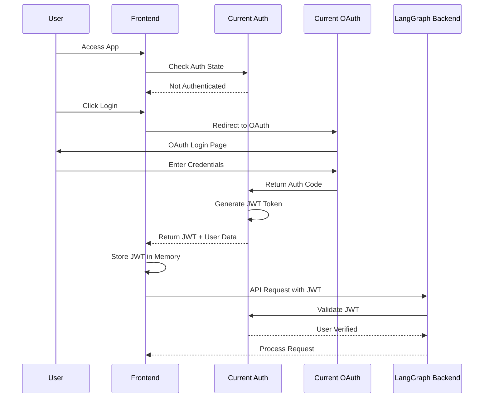

### Target Bank Authentication Flow
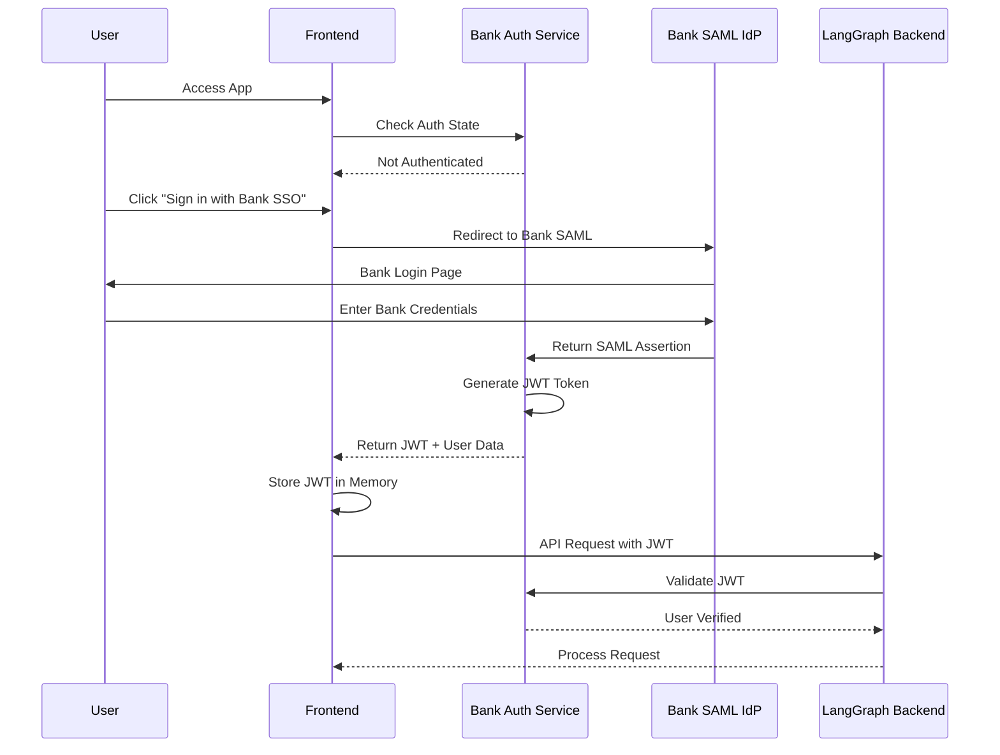

## Detailed Authentication Flow with Code Changes
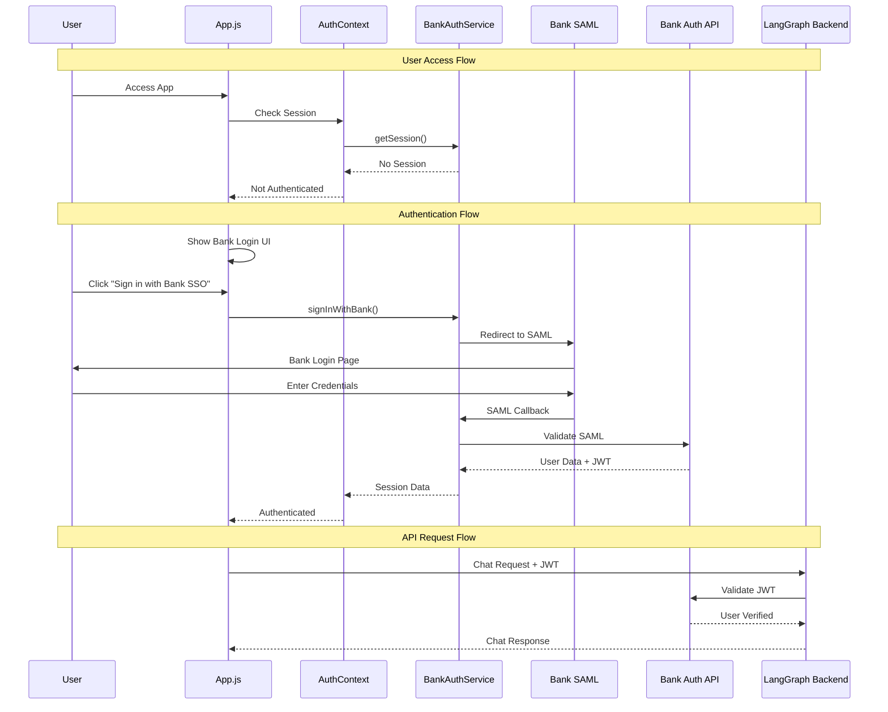

## File Changes Overview
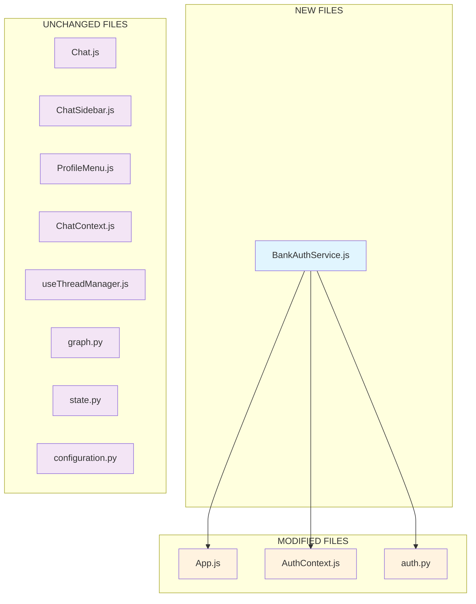

## JWT Token Flow Comparison

### Current JWT Flow
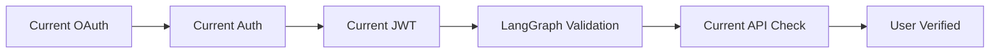

### Target Bank JWT Flow
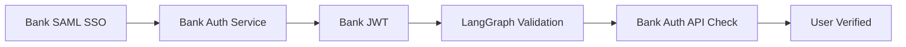

## User Experience Flow
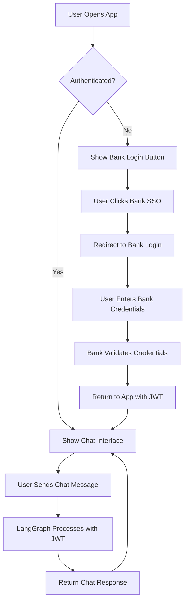

## Security Flow Comparison

### Current Security Flow
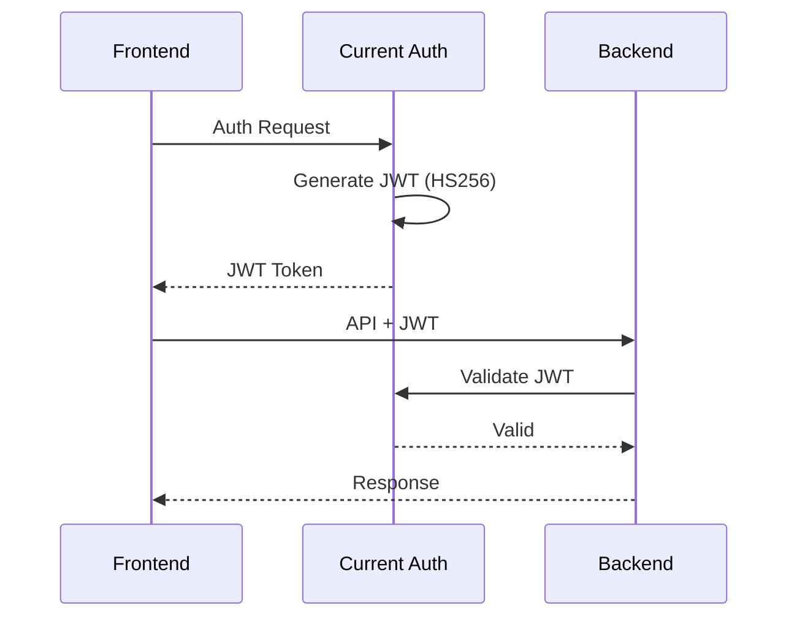

### Target Bank Security Flow
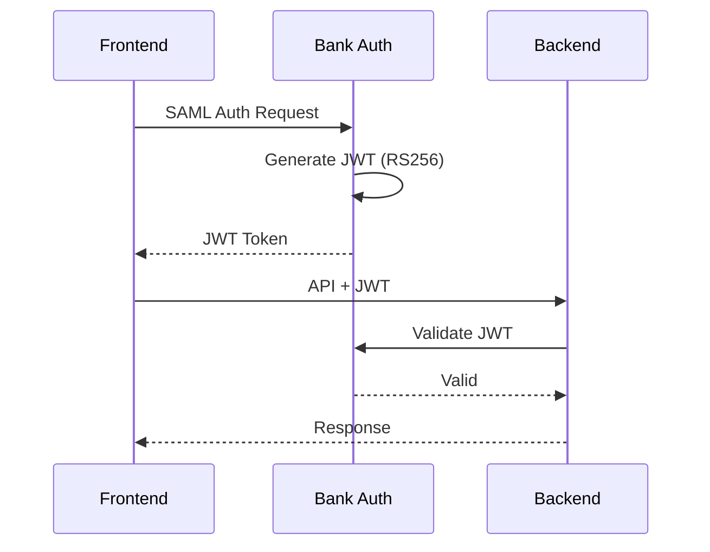

## Minimal Change Implementation Plan

### Phase 1: Architecture Analysis
- Keep existing React frontend and LangGraph backend unchanged
- Replace current authentication with Bank SAML SSO
- Maintain same JWT token flow and user experience

### Phase 2: Bank Auth Integration
- Create `BankAuthService.js` to replace existing auth client
- Implement SAML SSO flow
- Maintain same JWT token structure and validation

### Phase 3: Frontend Updates
- Update `AuthContext.js` to use Bank Auth Service
- Modify `App.js` to show Bank SSO button
- Keep all chat components (`Chat.js`, `ChatSidebar.js`, `ProfileMenu.js`) unchanged

### Phase 4: Backend Migration
- Update `auth.py` to validate Bank-issued JWTs
- Change JWT algorithm to RS256 (enterprise standard)
- Replace existing API validation with Bank Auth API validation

### Phase 5: Testing and Deployment
- Test minimal changes with existing functionality
- Deploy with new authentication system

## Key Benefits of Bank Authentication System

### Security Enhancements
- **Enterprise JWT**: RS256 signing for stronger security
- **SAML SSO**: Industry-standard authentication protocol
- **Corporate Integration**: Seamless integration with banking infrastructure
- **Compliance**: Meets banking regulatory requirements

### Minimal Disruption
- **Same User Experience**: Login → Chat flow remains identical
- **Unchanged Components**: All chat functionality preserved
- **Same JWT Flow**: Token-based authentication maintained
- **Same API Structure**: Request/response format unchanged

## Files Modified (Only 4 files)
1. **`services/BankAuthService.js`** - New file replacing existing auth client
2. **`contexts/AuthContext.js`** - Minimal changes to use Bank service
3. **`App.js`** - Replace existing auth UI with Bank SSO UI
4. **`src/security/auth.py`** - Update JWT validation for Bank tokens

## Files Unchanged
- All chat components (`Chat.js`, `ChatSidebar.js`, `ProfileMenu.js`)
- Chat context (`ChatContext.js`)
- Thread management (`useThreadManager.js`)
- LangGraph backend (`graph.py`, `state.py`, `configuration.py`)
- All styling and UI components

## Enterprise Banking Features
- **SAML SSO Integration**: Corporate identity provider authentication
- **RS256 JWT Tokens**: Enterprise-grade token signing
- **Banking Compliance**: SOX, PCI DSS, FFIEC adherence
- **Corporate Security**: Integration with existing banking security infrastructure
- **Audit Trails**: Comprehensive logging for compliance requirements

## Summary
This plan successfully replaces the current authentication system with Bank SAML SSO authentication while maintaining the existing application architecture and user experience. The minimal change approach ensures rapid deployment with enterprise-grade security suitable for banking applications.
