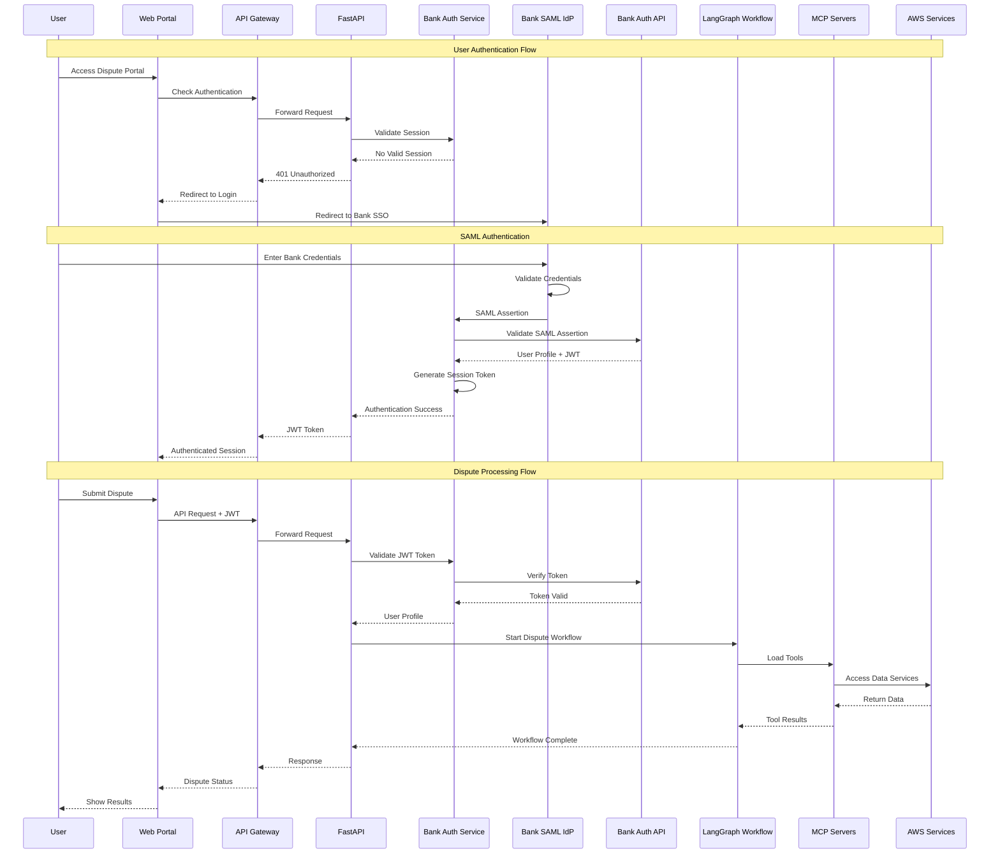
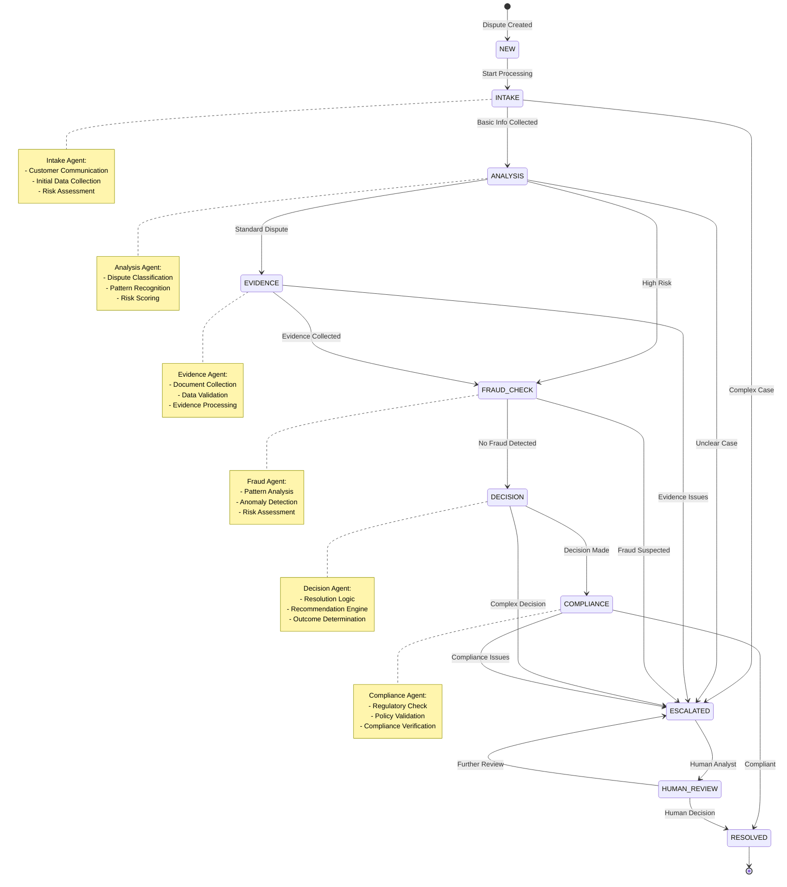
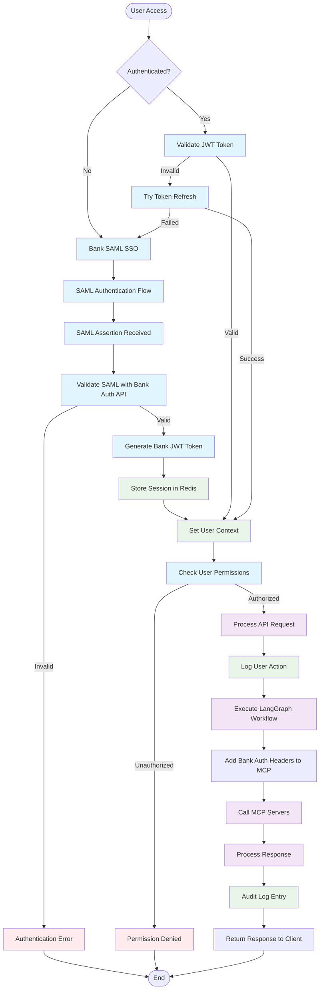
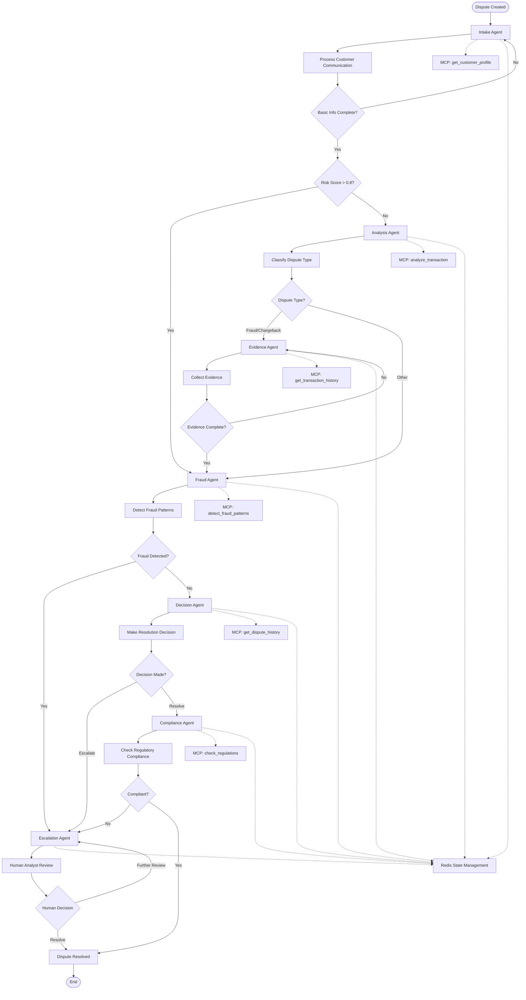
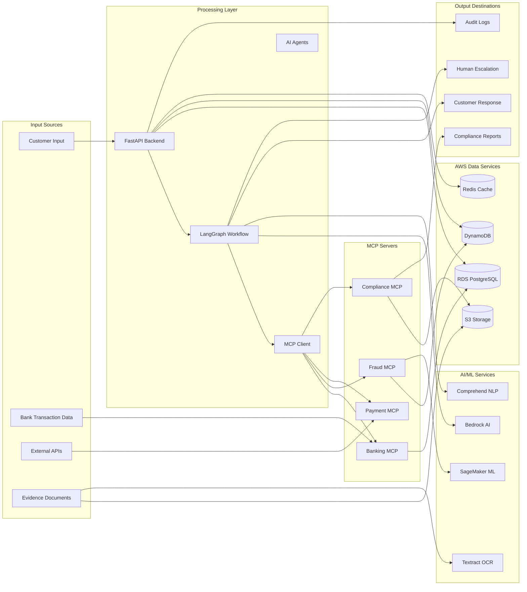
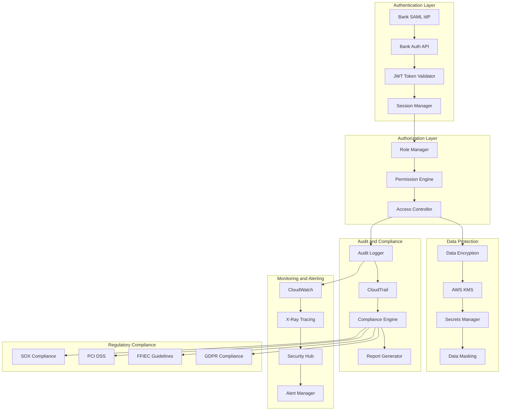
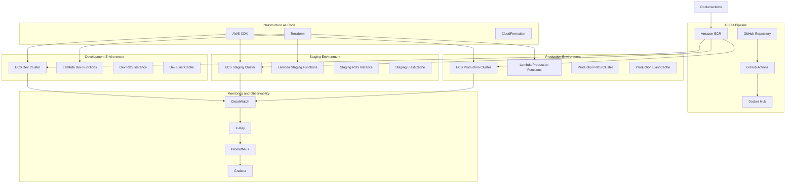

# Dispute Resolution System - Comprehensive Architecture Diagrams

## 1. Overall System Architecture

```mermaid
graph TB
    subgraph "External Systems"
        BankSAML[Bank SAML IdP<br/>Enterprise SSO]
        BankAuthAPI[Bank Auth API<br/>JWT Validation]
        BankCore[Bank Core Systems<br/>Transaction Data]
    end
    
    subgraph "Client Layer"
        WebPortal[Web Portal<br/>React Frontend]
        MobileApp[Mobile App<br/>iOS/Android]
        API[API Gateway<br/>Rate Limiting & Auth]
    end
    
    subgraph "Application Layer - AWS ECS/Fargate"
        FastAPI[FastAPI Backend<br/>REST API Server]
        
        subgraph "Bank Authentication Layer"
            BankAuth[Bank Auth Service<br/>SAML + JWT]
            AuthMiddleware[Auth Middleware<br/>Permission Validation]
            AuditService[Audit Service<br/>Compliance Logging]
        end
        
        subgraph "LangGraph Workflow Engine"
            WorkflowOrchestrator[Workflow Orchestrator<br/>State Management]
            
            subgraph "AI Agent Network"
                IntakeAgent[Intake Agent<br/>Customer Communication]
                AnalysisAgent[Analysis Agent<br/>Dispute Classification]
                EvidenceAgent[Evidence Agent<br/>Data Collection]
                FraudAgent[Fraud Agent<br/>Pattern Analysis]
                DecisionAgent[Decision Agent<br/>Resolution Logic]
                ComplianceAgent[Compliance Agent<br/>Regulatory Check]
                EscalationAgent[Escalation Agent<br/>Human Handoff]
            end
        end
        
        subgraph "MCP Server Integration"
            MCPClient[MCP Client<br/>Multi-Server Manager]
            BankingMCP[Banking MCP Server<br/>Transaction Analysis]
            FraudMCP[Fraud MCP Server<br/>Pattern Detection]
            PaymentMCP[Payment MCP Server<br/>Network Integration]
            ComplianceMCP[Compliance MCP Server<br/>Regulatory Check]
            GeospatialMCP[Geospatial MCP Server<br/>Location Analysis]
        end
    end
    
    subgraph "AWS Infrastructure Layer"
        subgraph "Compute Services"
            ECS[ECS Fargate<br/>Container Orchestration]
            Lambda[Lambda Functions<br/>MCP Servers]
            StepFunctions[Step Functions<br/>Workflow Orchestration]
        end
        
        subgraph "Data Storage"
            RDS[RDS PostgreSQL<br/>Transaction Database]
            DynamoDB[DynamoDB<br/>Customer Metadata]
            S3[S3 Buckets<br/>Evidence Documents]
            ElastiCache[ElastiCache Redis<br/>Session State]
        end
        
        subgraph "AI/ML Services"
            Bedrock[Bedrock<br/>Foundation Models]
            SageMaker[SageMaker<br/>Custom ML Models]
            Textract[Textract<br/>Document Processing]
            Comprehend[Comprehend<br/>Entity Extraction]
        end
        
        subgraph "Security & Compliance"
            SecretsManager[Secrets Manager<br/>API Keys & Credentials]
            KMS[KMS<br/>Encryption Keys]
            CloudTrail[CloudTrail<br/>API Auditing]
            CloudWatch[CloudWatch<br/>Monitoring & Logs]
        end
    end
    
    subgraph "External Integrations"
        PaymentNetworks[Payment Networks<br/>Visa, Mastercard]
        RegulatoryDB[Regulatory Databases<br/>Compliance Data]
        ThirdPartyAPIs[Third-Party APIs<br/>External Services]
    end
    
    %% External to Client
    BankSAML --> WebPortal
    BankSAML --> MobileApp
    
    %% Client to Application
    WebPortal --> API
    MobileApp --> API
    API --> FastAPI
    
    %% Authentication Flow
    FastAPI --> BankAuth
    BankAuth --> BankSAML
    BankAuth --> BankAuthAPI
    BankAuth --> AuthMiddleware
    AuthMiddleware --> AuditService
    
    %% Workflow Flow
    FastAPI --> WorkflowOrchestrator
    WorkflowOrchestrator --> IntakeAgent
    IntakeAgent --> AnalysisAgent
    AnalysisAgent --> EvidenceAgent
    EvidenceAgent --> FraudAgent
    FraudAgent --> DecisionAgent
    DecisionAgent --> ComplianceAgent
    ComplianceAgent --> EscalationAgent
    
    %% MCP Integration
    WorkflowOrchestrator --> MCPClient
    MCPClient --> BankingMCP
    MCPClient --> FraudMCP
    MCPClient --> PaymentMCP
    MCPClient --> ComplianceMCP
    MCPClient --> GeospatialMCP
    
    %% AWS Services
    FastAPI --> ECS
    MCPClient --> Lambda
    WorkflowOrchestrator --> StepFunctions
    
    %% Data Flow
    FastAPI --> RDS
    FastAPI --> DynamoDB
    FastAPI --> S3
    WorkflowOrchestrator --> ElastiCache
    
    %% AI/ML Services
    IntakeAgent --> Bedrock
    AnalysisAgent --> Bedrock
    EvidenceAgent --> Textract
    FraudAgent --> SageMaker
    DecisionAgent --> Bedrock
    ComplianceAgent --> Comprehend
    
    %% Security
    BankAuth --> SecretsManager
    FastAPI --> KMS
    AuditService --> CloudTrail
    FastAPI --> CloudWatch
    
    %% External Integrations
    BankingMCP --> BankCore
    PaymentMCP --> PaymentNetworks
    ComplianceMCP --> RegulatoryDB
    GeospatialMCP --> ThirdPartyAPIs
```

## 2. Bank Authentication Flow Sequence Diagram

## 3. LangGraph Workflow State Diagram

## 4. MCP Server Integration Architecture

```mermaid
graph TB
    subgraph "LangGraph Workflow"
        WG[Workflow Orchestrator]
        IA[Intake Agent]
        AA[Analysis Agent]
        EA[Evidence Agent]
        FA[Fraud Agent]
        DA[Decision Agent]
        CA[Compliance Agent]
    end
    
    subgraph "MCP Client Layer"
        MCPClient[MCP Client Manager<br/>Multi-Server Connection]
        ToolLoader[Tool Loader<br/>Dynamic Tool Registration]
        AuthManager[Auth Manager<br/>Bank Auth Headers]
    end
    
    subgraph "MCP Server Layer - AWS Lambda"
        BankingMCP[Banking MCP Server<br/>Lambda Function]
        FraudMCP[Fraud MCP Server<br/>Lambda Function]
        PaymentMCP[Payment MCP Server<br/>Lambda Function]
        ComplianceMCP[Compliance MCP Server<br/>Lambda Function]
        GeospatialMCP[Geospatial MCP Server<br/>Lambda Function]
    end
    
    subgraph "Banking MCP Tools"
        GetTxHistory[get_transaction_history]
        GetCustomerProfile[get_customer_profile]
        AnalyzeTx[analyze_transaction]
        GetDisputeHistory[get_dispute_history]
        ValidateAccount[validate_account]
    end
    
    subgraph "Fraud MCP Tools"
        DetectPatterns[detect_fraud_patterns]
        AnalyzeBehavior[analyze_behavior]
        RiskAssessment[risk_assessment]
        PatternMatching[pattern_matching]
    end
    
    subgraph "Payment MCP Tools"
        ValidatePayment[validate_payment]
        ProcessRefund[process_refund]
        CheckNetwork[check_payment_network]
        GetProcessorData[get_processor_data]
    end
    
    subgraph "Compliance MCP Tools"
        CheckRegulations[check_regulations]
        ValidateCompliance[validate_compliance]
        GetPolicyData[get_policy_data]
        AuditTrail[audit_trail]
    end
    
    subgraph "AWS Data Services"
        RDS[(RDS PostgreSQL<br/>Transaction Data)]
        DynamoDB[(DynamoDB<br/>Customer Data)]
        S3[(S3 Buckets<br/>Documents)]
        SageMaker[SageMaker<br/>ML Models]
        Bedrock[Bedrock<br/>AI Models]
    end
    
    %% Workflow to MCP Client
    WG --> MCPClient
    IA --> MCPClient
    AA --> MCPClient
    EA --> MCPClient
    FA --> MCPClient
    DA --> MCPClient
    CA --> MCPClient
    
    %% MCP Client to Servers
    MCPClient --> BankingMCP
    MCPClient --> FraudMCP
    MCPClient --> PaymentMCP
    MCPClient --> ComplianceMCP
    MCPClient --> GeospatialMCP
    
    %% Tool Registration
    ToolLoader --> BankingMCP
    ToolLoader --> FraudMCP
    ToolLoader --> PaymentMCP
    ToolLoader --> ComplianceMCP
    ToolLoader --> GeospatialMCP
    
    %% Auth Integration
    AuthManager --> BankingMCP
    AuthManager --> FraudMCP
    AuthManager --> PaymentMCP
    AuthManager --> ComplianceMCP
    AuthManager --> GeospatialMCP
    
    %% Banking MCP Tools
    BankingMCP --> GetTxHistory
    BankingMCP --> GetCustomerProfile
    BankingMCP --> AnalyzeTx
    BankingMCP --> GetDisputeHistory
    BankingMCP --> ValidateAccount
    
    %% Fraud MCP Tools
    FraudMCP --> DetectPatterns
    FraudMCP --> AnalyzeBehavior
    FraudMCP --> RiskAssessment
    FraudMCP --> PatternMatching
    
    %% Payment MCP Tools
    PaymentMCP --> ValidatePayment
    PaymentMCP --> ProcessRefund
    PaymentMCP --> CheckNetwork
    PaymentMCP --> GetProcessorData
    
    %% Compliance MCP Tools
    ComplianceMCP --> CheckRegulations
    ComplianceMCP --> ValidateCompliance
    ComplianceMCP --> GetPolicyData
    ComplianceMCP --> AuditTrail
    
    %% Data Connections
    BankingMCP --> RDS
    BankingMCP --> DynamoDB
    FraudMCP --> SageMaker
    FraudMCP --> Bedrock
    PaymentMCP --> RDS
    ComplianceMCP --> S3
    GeospatialMCP --> Bedrock
```

## 5. AWS Infrastructure Architecture

```mermaid
graph TB
    subgraph "Client Layer"
        Web[Web Portal]
        Mobile[Mobile App]
        API[API Gateway]
    end
    
    subgraph "Application Layer - ECS Fargate"
        FastAPI[FastAPI Application]
        LangGraph[LangGraph Workflow Engine]
        Agents[AI Agent Network]
    end
    
    subgraph "MCP Server Layer - Lambda"
        BankingLambda[Banking MCP Lambda]
        FraudLambda[Fraud MCP Lambda]
        PaymentLambda[Payment MCP Lambda]
        ComplianceLambda[Compliance MCP Lambda]
        GeospatialLambda[Geospatial MCP Lambda]
    end
    
    subgraph "Data Layer"
        RDS[(RDS PostgreSQL<br/>Transaction Database)]
        DynamoDB[(DynamoDB<br/>Customer Metadata)]
        S3[(S3 Buckets<br/>Evidence Storage)]
        ElastiCache[(ElastiCache Redis<br/>Session State)]
        DocumentDB[(DocumentDB<br/>Fraud Patterns)]
    end
    
    subgraph "AI/ML Services"
        Bedrock[Bedrock<br/>Foundation Models]
        SageMaker[SageMaker<br/>Custom Models]
        Textract[Textract<br/>Document Processing]
        Comprehend[Comprehend<br/>Entity Extraction]
        OpenSearch[OpenSearch<br/>Vector Search]
    end
    
    subgraph "Security & Compliance"
        SecretsManager[Secrets Manager<br/>Credentials]
        KMS[KMS<br/>Encryption]
        CloudTrail[CloudTrail<br/>Audit Logs]
        CloudWatch[CloudWatch<br/>Monitoring]
        XRay[X-Ray<br/>Tracing]
    end
    
    subgraph "External Integrations"
        BankSAML[Bank SAML IdP]
        BankAuthAPI[Bank Auth API]
        PaymentNetworks[Payment Networks]
        RegulatoryDB[Regulatory Databases]
    end
    
    %% Client to Application
    Web --> API
    Mobile --> API
    API --> FastAPI
    
    %% Application Layer
    FastAPI --> LangGraph
    LangGraph --> Agents
    
    %% MCP Integration
    LangGraph --> BankingLambda
    LangGraph --> FraudLambda
    LangGraph --> PaymentLambda
    LangGraph --> ComplianceLambda
    LangGraph --> GeospatialLambda
    
    %% Data Connections
    FastAPI --> RDS
    FastAPI --> DynamoDB
    FastAPI --> S3
    LangGraph --> ElastiCache
    
    BankingLambda --> RDS
    BankingLambda --> DynamoDB
    FraudLambda --> DocumentDB
    FraudLambda --> SageMaker
    PaymentLambda --> RDS
    ComplianceLambda --> S3
    GeospatialLambda --> OpenSearch
    
    %% AI/ML Services
    Agents --> Bedrock
    Agents --> Textract
    Agents --> Comprehend
    FraudLambda --> SageMaker
    GeospatialLambda --> Bedrock
    
    %% Security
    FastAPI --> SecretsManager
    FastAPI --> KMS
    FastAPI --> CloudTrail
    FastAPI --> CloudWatch
    LangGraph --> XRay
    
    %% External Auth
    FastAPI --> BankSAML
    FastAPI --> BankAuthAPI
    
    %% External Data
    BankingLambda --> PaymentNetworks
    ComplianceLambda --> RegulatoryDB
```

## 6. Bank Authentication Integration Flow

## 7. LangGraph Workflow Detailed Flow

## 8. Data Flow Architecture

## 9. Security and Compliance Architecture

## 10. Deployment Architecture

This comprehensive architecture documentation covers all aspects of the dispute resolution system with bank authentication integration, including:

1. **Overall System Architecture** - Complete system overview
2. **Bank Authentication Flow** - Detailed SAML SSO and JWT validation
3. **LangGraph Workflow** - State management and agent coordination
4. **MCP Server Integration** - Tool integration architecture
5. **AWS Infrastructure** - Cloud services and data layer
6. **Bank Auth Integration** - Authentication and authorization flow
7. **LangGraph Workflow Details** - Step-by-step workflow processing
8. **Data Flow Architecture** - Data movement and processing
9. **Security and Compliance** - Banking-grade security implementation
10. **Deployment Architecture** - CI/CD and infrastructure management

Each diagram provides a different perspective on the system, ensuring comprehensive coverage of all architectural aspects while maintaining clarity and detail.

