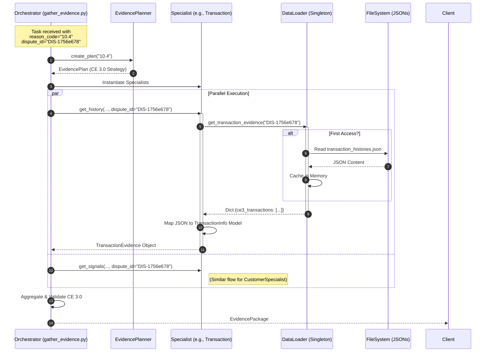
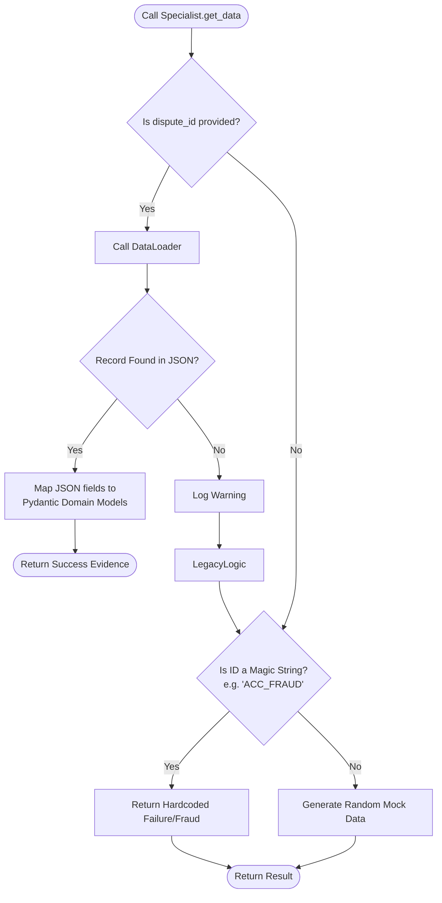
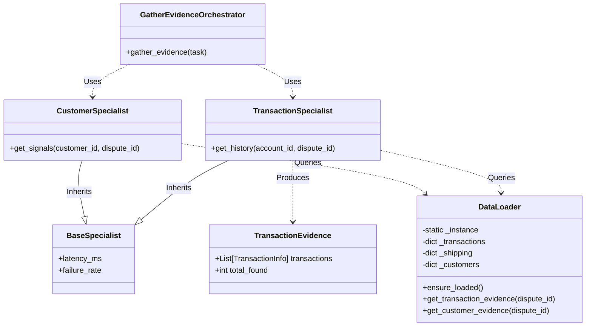

# Deep Dive: Synthetic Data Integration in Evidence Gathering

This document details the architectural changes implemented to transition the Evidence Gathering Phase from a static mock system to a dynamic, data-driven architecture powered by synthetic datasets.

## Executive Summary: The Data-Driven Transformation

Previously, our agents acted on "magic strings" (e.g., if `account_id == "ACC_FRAUD"`, generate fake fraud data). This was insufficient for complex scenarios like **Visa Compelling Evidence 3.0**, which requires correlating data points (IP addresses, device IDs) across historical transactions.

We introduced a **Data Persistence Layer** (via a DataLoader) that injects the synthetic "Ground Truth" directly into the specialist agents.

---

## 1. The New Architecture: Sequence of Events

This Sequence Diagram illustrates exactly what happens when the `gather_evidence` function is called with a specific `dispute_id`.

---

## 2. Deep Dive: The Logic Flow (Decision Making)

We modified the `Specialist` classes to be backward compatible while prioritizing the new synthetic data. This "Hybrid Adapter" pattern allows us to test specific scenarios using IDs, while falling back to random generation for load testing or generic calls.

---

## 3. Structural Analysis: Class Relationships (UML)

This Class Diagram highlights the new dependency injection and the structure of the data models we are populating.

*   **Key Change:** The `Specialist` classes now depend on `DataLoader`.
*   **Key Change:** The `DataLoader` manages the lifecycle of the synthetic data files.

## 4. Implementation Details & Impact

### A. The Data Loader (`data_loader.py`)
We implemented the **Singleton Pattern**.
*   **Why?** The synthetic JSON files are large (megabytes). Reading them from disk for every single test case or API call would drastically slow down the system.
*   **How:** The `DataLoader` checks `if self._data_loaded` before reading. It reads once, parses the JSON into Python dictionaries (Hash Maps), and serves all subsequent requests in **O(1)** time.

### B. The Specialist Refactoring (`specialists.py`)
We moved the adapters from being "Generators" to being "Retrievers".
*   **Mapping:** The synthetic data schema (generated by LLMs) doesn't always 100% match our internal Pydantic models. The Specialists now act as **Anti-Corruption Layers**, translating the raw JSON (`ce3_transactions`) into our strict domain objects (`TransactionInfo`).

### C. The Orchestrator Update (`gather_evidence.py`)
*   **Context Propagation:** The most critical change here was ensuring the `dispute_id` travels from the initial request task all the way down to the function calls:
    `orchestrator(task) -> specialist.method(id, dispute_id)`.

### Conclusion

This change upgrades the system from a "Toy Mock" to a **"High-Fidelity Simulation."** We can now test complex logic—like checking if a customer's IP address in a historical transaction matches their current dispute signal—because the underlying data (the JSON files) maintains those consistent relationships.

