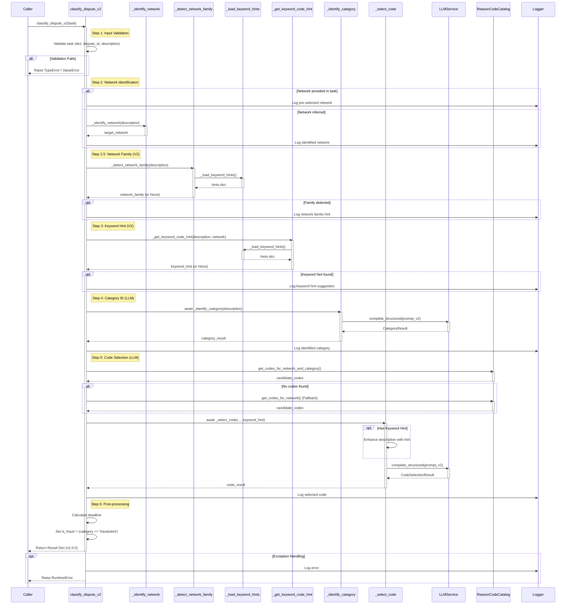

# CLASSIFY V2 Phase Handler - Complete Documentation

**Version:** 2.0.0  
**File:** `backend/phases/classify_v2.py`  
**Feature Request:** FR1.3

## Table of Contents

1. [Overview](#overview)
2. [Key Improvements Over V1](#key-improvements-over-v1)
3. [Architecture](#architecture)
4. [End-to-End Flow Diagram](#end-to-end-flow-diagram)
5. [Sequence Diagram](#sequence-diagram)
6. [Prompt Flow with Examples](#prompt-flow-with-examples)
7. [API Reference](#api-reference)
8. [Data Models](#data-models)
9. [Dependencies](#dependencies)
10. [Error Handling](#error-handling)
11. [Comparison: V1 vs V2](#comparison-v1-vs-v2)

---

## Overview

The `classify_v2.py` module implements the CLASSIFY phase of the dispute resolution workflow. It uses a two-stage LLM-based approach to classify payment disputes into standardized categories and select appropriate reason codes.

### Core Functionality

1. **Network Identification**: Determines payment network (Visa, Mastercard, Amex, etc.)
2. **Network Family Detection**: Detects intermediate signal (authorization, fraud, cardholder_disputes, processing_errors)
3. **Keyword Hint Detection**: Applies rule-based disambiguation for confusable codes
4. **Category Classification**: Uses LLM to classify dispute into one of 8 standardized categories
5. **Code Selection**: Uses LLM to select specific reason code from filtered candidates
6. **Post-processing**: Calculates deadline and sets fraud flag

### Design Philosophy

- **Hybrid Approach**: Combines rule-based keyword matching with LLM reasoning
- **Two-Stage Funnel**: Broad classification → Narrow code selection
- **Enhanced Prompts**: Negative examples and few-shot learning improve accuracy
- **Keyword Guidance**: Rule-based hints prevent common classification errors

---

## Key Improvements Over V1

### 1. **Enhanced Prompt Engineering**
- **Category Prompt**: Includes negative examples (IS NOT) to reduce confusion
- **Code Selection Prompt**: Includes few-shot examples for common confusions
- **Better Edge Case Handling**: Explicit rules for ambiguous scenarios

### 2. **Keyword-Based Guidance System**
- **Network Family Detection**: Intermediate signal for better categorization
- **Keyword Hints**: Rule-based suggestions for confusable codes
- **Disambiguation Rules**: Prevents common mistakes (e.g., authorization vs fraud)

### 3. **Enhanced Metadata**
- Returns `network_family` for analytics
- Returns `keyword_hint_used` flag for debugging
- Returns `classifier_version` for version tracking

### 4. **Improved Logging**
- More detailed logging at each stage
- Logs confidence scores
- Logs keyword hint matches

---

## Architecture

```
┌─────────────────────────────────────────────────────────────┐
│                    classify_dispute_v2()                     │
│                     Main Entry Point                         │
└─────────────────────────────────────────────────────────────┘
                            │
                            ▼
        ┌───────────────────────────────────────┐
        │   Step 1: Input Validation            │
        └───────────────────────────────────────┘
                            │
                            ▼
        ┌───────────────────────────────────────┐
        │   Step 2: Network Identification      │
        │   - Pre-selected (if provided)        │
        │   - Keyword-based (_identify_network) │
        └───────────────────────────────────────┘
                            │
                            ▼
        ┌───────────────────────────────────────┐
        │   Step 2.5: Network Family Detection │
        │   - Keyword scoring                   │
        │   - Returns: authorization/fraud/...  │
        └───────────────────────────────────────┘
                            │
                            ▼
        ┌───────────────────────────────────────┐
        │   Step 3: Keyword Hint Detection      │
        │   - Rule-based matching               │
        │   - Network-specific code suggestions │
        └───────────────────────────────────────┘
                            │
                            ▼
        ┌───────────────────────────────────────┐
        │   Step 4: Category Classification     │
        │   - LLM with V2 prompt                │
        │   - Negative examples included        │
        │   - Returns: CategoryResult           │
        └───────────────────────────────────────┘
                            │
                            ▼
        ┌───────────────────────────────────────┐
        │   Step 5: Code Selection              │
        │   - Filter candidates by network+cat  │
        │   - LLM with V2 prompt + hints        │
        │   - Few-shot examples included        │
        │   - Returns: CodeSelectionResult      │
        └───────────────────────────────────────┘
                            │
                            ▼
        ┌───────────────────────────────────────┐
        │   Step 6: Post-processing             │
        │   - Calculate deadline (+14 days)     │
        │   - Set is_fraud flag                 │
        │   - Build response dictionary         │
        └───────────────────────────────────────┘
                            │
                            ▼
                    Final Result Dict
```

---

## End-to-End Flow Diagram

```
┌─────────────────────────────────────────────────────────────────────────────┐
│                         CLASSIFY_V2 END-TO-END FLOW                          │
│                          Version 2.0.0                                       │
└─────────────────────────────────────────────────────────────────────────────┘

INPUT: task = {
    "dispute_id": str,
    "description": str,
    "network": str (optional),
    "current_date": str (optional, format: "YYYY-MM-DD")
}

┌─────────────────────────────────────────────────────────────────────────────┐
│ STEP 1: INPUT VALIDATION                                                    │
└─────────────────────────────────────────────────────────────────────────────┘
    │
    ├─► Validate task is dict
    ├─► Extract dispute_id (required)
    └─► Extract description (required)
    │
    │ [Validation fails] ──► Raise ValueError/TypeError
    │ [Validation passes] ──► Continue
    │

┌─────────────────────────────────────────────────────────────────────────────┐
│ STEP 2: NETWORK IDENTIFICATION (Hybrid: Explicit > Deterministic)          │
└─────────────────────────────────────────────────────────────────────────────┘
    │
    ├─► Check if task.get("network") exists?
    │   │
    │   ├─► [Yes] Use pre-selected network
    │   │   └─► Log: "Using pre-selected network {network}"
    │   │
    │   └─► [No] Call _identify_network(description)
    │       │
    │       └─► Keyword matching (priority order):
    │           • "amex" / "american express" → "amex"
    │           • "mastercard" → "mastercard"
    │           • "discover" → "discover"
    │           • "visa" → "visa"
    │           • "paypal" → "paypal"
    │           • "gateway" / "quota" → "openapi_gateway_response"
    │           • default → "visa"
    │
    └─► target_network = selected network
    │

┌─────────────────────────────────────────────────────────────────────────────┐
│ STEP 2.5: NETWORK FAMILY DETECTION (NEW in V2)                             │
└─────────────────────────────────────────────────────────────────────────────┘
    │
    ├─► Call _detect_network_family(description)
    │   │
    │   ├─► Load keyword hints from JSON (via _load_keyword_hints())
    │   │   └─► Path: backend/adapters/keyword_hints.json
    │   │       └─► Cache in module-level _KEYWORD_HINTS (lazy loading)
    │   │
    │   ├─► Extract network_family_hints from JSON
    │   │   └─► Expected families: authorization, fraud, cardholder_disputes,
    │   │       processing_errors
    │   │
    │   ├─► Score each family by keyword matches
    │   │   └─► score = sum(1 for kw in keywords if kw in desc_lower)
    │   │
    │   └─► Return family with highest score (or None if no matches)
    │
    │
    ├─► network_family = detected family (or None)
    └─► Log: "Detected network family hint: {network_family}" (if exists)
    │

┌─────────────────────────────────────────────────────────────────────────────┐
│ STEP 3: KEYWORD HINT DETECTION (NEW in V2)                                 │
└─────────────────────────────────────────────────────────────────────────────┘
    │
    ├─► Call _get_keyword_code_hint(description, target_network)
    │   │
    │   ├─► Load keyword hints from JSON (cached)
    │   ├─► Extract disambiguation_rules
    │   │
    │   ├─► Iterate through rule groups:
    │   │   └─► authorization_vs_fraud, refund_distinctions, etc.
    │   │
    │   ├─► For each rule:
    │   │   ├─► Check if keywords match description (case-insensitive)
    │   │   ├─► Check if network exists in rule's codes dict
    │   │   └─► If both match, return:
    │   │       {
    │   │           "code": codes[network],
    │   │           "explanation": rule.explanation,
    │   │           "matched_keywords": [list of matched keywords]
    │   │       }
    │   │
    │   └─► Return None if no match
    │
    │
    ├─► keyword_hint = hint dict (or None)
    └─► Log: "Keyword hint suggests code {code} based on: {keywords}" (if exists)
    │

┌─────────────────────────────────────────────────────────────────────────────┐
│ STEP 4: CATEGORY IDENTIFICATION (LLM with V2 Prompt)                       │
└─────────────────────────────────────────────────────────────────────────────┘
    │
    ├─► Call _identify_category(description)
    │   │
    │   ├─► Get LLM service (get_default_service())
    │   │
    │   ├─► Render prompt template:
    │   │   └─► Template: DisputeClassifier_identify_category_v2.j2
    │   │       │
    │   │       ├─► Includes negative examples for each category
    │   │       │   (e.g., "IS NOT: ... → category")
    │   │       │
    │   │       ├─► Categories with examples:
    │   │       │   • fraudulent
    │   │       │   • product_not_received
    │   │       │   • duplicate
    │   │       │   • subscription_canceled
    │   │       │   • product_unacceptable
    │   │       │   • credit_not_processed
    │   │       │   • unrecognized
    │   │       │   • general
    │   │       │
    │   │       └─► Classification rules with edge cases
    │   │
    │   ├─► Call LLM with structured output:
    │   │   └─► response_model = CategoryResult
    │   │       {
    │   │           "category": str,
    │   │           "reasoning": str
    │   │       }
    │   │
    │   └─► Return CategoryResult
    │
    │
    ├─► category_result = CategoryResult
    ├─► target_category = category_result.category
    └─► Log: "Identified category as {target_category}"
    │

┌─────────────────────────────────────────────────────────────────────────────┐
│ STEP 5: CODE SELECTION (LLM with V2 Prompt + Hints)                        │
└─────────────────────────────────────────────────────────────────────────────┘
    │
    ├─► Get reason code catalog (get_reason_code_catalog())
    │   └─► Loads from: dispute-schema/reason_codes_catalog.csv
    │
    ├─► Filter candidate codes:
    │   ├─► Primary: catalog.get_codes_for_network_and_category(
    │   │           target_network, target_category)
    │   │
    │   └─► Fallback (if empty):
    │       └─► catalog.get_codes_for_network(target_network)
    │           │
    │           └─► [If still empty] ──► Raise ValueError
    │
    ├─► Enhance description with keyword hint (if exists):
    │   │
    │   └─► enhanced_description = description + 
    │       "\n\n[System hint: Based on keywords '{matched_keywords}', 
    │        consider code {code} - {explanation}]"
    │
    ├─► Call _select_code(
    │       enhanced_description, 
    │       target_network, 
    │       target_category, 
    │       candidate_codes, 
    │       keyword_hint)
    │   │
    │   ├─► Render prompt template:
    │   │   └─► Template: DisputeClassifier_select_code_v2.j2
    │   │       │
    │   │       ├─► Includes few-shot examples:
    │   │       │   • Authorization vs Fraud distinctions
    │   │       │   • Refund-related distinctions
    │   │       │   • Duplicate vs Paid by Other Means
    │   │       │   • Product Issues
    │   │       │
    │   │       ├─► Shows candidate codes list
    │   │       │
    │   │       └─► Confidence scoring guidelines
    │   │
    │   ├─► Call LLM with structured output:
    │   │   └─► response_model = CodeSelectionResult
    │   │       {
    │   │           "reason_code": str,
    │   │           "confidence": float (0.0-1.0),
    │   │           "reasoning": str
    │   │       }
    │   │
    │   └─► Return CodeSelectionResult
    │
    │
    ├─► code_result = CodeSelectionResult
    └─► Log: "Selected code {reason_code} (confidence: {confidence})"
    │

┌─────────────────────────────────────────────────────────────────────────────┐
│ STEP 6: POST-PROCESSING                                                     │
└─────────────────────────────────────────────────────────────────────────────┘
    │
    ├─► Calculate deadline:
    │   ├─► Extract current_date from task (if provided)
    │   ├─► Parse as datetime (format: "YYYY-MM-DD")
    │   ├─► Fallback to datetime.now() if invalid/absent
    │   └─► deadline = (current_date + timedelta(days=14)).strftime("%Y-%m-%d")
    │
    ├─► Determine fraud flag:
    │   └─► is_fraud = (target_category == "fraudulent")
    │
    └─► Build response dictionary
    │

┌─────────────────────────────────────────────────────────────────────────────┐
│ OUTPUT: Classification Result Dictionary                                    │
└─────────────────────────────────────────────────────────────────────────────┘

RETURN: {
    "reason_code": str,                      # Selected reason code
    "network": str,                          # Payment network
    "category": str,                         # Unified category
    "network_family": str | None,            # NEW: Detected family hint
    "is_fraud": bool,                        # Fraud indicator
    "deadline": str,                         # Response deadline (YYYY-MM-DD)
    "classification_confidence": float,      # LLM confidence (0.0-1.0)
    "classification_reasoning": str,         # Combined reasoning
    "keyword_hint_used": bool,               # NEW: Whether hint was applied
    "classifier_version": "2.0.0"           # NEW: Version identifier
}

┌─────────────────────────────────────────────────────────────────────────────┐
│ ERROR HANDLING                                                              │
└─────────────────────────────────────────────────────────────────────────────┘
    │
    └─► Any exception ──► 
        ├─► Log error with dispute_id and exception details
        └─► Raise RuntimeError(f"Classification failed for {dispute_id}: {error}")
```

---

## Sequence Diagram



---

## Prompt Flow with Examples

This section shows the complete flow from input to output for both classification stages.

---

### Example 1: Fraud Dispute

#### Initial Input

```python
task = {
    "dispute_id": "DISP-2024-001",
    "description": "I didn't make this purchase. My card was stolen last week and someone used it to buy items I never ordered. I don't recognize this merchant at all.",
    "network": "visa",  # Pre-selected
    "current_date": "2024-01-15"
}
```

---

#### Stage 1: Category Identification

**Input to Prompt: `DisputeClassifier_identify_category_v2.j2`**

The rendered prompt sent to the LLM:

```
You are an expert Dispute Classification AI specializing in payment card chargebacks.

Your task is to analyze the following dispute description and classify it into one of the standardized categories.

Dispute Description:
"""
I didn't make this purchase. My card was stolen last week and someone used it to buy items I never ordered. I don't recognize this merchant at all.
"""

### Standardized Categories with Examples:

1. **fraudulent**: The cardholder claims they did not participate in or authorize the transaction.
   - IS: "I didn't make this purchase", "My card was stolen", "I don't recognize this merchant", "Someone used my card without permission"
   - IS NOT: "They charged me more than I agreed to" (→ general), "My card was declined" (→ general)

2. **product_not_received**: The cardholder paid but never received the goods or services.
   - IS: "My order never arrived", "I paid but got nothing", "Package was never delivered"
   - IS NOT: "I received it but it was broken" (→ product_unacceptable), "I returned it and want refund" (→ credit_not_processed)

[... rest of categories with IS/IS NOT examples ...]

### Classification Rules:
1. Read the ENTIRE description before classifying.
2. Look for EXPLICIT indicators, not assumptions.
3. If "declined", "refused", "wouldn't go through" → likely **general** (authorization issue), NOT fraudulent.
4. If "didn't authorize" without context of card theft/loss → consider **general** (authorization amount dispute).
5. If "returned" or "sent back" goods → **credit_not_processed**, NOT product_unacceptable.
6. If ambiguous between fraud and authorization → prefer **general** unless explicit fraud language.

Output the result in JSON format:
{
    "category": "category_name",
    "reasoning": "brief explanation"
}
```

**LLM Output (Structured Response):**

```json
{
    "category": "fraudulent",
    "reasoning": "Explicit fraud indicators: card was stolen, cardholder didn't make purchase, doesn't recognize merchant. This clearly fits the fraudulent category with explicit denial of transaction participation."
}
```

**Python Object (Pydantic Model):**

```python
CategoryResult(
    category="fraudulent",
    reasoning="Explicit fraud indicators: card was stolen, cardholder didn't make purchase, doesn't recognize merchant. This clearly fits the fraudulent category with explicit denial of transaction participation."
)
```

---

#### Intermediate Processing

- **Network**: `"visa"` (from task)
- **Category**: `"fraudulent"` (from Stage 1)
- **Network Family Detection**: Detects `"fraud"` family (keywords: "stolen", "didn't make", "don't recognize")
- **Keyword Hint Detection**: Matches `prefer_fraud` rule → suggests code `"10.4"` for Visa

**Keyword Hint Applied:**
```python
keyword_hint = {
    "code": "10.4",
    "explanation": "Cardholder explicitly denies making the transaction",
    "matched_keywords": ["didn't make", "stolen", "don't recognize"]
}
```

**Candidate Codes Retrieved:**
```python
candidate_codes = [
    {"code": "10.4", "description": "Cardholder denies participation in the transaction"},
    {"code": "10.5", "description": "Cardholder disputes quality of goods or services"},
    # ... other fraudulent category codes for Visa
]
```

---

#### Stage 2: Code Selection

**Input to Prompt: `DisputeClassifier_select_code_v2.j2`**

The rendered prompt sent to the LLM:

```
You are a Payment Dispute Resolution Specialist with expertise in Visa chargeback reason codes.

Your task is to select the specific Visa reason code that best applies to the dispute, given the user's description and a pre-filtered list of valid candidates.

Dispute Description:
"""
I didn't make this purchase. My card was stolen last week and someone used it to buy items I never ordered. I don't recognize this merchant at all.

[System hint: Based on keywords '['didn\'t make', 'stolen', 'don\'t recognize']', consider code 10.4 - Cardholder explicitly denies making the transaction]
"""

Target Category: fraudulent

### Candidate Reason Codes:

- **10.4**: Cardholder denies participation in the transaction
- **10.5**: Cardholder disputes quality of goods or services
- **10.6**: Cardholder disputes authorization

### Reference Examples for Common Confusions:

**Authorization vs Fraud (Visa):**
- "Card was DECLINED at checkout" → Authorization code (11.2) - card refused at point of sale
- "I DIDN'T MAKE this purchase" → Fraud code (10.4) - cardholder denies transaction
- "Charged MORE than I agreed" → Authorization code (12.5) - amount exceeds authorization

**Refund-Related Distinctions:**
- "RETURNED item, no refund yet" → 13.6 - goods returned, credit not processed
- "CANCELLED order before shipping" → 13.7 - cancelled merchandise/services
- "Never got CREDIT promised" → 13.6 - credit not processed (general)

**Duplicate vs Paid by Other Means:**
- "Charged TWICE for same item" → 12.6.1 - duplicate processing
- "Paid with CASH, also charged card" → 12.6.2 - paid by other means

**Product Issues:**
- "Item NEVER arrived" → 13.1 - goods not received
- "Item arrived BROKEN/WRONG" → 13.3 - defective or not as described

### Selection Instructions:
1. You MUST select one code from the Candidate Reason Codes list above.
2. Do NOT invent a code or select one not in the list.
3. Match the SPECIFIC situation described, not just the general category.
4. Pay attention to keywords: "declined" ≠ "unauthorized", "returned" ≠ "not received".
5. Assign confidence based on how clearly the description matches the code:
   - 0.95+: Exact match with clear indicators
   - 0.85-0.94: Strong match with minor ambiguity
   - 0.70-0.84: Reasonable match but could be another code
   - <0.70: Uncertain, multiple codes could apply

Output the result in JSON format:
{
    "reason_code": "selected_code",
    "confidence": 0.95,
    "reasoning": "explanation for why this specific code fits best"
}
```

**LLM Output (Structured Response):**

```json
{
    "reason_code": "10.4",
    "confidence": 0.97,
    "reasoning": "Exact match for code 10.4. The description explicitly states the cardholder did not make the purchase, the card was stolen, and the merchant is unrecognized. The system hint confirms this is the appropriate code for cardholder denying participation. Clear fraud indicators align perfectly with this reason code."
}
```

**Python Object (Pydantic Model):**

```python
CodeSelectionResult(
    reason_code="10.4",
    confidence=0.97,
    reasoning="Exact match for code 10.4. The description explicitly states the cardholder did not make the purchase, the card was stolen, and the merchant is unrecognized. The system hint confirms this is the appropriate code for cardholder denying participation. Clear fraud indicators align perfectly with this reason code."
)
```

---

#### Final Output

```python
{
    "reason_code": "10.4",
    "network": "visa",
    "category": "fraudulent",
    "network_family": "fraud",
    "is_fraud": True,
    "deadline": "2024-01-29",
    "classification_confidence": 0.97,
    "classification_reasoning": "Category: Explicit fraud indicators: card was stolen, cardholder didn't make purchase, doesn't recognize merchant. This clearly fits the fraudulent category with explicit denial of transaction participation. | Code: Exact match for code 10.4. The description explicitly states the cardholder did not make the purchase, the card was stolen, and the merchant is unrecognized. The system hint confirms this is the appropriate code for cardholder denying participation. Clear fraud indicators align perfectly with this reason code.",
    "keyword_hint_used": True,
    "classifier_version": "2.0.0"
}
```

---

### Example 2: Authorization Issue (Declined Card) - Confusable with Fraud

#### Initial Input

```python
task = {
    "dispute_id": "DISP-2024-002",
    "description": "My card was declined at the store, but I see a charge on my statement anyway. The transaction didn't go through at checkout, but they charged me.",
    # network not provided - will be inferred
    "current_date": "2024-01-15"
}
```

---

#### Stage 1: Category Identification

**LLM Output:**

```json
{
    "category": "general",
    "reasoning": "Key indicator is 'declined' and 'didn't go through at checkout' - this is an authorization/processing error, not fraud. The cardholder acknowledges being at the store but the transaction was declined yet still charged. This fits the general category for authorization issues per rule #3."
}
```

---

#### Intermediate Processing

- **Network**: `"visa"` (inferred - default fallback)
- **Category**: `"general"` (from Stage 1)
- **Network Family Detection**: Detects `"authorization"` family (keywords: "declined", "didn't go through")
- **Keyword Hint Detection**: Matches `prefer_authorization` rule → suggests code `"11.2"` for Visa

**Keyword Hint Applied:**
```python
keyword_hint = {
    "code": "11.2",
    "explanation": "Card declined at point of sale - authorization issue, not fraud",
    "matched_keywords": ["declined", "didn't go through"]
}
```

---

#### Stage 2: Code Selection

**LLM Output:**

```json
{
    "reason_code": "11.2",
    "confidence": 0.93,
    "reasoning": "Perfect match for 11.2 - authorization issue. The description explicitly states 'card was declined' and 'transaction didn't go through at checkout' but charge still appeared. This is exactly the scenario described in the few-shot example and matches the system hint. The key distinction from fraud is that the cardholder was present at the store and the issue is with authorization processing, not unauthorized use."
}
```

---

#### Final Output

```python
{
    "reason_code": "11.2",
    "network": "visa",
    "category": "general",
    "network_family": "authorization",
    "is_fraud": False,
    "deadline": "2024-01-29",
    "classification_confidence": 0.93,
    "classification_reasoning": "Category: Key indicator is 'declined' and 'didn't go through at checkout' - this is an authorization/processing error, not fraud. The cardholder acknowledges being at the store but the transaction was declined yet still charged. This fits the general category for authorization issues per rule #3. | Code: Perfect match for 11.2 - authorization issue. The description explicitly states 'card was declined' and 'transaction didn't go through at checkout' but charge still appeared. This is exactly the scenario described in the few-shot example and matches the system hint. The key distinction from fraud is that the cardholder was present at the store and the issue is with authorization processing, not unauthorized use.",
    "keyword_hint_used": True,
    "classifier_version": "2.0.0"
}
```

---

## API Reference

### Main Function

#### `classify_dispute_v2(task: dict[str, Any]) -> dict[str, Any]`

Execute the CLASSIFY phase V2 with enhanced prompts and hints.

**Parameters:**
- `task` (dict): Task dictionary containing:
  - `dispute_id` (str, required): Unique identifier for the dispute
  - `description` (str, required): Dispute description text
  - `network` (str, optional): Pre-selected payment network. If not provided, will be inferred from description
  - `current_date` (str, optional): Current date in "YYYY-MM-DD" format. Defaults to current date

**Returns:**
- `dict`: Classification result dictionary with keys:
  - `reason_code` (str): Selected reason code
  - `network` (str): Payment network
  - `category` (str): Unified category
  - `network_family` (str | None): Detected network family hint
  - `is_fraud` (bool): Fraud indicator (True if category is "fraudulent")
  - `deadline` (str): Response deadline in "YYYY-MM-DD" format (14 days from current_date)
  - `classification_confidence` (float): LLM confidence score (0.0-1.0)
  - `classification_reasoning` (str): Combined reasoning from both stages
  - `keyword_hint_used` (bool): Whether a keyword hint was applied
  - `classifier_version` (str): Version identifier ("2.0.0")

**Raises:**
- `TypeError`: If task is not a dictionary
- `ValueError`: If required fields are missing or no reason codes found
- `RuntimeError`: If classification fails for any reason

**Example:**
```python
task = {
    "dispute_id": "DISP-001",
    "description": "I didn't make this purchase. My card was stolen.",
    "network": "visa",
    "current_date": "2024-01-15"
}

result = await classify_dispute_v2(task)
# Returns classification result dictionary
```

---

### Internal Functions

#### `_identify_network(description: str) -> str`

Identify payment network from description using keyword matching.

**Parameters:**
- `description` (str): Dispute description

**Returns:**
- `str`: Network identifier ("visa", "amex", "mastercard", "discover", "paypal", "openapi_gateway_response")

**Note:** Falls back to "visa" if no specific network is mentioned.

---

#### `_detect_network_family(description: str) -> Optional[str]`

Detect likely network family from keywords in description.

**Parameters:**
- `description` (str): Dispute description

**Returns:**
- `Optional[str]`: One of "authorization", "fraud", "cardholder_disputes", "processing_errors", or None

---

#### `_get_keyword_code_hint(description: str, network: str) -> Optional[Dict[str, str]]`

Check if description matches any disambiguation rule.

**Parameters:**
- `description` (str): Dispute description
- `network` (str): Payment network

**Returns:**
- `Optional[Dict[str, str]]`: Hint dictionary with keys:
  - `code` (str): Suggested reason code
  - `explanation` (str): Explanation for the hint
  - `matched_keywords` (List[str]): List of matched keywords
  - Or `None` if no match found

---

#### `_load_keyword_hints() -> Dict[str, Any]`

Load keyword disambiguation hints from JSON file (with caching).

**Returns:**
- `Dict[str, Any]`: Keyword hints dictionary loaded from `backend/adapters/keyword_hints.json`

**Note:** Uses module-level caching to avoid repeated file reads.

---

#### `async _identify_category(description: str) -> CategoryResult`

Identify the unified category using LLM with V2 prompt.

**Parameters:**
- `description` (str): Dispute description

**Returns:**
- `CategoryResult`: Pydantic model with `category` and `reasoning` fields

---

#### `async _select_code(description: str, network: str, category: str, candidate_codes: List[Dict[str, str]], keyword_hint: Optional[Dict[str, str]] = None) -> CodeSelectionResult`

Select specific reason code from filtered candidates using V2 prompt.

**Parameters:**
- `description` (str): Dispute description (may be enhanced with keyword hint)
- `network` (str): Payment network
- `category` (str): Unified category
- `candidate_codes` (List[Dict[str, str]]): List of candidate code dictionaries with keys: `code`, `description`, `category`
- `keyword_hint` (Optional[Dict[str, str]]): Optional keyword hint dictionary

**Returns:**
- `CodeSelectionResult`: Pydantic model with `reason_code`, `confidence`, and `reasoning` fields

---

## Data Models

### `CategoryResult`

Pydantic model for category identification output.

**Fields:**
- `category` (str): Selected standardized category
- `reasoning` (str): Explanation for the category choice

**Example:**
```python
CategoryResult(
    category="fraudulent",
    reasoning="Explicit fraud indicators: card was stolen..."
)
```

---

### `CodeSelectionResult`

Pydantic model for reason code selection output.

**Fields:**
- `reason_code` (str): Selected reason code from the candidate list
- `confidence` (float): Confidence score between 0.0 and 1.0
- `reasoning` (str): Explanation for the specific code selection

**Example:**
```python
CodeSelectionResult(
    reason_code="10.4",
    confidence=0.97,
    reasoning="Exact match for code 10.4..."
)
```

---

## Dependencies

### External Files

1. **Keyword Hints JSON**
   - **Path**: `backend/adapters/keyword_hints.json`
   - **Purpose**: Contains disambiguation rules and network family hints
   - **Structure**:
     - `disambiguation_rules`: Rule groups for confusable codes
     - `network_family_hints`: Keywords for family detection

2. **Reason Code Catalog CSV**
   - **Path**: `dispute-schema/reason_codes_catalog.csv`
   - **Purpose**: Contains all valid reason codes by network and category
   - **Accessed via**: `get_reason_code_catalog()` adapter

3. **Prompt Templates (Jinja2)**
   - **Category Template**: `prompts/DisputeClassifier_identify_category_v2.j2`
   - **Code Selection Template**: `prompts/DisputeClassifier_select_code_v2.j2`
   - **Rendered via**: `render_prompt()` utility

### Python Dependencies

- `pydantic`: For structured output models
- `utils.llm_service`: LLM service interface
- `utils.prompt_service`: Prompt rendering utility
- `backend.adapters.reason_code_catalog`: Reason code catalog adapter
- Standard library: `datetime`, `json`, `logging`, `pathlib`, `typing`

---

## Error Handling

### Input Validation Errors

```python
# TypeError: task must be a dictionary
classify_dispute_v2("not a dict")

# ValueError: task must contain 'dispute_id'
classify_dispute_v2({"description": "..."})

# ValueError: task must contain 'description'
classify_dispute_v2({"dispute_id": "DISP-001"})
```

### Runtime Errors

```python
# ValueError: No reason codes found for network {network}
# Occurs when catalog has no codes for the identified network

# RuntimeError: Classification failed for dispute {dispute_id}: {error}
# Wraps any exception that occurs during classification
# Original error is logged with full traceback
```

### Error Logging

All errors are logged with:
- Dispute ID for traceability
- Full exception details with traceback
- Error message in the raised exception

---

## Comparison: V1 vs V2

### Feature Comparison

| Feature | V1 | V2 |
|---------|----|----|
| **Category Prompt** | Basic category definitions | + Negative examples (IS NOT) |
| **Code Selection Prompt** | Basic code list | + Few-shot examples for common confusions |
| **Keyword Hints** | ❌ None | ✅ Rule-based disambiguation |
| **Network Family Detection** | ❌ None | ✅ Intermediate signal |
| **Enhanced Description** | Raw description only | + System hints when keyword matches |
| **Return Fields** | Basic fields | + network_family, keyword_hint_used, classifier_version |
| **Logging** | Basic logging | + Confidence scores, hint matches |

### Code Differences

#### Network Identification

**V1:**
```python
if "gateway" in desc_lower or "quota" in desc_lower or "unauthorized" in desc_lower:
    return "openapi_gateway_response"
```

**V2:**
```python
if "gateway" in desc_lower or "quota" in desc_lower:
    return "openapi_gateway_response"
```
*Note: "unauthorized" check removed (handled by keyword hints)*

#### New Functions in V2

1. `_load_keyword_hints()`: Lazy-loads keyword hints with caching
2. `_detect_network_family()`: Detects network family from keywords
3. `_get_keyword_code_hint()`: Applies disambiguation rules

#### Enhanced Code Selection

**V1:**
```python
async def _select_code(description: str, network: str, category: str, candidate_codes: List[Dict[str, str]]) -> CodeSelectionResult:
```

**V2:**
```python
async def _select_code(description: str, network: str, category: str, candidate_codes: List[Dict[str, str]], keyword_hint: Optional[Dict[str, str]] = None) -> CodeSelectionResult:
    # Enhances description with keyword hint if provided
    if keyword_hint:
        enhanced_description = f"{description}\n\n[System hint: ...]"
```

### Return Schema Differences

**V1 Returns:**
```python
{
    "reason_code": str,
    "network": str,
    "category": str,
    "is_fraud": bool,
    "deadline": str,
    "classification_confidence": float,
    "classification_reasoning": str
}
```

**V2 Returns (Additional Fields):**
```python
{
    # ... all V1 fields ...
    "network_family": str | None,      # NEW
    "keyword_hint_used": bool,          # NEW
    "classifier_version": "2.0.0"      # NEW
}
```

### Migration Notes

**Breaking Changes:**
- Return schema includes new fields (backward compatible if consumers ignore new fields)
- Function name changed: `classify_dispute()` → `classify_dispute_v2()`

**Non-Breaking:**
- Same input schema
- Same core logic flow
- Same error handling approach

---

## Summary

The CLASSIFY V2 phase handler represents a significant improvement over V1 with:

1. **Better Accuracy**: Negative examples and few-shot learning reduce classification errors
2. **Keyword Guidance**: Rule-based hints prevent common mistakes (e.g., authorization vs fraud)
3. **Enhanced Observability**: Network family and hint usage flags aid debugging
4. **Backward Compatible**: Core API remains the same, only enhanced

The two-stage funnel approach (Category → Code) combined with keyword-based guidance creates a robust classification system that handles edge cases effectively while maintaining high accuracy.

