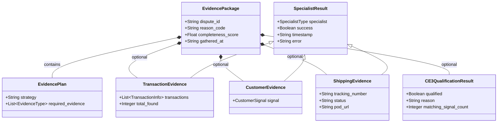
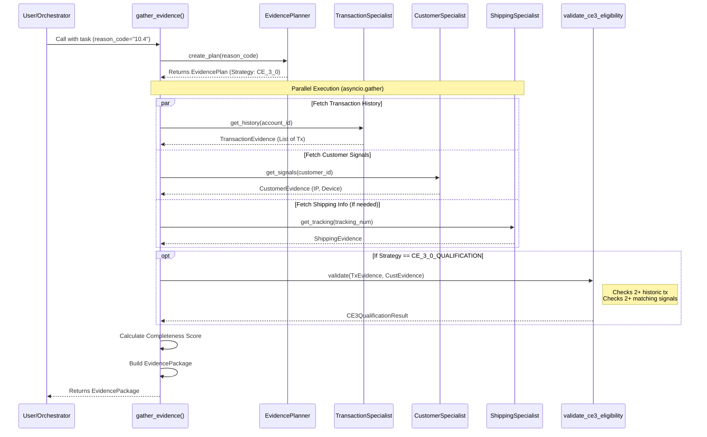

# Evidence Gathering Phase (Phase 2) Implementation Deep Dive

This document captures the implementation details, architectural decisions, and visual explanations for the Evidence Gathering Phase of the Dispute Chatbot.

## 1. Overview

The Evidence Gathering Phase (Phase 2) is responsible for autonomously collecting relevant data from various internal systems (Transaction History, Customer Profiles, Shipping/Logistics) based on the dispute reason code. It uses a **Planner-Executor-Aggregator** pattern to decouple decision-making from execution.

## 2. Data Architecture (Class Diagram)

The system relies on strict Pydantic models to ensure data integrity. The `EvidencePackage` serves as the root container.

### Key Components

*   **`EvidencePlan`**: The blueprint. Defines *what* to fetch (e.g., "Strategy: CE 3.0").
*   **`SpecialistResult`**: The polymorphic base class for all agent outputs. Ensures every result has `success` and `error` fields.
*   **`CE3QualificationResult`**: Encapsulates the specific business logic for "Compelling Evidence 3.0" (Visa rule), keeping raw data separate from derived insights.

## 3. Execution Flow (Sequence Diagram)

The orchestration logic in `gather_evidence.py` follows this sequence:

### Flow Highlights

1.  **Planning First:** The system first consults `EvidencePlanner`. This makes it easy to add new strategies (e.g., for different reason codes) without changing the execution engine.
2.  **Async/Parallel Execution:** Calls to `TransactionSpecialist`, `CustomerSpecialist`, etc., happen simultaneously using `asyncio.gather`.
3.  **Post-Processing:** Specific logic (like CE 3.0 validation) is applied *after* data collection but *before* returning the final package.

## 4. Implementation Files

*   **Models:** `lesson-18/dispute-chatbot/backend/phases/evidence_models.py`
*   **Adapters (Mocks):** `lesson-18/dispute-chatbot/backend/adapters/specialists.py`
*   **Orchestrator:** `lesson-18/dispute-chatbot/backend/phases/gather_evidence.py`
*   **Tests:** `lesson-18/dispute-chatbot/tests/test_gather_evidence.py`

## 5. Next Steps

*   Integrate `LLMService` into the Planner for more dynamic, context-aware planning (currently rule-based).
*   Connect the `EvidencePackage` to the Phase 3 (Argument Builder) input.

