# Flow Diagrams: Merchant Dispute Resolution Chatbot

**Document ID:** design/01_flow_diagrams
**Version:** 1.0.0
**Last Updated:** 2025-12-08
**Status:** Phase 0 Foundation

---

## 1. Overview

This document provides visual representations of the system flows through sequence diagrams, state diagrams, and data flow diagrams. These complement the System Context document (00_system_context.md).

---

## 2. Main Dispute Resolution Sequence Diagram

### 2.1 Happy Path - End-to-End Flow

```mermaid
sequenceDiagram
    autonumber
    participant M as Merchant
    participant UI as Chainlit UI
    participant SM as State Machine<br/>Orchestrator
    participant HEG as Hierarchical<br/>Evidence Gatherer
    participant JP as LLM Judge<br/>Panel
    participant VT as VROL<br/>Translator
    participant VISA as Visa VROL<br/>(Mock)
    
    Note over M,VISA: Phase 1: CLASSIFY
    M->>UI: Enter dispute ID (e.g., "DIS-2025-001234")
    UI->>SM: Initiate dispute workflow
    SM->>SM: Classify dispute type
    SM-->>UI: "Dispute classified as Fraud (10.4)"
    UI-->>M: Display reason code & deadline
    
    Note over M,VISA: Phase 2: GATHER
    SM->>HEG: Start evidence gathering
    activate HEG
    
    par Parallel Specialist Agents
        HEG->>HEG: Transaction Specialist
        Note right of HEG: Query Stripe/Square
        HEG->>HEG: Shipping Specialist
        Note right of HEG: Query FedEx/UPS
        HEG->>HEG: Customer Specialist
        Note right of HEG: Analyze CE 3.0 history
    end
    
    HEG-->>SM: Evidence package assembled
    deactivate HEG
    
    SM-->>UI: Present gathered evidence
    UI-->>M: "We found 5 evidence items. Review?"
    M->>UI: Confirm or upload additional docs
    
    Note over M,VISA: Phase 3: VALIDATE
    SM->>JP: Evaluate evidence package
    activate JP
    
    par Synchronous Judge Evaluations
        JP->>JP: Evidence Quality Judge
        Note right of JP: Score: 0.85 (>0.8 threshold)
        JP->>JP: Fabrication Detection Judge
        Note right of JP: Score: 0.02 (<0.95 threshold)
        JP->>JP: Dispute Validity Judge
        Note right of JP: Score: 0.78 (>0.7 threshold)
    end
    
    JP-->>SM: All judges PASS
    deactivate JP
    
    SM-->>UI: Validation complete
    UI-->>M: "Evidence validated. Ready to submit?"
    M->>UI: Confirm submission
    
    Note over M,VISA: Phase 4: SUBMIT
    SM->>VT: Convert to VROL format
    VT->>VT: Map internal → VROL schema
    VT-->>SM: VROL payload ready
    
    SM->>VISA: Submit dispute response
    VISA-->>SM: Case ID: VROL-789456
    
    SM-->>UI: Submission confirmed
    UI-->>M: "Submitted! Case ID: VROL-789456"
    
    Note over M,VISA: Phase 5: MONITOR
    loop Every 4 hours
        SM->>VISA: Poll status
        VISA-->>SM: Status: PENDING_REVIEW
    end
    
    VISA->>SM: Resolution: MERCHANT_WIN
    SM-->>UI: Resolution received
    UI-->>M: "🎉 Dispute won! $1,250 credited"
```

---

## 3. State Machine Diagram

### 3.1 Dispute Workflow States

---

## 4. Hierarchical Evidence Gatherer Flow

### 4.1 Planner-Specialist Architecture

### 4.2 Evidence Gathering Sequence

---

## 5. LLM Judge Panel Flow

### 5.1 Three-Judge Validation Architecture

```mermaid
flowchart TB
    subgraph Input["Input"]
        EP[Evidence Package]
    end
    
    subgraph JP["LLM Judge Panel"]
        subgraph J1["Evidence Quality Judge"]
            EQ[Evaluator]
            EQT{Score ≥ 0.8?}
        end
        
        subgraph J2["Fabrication Detection Judge"]
            FD[Detector]
            FDT{Score < 0.95?}
        end
        
        subgraph J3["Dispute Validity Judge"]
            DV[Validator]
            DVT{Score ≥ 0.7?}
        end
        
        AGG[Verdict<br/>Aggregator]
    end
    
    subgraph Output["Output"]
        PASS[✅ PASS<br/>Proceed to Submit]
        WARN[⚠️ WARN<br/>Review recommended]
        BLOCK[🛑 BLOCK<br/>Escalate to human]
    end
    
    EP --> EQ
    EP --> FD
    EP --> DV
    
    EQ --> EQT
    FD --> FDT
    DV --> DVT
    
    EQT -->|Yes| AGG
    EQT -->|No| AGG
    FDT -->|Yes| AGG
    FDT -->|No| AGG
    DVT -->|Yes| AGG
    DVT -->|No| AGG
    
    AGG -->|All Pass| PASS
    AGG -->|DV Fail Only| WARN
    AGG -->|EQ Fail or FD Fail| BLOCK
    
    style PASS fill:#c8e6c9
    style WARN fill:#fff9c4
    style BLOCK fill:#ffcdd2
```

### 5.2 Judge Evaluation Sequence

---

## 6. Network Translation Flow

### 6.1 Internal Schema to VROL Conversion

### 6.2 VROL Submission Sequence

```mermaid
sequenceDiagram
    autonumber
    participant SM as State Machine
    participant VT as VROL Translator
    participant S3 as S3 Storage
    participant VISA as Visa VROL API
    participant EL as Explainability<br/>Layer
    
    SM->>VT: Submit dispute response
    
    Note over VT: Map internal fields<br/>to VROL schema
    
    VT->>VT: Validate required fields
    VT->>VT: Map reason code → VROL condition
    VT->>VT: Encode evidence documents
    
    VT->>S3: Upload evidence files
    S3-->>VT: Document URLs
    
    VT->>VT: Build VROL payload
    
    VT->>VISA: POST /disputes/{id}/response
    
    alt Success
        VISA-->>VT: 200 OK, Case ID: VROL-789456
        VT->>EL: Log submission success
        VT-->>SM: SubmissionResult(success)
    else Network Error
        VISA-->>VT: 503 Service Unavailable
        VT->>VT: Retry (1s, 2s, 4s)
        VT->>VISA: Retry POST
        VISA-->>VT: 200 OK
        VT-->>SM: SubmissionResult(success, retried)
    else Validation Error
        VISA-->>VT: 400 Bad Request
        VT->>EL: Log validation failure
        VT-->>SM: SubmissionResult(failure, errors)
    end
```

---

## 7. Explainability Layer Flow

### 7.1 Four Pillars Architecture

### 7.2 Audit Trail Generation Sequence

---

## 8. Error Handling & Escalation Flow

### 8.1 Escalation Decision Tree

```mermaid
flowchart TB
    subgraph Trigger["Escalation Triggers"]
        T1[Judge BLOCK<br/>Fabrication detected]
        T2[Deadline <24h<br/>Insufficient evidence]
        T3[Max retries<br/>exceeded]
        T4[Classification<br/>failed]
        T5[User requested<br/>human help]
    end
    
    subgraph Decision["Escalation Decision"]
        ED{Escalation<br/>Type?}
    end
    
    subgraph Actions["Escalation Actions"]
        A1[📧 Email ops team]
        A2[💬 Slack alert]
        A3[📋 Create ticket]
        A4[📞 Priority callback]
    end
    
    subgraph Queue["Escalation Queue"]
        Q1[Low Priority<br/>24h SLA]
        Q2[Medium Priority<br/>4h SLA]
        Q3[High Priority<br/>1h SLA]
        Q4[Critical<br/>Immediate]
    end
    
    T1 --> ED
    T2 --> ED
    T3 --> ED
    T4 --> ED
    T5 --> ED
    
    ED -->|Fabrication| Q4
    ED -->|Deadline| Q3
    ED -->|Retry fail| Q2
    ED -->|Classification| Q2
    ED -->|User request| Q1
    
    Q4 --> A1 & A2 & A4
    Q3 --> A1 & A2
    Q2 --> A1 & A3
    Q1 --> A3
    
    style Q4 fill:#ffcdd2
    style Q3 fill:#fff9c4
    style Q2 fill:#c8e6c9
    style Q1 fill:#e3f2fd
```

### 8.2 Retry & Recovery Sequence

---

## 9. Data Flow Diagram

### 9.1 Complete Data Flow

```mermaid
flowchart TB
    subgraph Users["Users"]
        M[👤 Merchant]
        A[🔍 Auditor]
        O[👔 Ops Lead]
    end
    
    subgraph Chatbot["Dispute Resolution Chatbot"]
        UI[Chainlit UI]
        SM[State Machine]
        HEG[Evidence Gatherer]
        JP[Judge Panel]
        VT[VROL Translator]
        EL[Explainability Layer]
    end
    
    subgraph External["External Systems"]
        PP[Payment Platforms]
        SC[Shipping Carriers]
        LLM[LLM Provider]
        VISA[Visa VROL]
    end
    
    subgraph Storage["Storage"]
        R[(Redis)]
        S3[(S3)]
        TS[(TimescaleDB)]
        PG[(PostgreSQL)]
    end
    
    %% User flows
    M <-->|Chat messages| UI
    A -->|Audit queries| EL
    O -->|Escalation mgmt| SM
    
    %% Internal flows
    UI <--> SM
    SM <--> HEG
    SM <--> JP
    SM <--> VT
    SM --> EL
    HEG --> EL
    JP --> EL
    VT --> EL
    
    %% External flows
    HEG -->|Transaction queries| PP
    PP -->|Transaction data| HEG
    HEG -->|Tracking queries| SC
    SC -->|Tracking/POD| HEG
    JP -->|Judge prompts| LLM
    LLM -->|Evaluations| JP
    VT -->|VROL payload| VISA
    VISA -->|Case ID/Status| VT
    
    %% Storage flows
    UI <-->|Session state| R
    EL -->|BlackBox recordings| S3
    EL -->|Audit logs| TS
    SM <-->|Domain entities| PG
    VT -->|Evidence files| S3
```

---

## 10. Security Flow Diagram

### 10.1 Request Flow Through Security Layers

---

## 11. Deployment Flow

### 11.1 CI/CD Pipeline

---

## 12. Version History

| Version | Date | Author | Changes |
|---------|------|--------|---------|
| 1.0.0 | 2025-12-08 | Claude | Initial flow diagrams document |

---

## 13. References

- System Context: `design/00_system_context.md`
- Domain Model: `design/02_domain_model.md` (pending)
- PRD: Merchant Dispute Resolution Chatbot PRD
- Lesson 16: Orchestrator Patterns
- Lesson 17: Explainability Framework

