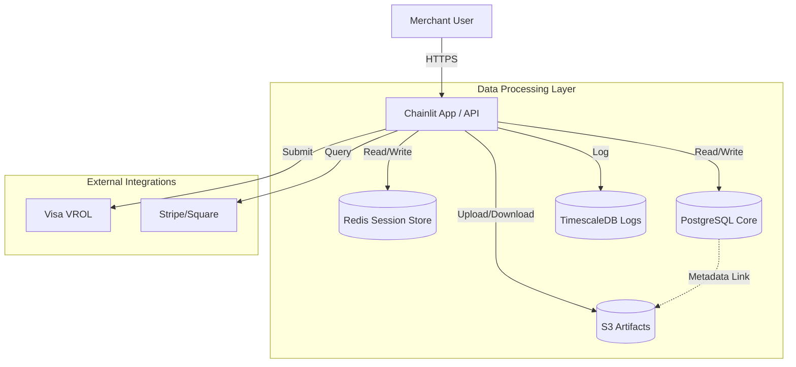

# 05_Data_Architecture

**Version:** 1.0
**Status:** Approved
**Date:** 2025-12-09

---

## 1. Overview

The Data Architecture for the Merchant Dispute Resolution Chatbot is designed to ensure data integrity, regulatory compliance (PCI-DSS), and high availability. It employs a polyglot persistence strategy, utilizing relational databases for transactional data, key-value stores for session management, object storage for artifacts, and time-series databases for observability.

## 2. Storage Strategy

We utilize the following data stores, aligned with ADR-003 and ADR-006:

| Component | Technology | Purpose | Retention |
|-----------|------------|---------|-----------|
| **Core DB** | PostgreSQL 15+ | Disputes, Merchants, Submissions, Users | 7 Years (Financial Regulation) |
| **Session Store** | Redis 7+ | Chainlit sessions, caching, rate limiting | Ephemeral / TTL 24h |
| **Artifact Store** | AWS S3 / MinIO | Evidence documents (PDFs, Images) | 7 Years |
| **Audit/Logs** | TimescaleDB | PhaseLogger, Analytics, Metrics | 1 Year (PhaseLogger), 90 Days (BlackBox) |
| **Vector Store** | (Future Phase) | Semantic search for RAG (if needed) | N/A |

### 2.1 PostgreSQL (Core Transactional Data)
Stores the primary domain entities.
- **Schema**: Relational, normalized (3NF).
- **Key Tables**: `disputes`, `merchants`, `evidence_metadata`, `submissions`, `users`.
- **Encryption**: At rest (AES-256) and in transit (TLS 1.3).

### 2.2 Redis (State & Caching)
Handles high-velocity, ephemeral data.
- **Usage**:
    - `cl.user_session` state persistence.
    - Caching CE 3.0 transaction lookups (TTL).
    - Rate limiting counters for API endpoints.
- **Persistence**: AOF (Append Only File) enabled for recovery (SPIKE-005).

### 2.3 S3 (Unstructured Data)
Stores binary evidence files.
- **Bucket Structure**: `/{merchant_id}/{dispute_id}/{evidence_type}/{filename}`.
- **Security**: Private buckets, presigned URLs for temporary access, server-side encryption (SSE-S3).
- **Versioning**: Enabled to track evidence modification.

### 2.4 TimescaleDB (Observability & Audit)
Optimized for time-series data and append-only logs.
- **Tables**: `audit_logs`, `blackbox_traces`, `phase_transitions`.
- **Partitioning**: By time (e.g., monthly) for efficient retention management.

## 3. Data Flow Architecture



## 4. Data Retention & Lifecycle Policies

Retention policies are strictly enforced to meet PCI-DSS and operational requirements.

| Data Type | Retention Period | Rationale | Mechanism |
|-----------|------------------|-----------|-----------|
| **Dispute Records** | 7 Years | Financial record keeping compliance | PostgreSQL `created_at` partitioning |
| **Evidence Files** | 7 Years | Alignment with dispute record | S3 Lifecycle Rules (Transition to Glacier after 1y) |
| **BlackBox Traces** | 90 Days | Debugging and immediate post-incident analysis | TimescaleDB automated deletion policy |
| **PhaseLogger** | 1 Year | Audit capability for decision rationale | TimescaleDB automated deletion policy |
| **GuardRails Logs** | 7 Years | Security audit trail (PCI requirement) | Archived to S3 Glacier from TimescaleDB |
| **Session Data** | 24 Hours | Security best practice, reduce stale state | Redis TTL |

## 5. Data Schemas (High Level)

### 5.1 Dispute Entity (PostgreSQL)
```sql
CREATE TABLE disputes (
    id UUID PRIMARY KEY,
    merchant_id UUID REFERENCES merchants(id),
    network_id VARCHAR(50), -- e.g., Visa Case ID
    amount DECIMAL(10, 2),
    currency CHAR(3),
    reason_code VARCHAR(10),
    status VARCHAR(20), -- OPEN, GATHERING, SUBMITTED, WON, LOST
    deadline TIMESTAMP WITH TIME ZONE,
    created_at TIMESTAMP WITH TIME ZONE DEFAULT NOW(),
    updated_at TIMESTAMP WITH TIME ZONE DEFAULT NOW()
);
```

### 5.2 Audit Log (TimescaleDB)
```sql
CREATE TABLE audit_logs (
    id UUID PRIMARY KEY,
    timestamp TIMESTAMP WITH TIME ZONE NOT NULL,
    dispute_id UUID,
    component VARCHAR(50), -- e.g., "EvidencePlanner"
    event_type VARCHAR(50), -- e.g., "DECISION", "ERROR"
    payload JSONB, -- The structured log data
    severity VARCHAR(10)
);
SELECT create_hypertable('audit_logs', 'timestamp');
```

## 6. Backup & Recovery
- **PostgreSQL**: Daily full backup, WAL archiving for Point-in-Time Recovery (PITR). Retention: 30 days.
- **Redis**: RDB snapshots every 15 mins.
- **S3**: Cross-region replication (CRR) for disaster recovery.
- **TimescaleDB**: Daily incremental backups.

## 7. Compliance & Privacy
- **PII Redaction**: All logs in TimescaleDB MUST be scrubbed of PII via GuardRails before insertion.
- **PAN Storage**: STRICTLY PROHIBITED. Only last-4 digits and tokenized references are stored.
- **Right to be Forgotten**: Capabilities to hard-delete merchant personal data upon request (GDPR/CCPA), distinct from financial transaction records which must be retained.

