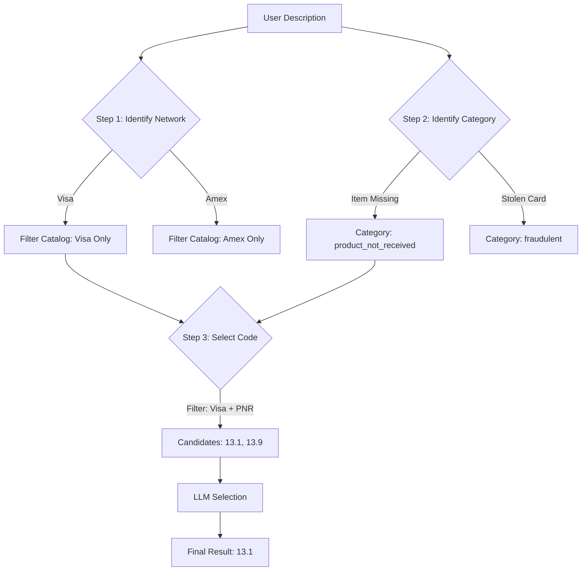

# Optimized Classification Flow (3-Step Funnel)

To improve the accuracy of the `CLASSIFY` phase, we will implement a 3-step hierarchical classification process. This reduces the cognitive load on the LLM by narrowing the search space at each step.

## Overview

The process breaks down the classification task into:
1.  **Network Identification**: Determine the payment network (Visa, Amex, etc.).
2.  **Category Identification**: Map the user's intent to a unified `DisputeReason` (Fraud, PNR, etc.).
3.  **Code Selection**: Select the specific regulatory code from a filtered list.

## Detailed Flow

### Step 1: Network Identification
*   **Goal**: Identify the payment network to filter the reason code catalog.
*   **Method**:
    *   **Primary**: Regex/Keyword search (fast, deterministic).
    *   **Fallback**: LLM query if no keywords are found.
*   **Output**: `target_network` (e.g., `'visa'`, `'amex'`).
*   **Handling Unknowns**: If the network cannot be identified, the system should prompt the user (future interaction) or default to `'visa'` (current MVP).

### Step 2: Unified Category Identification
*   **Goal**: Determine the high-level nature of the dispute.
*   **Method**: LLM Classification.
*   **Input**: User Description.
*   **Prompt**: "Classify this dispute into one of the following categories: `fraudulent`, `product_not_received`, `duplicate`, `subscription_canceled`, `product_unacceptable`, `credit_not_processed`, `unrecognized`, `general`."
*   **Output**: `target_category` (e.g., `'product_not_received'`).
*   **Side Effect**: Sets the `is_fraud` boolean flag based on the category (True if `'fraudulent'`, else False).

### Step 3: Specific Reason Code Selection
*   **Goal**: Select the precise alphanumeric code required by the network.
*   **Method**: LLM Selection from a Restricted List.
*   **Input**: User Description + List of Candidate Codes.
*   **Filtering Logic**:
    *   Retrieve codes from `ReasonCodeCatalog`.
    *   Filter where `network == target_network` AND `unified_category == target_category`.
*   **Prompt**: "Given the user's description, which of these specific {{ target_network }} codes applies?"
*   **Output**: `reason_code` (e.g., `'13.1'`).

## Benefits

1.  **Higher Accuracy**: The LLM chooses from ~3-5 relevant codes instead of 100+ global codes.
2.  **Structural Integrity**: We guarantee the output code belongs to the correct network and category.
3.  **Explainability**: The reasoning trace ("It's Visa -> It's a Shipping Issue -> It's Code 13.1") is transparent and easy to debug.
4.  **Reduced Hallucinations**: The LLM is constrained to a strictly filtered list of valid options in Step 3.

## Data Flow Diagram

## Implementation Plan

1.  **Refactor `classify.py`**:
    *   Implement `_identify_network` (already started).
    *   Implement `_identify_category` (new LLM call).
    *   Implement `_select_code` (final LLM call with filtered candidates).
2.  **Update Prompt Templates**:
    *   Create specialized prompts for Category ID and Code Selection.
3.  **Update `ReasonCodeCatalog`**:
    *   Ensure efficient filtering by `network` + `category`.

