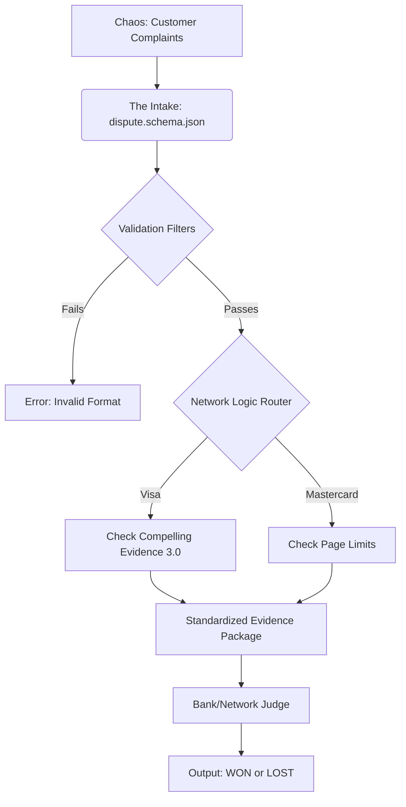

# The Universal Translator of Financial Conflicts

Imagine a bustling international court where merchants and banks argue over money. Each bank speaks a different language (Visa, Mastercard, Amex) and has different rulebooks. The `dispute-schema` folder is the **Universal Translator and Clerk** for this court. It takes the chaotic, emotional story of a customer dispute and forces it into a strict, rigorous format that can be understood and judged fairly by any financial network in the world.

## 1. What is the unknown?
The ultimate unknown is the **Resolution of the Dispute**: Is the transaction legitimate, or is it fraud? Does the merchant keep the money (`won`), or does the customer get a refund (`lost`)? The system's goal is to determine the final **Dispute Status**.

## 2. What are the data?
The data are the raw materials of the argument, meticulously categorized into over 50 fields:
*   **The Accusation:** The `amount`, `reason` (e.g., "product_not_received"), and `network_reason_code`.
*   **The Defense (Evidence):** A massive collection of 27 distinct types of proof, including `access_activity_log` (digital footprints), `shipping_tracking_number` (physical proof), and `customer_communication`.
*   **The History:** `balance_transactions` that track the flow of money and fees as the dispute evolves.
*   **The Context:** Payment method details (Card, PayPal, Klarna) which dictate which specific rules apply.

## 3. What is the condition?
The condition is the **Strict Adherence to the Schema and Network Rules**.
*   **Schema Validation:** Data must fit exact patterns (e.g., IDs must match `^dp_[a-zA-Z0-9]{24}$`). Text evidence cannot exceed 150,000 characters.
*   **Network Compliance:** If it's a Visa fraud claim, does it meet the "Compelling Evidence 3.0" standard? (e.g., Are there 2+ prior undisputed transactions from 120-365 days ago?).
*   **Regulatory Timelines:** Are we responding within the legal windows defined by Regulation E?

## 4. Is it possible to satisfy the condition?
**Yes.** The system is designed to be satisfiable but strict. By providing helper utilities like `validateEvidenceTextLimit` and `isVisaCE3Eligible`, the folder gives the user the tools to ensure their data *can* meet the rigorous conditions before it is ever sent to the bank.

## 5. Is the condition sufficient to determine the unknown?
**Ideally, yes.** If the conditions (valid, compelling evidence) are fully met, the outcome *should* be determined in the merchant's favor. However, because the final judge is a human at a bank, the condition is **sufficient to force a review**, but not always sufficient to guarantee a "win" (since humans can be subjective). The schema guarantees the *argument* is valid, not that the *verdict* is certain.

## 6. Is the condition insufficient, redundant, or contradictory?
The conditions are **robust and non-redundant**.
*   **Not Redundant:** The system normalizes chaos. Instead of having separate logic for every network's version of "Fraud", it maps them all to a single `DisputeReason` enum, removing redundancy while keeping the specific `network_reason_code` for reference.
*   **Not Contradictory:** It handles conflicting requirements (like Visa vs. Mastercard rules) by using specific sub-objects (like `visa_compelling_evidence_3`) that only activate when relevant.

## 7. Can you restate the problem in your own words?
The problem is **Standardized Truth-Telling**. How do we take a vague complaint like "I didn't buy this" and turn it into a mathematical proof that "You logged in from IP 1.2.3.4 on Tuesday and downloaded the file"? This folder solves the problem of translating real-world events into a data structure that banks effectively cannot ignore.

## 8. Visualizing the Flow
Think of a **Funnel with Filters**:

## 9. Is there enough information to find a solution?
**Yes.** The `dispute-schema` folder contains:
*   **Definitions:** Type definitions (`dispute_types.ts`).
*   **Rules:** Validation logic and limits (`index.ts`, `dispute.schema.json`).
*   **Translations:** Mappings between internal reasons and external network codes (`network_reason_codes.ts`).
*   **Interfaces:** API specifications (`openapi.yaml`) for how to talk to the outside world.

## 10. Key Terminology
*   **Chargeback:** A forced refund initiated by the bank.
*   **Compelling Evidence 3.0:** A specific new Visa rule for proving digital identity.
*   **Idempotency:** Ensuring sending the same request twice doesn't create two disputes.
*   **Reg E:** US Federal regulation governing electronic fund transfers and timelines.
