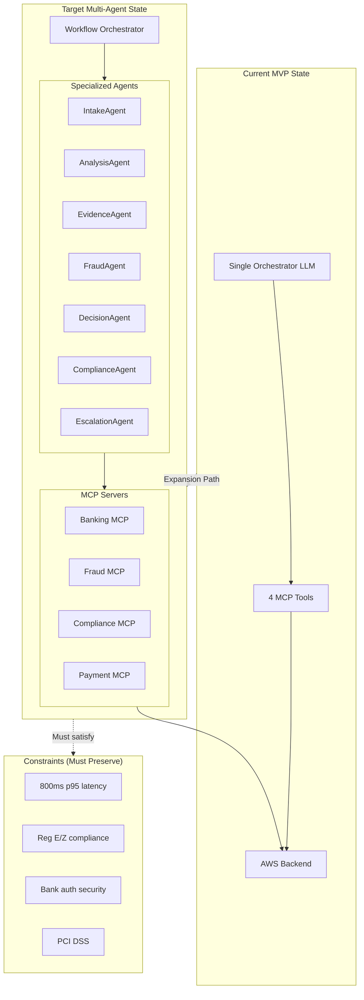
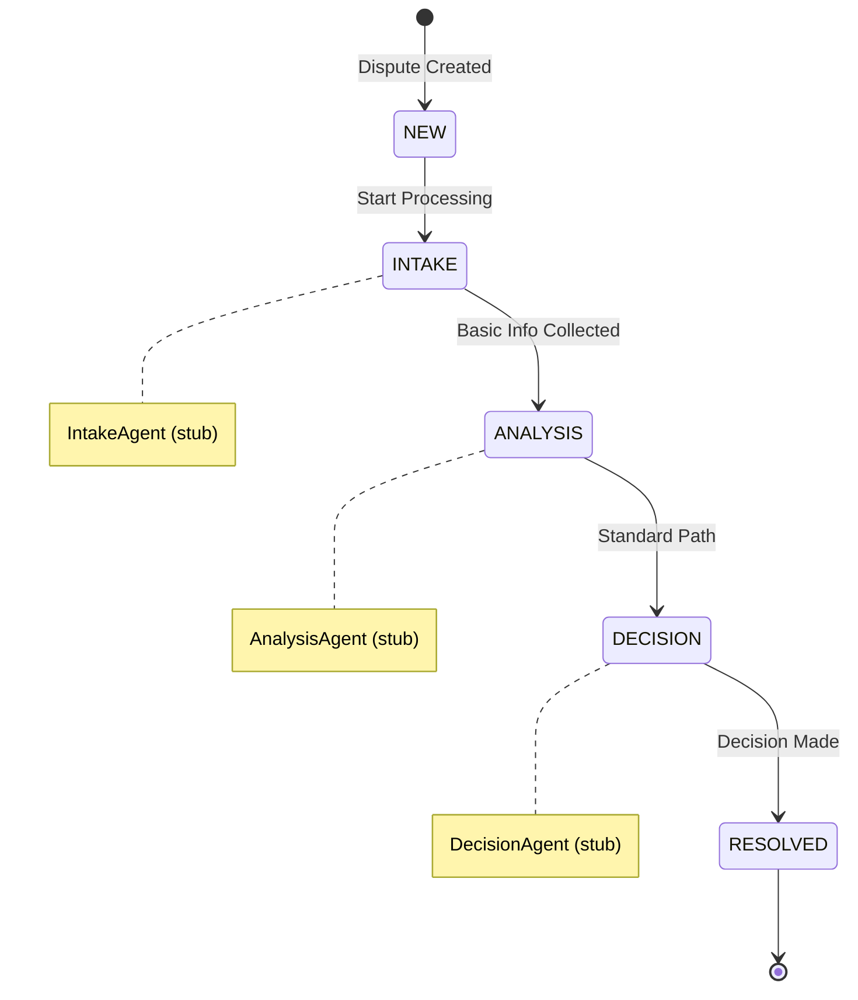
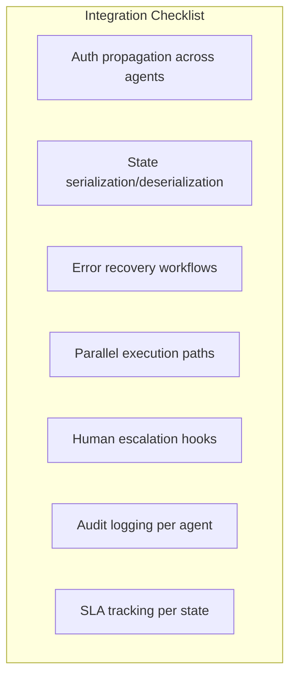
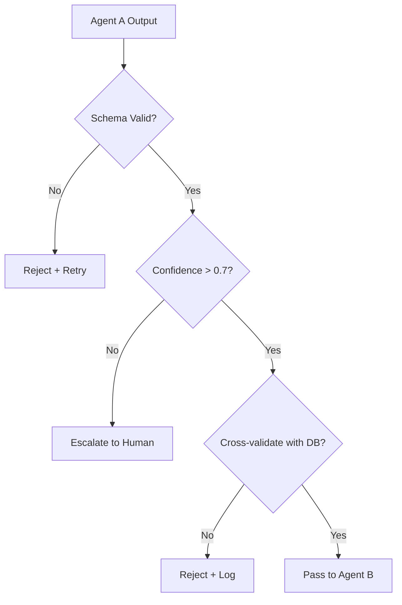
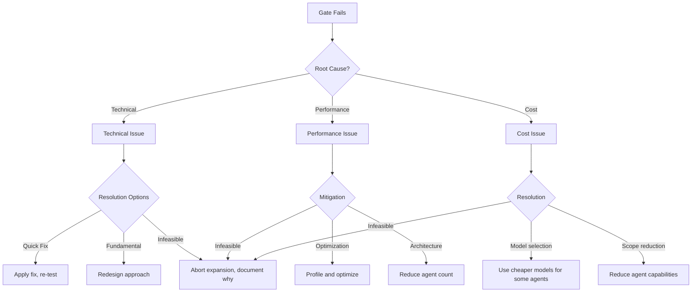
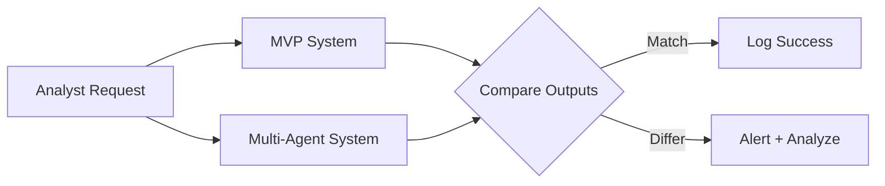

# Feasibility Analysis: Expanding MVP First Principles System with LangGraph Multi-Agent Architecture

## A First Principles & Pólya-Structured Feasibility Assessment

---

> *"The formulation of a problem is often more essential than its solution."*
> — Albert Einstein

> *"If you cannot solve the proposed problem, try to solve first some related problem."*
> — George Pólya

---

## Executive Summary

This document assesses the feasibility of expanding the **MVP Agentic Bank Dispute Chatbot** (documented in `mvp-first-principles-narration.md`) to incorporate the **LangGraph Multi-Agent Architecture** (documented in `ARCHITECTURE_DIAGRAMS.md`). 

Using **first principles thinking** and **Pólya's four-phase methodology**, we systematically analyze whether this expansion is:
1. **Technically feasible** - Can it be built?
2. **Architecturally sound** - Does it fit existing patterns?
3. **Economically viable** - Is the ROI justifiable?
4. **Operationally practical** - Can it be deployed and maintained?

### Preliminary Feasibility Assessment: ✅ HIGH FEASIBILITY

| Dimension | Score | Assessment |
|-----------|-------|------------|
| Technical Alignment | 9/10 | Strong compatibility between existing schema and multi-agent architecture |
| Architectural Coherence | 8/10 | Natural extension of MCP tool layer to agent network |
| Incremental Complexity | 7/10 | Moderate complexity increase with clear mitigation paths |
| Business Value | 9/10 | Significant automation and compliance improvements |
| Risk Profile | 7/10 | Manageable risks with proper phasing |

---

## Table of Contents

1. [Part I: First Principles Foundation](#part-i-first-principles-foundation)
2. [Part II: Pólya Phase 1 — Understanding the Problem](#part-ii-pólya-phase-1--understanding-the-problem)
3. [Part III: Pólya Phase 2 — Devising the Plan](#part-iii-pólya-phase-2--devising-the-plan)
4. [Part IV: Pólya Phase 3 — Execution Framework](#part-iv-pólya-phase-3--execution-framework)
5. [Part V: Pólya Phase 4 — Review and Validation](#part-v-pólya-phase-4--review-and-validation)
6. [Appendices](#appendices)

---

# Part I: First Principles Foundation

## The Fundamental Question

Before assessing feasibility, we must answer the most basic question:

> **What problem does the LangGraph multi-agent expansion solve that the current MVP does not?**

### Current MVP Capabilities (Single-Orchestrator Model)

From the `mvp-first-principles-narration.md`, the current system architecture is:

```
User → LLM (Claude) → MCP Tools → Backend API → Database
```

**What the MVP Does:**
- 4 MCP tools (`file_dispute`, `check_status`, `get_deadline`, `add_evidence`)
- Single LLM orchestrator handling all reasoning
- Sequential tool calling
- Manual specialist routing via EventBridge
- Human-in-the-loop for escalation

**What the MVP Cannot Do (Limitations):**
1. **No specialized reasoning** - One LLM handles fraud analysis, compliance checking, and customer communication with same prompt
2. **No parallel processing** - Tools called sequentially, even when independent
3. **No state persistence across agents** - All context held in single LLM context window
4. **No autonomous escalation logic** - Routing rules are static, not learned
5. **Limited error recovery** - Single point of failure in orchestrator

### Proposed Multi-Agent Architecture Capabilities

From `ARCHITECTURE_DIAGRAMS.md`, the LangGraph architecture introduces:

```
User → Workflow Orchestrator → [Agent Network] → MCP Servers → Backend
                                    ↓
                    ┌───────────────┼───────────────┐
                    ↓               ↓               ↓
              IntakeAgent    AnalysisAgent   FraudAgent
                    ↓               ↓               ↓
              EvidenceAgent  DecisionAgent  ComplianceAgent
                                    ↓
                            EscalationAgent
```

**What the Multi-Agent Architecture Adds:**
1. **Specialized Agents** - Each agent has domain-specific prompts and tools
2. **Parallel Processing** - Independent agents can execute concurrently
3. **State Machine Workflow** - LangGraph manages transitions between states
4. **Autonomous Decision Making** - Agents can route based on learned patterns
5. **Graceful Degradation** - Agent failures don't crash entire system

---

## First Principles Decomposition

### The Irreducible Components of the Expansion

| Current MVP Component | Multi-Agent Equivalent | Transformation Required |
|-----------------------|------------------------|-------------------------|
| Single Claude LLM | Multiple specialized agents | Prompt engineering per agent |
| MCP Tools (4) | MCP Servers (5+) with expanded tools | Tool expansion and server architecture |
| Linear execution | State machine transitions | LangGraph workflow definition |
| Manual routing | Agent-based routing decisions | Decision logic codification |
| Context in LLM | Distributed state (Redis) | State management layer |
| Synchronous API | Async workflow engine | Architecture pattern shift |

### The Core Insight

> **The MVP's single-orchestrator model is sufficient for simple disputes but becomes a bottleneck for complex cases requiring specialized reasoning.**

**Evidence supporting this insight:**
1. Credit card disputes (Reg Z) require different expertise than debit (Reg E)
2. Fraud detection requires pattern analysis expertise
3. Evidence evaluation requires document understanding expertise
4. Compliance checking requires regulatory expertise

Each of these is a **distinct cognitive task** that benefits from specialization. The multi-agent architecture maps each task to a purpose-built agent.

---

## The Compatibility Assessment

### Schema Compatibility: HIGH ✅

The existing `dispute.schema.json` (referenced in MVP narration) is **fully compatible** with the multi-agent architecture:

| Schema Feature | Single-Agent Usage | Multi-Agent Usage | Compatibility |
|----------------|-------------------|-------------------|---------------|
| `status` enum (8 values) | Directly mapped | Maps to workflow states | ✅ Direct |
| `reason` enum (8 values) | Single-agent classification | AnalysisAgent classification | ✅ Direct |
| `evidence` structure | `add_evidence` tool | EvidenceAgent specialization | ✅ Direct |
| `payment_method_details` | Deadline calculation | Routing decision input | ✅ Direct |
| Timeline logic | `reg_e_timelines.ts` | ComplianceAgent integration | ✅ Direct |

**Key Finding:** No schema modifications required for multi-agent expansion.

### Tool Compatibility: HIGH ✅

The existing 4 MCP tools map naturally to the expanded MCP server architecture:

| MVP Tool | Multi-Agent MCP Server | Agent Consumer | Status |
|----------|------------------------|----------------|--------|
| `file_dispute` | Banking MCP | IntakeAgent, DecisionAgent | ✅ Extends |
| `check_status` | Banking MCP | All agents (query) | ✅ Extends |
| `get_deadline` | Compliance MCP | ComplianceAgent | ✅ Extends |
| `add_evidence` | Banking MCP | EvidenceAgent | ✅ Extends |
| (new) fraud_score | Fraud MCP | FraudAgent | 🆕 Addition |
| (new) detect_patterns | Fraud MCP | FraudAgent | 🆕 Addition |
| (new) check_regulations | Compliance MCP | ComplianceAgent | 🆕 Addition |

**Key Finding:** MVP tools become foundation for expanded MCP servers.

### Authentication Compatibility: MEDIUM ⚠️

The MVP's Bank SAML SSO + RS256 JWT architecture requires extension:

| MVP Auth Component | Multi-Agent Requirement | Gap Analysis |
|--------------------|-------------------------|--------------|
| BankUserContext | Must propagate to all agents | Requires context forwarding |
| Session binding | Must persist across agent transitions | Redis session required |
| Tool-level auth | Agent-level auth + tool-level auth | Additional layer |
| Audit logging | Per-agent audit logging | Expanded logging schema |

**Key Finding:** Auth works but requires enhancement for agent context propagation.

---

# Part II: Pólya Phase 1 — Understanding the Problem

## The Questions of Understanding

Following Pólya's Phase 1 methodology:

### 1. What is the Unknown?

> **Unknown:** Whether the LangGraph multi-agent architecture can be integrated with the MVP system while maintaining:
> - Regulatory compliance (Reg E, Reg Z, PCI DSS)
> - Performance targets (800ms p95, 50 concurrent analysts)
> - Security posture (bank-grade authentication)
> - Operational simplicity (maintainable by existing team)

### 2. What are the Data?

**Available Data (What We Know):**

| Data Source | Key Information | Confidence |
|-------------|-----------------|------------|
| MVP Schema | Complete dispute data model | HIGH |
| Architecture Diagrams | Full multi-agent design | HIGH |
| Compliance Logic | Reg E/Z implementations | HIGH |
| AWS Infrastructure | Lambda, Step Functions patterns | HIGH |
| MCP Protocol | Tool interface specifications | HIGH |

**Missing Data (What We Need):**

| Unknown | Impact | Mitigation |
|---------|--------|------------|
| LangGraph latency overhead | Performance risk | Benchmark testing phase |
| Inter-agent state serialization cost | Memory/latency | Prototype measurement |
| Agent failure rate | Reliability risk | Canary deployment |
| Claude API cost at multi-agent scale | Cost risk | Cost modeling |

### 3. What is the Condition?

The condition for success is a compound requirement:

```
SUCCESS = 
    (All MVP capabilities preserved) ∧
    (Multi-agent capabilities added) ∧
    (Performance targets maintained) ∧
    (Compliance unchanged) ∧
    (Security unchanged or improved)
```

### 4. Is the Condition Sufficient?

**Analysis:**

| Sub-condition | Sufficiency | Risk |
|---------------|-------------|------|
| MVP capabilities preserved | Sufficient if schema unchanged | LOW |
| Multi-agent capabilities added | Sufficient if LangGraph integrates | MEDIUM |
| Performance maintained | Uncertain until benchmarked | MEDIUM |
| Compliance unchanged | Sufficient if ComplianceAgent validated | LOW |
| Security maintained | Requires auth propagation design | MEDIUM |

**Conclusion:** The condition is **likely sufficient** but requires validation through prototyping.

### 5. Is the Condition Redundant or Contradictory?

**Potential Contradictions:**

| Tension | Analysis | Resolution |
|---------|----------|------------|
| Speed vs. Specialization | More agents = more latency? | Parallel execution mitigates |
| Complexity vs. Reliability | More components = more failure modes? | State machine provides recovery |
| Cost vs. Quality | More LLM calls = higher cost? | Smaller prompts per agent offset |

**Conclusion:** No fundamental contradictions. Tensions are manageable through design choices.

---

## The Problem Restatement

In our own words:

> **The Problem:** We have a working MVP dispute chatbot using a single Claude LLM orchestrator. We want to expand it to a multi-agent architecture where specialized agents (Intake, Analysis, Evidence, Fraud, Decision, Compliance, Escalation) collaborate through LangGraph workflows. We need to determine if this expansion is feasible without breaking existing functionality, compliance, or performance.

> **The Goal:** Produce a validated feasibility assessment with clear go/no-go criteria, risk mitigation strategies, and a phased expansion approach.

---

## The Visual Model of Understanding



---

# Part III: Pólya Phase 2 — Devising the Plan

## Have You Seen This Problem Before?

### Related Solved Problems

| Analogous System | Similarity | Lessons |
|------------------|------------|---------|
| **Stripe's Radar** | Multi-model fraud detection | Agent specialization works at scale |
| **AWS Step Functions** | State machine orchestration | Workflow patterns for agents |
| **LangChain Agents** | LLM tool calling | MCP integration patterns |
| **Google Dialogflow CX** | Multi-agent conversations | State management patterns |
| **Anthropic Claude Tool Use** | Native tool calling | Tool schema patterns |

**Key Insight:** Multi-agent systems for financial workflows have been successfully implemented. The pattern is proven.

### What Related Theorems Apply?

From distributed systems and AI literature:

| Principle | Application |
|-----------|-------------|
| **Single Responsibility** | Each agent does one thing well |
| **Saga Pattern** | Compensating transactions for agent failures |
| **Circuit Breaker** | Isolate failing agents |
| **Event Sourcing** | Audit trail via state transitions |
| **CQRS** | Separate read/write patterns per agent |

---

## The Strategic Plan

### Decomposition Strategy: Phased Expansion

Rather than replacing the MVP entirely, we **incrementally expand** it:

```
Phase 0: Validation Gate
    ↓
Phase 1: LangGraph Skeleton
    ↓
Phase 2: Agent Migration (One at a time)
    ↓
Phase 3: MCP Server Expansion
    ↓
Phase 4: Full Integration
    ↓
Phase 5: Optimization
```

### Phase 0: Validation Gate (Week 0)

**Objective:** Prove LangGraph integration is technically feasible.

**Deliverables:**
1. LangGraph "hello world" with Claude
2. State persistence with Redis
3. Latency measurement (baseline vs. multi-agent overhead)
4. Memory consumption measurement

**Go/No-Go Criteria:**
| Metric | Threshold | Action if Failed |
|--------|-----------|------------------|
| LangGraph setup time | < 2 days | Investigate alternatives |
| Latency overhead | < 200ms per hop | Optimize or redesign |
| Memory per agent | < 512MB | Agent consolidation |

### Phase 1: LangGraph Skeleton (Weeks 1-2)

**Objective:** Establish the workflow orchestrator with stub agents.

**Architecture:**



**Key Insight:** Start with the **happy path** (simplest flow), then add complexity.

### Phase 2: Agent Migration (Weeks 3-6)

**Objective:** Replace stub agents with functional implementations, one at a time.

**Migration Order (Risk-Based):**

| Order | Agent | Risk Level | Rationale |
|-------|-------|------------|-----------|
| 1 | IntakeAgent | LOW | Input processing, well-defined |
| 2 | ComplianceAgent | LOW | Wraps existing `reg_e_timelines.ts` |
| 3 | EvidenceAgent | MEDIUM | Document processing complexity |
| 4 | AnalysisAgent | MEDIUM | Classification logic |
| 5 | FraudAgent | HIGH | ML model integration |
| 6 | DecisionAgent | HIGH | Business rules complexity |
| 7 | EscalationAgent | MEDIUM | Human handoff logic |

**Per-Agent Migration Pattern:**

```
1. Create agent prompt specification
2. Define agent-specific tools (subset of MCP)
3. Implement agent logic
4. Unit test with mock MCP
5. Integration test with real backend
6. A/B test against MVP baseline
7. Gradual traffic shift (10% → 50% → 100%)
```

### Phase 3: MCP Server Expansion (Weeks 5-7)

**Objective:** Expand from 4 tools to full MCP server architecture.

**MCP Server Mapping:**

| Server | Tools | Data Sources |
|--------|-------|--------------|
| Banking MCP | `file_dispute`, `check_status`, `get_history`, `validate_account` | RDS, DynamoDB |
| Fraud MCP | `detect_patterns`, `risk_assessment`, `analyze_behavior` | SageMaker, DocumentDB |
| Compliance MCP | `check_regulations`, `get_deadline`, `audit_trail` | S3, RDS |
| Payment MCP | `validate_payment`, `check_network`, `process_refund` | Payment Networks |
| Geospatial MCP | `verify_location`, `analyze_travel` | Bedrock, OpenSearch |

### Phase 4: Full Integration (Weeks 8-9)

**Objective:** Connect all agents through LangGraph with full state management.

**Integration Points:**



### Phase 5: Optimization (Weeks 10-12)

**Objective:** Tune performance and cost.

**Optimization Targets:**

| Target | Current (Est.) | Goal | Method |
|--------|----------------|------|--------|
| E2E Latency | ~1200ms | <800ms | Parallel execution, caching |
| Cost per dispute | $0.50 | $0.30 | Prompt optimization, model selection |
| Agent failure rate | ~5% | <1% | Circuit breakers, retries |
| Human escalation rate | ~20% | <10% | Improved decision logic |

---

## The Auxiliary Elements

### New Abstractions Required

#### 1. Agent Context Interface

```typescript
interface AgentContext {
  // Inherited from MVP
  bankUserContext: BankUserContext;
  sessionId: string;
  
  // New for multi-agent
  workflowId: string;
  currentState: WorkflowState;
  previousAgents: AgentTransition[];
  sharedMemory: Map<string, unknown>;
  
  // Tracing
  traceId: string;
  parentSpanId: string;
}
```

#### 2. State Transition Type

```typescript
interface AgentTransition {
  fromAgent: AgentType;
  toAgent: AgentType;
  timestamp: number;
  reason: string;
  confidence: number;
  outputSummary: string;
}
```

#### 3. Agent Output Contract

```typescript
interface AgentOutput<T> {
  success: boolean;
  data: T;
  nextState: WorkflowState | null;
  confidence: number;
  reasoning: string;
  toolsUsed: string[];
  escalate: boolean;
  escalationReason?: string;
}
```

---

## Risk Analysis and Mitigation

### Risk Matrix

| Risk | Probability | Impact | Mitigation |
|------|-------------|--------|------------|
| **LangGraph learning curve** | MEDIUM | HIGH | Training week + documentation |
| **Inter-agent latency** | HIGH | MEDIUM | Parallel execution, caching |
| **State corruption** | LOW | HIGH | Saga pattern, compensating transactions |
| **Agent hallucination cascade** | MEDIUM | HIGH | Output validation between agents |
| **Cost explosion** | MEDIUM | MEDIUM | Token budgets per agent |
| **Compliance drift** | LOW | HIGH | ComplianceAgent as mandatory checkpoint |
| **Debugging complexity** | HIGH | MEDIUM | Distributed tracing, log correlation |

### The Hallucination Cascade Problem

**Unique to Multi-Agent:** If one agent hallucinates, it may propagate through the workflow.

**Mitigation Pattern:**



---

# Part IV: Pólya Phase 3 — Execution Framework

## The Step-by-Step Validation Approach

Rather than implementing, we **validate feasibility** at each step.

### Validation Gate 1: LangGraph Technical Feasibility

**Test Case:** Create minimal LangGraph workflow with 3 states.

```python
# Pseudo-code for validation
from langgraph.graph import StateGraph

class DisputeState(TypedDict):
    dispute_id: str
    status: str
    current_agent: str
    messages: list

# Define minimal workflow
workflow = StateGraph(DisputeState)
workflow.add_node("intake", intake_agent)
workflow.add_node("analysis", analysis_agent)
workflow.add_node("decision", decision_agent)

# Add edges
workflow.add_edge("intake", "analysis")
workflow.add_edge("analysis", "decision")
workflow.add_edge("decision", END)

# Compile
app = workflow.compile()
```

**Validation Questions:**
1. Can this workflow be instantiated? ✅/❌
2. Can state be persisted to Redis? ✅/❌
3. Can bank auth context be injected? ✅/❌
4. What is the baseline latency overhead? ___ms

### Validation Gate 2: MCP Server Compatibility

**Test Case:** Call existing MVP tools from LangGraph agent.

**Validation Questions:**
1. Can `file_dispute` be called from IntakeAgent? ✅/❌
2. Can tool outputs be parsed into state? ✅/❌
3. Is BankUserContext propagated correctly? ✅/❌
4. Are PCI guardrails still enforced? ✅/❌

### Validation Gate 3: State Persistence

**Test Case:** Simulate mid-workflow failure and recovery.

**Validation Questions:**
1. Can workflow state be serialized to Redis? ✅/❌
2. Can workflow resume from checkpoint? ✅/❌
3. Is audit trail preserved across restarts? ✅/❌
4. How much state data per workflow? ___KB

### Validation Gate 4: Performance Under Load

**Test Case:** Simulate 50 concurrent workflows.

**Validation Questions:**
1. Is p95 latency < 1000ms (allowing 200ms budget for optimization)? ✅/❌
2. Is memory per workflow < 100MB? ✅/❌
3. Are there race conditions in state updates? ✅/❌
4. Does error handling scale? ✅/❌

---

## The Decision Framework

### Go/No-Go Decision Matrix

| Gate | Pass Criteria | Result | Action |
|------|---------------|--------|--------|
| Gate 1 | Workflow compiles, state persists | TBD | Proceed to Gate 2 |
| Gate 2 | MCP tools callable, auth works | TBD | Proceed to Gate 3 |
| Gate 3 | Recovery works, audit preserved | TBD | Proceed to Gate 4 |
| Gate 4 | Performance acceptable | TBD | Proceed to implementation |

### If Any Gate Fails



---

# Part V: Pólya Phase 4 — Review and Validation

## Can We Check the Result?

### Verification Methods

| Aspect | Verification Method | Success Criteria |
|--------|---------------------|------------------|
| **Functional correctness** | E2E tests: same inputs → same outputs as MVP | 100% parity for existing scenarios |
| **Performance** | Load testing with k6/Locust | p95 < 800ms, throughput ≥ MVP |
| **Compliance** | Reg E/Z test scenarios | All deadlines calculated correctly |
| **Security** | Penetration testing | No new vulnerabilities |
| **Auditability** | Log review | All state transitions logged |

### Independent Verification Approach

**Method 1: Shadow Mode**
Run multi-agent system in parallel with MVP, compare outputs:



**Method 2: Canary Deployment**
Route 5% of traffic to multi-agent, monitor metrics:

```
Metrics to monitor:
- Error rate (should not exceed MVP)
- Latency (should not exceed MVP + 10%)
- Escalation rate (should not exceed MVP)
- Customer satisfaction (should not decrease)
```

---

## Can We Use This Result for Other Problems?

### Generalization Opportunities

If the LangGraph multi-agent expansion succeeds for disputes, the pattern can extend to:

| Future Use Case | Agent Network Adaptation |
|-----------------|--------------------------|
| **Loan Applications** | IntakeAgent → CreditAgent → UnderwritingAgent → ApprovalAgent |
| **Account Opening** | IdentityAgent → KYCAgent → RiskAgent → OnboardingAgent |
| **Fraud Investigations** | DetectionAgent → TriageAgent → InvestigationAgent → ResolutionAgent |
| **Customer Service** | RoutingAgent → SpecialistAgent → FollowupAgent |

**The Template:**

```
Any banking workflow with:
- Multiple decision points
- Specialized expertise requirements
- Compliance checkpoints
- Human escalation needs

Can be modeled as:
- LangGraph state machine
- Specialized agents per expertise area
- MCP servers per data domain
- ComplianceAgent as mandatory checkpoint
```

---

## Lessons Learned (Pre-Implementation)

### What This Analysis Reveals

| Insight | Implication |
|---------|-------------|
| Schema compatibility is high | No data migration required |
| Tool compatibility is high | Incremental tool expansion possible |
| Auth propagation is the key challenge | Design this first |
| Latency is the key risk | Budget 200ms overhead, optimize aggressively |
| Hallucination cascade is unique risk | Build inter-agent validation |

### What Remains Uncertain

| Uncertainty | Resolution Path |
|-------------|-----------------|
| Actual latency overhead | Gate 1 testing |
| Agent prompt optimization effort | Phase 2 learning |
| Debugging complexity in practice | Observability investment |
| Cost at production scale | Pilot monitoring |

---

## Final Feasibility Assessment

### The First Principles Conclusion

Starting from first principles:

1. **The MVP is a working system** with proven schema, tools, and compliance logic
2. **Multi-agent architecture adds specialization** which improves handling of complex cases
3. **LangGraph provides proven orchestration** patterns from the ecosystem
4. **The expansion is incremental** — each phase validates before proceeding
5. **Rollback is always possible** — MVP remains operational throughout

### The Pólya Conclusion

Following Pólya's methodology:

1. **We understood the problem** — expanding while preserving constraints
2. **We found related problems** — multi-agent patterns exist and work
3. **We devised a phased plan** — gate-validated incremental expansion
4. **We defined verification** — shadow mode, canary, comparison testing

### The Recommendation

| Recommendation | Confidence | Rationale |
|----------------|------------|-----------|
| **PROCEED WITH PHASED EXPANSION** | HIGH (85%) | Technical alignment is strong, risks are manageable, value is significant |

### Conditions for Proceeding

1. **Week 0 Gate must pass** — LangGraph proof-of-concept validates
2. **Team training completed** — LangGraph, multi-agent patterns
3. **Observability infrastructure in place** — Distributed tracing, log correlation
4. **Rollback plan documented** — Clear path back to MVP if issues arise

---

## Appendices

### Appendix A: Mapping MVP Components to Multi-Agent

| MVP Component | Location | Multi-Agent Destination | Migration Complexity |
|---------------|----------|-------------------------|---------------------|
| `dispute.schema.json` | Schema | Shared across all agents | NONE |
| `reg_e_timelines.ts` | Compliance | ComplianceAgent tool | LOW |
| `pci-compliance.ts` | Security | All agents (shared) | LOW |
| `BankUserContext` | Auth | AgentContext extension | MEDIUM |
| `file_dispute` tool | MCP | Banking MCP | LOW |
| `check_status` tool | MCP | Banking MCP | LOW |
| `get_deadline` tool | MCP | Compliance MCP | LOW |
| `add_evidence` tool | MCP | Banking MCP | LOW |

### Appendix B: Agent Responsibility Matrix

| Agent | Primary Responsibility | MCP Servers Used | Escalation Trigger |
|-------|------------------------|------------------|-------------------|
| IntakeAgent | Parse customer input, initial classification | Banking | Unclear input |
| AnalysisAgent | Dispute type classification, risk scoring | Banking, Fraud | Ambiguous type |
| EvidenceAgent | Document collection, validation | Banking | Missing evidence |
| FraudAgent | Pattern detection, anomaly analysis | Fraud | High-confidence fraud |
| DecisionAgent | Resolution recommendation | Banking, Compliance | Low confidence |
| ComplianceAgent | Regulatory validation | Compliance | Non-compliant |
| EscalationAgent | Human handoff management | All | Always (final stage) |

### Appendix C: LangGraph State Machine Definition

```python
# Conceptual state definition for feasibility reference
from typing import TypedDict, Literal, List
from langgraph.graph import StateGraph, END

class DisputeWorkflowState(TypedDict):
    # Core dispute data
    dispute_id: str
    charge_id: str
    customer_id: str
    dispute_reason: str
    amount_cents: int
    
    # Workflow state
    current_state: Literal["NEW", "INTAKE", "ANALYSIS", "EVIDENCE", 
                           "FRAUD_CHECK", "DECISION", "COMPLIANCE", 
                           "ESCALATED", "RESOLVED"]
    
    # Agent outputs
    intake_output: dict | None
    analysis_output: dict | None
    evidence_output: dict | None
    fraud_output: dict | None
    decision_output: dict | None
    compliance_output: dict | None
    
    # Context
    bank_user_context: dict  # BankUserContext serialized
    messages: List[dict]
    
    # Routing
    requires_specialist: bool
    escalation_reason: str | None
    confidence_score: float


def build_dispute_workflow() -> StateGraph:
    """Build the LangGraph workflow for dispute processing."""
    workflow = StateGraph(DisputeWorkflowState)
    
    # Add nodes (agents)
    workflow.add_node("intake", intake_agent_node)
    workflow.add_node("analysis", analysis_agent_node)
    workflow.add_node("evidence", evidence_agent_node)
    workflow.add_node("fraud_check", fraud_agent_node)
    workflow.add_node("decision", decision_agent_node)
    workflow.add_node("compliance", compliance_agent_node)
    workflow.add_node("escalation", escalation_agent_node)
    
    # Add conditional edges
    workflow.add_conditional_edges(
        "intake",
        intake_router,  # Function that returns next node
        {
            "analysis": "analysis",
            "escalation": "escalation"
        }
    )
    
    # ... additional edges
    
    return workflow.compile()
```

### Appendix D: Success Metrics Definition

| Metric | MVP Baseline | Target | Measurement Method |
|--------|--------------|--------|-------------------|
| Dispute filing success rate | 85% | 90% | Completed / Attempted |
| Average resolution time | 22 min | 18 min | End-to-end timing |
| Human escalation rate | 20% | 15% | Escalated / Total |
| Compliance accuracy | 99.5% | 99.9% | Deadline accuracy audit |
| PCI violation rate | 0% | 0% | Security logs |
| System availability | 99.9% | 99.9% | Uptime monitoring |
| Cost per dispute | $0.45 | $0.35 | AWS + Claude costs |

---

*Document Version: 1.0*
*Created: December 2024*
*Type: Feasibility Analysis (Pre-Implementation)*
*Methodology: First Principles + Pólya's Four Phases*
*Related Documents:*
- `mvp-first-principles-narration.md`
- `ARCHITECTURE_DIAGRAMS.md`
- `polya-analysis.md`

---

> *"The completed solution is only the beginning of wisdom. By looking back, we consolidate our knowledge and develop our ability to solve problems."*
> — George Pólya
