# Deep Dive Narration: MVP Agentic Bank Dispute Chatbot

## A First Principles Journey from Problem to Production

---

> *"The art of problem-solving is not knowing what to do; it's knowing how to think about what to do."*
> — George Pólya, *How to Solve It* (1945)

---

## Table of Contents

1. [Part I: First Principles Foundation](#part-i-first-principles-foundation)
   - [The Irreducible Core](#the-irreducible-core)
   - [What is a Dispute?](#what-is-a-dispute)
   - [What is an Agent?](#what-is-an-agent)
   - [Why Do Banks Need This?](#why-do-banks-need-this)

2. [Part II: Pólya Phase 1 — Understanding the Problem](#part-ii-pólya-phase-1--understanding-the-problem)
   - [Have You Seen This Problem Before?](#have-you-seen-this-problem-before)
   - [The Unknowns](#the-unknowns)
   - [The Data](#the-data)
   - [The Constraints](#the-constraints)
   - [The Conditions](#the-conditions)

3. [Part III: Pólya Phase 2 — Devising the Plan](#part-iii-pólya-phase-2--devising-the-plan)
   - [Related Problems](#related-problems)
   - [The Auxiliary Elements](#the-auxiliary-elements)
   - [Decomposition Strategy](#decomposition-strategy)
   - [The MVP Architecture](#the-mvp-architecture)

4. [Part IV: Visual Narrative Components](#part-iv-visual-narrative-components)
   - [System Context](#system-context)
   - [Data Flow Architecture](#data-flow-architecture)
   - [State Machine Dynamics](#state-machine-dynamics)
   - [Regulatory Timeline Visualization](#regulatory-timeline-visualization)
   - [Security Layers](#security-layers)

5. [Part V: First Principles Synthesis](#part-v-first-principles-synthesis)
   - [From Atoms to Molecules](#from-atoms-to-molecules)
   - [The Implementation Roadmap](#the-implementation-roadmap)
   - [Risk Mitigation Through First Principles](#risk-mitigation-through-first-principles)
   - [Closing Reflection](#closing-reflection)

---

# Part I: First Principles Foundation

## The Irreducible Core

Before writing a single line of code, we must ask: **What is the simplest possible description of what we're building?**

This is first principles thinking—reducing a complex problem to its fundamental truths and building up from there, rather than reasoning by analogy or pattern-matching to existing solutions.

### The Single-Sentence Definition

> **An agentic bank dispute chatbot is a system that enables a human analyst to file compliant financial dispute claims through natural language conversation, where an AI orchestrator translates conversational intent into validated API calls with regulatory guardrails.**

Let's decompose this sentence into its atomic components:

| Component | First Principle Question | Answer |
|-----------|-------------------------|--------|
| **"Human analyst"** | Who is the user? | A bank employee, not the customer directly |
| **"File"** | What action occurs? | Creating a formal record in a system of truth |
| **"Compliant"** | What constraint applies? | Reg E, Reg Z, PCI DSS |
| **"Dispute claims"** | What domain? | Payment chargebacks |
| **"Natural language"** | What interface? | Free-form text (chat) |
| **"AI orchestrator"** | What intermediary? | An LLM with tool-calling capability |
| **"Validated API calls"** | What output? | Typed function invocations with schema enforcement |
| **"Regulatory guardrails"** | What boundaries? | Non-negotiable compliance requirements |

---

## What is a Dispute?

To understand what we're building, we must first understand the domain deeply. A **dispute** (also called a **chargeback**) represents a fundamental concept in payment systems:

### The Physics of Money Movement

Money in modern banking isn't physical. It's a **ledger entry**—a number in a database that represents a claim on real assets. When you pay for something with a card, the following happens:


A **dispute** is a claim that this money movement was **incorrect**. The customer (through their bank) is asserting one of several possible errors:

| Dispute Reason | First Principles Meaning |
|----------------|-------------------------|
| `fraudulent` | "I did not authorize this transaction" |
| `unrecognized` | "I don't know what this charge is" |
| `duplicate` | "I was charged twice for the same thing" |
| `product_not_received` | "I paid but received nothing" |
| `product_unacceptable` | "What I received was defective" |
| `credit_not_processed` | "A refund was promised but not delivered" |
| `subscription_canceled` | "I canceled but was still charged" |

### The Dispute Object Model

From our `dispute.schema.json`, a dispute is a formal data structure:

```json
{
  "id": "dp_1NxQkL2eZvKYlo2CXr5EPQmR",
  "object": "dispute",
  "amount": 10000,
  "currency": "usd",
  "status": "needs_response",
  "reason": "fraudulent",
  "created": 1701456000,
  "charge": "ch_1NxQkL2eZvKYlo2CXr5EPQmR"
}
```

The `id` pattern `dp_[a-zA-Z0-9]{24}` isn't arbitrary—it's a **globally unique identifier** that ensures:
- No two disputes can collide
- The object type is instantly identifiable from the ID prefix
- The ID can be used for distributed systems coordination

### Why 8 Status Values?

The `status` enum has 8 possible values:

```
needs_response → under_review → won
                              → lost
warning_needs_response → warning_under_review → warning_closed
charge_refunded
```

This represents a **state machine**—a mathematical model where each state has defined transitions. The "warning" variants exist because disputes can be flagged as concerning before becoming formal chargebacks.


---

## What is an Agent?

The word "agent" in AI has a specific meaning, distinct from "chatbot" or "assistant."

### The Agent Definition

An **agent** is an AI system that:
1. **Perceives** its environment (receives input)
2. **Reasons** about goals and constraints
3. **Acts** upon the environment (executes tools)
4. **Observes** the results of its actions
5. **Iterates** until the goal is achieved or deemed unachievable

### The Crucial Distinction

| System Type | Capabilities | Our System |
|-------------|--------------|------------|
| **Chatbot** | Responds to prompts with text | ❌ |
| **Assistant** | Responds with text + retrieves information | ❌ |
| **Agent** | Responds with text + retrieves information + **takes actions** | ✅ |

Our system is an **agent** because it doesn't just talk about filing disputes—it actually **files them** by calling the `file_dispute` MCP tool.

### The Tool-Calling Paradigm

In the MCP (Model Context Protocol) paradigm, an agent's power comes from its tools:


The LLM **never directly accesses the database**. It only knows about the world through its tools. This is a security principle called **least privilege**—the LLM can only do what its tools permit.

### Why Tools Instead of Raw API Access?

A first principles question: Why not give the LLM direct access to the REST API?

| Approach | Pros | Cons |
|----------|------|------|
| **Direct API Access** | Flexible, no tool definitions needed | No validation, prompt injection risk, hallucinated endpoints |
| **Tool-Based Access** | Type-safe, validated, controlled | Requires tool definitions, limited to defined capabilities |

The tool layer is a **constraint that improves reliability**. By defining:

```typescript
export const FileDisputeInputSchema = z.object({
  charge_id: z.string().regex(/^ch_[a-zA-Z0-9]{24}$/, 'Invalid charge ID format'),
  reason: DisputeReasonSchema,
  complaint_narrative: z.string().max(5000).optional(),
  amount_cents: z.number().int().positive().optional(),
  merchant_name: z.string().optional(),
});
```

We guarantee that:
- The LLM **cannot** invent a charge ID format
- The LLM **cannot** use a reason not in our enum
- The LLM **cannot** submit a narrative longer than 5000 characters
- The LLM **cannot** submit a negative amount

This is **schema-driven development**—the schema IS the specification.

---

## Why Do Banks Need This?

### The Current Pain Point

Consider a typical dispute call today:

```
TIME     | ACTIVITY
---------|----------------------------------
0:00     | Customer calls, verifies identity
2:00     | Analyst opens 3 different systems
4:00     | Customer explains the issue
6:00     | Analyst searches for transaction
8:00     | Customer provides details (date, amount)
10:00    | Analyst finds transaction
12:00    | Analyst opens dispute form
14:00    | Analyst enters customer info manually
16:00    | Analyst selects reason code
18:00    | Analyst enters narrative
20:00    | Analyst submits dispute
22:00    | Analyst provides confirmation number
```

**Average call time: >20 minutes**
**Error rate: ~5% due to manual data entry**
**Customer satisfaction: Mediocre (long hold, repetitive questions)**

### The Agentic Improvement

With our chatbot:

```
TIME     | ACTIVITY
---------|----------------------------------
0:00     | Customer calls, verifies identity (unchanged)
2:00     | Analyst activates chatbot
3:00     | Chatbot: "What transaction is being disputed?"
4:00     | Analyst relays customer answer
5:00     | Chatbot retrieves and confirms transaction
6:00     | Chatbot: "What's the reason?"
7:00     | Analyst relays reason
8:00     | Chatbot: "Should I file this dispute?"
9:00     | Analyst confirms
10:00    | Chatbot: "Filed. Dispute ID: dp_xxx. Credit by Jan 15."
```

**Target call time: ≤15 minutes (-25%)**
**Error rate: ~1% (schema validation)**
**Customer satisfaction: Improved (faster, fewer questions)**

### The Business Case


The chatbot eliminates **system navigation** and **manual data entry**, absorbing them into the conversational flow.

---

# Part II: Pólya Phase 1 — Understanding the Problem

George Pólya's problem-solving framework begins with understanding. Before solving, we must ask the right questions.

## Have You Seen This Problem Before?

> *"If there is a problem you can't solve, then there is an easier problem you can solve: find it."*
> — George Pólya

### Yes, This Pattern Exists

The "conversational AI wrapping existing APIs" pattern has been implemented successfully:

| Implementation | Domain | What We Can Learn |
|----------------|--------|-------------------|
| **Stripe's Dashboard** | Payment disputes | Domain model, evidence structure |
| **Bank of America's Erica** | Banking | Conversational banking UX patterns |
| **Capital One's Eno** | Banking | SMS-based financial interactions |
| **Salesforce Einstein** | CRM | Enterprise MCP-style integrations |
| **AWS Lex + Connect** | Call centers | Voice-to-action pipelines |

The key insight: **Our backend is 70% complete.** The dispute schema, compliance logic, and AWS infrastructure already exist. We're building a **conversational layer**, not a new backend.

### The Schema Maturity Evidence

Our existing `dispute.schema.json` demonstrates production-grade design:

```json
{
  "$schema": "http://json-schema.org/draft-07/schema#",
  "$id": "https://api.example.com/schemas/dispute.schema.json",
  "title": "Dispute",
  "type": "object",
  "required": ["id", "object", "amount", "currency", "status", "reason", "created"],
  "properties": {
    // ... 25+ properties with full documentation
  },
  "$defs": {
    "evidence": { /* 20+ evidence fields */ },
    "evidence_details": { /* deadline tracking */ },
    "enhanced_evidence": { /* Visa CE 3.0 support */ },
    "payment_method_details": { /* card, PayPal, Klarna support */ }
  }
}
```

This schema already handles:
- ✅ 8 dispute statuses
- ✅ 8 dispute reasons
- ✅ 20+ evidence types
- ✅ Visa Compelling Evidence 3.0
- ✅ Multi-network support (Visa, MC, Amex, Discover)
- ✅ Multi-payment-method support (card, PayPal, Klarna)

We're not designing a schema—we're **wrapping a schema**.

---

## The Unknowns

Pólya asks: *"What is the unknown?"*

In our problem, there are three types of unknowns:

### Type 1: Known Unknowns (Planned For)

These are challenges we anticipate and have solutions for:

| Unknown | Solution |
|---------|----------|
| How to authenticate analysts? | Bank SAML SSO with RS256 JWT |
| How to validate inputs? | Zod schemas with regex patterns |
| How to calculate deadlines? | `reg_e_timelines.ts` already exists |
| How to prevent PCI leaks? | `pci-compliance.ts` guardrails |

### Type 2: Unknown Unknowns (The Hard Parts)

These are the true challenges that emerge from the conversational nature:

**1. Slot-Filling Ambiguity**

When a customer says "I see a weird charge," how do we know which of their 50 recent transactions they mean?


**2. Multi-Intent Turns**

When a customer says "Check my dispute AND file a new one," the LLM must:
1. Recognize two separate intents
2. Execute them in sequence
3. Present coherent combined results

**3. Error Recovery**

When the LLM hallucinates a dispute ID (e.g., generates `dp_fake123`), the system must:
1. Catch the validation failure
2. Not expose technical errors to the user
3. Guide the conversation toward valid inputs

### Type 3: Deferred Unknowns (Out of MVP Scope)

These are real problems we're explicitly not solving in v1:

| Deferred Problem | Why Deferred |
|------------------|--------------|
| Multi-language support | English-only for MVP |
| Voice channel integration | Text-only for MVP |
| Visa VROL automation | Manual submission acceptable |
| Fraud ML model | Heuristics sufficient for now |

---

## The Data

Pólya asks: *"What are the data?"*

Our system processes several data types:

### Input Data

1. **Analyst Input** (from chat)
   - Natural language messages
   - May contain sensitive data (card numbers) that MUST be filtered

2. **Authentication Context** (from Bank SAML)
   ```typescript
   interface BankUserContext {
     bankUserId: string;      // Unique analyst ID
     accountAccess: string[]; // Which accounts they can access
     roles: string[];         // analyst | specialist | manager
     jwtSubject: string;      // SAML assertion subject
     jwtIssuer: string;       // Bank's identity provider
     ipAddress: string;       // For audit logging
     sessionId: string;       // Correlate multiple tool calls
   }
   ```

3. **Transaction Data** (from backend)
   ```typescript
   interface Transaction {
     transaction_id: string;
     charge_id: string;
     amount_cents: number;
     currency: string;
     merchant_name: string;
     merchant_category_code: string;
     transaction_date: string;
     is_disputed: boolean;
     existing_dispute_id: string | null;
   }
   ```

### Output Data

1. **Tool Responses** (to LLM)
   ```typescript
   interface FileDisputeOutput {
     success: boolean;
     dispute_id: string;
     status: DisputeStatus;
     evidence_due_by: number;
     evidence_due_by_human: string;
     provisional_credit_eligible: boolean;
     provisional_credit_deadline_days: number;
     message: string;
   }
   ```

2. **Chat Responses** (to analyst)
   - Natural language summaries generated from tool outputs
   - Must NOT contain technical IDs exposed in raw form
   - Must include actionable next steps

---

## The Constraints

Pólya asks: *"What are the conditions?"*

Our system operates under several non-negotiable constraints:

### Regulatory Constraints

**Regulation E (Electronic Fund Transfer Act)**
- Applies to: Debit cards, prepaid cards, ACH
- Timeline constraints:
  - **10 business days**: Provisional credit decision
  - **45 days**: Standard investigation deadline
  - **90 days**: Extended deadline (foreign, POS, new accounts)

**Regulation Z (Truth in Lending Act)**
- Applies to: Credit cards
- Timeline constraints:
  - **30 days**: Acknowledgment deadline
  - **90 days** (2 billing cycles): Resolution deadline

```typescript
// From reg_e_timelines.ts - the actual implementation
export function calculateComplianceState(dispute: Dispute, accountAgeDays: number = 100): ComplianceState {
  const funding = dispute.payment_method_details?.card?.funding;
  
  let regulation: RegulationType = 'Non-Regulated';
  if (funding === 'debit' || funding === 'prepaid') {
    regulation = 'Reg E';
  } else if (funding === 'credit') {
    regulation = 'Reg Z';
  }

  // Reg E: 10 business days for provisional credit
  // Reg E: 45 days standard, 90 days extended
  // Reg Z: 30 days acknowledgment, 90 days resolution
  // ...
}
```

### Security Constraints

**PCI DSS v4.0**
- **NEVER** store or transmit full PAN (Primary Account Number)
- **NEVER** store CVV/CVC
- **NEVER** log sensitive cardholder data

```typescript
// From pci-compliance.ts - Luhn validation prevents false positives
function isValidLuhn(cardNumber: string): boolean {
  const digits = cardNumber.replace(/\D/g, '');
  if (digits.length < 13 || digits.length > 19) return false;

  let sum = 0;
  let isEven = false;

  for (let i = digits.length - 1; i >= 0; i--) {
    let digit = parseInt(digits[i], 10);
    if (isEven) {
      digit *= 2;
      if (digit > 9) digit -= 9;
    }
    sum += digit;
    isEven = !isEven;
  }

  return sum % 10 === 0;
}
```

**Bank Authentication**
- All tool calls MUST include authenticated `BankUserContext`
- JWT validation with RS256 (asymmetric, more secure than HS256)
- Session binding to prevent token theft attacks

### Operational Constraints

| Constraint | Requirement | Rationale |
|------------|-------------|-----------|
| Latency | <800ms p95 for tool calls | Maintain 15-minute call target |
| Throughput | 50 concurrent analysts | Current call center staffing |
| Availability | 99.9% uptime | Business hours coverage |
| Data Residency | US-only | Bank regulatory requirement |

---

## The Conditions

### Sufficient Conditions for MVP Success

What conditions MUST be true for the MVP to succeed?

1. **Authentication works**: Bank SAML SSO validates RS256 JWTs correctly
2. **Tools work**: All 4 MCP tools execute without errors on valid input
3. **Guardrails work**: PCI data is detected and blocked 100% of the time
4. **Deadlines calculate correctly**: Reg E/Z timelines are accurate
5. **State persists**: DynamoDB sessions survive analyst disconnects

### Necessary Conditions for Production

What additional conditions are needed for production readiness?

1. **Load testing passes**: 50 concurrent sessions, 3 disputes/minute
2. **Security audit passes**: Penetration testing, JWT tampering tests
3. **Specialist routing works**: Non-Reg E disputes reach the right queue
4. **Manager escalation works**: Low-confidence cases get human review
5. **Audit logging complete**: Every action traceable to analyst + timestamp

---

# Part III: Pólya Phase 2 — Devising the Plan

## Related Problems

Pólya instructs us to find related problems that have been solved. Our chatbot borrows from several established patterns:

### Pattern 1: State Machine for Dialogue

Just as a dispute has a lifecycle (`needs_response` → `under_review` → `won`), a conversation has a dialogue state:


This is the **State Machine pattern** from software engineering, applied to conversation.

### Pattern 2: Command Pattern for Tools

Each MCP tool is a **Command** in the GoF design pattern sense:


The LLM is the **Invoker**, the tool definitions are the **Commands**, and the backend API is the **Receiver**.

### Pattern 3: Facade Pattern for Step Functions

The 700+ line Step Functions ASL (`step-functions.asl.json`) is complex:
- 25+ states
- Parallel processing branches
- Error handling with retry logic
- Integration with DynamoDB, EventBridge, SQS, SNS

The MCP tool layer acts as a **Facade**:


The LLM never sees the complexity behind the facade. It just calls `file_dispute` and gets back a dispute ID.

### Pattern 4: Tokenization for PCI

The PCI guardrails implement a **tokenization** pattern:

```
Input:  "My card number is 4532015112830366"
         ↓ Detection (Luhn validates)
         ↓ Tokenization
Output: "My card number is ************0366"
```

This is borrowed directly from payment processors like Stripe, where the full PAN is never stored—only a token reference to the vaulted card.

---

## The Auxiliary Elements

Pólya asks: *"Should we introduce auxiliary elements?"*

Our analysis identified several missing elements that would improve the system:

### 1. Idempotency Keys

**Problem**: If an analyst submits a dispute and the network times out, they might retry. Without idempotency, this creates a duplicate dispute.

**Solution**: Generate a client-side idempotency key for each dispute filing attempt:

```typescript
interface FileDisputeInputWithIdempotency extends FileDisputeInput {
  idempotency_key?: string; // e.g., UUID v4
}

// Backend logic:
// 1. Hash(idempotency_key) → check if exists in cache
// 2. If exists, return cached response
// 3. If not, process and cache result
```

**Implementation Status**: ⚠️ Recommended for Week 7 integration phase

### 2. Conversation Summarization

**Problem**: Long sessions with many back-and-forth turns can exceed the LLM's context window (128K tokens for Claude).

**Solution**: Periodic summarization of earlier conversation history:


**Implementation Status**: ⚠️ Deferred to v2 (most calls complete in <5 turns)

### 3. Rollback Mechanism

**Problem**: If evidence submission fails mid-way through a multi-file upload, the dispute may be in an inconsistent state.

**Solution**: Implement saga pattern with compensating transactions:


**Implementation Status**: ⚠️ Recommended for production hardening

### 4. Rate Limiting Per Customer

**Problem**: A malicious or confused analyst could spam the fraud scoring tool, causing backend load.

**Solution**: Token bucket rate limiting:

```typescript
interface RateLimitConfig {
  tool: string;
  window_seconds: number;
  max_requests: number;
}

const RATE_LIMITS: RateLimitConfig[] = [
  { tool: 'fraud_score', window_seconds: 60, max_requests: 10 },
  { tool: 'file_dispute', window_seconds: 60, max_requests: 5 },
  { tool: 'lookup_transaction', window_seconds: 60, max_requests: 30 },
];
```

**Implementation Status**: ⚠️ Recommended for Week 3-4

---

## Decomposition Strategy

Following Pólya's advice to solve simpler problems first, we decompose into phases:

### Phase 0: The Gate (Week 0)

Before any coding begins, one critical question:

> **Can we validate Bank SAML SSO JWTs with RS256?**

This is a **go/no-go gate**. If authentication fails, nothing else matters.

```mermaid
flowchart TD
    Start[Week 0 Starts] --> Configure["Configure Bank SAML metadata"]
    Configure --> Implement["Implement JWT validator"]
    Implement --> Test["Run penetration tests"]
    Test --> Pass{Tests pass?}
    Pass -->|Yes| Go["✅ GO - Start Week 1"]
    Pass -->|No| Fix["Fix issues, re-test"]
    Fix --> Test
```



Deliverables:
- `jwt-validator.ts` - RS256 validation logic
- `user-context.ts` - BankUserContext construction
- `bank-auth-service.ts` - SAML integration

### Phase 1: Core Tools (Weeks 1-2)

Build the minimum viable tool set:

```
Priority: CRITICAL
Tools:
├── file_dispute    (files a new dispute)
├── check_status    (retrieves dispute state)
├── get_deadline    (calculates compliance deadlines)
└── add_evidence    (attaches evidence documents)
```

Each tool follows the same structure:

```typescript
// Tool definition (what the LLM sees)
{
  name: "file_dispute",
  description: "Files a new dispute for a charge",
  input_schema: FileDisputeInputSchema
}

// Tool implementation (what actually happens)
async function fileDispute(
  input: FileDisputeInput,
  context: BankUserContext
): Promise<FileDisputeOutput> {
  // 1. Validate input (Zod schema)
  const validated = FileDisputeInputSchema.parse(input);
  
  // 2. Check authorization (account access)
  if (!context.accountAccess.includes(validated.charge_id.substring(0, 10))) {
    throw new AuthorizationError("No access to this charge");
  }
  
  // 3. Call backend API
  const response = await disputeAPI.create({
    charge: validated.charge_id,
    reason: validated.reason,
    // ...
  });
  
  // 4. Return structured output
  return {
    success: true,
    dispute_id: response.id,
    // ...
  };
}
```

### Phase 2: Security Layer (Weeks 3-4)

Add the non-negotiable security components:

```
Priority: CRITICAL (Compliance)
Components:
├── PCI guardrails (input/output filtering)
├── Session store (DynamoDB with bank fields)
├── Specialist queue (EventBridge routing)
└── Manager escalation skeleton
```

The PCI guardrail wraps every tool:

```typescript
async function executeToolWithGuardrails<T, R>(
  tool: (input: T, context: BankUserContext) => Promise<R>,
  input: T,
  context: BankUserContext
): Promise<R> {
  // 1. Check input for PCI data
  guardInput(input);
  
  // 2. Execute tool
  const result = await tool(input, context);
  
  // 3. Sanitize output
  return sanitizeOutput(result);
}
```

### Phase 3: Intelligence Layer (Weeks 5-6)

Wire up the LLM and dialogue management:

```
Priority: HIGH
Components:
├── Slot filling (capture card_type, network hints)
├── Dialogue state manager
├── Manager console + notifications
├── Audit logging schema
└── Specialist SLA dashboard
```

The slot-filling expands to capture routing information:

```typescript
interface DisputeSlots {
  // Existing slots
  charge_id?: string;
  reason?: DisputeReason;
  narrative?: string;
  
  // New routing slots
  card_type?: 'debit' | 'credit' | 'prepaid';
  network_hint?: 'visa' | 'mastercard' | 'amex' | 'discover';
  requires_specialist?: boolean;
  specialist_reason?: string;
}
```

### Phase 4: Integration & Hardening (Weeks 7-8)

Connect everything and stress test:

```
Priority: HIGH → CRITICAL
Week 7: Integration
├── Wire MCP to Claude (Bedrock or direct)
├── Connect queues to Step Functions
├── End-to-end testing (happy + error paths)
└── Load testing (50 concurrent analysts)

Week 8: Security & Launch
├── Security audit (PCI SAQ-A, pen test)
├── Key rotation rehearsal
├── Runbook creation
└── Soft launch (internal pilot)
```

---

## The MVP Architecture

Synthesizing all the above, here is the complete MVP architecture:

```mermaid
flowchart TB
    subgraph Users ["Users"]
        Analyst[👤 Call Center Analyst]
        Manager[👤 Manager]
        Specialist[👤 Specialist]
    end
    
    subgraph Frontend ["Presentation Layer"]
        ChatUI[Chat Interface]
        ManagerConsole[Manager Console]
    end
    
    subgraph Gateway ["API Gateway Layer"]
        APIG[API Gateway]
        WSS[WebSocket API]
        SAML[Bank SAML SSO]
        RateLimit[Rate Limiter]
        PCIInput[PCI Input Filter]
    end
    
    subgraph Orchestration ["LLM Orchestration Layer"]
        Lambda[Orchestrator Lambda]
        Claude[Claude API]
        DialogueState[Dialogue State Manager]
        SessionStore[(Session DynamoDB)]
    end
    
    subgraph Tools ["MCP Tool Layer"]
        FileDispute[file_dispute]
        CheckStatus[check_status]
        GetDeadline[get_deadline]
        AddEvidence[add_evidence]
    end
    
    subgraph Backend ["Backend Services"]
        API[REST API]
        StepFunctions[Step Functions]
        DisputeDB[(Disputes DynamoDB)]
        EventBridge[EventBridge]
    end
    
    subgraph Queues ["Routing Queues"]
        SpecialistQ[Specialist Queue]
        ManagerQ[Manager Escalation Queue]
    end
    
    subgraph Observability ["Observability"]
        CloudWatch[CloudWatch Logs]
        Dashboards[QuickSight Dashboards]
        Alerts[PagerDuty Alerts]
    end
    
    Analyst --> ChatUI
    Manager --> ManagerConsole
    Specialist --> SpecialistQ
    
    ChatUI --> WSS
    ManagerConsole --> APIG
    WSS --> SAML
    SAML --> RateLimit
    RateLimit --> PCIInput
    PCIInput --> Lambda
    
    Lambda <--> Claude
    Lambda <--> DialogueState
    DialogueState <--> SessionStore
    
    Lambda --> FileDispute & CheckStatus & GetDeadline & AddEvidence
    FileDispute & CheckStatus & GetDeadline & AddEvidence --> API
    
    API --> StepFunctions
    API --> DisputeDB
    StepFunctions --> DisputeDB
    StepFunctions --> EventBridge
    
    EventBridge --> SpecialistQ
    EventBridge --> ManagerQ
    
    Lambda --> CloudWatch
    CloudWatch --> Dashboards
    CloudWatch --> Alerts
```



### Architecture Principles

| Principle | Implementation |
|-----------|----------------|
| **Defense in Depth** | SAML → Rate Limit → PCI Filter → Tool Validation → Backend Auth |
| **Least Privilege** | LLM only accesses world through 4 defined tools |
| **Audit Everything** | Every tool call logged with actor ID, timestamp, inputs, outputs |
| **Fail Safe** | PCI violations block request, don't just warn |
| **Idempotent Operations** | Retries produce same result |

---

# Part IV: Visual Narrative Components

This section provides visual representations of the key system dynamics. Each diagram tells a story about how the system behaves.

## System Context

### C4 Context Diagram

Where does our system sit in the larger ecosystem?


### Information Flow Map

How does information flow through the system during a dispute filing?


---

## Data Flow Architecture

### Request Lifecycle

What happens when an analyst sends a chat message?


### Specialist Routing Flow

What happens when a credit card dispute is detected?


---

## State Machine Dynamics

### Dispute Lifecycle State Machine

The complete state machine for a dispute:


### Session Lifecycle State Machine

The conversation session also has states:

```mermaid
stateDiagram-v2
    direction LR
    
    [*] --> unauthenticated: WebSocket Connect
    
    unauthenticated --> authenticated: SAML JWT Valid
    unauthenticated --> [*]: JWT Invalid → Disconnect
    
    authenticated --> active: First Message
    
    active --> gathering_info: User Provides Input
    gathering_info --> processing: Intent Recognized
    processing --> awaiting_confirmation: Tool Call Prepared
    awaiting_confirmation --> executing: User Confirms
    executing --> presenting_result: Tool Success
    executing --> handling_error: Tool Failure
    
    presenting_result --> active: User Acknowledges
    handling_error --> active: Error Explained
    
    active --> idle: 5 min inactivity
    idle --> active: New Message
    idle --> [*]: 30 min timeout → Session End
    
    active --> [*]: User Ends Session
```



---

## Regulatory Timeline Visualization

### Reg E Timeline (Debit Card)


### Reg Z Timeline (Credit Card)

```mermaid
gantt
    title Regulation Z Timeline - Credit Card Dispute
    dateFormat  YYYY-MM-DD
    
    section Critical Deadlines
    Dispute Filed           :milestone, m1, 2024-01-01, 0d
    Acknowledgment Due      :crit, ack, 2024-01-01, 30d
    Resolution Due          :crit, res, 2024-01-01, 90d
    
    section Bank Obligations
    Acknowledge Receipt     :bank1, 2024-01-01, 29d
    Complete Investigation  :bank2, 2024-01-01, 89d
    Send Resolution Notice  :milestone, m2, 2024-03-31, 0d
    
    section Customer Rights
    No Payment Required     :cust1, 2024-01-01, 90d
    No Interest Accrual     :cust2, 2024-01-01, 90d
```

### Decision Tree for Timeline Selection

```mermaid
flowchart TD
    Start[Dispute Received] --> CardType{Card Type?}
    
    CardType -->|Debit/Prepaid| RegE[Reg E Applies]
    CardType -->|Credit| RegZ[Reg Z Applies]
    CardType -->|Unknown| Manual[Manual Classification]
    
    RegE --> Factors{Special Factors?}
    
    Factors -->|New Account < 30 days| Extended90[90-Day Investigation]
    Factors -->|Foreign Transaction| Extended90
    Factors -->|POS Transaction| Extended90
    Factors -->|None| Standard45[45-Day Investigation]
    
    Extended90 --> PC10[10-Day Provisional Credit]
    Standard45 --> PC10
    
    RegZ --> Ack30[30-Day Acknowledgment]
    Ack30 --> Resolve90[90-Day Resolution]
    
    Manual --> Specialist[Route to Specialist]
```

---

## Security Layers

### Defense in Depth Visualization

```mermaid
flowchart TB
    subgraph Layer1 ["Layer 1: Network Perimeter"]
        WAF[AWS WAF]
        DDoS[DDoS Protection]
    end
    
    subgraph Layer2 ["Layer 2: API Gateway"]
        Auth[SAML JWT Validation]
        Rate[Rate Limiting]
        CORS[CORS Policy]
    end
    
    subgraph Layer3 ["Layer 3: Application"]
        PCI[PCI Guardrails]
        InputVal[Input Validation]
        OutputSan[Output Sanitization]
    end
    
    subgraph Layer4 ["Layer 4: Business Logic"]
        AuthZ[Authorization Checks]
        Audit[Audit Logging]
        Encrypt[Field Encryption]
    end
    
    subgraph Layer5 ["Layer 5: Data"]
        TLS[TLS in Transit]
        KMS[KMS at Rest]
        VPC[VPC Isolation]
    end
    
    Internet[Internet] --> Layer1
    Layer1 --> Layer2
    Layer2 --> Layer3
    Layer3 --> Layer4
    Layer4 --> Layer5
    Layer5 --> DB[(DynamoDB)]
```

### Authentication Flow

```mermaid
sequenceDiagram
    autonumber
    participant Browser
    participant Gateway as API Gateway
    participant SAML as Bank SAML IdP
    participant Validator as JWT Validator
    participant Lambda
    
    Browser->>SAML: Login Request
    SAML-->>Browser: SAML Assertion
    Browser->>Gateway: Connect + SAML Assertion
    
    Gateway->>Validator: Validate RS256 JWT
    
    Validator->>Validator: Check signature (RS256)
    Validator->>Validator: Check expiration
    Validator->>Validator: Check issuer
    Validator->>Validator: Check audience
    Validator->>Validator: Extract claims
    
    alt Valid JWT
        Validator-->>Gateway: BankUserContext
        Gateway-->>Lambda: Request + Context
        Lambda-->>Browser: Connected
    else Invalid JWT
        Validator-->>Gateway: Rejection reason
        Gateway-->>Browser: 401 Unauthorized
    end
```

### PCI Compliance Guard Flow

```mermaid
flowchart TD
    Input[User Input] --> Detect{Detect Sensitive Data}
    
    Detect -->|PAN Pattern Match| Luhn{Luhn Valid?}
    Luhn -->|Yes| Block[BLOCK]
    Luhn -->|No| Continue
    
    Detect -->|CVV Pattern| Block
    Detect -->|PIN Pattern| Block
    Detect -->|No Pattern| Continue
    
    Block --> Sanitize[Sanitize Data]
    Sanitize --> Error[Return Error Message]
    Error --> Log[Log Violation]
    
    Continue --> Process[Process Request]
    Process --> Output[Generate Output]
    Output --> SanitizeOut{Contains Sensitive Data?}
    SanitizeOut -->|Yes| Redact[Redact Before Return]
    SanitizeOut -->|No| Return[Return Response]
    Redact --> Return
```

---

# Part V: First Principles Synthesis

## From Atoms to Molecules

We've now examined all the atomic components. Let's synthesize them into a coherent whole.

### The Atomic Components

| Atom | Description | Source |
|------|-------------|--------|
| **Dispute Schema** | The data model for disputes | `dispute.schema.json` |
| **Compliance Logic** | Reg E/Z deadline calculations | `reg_e_timelines.ts` |
| **PCI Guardrails** | Sensitive data protection | `pci-compliance.ts` |
| **Tool Types** | Input/output schemas | `types.ts` |
| **Workflow Engine** | Dispute lifecycle orchestration | `step-functions.asl.json` |
| **Auth Context** | User identity binding | `BankUserContext` |

### The Molecular Combinations

These atoms combine into functional molecules:

**Molecule 1: Secure Dispute Filing**
```
Auth Context + PCI Guardrails + File Dispute Tool + Dispute Schema
```

**Molecule 2: Compliant Status Check**
```
Auth Context + Check Status Tool + Compliance Logic + Audit Logging
```

**Molecule 3: Routing Decision**
```
Dispute Schema (card_type) + Compliance Logic (Reg E vs Z) + EventBridge
```

**Molecule 4: Escalation Workflow**
```
Fraud Score + Confidence Threshold + Manager Queue + Human Review
```

### The Organism: Complete System

```mermaid
flowchart TB
    subgraph Organism ["Agentic Dispute Chatbot"]
        subgraph Molecules
            M1[Secure Filing]
            M2[Status Check]
            M3[Routing]
            M4[Escalation]
        end
        
        subgraph Atoms
            A1[Schema]
            A2[Compliance]
            A3[PCI]
            A4[Tools]
            A5[Workflow]
            A6[Auth]
        end
        
        A1 & A3 & A4 & A6 --> M1
        A1 & A4 & A2 & A6 --> M2
        A1 & A2 & A5 --> M3
        A4 & A5 & A6 --> M4
    end
    
    User[Analyst] --> Organism
    Organism --> Backend[Backend Systems]
    Organism --> Networks[Card Networks]
```

---

## The Implementation Roadmap

### Visual Timeline

```mermaid
gantt
    title MVP Implementation Timeline (8 Weeks + Gate)
    dateFormat  YYYY-MM-DD
    
    section Week 0 (Gate)
    Bank SAML Configuration      :crit, gate1, 2024-01-01, 3d
    JWT Validator Implementation :crit, gate2, 2024-01-04, 2d
    User Context Service         :gate3, 2024-01-04, 2d
    Penetration Testing          :crit, gate4, 2024-01-06, 2d
    Go/No-Go Decision            :milestone, m1, 2024-01-08, 0d
    
    section Weeks 1-2 (Tools)
    file_dispute Implementation  :tools1, 2024-01-09, 5d
    check_status Implementation  :tools2, 2024-01-09, 4d
    get_deadline Implementation  :tools3, 2024-01-14, 3d
    add_evidence Implementation  :tools4, 2024-01-14, 4d
    Bank-aware Unit Tests        :tools5, 2024-01-18, 3d
    
    section Weeks 3-4 (Security)
    PCI Guardrails Enhancement   :sec1, 2024-01-22, 5d
    Session Store Update         :sec2, 2024-01-22, 4d
    Specialist Queue Setup       :sec3, 2024-01-27, 4d
    Manager Escalation Skeleton  :sec4, 2024-01-31, 3d
    
    section Weeks 5-6 (Intelligence)
    Slot Filling Expansion       :int1, 2024-02-05, 5d
    Dialogue Manager             :int2, 2024-02-05, 6d
    Manager Console              :int3, 2024-02-10, 5d
    Audit Logging Schema         :int4, 2024-02-15, 3d
    
    section Week 7 (Integration)
    Claude Integration           :crit, integ1, 2024-02-19, 3d
    Queue Wiring                 :integ2, 2024-02-19, 2d
    End-to-End Testing           :crit, integ3, 2024-02-22, 3d
    Load Testing                 :crit, integ4, 2024-02-25, 2d
    
    section Week 8 (Launch)
    Security Audit               :crit, launch1, 2024-02-27, 3d
    Key Rotation Rehearsal       :launch2, 2024-02-27, 1d
    Runbook Creation             :launch3, 2024-02-28, 2d
    Internal Pilot               :milestone, m2, 2024-03-04, 0d
```

### Week-by-Week Deliverables

**Week 0: Gate**
```
Deliverables:
├── jwt-validator.ts (RS256 validation)
├── user-context.ts (BankUserContext construction)
├── bank-auth-service.ts (SAML integration)
├── Penetration test report
└── Go/No-Go decision document

Exit Criteria:
✓ JWT validation works for all analyst roles
✓ Session binding prevents token theft
✓ No critical security findings in pen test
```

**Weeks 1-2: Core Tools**
```
Deliverables:
├── tools/file-dispute.ts
├── tools/check-status.ts
├── tools/compliance-deadline.ts
├── tools/add-evidence.ts
├── tests/tools.test.ts
└── Specialist routing scaffolding

Exit Criteria:
✓ All 4 tools pass unit tests
✓ Tools correctly require BankUserContext
✓ Validation errors return friendly messages
```

**Weeks 3-4: Security Layer**
```
Deliverables:
├── Enhanced PCI guardrails (log actor ID)
├── Updated DynamoDB schema (bank fields)
├── EventBridge specialist queue
├── Manager escalation event bus
└── Rate limiting configuration

Exit Criteria:
✓ 100% of PCI violations blocked
✓ Session contains all required audit fields
✓ Specialist routing triggers on credit cards
```

**Weeks 5-6: Intelligence Layer**
```
Deliverables:
├── Expanded slot definitions (card_type, network)
├── Dialogue state manager
├── Manager console (React + QuickSight)
├── Notification templates (email/SNS)
├── Audit logging implementation
└── SLA tracking dashboard

Exit Criteria:
✓ Chatbot captures card type in conversation
✓ Manager can see and action escalations
✓ All actions logged with audit trail
```

**Week 7: Integration**
```
Deliverables:
├── Claude integration (Bedrock or direct)
├── Step Functions wiring for queues
├── End-to-end test suite
├── Load test results
└── Performance baseline documentation

Exit Criteria:
✓ Full conversation flow works end-to-end
✓ 50 concurrent analysts supported
✓ p95 latency <800ms for tool calls
✓ No data loss under load
```

**Week 8: Launch**
```
Deliverables:
├── PCI SAQ-A compliance documentation
├── Penetration test (final)
├── Key rotation runbook
├── Operational runbooks
├── Monitoring dashboards
└── Incident response playbook

Exit Criteria:
✓ Security audit passed
✓ Key rotation tested successfully
✓ Internal pilot running
✓ KPI tracking operational
```

---

## Risk Mitigation Through First Principles

### Risk Matrix with Mitigations

| Risk | First Principle | Mitigation |
|------|-----------------|------------|
| **Auth Misconfiguration** | Authentication is the foundation | Week 0 gate + automated RS256 tests |
| **PCI Data Leak** | Sensitive data must never be exposed | Multi-layer guardrails + audit logging |
| **LLM Hallucination** | LLMs generate, they don't know | Tool-first responses + schema validation |
| **Specialist Backlog** | Queues can fill faster than drain | SLA dashboards + auto-alerts + fallback |
| **Manager Stall** | Humans are the bottleneck | Dual-channel notifications + escalation |
| **Deadline Miss** | Regulatory timelines are non-negotiable | Proactive alerts + automated tracking |

### The Hallucination Problem

The LLM hallucination risk deserves special attention. Here's our multi-layer defense:

```mermaid
flowchart TD
    LLMOutput[LLM Output] --> Type{Output Type?}
    
    Type -->|Dispute ID| ValidateID{Valid dp_xxx format?}
    ValidateID -->|No| Reject1[Reject + Guide]
    ValidateID -->|Yes| CheckExists{Exists in DB?}
    CheckExists -->|No| Reject2[Reject + "Dispute not found"]
    CheckExists -->|Yes| Process[Process Request]
    
    Type -->|Date| ValidateDate{Valid ISO format?}
    ValidateDate -->|No| Reject3[Reject + Guide]
    ValidateDate -->|Yes| CheckRange{In valid range?}
    CheckRange -->|No| Reject4[Reject + "Date out of range"]
    CheckRange -->|Yes| Process
    
    Type -->|Amount| ValidateAmount{Positive integer?}
    ValidateAmount -->|No| Reject5[Reject + Guide]
    ValidateAmount -->|Yes| CheckPlausible{Plausible amount?}
    CheckPlausible -->|No| Confirm[Confirm with user]
    CheckPlausible -->|Yes| Process
    
    Reject1 & Reject2 & Reject3 & Reject4 & Reject5 --> ErrorResponse[Friendly Error]
    Confirm --> Process
    Process --> Success[Tool Execution]
```

### The Compliance Guarantee

How do we guarantee regulatory compliance?

```mermaid
flowchart LR
    subgraph Inputs ["Dispute Inputs"]
        CardType[Card Type]
        Created[Created Date]
        AccountAge[Account Age]
        Foreign[Is Foreign]
    end
    
    subgraph Logic ["Compliance Engine"]
        Classify[Classify Regulation]
        Calculate[Calculate Deadlines]
        Track[Track Progress]
        Alert[Generate Alerts]
    end
    
    subgraph Outputs ["Compliance Outputs"]
        Deadlines[Deadline List]
        Status[Compliance Status]
        Warnings[Warning Messages]
        Reports[Audit Reports]
    end
    
    Inputs --> Logic
    Logic --> Outputs
    
    subgraph Enforcement ["Enforcement Layer"]
        Auto[Auto-Provisional Credit]
        Notify[Manager Notification]
        Escalate[Escalation Trigger]
    end
    
    Outputs --> Enforcement
```

The key insight: **Compliance is enforced by code, not policy.**

The `reg_e_timelines.ts` implementation calculates deadlines automatically:

```typescript
// This code guarantees Reg E compliance
if (regulation === 'Reg E') {
  // MUST provide provisional credit in 10 business days
  deadlines.push({
    label: 'Provisional Credit Deadline',
    daysFromStart: 10,
    dueDate: addDays(created, 10),
    description: 'Must provide provisional credit if investigation is not complete.',
    actionRequired: 'provisional_credit'
  });
}
```

When this deadline approaches, the system automatically alerts. No human can forget.

---

## Closing Reflection

### What We've Built (Conceptually)

We've designed a system that:

1. **Translates** natural language into typed API calls
2. **Validates** every input against strict schemas
3. **Protects** sensitive data at every layer
4. **Enforces** regulatory compliance automatically
5. **Routes** complex cases to the right humans
6. **Audits** every action for compliance review

### The First Principles Journey

We started with the question: *"What is the simplest possible description of what we're building?"*

And arrived at: **A typed RPC layer that translates natural language into validated API calls with regulatory guardrails.**

This reframe clarifies everything:
- The LLM is just a **parser/generator**
- The MCP tools are the **actual interface**
- Validation happens at the **tool layer**, not the LLM layer
- The backend is **already mature**

### The Pólya Reflection

Following Pólya's method, we:

1. **Understood** the problem (disputes, regulations, agents)
2. **Found related problems** (state machines, command pattern, facades)
3. **Introduced auxiliary elements** (idempotency, rate limiting)
4. **Decomposed** into solvable phases (8 weeks)
5. **Verified** constraints are satisfiable

### The Path Forward

The MVP, once built, will:
- Reduce call times by 25%
- Achieve 85%+ completion rates
- Block 100% of PCI violations
- Route 100% of Reg Z cases to specialists
- Provide complete audit trails

But more importantly, it will **prove the pattern**. Once we demonstrate that an LLM can reliably translate natural language into compliant dispute filings, we can extend to:
- Voice channel integration
- Customer self-service
- Multiple languages
- Additional use cases (loan applications, account changes)

### Final Thought

> *"The goal of understanding is not to be right, but to be less wrong."*

We've applied first principles thinking not to achieve perfection, but to **systematically reduce wrongness**. Each design decision—schema validation, PCI guardrails, compliance automation—removes a category of possible errors.

The system won't be perfect. But by starting from first principles, we've ensured it will be **correct by construction** for the constraints that matter most: security, compliance, and user trust.

---

## Appendices

### Appendix A: Complete Tool Specifications

#### Tool 1: `file_dispute`

**Purpose**: Create a new dispute for a charge

**Input Schema**:
```typescript
{
  charge_id: string;        // Pattern: ^ch_[a-zA-Z0-9]{24}$
  reason: DisputeReason;    // Enum: 8 possible values
  complaint_narrative?: string;  // Max 5000 chars
  amount_cents?: number;    // Optional for partial disputes
  merchant_name?: string;   // For reference
}
```

**Output Schema**:
```typescript
{
  success: boolean;
  dispute_id: string;
  status: DisputeStatus;
  evidence_due_by: number;
  evidence_due_by_human: string;
  provisional_credit_eligible: boolean;
  provisional_credit_deadline_days: number;
  message: string;
}
```

**Error Cases**:
| Error | Cause | User Message |
|-------|-------|--------------|
| INVALID_CHARGE_ID | Format doesn't match pattern | "That charge ID doesn't look right. Can you check it?" |
| CHARGE_NOT_FOUND | Charge doesn't exist | "I couldn't find that charge. Let's search for it." |
| ALREADY_DISPUTED | Charge has existing dispute | "This charge already has an open dispute: dp_xxx" |
| UNAUTHORIZED | Analyst lacks access | "You don't have access to this account." |

#### Tool 2: `check_dispute_status`

**Purpose**: Retrieve current status of a dispute

**Input Schema**:
```typescript
{
  dispute_id: string;  // Pattern: ^dp_[a-zA-Z0-9]{24}$
}
```

**Output Schema**:
```typescript
{
  dispute_id: string;
  status: DisputeStatus;
  reason: DisputeReason;
  amount_cents: number;
  currency: string;
  created_at: number;
  evidence_submitted: boolean;
  evidence_due_by: number | null;
  past_due: boolean;
  network_reason_code: string | null;
  resolution_message: string;
}
```

#### Tool 3: `get_compliance_deadline`

**Purpose**: Calculate regulatory compliance deadlines

**Input Schema**:
```typescript
{
  dispute_id?: string;
  card_type: CardType;  // 'debit' | 'credit' | 'prepaid'
  dispute_created_at?: number;
  is_new_account?: boolean;
  is_foreign_transaction?: boolean;
}
```

**Output Schema**:
```typescript
{
  regulation: 'Reg E' | 'Reg Z' | 'Non-Regulated';
  deadlines: ComplianceDeadline[];
  summary: string;
  urgent_action_required: boolean;
}
```

#### Tool 4: `add_evidence`

**Purpose**: Attach evidence documents to a dispute

**Input Schema**:
```typescript
{
  dispute_id: string;
  evidence_type: EvidenceType;  // 18 possible values
  content: string;              // Max 20000 chars
  submit_to_network?: boolean;
}
```

**Output Schema**:
```typescript
{
  success: boolean;
  dispute_id: string;
  evidence_type: string;
  submission_count: number;
  total_text_characters: number;
  characters_remaining: number;
  submitted_to_network: boolean;
  message: string;
}
```

---

### Appendix B: Regulatory Reference

#### Regulation E Summary

| Requirement | Timeline | Condition |
|-------------|----------|-----------|
| Provisional Credit | 10 business days | If investigation incomplete |
| Investigation Complete | 45 days | Standard transactions |
| Investigation Complete | 90 days | New account (<30 days) |
| Investigation Complete | 90 days | Foreign transactions |
| Investigation Complete | 90 days | POS transactions |
| Customer Notification | 3 business days | After resolution |

#### Regulation Z Summary

| Requirement | Timeline | Condition |
|-------------|----------|-----------|
| Acknowledgment | 30 days | All billing errors |
| Resolution | 2 billing cycles | Max 90 days |
| No Interest | During dispute | On disputed amount |
| No Minimum Payment | During dispute | On disputed amount |

---

### Appendix C: PCI DSS Quick Reference

**What to Protect**:
- Primary Account Number (PAN)
- CVV/CVC/CVV2
- PIN/PIN Block
- Full Track Data

**What's Allowed**:
- Last 4 digits of PAN
- Card brand
- Expiration date (with caution)
- Tokenized references

**Detection Patterns**:
```regex
Visa:        /\b4[0-9]{12}(?:[0-9]{3,6})?\b/
Mastercard:  /\b(?:5[1-5][0-9]{2}|222[1-9]|...)[0-9]{12}\b/
Amex:        /\b3[47][0-9]{13}\b/
Discover:    /\b(?:6011|65[0-9]{2}|64[4-9][0-9])[0-9]{12}\b/
CVV:         /\b(?:cvv|cvc)[:\s]*([0-9]{3,4})\b/gi
PIN:         /\b(?:pin)[:\s]*([0-9]{4,6})\b/gi
```

---

### Appendix D: Glossary

| Term | Definition |
|------|------------|
| **Agent** | AI system that perceives, reasons, acts, and iterates |
| **Chargeback** | Dispute where funds are reversed from merchant |
| **MCP** | Model Context Protocol - standard for LLM tool definitions |
| **PAN** | Primary Account Number (full card number) |
| **PCI DSS** | Payment Card Industry Data Security Standard |
| **Provisional Credit** | Temporary credit given while investigation ongoing |
| **Reg E** | Regulation E - Electronic Fund Transfer Act |
| **Reg Z** | Regulation Z - Truth in Lending Act |
| **SAML** | Security Assertion Markup Language |
| **SLA** | Service Level Agreement |
| **Slot Filling** | Extracting structured data from natural language |
| **STP** | Straight-Through Processing (no human intervention) |

---

*Document Version: 1.0*
*Created: December 2024*
*Author: AI-Assisted First Principles Analysis*
*Related Documents:*
- `mvp-agentic-chatbot-synthesized-plan.v3.md`
- `agentic_chatbot_polya_analysis.md`
- `mvp-bank-auth-integrated-plan.md`
- `dispute.schema.json`
- `reg_e_timelines.ts`
- `pci-compliance.ts`
- `step-functions.asl.json`
