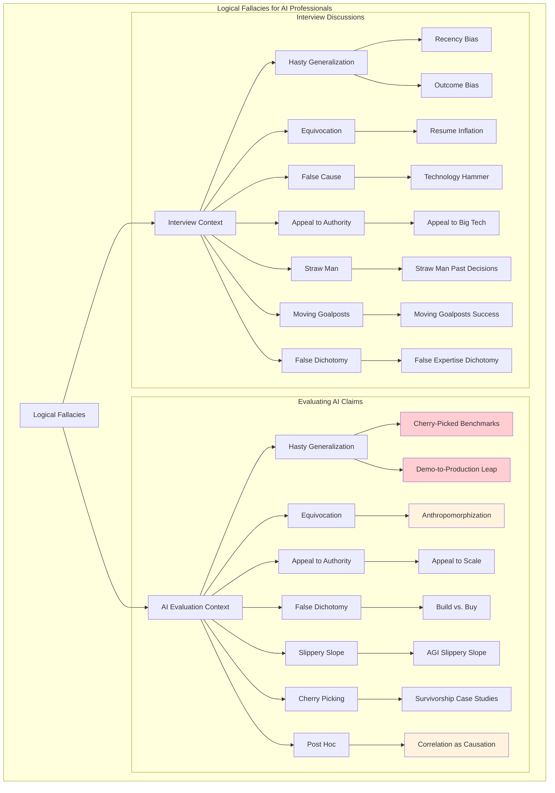

# Plan: Logical Fallacies Deep Dive Tutorial for AI Engineers

**Created:** 2025-12-23
**Source Analysis:** `logical-fallacies-focused.jsx`, `polya-analysis.md`, lesson-18 context
**Status:** Planning Phase

---

## Overview

Create a comprehensive tutorial system teaching **16 logical fallacies** critical for AI professionals, using the **Pólya 5-Phase Framework** and grounded with real examples from the lesson-18 dispute chatbot project.

---

## Fallacies Inventory (from logical-fallacies-focused.jsx)

### Context 1: Evaluating AI Claims (8 fallacies)

| # | Fallacy Name | Type | Definition |
|---|-------------|------|------------|
| 1 | Cherry-Picked Benchmarks | Hasty Generalization | Selecting only favorable metrics while ignoring failures or edge cases |
| 2 | Anthropomorphization | Equivocation | Using human cognitive terms that imply capabilities the AI doesn't have |
| 3 | Appeal to Scale | Appeal to Authority | Claiming quality because of large parameters, data, or compute |
| 4 | Demo-to-Production Leap | Hasty Generalization | Assuming curated demo performance reflects real-world reliability |
| 5 | False Dichotomy: Build vs. Buy | False Dichotomy | Presenting only two extreme options when hybrid approaches exist |
| 6 | AGI Slippery Slope | Slippery Slope | Claiming current capabilities inevitably lead to transformative AI |
| 7 | Survivorship in Case Studies | Cherry Picking | Showcasing only successful implementations, hiding failures |
| 8 | Correlation as Causation | Post Hoc | Attributing outcomes to AI when other factors contributed |

### Context 2: Interview Discussions (8 fallacies)

| # | Fallacy Name | Type | Definition |
|---|-------------|------|------------|
| 1 | Outcome Bias | Post Hoc | Judging decisions by results rather than the reasoning process |
| 2 | Resume Inflation Detection | Equivocation | Vague ownership claims that obscure actual contribution |
| 3 | Technology Hammer | False Cause | Advocating a technology because of familiarity, not fit |
| 4 | Appeal to Big Tech | Appeal to Authority | Citing employer prestige as proof of technical judgment |
| 5 | Straw Man on Past Decisions | Straw Man | Mischaracterizing previous team decisions to make yourself look better |
| 6 | Moving Goalposts on Success | Moving Goalposts | Redefining success metrics after the fact |
| 7 | False Expertise Dichotomy | False Dichotomy | Claiming you must be either hands-on OR strategic, not both |
| 8 | Recency Bias | Hasty Generalization | Overweighting recent experience while discounting relevant past work |

---

## Pólya 5-Phase Framework (from polya-analysis.md)

The tutorial structure follows George Pólya's problem-solving methodology:

| Phase | Pólya Mapping | Core Purpose | Primary Output |
|-------|---------------|--------------|----------------|
| **Understand** | Phase 1 | Comprehend requirements, context, constraints | Problem definition |
| **Plan** | Phase 2a | Select strategic approach, identify patterns | Solution strategy |
| **Tasks** | Phase 2b | Decompose into specific, executable subtasks | Task breakdown |
| **Execute** | Phase 3 | Implement with verification at each step | Working solution |
| **Reflect** | Phase 4 | Validate, extract lessons, generalize | Lessons learned |

### Key Pólya Questions Per Phase

**UNDERSTAND:**
- What is the unknown?
- What are the data?
- What is the condition?
- Can you restate the problem?

**PLAN:**
- Have you seen this problem before?
- Do you know a related problem?
- What heuristic applies?

**TASKS:**
- What are the specific steps?
- What is the correct order?
- How will you verify each task?

**EXECUTE:**
- Is each step correct?
- Did anything unexpected happen?
- Am I still on track?

**REFLECT:**
- Does the output satisfy requirements?
- What worked well?
- Can this generalize?

---

## Proposed File Structure

```
lesson-18/interactive/logical-fallacies/
├── TUTORIAL_INDEX.md                    # Navigation hub
├── 01_foundations.md                    # Introduction + Pólya framework
├── 02_evaluating_ai_claims/
│   ├── cherry_picked_benchmarks.md      # ~20 min each
│   ├── anthropomorphization.md
│   ├── appeal_to_scale.md
│   ├── demo_to_production_leap.md
│   ├── false_dichotomy_build_buy.md
│   ├── agi_slippery_slope.md
│   ├── survivorship_case_studies.md
│   └── correlation_as_causation.md
├── 03_interview_discussions/
│   ├── outcome_bias.md
│   ├── resume_inflation.md
│   ├── technology_hammer.md
│   ├── appeal_to_big_tech.md
│   ├── straw_man_decisions.md
│   ├── moving_goalposts.md
│   ├── false_expertise_dichotomy.md
│   └── recency_bias.md
├── 04_synthesis.md                      # Cross-cutting patterns
├── notebooks/
│   └── 01_fallacy_detection.ipynb       # Hands-on exercise
└── diagrams/
    └── fallacy_taxonomy.mmd             # Visual taxonomy
```

---

## Individual Tutorial Template (Pólya-Structured)

Each of the 16 fallacy tutorials follows this exact structure:

### Phase 1: UNDERSTAND (~3 min)

```markdown
## Phase 1: Understand the Fallacy

### What is the Unknown?
[Definition of the fallacy - what we're trying to detect]

### What are the Data?
**Red Flags:**
- [Red flag 1]
- [Red flag 2]
- [Red flag 3]

### Why This Matters for AI Engineers
[Real-world impact in AI product evaluation or technical interviews]

### Grounding Example (from Lesson-18)
[Specific trace, failure mode, or design pattern example]
```

### Phase 2: PLAN (~3 min)

```markdown
## Phase 2: Plan Your Detection Strategy

### Have You Seen This Before?
**Related Fallacies:**
- [Related fallacy 1] - [How it differs]
- [Related fallacy 2] - [How it differs]

### Strategic Approach
[Mental model for detecting this fallacy]

### Heuristic Selection
When you encounter [trigger pattern]:
→ Apply **[heuristic name]**: [description]
```

### Phase 3: TASKS (~5 min)

```markdown
## Phase 3: Detection Tasks

### Task 1: Identify the Claim Type
- What is being asserted?
- What evidence is provided?

### Task 2: Spot the Red Flags
- Check for [specific indicator]
- Look for [specific pattern]

### Task 3: Formulate Counter-Questions
- "Can you show me [specific evidence]?"
- "What about [alternative explanation]?"

### Task 4: Map to AI Failure Mode
| Fallacy Pattern | AI System Parallel |
|-----------------|-------------------|
| [Fallacy behavior] | [e.g., Fabrication, Classification Error] |
```

### Phase 4: EXECUTE (~5 min)

```markdown
## Phase 4: Execute Detection

### Worked Example

**Claim:** "[Example claim from JSX file]"

**Step 1: Parse the Claim**
[Analysis]

**Step 2: Apply Red Flag Checklist**
- [ ] [Red flag check 1]
- [ ] [Red flag check 2]

**Step 3: Counter-Response**
> "[Professional counter-question from JSX file]"

### Code Parallel (Defensive Coding Analogy)
```python
# Just as we validate inputs in code...
def validate_claim(claim: str, evidence: dict) -> bool:
    # [Analogous validation logic]
```
```

### Phase 5: REFLECT (~4 min)

```markdown
## Phase 5: Reflect and Generalize

### Key Takeaways
1. [Takeaway 1]
2. [Takeaway 2]
3. [Takeaway 3]

### Pattern Connections
This fallacy often appears alongside:
- [Related pattern 1]
- [Related pattern 2]

### Self-Assessment Quiz
1. [Question about identifying the fallacy]
2. [Question about red flags]
3. [Question about counter-response]
```

---

## Grounding Examples from Lesson-18

| Fallacy | Lesson-18 Grounding Source | Specific Example |
|---------|---------------------------|------------------|
| Cherry-Picked Benchmarks | `classification_failure_taxonomy.md` | 95% accuracy hides ambiguity failures in `amb_02` |
| Demo-to-Production Leap | `failure_taxonomy.md` | TRC-FAB-001: Agent fabricated TXN-002 that "worked" in demo |
| Correlation as Causation | `failure_taxonomy.md` | Evidence contradiction: delivery status ≠ customer receipt |
| Anthropomorphization | `design_patterns_deep_dive_narration.md` | "Agent understands context" vs. pattern matching in classify.py |
| Survivorship | Case study analysis | 5 failed pilots hidden behind "Company X saved $10M" |
| False Dichotomy | `ARCHITECTURE_RECOMMENDATION.md` | Build vs. buy RAG discussion in architecture decisions |
| Appeal to Scale | Parameter count claims | "70B parameters = handles anything" vs. task-specific failures |
| Technology Hammer | `ADR-001_State_Machine.md` | "Use LangGraph for everything" vs. trade-off analysis |

### Failure Mode Mappings

| Fallacy Category | AI Failure Mode (from failure_taxonomy.md) |
|------------------|-------------------------------------------|
| Cherry Picking / Survivorship | **Classification Error** - selecting favorable test cases |
| Anthropomorphization | **Evidence Fabrication** - "understanding" that hallucinates |
| Correlation as Causation | **Evidence Contradiction** - misattributing outcomes |
| Demo-to-Production Leap | **Network Timeout** - demo doesn't show retry/failure paths |
| False Dichotomy | **User Escalation** - forcing binary choices when clarification needed |

---

## Interactive Notebook Content (`01_fallacy_detection.ipynb`)

### Cell Structure

1. **Setup & Data Loading**
   - Load classification failure data from `classification_failure_taxonomy.md`
   - Load fabrication examples from `fabrication_examples.json`

2. **Exercise 1: Identify the Fallacy (5 statements)**
   ```python
   statements = [
       "Our model achieves 95% accuracy on internal benchmarks.",
       "With 70B parameters trained on the entire internet, it handles anything.",
       "At Google we did it this way, so that's the right approach.",
       "The model understands context and reasons about your needs.",
       "After deploying our AI, customer satisfaction increased 30%."
   ]
   # User selects fallacy type for each
   ```

3. **Exercise 2: Red Flag Detection**
   - Present AI vendor pitch
   - User highlights red flags
   - Score against checklist

4. **Exercise 3: Counter-Question Formulation**
   - Given a fallacious claim, user writes counter-question
   - Compare to suggested responses

5. **Vulnerability Profile Generation**
   ```python
   def generate_profile(responses: list) -> dict:
       """Identify which fallacy types user is most/least sensitive to."""
       # Categorize by fallacy type
       # Generate personalized study recommendations
   ```

---

## Mermaid Diagram: Fallacy Taxonomy (`fallacy_taxonomy.mmd`)



---

## Implementation Sequence

### Phase 1: Foundation (Day 1)
1. ✅ Create this planning document
2. Create `TUTORIAL_INDEX.md` with learning objectives and paths
3. Write `01_foundations.md` introducing Pólya framework + logical fallacies overview

### Phase 2: AI Claims Tutorials (Days 2-3)
4. Write 8 "Evaluating AI Claims" tutorials (priority order):
   - Cherry-Picked Benchmarks (most common)
   - Demo-to-Production Leap (high impact)
   - Anthropomorphization (AI-specific)
   - Appeal to Scale (timely)
   - Correlation as Causation
   - Survivorship in Case Studies
   - False Dichotomy: Build vs. Buy
   - AGI Slippery Slope

### Phase 3: Interview Tutorials (Days 4-5)
5. Write 8 "Interview Discussions" tutorials:
   - Outcome Bias
   - Resume Inflation Detection
   - Technology Hammer
   - Appeal to Big Tech
   - Straw Man on Past Decisions
   - Moving Goalposts on Success
   - False Expertise Dichotomy
   - Recency Bias

### Phase 4: Synthesis & Interactive (Day 6)
6. Create `04_synthesis.md` with cross-cutting patterns
7. Build interactive notebook with lesson-18 data
8. Generate Mermaid taxonomy diagram

---

## Quality Standards

| Criterion | Target |
|-----------|--------|
| Reading time per tutorial | 15-20 minutes |
| Pólya phase compliance | All 5 phases present |
| Grounding examples | Real lesson-18 data (not toy data) |
| Counter-questions | Actionable, professional tone |
| Code parallels | Defensive coding analogies |
| Self-assessment | 3 questions per tutorial |

---

## Estimated Deliverables

| Item | Count | Time Each | Total |
|------|-------|-----------|-------|
| Navigation index | 1 | 30 min | 30 min |
| Foundation tutorial | 1 | 45 min | 45 min |
| Fallacy tutorials | 16 | 45 min | 12 hours |
| Synthesis document | 1 | 1 hour | 1 hour |
| Interactive notebook | 1 | 2 hours | 2 hours |
| Mermaid diagram | 1 | 30 min | 30 min |
| **Total** | **21 files** | - | **~17 hours** |

---

## References

- **Source JSX:** `lesson-18/interactive/logical-fallacies-focused.jsx`
- **Pólya Framework:** `ai-dev-tasks/polya-analysis.md`
- **Failure Taxonomy:** `lesson-18/dispute-chatbot/qualitative/phase1/failure_taxonomy.md`
- **Design Patterns:** `lesson-18/dispute-schema/explanation/design_patterns_deep_dive_narration.md`
- **Classification Failures:** `lesson-18/dispute-chatbot/qualitative/phase1/classification_failure_taxonomy.md`
