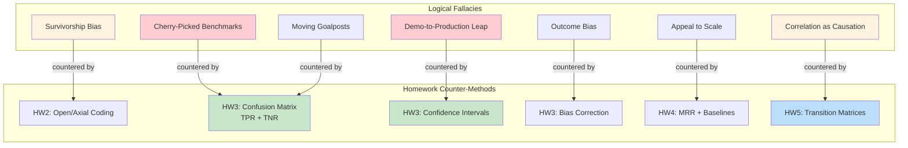

# Plan: Logical Fallacies Deep Dive Tutorial for AI Engineers (V2)

**Created:** 2025-12-23
**Updated:** 2025-12-23 (V2 - Enhanced with HW Evaluation Integration)
**Source Analysis:** `logical-fallacies-focused.jsx`, `polya-analysis.md`, lesson-18 context, **homeworks/HW1-5 evaluation methodologies**
**Status:** Planning Phase

---

## Overview

Create a comprehensive tutorial system teaching **16 logical fallacies** critical for AI professionals, using the **Pólya 5-Phase Framework** and grounded with real examples from the lesson-18 dispute chatbot project.

**V2 Enhancement:** Explicit integration with homework evaluation methodologies that directly counter these fallacies.

---

## V2 Key Enhancement: Fallacy ↔ Evaluation Method Integration

### Discovery from Homework Analysis

The homeworks provide a systematic progression from qualitative → quantitative → statistical evaluation—each method is a **counter-practice** to specific logical fallacies:

| HW | Evaluation Method | Fallacy It Counters | Why It Works |
|----|-------------------|---------------------|--------------|
| HW2 | Open/Axial Coding | Survivorship Bias | Systematic review prevents cherry-picked success stories |
| HW3 | TPR/TNR + Confusion Matrix | Cherry-Picked Benchmarks | Must report all 4 quadrants, not just accuracy |
| HW3 | 95% Confidence Intervals | Demo-to-Production Leap | Quantifies uncertainty, prevents false certainty |
| HW3 | Bias Correction (judgy) | Outcome Bias | Corrects for systematic errors in judgment |
| HW4 | Recall@k at multiple k values | Cherry-Picked Benchmarks | Shows full curve, not just favorable cutoffs |
| HW4 | MRR (Mean Reciprocal Rank) | Appeal to Scale | Quality of ranking > quantity of results |
| HW5 | Transition Matrices | Correlation as Causation | Proper attribution (LLM vs Tool failure) |

---

## Fallacies Inventory (from logical-fallacies-focused.jsx)

### Context 1: Evaluating AI Claims (8 fallacies)

| # | Fallacy Name | Type | Definition | HW Counter-Method |
|---|-------------|------|------------|-------------------|
| 1 | Cherry-Picked Benchmarks | Hasty Generalization | Selecting only favorable metrics while ignoring failures or edge cases | HW3: Full confusion matrix |
| 2 | Anthropomorphization | Equivocation | Using human cognitive terms that imply capabilities the AI doesn't have | HW2: Failure taxonomy (document actual behaviors) |
| 3 | Appeal to Scale | Appeal to Authority | Claiming quality because of large parameters, data, or compute | HW4: MRR shows quality ≠ quantity |
| 4 | Demo-to-Production Leap | Hasty Generalization | Assuming curated demo performance reflects real-world reliability | HW3: Confidence intervals |
| 5 | False Dichotomy: Build vs. Buy | False Dichotomy | Presenting only two extreme options when hybrid approaches exist | HW4: BM25 vs Vector vs Hybrid |
| 6 | AGI Slippery Slope | Slippery Slope | Claiming current capabilities inevitably lead to transformative AI | (No direct HW counter) |
| 7 | Survivorship in Case Studies | Cherry Picking | Showcasing only successful implementations, hiding failures | HW2: Open coding (systematic review) |
| 8 | Correlation as Causation | Post Hoc | Attributing outcomes to AI when other factors contributed | HW5: Transition matrices |

### Context 2: Interview Discussions (8 fallacies)

| # | Fallacy Name | Type | Definition | HW Counter-Method |
|---|-------------|------|------------|-------------------|
| 1 | Outcome Bias | Post Hoc | Judging decisions by results rather than the reasoning process | HW3: Bias correction formula |
| 2 | Resume Inflation Detection | Equivocation | Vague ownership claims that obscure actual contribution | HW2: Axial coding (precise categorization) |
| 3 | Technology Hammer | False Cause | Advocating a technology because of familiarity, not fit | HW4: Baseline comparisons |
| 4 | Appeal to Big Tech | Appeal to Authority | Citing employer prestige as proof of technical judgment | (No direct HW counter) |
| 5 | Straw Man on Past Decisions | Straw Man | Mischaracterizing previous team decisions to make yourself look better | HW2: Document original context |
| 6 | Moving Goalposts on Success | Moving Goalposts | Redefining success metrics after the fact | HW3: Pre-define TPR/TNR thresholds |
| 7 | False Expertise Dichotomy | False Dichotomy | Claiming you must be either hands-on OR strategic, not both | (No direct HW counter) |
| 8 | Recency Bias | Hasty Generalization | Overweighting recent experience while discounting relevant past work | HW5: Full trace analysis |

---

## Pólya 5-Phase Framework (from polya-analysis.md)

The tutorial structure follows George Pólya's problem-solving methodology:

| Phase | Pólya Mapping | Core Purpose | Primary Output |
|-------|---------------|--------------|----------------|
| **Understand** | Phase 1 | Comprehend requirements, context, constraints | Problem definition |
| **Plan** | Phase 2a | Select strategic approach, identify patterns | Solution strategy |
| **Tasks** | Phase 2b | Decompose into specific, executable subtasks | Task breakdown |
| **Execute** | Phase 3 | Implement with verification at each step | Working solution |
| **Reflect** | Phase 4 | Validate, extract lessons, generalize | Lessons learned |

### Key Pólya Questions Per Phase

**UNDERSTAND:**
- What is the unknown?
- What are the data?
- What is the condition?
- Can you restate the problem?

**PLAN:**
- Have you seen this problem before?
- Do you know a related problem?
- What heuristic applies?

**TASKS:**
- What are the specific steps?
- What is the correct order?
- How will you verify each task?

**EXECUTE:**
- Is each step correct?
- Did anything unexpected happen?
- Am I still on track?

**REFLECT:**
- Does the output satisfy requirements?
- What worked well?
- Can this generalize?

---

## Proposed File Structure (V2 Enhanced)

```
lesson-18/interactive/logical-fallacies/
├── TUTORIAL_INDEX.md                    # Navigation hub
├── 01_foundations.md                    # Introduction + Pólya framework
├── 02_evaluating_ai_claims/
│   ├── cherry_picked_benchmarks.md      # ~20 min each (includes Phase 6)
│   ├── anthropomorphization.md
│   ├── appeal_to_scale.md
│   ├── demo_to_production_leap.md
│   ├── false_dichotomy_build_buy.md
│   ├── agi_slippery_slope.md
│   ├── survivorship_case_studies.md
│   └── correlation_as_causation.md
├── 03_interview_discussions/
│   ├── outcome_bias.md
│   ├── resume_inflation.md
│   ├── technology_hammer.md
│   ├── appeal_to_big_tech.md
│   ├── straw_man_decisions.md
│   ├── moving_goalposts.md
│   ├── false_expertise_dichotomy.md
│   └── recency_bias.md
├── 04_synthesis.md                      # Cross-cutting patterns + HW mapping table
├── 05_evaluation_anti_patterns.md       # NEW: Evaluation mistakes as fallacies
├── notebooks/
│   └── 01_fallacy_detection.ipynb       # Enhanced with 6 exercises (3 new HW-based)
└── diagrams/
    ├── fallacy_taxonomy.mmd             # Visual taxonomy
    └── fallacy_hw_mapping.mmd           # NEW: Visual HW connections
```

---

## Individual Tutorial Template (V2 Enhanced with Phase 6)

Each of the 16 fallacy tutorials follows this exact structure:

### Phase 1: UNDERSTAND (~3 min)

```markdown
## Phase 1: Understand the Fallacy

### What is the Unknown?
[Definition of the fallacy - what we're trying to detect]

### What are the Data?
**Red Flags:**
- [Red flag 1]
- [Red flag 2]
- [Red flag 3]

### Why This Matters for AI Engineers
[Real-world impact in AI product evaluation or technical interviews]

### Grounding Example (from Lesson-18)
[Specific trace, failure mode, or design pattern example]
```

### Phase 2: PLAN (~3 min)

```markdown
## Phase 2: Plan Your Detection Strategy

### Have You Seen This Before?
**Related Fallacies:**
- [Related fallacy 1] - [How it differs]
- [Related fallacy 2] - [How it differs]

### Strategic Approach
[Mental model for detecting this fallacy]

### Heuristic Selection
When you encounter [trigger pattern]:
→ Apply **[heuristic name]**: [description]
```

### Phase 3: TASKS (~5 min)

```markdown
## Phase 3: Detection Tasks

### Task 1: Identify the Claim Type
- What is being asserted?
- What evidence is provided?

### Task 2: Spot the Red Flags
- Check for [specific indicator]
- Look for [specific pattern]

### Task 3: Formulate Counter-Questions
- "Can you show me [specific evidence]?"
- "What about [alternative explanation]?"

### Task 4: Map to AI Failure Mode
| Fallacy Pattern | AI System Parallel |
|-----------------|-------------------|
| [Fallacy behavior] | [e.g., Fabrication, Classification Error] |
```

### Phase 4: EXECUTE (~5 min)

```markdown
## Phase 4: Execute Detection

### Worked Example

**Claim:** "[Example claim from JSX file]"

**Step 1: Parse the Claim**
[Analysis]

**Step 2: Apply Red Flag Checklist**
- [ ] [Red flag check 1]
- [ ] [Red flag check 2]

**Step 3: Counter-Response**
> "[Professional counter-question from JSX file]"

### Code Parallel (Defensive Coding Analogy)
```python
# Just as we validate inputs in code...
def validate_claim(claim: str, evidence: dict) -> bool:
    # [Analogous validation logic]
```
```

### Phase 5: REFLECT (~4 min)

```markdown
## Phase 5: Reflect and Generalize

### Key Takeaways
1. [Takeaway 1]
2. [Takeaway 2]
3. [Takeaway 3]

### Pattern Connections
This fallacy often appears alongside:
- [Related pattern 1]
- [Related pattern 2]

### Self-Assessment Quiz
1. [Question about identifying the fallacy]
2. [Question about red flags]
3. [Question about counter-response]
```

### Phase 6: EVALUATION COUNTER-PRACTICE (NEW in V2) (~3 min)

```markdown
## Phase 6: Evaluation Counter-Practice (HW Connection)

### Counter-Method from Course
**Homework:** HW[X]: [Title]
**Method:** [Specific evaluation method]
**File Reference:** `homeworks/hw[X]/[file]:[lines]`

### How It Counters This Fallacy
[Explanation of how the HW method prevents this fallacy]

### Practical Application
```python
# Example from homeworks/hw[X]/scripts/...
[Actual code snippet showing the counter-practice]
```

### When to Apply
Use this counter-method when:
- [Scenario 1]
- [Scenario 2]
```

---

## NEW Section: Evaluation Anti-Patterns as Fallacies (`05_evaluation_anti_patterns.md`)

### Overview
Maps common evaluation mistakes to logical fallacies, showing how rigorous evaluation methodology is a defense against flawed reasoning.

### Content Structure

```markdown
# Evaluation Anti-Patterns as Logical Fallacies

## Introduction
Every evaluation mistake is a logical fallacy in disguise. This section maps common
AI evaluation pitfalls to the fallacies they represent.

## Anti-Pattern 1: Only Reporting Accuracy
**Fallacy:** Cherry-Picked Benchmarks
**The Mistake:** Reporting "95% accuracy" without TPR/TNR breakdown
**The Problem:** Hides class imbalance (90% PASS, 10% FAIL → 90% accuracy by always saying PASS)
**Counter-Practice:** HW3 Confusion Matrix
**Code Reference:** `homeworks/hw3/scripts/evaluate_judge.py:138-144`

## Anti-Pattern 2: Using Dev Set for Final Evaluation
**Fallacy:** Demo-to-Production Leap
**The Mistake:** Iterating 20x on dev set, reporting dev set metrics as final
**The Problem:** Overfitting to dev examples doesn't generalize
**Counter-Practice:** HW3 Train/Dev/Test Split (15%/40%/45%)
**Code Reference:** `homeworks/hw3/data_labeling_tutorial.ipynb`

## Anti-Pattern 3: Post-Hoc Metric Selection
**Fallacy:** Moving Goalposts
**The Mistake:** Choosing metrics after seeing results
**The Problem:** Can always find a metric that looks good
**Counter-Practice:** HW3 Pre-define TPR/TNR thresholds before evaluation
**Code Reference:** `homeworks/hw3/llm_judge_concepts.md:370-388`

## Anti-Pattern 4: Citing Model Size as Quality
**Fallacy:** Appeal to Scale
**The Mistake:** "70B parameters trained on the entire internet"
**The Problem:** Size ≠ task performance
**Counter-Practice:** HW4 MRR shows ranking quality independent of retrieval volume
**Code Reference:** `homeworks/hw4/retrieval_metrics_tutorial.md:156-238`

## Anti-Pattern 5: Misattributing Failures
**Fallacy:** Correlation as Causation
**The Mistake:** "Recipe search is broken" without checking if LLM generated bad queries
**The Problem:** Wrong fix for wrong problem
**Counter-Practice:** HW5 Transition Matrices (LLM vs Tool attribution)
**Code Reference:** `homeworks/hw5/transition_analysis_concepts.md:282-322`

## Anti-Pattern 6: Showcasing Only Successes
**Fallacy:** Survivorship Bias
**The Mistake:** Case study shows 5 successful deployments, hides 20 failures
**The Problem:** Selection bias in evidence
**Counter-Practice:** HW2 Open Coding (systematic review of all traces)
**Code Reference:** `homeworks/hw2/error_analysis_concepts.md:105-236`

## Anti-Pattern 7: Point Estimates Without Uncertainty
**Fallacy:** False Certainty (Demo-to-Production Leap variant)
**The Mistake:** "Success rate: 87.3%" without confidence interval
**The Problem:** Could be anywhere from 65% to 100%
**Counter-Practice:** HW3 Bootstrap Confidence Intervals
**Code Reference:** `homeworks/hw3/bias_correction_tutorial.md:326-412`

## Summary Table

| Anti-Pattern | Fallacy | HW Counter | Key Metric |
|--------------|---------|------------|------------|
| Only accuracy | Cherry-Picking | HW3 | TPR + TNR |
| Dev set final | Demo-to-Production | HW3 | Test set only |
| Post-hoc metrics | Moving Goalposts | HW3 | Pre-defined thresholds |
| Size = quality | Appeal to Scale | HW4 | MRR |
| Wrong attribution | Correlation ≠ Causation | HW5 | Transition matrix |
| Only successes | Survivorship | HW2 | Open coding |
| No uncertainty | False Certainty | HW3 | 95% CI |
```

---

## Grounding Examples from Lesson-18 (V2 Enhanced)

| Fallacy | Lesson-18 Grounding Source | Specific Example | HW Parallel |
|---------|---------------------------|------------------|-------------|
| Cherry-Picked Benchmarks | `classification_failure_taxonomy.md` | 95% accuracy hides ambiguity failures in `amb_02` | HW3: TPR=0.95, TNR=0.60 reveals leniency |
| Demo-to-Production Leap | `failure_taxonomy.md` | TRC-FAB-001: Agent fabricated TXN-002 that "worked" in demo | HW3: Dev TPR=0.95 → Test TPR=0.78 |
| Correlation as Causation | `failure_taxonomy.md` | Evidence contradiction: delivery status ≠ customer receipt | HW5: (GenRec→GetRec)=22, is it LLM or Tool? |
| Anthropomorphization | `design_patterns_deep_dive_narration.md` | "Agent understands context" vs. pattern matching in classify.py | HW2: 8 failure modes show actual behaviors |
| Survivorship | Case study analysis | 5 failed pilots hidden behind "Company X saved $10M" | HW2: Open coding reveals all outcomes |
| False Dichotomy | `ARCHITECTURE_RECOMMENDATION.md` | Build vs. buy RAG discussion in architecture decisions | HW4: BM25 vs Vector vs Hybrid |
| Appeal to Scale | Parameter count claims | "70B parameters = handles anything" vs. task-specific failures | HW4: MRR shows quality ≠ scale |
| Technology Hammer | `ADR-001_State_Machine.md` | "Use LangGraph for everything" vs. trade-off analysis | HW4: Baseline comparison methodology |

### Failure Mode Mappings (V2 Enhanced)

| Fallacy Category | AI Failure Mode (from failure_taxonomy.md) | HW Counter-Practice |
|------------------|-------------------------------------------|---------------------|
| Cherry Picking / Survivorship | **Classification Error** - selecting favorable test cases | HW2: Systematic open coding |
| Anthropomorphization | **Evidence Fabrication** - "understanding" that hallucinates | HW2: Document actual failure modes |
| Correlation as Causation | **Evidence Contradiction** - misattributing outcomes | HW5: Transition matrix attribution |
| Demo-to-Production Leap | **Network Timeout** - demo doesn't show retry/failure paths | HW3: Test set evaluation with CI |
| False Dichotomy | **User Escalation** - forcing binary choices when clarification needed | HW4: Multiple baseline comparisons |

---

## Interactive Notebook Content (V2 Enhanced)

### `01_fallacy_detection.ipynb`

#### Original Exercises (1-3)

**Exercise 1: Identify the Fallacy (5 statements)**
```python
statements = [
    "Our model achieves 95% accuracy on internal benchmarks.",
    "With 70B parameters trained on the entire internet, it handles anything.",
    "At Google we did it this way, so that's the right approach.",
    "The model understands context and reasons about your needs.",
    "After deploying our AI, customer satisfaction increased 30%."
]
# User selects fallacy type for each
```

**Exercise 2: Red Flag Detection**
- Present AI vendor pitch
- User highlights red flags
- Score against checklist

**Exercise 3: Counter-Question Formulation**
- Given a fallacious claim, user writes counter-question
- Compare to suggested responses

#### NEW V2 Exercises (4-6)

**Exercise 4: Spot the Evaluation Fallacy**
```python
# Present a biased metrics report
report = """
=== Model Evaluation Report ===
Accuracy: 95%
Training samples: 10,000
Model size: 70B parameters
Benchmark: Internal test set (curated)
"""

# User identifies fallacies:
# 1. Cherry-picking: No TPR/TNR breakdown
# 2. Appeal to Scale: 70B parameters cited
# 3. Demo-to-Production: "curated" test set

# Provide corrected report template
corrected_template = """
=== Corrected Report ===
TPR: ___ (sensitivity)
TNR: ___ (specificity)
95% CI: [___, ___]
Test set: Held-out, unseen during development
"""
```

**Exercise 5: Counter Cherry-Picking with Confusion Matrix**
```python
# Load simulated judge predictions
predictions = [
    {"true_label": "PASS", "predicted": "PASS"},  # TP
    {"true_label": "PASS", "predicted": "FAIL"},  # FN
    {"true_label": "FAIL", "predicted": "PASS"},  # FP (leniency!)
    # ... more examples
]

# Calculate metrics
def reveal_hidden_leniency(predictions):
    """
    Show how TPR=0.95, TNR=0.60 reveals hidden leniency
    that 'accuracy' hides.
    """
    tp = sum(1 for p in predictions if p["true_label"] == "PASS" and p["predicted"] == "PASS")
    fn = sum(1 for p in predictions if p["true_label"] == "PASS" and p["predicted"] == "FAIL")
    tn = sum(1 for p in predictions if p["true_label"] == "FAIL" and p["predicted"] == "FAIL")
    fp = sum(1 for p in predictions if p["true_label"] == "FAIL" and p["predicted"] == "PASS")

    tpr = tp / (tp + fn) if (tp + fn) > 0 else 0
    tnr = tn / (tn + fp) if (tn + fp) > 0 else 0
    accuracy = (tp + tn) / len(predictions)

    return {
        "accuracy": accuracy,  # Looks good!
        "tpr": tpr,            # Sensitivity
        "tnr": tnr,            # Reveals leniency!
    }

# User sees: accuracy=0.85 but tnr=0.60 → judge misses 40% of failures!
```

**Exercise 6: Counter Correlation as Causation with Transition Analysis**
```python
# Load simulated transition matrix (HW5 style)
transition_matrix = {
    ("GenRecipeArgs", "GetRecipes"): 22,  # High frequency
    ("PlanToolCalls", "GenRecipeArgs"): 5,
    ("GetRecipes", "ComposeResponse"): 8,
}

# Question: Is (GenRecipeArgs → GetRecipes) an LLM or Tool failure?

def diagnose_failure_attribution(last_success, first_failure, trace_sample):
    """
    User learns to distinguish:
    - Pattern A: LLM generates invalid args → Tool fails (LLM issue)
    - Pattern B: LLM generates valid args → Tool returns empty (Tool issue)
    """
    # Show trace examples for each pattern
    pass

# User identifies: proper attribution prevents wrong fix
```

#### Vulnerability Profile Generation (Original)
```python
def generate_profile(responses: list) -> dict:
    """Identify which fallacy types user is most/least sensitive to."""
    # Categorize by fallacy type
    # Generate personalized study recommendations
```

---

## NEW Diagram: Fallacy-HW Mapping (`diagrams/fallacy_hw_mapping.mmd`)



---

## Implementation Sequence (V2 Updated)

### Phase 1: Foundation (Day 1)
1. ✅ Create this planning document (V2)
2. Create `TUTORIAL_INDEX.md` with learning objectives and paths
3. Write `01_foundations.md` introducing Pólya framework + logical fallacies overview

### Phase 2: AI Claims Tutorials (Days 2-3)
4. Write 8 "Evaluating AI Claims" tutorials (priority order):
   - Cherry-Picked Benchmarks (most common) + HW3 connection
   - Demo-to-Production Leap (high impact) + HW3 CI connection
   - Anthropomorphization (AI-specific) + HW2 connection
   - Appeal to Scale (timely) + HW4 connection
   - Correlation as Causation + HW5 connection
   - Survivorship in Case Studies + HW2 connection
   - False Dichotomy: Build vs. Buy + HW4 connection
   - AGI Slippery Slope

### Phase 3: Interview Tutorials (Days 4-5)
5. Write 8 "Interview Discussions" tutorials:
   - Outcome Bias + HW3 bias correction connection
   - Resume Inflation Detection + HW2 connection
   - Technology Hammer + HW4 connection
   - Appeal to Big Tech
   - Straw Man on Past Decisions + HW2 connection
   - Moving Goalposts on Success + HW3 connection
   - False Expertise Dichotomy
   - Recency Bias + HW5 connection

### Phase 4: Synthesis & Interactive (Days 6-7)
6. Create `04_synthesis.md` with cross-cutting patterns + fallacy↔HW mapping table
7. **NEW:** Create `05_evaluation_anti_patterns.md`
8. Build interactive notebook with lesson-18 data + **3 new HW-based exercises**
9. Generate Mermaid taxonomy diagram
10. **NEW:** Generate `fallacy_hw_mapping.mmd` diagram

---

## Quality Standards (V2 Updated)

| Criterion | Target |
|-----------|--------|
| Reading time per tutorial | 18-23 minutes (was 15-20, +Phase 6) |
| Pólya phase compliance | All 6 phases present (was 5) |
| Grounding examples | Real lesson-18 data (not toy data) |
| HW counter-method | Referenced with file:line for 12+ fallacies |
| Counter-questions | Actionable, professional tone |
| Code parallels | Defensive coding analogies + HW code snippets |
| Self-assessment | 3 questions per tutorial |

---

## Estimated Deliverables (V2 Updated)

| Item | Count | Time Each | Total |
|------|-------|-----------|-------|
| Navigation index | 1 | 30 min | 30 min |
| Foundation tutorial | 1 | 45 min | 45 min |
| Fallacy tutorials (with Phase 6) | 16 | 60 min | 16 hours |
| Synthesis document (with HW table) | 1 | 1.5 hours | 1.5 hours |
| **NEW:** Evaluation anti-patterns | 1 | 1.5 hours | 1.5 hours |
| Interactive notebook (6 exercises) | 1 | 3 hours | 3 hours |
| Mermaid diagram (taxonomy) | 1 | 30 min | 30 min |
| **NEW:** Mermaid diagram (HW mapping) | 1 | 30 min | 30 min |
| **Total** | **23 files** | - | **~24 hours** |

---

## References

### Original Sources
- **Source JSX:** `lesson-18/interactive/logical-fallacies-focused.jsx`
- **Pólya Framework:** `ai-dev-tasks/polya-analysis.md`
- **Failure Taxonomy:** `lesson-18/dispute-chatbot/qualitative/phase1/failure_taxonomy.md`
- **Design Patterns:** `lesson-18/dispute-schema/explanation/design_patterns_deep_dive_narration.md`
- **Classification Failures:** `lesson-18/dispute-chatbot/qualitative/phase1/classification_failure_taxonomy.md`

### V2 Additional Sources (Homework Integration)
- **Evaluation Methodology Report:** `homeworks/EVALUATION_METHODOLOGY_RESEARCH_REPORT.md`
- **HW2 Failure Taxonomy:** `homeworks/hw2/failure_mode_taxonomy.md`
- **HW3 LLM-as-Judge:** `homeworks/hw3/llm_judge_concepts.md`
- **HW3 Bias Correction:** `homeworks/hw3/bias_correction_tutorial.md`
- **HW4 Retrieval Metrics:** `homeworks/hw4/retrieval_metrics_tutorial.md`
- **HW5 Transition Analysis:** `homeworks/hw5/transition_analysis_concepts.md`
- **HW3 Tutorial Index:** `homeworks/hw3/TUTORIAL_INDEX.md`
- **HW5 Tutorial Index:** `homeworks/hw5/TUTORIAL_INDEX.md`

---

## Changelog

### V2 (2025-12-23)
- Added Fallacy ↔ HW Evaluation Method mapping table
- Added Phase 6 (Evaluation Counter-Practice) to tutorial template
- Added new section `05_evaluation_anti_patterns.md`
- Enhanced notebook with 3 new HW-based exercises
- Added `fallacy_hw_mapping.mmd` diagram
- Updated grounding examples with HW parallels
- Revised time estimates (+7 hours for HW integration)

### V1 (2025-12-23)
- Initial plan with Pólya 5-Phase framework
- 16 fallacies across 2 contexts
- Lesson-18 grounding examples
