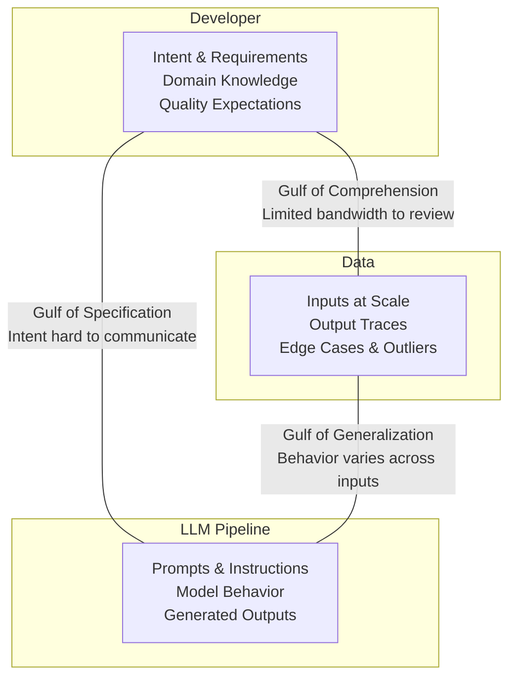
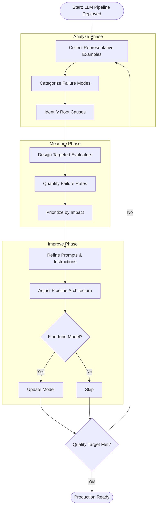
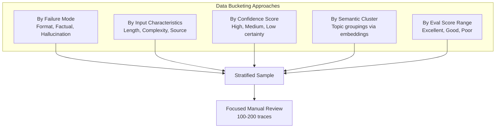
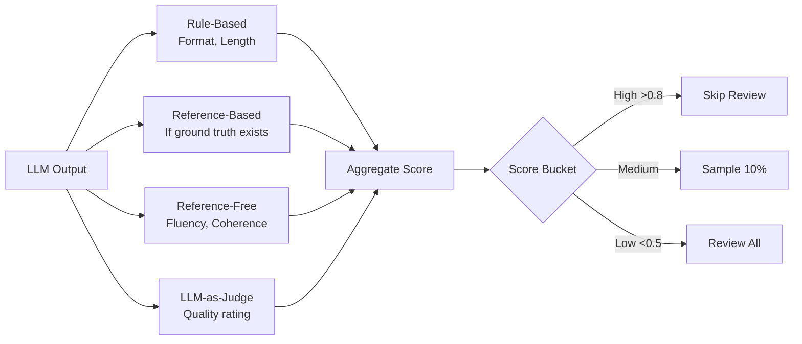
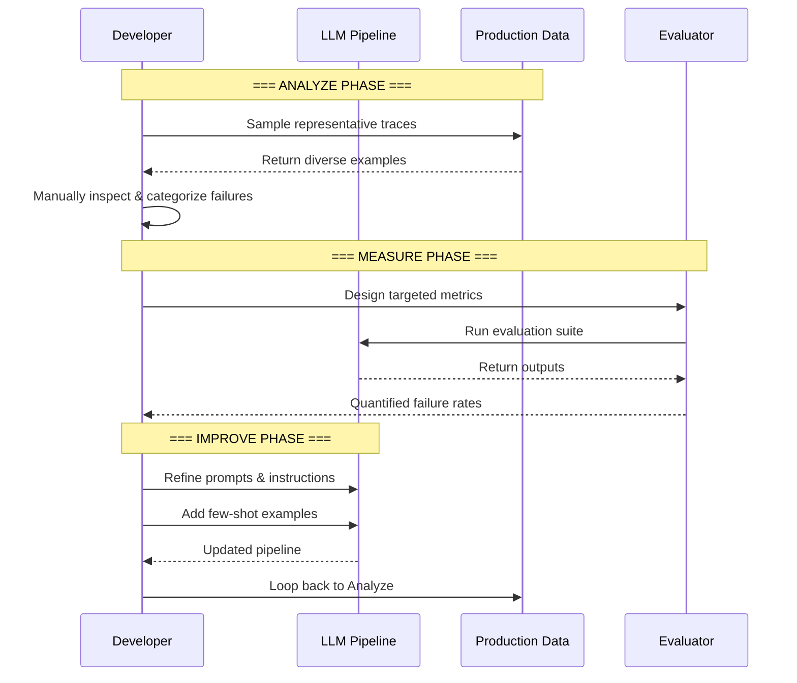
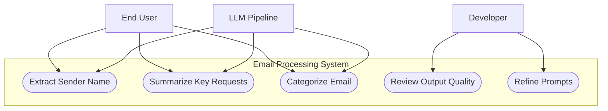

# Tutorial 01: Introduction - The Three Gulfs

**Source:** Chapter 1 of "Application-Centric AI Evals for Engineers and Technical Product Managers"
**Authors:** Shreya Shankar and Hamel Husain
**Reading Time:** 35 minutes
**Difficulty:** Beginner

---

## Learning Objectives

By the end of this tutorial, you will be able to:

- [ ] Define "evaluation" in the context of LLM pipelines and distinguish it from traditional software testing
- [ ] Identify and explain the Three Gulfs model: Comprehension, Specification, and Generalization
- [ ] Articulate why LLM pipeline evaluation requires fundamentally different approaches than traditional ML or software testing
- [ ] Apply the Analyze-Measure-Improve lifecycle to structure your evaluation practice
- [ ] Recognize which Gulf is the root cause when diagnosing LLM pipeline failures
- [ ] Apply data bucketing strategies to sample effectively at scale
- [ ] Choose appropriate automated evaluation types for different quality dimensions
- [ ] Use the specification checklist to remove prompt ambiguity systematically
- [ ] Validate first principles using stopping criteria (Reconstruction, Physical Law, Domain Independence)

---

## Phase 1: Establish Baseline (WHAT)

### What is Evaluation?

**Evaluation** refers to the systematic measurement of quality in an LLM pipeline. A good evaluation produces results that can be easily and unambiguously interpreted—typically a quantitative score, but it can also take the form of a structured qualitative summary or report.

Throughout this course, we refer to an evaluation metric as an **eval**. A single pipeline will often use multiple evals to measure different aspects of performance.

> **Key Definition:** An eval is a specific measurement that assesses one dimension of LLM pipeline quality. Multiple evals combine to give a complete picture of system performance.

### The Three Gulfs Model

The **Three Gulfs** model provides a framework for understanding the fundamental challenges in LLM application development. Adapted from Donald Norman's design theory (1988) and extended by Shankar et al. (2025), this model identifies three critical gaps that developers must bridge:



#### Gulf 1: Comprehension (Developer ↔ Data)

The Gulf of Comprehension separates you, the developer, from fully understanding both your data and your pipeline's behavior on that data.

**The dual challenge:**
1. Understanding the *input data* distribution—the queries, documents, or requests your pipeline will encounter
2. Understanding the *output traces*—how your pipeline actually behaves across that input space

At scale, it is difficult to know the characteristics of your input data, detect errors within it, or identify unusual patterns. Thousands of inputs might arrive daily, with diverse formats and varying levels of clarity. You cannot realistically review each one manually.

#### Gulf 2: Specification (Developer ↔ LLM Pipeline)

The Gulf of Specification separates what you *mean* from what you actually *specify* in the pipeline. Your intent—the task you want the LLM to perform—is often only loosely captured by the prompts you write.

**Example:** Consider a simple prompt:
> "Extract the sender's name and summarize the key requests in this email."

This sounds specific, but critical questions remain unanswered:
- Should the summary be a paragraph or a bulleted list?
- Should the sender be the display name, the full email address, or both?
- Should the summary include implicit requests, or only explicit ones?
- How concise or detailed should the summary be?

The LLM cannot infer these decisions unless you explicitly specify them.

#### Gulf 3: Generalization (Data ↔ LLM Pipeline)

The Gulf of Generalization separates your data from the pipeline's ability to handle it consistently. Even if prompts are carefully written, LLMs may behave inconsistently across different inputs.

**Example:** In an email processing pipeline, imagine an email that mentions a public figure like Elon Musk within the body text. The model might mistakenly extract this name as the sender, even though it is unrelated to the actual email metadata. This is not a prompting error—it is a generalization failure.

### Key Terminology

| Term | Definition |
|------|------------|
| **Eval** | A systematic measurement of quality in an LLM pipeline |
| **Trace** | A complete record of an LLM interaction: input, processing steps, and output |
| **Ground Truth** | A known, verified correct answer used as a reference |
| **Reference-Based Metric** | Compares LLM output against ground truth |
| **Reference-Free Metric** | Evaluates output based on inherent properties without a reference |
| **Pipeline** | The complete system including prompts, model, and any preprocessing/postprocessing |

### Scope: Application-Centric Evaluation

This tutorial focuses on **application-centric evaluation**—assessing whether your specific pipeline performs successfully on your specific task using your realistic data. This differs fundamentally from **foundation model evaluation** (benchmarks like MMLU, HELM, or GSM8k) which assess general model capabilities.

#### Foundation Model Benchmarks Explained

| Benchmark | What It Tests | Format |
|-----------|--------------|--------|
| **MMLU** (Massive Multitask Language Understanding) | Knowledge across 57 subjects (STEM, humanities, law, medicine) | Multiple-choice questions at varying difficulty levels |
| **HELM** (Holistic Evaluation of Language Models) | Multi-dimensional assessment: accuracy, calibration, robustness, fairness, bias, toxicity | Stanford framework evaluating across multiple scenarios |
| **GSM8k** (Grade School Math 8K) | Multi-step reasoning and arithmetic | 8,500 word problems requiring chain-of-thought reasoning |

**Why these don't replace application evals:**
- MMLU tests general knowledge, not your specific domain
- HELM reveals trade-offs but not your failure modes
- GSM8k tests reasoning but not your task format

> **Analogy:** Foundation model benchmarks are **standardized tests** (SAT, GRE). Application evals are **job interviews**—testing specific skills for your specific role.

Foundation model benchmarks offer a rough sense of a model's overall power for initial selection. But they cannot capture the specific failure modes of your pipeline on your data.

---

## Phase 2: Challenge Assumptions (WHY)

### Assumption 1: "Traditional Testing Works for LLMs"

**The conventional belief:** Software testing principles—unit tests, integration tests, regression tests—should apply directly to LLM pipelines.

**The challenge:** LLM pipelines do not produce deterministic outputs. Their responses are often subjective, context-dependent, and multifaceted. A response may be factually accurate but inappropriate (the "vibes are off"). It may sound persuasive while conveying incorrect information.

**Why this assumption fails:**
- Traditional software: Given input X, expect output Y. Pass/fail is binary.
- LLM pipelines: Given input X, any of outputs Y₁, Y₂, ... Yₙ might be acceptable.
- There is no single "correct" answer for most LLM tasks.

### Assumption 2: "Good Prompts Guarantee Good Outputs"

**The conventional belief:** If you write clear, detailed prompts, the LLM will consistently produce good outputs.

**The challenge:** The Gulf of Generalization means that even perfectly specified prompts fail on edge cases. LLM behavior varies across inputs in ways that cannot be predicted from the prompt alone.

**Why this assumption fails:**
- LLMs are trained on statistical patterns, not logical rules
- Unusual input combinations trigger unexpected behaviors
- Model updates can change behavior without changing prompts

### Assumption 3: "We Can Manually Review All Outputs"

**The conventional belief:** Quality can be ensured by having humans review LLM outputs.

**The challenge:** The Gulf of Comprehension makes this impossible at scale. If your application processes 10,000 requests per day, manual review of each output is not feasible.

**Why this assumption fails:**
- Human attention is a finite resource
- Errors and outliers are not obvious at scale
- Review fatigue leads to missed issues

### Hidden Assumptions Exposed

| Hidden Assumption | Reality |
|-------------------|---------|
| "Requirements are stable" | Requirements emerge only after interacting with early outputs |
| "Metrics are obvious" | Appropriate metrics are rarely obvious at the outset |
| "Generic benchmarks suffice" | Only examining real outputs on real data reveals true failure modes |
| "One evaluation pass is enough" | Evaluation must be iterative and continuous |

---

## Phase 3: Drill to Axioms (RECURSIVE WHYS)

### Axiom Chain 1: Gulf of Comprehension

```
Why can't we manually review all outputs?
├── Because the volume is too high (thousands per day)
│   └── Why does volume matter?
│       ├── Because human attention is limited
│       │   └── Why is human attention limited?
│       │       └── AXIOM: Human cognitive bandwidth is finite
│       └── Because time is constrained
│           └── AXIOM: Time is a non-renewable resource
```

**First Principle Reached:** Human cognitive bandwidth is finite. No amount of process improvement can overcome the fundamental limitation that humans can only process a finite number of items with full attention.

**Stopping Criteria Met:**
- ✓ Regress Termination: Further "why" produces no new understanding
- ✓ Domain Independence: Applies across all human review scenarios
- ✓ Physical Law: Grounded in cognitive science

### Axiom Chain 2: Gulf of Specification

```
Why are prompts underspecified?
├── Because developers don't anticipate all edge cases
│   └── Why can't developers anticipate edge cases?
│       ├── Because they haven't seen the full data distribution
│       │   └── AXIOM: Knowledge is bounded by experience
│       └── Because natural language is ambiguous
│           └── Why is natural language ambiguous?
│               └── AXIOM: Language is inherently underspecified
```

**First Principle Reached:** Language is inherently underspecified. Natural language evolved for human-to-human communication with shared context; it was never designed for precise machine instruction.

**Stopping Criteria Met:**
- ✓ Circularity Test: Attempting to prove this requires assuming it
- ✓ Expert Convergence: Linguists agree on language ambiguity
- ✓ Definitional Truth: Ambiguity is intrinsic to natural language

### Axiom Chain 3: Gulf of Generalization

```
Why do LLMs fail on edge cases?
├── Because LLMs are probabilistic
│   └── Why are LLMs probabilistic?
│       ├── Because they predict the most likely next token
│       │   └── Why predict likely tokens?
│       │       └── AXIOM: LLMs are statistical pattern matchers
│       └── Because no model can perfectly cover all inputs
│           └── AXIOM: Perfect generalization is impossible
```

**First Principle Reached:** LLMs are statistical pattern matchers trained to predict likely sequences, not to reason logically. They will always exhibit biases and inconsistencies on inputs that differ from their training distribution.

**Stopping Criteria Met:**
- ✓ Reconstruction Test: LLM behavior can be explained from this foundation
- ✓ Physical/Logical Law: Grounded in machine learning theory (Kalai and Vempala 2024)
- ✓ Domain Independence: Applies to all statistical learning systems

##### Understanding the Stopping Criteria

These tests determine when you've reached a true **first principle (axiom)**—bedrock truth you can't dig deeper than:

| Criterion | What It Tests | How to Verify |
|-----------|--------------|---------------|
| **Reconstruction Test** | Can you work *forward* from this axiom to explain observed behaviors? | List 3-5 LLM behaviors; each should be explainable from the axiom |
| **Physical/Logical Law** | Is this grounded in formal theory or mathematical proof? | Cite research paper, theorem, or established scientific principle |
| **Domain Independence** | Does this apply universally, not just to one model/situation? | Test: Does it hold for GPT, Claude, Llama, and future models? |

**Reconstruction Test in Action:**

```
AXIOM: "LLMs are statistical pattern matchers"

Can this explain...
✓ Why LLMs hallucinate? → They generate statistically plausible 
                          sequences, not verified facts
✓ Why LLMs are inconsistent? → Different inputs activate different
                               statistical patterns
✓ Why prompts fail unexpectedly? → Edge cases don't match training
                                   distribution
✓ Why fine-tuning helps? → Shifts statistical distribution toward
                           domain-specific patterns

ALL BEHAVIORS RECONSTRUCTABLE → Axiom validated
```

**Physical/Logical Law Grounding:**

The Kalai & Vempala (2024) research formally proves that transformer language models learn to approximate P(next_token | context) from training data. This means:
- LLMs predict what's LIKELY, not what's TRUE
- This is not a bug—it's the mathematical foundation of how transformers work
- No prompt engineering can fully overcome this; you must design around it

**Domain Independence Verification:**

```
Does "LLMs are statistical pattern matchers" apply to...
✓ GPT-4          → Yes, statistical
✓ Claude         → Yes, statistical  
✓ Llama          → Yes, statistical
✓ Image models   → Yes, statistical
✓ Future models  → Yes, if statistical learning

DOMAIN INDEPENDENT → True axiom
```

**Why This Matters:** Understanding axioms tells you what's **fixable** (specification gaps, data gaps) vs. **inherent** (statistical nature). You can't "fix" that LLMs are statistical—you design evaluation systems that work around it.

---

## Phase 4: Understand Mechanisms (HOW)

### The Analyze-Measure-Improve Lifecycle

The Three Gulfs highlight the challenges. The **Analyze-Measure-Improve lifecycle** provides the systematic means to address them. This iterative approach creates a repeatable feedback loop for building reliable LLM applications.



### How Each Phase Addresses the Gulfs

#### Analyze Phase: Bridging the Gulf of Comprehension

The lifecycle begins with **Analyze**, which directly addresses the Gulf of Comprehension. Instead of trying to review all outputs (impossible), you:

1. **Sample representative examples** from production data
2. **Categorize failure modes** through manual inspection
3. **Identify patterns** that reveal systematic issues

This qualitative analysis helps clarify *why* the pipeline may be underperforming, often pointing to:
- Ambiguous instructions (Specification issues)
- Inconsistent performance across inputs (Generalization issues)

##### Strategic Data Bucketing

When volume is too high to review everything, **bucket your data** to sample intelligently:



| Bucket Type | Example Categories | Review Priority |
|-------------|-------------------|-----------------|
| **Failure Mode** | Format errors, Hallucinations, Incomplete | Review all failures |
| **Input Length** | Short (<50 words), Medium, Long (>500) | Sample from each |
| **Confidence** | Low certainty outputs | Review 100% of low confidence |
| **Semantic Cluster** | Refunds, Technical, Billing topics | Sample from each cluster |
| **Eval Score** | Poor (<0.5 score) | Review all poor scores |

**Recommended approach:** Layer buckets—first by eval score (focus on failures), then by failure mode, then by input characteristics. Pull 5-10 examples from each leaf bucket.

##### Understanding Your Data Distribution

Before sampling, understand the shape of your data:

```
┌─────────────────────────────────────────────────────────────────┐
│                  DATA DISTRIBUTION CHECKLIST                    │
├─────────────────────────────────────────────────────────────────┤
│                                                                 │
│  STATISTICAL PROFILE                                            │
│  □ Length distribution (min, max, mean, p95)                    │
│  □ Category/topic breakdown                                     │
│  □ Temporal patterns (by hour, day, week)                       │
│                                                                 │
│  CLUSTERING ANALYSIS                                            │
│  □ Semantic clusters via embeddings + K-means                   │
│  □ Topic modeling (NMF/LDA) to discover themes                  │
│  □ t-SNE visualization to see natural groupings                 │
│                                                                 │
│  EDGE CASE DETECTION                                            │
│  □ Very short inputs (<10 words)                                │
│  □ Very long inputs (>500 words)                                │
│  □ Non-standard formatting or languages                         │
│  □ Unusual character distributions                              │
│                                                                 │
│  GAP ANALYSIS                                                   │
│  □ Which categories are underrepresented?                       │
│  □ Which clusters have few samples?                             │
│  □ Where might the LLM fail that we haven't tested?             │
│                                                                 │
└─────────────────────────────────────────────────────────────────┘
```

**Key insight:** You can't review 10,000 inputs, but you *can* understand their shape and sample strategically from every corner of the distribution.

#### Measure Phase: Quantifying the Problems

The findings from Analyze guide the **Measure** phase, where you:

1. **Design targeted evaluators** (evals) for the failure modes discovered
2. **Run evaluations** on a broader dataset
3. **Quantify failure rates** and patterns

Measurement provides concrete data on failure rates, essential for prioritizing fixes and diagnosing root causes.

##### Types of Automated Evaluations

Automated evals let you measure quality at scale without manual review:

| Eval Type | Description | Speed | Cost | Best For |
|-----------|-------------|-------|------|----------|
| **Rule-Based** | Programmatic checks (format, length, required fields) | Very fast | Free | Catching obvious structural issues |
| **Reference-Based** | Compare output to ground truth (exact match, BLEU, ROUGE, F1) | Fast | Ground truth cost | Tasks with known correct answers |
| **Reference-Free** | Evaluate inherent properties (fluency, coherence, toxicity) | Fast | Free | Quality without labels |
| **LLM-as-Judge** | Use another LLM to score output quality | Slower | API cost | Nuanced quality assessment |



**Example eval pipeline for email extraction:**

```python
def evaluate_email_output(email: str, output: dict) -> dict:
    scores = {}
    
    # Rule-based: Check structure
    scores["has_sender"] = 1.0 if output.get("sender") else 0.0
    scores["has_summary"] = 1.0 if output.get("summary") else 0.0
    
    # Reference-based: If we have labels
    if "ground_truth_sender" in email:
        scores["sender_correct"] = 1.0 if output["sender"] == email["ground_truth_sender"] else 0.0
    
    # LLM-as-judge: Quality assessment
    scores["quality"] = llm_judge(email["body"], output["summary"])
    
    # Aggregate
    scores["overall"] = sum(scores.values()) / len(scores)
    return scores
```

**Best practice:** Layer cheap/fast evals first to filter, then use expensive/accurate evals on the subset needing deeper analysis.

#### Improve Phase: Closing the Gulfs

The **Improve** phase uses findings from both earlier phases to address the Gulfs of Specification and Generalization:

| Improvement Type | Addresses | Example |
|-----------------|-----------|---------|
| Clarify prompts | Specification | Add explicit format requirements |
| Add few-shot examples | Specification | Show desired input-output pairs |
| Adjust pipeline architecture | Generalization | Add retrieval step for context |
| Fine-tune model | Generalization | Train on domain-specific data |

##### Removing Prompt Ambiguity: A Systematic Approach

The Gulf of Specification exists because prompts are underspecified. Use this checklist to close specification gaps:

```
┌─────────────────────────────────────────────────────────────────┐
│              PROMPT SPECIFICATION CHECKLIST                     │
├─────────────────────────────────────────────────────────────────┤
│                                                                 │
│  FORMAT                                                         │
│  □ Output structure defined? (JSON, bullets, prose)             │
│  □ Required fields specified with types?                        │
│  □ Length constraints stated? (min/max words)                   │
│                                                                 │
│  CONTENT                                                        │
│  □ What to INCLUDE explicitly stated?                           │
│  □ What to EXCLUDE explicitly stated?                           │
│  □ Edge cases addressed? (empty, missing, ambiguous)            │
│                                                                 │
│  BEHAVIOR                                                       │
│  □ What to do when uncertain?                                   │
│  □ Default values specified?                                    │
│  □ Error handling defined?                                      │
│                                                                 │
│  EXAMPLES                                                       │
│  □ Happy path example provided?                                 │
│  □ Edge case examples provided?                                 │
│  □ Anti-pattern (what NOT to do) shown?                         │
│                                                                 │
└─────────────────────────────────────────────────────────────────┘
```

**Before (Ambiguous):**
> "Extract the sender's name and summarize the key requests in this email."

**After (Specified):**
```
Extract information from this email and return JSON:

{
  "sender_name": "<full name from From: header only>",
  "summary": ["<bullet 1, 10-20 words>", "<bullet 2>"]
}

RULES:
- Extract sender ONLY from From: header, not body mentions
- Include only EXPLICIT requests, not implied ones
- If sender unavailable, use "unknown"

EXAMPLE:
Input: From: John Smith <john@co.com>
       Hi, please send Q3 report by Friday.
Output: {"sender_name": "John Smith", 
         "summary": ["Send Q3 report with Friday deadline"]}
```

**The 5 Specification Layers:**

```
Level 1: WHAT         → "Extract sender and summarize"
Level 2: + FORMAT     → "Return JSON with these fields"
Level 3: + CONSTRAINTS → "Summary: 2-3 bullets, 10-20 words each"
Level 4: + RULES      → "Only explicit requests, not implied"
Level 5: + EXAMPLES   → "See examples for correct handling"
```

**Goal:** Every decision the LLM might make should be explicitly specified or have a clear default. If you're surprised by an output, that's a specification gap to fill.

### Sequence of Interactions



### Causal Flow: From First Principles to Mechanisms

```
AXIOM: Human cognitive bandwidth is finite
    ↓ Therefore
Cannot manually review all outputs
    ↓ Therefore
Must SAMPLE representative data (Analyze)
    ↓ Which reveals
Failure modes and patterns
    ↓ Which inform
Targeted evaluators (Measure)
    ↓ Which quantify
Specific improvement opportunities
    ↓ Which drive
Prompt refinement & architecture changes (Improve)
    ↓ Which reduce
Gulf of Specification and Gulf of Generalization
```

---

## Phase 5: Contextualize & Apply (WHEN/WHERE)

### When to Apply This Lifecycle

The Analyze-Measure-Improve lifecycle applies to **any production LLM application**, including:

- Customer service chatbots
- Content generation pipelines
- Document processing systems
- Decision support tools
- Information extraction services
- Code generation assistants

### When the Lifecycle Breaks Down

The approach has boundary conditions:

| Condition | Why It Breaks Down | Mitigation |
|-----------|-------------------|------------|
| No production data yet | Cannot sample real traces for Analyze | Use synthetic data or beta users first |
| Rapidly changing requirements | Measures become stale quickly | Shorten cycle time, automate more |
| Subjective quality criteria | Hard to design consistent evals | Involve multiple annotators, calibrate |
| Extremely high-stakes decisions | Manual review may still be required | Combine automated evals with human oversight |

### Example Walkthrough: Email Processing Pipeline

Consider a pipeline that processes incoming emails to:
1. Extract the sender's name
2. Summarize key requests
3. Categorize the email



**Applying the Lifecycle:**

1. **Analyze:** Sample 100 processed emails. Discover that the model sometimes extracts public figures mentioned in the email body (like "Elon Musk") as the sender instead of the actual sender.

2. **Measure:** Design an eval that checks if the extracted sender matches the email's `From` header. Run on 1,000 emails. Find 3.2% error rate, concentrated in forwarded emails and newsletters.

3. **Improve:** Add explicit instruction: "Extract the sender ONLY from the email's From field, not from names mentioned in the body." Re-measure: error rate drops to 0.4%.

4. **Loop back:** Sample new traces to discover next failure mode.

### Transfer to Related Domains

The Three Gulfs model and Analyze-Measure-Improve lifecycle transfer to:

| Domain | Comprehension Gulf | Specification Gulf | Generalization Gulf |
|--------|-------------------|-------------------|---------------------|
| **Agentic systems** | Can't observe all agent decisions | Tool-calling specifications incomplete | Agent behavior varies by context |
| **RAG pipelines** | Can't review all retrieved chunks | Retrieval criteria underspecified | Retrieval quality varies by query |
| **Multi-turn conversations** | Session-level patterns hard to detect | Conversation goals implicit | Context degradation over turns |

---

## First Principles Map

### AXIOM 1: Human Cognitive Bandwidth is Finite

- **Stopping criterion met:** Regress Termination, Physical Law
- **Confidence level:** High
- **Supporting evidence:** Cognitive psychology research on attention limits
- **Implication:** Manual review cannot scale; systematic sampling and automation are required

### AXIOM 2: Language is Inherently Underspecified

- **Stopping criterion met:** Circularity Test, Expert Convergence
- **Confidence level:** High
- **Supporting evidence:** Linguistics research on pragmatics and context-dependence
- **Implication:** Prompts will always leave gaps; iterative refinement is necessary

### AXIOM 3: LLMs are Statistical Pattern Matchers

- **Stopping criterion met:** Reconstruction Test, Domain Independence
- **Confidence level:** High
- **Supporting evidence:** Transformer architecture, training objectives (Kalai and Vempala 2024)
- **Implication:** Edge-case failures are inevitable; evaluation must be continuous

### AXIOM 4: Requirements Emerge from Interaction

- **Stopping criterion met:** Expert Convergence
- **Confidence level:** Medium
- **Supporting evidence:** Shankar et al. (2024d) on requirement evolution
- **Implication:** Evaluation criteria must evolve alongside system development

---

## Uncertainty Register

### What Remains Unknown

1. **Optimal sampling strategies:** How many traces are enough for the Analyze phase? Current best practice is heuristic (until "saturation" is reached).

2. **Automation boundaries:** Which failure modes can be reliably detected by automated evals vs. requiring human judgment?

3. **Cross-model transfer:** When a new model version is released, which evals remain valid and which must be redesigned?

4. **Causal attribution:** When an improvement helps, was it the prompt change, the data change, or confounding factors?

### Areas for Further Investigation

- How do the Three Gulfs manifest differently in multi-modal LLM applications?
- Can the Analyze-Measure-Improve lifecycle be compressed for rapid iteration?
- What role does user feedback play in bridging the Gulf of Comprehension?

---

## Key Takeaways

1. **Evaluation is not optional.** It is essential for any serious LLM application. Without it, development reduces to guesswork.

2. **The Three Gulfs model** helps categorize and diagnose different sources of failure: Comprehension (can't see all data), Specification (can't express intent), and Generalization (can't predict behavior).

3. **Choosing appropriate metrics requires examining your specific data and use case**—not relying on generic benchmarks. Foundation model evals (MMLU, HELM, GSM8k) are standardized tests; application evals are job interviews.

4. **The Analyze-Measure-Improve lifecycle** provides a structured, repeatable method for building better evaluations over time. It creates a feedback loop that progressively closes the Three Gulfs.

5. **First Principles understanding** reveals that the challenges are rooted in fundamental constraints: finite human attention, inherent language ambiguity, and statistical nature of LLMs.

6. **Data bucketing transforms "review everything" into "review strategically."** Layer buckets by eval score → failure mode → input characteristics, sampling from each leaf bucket.

7. **Automated evals should be layered:** Use cheap/fast rule-based evals to filter, then apply expensive/accurate LLM-as-judge evals to the subset needing deeper analysis.

8. **Prompt specification is systematic, not intuitive.** Use the 5-layer model (WHAT → FORMAT → CONSTRAINTS → RULES → EXAMPLES) to close the Gulf of Specification.

9. **True axioms pass three tests:** Reconstruction (explains behaviors), Physical Law (grounded in theory), and Domain Independence (applies universally). Understanding axioms reveals what's fixable vs. inherent.

---

## Next Steps

You now understand *why* LLM evaluation is challenging and have a framework for thinking about it. The next tutorial dives into the building blocks:

**Tutorial 02: LLM Evaluation Basics**
- LLM strengths and weaknesses (what they're good and bad at)
- Prompting fundamentals and common patterns
- Types of evaluation metrics (reference-based vs. reference-free)
- Foundation model evals vs. application-centric evals

[Continue to Tutorial 02: LLM Evaluation Basics →](02_llm_evaluation_basics.md)

---

**Tutorial Status:** Complete
**Last Updated:** 2026-01-26
**Maintainer:** AI Evaluation Course Team
