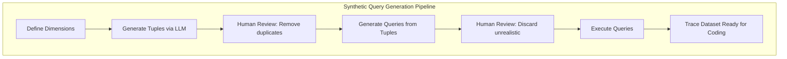
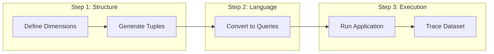
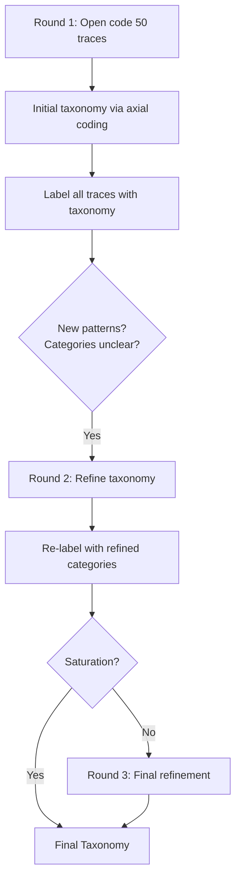

# Tutorial 03: Error Analysis Deep Dive

**Source:** Chapter 3 of "Application-Centric AI Evals for Engineers and Technical Product Managers"
**Authors:** Shreya Shankar and Hamel Husain
**Reading Time:** 45 minutes
**Difficulty:** Intermediate

---

## Learning Objectives

By the end of this tutorial, you will be able to:

- [ ] Define a trace and explain why trace-level annotation is superior to turn-level annotation
- [ ] Create representative trace datasets using both synthetic generation and production sampling strategies
- [ ] Apply open coding methodology to identify failure modes from raw trace data
- [ ] Explain grounded theory principles and how they prevent confirmation bias in error analysis
- [ ] Structure failure modes through axial coding to create coherent, non-overlapping taxonomies
- [ ] Recognize theoretical saturation and understand when to stop collecting additional traces
- [ ] Distinguish between cascade failures and root causes in multi-step agentic systems
- [ ] Design dimension-based synthetic query generation systems that target anticipated failure modes
- [ ] Apply stratified sampling strategies to production logs for maximum failure mode coverage

---

## Phase 1: Establish Baseline (WHAT)

This tutorial focuses on the **Analyze** phase of the Analyze-Measure-Improve lifecycle introduced in Tutorial 01. Before we can measure or improve an LLM pipeline, we must first understand *how* it fails. Error analysis is the systematic process of discovering, categorizing, and structuring failure modes from real system behavior.

We ground our discussion in a running example used throughout this tutorial:

> **Example: Real Estate CRM Assistant**
> 
> The assistant powers real estate agents' workflows. Given natural language queries, it can generate SQL queries to retrieve listing data, summarize market trends, draft emails to clients, and read calendars. Typical user queries might include:
> 
> *"Find me 3-bedroom homes under $600k near downtown. Email the top 2 matches to my client. Figure out if there are showings available for this weekend."*
> 
> The pipeline is **agentic**: an LLM call interprets the user's request and returns structured actions. Each action—querying listings, drafting an email, reading the showings calendar—invokes a downstream tool. Outputs are fed back to the LLM, which may issue further actions based on new information.

### What is a Trace?

A **trace** is the complete record of all actions, messages, tool calls, and data retrievals that occur in response to a single initial user query, spanning from the first user input through to the final response.

**Components of a Trace:**

| Component | Description | Example |
|-----------|-------------|---------|
| **User Query** | The initial input that triggers the pipeline | "Find 3-bedroom homes under $600k that allow pets" |
| **LLM Outputs** | All text generated by the model | SQL generation, email drafts, reasoning steps |
| **Tool Invocations** | External calls made by the system | Database queries, API calls, calendar reads |
| **Intermediate States** | Data flowing between steps | Query results, filtered listings |
| **Final Response** | What the user ultimately receives | "I found 5 properties matching your criteria..." |

**Trace vs. Query: A Critical Distinction**

| Term | Definition | Scope |
|------|------------|-------|
| **Query** | A single user request (input text) | Before your application processes it |
| **Trace** | The full, ordered record of all steps taken in response to a query | LLM turns, tools, data reads, outputs |

**Why Annotate at the Trace Level?**

Why not just label individual turns (a user message followed by the agent's response)? Three reasons make trace-level annotation superior:

1. **Context Preservation:** Many errors only become apparent when we consider the entire flow. Breaking traces into single turns loses necessary context—the meaning of a particular exchange may depend on actions or decisions made earlier in the session.

2. **Cascade Detection:** Errors in LLM pipelines frequently cascade. A mistake early in the trace can lead to multiple downstream failures. By annotating at the trace level, we can spot these chains of dependent errors.

3. **Root Cause Identification:** Fixing the initial problem often addresses all downstream symptoms. Annotating every downstream symptom wastes effort when fixing the root cause resolves them all.

**Example Trace (Real Estate CRM):**

```
User Query: "Find 3-bedroom homes under $600k near downtown that allow pets."

Trace Steps:
1. LLM → SQL Generation
   SELECT * FROM listings WHERE bedrooms = 3 AND price < 600000 
   AND location LIKE '%downtown%'
   [NOTE: Missing pet_friendly constraint!]

2. Database → LLM
   Returns 12 listings (some don't allow pets)

3. LLM → Email Draft
   "Dear Client, I found 12 great properties for you..."
   [NOTE: Email includes non-pet-friendly homes]

4. Final Response → User
   Email sent successfully
   [NOTE: User constraint violated - cascade from Step 1]
```

In this trace, the **first failure** is Step 1 (missing pet constraint). Steps 3 and 4 are downstream symptoms. Annotating at the trace level reveals the root cause.

### What is Open Coding?

**Open coding** is the systematic process of reading traces and assigning short descriptive labels to parts of the data that seem important. Each label captures an observed pattern, failure, or quality concern.

**Key Characteristics:**

- **Observational, not explanatory:** Write what you *see*, not why it happened
- **Bottom-up discovery:** Let patterns emerge from data rather than forcing preconceived categories
- **First-pass annotations:** Initial notes describing "what feels wrong" or "what happened"

**Origin: Grounded Theory**

Open coding is adapted from **grounded theory** (Glaser and Strauss 2017), a methodology from qualitative research that builds theories and taxonomies directly from data. Rather than starting with a fixed list of error types, we observe how the system behaves, label interesting or problematic patterns, and let the structure of failures emerge naturally.

> **Definition (Coding in Grounded Theory):**
> Coding refers to assigning short descriptive labels to parts of the data that seem important (Strauss et al. 1990). In our context, each note is a potential signal of a failure mode or quality concern.

**Open Coding Output:**

For each trace, open coding produces a brief annotation describing the first (most upstream) significant failure observed. Here are examples from the Real Estate CRM:

| User Query | Trace Summary | First-Pass Annotation |
|------------|---------------|----------------------|
| "Find 3-bedroom homes under $600k near downtown that allow pets." | SQL query missing pet constraint; returns 12 listings; email drafted | **Missing constraint:** pet-friendly requirement ignored |
| "Set up showings for these two homes this weekend." | Parse dates (Sat, Sun); Calendar shows agent unavailable Saturday; Proposes both days | **Invalid action:** proposed unavailable times |
| "Send a property list to my investor client in San Mateo." | Search for high ROI properties; Draft casual email about starter homes | **Persona mismatch:** wrong tone and property type for investor |

### What is Axial Coding?

Open coding produces a valuable but chaotic collection of observations. **Axial coding** is the process of identifying relationships among open codes and grouping them into higher-order categories. It moves us from isolated observations to a coherent taxonomy of failure modes.

**The Axial Coding Process:**

```
Open Codes (chaotic)              Axial Codes (structured)
─────────────────────────────────────────────────────────────
"SQL missing pet constraint"   ─┐
"Budget ignored"               ─┼─→  CONSTRAINT VIOLATION
"Date constraint dropped"      ─┘

"Wrong tone for luxury buyer"  ─┐
"Casual email to investor"     ─┼─→  PERSONA MISMATCH  
"Formal email to first-timer"  ─┘

"Claimed solar panels exist"   ─┐
"Invented user request"        ─┼─→  HALLUCINATION
"Fabricated showing history"   ─┘
```

**Key Principles of Axial Coding:**

1. **Cluster similar patterns:** Group open codes that share root causes or require similar fixes
2. **Create non-overlapping categories:** Each failure mode should be distinct and recognizable
3. **Define binary criteria:** For each category, articulate clear Pass/Fail definitions
4. **Split when meaningful:** "Hallucinated facts" and "Hallucinated user intent" may look similar but differ meaningfully—one misleads about external facts, the other fabricates user intent

**Example Split Decision:**

Initially, "hallucinations" might seem like one category. But closer inspection reveals two distinct failure types:

| Failure Mode | Description | Example |
|--------------|-------------|---------|
| **Hallucinated Listing Metadata** | Fabricating facts about properties | "This home has solar panels" (it doesn't) |
| **Hallucinated User Actions** | Fabricating user intent or history | "As you requested last week..." (never happened) |

These require different fixes: metadata hallucination needs better retrieval; user action hallucination needs better context tracking.

### What is Theoretical Saturation?

**Theoretical saturation** is the point at which analyzing additional traces is unlikely to reveal sufficiently new categories or types of errors. Existing concepts are well-developed and new data largely confirms them (Morse 1995).

**Saturation Signals:**

| Signal | What It Means |
|--------|---------------|
| No new failure types in last 5-10 traces | Core categories are comprehensive |
| Existing categories cleanly capture new observations | Taxonomy is well-defined |
| ~20 bad traces annotated | Rough heuristic for minimum coverage |
| Team agrees on categorization | Definitions are clear (if collaborative) |

**Why ~100 Traces?**

The textbook recommends starting with approximately 100 traces. This is a heuristic that:

- Provides enough coverage to surface a wide range of failure modes
- Pushes toward theoretical saturation for most applications
- Balances thoroughness with practical effort

> **Complexity Matters:** Simple systems (single-turn Q&A) may saturate quickly with 50 traces. Complex agentic systems (multi-step workflows with tool calling) often require deeper exploration—possibly 150+ traces.

### Creating Trace Datasets

Every error analysis starts with traces. There are two approaches to building this dataset:

#### Approach 1: From Production Logs (Preferred When Available)

If you already have production traces, sample them directly. The challenge is ensuring your sample isn't just repeating the same use case.

**For Small Datasets (<1,000 queries):**
- Random sampling is acceptable
- Manual review for diversity

**For Large Datasets (>10,000 queries):**
- Use clustering (embeddings or keyword matches) to group similar queries
- Sample from each cluster to ensure coverage

**Stratified Sampling Process:**

1. **Identify high-variance dimensions:** Query length, specificity, presence of constraints (dates, budgets), topic
2. **Assign labels for each dimension:** Manual for small datasets; embeddings + K-means clustering for large
3. **Sample from each group:** Ensures coverage across different query types and user behaviors

#### Approach 2: From Synthetic Queries (When Logs Are Sparse)

If production traces don't exist yet, create a dataset of synthetic queries, then run your application on those queries to produce traces.

**Why Not Simply "Generate 100 Queries"?**

Naively prompting an LLM to "give me user queries" produces:
- Generic, repetitive queries
- Misses edge cases and failure zones
- No systematic coverage of the problem space

**Better Approach: Dimension-Based Generation**

Instead of generating queries directly, we use a two-step process that produces more diverse and realistic results.

**Step 1: Define Key Dimensions**

Dimensions are ways to categorize different aspects of a user query. Each dimension represents one axis of variation. Choose dimensions that describe **where your application is likely to fail**.

| Dimension | Description | Example Values |
|-----------|-------------|----------------|
| **Feature** | What task the user wants | Property search, Scheduling, Email drafting, Market analysis |
| **Client Persona** | Type of client being served | First-time buyer, Investor, Luxury buyer |
| **Scenario Type** | How clearly intent is expressed | Well-specified, Ambiguous, Out-of-scope |

**Step 2: Generate Tuples**

A tuple is a specific combination of values—one from each dimension—that defines a particular use case.

```
Example Tuples:
- (Property Search, Investor, Ambiguous)
- (Scheduling, First-Time Buyer, Well-Specified)
- (Email Draft, Luxury Buyer, Ambiguous)
```

**Step 3: Convert Tuples to Natural Language Queries**

For each tuple, prompt an LLM to generate a realistic query:

**Prompt:**
```
We are generating synthetic user queries for a real estate CRM assistant.
Given:
  Feature: Property Search
  Client Persona: Investor
  Scenario: Ambiguous request

Write a realistic query that an agent might enter into the system 
to fulfill this client's request.

Example: "Look up showings for good properties in San Mateo County."

Now generate a new query.
```

**Step 4: Execute Queries to Materialize Traces**

Run each synthetic query through your application end-to-end. Export the full traces (all LLM/tool steps, inputs, and outputs). Now you're ready to start coding.



---

## Phase 2: Challenge Assumptions (WHY)

### Assumption 1: "Generic LLM Failure Categories Suffice"

**The conventional belief:** We can use standard LLM failure categories from research—"hallucination," "staying on task," "verbosity"—to categorize errors in any application.

**The challenge:** Generic categories miss application-specific issues that actually matter for your product.

**Why this assumption fails:**

Consider the Real Estate CRM assistant. Which failure description is more actionable?

| Generic Category | Application-Specific Failure |
|------------------|------------------------------|
| "Model didn't stay on task" | "Proposed showings for dates when agent is unavailable" |
| "Output was inappropriate" | "Used investor jargon with first-time homebuyer" |
| "Hallucination occurred" | "Listed solar panels on property that doesn't have them" |

The application-specific descriptions point directly to fixes. The generic categories tell you almost nothing about what went wrong or how to improve.

> **Hamel's Note:** "The abuse of generic metrics is endemic in the industry as many eval vendors promote off-the-shelf metrics, which ensnare unsuspecting engineers into superfluous metrics and tasks."

**Hidden truth:** Failure modes must emerge from YOUR data, not borrowed taxonomies. Real Estate CRM failures like "proposing unavailable showings" or "misidentifying client personas" are far more damaging than generic "verbosity."

### Assumption 2: "Start with Predefined Failure Modes"

**The conventional belief:** It's more efficient to begin with a list of expected failure types and look for them in the data.

**The challenge:** Pre-categorization biases observation toward expected failures, causing you to miss the unexpected.

**Why this assumption fails:**

| Problem | Consequence |
|---------|-------------|
| **Confirmation bias** | You only notice failures matching your preconceptions |
| **Missed patterns** | Novel error types go undetected |
| **Lost discovery** | The opportunity to discover unexpected failure modes is squandered |

**The grounded theory insight:** The Open Coding → Axial Coding sequence deliberately prevents premature categorization. By forcing you to observe first and categorize second, it ensures your taxonomy reflects actual system behavior rather than assumptions about what might go wrong.

**When Top-Down Is Acceptable:**

Top-down categorization has one valid use case: **when you're stuck during open coding**. If you're having trouble articulating what feels "off" about a trace, you can use generic categories as **prompts** (not constraints) to help identify issues:

- "Is this a hallucination?" (inventing facts, misrepresenting sources)
- "Is this a constraint violation?" (ignoring user specifications)
- "Is this a format error?" (malformed JSON, incorrect structure)

But these should be lenses to help articulate specific problems, not predefined buckets to force your data into.

### Assumption 3: "Likert Scales Provide Better Signal Than Binary Judgments"

**The conventional belief:** Rating traces on a 1-5 scale (e.g., "helpfulness") provides more nuanced information than simple Pass/Fail.

**The challenge:** Numeric scales introduce substantial noise when applied without detailed rubrics.

**Why this assumption fails:**

| Issue | Impact |
|-------|--------|
| **Lower inter-annotator agreement** | Different people interpret "3 out of 5" differently (Artstein & Poesio 2008) |
| **Higher subjective variance** | Without anchoring, ratings drift based on annotator mood, context, fatigue |
| **Harder to operationalize** | How do you build an automated eval that detects "3 vs. 4 helpfulness"? |

**Evidence:** Forcing binary decisions about specific failure modes—whether a problem occurred or not—produces more reproducible annotations (Husain 2025; Shankar et al. 2024c; Yan 2024).

**Practical implication:** Instead of asking "How helpful is this response? (1-5)", ask "Did this response violate the user's budget constraint? (Yes/No)".

### Assumption 4: "All Errors in a Trace Need Labeling"

**The conventional belief:** To understand failure rates, we need to identify and label every error in every trace.

**The challenge:** Exhaustive labeling is inefficient for initial taxonomy building because errors cascade.

**Why the "first failure" approach works:**

In our Real Estate CRM example, consider a trace where:
1. SQL query misses pet constraint (FIRST FAILURE)
2. Database returns non-pet-friendly homes
3. Email includes unsuitable properties
4. User receives unhelpful recommendations

Labeling all four issues wastes effort. **Fixing Step 1 resolves Steps 2-4.** The first upstream error is what matters for taxonomy building.

**When to switch to exhaustive labeling:**

After your taxonomy stabilizes, you may need exhaustive labeling for high-priority failure modes to get precise measurement (e.g., before/after comparison when validating a fix). But this comes later—not during initial discovery.

### Hidden Assumptions Exposed

| Hidden Assumption | Reality |
|-------------------|---------|
| "Research categories apply to my domain" | Your domain has unique failure patterns that generic categories miss |
| "More categories = better coverage" | Fewer, cleaner categories with clear boundaries are more useful |
| "Annotators agree on quality ratings" | Without precise definitions, ratings are noisy and inconsistent |
| "Complete labeling is thorough" | Complete labeling of cascading errors is wasteful; focus on root causes |

---

## Phase 3: Drill to Axioms (RECURSIVE WHYS)

### Axiom Chain 1: Theories Must Be Grounded in Data

**Statement:** Valid understanding of system behavior emerges from systematic observation, not from imposing external frameworks.

**Recursive Why Chain:**

```
Why use open coding before categorizing?
├── Because predefined categories bias observation
│   └── Why does pre-categorization bias us?
│       ├── Because humans notice evidence confirming expectations
│       │   └── Why confirmation bias?
│       │       └── AXIOM: Human cognition is optimized for pattern 
│       │                  matching, not objective observation
│       └── Because we miss disconfirming evidence
│           └── Why do we miss disconfirming evidence?
│               └── AXIOM: Absence of expected patterns is cognitively
│                          invisible without deliberate attention
```

**First Principle Reached:** Human cognition is optimized for pattern matching. We naturally see what we expect to see and miss what we don't expect. This is not a flaw to be corrected but a fundamental constraint to design around.

**Stopping Criteria Met:**
- ✓ **Physical Law:** Grounded in cognitive science research on confirmation bias
- ✓ **Domain Independence:** Applies to all human observation, not just LLM evaluation
- ✓ **Reconstruction Test:** Explains why grounded theory methodology works across diverse fields (sociology, healthcare, software engineering)

**Implication:** Open coding before categorization is not just a best practice—it's a deliberate countermeasure against a fundamental cognitive limitation.

### Axiom Chain 2: Errors Propagate Through Causal Chains

**Statement:** In multi-step systems, upstream failures cause downstream failures. Sequential processing creates causal dependencies.

**Recursive Why Chain:**

```
Why annotate first failure, not all failures?
├── Because later errors often stem from earlier ones
│   └── Why do errors cascade?
│       ├── Because each step depends on prior steps
│       │   └── Why the dependency?
│       │       └── AXIOM: Sequential systems have causal ordering;
│       │                  Step N uses output of Step N-1 as input
│       └── Because wrong intermediate states corrupt future states
│           └── Why does corruption propagate?
│               └── AXIOM: Function composition propagates errors;
│                          f(g(x)) fails if g(x) is wrong
```

**First Principle Reached:** Sequential systems have causal ordering. This is a logical truth about any pipeline where outputs of one stage become inputs to the next. It cannot be circumvented without changing the architecture.

**Stopping Criteria Met:**
- ✓ **Logical Law:** Formal systems theory; function composition is well-defined
- ✓ **Reconstruction Test:** Explains cascade failures in agentic systems, RAG pipelines, multi-turn conversations
- ✓ **Domain Independence:** Applies to all sequential processing systems

**Implication:** Focusing on the first (most upstream) failure is not a shortcut—it's the most direct path to the actual problem. Downstream failures are symptoms, not diseases.

### Axiom Chain 3: Diminishing Returns in Data Collection (Saturation)

**Statement:** Additional observations yield decreasing new information. At some point, new data largely confirms existing categories rather than revealing new ones.

**Recursive Why Chain:**

```
Why stop at ~100 traces?
├── Because new traces stop revealing new failure types
│   └── Why does novelty decrease?
│       ├── Because failure mode space is finite for a given system
│       │   └── Why is failure space finite?
│       │       └── AXIOM: Bounded systems have bounded failure modes;
│       │                  finite code paths = finite failure patterns
│       └── Because sampling eventually covers the distribution
│           └── Why does sampling converge?
│               └── AXIOM: Finite samples approximate finite populations
│                          (law of large numbers / sampling theory)
```

**First Principle Reached:** Bounded systems have bounded failure modes. A pipeline with finite code, finite tools, and finite prompts can only fail in a finite number of fundamentally different ways. This doesn't mean all failures are predictable—but it does mean the *categories* of failure are enumerable.

**Stopping Criteria Met:**
- ✓ **Physical Law:** Information theory (diminishing information gain)
- ✓ **Expert Convergence:** Qualitative research methodology consensus on saturation
- ✓ **Reconstruction Test:** Explains why saturation works across research contexts

**Implication:** The ~100 trace heuristic isn't arbitrary. It's grounded in the fact that you're searching a finite space. Once you've found the major categories, additional traces mostly confirm what you already know.

### Axiom Chain 4: Observation Requires Representative Sampling

**Statement:** To understand system behavior, samples must represent the full distribution of inputs, not just common cases.

**Recursive Why Chain:**

```
Why use stratified sampling instead of random sampling?
├── Because random sampling overrepresents common cases
│   └── Why is overrepresentation problematic?
│       ├── Because rare cases often contain critical failures
│       │   └── Why do rare cases matter disproportionately?
│       │       └── AXIOM: Edge cases test system boundaries;
│       │                  failures often cluster at boundaries
│       └── Because proportional sampling may never surface rare patterns
│           └── Why won't proportional sampling find rare patterns?
│               └── AXIOM: Low-probability events require oversampling
│                          to appear in finite samples
```

**First Principle Reached:** Edge cases test system boundaries, and failures cluster at boundaries. Systems are typically engineered for the common case; edge cases expose assumptions that break down.

**Stopping Criteria Met:**
- ✓ **Domain Independence:** Applies to all sampling contexts
- ✓ **Physical Law:** Statistical sampling theory
- ✓ **Reconstruction Test:** Explains why random testing misses bugs that targeted testing finds

**Implication:** Stratified sampling isn't optional for large datasets—it's mathematically necessary to ensure rare but critical failure modes appear in your analysis.

---

## Phase 4: Understand Mechanisms (HOW)

### How Open Coding Works

**The Step-by-Step Mechanism:**

```
┌─────────────────────────────────────────────────────────────────────┐
│                     OPEN CODING WORKFLOW                             │
├─────────────────────────────────────────────────────────────────────┤
│                                                                      │
│  FOR each trace in dataset:                                          │
│                                                                      │
│  1. READ COMPLETELY                                                  │
│     • User query → intermediate steps → final output                 │
│     • Don't skim; understand the full flow                           │
│                                                                      │
│  2. IDENTIFY FIRST UPSTREAM FAILURE                                  │
│     • Where did things FIRST go wrong?                               │
│     • Ignore downstream symptoms for now                             │
│                                                                      │
│  3. WRITE OBSERVATIONAL NOTE                                         │
│     • Describe WHAT happened, not WHY                                │
│     • Keep it brief: 5-15 words                                      │
│     • Examples:                                                      │
│       - "SQL missing pet constraint"                                 │
│       - "Proposed unavailable times"                                 │
│       - "Wrong tone for investor persona"                            │
│                                                                      │
│  4. (OPTIONAL) ASSIGN PASS/FAIL                                      │
│     • Binary judgment forces clarity                                 │
│     • Even borderline cases: pick a side                             │
│                                                                      │
│  5. CONTINUE UNTIL SATURATION                                        │
│     • ~20 bad traces annotated                                       │
│     • No fundamentally new failure types appearing                   │
│                                                                      │
└─────────────────────────────────────────────────────────────────────┘
```

**Recording Open Codes:**

Use a simple spreadsheet with three columns:

| Trace ID | Trace Summary | First-Pass Annotation |
|----------|---------------|----------------------|
| T001 | SQL query (missing pet), returns 12, email sent | Missing constraint: pet-friendly ignored |
| T002 | Parse dates, calendar shows unavailable, proposes anyway | Invalid action: proposed unavailable times |
| T003 | Search ROI properties, draft casual email about starters | Persona mismatch: wrong tone for investor |

**When You're Stuck: The Top-Down Assist**

Sometimes it's challenging to articulate what feels "off." When stuck, use common LLM failure categories as **prompts** (not constraints) to help identify issues:

| Category | What to Look For |
|----------|------------------|
| **Hallucination** | Inventing facts, misrepresenting sources, fabricating details |
| **Structured Output** | Malformed JSON, incorrect list formatting, missing required fields |
| **Constraint Violation** | Ignoring user specifications (budget, dates, preferences) |
| **Style/Tone** | Inappropriate language for context, wrong formality level |
| **Tool Misuse** | Calling wrong tools, incorrect parameters, unnecessary calls |

> **Important:** These categories are lenses to help articulate problems, not predefined buckets to force your data into.

### How Axial Coding Works

**The Clustering Mechanism:**

After open coding produces 30-50+ annotations, axial coding organizes them into a coherent taxonomy.

```
┌─────────────────────────────────────────────────────────────────────┐
│                     AXIAL CODING WORKFLOW                            │
├─────────────────────────────────────────────────────────────────────┤
│                                                                      │
│  1. COLLECT OPEN CODES                                               │
│     Gather all first-pass annotations into one view                  │
│                                                                      │
│  2. IDENTIFY SIMILARITIES                                            │
│     Read through and note patterns:                                  │
│     - "SQL missing pet constraint"  ─┐                               │
│     - "Budget ignored"              ─┼─→ All involve user specs      │
│     - "Date constraint dropped"     ─┘                               │
│                                                                      │
│  3. CREATE HIGHER-ORDER CATEGORIES                                   │
│     Name the cluster with a clear, descriptive title:                │
│     → "Constraint Violation"                                         │
│                                                                      │
│  4. TEST COHERENCE                                                   │
│     For each cluster, ask:                                           │
│     • Do all instances fit cleanly?                                  │
│     • Are boundaries with other categories clear?                    │
│     • Would two annotators classify the same way?                    │
│                                                                      │
│  5. SPLIT IF NEEDED                                                  │
│     When distinctions matter for fixes:                              │
│     - "Hallucinated facts" vs "Hallucinated user intent"             │
│     - "Wrong persona" vs "Right persona, wrong tone"                 │
│                                                                      │
└─────────────────────────────────────────────────────────────────────┘
```

**Decision Framework for Clustering:**

```
Should these codes cluster together?

├─ Do they share a root cause?
│  └─ YES → Cluster them
│
├─ Do they require the same fix?
│  └─ YES → Cluster them
│
├─ Are they distinguishable in practice?
│  └─ NO → Cluster them (distinction isn't useful)
│
└─ Otherwise → Split them
```

**LLM-Assisted Clustering:**

After open coding 30-50 traces, you can use an LLM to propose preliminary groupings:

**Prompt:**
```
Below is a list of open-ended annotations describing failures in an 
LLM-driven real estate CRM assistant. Please group them into a small 
set of coherent failure categories, where each category captures 
similar types of mistakes. Each group should have a short descriptive 
title and a brief one-line definition. Do not invent new failure 
types; only cluster based on what is present in the notes.

[paste annotations here]
```

> **Critical:** LLM-generated groupings can help organize initial ideas, but they should not be accepted blindly. Proposed clusters require manual review and adjustment to accurately reflect the system's behavior and your application's specific requirements.

**Example Axial Coding Output:**

| Failure Mode | Definition | Example Open Codes |
|--------------|------------|-------------------|
| **Constraint Violation** | System ignores explicit user specifications | "SQL missing pet constraint," "Budget ignored," "Date not respected" |
| **Persona Mismatch** | Communication style doesn't match client type | "Wrong tone for investor," "Casual email to luxury buyer" |
| **Invalid Action** | System proposes or executes impossible operations | "Proposed unavailable times," "Scheduled showing on closed day" |
| **Hallucinated Metadata** | Fabricating facts about external entities | "Listed solar panels (doesn't have)," "Wrong square footage" |
| **Hallucinated Intent** | Fabricating user requests or history | "As you requested last week... (didn't)," "Scheduled tour not asked for" |

### How Synthetic Query Generation Works

**The Problem with Naive Generation:**

Prompting an LLM to "generate 100 user queries for a real estate assistant" produces:
- Repetitive phrasing ("Find me a house in...", "Find me a house in...", "Find me a house in...")
- Generic queries that don't test edge cases
- No systematic coverage of the failure space

**The Solution: Structured Combinatorics**

Separate the process into two steps: **generate structure**, then **generate language**.



**Step 1: Define Failure-Targeting Dimensions**

Choose dimensions that describe **where your application is likely to fail**. Don't choose arbitrarily—base these on product knowledge, user feedback, or hypotheses about weak spots.

**Real Estate CRM Dimensions:**

| Dimension | Values | Why This Dimension? |
|-----------|--------|---------------------|
| **Feature** | Property Search, Scheduling, Email Draft, Market Analysis | Different features use different tools and prompts |
| **Client Persona** | First-Time Buyer, Investor, Luxury Buyer | Tone and content vary significantly by persona |
| **Scenario Type** | Well-Specified, Ambiguous, Out-of-Scope | Tests how system handles varying input quality |

> **Recommendation:** Start with at least 3 dimensions. More dimensions give better coverage but increase the combinatorial space.

**Step 2: Generate Tuples**

**Prompt:**
```
Generate 10 random combinations of (Feature, Client Persona, Scenario) 
for a real estate CRM assistant.

Dimensions:
- Feature: Property Search, Scheduling, Email Draft, Market Analysis
- Client Persona: First-Time Buyer, Investor, Luxury Buyer  
- Scenario: Well-Specified, Ambiguous, Out-of-Scope

Output each as: (Feature, Client Persona, Scenario)
Avoid duplicates. Vary values across dimensions.
```

**Human Review:** Remove duplicates, implausible combinations.

**Step 3: Convert Tuples to Natural Language**

**Prompt:**
```
We are generating synthetic user queries for a real estate CRM assistant.

Given:
  Feature: Scheduling
  Client Persona: First-Time Buyer
  Scenario: Ambiguous

Write a realistic query that an agent might enter into the system.
The query should reflect the client's needs and the ambiguity of the scenario.

Example: "Find showings for affordable homes with short notice availability."

Now generate a new query.
```

**Human Review:** Discard awkward or unrealistic queries. Regenerate if needed.

**Step 4: Execute and Collect Traces**

Run each query through your application. Export full traces including all LLM calls, tool invocations, intermediate results, and final outputs.

**Target:** ~100 high-quality, diverse traces ready for open coding.

### How Stratified Sampling Works

**The Problem with Random Sampling:**

For large production logs (10,000+ queries), random sampling:
- Overrepresents common query types
- May never surface rare but critical edge cases
- Produces a dataset that looks like "the average user" rather than "the full range of users"

**The Solution: Stratified Sampling**

```
┌─────────────────────────────────────────────────────────────────────┐
│                   STRATIFIED SAMPLING WORKFLOW                       │
├─────────────────────────────────────────────────────────────────────┤
│                                                                      │
│  1. IDENTIFY HIGH-VARIANCE DIMENSIONS                                │
│     Read through queries, note how they differ:                      │
│     • Length (short vs. long)                                        │
│     • Specificity (detailed vs. vague)                               │
│     • Constraints (dates, budgets, locations)                        │
│     • Topic (search, schedule, email, analysis)                      │
│                                                                      │
│  2. ASSIGN LABELS OR CLUSTERS                                        │
│     For small datasets: Manual labeling                              │
│     For large datasets: Embeddings + K-means clustering              │
│     • Embed each query                                               │
│     • Cluster into 5-10 groups                                       │
│     • Interpret what makes each group distinct                       │
│                                                                      │
│  3. SAMPLE FROM EACH CLUSTER                                         │
│     Instead of random sampling across all queries:                   │
│     • Sample proportionally from large clusters                      │
│     • Oversample from small clusters (to catch rare cases)           │
│     • Target: 100 traces with coverage across all clusters           │
│                                                                      │
└─────────────────────────────────────────────────────────────────────┘
```

**Example Stratification:**

```
Production Logs: 10,000 queries

Clusters via Embedding + K-means:
┌────────────────────────────────────────────────────────────┐
│ Cluster 1 (4,000 queries): Simple property search          │
│ Cluster 2 (2,500 queries): Price/location filtering        │
│ Cluster 3 (1,500 queries): Multi-step scheduling           │
│ Cluster 4 (1,000 queries): Email drafting                  │
│ Cluster 5 (500 queries): Complex constraints               │
│ Cluster 6 (300 queries): Market analysis                   │
│ Cluster 7 (200 queries): Ambiguous/edge cases              │
└────────────────────────────────────────────────────────────┘

Stratified Sample (100 traces):
┌────────────────────────────────────────────────────────────┐
│ From Cluster 1: 25 traces (proportional)                   │
│ From Cluster 2: 20 traces                                  │
│ From Cluster 3: 15 traces                                  │
│ From Cluster 4: 12 traces                                  │
│ From Cluster 5: 10 traces                                  │
│ From Cluster 6: 8 traces                                   │
│ From Cluster 7: 10 traces (OVERSAMPLED - rare cases)       │
└────────────────────────────────────────────────────────────┘
```

**Key Insight:** Cluster 7 (edge cases) is oversampled relative to its proportion. Random sampling might include only 2 edge cases; stratified sampling ensures 10.

### How Iteration Refines the Taxonomy

Error analysis is not a one-pass process. Expect 2-3 rounds of iteration.



**Common Refinements:**

| Refinement Type | Before | After | Why |
|-----------------|--------|-------|-----|
| **Merge** | "Casual tone" + "Too formal" | "Tone Mismatch" | Same root cause (tone calibration) |
| **Split** | "Hallucination" | "Factual Hallucination" + "Intent Fabrication" | Different fixes required |
| **Clarify** | "Wrong persona" | "Persona Misidentification" + "Correct Persona, Wrong Tone" | More actionable categories |

**Stopping Criteria:**

- 2-3 rounds typically sufficient
- New traces fit existing categories cleanly
- Failure mode definitions are clear and non-overlapping
- Team (if collaborative) agrees on categorization

### How to Quantify After Labeling

Once axial coding produces a stable taxonomy, label all traces with structured categories.

**Spreadsheet Structure:**

| Trace ID | Constraint Violation | Persona Mismatch | Invalid Action | Hallucinated Metadata | Hallucinated Intent |
|----------|---------------------|------------------|----------------|----------------------|---------------------|
| T001 | 1 | 0 | 0 | 0 | 0 |
| T002 | 0 | 0 | 1 | 0 | 0 |
| T003 | 0 | 1 | 0 | 0 | 0 |
| T004 | 1 | 0 | 0 | 1 | 0 |

**Computing Failure Rates:**

```
Constraint Violation Rate = SUM(Constraint Violation column) / Total Traces
                         = 25 / 100 = 25%

Persona Mismatch Rate    = SUM(Persona Mismatch column) / Total Traces
                         = 12 / 100 = 12%
```

These quantified rates inform prioritization: fix the most common or most damaging failure modes first.

---

## Phase 5: Contextualize & Apply (WHEN/WHERE)

### When to Use Synthetic vs. Production Data

| Scenario | Recommended Mix | Rationale |
|----------|-----------------|-----------|
| **Pre-launch** (no users yet) | 100% Synthetic | Bootstrap evaluation before production |
| **Early production** (<1,000 queries) | 70% Synthetic, 30% Production | Augment sparse logs with targeted queries |
| **Mature production** (>10K queries) | 80% Production, 20% Synthetic | Real data preferred; synthetic for testing suspected edge cases |
| **Known failure zone** | Targeted Synthetic | Generate queries specifically for hypothesized issues |
| **Post-incident investigation** | 100% Production | Understand what actually happened |

### When to Use Open Coding vs. Top-Down Categorization

**Open Coding (Bottom-Up):**
- ✅ Initial taxonomy building
- ✅ Novel application domains
- ✅ When you don't know what failures to expect
- ✅ Discovering unexpected error patterns

**Top-Down (With Generic Categories):**
- ✅ When stuck during open coding (use as prompts, not constraints)
- ✅ Quick sanity check for known LLM failure types
- ❌ As primary methodology (risks confirmation bias)
- ⚠️ As starting hypothesis, but validate with data

### When to Stop Iterating (Saturation Checklist)

**Stop when ALL conditions are met:**

- [ ] ~20 or more bad traces annotated
- [ ] Last 5-10 new traces reveal no fundamentally new failure types
- [ ] Existing categories cleanly capture new observations
- [ ] Failure mode definitions are clear and non-overlapping
- [ ] Team agrees on categorization (if collaborative)

**Don't stop if:**

- ❌ High error rate (>30%) but only 2-3 failure modes identified
- ❌ Many traces feel "wrong" but don't fit existing categories
- ❌ Team debates categorization of most traces
- ❌ Recent traces required creating new categories

### When to Use First-Failure vs. Exhaustive Labeling

| Approach | Phase | Goal | Speed |
|----------|-------|------|-------|
| **First-Failure** | Initial taxonomy building | Discover failure modes efficiently | Fast (1 label/trace) |
| **Exhaustive** | After taxonomy stabilizes | Precise measurement of specific failure rates | Slow (N labels/trace) |

**Switch to exhaustive labeling when:**
- You need to measure the precise rate of a specific failure mode
- You're validating a fix (need before/after comparison)
- Automated evaluators flag errors your initial labels missed (because they weren't the "first" failure)

### Boundary Conditions: When Error Analysis Breaks Down

| Condition | Why It Breaks | Mitigation |
|-----------|---------------|------------|
| **Highly subjective quality** | No clear "wrong" answer; annotators disagree | Multi-annotator collaboration with alignment sessions (Tutorial 04) |
| **Constantly shifting requirements** | Failure definitions become stale; what was acceptable last week isn't this week | Shorter iteration cycles; weekly re-coding sessions |
| **Extremely rare failures** | Can't reach saturation; critical failures don't appear in samples | Targeted synthetic generation for suspected failure modes |
| **Black-box systems** | Can't inspect intermediate steps; only see final output | Instrument everything; log all LLM calls and tool invocations |
| **Very long traces** | Difficult to read and annotate completely | Use observability tools that render traces in human-readable format |

### Transfer to Other Domains

The error analysis methodology transfers to other LLM application types with minor adaptations:

**Agentic Systems:**
- Same methodology applies
- Traces often longer (more tool calls)
- Cascade failures more common
- Root cause analysis is critical

**RAG Pipelines:**
- Trace includes retrieval + generation stages
- Failure modes split into two categories: Retrieval failures vs. Generation failures
- Open code both components separately
- Axial coding may reveal cross-component issues (e.g., "retrieved wrong documents → generated incorrect answer")

**Multi-Turn Conversations:**
- Trace spans entire session (not just one turn)
- Session-level failures emerge: context degradation, inconsistency over turns, forgotten constraints
- May require different failure taxonomy than single-turn systems
- First-failure annotation still applies: identify where the session first went wrong

**Code Generation:**
- Traces include: prompt → generated code → execution results
- Failure modes: Syntax errors, Logic errors, Security issues, Style violations
- Execution validity (does it run?) vs. Execution correctness (does it do the right thing?)

---

## First Principles Map

### AXIOM 1: Theories Must Be Grounded in Data (Inductive Reasoning)

- **Statement:** Valid understanding emerges from systematic observation, not from imposing external frameworks
- **Stopping criterion met:** Physical Law (cognitive science), Domain Independence
- **Confidence level:** High
- **Supporting evidence:** Grounded theory methodology success across social sciences, healthcare, software engineering
- **Practical implication:** Open coding before categorization prevents confirmation bias; let failure modes emerge from YOUR data

### AXIOM 2: Errors Propagate Through Causal Chains

- **Statement:** In sequential systems, upstream failures cause downstream failures; function composition propagates errors
- **Stopping criterion met:** Logical Law (formal systems), Reconstruction Test
- **Confidence level:** High
- **Supporting evidence:** Sequential systems theory, function composition mathematics
- **Practical implication:** Annotate first upstream failure for efficiency; downstream symptoms resolve when root cause is fixed

### AXIOM 3: Finite Systems Have Finite Failure Modes (Saturation Principle)

- **Statement:** Bounded systems with finite code paths have enumerable failure categories; additional sampling yields diminishing new information
- **Stopping criterion met:** Physical Law (information theory), Expert Convergence
- **Confidence level:** High
- **Supporting evidence:** Diminishing information gain, qualitative research consensus on saturation
- **Practical implication:** ~100 traces sufficient for most applications; saturation is a real, achievable endpoint

### AXIOM 4: Observation Requires Representative Sampling

- **Statement:** Edge cases test system boundaries where failures cluster; low-probability events require oversampling
- **Stopping criterion met:** Domain Independence, Physical Law (statistics)
- **Confidence level:** High
- **Supporting evidence:** Sampling theory, experience that random testing misses bugs targeted testing finds
- **Practical implication:** Stratified sampling for large logs; oversample rare clusters to catch critical edge cases

---

## Uncertainty Register

### What Remains Unknown

1. **Optimal trace count for saturation:** The "~100 traces" recommendation is a heuristic, not theoretically derived. The actual number depends on system complexity in ways we can't precisely predict.

2. **Dimension selection for synthetic data:** There's no principled method for choosing which dimensions to use. Current practice relies on domain intuition and hypothesis about failure zones.

3. **Automation potential for open coding:** Can ML/LLMs discover failure modes without human open coding? Early experiments exist, but reliability is unclear.

4. **Cross-application transfer of taxonomies:** Can failure taxonomies developed for one application transfer to similar applications? When do they transfer vs. when do they mislead?

5. **When to switch from first-failure to exhaustive:** The transition point depends on application-specific trade-offs we can't generalize.

### Areas for Further Investigation

- Quantifying saturation formally using information-theoretic metrics
- Active learning strategies for efficient trace selection (which traces are most informative to label next?)
- Automated consistency checking for axial coding (detecting when categories overlap or are poorly defined)
- Tools for visualizing failure mode distributions across query dimensions

---

## Key Takeaways

1. **Traces, not queries:** Annotate complete execution paths (traces), not just inputs (queries). Traces capture cascade failures and enable root cause identification.

2. **Grounded theory prevents bias:** The Open Coding → Axial Coding sequence deliberately prevents premature categorization. Let failure modes emerge from your data, not borrowed taxonomies.

3. **Target failures with dimensions:** Synthetic query generation uses structured dimensions (Feature × Persona × Scenario) to systematically cover failure zones. Two-step generation (tuples → queries) produces more diverse data than naive prompting.

4. **Stratified sampling beats random:** For large production logs, cluster queries first, then sample from each cluster. Oversample rare clusters to catch critical edge cases that random sampling misses.

5. **First-failure efficiency:** Initial taxonomy building focuses on the first upstream failure, not exhaustive labeling. Fixing root causes resolves downstream symptoms.

6. **Theoretical saturation is achievable:** ~100 traces and ~20 bad traces typically reveal core failure modes. When new traces fit existing categories cleanly, you've reached saturation.

7. **Iteration refines taxonomy:** Expect 2-3 rounds of open coding + axial coding. Merge similar categories, split meaningful distinctions, clarify definitions until the taxonomy stabilizes.

8. **Binary beats Likert scales:** Pass/Fail judgments for specific failure modes produce more reproducible annotations than numeric ratings without detailed rubrics.

9. **Domain experts are irreplaceable:** Generic LLM failure categories miss application-specific issues. "Proposed unavailable showings" is more actionable than "stayed on task." Real observation of YOUR system on YOUR data is required.

10. **Don't freeze taxonomy too early:** Failure mode definitions should evolve as understanding deepens. Treating initial annotations as fixed locks evaluation around an incomplete understanding.

---

## Exercises

### Exercise 1: Synthetic Data Generation (Travel Assistant)

Define three key dimensions for a travel booking assistant. Then:

**(a)** List at least three values for each dimension.

**(b)** Write a prompt to generate 10 random structured tuples.

**(c)** Write a prompt to convert one example tuple—e.g., (Find Flight, Luxury Traveler, Flexible Dates)—into a natural-language query.

<details>
<summary>Solution</summary>

**Dimensions and Values:**

| Dimension | Values |
|-----------|--------|
| **Task Type** | Find Flight, Find Hotel, Find Flight+Hotel, Activity Recommendation, General Inquiry |
| **Traveler Profile** | Budget Traveler, Business Traveler, Family Vacationer, Luxury Traveler, Solo Backpacker |
| **Date Flexibility** | Exact Dates, Flexible Dates, Open-Ended |

**(b) Prompt to generate tuples:**

```
Generate 10 random combinations of (Task Type, Traveler Profile, Date Flexibility) 
for a travel booking assistant.

Possible values:
- Task Type: Find Flight, Find Hotel, Find Flight+Hotel, Activity Recommendation, General Inquiry
- Traveler Profile: Budget Traveler, Business Traveler, Family Vacationer, Luxury Traveler, Solo Backpacker
- Date Flexibility: Exact Dates, Flexible Dates, Open-Ended

Output each as: (Task Type, Traveler Profile, Date Flexibility)
Ensure no duplicates and good coverage.
```

**(c) Prompt to convert tuple to query:**

```
We are generating synthetic user queries for a travel assistant.

Given:
  Task Type: Find Flight
  Traveler Profile: Luxury Traveler
  Date Flexibility: Flexible Dates

Write a realistic query a luxury traveler might use, reflecting flexibility in travel dates.

Example (for another tuple): (Find Hotel, Business Traveler, Exact Dates) 
→ "Need a 4-star hotel near the airport in Seattle from Sept 10–12, must have airport shuttle."

Now generate a query for (Find Flight, Luxury Traveler, Flexible Dates).
```

</details>

### Exercise 2: Open Coding Practice

Below is a multi-step agent trace from a travel assistant. Perform open coding: write a purely observational note on the first significant failure.

```
User Query:
  Book an economy flight from NYC to Rome on July 15 (budget < $600)
  and a hostel near the Colosseum (max $80/night). If nothing decent 
  is available near the Colosseum, Trastevere is fine as a fallback.

Trace Steps:
1. LLM → FlightSearch API
   FlightSearch(origin="NYC", destination="Rome", date="2025-07-15", maxPrice=600)
   
2. API → LLM
   [] // no flights < $600 for that date

3. LLM → FlightSearch API (retry without price filter)
   FlightSearch(origin="NYC", destination="Rome", date="2025-07-15")
   
4. API → LLM
   [Flight A: $750, Flight B: $820]

5. LLM → HostelSearch API
   HostelSearch(location="Colosseum", maxPrice=80)
   
6. API → LLM
   [Hostel X: $65/night, 2.1 stars; Hostel Y: $78/night, 2.3 stars]

7. LLM → User
   "I found Flight A ($750) and Hostel X ($65/night, near Colosseum). 
    Shall I book these?"
```

<details>
<summary>Solution</summary>

**First-Pass Annotation:** "Budget constraint violated: recommended $750 flight when user specified <$600 budget"

**Analysis:** The first significant failure is in Step 4-7, where the system recommends a flight exceeding the user's budget without acknowledging the constraint violation. The system also failed to try the Trastevere fallback for hotels before accepting low-rated options, but the budget violation is the first and most critical failure.

</details>

### Exercise 3: Axial Coding Practice

Given these open codes from a customer support chatbot, group them into 2-3 coherent failure categories with short titles and definitions:

1. "Promised 50% refund when policy is 30%"
2. "Said order would arrive Monday, actually Friday"
3. "Claimed we accept Bitcoin (we don't)"
4. "Used aggressive tone with upset customer"
5. "Called customer 'dude' in formal complaint"
6. "Said item was in stock, it was discontinued"
7. "Responded sarcastically to shipping delay complaint"

<details>
<summary>Solution</summary>

**Failure Category 1: Factual Misinformation**
- Definition: Providing incorrect information about policies, availability, or capabilities
- Open codes: #1, #2, #3, #6

**Failure Category 2: Inappropriate Tone**
- Definition: Using language or tone unsuitable for customer service context
- Open codes: #4, #5, #7

**Rationale for split:** Factual errors require fixing data sources, retrieval, or prompts with correct information. Tone issues require different fixes: persona instructions, tone guidelines, or few-shot examples of appropriate responses. The root causes and fixes differ, so they should be separate categories.

</details>

---

## Next Steps

You now have the methodology for systematically discovering and structuring failure modes in your LLM pipeline. The next tutorial addresses what happens when multiple people need to agree on quality criteria.

**→ Continue to [Tutorial 04: Collaborative Evaluation Practices](04_collaborative_evaluation_practices.md)**

In Tutorial 04, you'll learn:
- When "benevolent dictators" (single expert) outperform collaborative annotation
- Inter-annotator agreement metrics (Cohen's κ, Fleiss' κ)
- Alignment sessions for resolving disagreements
- Building shared understanding of failure criteria across teams

---

**Document History:**
- 2026-01-27: Initial draft created from Chapter 3 source material
- 2026-01-27: Added comprehensive grounded theory explanation with first principles derivation
- 2026-01-27: Added detailed mechanisms for open coding, axial coding, synthetic generation, stratified sampling
- 2026-01-27: Added exercises adapted from textbook with solutions
