# Tutorial 05: Automated Evaluators (LLM-as-Judge)

**Source:** Chapter 5 of "Application-Centric AI Evals for Engineers and Technical Product Managers"
**Authors:** Shreya Shankar and Hamel Husain
**Reading Time:** 32-35 minutes
**Difficulty:** Intermediate

---

## Learning Objectives

By the end of this tutorial, you will be able to:

- [ ] Distinguish between code-based evaluators and LLM-as-Judge evaluators
- [ ] Design LLM-as-Judge prompts with four essential components
- [ ] Split labeled data correctly into train/dev/test sets for judge development
- [ ] Calculate True Positive Rate (TPR) and True Negative Rate (TNR)
- [ ] Apply the Rogan-Gladen formula to correct biased pass rate estimates
- [ ] Construct bootstrap confidence intervals to quantify uncertainty
- [ ] Identify and mitigate common LLM judge biases (position, verbosity, self-enhancement)
- [ ] Design effective rubrics using the 5-layer framework
- [ ] Decompose vague evaluation criteria into atomic rubrics

---

## Prerequisites

Before starting this tutorial, complete:
- **Tutorial 03:** Error Analysis Deep Dive (failure mode identification)
- **Tutorial 04:** Collaborative Evaluation Practices (gold-standard datasets)

---

## Phase 1: Establish Baseline (WHAT)

### 1.1 What Are Automated Evaluators?

**Automated evaluators** are systems that estimate the prevalence of failure modes across traces at scale. Manual labeling at production scale is too slow and expensive—if your application processes 10,000 requests daily, you cannot realistically review each output.

Automated evaluators enable the **Measure** phase of the Analyze-Measure-Improve lifecycle:


There are two fundamental types:

| Evaluator Type | Best For | Characteristics |
|---------------|----------|-----------------|
| **Code-Based** | Objective criteria | Fast, cheap, deterministic, interpretable |
| **LLM-as-Judge** | Subjective qualities | Flexible, nuanced, requires calibration |

Evaluators can also be classified by their data requirements:

| Metric Type | Description | Example |
|-------------|-------------|---------|
| **Reference-Based** | Compares output to a "golden" answer | SQL AST comparison against ideal query |
| **Reference-Free** | Assesses inherent qualities without reference | Checking if email tone is professional |

### 1.2 What Is LLM-as-Judge?

**LLM-as-Judge** uses a separate LLM—distinct from your application—to assess outputs for subjective qualities that code cannot capture: tone appropriateness, helpfulness, faithfulness to source, empathy.

The term was introduced by Zheng et al. (2023), who trained specialized LLM judges using large amounts of human preference data. However, in practice, most teams lack sufficient labeled preference data for fine-tuning. Instead, they use **off-the-shelf LLMs with prompt engineering** to align judge outputs with intended failure definitions.

> **Key Insight:** LLM judges work best for narrowly defined, binary tasks (Pass/Fail). Open-ended ratings or feedback are harder to supervise and align.

### 1.3 Key Terminology

| Term | Definition |
|------|------------|
| **TPR (True Positive Rate)** | Fraction of actual Passes correctly identified as Pass |
| **TNR (True Negative Rate)** | Fraction of actual Fails correctly identified as Fail |
| **FPR (False Positive Rate)** | 1 - TNR; fraction of Fails incorrectly labeled Pass |
| **FNR (False Negative Rate)** | 1 - TPR; fraction of Passes incorrectly labeled Fail |
| **Rubric** | Structured criteria guide with definitions, examples, and decision rules |
| **Gold-Standard Dataset** | Consensus-labeled traces from collaborative annotation (Tutorial 04) |
| **Rogan-Gladen Correction** | Mathematical formula to estimate true prevalence from imperfect classifier |

### 1.4 When to Use Each Evaluator Type

```mermaid
flowchart TD
    START[Failure Mode Identified] --> Q1{Is criterion<br/>objective?}
    Q1 -->|Yes| CODE[Code-Based Evaluator]
    Q1 -->|No/Subjective| LLM[LLM-as-Judge]
    
    CODE --> EXAMPLES1[JSON validity<br/>SQL syntax<br/>Required keywords<br/>Length constraints<br/>Tool registry validation]
    
    LLM --> EXAMPLES2[Tone appropriateness<br/>Helpfulness<br/>Faithfulness to source<br/>Empathy<br/>Brand voice alignment]
    
    CODE --> PROPS1[Fast • Cheap<br/>Deterministic<br/>Interpretable]
    
    LLM --> PROPS2[Flexible • Nuanced<br/>Requires calibration<br/>May exhibit biases]
```



**Table: Programmatic vs. LLM-as-Judge Evaluators**

| Failure Mode | Programmatic Evaluator | LLM-as-Judge Evaluator |
|--------------|----------------------|------------------------|
| Missing SQL Constraints | Regex/AST traversal to detect mandatory filter keywords | N/A (objective) |
| Invalid Tool Usage | Static schema check: ensure tool name exists in registry | N/A (objective) |
| Persona-Tone Mismatch | N/A (subjective) | Few-shot prompt with definitions to judge tone alignment |
| Unjustified Tool Calls | Regex-based filter for ungrounded actions | Prompt to assess if every tool call is justified |

### 1.5 Specification vs. Generalization Failures

Before building automated evaluators, distinguish between two failure types:

| Failure Type | Definition | Response |
|--------------|------------|----------|
| **Specification Failure** | Stems from ambiguous or incomplete instructions | Fix the prompt first |
| **Generalization Failure** | LLM fails despite clear instructions | Build an automated evaluator |

**Critical Insight:** Fix ambiguity first, then measure generalization.

Building evaluators for poorly specified tasks essentially measures how well the LLM can "read your mind"—which isn't a scalable or reliable indicator of robust performance. We want our evaluation efforts to accurately reflect the LLM's ability to generalize correctly from clear instructions.

**Example Classification (Real Estate CRM):**

| Failure Mode | Classification | Rationale |
|--------------|---------------|-----------|
| Missing SQL Constraints | Generalization | Prompt clearly stated "max_price: $600k" but LLM omitted it |
| Incomplete Email Content | Specification | Prompt didn't specify mandatory fields |
| Invalid Tool Usage | Generalization | Tools were well-defined, LLM fabricated non-existent tool |
| Persona-Tone Mismatch | Generalization | Persona was clearly provided, LLM used wrong tone |

---

## Phase 2: Challenge Assumptions (WHY)

### Assumption 1: "LLM Judges Are Inherently Reliable"

**The conventional belief:** An LLM can objectively assess quality without systematic errors.

**Reality:** LLM judges exhibit multiple biases:

| Bias Type | Description | Research Finding |
|-----------|-------------|------------------|
| **Position Bias** | Favors responses based on position in prompt | Judges prefer the first or last response regardless of quality |
| **Verbosity Bias** | Prefers longer responses | Longer ≠ better, but judges often conflate the two |
| **Self-Enhancement** | Prefers outputs from same model family | GPT-4 judging GPT-4 outputs shows inflated scores |
| **Bandwagon Bias** | Follows majority opinion signals | If told "most users preferred A," judge favors A |

**Mitigation Required:** Calibration against human ground truth is essential—never deploy an LLM judge without measuring its TPR and TNR.

### Assumption 2: "Raw Pass Rates Reflect True Performance"

**The conventional belief:** If 80% of traces pass the judge, then 80% of traces are actually good.

**Reality:** Imperfect judges produce biased estimates:
- If TPR < 1: Judge misses real successes → **underestimates** true pass rate
- If TNR < 1: Judge passes real failures → **overestimates** true pass rate

**Solution:** The Rogan-Gladen correction formula (Section 4.5) mathematically adjusts raw counts to estimate true prevalence.

### Assumption 3: "One Judge Fits All Failure Modes"

**The conventional belief:** A single, general "quality assessment" prompt can evaluate all aspects of output quality.

**Reality:** Each failure mode needs its own dedicated evaluator with:
- Specific criteria tailored to that failure definition
- Examples drawn from that failure type
- Different TPR/TNR characteristics

> "This is expected—and desirable—when evaluating multiple aspects of quality."

### Assumption 4: "More Complex Ratings Are Better"

**The conventional belief:** A 1-5 scale provides more information than binary Pass/Fail.

**Reality:** Binary judgments are easier to supervise and align:
- Fewer ambiguous boundary decisions
- Clearer calibration targets (TPR/TNR)
- Simpler correction mathematics

**Key Insight:** "LLM judges work best for narrowly defined, binary tasks."

### Hidden Assumptions Table

| Hidden Assumption | Reality |
|-------------------|---------|
| Judges are unbiased | Position, verbosity, self-enhancement, bandwagon biases exist |
| Test set performance = production performance | Distribution shift affects judge accuracy |
| High agreement = high accuracy | Judges can agree with each other while both being wrong |
| More labeled data always helps | In-context learning saturates after 1-8 examples |

---

## Phase 3: Drill to Axioms (RECURSIVE WHYS)

### Axiom Chain 1: Measurement Requires Calibration Against Known Truth

```
Why validate LLM judges against human labels?
├── Because judges make systematic errors (biases)
│   └── Why do judges make errors?
│       ├── Because LLMs are statistical pattern matchers (Tutorial 01)
│       │   └── Why does this cause errors?
│       │       └── AXIOM: Statistical systems require calibration
│       │                  against ground truth to estimate true performance
```

**Stopping Criterion Met:** Reconstruction Test
- This axiom explains why all judge correction methods require known labels
- Removing calibration makes judge outputs uninterpretable

### Axiom Chain 2: Imperfect Instruments Require Mathematical Correction

```
Why apply the Rogan-Gladen formula?
├── Because raw counts are biased when classifier is imperfect
│   └── Why are raw counts biased?
│       ├── Because false positives inflate observed rate
│       ├── Because false negatives deflate observed rate
│       │   └── AXIOM: Misclassification systematically distorts 
│       │              observed prevalence; correction requires 
│       │              knowing error rates (TPR, TNR)
```

**Stopping Criterion Met:** Logical Law (Mathematical Certainty)
- Confusion matrix algebra proves that imperfect classifiers distort prevalence
- No empirical test needed—this is mathematically guaranteed

### Axiom Chain 3: Evaluation Must Target Generalization, Not Specification

```
Why focus evals on generalization failures?
├── Because specification failures are easily fixed by prompt edits
│   └── Why not evaluate specification failures?
│       ├── Because it measures "mind-reading" not robust performance
│       │   └── Why is "mind-reading" problematic?
│       │       └── AXIOM: Evaluation should measure system capability
│       │                  under clear instructions, not tolerance of ambiguity
```

**Stopping Criterion Met:** Domain Independence
- This principle applies to any instruction-following system, not just LLMs
- Testing ambiguous specifications provides no actionable signal

---

## Phase 4: Understand Mechanisms (HOW)

### 4.1 The Four Components of LLM-as-Judge Prompts

```
┌─────────────────────────────────────────────────────────────────┐
│           LLM-AS-JUDGE PROMPT STRUCTURE                         │
├─────────────────────────────────────────────────────────────────┤
│                                                                 │
│  1. CLEAR TASK AND EVALUATION CRITERION                         │
│     □ One well-scoped failure mode per prompt                   │
│     □ Specific, not vague ("tone appropriate for luxury buyer"  │
│       not "email is good")                                      │
│                                                                 │
│  2. PRECISE PASS/FAIL DEFINITIONS                               │
│     □ Define what counts as Pass (failure absent)               │
│     □ Define what counts as Fail (failure present)              │
│     □ Based on error analysis failure descriptions              │
│                                                                 │
│  3. FEW-SHOT EXAMPLES                                           │
│     □ Clear Pass examples from gold-standard dataset            │
│     □ Clear Fail examples from gold-standard dataset            │
│     □ 1-8 examples typically sufficient (Min et al. 2022)       │
│                                                                 │
│  4. STRUCTURED OUTPUT FORMAT                                    │
│     □ JSON with "reasoning" and "answer" fields                 │
│     □ Reasoning: 1-2 sentence explanation                       │
│     □ Answer: "Pass" or "Fail" only                             │
│                                                                 │
└─────────────────────────────────────────────────────────────────┘
```

**Example: Tone Appropriateness Judge Prompt**

```
You are an expert evaluator assessing outputs from a real estate 
assistant chatbot.

Your Task: Determine if the assistant-generated email to a client 
uses a tone appropriate for the specified client persona.

Evaluation Criterion: Tone Appropriateness

Definition of Pass/Fail:
• Fail: The email's tone, language, or level of formality is 
  inconsistent with or unsuitable for the described client persona.
• Pass: The email's tone, language, and formality align well with 
  the client persona's expectations.

Client Personas Overview:
• Luxury Buyers: Expect polished, highly professional, and 
  deferential language. Avoid slang or excessive casualness.
• First-Time Homebuyers: Benefit from a friendly, reassuring, 
  and patient tone. Avoid overly complex jargon.
• Investors: Prefer concise, data-driven, and direct communication. 
  Avoid effusiveness.

Output Format: Return your evaluation as a JSON object with two keys:
1. reasoning: A brief explanation (1-2 sentences) for your decision.
2. answer: Either "Pass" or "Fail".

Examples:
---
Input 1:
Client Persona: Luxury Buyer
Generated Email: "Hey there! Got some truly awesome listings for you 
in the high-end district. Super views, totally posh. Wanna check 
'em out ASAP?"

Evaluation 1: 
{"reasoning": "The email uses excessive slang ('Hey there', 'awesome', 
'totally posh', 'ASAP') and an overly casual tone, which is unsuitable 
for a Luxury Buyer persona.", "answer": "Fail"}
---
Input 2:
Client Persona: First-Time Homebuyer
Generated Email: "Good morning! I've found a few properties that seem 
like a great fit for getting started in the market, keeping your budget 
in mind. They offer good value and are in nice, welcoming neighborhoods. 
Would you be interested in learning more or perhaps scheduling a visit?"

Evaluation 2: 
{"reasoning": "The email adopts a friendly, reassuring tone suitable 
for a First-Time Homebuyer, and clearly offers next steps.", 
"answer": "Pass"}
---

Now, evaluate the following:
Client Persona: {{CLIENT_PERSONA_HERE}}
Generated Email: {{GENERATED_EMAIL_HERE}}

Your JSON Evaluation:
```

### 4.2 Data Splits for Judge Development

Designing an LLM-as-Judge resembles training a classifier—except the "training" happens through prompt engineering, not parameter tuning.


| Split | Size | Purpose | Critical Rule |
|-------|------|---------|---------------|
| **Training** | 10-20% | Pool of few-shot candidates | Examples may appear in prompt |
| **Development** | 40-45% | Iterative prompt refinement | Never appears in prompt |
| **Test** | 40-45% | Final accuracy estimate | Never look at until prompt frozen |

**Critical Warning:** Reusing examples across splits—especially from Dev or Test in the prompt—leads to overfitting and inflated accuracy estimates.

> **Common Mistake:** "A common mistake I see in industry is inadvertently including evaluation cases as few-shot examples in the prompt. This leaks information and undermines the validity of reported metrics." — Shreya Shankar

### 4.3 The Iterative Prompt Refinement Loop


**Refinement Actions Based on Error Type:**

| Error Type | Description | Refinement Action |
|------------|-------------|-------------------|
| False Pass | Judge said Pass, human said Fail | Add similar Fail example; clarify Fail definition |
| False Fail | Judge said Fail, human said Pass | Add similar Pass example; clarify Pass definition |
| Borderline confusion | Judge struggles with edge cases | Add edge case examples with explicit reasoning |

**When to Stop Refining:**
- TPR and TNR both > 90% (or acceptable threshold for your application)
- Performance stabilizes across refinement iterations
- Missing a real failure may be costlier than flagging a false one—adjust thresholds accordingly

### 4.4 Computing TPR and TNR

$$\text{TPR} = \frac{p}{P} \quad \text{TNR} = \frac{f}{F}$$

Where:
- $P$ = total examples labeled Pass by humans
- $p$ = correctly judged Pass by LLM (true positives)
- $F$ = total examples labeled Fail by humans  
- $f$ = correctly judged Fail by LLM (true negatives)

**Why TPR/TNR Instead of Precision/Recall?**

Our goal is to estimate the **true pass rate** of the application. A judge can only mis-estimate that rate in two ways:

1. **Missing real Passes** (FNR = 1 - TPR) → drives observed pass rate **down**
2. **Passing real Fails** (FPR = 1 - TNR) → drives observed pass rate **up**

TPR and TNR capture these two error modes directly. Precision and recall don't align as cleanly with this goal and would require tracking four separate numbers to diagnose the same two sources of bias.

### 4.5 The Rogan-Gladen Correction Formula

When you run an imperfect judge over new, unlabeled production traces, the raw pass rate is biased. The Rogan-Gladen estimator (1978) corrects this:

$$\hat{\theta} = \frac{p_{obs} + \text{TNR} - 1}{\text{TPR} + \text{TNR} - 1}$$

Where:
- $\hat{\theta}$ = estimated true success rate
- $p_{obs}$ = observed (raw) success rate from judge
- TPR, TNR = from test set validation

**Constraints:**
- Clip result to [0, 1]
- Invalid if TPR + TNR - 1 ≈ 0 (judge no better than random)

**Worked Example:**

Suppose:
- TPR = 0.85 (judge catches 85% of true passes)
- TNR = 0.90 (judge catches 90% of true fails)
- Judge labels 720 of 1000 production traces as "Pass" → $p_{obs}$ = 0.72

$$\hat{\theta} = \frac{0.72 + 0.90 - 1}{0.85 + 0.90 - 1} = \frac{0.62}{0.75} = 0.827$$

**Interpretation:** The raw 72% pass rate underestimates the true rate. After correction, we estimate **82.7%** of traces actually pass.

### 4.6 Bootstrap Confidence Intervals

Point estimates alone don't capture uncertainty. Bootstrap confidence intervals quantify how much we should trust our corrected estimate.

**Algorithm Overview:**

1. Sample test set (human labels + judge predictions) with replacement
2. Recompute TPR*, TNR* on bootstrap sample
3. Apply Rogan-Gladen correction to get θ*
4. Repeat B times (typically 20,000)
5. 2.5th and 97.5th percentiles form 95% CI

**Interpreting Confidence Intervals:**

| CI Width | Implication | Action |
|----------|-------------|--------|
| Narrow (e.g., [0.78, 0.85]) | High confidence in estimate | Trust the corrected rate |
| Wide (e.g., [0.55, 0.95]) | High uncertainty | Need more labeled data or better judge |

**Key Insight:** Improving TPR narrows confidence intervals the most. When TPR is low, even small variations in its bootstrapped estimate cause large fluctuations in the corrected rate.

### 4.7 Python Implementation

```python
import numpy as np

def estimate_success_rate(
    test_labels,
    test_preds,
    unlabeled_preds,
    B=20000
):
    """
    Estimate true success rate with bias correction and confidence intervals.
    
    Args:
        test_labels: array-like of 0/1, human labels on test set (1 = Pass).
        test_preds: array-like of 0/1, judge predictions on test set (1 = Pass).
        unlabeled_preds: array-like of 0/1, judge predictions on unlabeled 
                         data (1 = Pass).
        B: number of bootstrap iterations.
    
    Returns:
        theta_hat: point estimate of true success rate.
        L, U: lower and upper bounds of a 95% bootstrap CI.
    """
    test_labels = np.asarray(test_labels, dtype=int)
    test_preds = np.asarray(test_preds, dtype=int)
    unlabeled_preds = np.asarray(unlabeled_preds, dtype=int)
    
    # Step 1: Judge accuracy on test set
    P = test_labels.sum()
    F = len(test_labels) - P
    TPR = ((test_labels == 1) & (test_preds == 1)).sum() / P
    TNR = ((test_labels == 0) & (test_preds == 0)).sum() / F
    
    # Step 2: Raw observed success rate
    p_obs = unlabeled_preds.sum() / len(unlabeled_preds)
    
    # Step 3: Correct estimate
    denom = TPR + TNR - 1
    if denom <= 0:
        raise ValueError("Judge accuracy too low for correction")
    theta_hat = (p_obs + TNR - 1) / denom
    theta_hat = np.clip(theta_hat, 0, 1)
    
    # Step 4: Bootstrap CI
    N = len(test_labels)
    idx = np.arange(N)
    samples = []
    
    for _ in range(B):
        boot_idx = np.random.choice(idx, size=N, replace=True)
        lbl_boot = test_labels[boot_idx]
        pred_boot = test_preds[boot_idx]
        
        P_boot = lbl_boot.sum()
        F_boot = N - P_boot
        
        if P_boot == 0 or F_boot == 0:
            continue
        
        TPR_star = ((lbl_boot == 1) & (pred_boot == 1)).sum() / P_boot
        TNR_star = ((lbl_boot == 0) & (pred_boot == 0)).sum() / F_boot
        denom_star = TPR_star + TNR_star - 1
        
        if denom_star <= 0:
            continue
        
        theta_star = (p_obs + TNR_star - 1) / denom_star
        samples.append(np.clip(theta_star, 0, 1))
    
    if not samples:
        raise RuntimeError("No valid bootstrap samples; check inputs")
    
    L, U = np.percentile(samples, [2.5, 97.5])
    return theta_hat, L, U
```

**Usage Example:**

```python
# Test set: 50 Pass, 50 Fail (human-labeled)
test_labels = [1]*50 + [0]*50  # 1=Pass, 0=Fail

# Judge predictions on test set (imperfect)
# TPR = 85%: 42/50 passes correctly identified
# TNR = 90%: 45/50 fails correctly identified
test_preds = [1]*42 + [0]*8 + [0]*45 + [1]*5

# Judge predictions on 1000 unlabeled production traces
# 720 labeled as Pass
unlabeled_preds = [1]*720 + [0]*280

theta, L, U = estimate_success_rate(test_labels, test_preds, unlabeled_preds)
print(f"Estimated true success rate: {theta:.1%}")
print(f"95% CI: [{L:.1%}, {U:.1%}]")
# Output: Estimated true success rate: 82.7%
#         95% CI: [76.2%, 89.1%]
```

---

## Section 4.8: Rubric Design Approaches

Effective rubrics are the foundation of reliable LLM-as-Judge evaluators. This section provides in-depth coverage of rubric design methodologies with real-world case studies.

### 4.8.1 The Anatomy of an Effective Rubric

A well-designed rubric contains five essential layers:

```
┌─────────────────────────────────────────────────────────────────┐
│                    RUBRIC DESIGN LAYERS                         │
├─────────────────────────────────────────────────────────────────┤
│                                                                 │
│  LAYER 1: CRITERION DEFINITION                                  │
│     □ What specific quality are we measuring?                   │
│     □ Why does this quality matter to the application?          │
│     □ Atomic scope (one dimension per rubric)                   │
│                                                                 │
│  LAYER 2: BOUNDARY SPECIFICATION                                │
│     □ Clear Pass threshold (minimum acceptable)                 │
│     □ Clear Fail threshold (unacceptable)                       │
│     □ Edge case handling rules                                  │
│                                                                 │
│  LAYER 3: GROUNDING EXAMPLES                                    │
│     □ Canonical Pass example with explanation                   │
│     □ Canonical Fail example with explanation                   │
│     □ Borderline examples (hardest cases)                       │
│                                                                 │
│  LAYER 4: DECISION RULES                                        │
│     □ Tie-breaker rules for ambiguous cases                     │
│     □ Default behavior when information missing                 │
│     □ Escalation criteria                                       │
│                                                                 │
│  LAYER 5: CALIBRATION ANCHORS                                   │
│     □ Reference to gold-standard labels                         │
│     □ Expected TPR/TNR targets                                  │
│     □ Known failure patterns to watch                           │
│                                                                 │
└─────────────────────────────────────────────────────────────────┘
```

### 4.8.2 Rubric Design Approaches: Three Paradigms

| Approach | Description | Best For | Trade-offs |
|----------|-------------|----------|------------|
| **Single-Dimension Binary** | One criterion, Pass/Fail | Most production use cases | Simplest to calibrate, may miss nuance |
| **Multidimensional Calibrated** | Multiple criteria combined | Complex quality assessment | Richer signal, requires more labels |
| **Coarse-to-Fine Hierarchical** | Start broad, refine iteratively | Discovering failure modes | Adaptive, higher initial effort |

---

### Case Study 1: Microsoft LLM-RUBRIC (ACL 2024)

**Context:** Evaluating dialogue systems in human-AI information-seeking tasks.

**Problem:** Single-metric evaluation failed to capture multidimensional quality. Human judges assess "overall satisfaction" based on many factors—naturalness, conciseness, citation quality—that a single prompt couldn't capture.

**Solution:** Microsoft's LLM-RUBRIC framework uses 9 rubric questions across dimensions:

| Dimension | Sample Rubric Question |
|-----------|----------------------|
| Naturalness | "Does the response sound natural and fluent?" |
| Conciseness | "Is the response appropriately concise without omitting key information?" |
| Citation Quality | "Are claims properly grounded with accurate citations?" |
| Relevance | "Does the response directly address the user's query?" |
| Completeness | "Does the response cover all aspects of the question?" |

**Key Innovation:** Rather than treating each LLM judgment as ground truth, they:

1. Prompt the LLM with each rubric question
2. Extract the probability distribution over responses (not just the top answer)
3. Train a small feed-forward network to combine distributions
4. Predict human judge annotations including overall satisfaction

**Results:**
- RMS error < 0.5 on 1-4 satisfaction scale
- 2× improvement over uncalibrated baselines
- Accounts for the fact that humans themselves don't fully agree

**Lesson for Practitioners:** When evaluating complex, subjective qualities, decompose into multiple atomic rubrics and combine predictions rather than asking one "is it good?" question.

---

### Case Study 2: Scale AI ResearchRubrics (2025)

**Context:** Evaluating deep research agents (Gemini DR, OpenAI DR) on complex research tasks.

**Problem:** Generic evaluation metrics couldn't distinguish between superficially good responses and genuinely thorough research.

**Solution:** 2,500+ expert-written, fine-grained rubrics with 2,800+ hours of human labor.

**Complexity Framework:** Tasks categorized along three axes:


**Rubric Categories:**
- Factual grounding (Are claims verifiable?)
- Reasoning soundness (Is logic valid?)
- Clarity (Is explanation understandable?)
- Implicit context handling (Are unstated assumptions addressed?)

**Key Finding:** Leading systems achieve under 68% average rubric compliance—primarily due to:
- Missed implicit context
- Inadequate reasoning about retrieved information
- Surface-level responses to deep questions

**Lesson for Practitioners:** Fine-grained rubrics expose failure modes that aggregate metrics miss. Invest in rubric specificity for high-stakes evaluation.

---

### Case Study 3: Customer Support Chatbot Evaluation

**Context:** Production chatbot handling customer inquiries for e-commerce platform.

**Problem:** "Helpfulness" was too vague—different stakeholders meant different things.

**Rubric Decomposition:**

| Original Vague Criterion | Decomposed Rubrics |
|-------------------------|-------------------|
| "Helpful response" | 1. Issue Resolution: Did the response address the specific problem? |
| | 2. Action Clarity: Are next steps clearly stated? |
| | 3. Tone Appropriateness: Does tone match customer sentiment? |
| | 4. Completeness: Is all necessary information provided? |
| | 5. Accuracy: Is factual information correct? |

**Rubric Example: Tone Appropriateness**

```
CRITERION: Tone Appropriateness for Customer Support

PASS: Response tone matches or appropriately addresses the customer's 
      emotional state. Uses empathetic language when customer is 
      frustrated. Maintains professional warmth throughout.

FAIL: Response tone is mismatched with customer state. Examples:
      - Overly casual when customer is upset
      - Cold/robotic when customer seeks reassurance  
      - Defensive when customer complains
      - Excessively apologetic for simple questions

EXAMPLES:

[FAIL] Customer: "This is the THIRD time my order arrived damaged!"
       Response: "Hi there! 👋 No worries, we can help with that!"
       Reason: Dismissive tone ("no worries") for legitimately frustrated customer

[PASS] Customer: "This is the THIRD time my order arrived damaged!"
       Response: "I completely understand your frustration, and I sincerely 
       apologize that this has happened repeatedly. Let me personally 
       ensure this is resolved today."
       Reason: Acknowledges emotion, takes ownership, commits to action

[PASS] Customer: "Quick question - what's your return window?"
       Response: "Great question! Our return window is 30 days from delivery."
       Reason: Friendly, efficient tone appropriate for simple inquiry
```

**Results After Implementation:**
- TPR: 91% (catches most tone failures)
- TNR: 87% (low false alarm rate)
- Reduced customer escalations by 23%

---

### Case Study 4: Healthcare AI Safety Evaluation

**Context:** AI assistant providing medication information to patients.

**Critical Insight:** In healthcare, rubric design must address safety as a non-negotiable dimension separate from helpfulness.

**Dual-Track Rubric System:**

| Track | Purpose | Failure Consequence |
|-------|---------|-------------------|
| Safety Track | Detect harmful recommendations | Hard block on deployment |
| Quality Track | Assess helpfulness, clarity | Soft metric for improvement |

**Safety Rubric (Binary, Non-Negotiable):**

```
CRITERION: Medication Safety

FAIL (IMMEDIATE): Response contains ANY of:
  □ Dosage recommendation outside approved range
  □ Contraindication not mentioned for stated conditions
  □ Drug interaction warning omitted
  □ "Consult your doctor" disclaimer missing for serious symptoms
  □ Specific medical advice without appropriate caveats

PASS: Response provides general information with appropriate:
  □ Scope limitations stated
  □ Professional consultation recommended
  □ No specific dosage/treatment recommendations
  □ Emergency warning when warranted
```

**Key Lesson:** For high-stakes domains, design rubrics that separate safety (hard constraints) from quality (soft optimization). Never trade safety for helpfulness scores.

---

### 4.8.3 Common Rubric Design Anti-Patterns

| Anti-Pattern | Problem | Better Approach |
|--------------|---------|-----------------|
| **Kitchen Sink Rubric** | One rubric evaluates 5+ dimensions | Decompose into atomic criteria |
| **Vague Boundaries** | "Response should be good" | Specify concrete Pass/Fail thresholds |
| **Missing Edge Cases** | Only covers happy path | Include borderline examples explicitly |
| **Copied Generic Rubric** | Using off-the-shelf without customization | Tailor to your specific failure modes |
| **No Calibration Anchors** | Rubric not validated against gold labels | Always validate TPR/TNR before production |

---

## Phase 5: Contextualize & Apply (WHEN/WHERE)

### 5.1 When to Use Code-Based vs. LLM-as-Judge

| Use Code-Based When | Use LLM-as-Judge When |
|--------------------|----------------------|
| JSON/SQL validity | Tone appropriateness |
| Required keyword presence | Helpfulness assessment |
| Length constraints | Faithfulness to source |
| Tool registry validation | Empathy evaluation |
| Structural requirements | Brand voice alignment |

### 5.2 Known Biases and Mitigation Strategies

| Bias Type | Description | Mitigation |
|-----------|-------------|------------|
| Position Bias | Favors responses based on position | Randomize order, swap positions |
| Verbosity Bias | Prefers longer responses | Normalize for length, explicit instructions |
| Self-Enhancement | Prefers outputs from same model family | Use different model as judge |
| Bandwagon Bias | Follows majority opinion signals | Remove social proof cues |

### 5.3 When Judges Fail

| Condition | Why It Fails | Mitigation |
|-----------|--------------|------------|
| TPR + TNR ≤ 1 | Judge no better than random | Use more capable model, decompose criterion |
| Wide confidence intervals | High variance in TPR/TNR | Increase test set size |
| Unstable refinement | Criterion too complex | Split into atomic sub-criteria |
| Distribution shift | Production differs from test | Monitor and re-calibrate periodically |

**If Alignment Stalls:**

1. **Use a more capable LLM:** A larger or newer model may resolve subtle or context-sensitive errors
2. **Decompose the criterion:** Break a complex failure mode into smaller, more atomic checks
3. **Improve labeled data:** Add more diverse, high-quality examples—especially edge cases

### 5.4 Transfer to Different Domains

The Real Estate CRM methodology applies broadly:

| Domain | Example Failure Modes | Judge Design Considerations |
|--------|----------------------|---------------------------|
| Customer Support | Tone, resolution effectiveness | Multi-persona rubrics, escalation detection |
| Legal Document Analysis | Clause identification, risk assessment | Precision critical, safety track required |
| Healthcare AI | Diagnosis accuracy, safety compliance | Dual-track (safety/quality), zero-tolerance for harm |
| Creative Content | Brand voice, engagement | More subjective, consider multi-judge consensus |

---

## First Principles Map

### AXIOM 1: Statistical Systems Require Calibration Against Ground Truth

- **Stopping criterion:** Reconstruction Test (explains all judge correction needs)
- **Confidence:** High
- **Supporting evidence:** Measurement theory, Rogan & Gladen (1978)

### AXIOM 2: Misclassification Systematically Distorts Observed Prevalence

- **Stopping criterion:** Logical Law (mathematical certainty)
- **Confidence:** High
- **Supporting evidence:** Epidemiology literature, confusion matrix algebra

### AXIOM 3: Evaluation Should Measure System Capability Under Clear Instructions

- **Stopping criterion:** Domain Independence
- **Confidence:** High
- **Supporting evidence:** Software testing principles, Shankar et al. (2025)

---

## Uncertainty Register

1. **Optimal few-shot count:** Research suggests 1-8, but domain-specific thresholds unclear
2. **Judge model selection:** When is a more expensive judge worth the cost?
3. **Cross-model calibration:** Can calibration from one judge model transfer to another?
4. **Temporal drift:** How quickly do judge calibrations become stale?
5. **Rubric granularity trade-off:** How many atomic rubrics are optimal? Microsoft used 9, but diminishing returns unclear
6. **Multidimensional combination:** Best method to combine multiple rubric scores (linear, neural network, weighted)?
7. **Domain transfer of rubrics:** Can rubrics designed for one domain transfer to similar domains?

---

## Key Takeaways (12 Points)

1. **Automated evaluators enable measurement at scale**—manual labeling can't keep up with production volume

2. **Each failure mode needs its own dedicated evaluator**—don't use one-size-fits-all judges

3. **Fix specification failures before building evals**—measure generalization, not ambiguity tolerance

4. **LLM-as-Judge prompts have four essential components**: task/criterion, Pass/Fail definitions, few-shot examples, structured output

5. **Split data into train/dev/test**—never use evaluation examples as few-shot prompts

6. **TPR and TNR directly capture bias sources**—they tell you how the judge distorts pass rate estimates

7. **Raw pass rates are biased**—always apply Rogan-Gladen correction when using imperfect judges

8. **Bootstrap confidence intervals quantify uncertainty**—wide intervals mean more labeled data needed

9. **LLM judges have systematic biases**—position, verbosity, self-enhancement all affect judgments

10. **Improving TPR narrows confidence intervals the most**—prioritize catching true successes

11. **Decompose vague criteria into atomic rubrics**—"response quality" should become 4-5 specific dimensions (Microsoft LLM-RUBRIC achieved 2× improvement this way)

12. **Separate safety from quality in high-stakes domains**—use dual-track rubric systems where safety failures are hard blocks, not soft metrics

---

## Exercises

### Exercise 1: Calculate Corrected Success Rate (Mathematical)

**Problem:** Your LLM-as-Judge has:
- TPR = 0.85 (85% of true passes correctly identified)
- TNR = 0.90 (90% of true fails correctly identified)
- On 1000 production traces, the judge labels 720 as "Pass"

Calculate the corrected estimate of the true success rate.

<details>
<summary>Solution</summary>

**Step 1:** Identify known values
- $p_{obs}$ = 720/1000 = 0.72
- TPR = 0.85
- TNR = 0.90

**Step 2:** Apply Rogan-Gladen formula
$$\hat{\theta} = \frac{p_{obs} + \text{TNR} - 1}{\text{TPR} + \text{TNR} - 1}$$

$$\hat{\theta} = \frac{0.72 + 0.90 - 1}{0.85 + 0.90 - 1} = \frac{0.62}{0.75} = 0.827$$

**Answer:** The corrected estimate is **82.7%**

**Interpretation:** The raw 72% underestimates the true success rate because the judge misses some real passes (TPR < 1). After correction, we estimate the true pass rate is about 82.7%.

</details>

---

### Exercise 2: Design a Judge Prompt (Applied)

**Problem:** You need to evaluate "completeness of SQL WHERE clauses" for a real estate CRM. Design a 4-component LLM-as-Judge prompt.

<details>
<summary>Solution</summary>

```
You are an expert SQL evaluator assessing outputs from a real estate 
CRM assistant.

Your Task: Determine if the generated SQL query includes all necessary 
WHERE clause constraints based on the user's request.

Evaluation Criterion: SQL WHERE Clause Completeness

Definition of Pass/Fail:
• Fail: The SQL WHERE clause is missing one or more constraints 
  explicitly mentioned in the user's request (e.g., price limit, 
  location, bedrooms, pet policy).
• Pass: The SQL WHERE clause includes all constraints mentioned 
  in the user's request.

Output Format: Return your evaluation as a JSON object with two keys:
1. reasoning: A brief explanation identifying any missing constraints.
2. answer: Either "Pass" or "Fail".

Examples:
---
Input 1:
User Request: "Show me 3-bedroom houses under $500,000 in Austin 
that allow pets"
Generated SQL: SELECT * FROM listings WHERE bedrooms = 3 
AND price < 500000 AND city = 'Austin'

Evaluation 1: 
{"reasoning": "The query is missing the pets_allowed constraint 
specified in the user's request.", "answer": "Fail"}
---
Input 2:
User Request: "Find apartments in Seattle with at least 2 bedrooms"
Generated SQL: SELECT * FROM listings WHERE city = 'Seattle' 
AND bedrooms >= 2 AND property_type = 'apartment'

Evaluation 2: 
{"reasoning": "All constraints from the request (city=Seattle, 
bedrooms>=2, type=apartment) are present.", "answer": "Pass"}
---

Now, evaluate the following:
User Request: {{USER_REQUEST}}
Generated SQL: {{GENERATED_SQL}}

Your JSON Evaluation:
```

**Key Design Decisions:**
1. Focused on one failure mode (missing constraints)
2. Clear Pass/Fail definitions tied to user request
3. Examples show both Pass and Fail with reasoning
4. Structured JSON output for parseability

</details>

---

### Exercise 3: Interpret Confidence Intervals (Conceptual)

**Problem:** Your corrected success rate estimate is θ̂ = 0.78 with 95% CI [0.65, 0.91]. What does this tell you about judge quality and recommended next steps?

<details>
<summary>Solution</summary>

**Analysis:**

1. **CI Width:** The interval spans 26 percentage points (0.91 - 0.65 = 0.26). This is quite wide.

2. **Interpretation:** We're 95% confident the true success rate is somewhere between 65% and 91%. This range is too broad for confident decision-making.

3. **Root Causes of Wide CI:**
   - Small test set size
   - Low TPR (causing variance amplification)
   - Imbalanced test set (too few Pass or Fail examples)

**Recommended Next Steps:**

1. **Priority 1: Improve TPR**
   - Review false negatives (judge said Fail, human said Pass)
   - Add similar Pass examples to the prompt
   - Clarify Pass definition

2. **Priority 2: Increase test set size**
   - Target 50+ Pass and 50+ Fail examples
   - More data reduces bootstrap variance

3. **Priority 3: Check test set balance**
   - Ensure sufficient examples of both classes
   - Imbalance can inflate CI

**Decision Rule:** Don't deploy this judge for high-stakes decisions until CI narrows to ±10% or less.

</details>

---

### Exercise 4: Rubric Decomposition (Applied)

**Problem:** Your team's current rubric evaluates "response quality" with a single Pass/Fail judgment. You're seeing low TPR (72%) and inconsistent results.

**Task:** Decompose "response quality" for a travel booking assistant into 4-5 atomic rubrics following the 5-layer framework. For ONE of your rubrics, provide:
- Criterion definition
- Pass/Fail boundaries
- One Pass example with explanation
- One Fail example with explanation
- One borderline case with decision rule

<details>
<summary>Solution</summary>

**Step 1: Decomposition**

"Response quality" for a travel booking assistant decomposes into:

1. **Factual Accuracy** - Are travel details (dates, prices, routes) correct?
2. **Completeness** - Does response cover all user requirements?
3. **Tone Appropriateness** - Is tone professional and helpful?
4. **Action Clarity** - Are booking steps clearly explained?
5. **Safety Compliance** - Are necessary travel warnings included?

**Step 2: Full Rubric for "Factual Accuracy"**

```
CRITERION: Factual Accuracy for Travel Booking

LAYER 1 - DEFINITION:
What: Verifies that travel details (dates, times, prices, routes, 
      airline names, airport codes) are factually correct.
Why: Incorrect information leads to missed flights, wrong bookings, 
     and customer refunds.
Scope: One dimension only - does NOT evaluate tone, completeness, 
       or formatting.

LAYER 2 - BOUNDARIES:
PASS: All factual travel details match available booking data. 
      Minor formatting variations acceptable (e.g., "LAX" vs 
      "Los Angeles International").
      
FAIL: Any factual error including:
  - Wrong dates/times
  - Incorrect prices (>5% variance from actual)
  - Non-existent routes or airlines
  - Wrong airport codes
  - Outdated schedule information

LAYER 3 - EXAMPLES:

[PASS] User: "Find flights from NYC to London on March 15"
       Response: "British Airways flight BA178 departs JFK at 
       7:00 PM on March 15, arriving Heathrow at 7:15 AM. 
       Price: $650 economy."
       Reason: Flight number, times, route, and price are verifiable.

[FAIL] User: "Find flights from NYC to London on March 15"
       Response: "British Airways flight BA999 departs JFK at 
       7:00 PM on March 15, arriving Gatwick at 7:15 AM. 
       Price: $450 economy."
       Reason: BA999 doesn't exist, wrong airport (Gatwick vs 
       Heathrow), and price is significantly below actual.

[BORDERLINE] User: "Find flights from NYC to London on March 15"
       Response: "British Airways has morning flights available. 
       Prices start around $600-700 for economy."
       Decision Rule: PASS - General information is accurate even 
       though specific flight details weren't requested. No 
       false claims made.

LAYER 4 - DECISION RULES:
- When exact data unavailable, ranges are acceptable if accurate
- Rounding prices to nearest $10 is acceptable
- When user doesn't specify date, flag as "incomplete" not "fail"

LAYER 5 - CALIBRATION:
- Target TPR: 95% (must catch factual errors)
- Target TNR: 85% (some false alarms acceptable)
- Known failure patterns: AI hallucinating flight numbers, 
  outdated pricing
```

**Why This Works Better:**

The original "response quality" rubric failed because judges couldn't consistently apply a vague standard. By decomposing into atomic criteria, each rubric has:
- Clear boundaries (what exactly counts as a factual error)
- Concrete examples (judges know what to look for)
- Explicit borderline handling (reduces inconsistency)

Expected improvement: TPR from 72% → 85%+ for each atomic rubric.

</details>

---

## Cross-References

- **Tutorial 04:** Gold-standard datasets from collaborative annotation feed into judge validation
- **Tutorial 03:** Error analysis failure modes become judge criteria
- **Tutorial 09:** CI/CD integration of automated evaluators (forthcoming)

---

## Additional Resources

- **judgy library:** Open-source Python implementation of the Rogan-Gladen estimator
  - GitHub: https://github.com/ai-evals-course/judgy
- **Min et al. (2022):** Research on few-shot example saturation (1-8 examples)
- **Rogan & Gladen (1978):** Original paper on prevalence estimation with imperfect classifiers

---

*Tutorial 05 complete. Proceed to Tutorial 06: Continuous Evaluation and Monitoring.*
