# Tutorial 06: LLM-as-Judge Rubric Design — A First Principles Guide

**Source:** First Principles Analysis of Chapter 5, "Application-Centric AI Evals for Engineers and Technical Product Managers"
**Authors:** Shreya Shankar and Hamel Husain (original), First Principles analysis by AI Evals Course
**Reading Time:** 35-40 minutes
**Difficulty:** Advanced

---

## Learning Objectives

By the end of this tutorial, you will be able to:

- [ ] Apply a 5-layer rubric architecture to design reliable LLM judges
- [ ] Decompose vague evaluation criteria into atomic, measurable rubrics
- [ ] Specify clear Pass/Fail boundaries without subjective qualifiers
- [ ] Select grounding examples using research-backed selection criteria
- [ ] Design decision rules for edge cases and missing information
- [ ] Validate rubrics through calibration against gold-standard labels
- [ ] Compile complete judge prompts using the assembly template
- [ ] Recognize and avoid common rubric design anti-patterns

---

## Prerequisites

Before starting this tutorial, complete:
- **Tutorial 04:** Collaborative Evaluation Practices (gold-standard datasets)
- **Tutorial 05:** Automated Evaluators - LLM-as-Judge (TPR/TNR, Rogan-Gladen correction)

---

## Phase 1: ESTABLISH BASELINE (WHAT)

### 1.1 What Is a Rubric in the Evaluation Context?

A **rubric** is a structured criteria guide that transforms subjective quality assessment into consistent, reproducible judgment. In the context of LLM-as-Judge evaluation, a rubric serves as the "contract" between the evaluator prompt and the expected judge behavior.

> **Definition:** A rubric is a specification document containing evaluation criteria, boundary definitions, grounding examples, and decision rules that enable consistent judgment across diverse inputs.

Rubrics are not new—they originated in educational assessment where teachers needed to grade essays consistently. The challenge with LLM-as-Judge is identical: ensuring that the judge (whether human or LLM) applies the same standards to every output.

### 1.2 The 5-Layer Rubric Architecture

Effective rubrics contain five essential layers, each building on the previous:

```
┌─────────────────────────────────────────────────────────────────┐
│                    5-LAYER RUBRIC ARCHITECTURE                  │
├─────────────────────────────────────────────────────────────────┤
│                                                                 │
│  LAYER 1: CRITERION DEFINITION                                  │
│     □ What specific quality are we measuring?                   │
│     □ Why does this quality matter to the application?          │
│     □ Atomic scope (one dimension per rubric)                   │
│                                                                 │
│  LAYER 2: BOUNDARY SPECIFICATION                                │
│     □ Clear Pass threshold (minimum acceptable)                 │
│     □ Clear Fail threshold (unacceptable)                       │
│     □ Edge case handling rules                                  │
│                                                                 │
│  LAYER 3: GROUNDING EXAMPLES                                    │
│     □ Canonical Pass example with explanation                   │
│     □ Canonical Fail example with explanation                   │
│     □ Borderline examples (hardest cases)                       │
│                                                                 │
│  LAYER 4: DECISION RULES                                        │
│     □ Tie-breaker rules for ambiguous cases                     │
│     □ Default behavior when information missing                 │
│     □ Escalation criteria                                       │
│                                                                 │
│  LAYER 5: CALIBRATION ANCHORS                                   │
│     □ Reference to gold-standard labels                         │
│     □ Expected TPR/TNR targets                                  │
│     □ Known failure patterns to watch                           │
│                                                                 │
└─────────────────────────────────────────────────────────────────┘
```

### 1.3 Rubric Design Paradigms: Three Approaches

Research and industry practice have converged on three main paradigms for rubric design:

| Paradigm | Description | Best For | Trade-offs |
|----------|-------------|----------|------------|
| **Single-Dimension Binary** | One criterion, Pass/Fail | Most production use cases | Simplest to calibrate, may miss nuance |
| **Multidimensional Calibrated** | Multiple criteria combined via learned weights | Complex quality assessment | Richer signal, requires more labels |
| **Coarse-to-Fine Hierarchical** | Start broad, refine iteratively based on results | Discovering new failure modes | Adaptive, higher initial effort |

**Research Foundation:**

- **Microsoft LLM-RUBRIC (ACL 2024):** Demonstrated that multidimensional rubrics with 9 calibrated questions achieve 2× improvement over single-metric evaluation
- **RubricHub (arXiv 2601.08430):** Repository of reusable, cross-domain rubrics with standardized evaluation protocols
- **RULERS (arXiv 2601.08654):** Framework for hierarchical rubric refinement in agentic evaluation

### 1.4 Key Terminology

| Term | Definition |
|------|------------|
| **Atomic Criterion** | A rubric that measures exactly one dimension of quality |
| **Boundary** | The threshold that separates Pass from Fail |
| **Grounding Example** | A labeled input-output pair that demonstrates Pass or Fail |
| **Canonical Example** | A clear, unambiguous case (prototypical Pass or Fail) |
| **Borderline Example** | A case near the boundary where judgment is hardest |
| **Calibration** | Validation of rubric accuracy against gold-standard human labels |
| **TPR (True Positive Rate)** | Fraction of actual Passes correctly identified |
| **TNR (True Negative Rate)** | Fraction of actual Fails correctly identified |
| **Tie-breaker** | Rule for resolving ambiguous cases |
| **Escalation** | Routing difficult cases to human review |

### 1.5 The 4-Component Judge Prompt Structure

Every LLM-as-Judge prompt should contain exactly four components:

```
┌─────────────────────────────────────────────────────────────────┐
│           LLM-AS-JUDGE PROMPT COMPONENTS                        │
├─────────────────────────────────────────────────────────────────┤
│                                                                 │
│  1. TASK AND CRITERION (from Layer 1)                           │
│     □ One well-scoped failure mode per prompt                   │
│     □ Clear statement of what is being evaluated                │
│                                                                 │
│  2. PASS/FAIL DEFINITIONS (from Layer 2)                        │
│     □ Explicit conditions for Pass                              │
│     □ Explicit conditions for Fail                              │
│                                                                 │
│  3. FEW-SHOT EXAMPLES (from Layer 3)                            │
│     □ 1-8 grounding examples with reasoning                     │
│     □ From TRAIN split only (never DEV or TEST)                 │
│                                                                 │
│  4. STRUCTURED OUTPUT FORMAT                                    │
│     □ JSON with "reasoning" and "answer" fields                 │
│     □ Reasoning: 1-2 sentence explanation                       │
│     □ Answer: "Pass" or "Fail" only                             │
│                                                                 │
└─────────────────────────────────────────────────────────────────┘
```

---

## Phase 2: CHALLENGE ASSUMPTIONS (WHY)

### 2.1 Surface Hidden Beliefs About Rubric Design

Before designing rubrics, we must expose the implicit assumptions that lead to poor evaluation systems.

| Assumption | Challenge | Reality |
|------------|-----------|---------|
| "One rubric can evaluate all quality dimensions" | Why? | Each failure mode needs dedicated criteria. A single "quality" rubric conflates tone, accuracy, completeness, and safety—leading to inconsistent judgments. |
| "Vague criteria provide flexibility" | Why? | Vague = inconsistent. "Response should be good" means different things to different judges, producing unreliable TPR/TNR. |
| "More examples always improve calibration" | Why? | Research (Min et al., 2022) shows saturation at 1-8 examples. Beyond that, additional examples add noise without improving alignment. |
| "Rubrics are static documents" | Why? | Distribution shift in production data requires periodic re-calibration. A rubric that worked last quarter may fail on new input patterns. |
| "High inter-judge agreement = accuracy" | Why? | Judges can consistently agree while both being wrong. Agreement measures reliability, not validity. |

### 2.2 The Ladder of Inference in Rubric Design

When evaluators apply rubrics, they climb a ladder of inference:

```
┌─────────────────────────────────────────────────────────────────┐
│                    LADDER OF INFERENCE                          │
├─────────────────────────────────────────────────────────────────┤
│                                                                 │
│  7. JUDGMENT         │ "This is a Pass"                         │
│          ↑                                                      │
│  6. CONCLUSIONS      │ "The tone is appropriate"                │
│          ↑                                                      │
│  5. ASSUMPTIONS      │ "Professional = formal language"         │
│          ↑                                                      │
│  4. MEANING          │ "This phrase signals formality"          │
│          ↑                                                      │
│  3. INTERPRETATION   │ "The response uses 'Dear Sir'"           │
│          ↑                                                      │
│  2. SELECTION        │ Focus on greeting, not body              │
│          ↑                                                      │
│  1. OBSERVABLE DATA  │ The complete response text               │
│                                                                 │
└─────────────────────────────────────────────────────────────────┘
```

**The Problem:** Different judges select different data, interpret it differently, and make different assumptions—producing divergent conclusions from identical inputs.

**The Solution:** Rubrics constrain the ladder:
- **Layer 1** defines what data to observe
- **Layer 2** specifies how to interpret boundaries
- **Layer 3** provides examples that anchor assumptions
- **Layer 4** resolves divergent conclusions with explicit rules

### 2.3 The Decomposition Imperative

**Why decompose vague criteria into atomic rubrics?**

Consider "response quality" for a customer support chatbot. This single concept actually contains:

```
"Response Quality"
├── Issue Resolution (Did it solve the problem?)
├── Action Clarity (Are next steps clear?)
├── Tone Appropriateness (Does tone match customer state?)
├── Completeness (Is all necessary information included?)
├── Accuracy (Are facts correct?)
└── Safety (No harmful recommendations?)
```

Each sub-criterion:
- Has different failure modes
- Requires different examples
- May have different TPR/TNR targets
- Appeals to different stakeholders (safety team vs. UX team)

**The Single-Rubric Trap:** Teams who use one "quality" rubric find that:
- TPR varies wildly across failure types
- Refinement helps one dimension while hurting another
- Stakeholders disagree on what "quality" means
- Root cause analysis becomes impossible

---

## Phase 3: DRILL TO AXIOMS (RECURSIVE WHYS)

### 3.1 Axiom Chain 1: Atomic Criteria Enable Consistent Judgment

```
Why decompose vague criteria into atomic rubrics?
├── Because vague criteria produce inconsistent judgments
│   └── Why do vague criteria produce inconsistent judgments?
│       ├── Because different judges interpret ambiguity differently
│       │   └── Why do different judges interpret differently?
│       │       ├── Because human cognition fills gaps with implicit assumptions
│       │       │   └── AXIOM: Human cognition fills ambiguity with 
│       │       │              implicit, unshared assumptions
│       │       │
│       │       │   STOPPING CRITERION: Domain Independence
│       │       │   This applies to all assessment tasks, not just LLM evaluation
```

**Reconstruction Test:** From this axiom, we can rebuild:
- Why rubrics need explicit boundaries (to constrain assumptions)
- Why examples are necessary (to make implicit understanding explicit)
- Why one criterion per rubric (to prevent assumption mixing)

### 3.2 Axiom Chain 2: Examples Ground Abstract Definitions

```
Why include grounding examples in rubrics?
├── Because definitions alone are insufficient
│   └── Why are definitions insufficient?
│       ├── Because natural language is inherently ambiguous
│       │   └── Why is natural language ambiguous?
│       │       ├── Because words have contextual meaning
│       │       │   └── AXIOM: Boundary cases require exemplification,
│       │       │              not just specification
│       │       │
│       │       │   STOPPING CRITERION: Logical Law
│       │       │   Wittgenstein's rule-following paradox: rules cannot
│       │       │   fully specify their own application without examples
```

**Implication:** Every rubric boundary that seems "obvious" will be interpreted differently by different judges. Examples are not optional luxuries—they are structural necessities.

### 3.3 Axiom Chain 3: Calibration Requires Known Ground Truth

```
Why validate rubrics against gold-standard labels?
├── Because judges make systematic errors (biases)
│   └── Why do judges make systematic errors?
│       ├── Because LLMs are statistical pattern matchers
│       │   └── Why does statistical matching cause errors?
│       │       ├── Because training data distributions differ from evaluation targets
│       │       │   └── AXIOM: Statistical systems require calibration
│       │       │              against known ground truth
│       │       │
│       │       │   STOPPING CRITERION: Physical/Mathematical Law
│       │       │   Rogan-Gladen (1978) proved that imperfect classifiers
│       │       │   require calibration to estimate true prevalence
```

**Implication:** No rubric should be deployed without measuring TPR and TNR on a held-out test set. "Seems reasonable" is not a calibration strategy.

### 3.4 Axiom Chain 4: Decision Rules Resolve Edge Cases

```
Why create explicit tie-breaker rules?
├── Because borderline cases are where judges diverge most
│   └── Why do judges diverge on borderline cases?
│       ├── Because the boundary is a human construct, not a natural kind
│       │   └── Why is the boundary a human construct?
│       │       ├── Because quality is a spectrum, not a binary
│       │       │   └── AXIOM: Edge cases are the highest-variance
│       │       │              evaluation points
│       │       │
│       │       │   STOPPING CRITERION: Expert Convergence
│       │       │   Measurement theory confirms that classification errors
│       │       │   concentrate at decision boundaries
```

**Implication:** Investing in edge case rules yields disproportionate reliability improvements. The 80/20 rule applies: 80% of judgment variance comes from 20% of cases (the borderline ones).

### 3.5 Axiom Chain 5: Binary Judgments Outperform Scalar Ratings

```
Why use Pass/Fail instead of 1-5 scales?
├── Because binary decisions have fewer ambiguous boundaries
│   └── Why do scales have more ambiguity?
│       ├── Because each scale point creates a new boundary to specify
│       │   └── Why are multiple boundaries problematic?
│       │       ├── Because calibration effort scales with boundary count
│       │       │   └── AXIOM: Simpler classification targets are
│       │       │              easier to align with human judgment
│       │       │
│       │       │   STOPPING CRITERION: Reconstruction Test
│       │       │   This explains why LLM-as-Judge research converges
│       │       │   on binary tasks despite initial preference for scales
```

**Research Evidence:** Zheng et al. (2023) found that LLM judges achieve higher alignment with humans on binary tasks than Likert scales. The Rogan-Gladen correction also becomes mathematically simpler with binary outcomes.

---

## Phase 4: UNDERSTAND MECHANISMS (HOW) — Deep Dive

This section provides step-by-step decision frameworks for each rubric layer. These are the **operational procedures** that transform axioms into practice.

### 4.1 HOW: Layer 1 — Criterion Definition

**Purpose:** Transform a vague quality concept into a precise, measurable criterion.

#### Decision Framework

```
INPUT: Vague quality concept (e.g., "response quality")

STEP 1: Identify the failure mode
├── Question: What specific behavior causes harm?
├── Question: Who is affected? (user, business, system)
├── Question: What is the consequence of this failure?
└── OUTPUT: Failure mode statement

STEP 2: Test atomicity
├── Question: Can this criterion be decomposed further?
├── Question: Does it measure ONE dimension?
├── Test: Write two different failure examples—do they fail for the same reason?
└── DECISION: If multi-dimensional → decompose into separate rubrics

STEP 3: Test measurability
├── Question: Can a judge actually assess this given available context?
├── Question: What information is required to make this judgment?
├── Test: Could you train a human annotator to apply this consistently?
└── DECISION: If unmeasurable → reframe or add context requirements

STEP 4: Define scope boundaries
├── Document: What this criterion evaluates
├── Document: What this criterion explicitly does NOT evaluate
├── Test: Are there failure modes that "feel related" but should be separate?
└── OUTPUT: Scoped criterion definition
```

#### Criterion Definition Template

```markdown
CRITERION: [Specific Name]

WHAT: [One sentence — what specific quality is being measured]
WHY:  [One sentence — business/user impact if this fails]
SCOPE: [What this criterion does NOT evaluate]
CONTEXT REQUIRED: [What information the judge needs]
```

**Example: Tone Appropriateness for Customer Support**

```markdown
CRITERION: Tone Appropriateness

WHAT: The response tone matches the customer's emotional state and expectations.
WHY:  Mismatched tone causes customer frustration and escalations.
SCOPE: Does NOT evaluate factual accuracy, completeness, or resolution effectiveness.
CONTEXT REQUIRED: Customer message, customer persona/segment, response text.
```

#### Atomicity Decision Tree

```mermaid
flowchart TD
    START[Proposed Criterion] --> Q1{Can you write TWO failure<br/>examples that fail for<br/>DIFFERENT reasons?}
    
    Q1 -->|Yes| DECOMPOSE[Decompose into<br/>Separate Criteria]
    Q1 -->|No| Q2{Does criterion contain<br/>AND or OR logic?}
    
    Q2 -->|Yes - AND| SPLIT_AND[Split: Each conjunct<br/>becomes separate criterion]
    Q2 -->|Yes - OR| CHECK_OR{Are the OR conditions<br/>the same dimension?}
    Q2 -->|No| Q3{Can different stakeholders<br/>disagree on weights?}
    
    CHECK_OR -->|No| SPLIT_OR[Split: Different dimensions<br/>need separate criteria]
    CHECK_OR -->|Yes| KEEP[Keep as single criterion]
    
    Q3 -->|Yes| DECOMPOSE
    Q3 -->|No| ATOMIC[Criterion is Atomic ✓]
    
    DECOMPOSE --> START
    SPLIT_AND --> START
    SPLIT_OR --> START
```



**Anti-Pattern Detection:**

| Red Flag | Example | Fix |
|----------|---------|-----|
| Contains "and" | "Accurate and helpful" | Split into Accuracy + Helpfulness |
| Multiple failure types | "Inappropriate response" | Specify: tone? content? safety? |
| Stakeholder disagreement | "Good quality" | Survey stakeholders, decompose by concern |
| Unmeasurable | "User would be satisfied" | Reframe as observable behavior |

---

### 4.2 HOW: Layer 2 — Boundary Specification

**Purpose:** Define clear thresholds that separate Pass from Fail without subjective language.

#### Decision Framework

```
INPUT: Atomic criterion definition

STEP 1: Define the Pass threshold
├── Question: What is the MINIMUM acceptable quality?
├── Question: What conditions MUST be met for Pass?
├── Use AND-logic: ALL conditions must be true
└── OUTPUT: Pass conditions list

STEP 2: Define the Fail threshold
├── Question: What makes an output unacceptable?
├── Question: What conditions trigger automatic failure?
├── Use OR-logic: ANY condition triggers Fail
└── OUTPUT: Fail conditions list

STEP 3: Identify the grey zone
├── Collect: Real examples that feel "in between"
├── Document: Why each is ambiguous
├── Flag: Cases where human annotators disagreed
└── OUTPUT: Edge case inventory

STEP 4: Write boundary rules for each edge case
├── For each ambiguous case: which way does it tip?
├── Document the reasoning (connects to business impact)
├── Test: Would two independent annotators reach same conclusion?
└── OUTPUT: Explicit boundary handling rules
```

#### Boundary Clarity Checklist

Before finalizing boundaries, verify:

| Check | Status | Notes |
|-------|--------|-------|
| No subjective qualifiers ("somewhat", "fairly", "generally") | ☐ | |
| No gradient language (boundaries must be binary) | ☐ | |
| All edge cases from data are addressed | ☐ | |
| Pass and Fail conditions are mutually exclusive | ☐ | |
| Pass and Fail conditions are collectively exhaustive | ☐ | |
| Each condition is independently testable | ☐ | |

#### Boundary Specification Template

```markdown
PASS CONDITIONS (ALL must be true):
1. [Observable condition 1]
2. [Observable condition 2]
3. [Observable condition 3]

FAIL CONDITIONS (ANY triggers Fail):
- [Unacceptable behavior 1]
- [Unacceptable behavior 2]
- [Unacceptable behavior 3]

EDGE CASES:
| Situation | Decision | Rationale |
|-----------|----------|-----------|
| [Case 1]  | Pass/Fail | [Why] |
| [Case 2]  | Pass/Fail | [Why] |
```

**Example: Tone Appropriateness Boundaries**

```markdown
PASS CONDITIONS (ALL must be true):
1. Response acknowledges customer's emotional state (if negative sentiment detected)
2. Formality level matches customer segment expectations
3. No dismissive language ("no worries", "it's fine" for frustrated customers)
4. Professional warmth maintained throughout

FAIL CONDITIONS (ANY triggers Fail):
- Casual/informal tone for upset customer ("Hey there! 👋")
- Defensive language in response to complaints
- Cold/robotic tone when customer seeks reassurance
- Excessively apologetic for simple informational queries

EDGE CASES:
| Situation | Decision | Rationale |
|-----------|----------|-----------|
| Customer tone unclear/neutral | Pass | Default to appropriate neutral |
| Single minor tone slip in long response | Pass | Overall tone matters more than isolated slip |
| Emoji use in any response | Context | Fail for upset customer, Pass for casual query |
```

#### Eliminating Subjective Language

| Vague Language | Specific Replacement |
|----------------|---------------------|
| "somewhat appropriate" | "matches customer formality level" |
| "generally helpful" | "answers the explicit question asked" |
| "reasonably accurate" | "no factual errors in stated claims" |
| "could be better" | [decompose: specify what dimension] |
| "feels off" | [specify: tone, accuracy, or completeness] |

---

### 4.3 HOW: Layer 3 — Grounding Examples

**Purpose:** Anchor abstract definitions with concrete instances that calibrate judge interpretation.

#### Decision Framework

```
INPUT: Pass/Fail boundaries + Gold-standard labeled data

STEP 1: Split data correctly
├── TRAIN (10-20%): Pool for few-shot candidates
├── DEV (40-45%): Prompt refinement and iteration
├── TEST (40-45%): Final validation (first look only after prompt frozen)
└── CRITICAL: Never use DEV/TEST examples in the prompt

STEP 2: Select canonical examples
├── Choose the CLEAREST Pass case (prototypical, unambiguous)
├── Choose the CLEAREST Fail case (prototypical, unambiguous)
├── Prioritize diversity of manifestations
├── Avoid: atypical or edge cases for canonical slots
└── OUTPUT: 1-2 canonical examples per category

STEP 3: Select borderline examples
├── Find cases where human annotators disagreed
├── Find cases at the boundary of Pass/Fail
├── Document WHY each tips the way it does
├── These teach the judge how to handle ambiguity
└── OUTPUT: 1-2 borderline examples with explicit reasoning

STEP 4: Write explanations
├── For each example: 1-2 sentence reasoning
├── Reasoning MUST reference specific boundary criteria
├── Explain the "why" — what made this Pass or Fail
└── OUTPUT: Complete example set with explanations
```

#### Example Selection Matrix

| Example Type | Clarity | Purpose | Recommended Count | Selection Criteria |
|--------------|---------|---------|-------------------|-------------------|
| **Canonical Pass** | High | Anchor "what good looks like" | 1-2 | Clearest, most prototypical Pass |
| **Canonical Fail** | High | Anchor "what bad looks like" | 1-2 | Clearest, most prototypical Fail |
| **Borderline** | Low | Calibrate edge case handling | 1-2 | Cases near decision boundary |

**Research Finding:** Min et al. (2022) demonstrated that in-context learning saturates at 1-8 examples. Adding more examples after saturation introduces noise without improving alignment.

#### Example Format Template

```markdown
## EXAMPLES

### Example 1: [PASS - Canonical]
**Input:**
[Full input text relevant to criterion]

**Output:**
[Full output text being evaluated]

**Evaluation:**
```json
{
  "reasoning": "[1-2 sentences explaining WHY this passes, referencing specific boundary criteria]",
  "answer": "Pass"
}
```

### Example 2: [FAIL - Canonical]
**Input:**
[Full input text]

**Output:**
[Full output text]

**Evaluation:**
```json
{
  "reasoning": "[1-2 sentences explaining WHY this fails, referencing specific boundary criteria]",
  "answer": "Fail"
}
```

### Example 3: [BORDERLINE - Decided Pass]
**Input:**
[Full input text]

**Output:**
[Full output text]

**Evaluation:**
```json
{
  "reasoning": "[Explanation of the ambiguity AND why it tips to Pass]",
  "answer": "Pass"
}
```
```

#### Common Mistakes in Example Selection

| Mistake | Problem | Better Approach |
|---------|---------|-----------------|
| Using only canonical examples | Judge can't handle edge cases | Include 1-2 borderline examples |
| All examples from same domain | Overfitting to specific patterns | Diversify scenarios |
| Reasoning doesn't cite boundary | Judge can't generalize | Always reference specific criteria |
| Using DEV/TEST in prompt | Data leakage, inflated metrics | Strict split discipline |
| Too many examples (>8) | Noise, diminishing returns | Stay within 2-6 range |

---

### 4.4 HOW: Layer 4 — Decision Rules

**Purpose:** Resolve ambiguity in cases where boundaries don't clearly apply.

#### Decision Framework

```
INPUT: Edge case inventory from Layer 2 + Borderline examples from Layer 3

STEP 1: Identify decision points
├── Where do judges struggle most? (highest disagreement)
├── Where did human annotators disagree?
├── What questions do annotators ask during labeling?
└── OUTPUT: List of decision points

STEP 2: Design tie-breakers
├── For each decision point: what's the default judgment?
├── Justify based on business impact:
│   ├── If false Pass is worse → Default to Fail
│   └── If false Fail is worse → Default to Pass
├── Document rationale for each default
└── OUTPUT: Tie-breaker rules with rationale

STEP 3: Handle missing information
├── What if required context is absent?
├── Options: Evaluate with available info / Escalate / Default decision
├── Specify which missing info triggers which action
└── OUTPUT: Missing information handling rules

STEP 4: Define escalation criteria
├── When should this go to human review?
├── What confidence threshold triggers escalation?
├── What case patterns always need human review?
└── OUTPUT: Escalation rules
```

#### Decision Rules Template

```markdown
## DECISION RULES

### TIE-BREAKERS
When [ambiguous situation 1]: [decision] because [rationale]
When [ambiguous situation 2]: [decision] because [rationale]

### MISSING INFORMATION HANDLING
- If [required context A] absent: [action]
- If [required context B] absent: [action]
- If multiple contexts missing: [action]

### ESCALATION CRITERIA
Escalate to human review when:
- [Pattern 1 that always needs human judgment]
- [Confidence below threshold X]
- [Case type that involves potential harm]

### CONFLICT RESOLUTION
When boundary rules conflict:
1. [Highest priority rule]
2. [Second priority rule]
3. [Default fallback]
```

**Example: Tone Appropriateness Decision Rules**

```markdown
## DECISION RULES

### TIE-BREAKERS
When customer emotion is ambiguous: Default to Pass, assuming neutral tone is appropriate.
When response has mixed tone (partly appropriate, partly not): Fail if inappropriate segment is in first or last position (primacy/recency effect on customer experience).

### MISSING INFORMATION HANDLING
- If customer segment unknown: Assume "general" segment, evaluate against neutral professional standard.
- If prior conversation context missing: Evaluate response in isolation, note limitation in reasoning.
- If customer message truncated: Flag as "insufficient context" (do not evaluate).

### ESCALATION CRITERIA
Escalate to human review when:
- Response discusses sensitive topics (refunds > $500, account closure, legal matters)
- Customer uses profanity or expresses extreme frustration
- Response contains any language that could be interpreted as discriminatory

### CONFLICT RESOLUTION
When boundary rules conflict:
1. Safety concerns override all other considerations
2. Explicit failures trump implicit passes
3. When genuinely unclear, default to Pass and log for review
```

#### Asymmetric Error Costs Framework

| Scenario | False Pass Cost | False Fail Cost | Default |
|----------|-----------------|-----------------|---------|
| Safety-critical | High (harm) | Low (extra review) | Fail |
| User experience | Medium (frustration) | Low (missed optimization) | Fail |
| Efficiency metric | Low (minor inefficiency) | Medium (unnecessary work) | Pass |

The default should favor the lower-cost error.

---

### 4.5 HOW: Layer 5 — Calibration Anchors

**Purpose:** Validate that the rubric produces accurate judgments against known ground truth.

#### Decision Framework

```
INPUT: Complete rubric (Layers 1-4) + Test set with gold-standard labels

STEP 1: Set target metrics
├── Define acceptable TPR (catching true Passes)
├── Define acceptable TNR (catching true Fails)
├── Consider business asymmetry of error types
├── Document the rationale for targets
└── OUTPUT: TPR/TNR targets with justification

STEP 2: Run baseline evaluation
├── Apply rubric/judge to DEV set
├── Compare judge predictions to human labels
├── Calculate TPR and TNR (see formulas below)
└── DECISION: If unacceptable → return to Layer 2/3 refinement

STEP 3: Document known failure patterns
├── Analyze false positives: What trips the judge incorrectly?
├── Analyze false negatives: What does the judge miss?
├── Look for systematic patterns (not just random errors)
└── OUTPUT: Failure pattern documentation

STEP 4: Finalize on TEST set
├── FREEZE the rubric after DEV refinement
├── Run on held-out TEST set (first look only!)
├── Calculate final TPR/TNR
├── Compute bootstrap confidence intervals
├── Report metrics with uncertainty
└── OUTPUT: Calibration metrics with confidence intervals
```

#### Metric Calculation

$$\text{TPR} = \frac{\text{True Positives}}{\text{Actual Passes}} = \frac{p}{P}$$

$$\text{TNR} = \frac{\text{True Negatives}}{\text{Actual Fails}} = \frac{f}{F}$$

Where:
- $P$ = total examples labeled Pass by humans
- $p$ = correctly judged Pass by LLM (true positives)
- $F$ = total examples labeled Fail by humans
- $f$ = correctly judged Fail by LLM (true negatives)

#### Target Setting Guidelines

| Application Type | Recommended TPR | Recommended TNR | Rationale |
|------------------|-----------------|-----------------|-----------|
| Safety-critical | ≥ 95% | ≥ 90% | Missing failures is costly |
| Production monitoring | ≥ 85% | ≥ 85% | Balanced accuracy |
| Exploratory analysis | ≥ 80% | ≥ 80% | Some noise acceptable |
| Research/benchmarking | ≥ 90% | ≥ 90% | High precision needed |

#### Calibration Refinement Loop


#### Calibration Documentation Template

```markdown
## CALIBRATION ANCHORS

### Target Metrics
- TPR Target: [X]% — Rationale: [why this threshold]
- TNR Target: [Y]% — Rationale: [why this threshold]

### Validation Results
| Metric | DEV Set | TEST Set | 95% CI |
|--------|---------|----------|--------|
| TPR    | [value] | [value]  | [L, U] |
| TNR    | [value] | [value]  | [L, U] |
| N (Pass) | [count] | [count] | — |
| N (Fail) | [count] | [count] | — |

### Known Failure Patterns
**False Positives (Judge said Pass, actually Fail):**
- Pattern 1: [description]
- Pattern 2: [description]

**False Negatives (Judge said Fail, actually Pass):**
- Pattern 1: [description]
- Pattern 2: [description]

### Monitoring Plan
- Re-calibration trigger: [condition, e.g., TPR drops below X]
- Review cadence: [e.g., monthly with 50 new labeled samples]
```

---

### 4.6 HOW: Compile Judge Prompt

**Purpose:** Assemble the complete 4-component prompt from the 5-layer rubric.

#### Decision Framework

```
INPUT: Complete 5-layer rubric

STEP 1: Structure the 4 components
├── Component 1: Task + Criterion (from Layer 1)
├── Component 2: Pass/Fail Definitions (from Layer 2)
├── Component 3: Few-shot Examples (from Layer 3)
├── Component 4: Structured Output Format
└── OUTPUT: Draft prompt

STEP 2: Validate prompt structure
├── Check: Is there ONE criterion per prompt?
├── Check: Are examples from TRAIN split only?
├── Check: Is output format parseable (JSON)?
├── Check: Are decision rules embedded or referenced?
└── CHECKLIST: Structural validation complete

STEP 3: Test prompt execution
├── Run on small DEV subset
├── Check for parsing failures (malformed JSON)
├── Verify reasoning quality references boundaries
├── Check for refusals or off-topic responses
└── DECISION: If issues → refine prompt wording
```

#### Prompt Assembly Template

```
You are an expert evaluator assessing outputs from [APPLICATION DESCRIPTION].

## TASK AND CRITERION

**Your Task:** [Clear statement of evaluation task]

**Evaluation Criterion:** [Criterion name from Layer 1]

[WHAT statement from Layer 1]

## PASS/FAIL DEFINITIONS

**Pass:** [Pass conditions from Layer 2, formatted as list]

**Fail:** [Fail conditions from Layer 2, formatted as list]

[Decision rules for edge cases, if relevant to include in prompt]

## EXAMPLES

[2-4 examples from Layer 3, formatted with Input/Output/Evaluation structure]

## OUTPUT FORMAT

Return your evaluation as a JSON object with exactly two keys:
1. "reasoning": A brief explanation (1-2 sentences) citing specific criteria.
2. "answer": Either "Pass" or "Fail" (no other values).

---

Now evaluate the following:

**Input:** {{INPUT_PLACEHOLDER}}

**Output:** {{OUTPUT_PLACEHOLDER}}

Your JSON Evaluation:
```

#### Prompt Validation Checklist

Before deploying, verify:

| Check | Status | Notes |
|-------|--------|-------|
| Single criterion per prompt | ☐ | |
| Task clearly stated | ☐ | |
| Pass/Fail definitions explicit | ☐ | |
| Examples from TRAIN split only | ☐ | |
| Each example has reasoning | ☐ | |
| Output format is parseable | ☐ | |
| No ambiguous instructions | ☐ | |
| Decision rules included for key edge cases | ☐ | |
| Tested on DEV subset successfully | ☐ | |

#### Complete Example: Customer Support Tone Judge

```
You are an expert evaluator assessing outputs from a customer support chatbot.

## TASK AND CRITERION

**Your Task:** Determine if the chatbot's response uses a tone appropriate for the customer's emotional state and segment.

**Evaluation Criterion:** Tone Appropriateness

The response tone should match or appropriately address the customer's emotional state, using language suitable for their segment (premium, standard, new customer).

## PASS/FAIL DEFINITIONS

**Pass (ALL conditions must be true):**
- Response acknowledges customer's emotional state if negative sentiment detected
- Formality level matches customer segment expectations
- No dismissive language used for frustrated customers
- Professional warmth maintained throughout

**Fail (ANY condition triggers Fail):**
- Casual/informal tone for visibly upset customer
- Defensive language in response to complaints
- Cold/robotic tone when customer seeks reassurance
- Excessively apologetic for simple informational queries

**Edge Case Rules:**
- If customer emotion is ambiguous, default to Pass (neutral tone acceptable)
- If response has mixed tone, Fail if inappropriate segment is prominent

## EXAMPLES

### Example 1
**Customer Segment:** Premium
**Customer Message:** "This is the THIRD time my order arrived damaged! I pay extra for premium service and this is unacceptable!"
**Chatbot Response:** "Hi there! 👋 No worries, we can help with that! Let me check your order."

**Evaluation:**
{"reasoning": "Uses casual language ('Hi there', 'No worries', emoji) for a visibly frustrated premium customer. Dismissive of their repeated issue.", "answer": "Fail"}

---

### Example 2
**Customer Segment:** Premium  
**Customer Message:** "This is the THIRD time my order arrived damaged! I pay extra for premium service and this is unacceptable!"
**Chatbot Response:** "I sincerely apologize for this repeated issue—that's completely unacceptable, especially as a premium member. Let me personally escalate this to our fulfillment team and ensure you receive a replacement with expedited shipping at no additional cost. May I also apply a courtesy credit to your account?"

**Evaluation:**
{"reasoning": "Acknowledges frustration, validates premium status, takes ownership, and offers concrete resolution. Appropriate formal tone for upset premium customer.", "answer": "Pass"}

---

### Example 3
**Customer Segment:** Standard
**Customer Message:** "Quick question - what's your return policy?"
**Chatbot Response:** "Great question! Our return policy allows returns within 30 days of delivery. Would you like me to start a return for you?"

**Evaluation:**
{"reasoning": "Friendly, efficient tone appropriate for simple informational query from standard customer. Neither overly formal nor unprofessionally casual.", "answer": "Pass"}

---

### Example 4 (Borderline)
**Customer Segment:** New Customer
**Customer Message:** "I'm a bit confused about how to apply the discount code."
**Chatbot Response:** "No problem at all! Here's how to apply your discount code: [steps]. Let me know if you hit any snags!"

**Evaluation:**
{"reasoning": "Uses slightly casual language ('hit any snags') but overall helpful and reassuring for a new customer expressing mild confusion. Borderline but tips to Pass as warmth is appropriate for new customers.", "answer": "Pass"}

## OUTPUT FORMAT

Return your evaluation as a JSON object with exactly two keys:
1. "reasoning": A brief explanation (1-2 sentences) citing specific criteria.
2. "answer": Either "Pass" or "Fail" (no other values).

---

Now evaluate the following:

**Customer Segment:** {{CUSTOMER_SEGMENT}}
**Customer Message:** {{CUSTOMER_MESSAGE}}  
**Chatbot Response:** {{CHATBOT_RESPONSE}}

Your JSON Evaluation:
```

---

## Phase 5: CONTEXTUALIZE & APPLY (WHEN/WHERE)

### 5.1 When to Use Each Rubric Paradigm


### 5.2 Domain Transfer Considerations

Rubric principles transfer across domains, but boundaries and examples must be customized:

| Domain | Criterion Example | Special Considerations |
|--------|-------------------|----------------------|
| **Customer Support** | Tone Appropriateness | Multi-persona handling, escalation detection |
| **Healthcare AI** | Safety Compliance | Dual-track (safety/quality), zero tolerance for harm |
| **Legal Document** | Clause Identification | High precision required, domain expertise for examples |
| **Creative Content** | Brand Voice Alignment | More subjective, consider multi-judge consensus |
| **Code Generation** | Functional Correctness | Code-based eval preferred when possible |
| **Travel Booking** | Factual Accuracy | Verifiable facts, price/time sensitivity |

### 5.3 Anti-Patterns to Avoid

| Anti-Pattern | Description | Why It Fails | Better Approach |
|--------------|-------------|--------------|-----------------|
| **Kitchen Sink Rubric** | One rubric evaluates 5+ dimensions | Impossible to calibrate; conflicting requirements | Decompose into atomic criteria |
| **Vague Boundaries** | "Response should be good" | Different judges interpret differently | Specify concrete Pass/Fail thresholds |
| **Missing Edge Cases** | Only covers happy path | Real data has edge cases; judge fails on them | Include borderline examples explicitly |
| **Dev/Test Leakage** | Using evaluation examples in prompt | Inflated metrics; overfitting | Strict train/dev/test split discipline |
| **No Calibration** | Deploying without TPR/TNR validation | Unknown accuracy; could be worse than random | Always validate before production |
| **Copied Generic Rubric** | Using off-the-shelf without customization | Doesn't match your failure modes | Tailor to your specific application |
| **Scalar Scale Addiction** | Using 1-5 instead of binary | More ambiguous boundaries | Convert to binary Pass/Fail |
| **Example Overload** | 10+ few-shot examples | Noise, diminishing returns, token cost | Stay within 2-6 examples |

### 5.4 Case Study: Healthcare Safety Dual-Track

**Context:** AI assistant providing medication information to patients.

**Critical Design Decision:** In healthcare, safety is a non-negotiable dimension that cannot be traded off against helpfulness.

**Dual-Track Rubric System:**

```
┌─────────────────────────────────────────────────────────────────┐
│                    DUAL-TRACK EVALUATION                        │
├─────────────────────────────────────────────────────────────────┤
│                                                                 │
│  TRACK 1: SAFETY (Hard Constraints)                             │
│  ─────────────────────────────────────                          │
│  □ Evaluated FIRST                                              │
│  □ Any Fail → Response blocked                                  │
│  □ No trade-offs with quality                                   │
│  □ Target: 99%+ TNR (catch all unsafe outputs)                  │
│                                                                 │
│  TRACK 2: QUALITY (Soft Optimization)                           │
│  ─────────────────────────────────────                          │
│  □ Evaluated ONLY if Track 1 passes                             │
│  □ Fail → Flag for improvement, not blocked                     │
│  □ Used for optimization signals                                │
│  □ Target: 85%+ TPR/TNR                                         │
│                                                                 │
└─────────────────────────────────────────────────────────────────┘
```

**Safety Rubric (Track 1):**

```markdown
CRITERION: Medication Safety

FAIL (IMMEDIATE) — Response contains ANY of:
□ Dosage recommendation outside approved range
□ Contraindication not mentioned for stated conditions
□ Drug interaction warning omitted for stated medications
□ "Consult your doctor" disclaimer missing for serious symptoms
□ Specific medical advice without appropriate caveats
□ Encouragement to change prescribed treatment without physician

PASS: Response provides general information with appropriate:
□ Scope limitations stated
□ Professional consultation recommended
□ No specific dosage/treatment recommendations
□ Emergency warning when warranted
```

**Key Lesson:** For high-stakes domains, design rubrics that separate safety (hard constraints) from quality (soft optimization). Never optimize quality at the expense of safety.

### 5.5 Case Study: Travel Booking Factual Accuracy

**Context:** Travel assistant chatbot helping users book flights and hotels.

**Decomposition of "Response Quality":**

| Original Vague Criterion | Decomposed Atomic Rubrics |
|--------------------------|--------------------------|
| "Response quality" | 1. Factual Accuracy |
| | 2. Completeness |
| | 3. Tone Appropriateness |
| | 4. Action Clarity |
| | 5. Safety Compliance |

**Factual Accuracy Rubric (Full Example):**

```markdown
CRITERION: Factual Accuracy for Travel Booking

LAYER 1 - DEFINITION:
WHAT: Verifies that travel details (dates, times, prices, routes, 
      airline names, airport codes) are factually correct.
WHY: Incorrect information leads to missed flights, wrong bookings, 
     and customer refunds.
SCOPE: Does NOT evaluate tone, completeness, or formatting.

LAYER 2 - BOUNDARIES:
PASS: All factual travel details match available booking data. 
      Minor formatting variations acceptable (e.g., "LAX" vs 
      "Los Angeles International").
      
FAIL: Any factual error including:
  - Wrong dates/times
  - Incorrect prices (>5% variance from actual)
  - Non-existent routes or airlines
  - Wrong airport codes
  - Outdated schedule information

LAYER 3 - EXAMPLES:

[PASS] User: "Find flights from NYC to London on March 15"
       Response: "British Airways flight BA178 departs JFK at 
       7:00 PM on March 15, arriving Heathrow at 7:15 AM. 
       Price: $650 economy."
       Reason: Flight number, times, route, and price are verifiable.

[FAIL] User: "Find flights from NYC to London on March 15"
       Response: "British Airways flight BA999 departs JFK at 
       7:00 PM on March 15, arriving Gatwick at 7:15 AM. 
       Price: $450 economy."
       Reason: BA999 doesn't exist, wrong airport, price below actual.

[BORDERLINE - PASS] User: "Find flights from NYC to London on March 15"
       Response: "British Airways has morning flights available. 
       Prices start around $600-700 for economy."
       Decision: PASS — General information is accurate; no false 
       claims made; specific details weren't requested.

LAYER 4 - DECISION RULES:
- When exact data unavailable, ranges are acceptable if accurate
- Rounding prices to nearest $10 is acceptable
- When user doesn't specify date, flag as "incomplete" not "fail"

LAYER 5 - CALIBRATION:
- Target TPR: 95% (must catch factual errors)
- Target TNR: 85% (some false alarms acceptable)
- Known failure patterns: AI hallucinating flight numbers, outdated pricing
```

---

## First Principles Map

| Axiom | Statement | Stopping Criterion | Confidence |
|-------|-----------|-------------------|------------|
| **A1** | Human cognition fills ambiguity with implicit, unshared assumptions | Domain Independence — applies to all assessment tasks | High |
| **A2** | Boundary cases require exemplification, not just specification | Logical Law — Wittgenstein's rule-following paradox | High |
| **A3** | Statistical systems require calibration against known ground truth | Physical/Mathematical Law — Rogan-Gladen (1978) | High |
| **A4** | Edge cases are the highest-variance evaluation points | Expert Convergence — measurement theory confirms | High |
| **A5** | Simpler classification targets are easier to align with human judgment | Reconstruction Test — explains research convergence on binary | Medium |

**Reconstruction Validation:**

From these five axioms, we can derive:
- Why rubrics need explicit boundaries (A1)
- Why examples are necessary, not optional (A2)
- Why calibration must precede deployment (A3)
- Why edge case rules yield disproportionate benefit (A4)
- Why binary Pass/Fail outperforms scalar ratings (A5)

---

## Uncertainty Register

Areas where current understanding is incomplete or provisional:

| Uncertainty | Current State | Research Direction |
|-------------|---------------|-------------------|
| **Optimal example count** | Research suggests 1-8, but domain-specific thresholds unclear | Need studies across application types |
| **Multidimensional vs. decomposed approach** | Trade-offs not fully characterized | Compare approaches on same datasets |
| **Cross-model calibration transfer** | Can TPR/TNR from one judge model transfer to another? | Likely not — each model needs calibration |
| **Temporal drift of calibration** | How quickly do rubric calibrations become stale? | Depends on distribution shift rate |
| **Rubric composition** | How many atomic rubrics are optimal per application? | Diminishing returns unclear |
| **Example ordering effects** | Does order of few-shot examples matter? | Some evidence of position bias |

---

## Key Takeaways

1. **Rubrics are contracts** — They specify the agreement between evaluator and judge about what counts as Pass or Fail.

2. **Atomicity enables consistency** — Each rubric should measure exactly one dimension. Vague, multi-dimensional rubrics produce unreliable results.

3. **Boundaries must be explicit** — Eliminate subjective language. "Somewhat appropriate" is not a boundary; "acknowledges customer emotion" is.

4. **Examples are structural necessities** — Definitions alone cannot specify boundaries. 2-6 grounding examples with reasoning are essential.

5. **Edge cases deserve explicit rules** — 80% of judgment variance comes from 20% of cases. Invest in tie-breakers.

6. **Calibration is non-negotiable** — Never deploy without measuring TPR/TNR on held-out test data.

7. **Binary beats scalar** — Pass/Fail is easier to calibrate than 1-5 scales. Convert when possible.

8. **Separate safety from quality** — In high-stakes domains, safety failures are hard blocks, not soft metrics.

9. **Strict data splits** — Train (examples in prompt), Dev (refinement), Test (final validation). Never leak.

10. **Refinement is iterative** — Write → Evaluate → Inspect disagreements → Refine → Repeat until TPR/TNR acceptable.

---

## Exercises

### Exercise 1: Decompose a Vague Criterion

**Problem:** Your team's rubric evaluates "helpful response" with a single Pass/Fail judgment. Decompose this into 4-5 atomic rubrics for a legal document AI assistant.

<details>
<summary>Solution</summary>

**Decomposition:**

"Helpful response" for a legal document AI assistant decomposes into:

1. **Factual Accuracy** — Are legal citations, case references, and statutory interpretations correct?
2. **Completeness** — Does the response address all aspects of the legal question?
3. **Relevance** — Is the information directly applicable to the jurisdiction and situation?
4. **Clarity** — Is legal jargon explained appropriately for the user's expertise level?
5. **Safety Compliance** — Does the response include appropriate disclaimers and recommend professional consultation?

**Why this decomposition:**
- Each criterion has different failure modes
- Legal accuracy requires domain expertise; clarity requires UX perspective
- Safety is a hard constraint; others are quality optimization
- Different stakeholders care about different dimensions

</details>

---

### Exercise 2: Write Boundary Specifications

**Problem:** For the "Action Clarity" criterion in a customer support chatbot, write complete Layer 2 boundary specifications including Pass conditions, Fail conditions, and edge cases.

<details>
<summary>Solution</summary>

```markdown
CRITERION: Action Clarity for Customer Support

PASS CONDITIONS (ALL must be true):
1. Response includes explicit next step(s) for the customer
2. Each step is actionable (verb + object: "click Settings", "call this number")
3. Steps are presented in logical sequence (if multiple)
4. Any deadlines or timeframes are clearly stated
5. Customer knows what to do after reading the response

FAIL CONDITIONS (ANY triggers Fail):
- Response ends without stating what customer should do next
- Steps are vague ("reach out to us", "contact support" without specifics)
- Steps contain ambiguous references ("you can find it there")
- Multiple conflicting instructions given
- Critical deadline buried in middle of long paragraph

EDGE CASES:
| Situation | Decision | Rationale |
|-----------|----------|-----------|
| Query is purely informational, no action needed | Pass | Not all responses require action steps |
| Action is implicit but obvious ("Your refund will arrive in 3-5 days") | Pass | Waiting is the action, timeframe clear |
| Response says "Let me transfer you" without next step for customer | Pass | Transfer is agent action, customer waits |
| Response gives 5+ steps for simple task | Fail | Overwhelming, should be simplified |
```

</details>

---

### Exercise 3: Design Tie-Breaker Rules

**Problem:** You're building a rubric for "Brand Voice Alignment" in marketing copy. Design tie-breaker rules for these ambiguous situations:

1. Copy is on-brand for tone but uses a competitor's tagline structure
2. Copy is perfectly aligned except for one emoji that's off-brand
3. Copy was written for Brand A but user is asking about Brand B

<details>
<summary>Solution</summary>

```markdown
## TIE-BREAKER RULES: Brand Voice Alignment

### Situation 1: On-brand tone but competitor tagline structure
**Decision:** Fail
**Rationale:** Brand voice includes distinctiveness. Using competitor structures 
undermines brand identity even if tone is correct. Structural mimicry is a 
serious brand violation.

### Situation 2: Perfectly aligned except one off-brand emoji
**Decision:** Context-dependent
- If emoji is in headline or CTA: Fail (high visibility position)
- If emoji is in body text and matches overall tone: Pass
- If emoji is inconsistent with brand emoji guidelines: Fail
**Default if unclear:** Pass (single minor deviation in large document)

### Situation 3: Copy written for Brand A, evaluating for Brand B
**Decision:** Mark as "Invalid Evaluation"
**Rationale:** This is a context mismatch, not a brand voice failure. 
The rubric cannot be applied because the reference brand doesn't match. 
Escalate for clarification or re-routing.

### General Tie-Breaker Principle:
When brand voice violations are minor and isolated:
- Default to Pass if violation is in low-visibility position
- Default to Fail if violation is in headline, CTA, or repeated
- Always Fail if violation conflicts with explicit brand guidelines
```

</details>

---

### Exercise 4: Full Rubric Design

**Problem:** Design a complete 5-layer rubric for evaluating "Citation Accuracy" in a research assistant AI that helps users find academic sources.

<details>
<summary>Solution</summary>

```markdown
# RUBRIC: Citation Accuracy for Research Assistant

## LAYER 1: CRITERION DEFINITION

CRITERION: Citation Accuracy

WHAT: Verifies that academic citations (author names, publication years, 
      titles, journals, DOIs) are factually correct and properly formatted.
      
WHY: Incorrect citations undermine research credibility, can lead to 
     failed peer review, and waste researcher time verifying sources.
     
SCOPE: Evaluates factual correctness of citation elements ONLY.
       Does NOT evaluate: relevance of source, recency, quality of journal,
       whether citation supports the claim.
       
CONTEXT REQUIRED: The citation as provided by AI, ability to verify against
                  academic databases.

---

## LAYER 2: BOUNDARY SPECIFICATION

PASS CONDITIONS (ALL must be true):
1. Author name(s) correctly spelled and in correct order
2. Publication year matches actual publication
3. Title is accurate (minor punctuation variations acceptable)
4. Journal/conference name is correct
5. If DOI provided, it resolves to the correct paper
6. Citation format matches requested style (APA, MLA, Chicago)

FAIL CONDITIONS (ANY triggers Fail):
- Author name misspelled or wrong author listed
- Year is incorrect (even by one year)
- Title contains substantive errors (wrong words, not just punctuation)
- Journal/source is fabricated or incorrect
- DOI doesn't resolve or points to different paper
- Citation format doesn't match requested style

EDGE CASES:
| Situation | Decision | Rationale |
|-----------|----------|-----------|
| Minor punctuation difference in title | Pass | Common variation, not substantive |
| Author's name has accent marks, AI omits them | Pass | Technical limitation, findable |
| Preprint cited as published paper | Fail | Substantively different status |
| Page numbers missing but not required in format | Pass | Style compliance met |
| Paper exists but details slightly off | Fail | Any factual error is failure |

---

## LAYER 3: GROUNDING EXAMPLES

### Example 1: [PASS - Canonical]
**User Query:** "Find the original attention paper citation in APA format"
**AI Response:** "Vaswani, A., Shazeer, N., Parmar, N., Uszkoreit, J., 
Jones, L., Gomez, A. N., Kaiser, Ł., & Polosukhin, I. (2017). Attention 
is all you need. Advances in Neural Information Processing Systems, 30."

**Evaluation:**
{"reasoning": "All authors correctly listed in order, year 2017 is correct, 
title exact, venue (NeurIPS/NIPS) correctly identified as ANIPS volume 30. 
APA format properly applied.", "answer": "Pass"}

---

### Example 2: [FAIL - Canonical]
**User Query:** "Find the BERT paper citation"
**AI Response:** "Devlin, J., Chang, M., Lee, K., & Toutanova, K. (2018). 
BERT: Pre-training of Deep Bidirectional Transformers. arXiv preprint."

**Evaluation:**
{"reasoning": "Year is incorrect (2018 was preprint, 2019 was NAACL 
publication). Title is truncated (missing 'for Language Understanding'). 
Venue is ambiguous—should specify arXiv ID or cite NAACL 2019.", "answer": "Fail"}

---

### Example 3: [BORDERLINE - Pass]
**User Query:** "Cite the ImageNet paper"
**AI Response:** "Deng, J., Dong, W., Socher, R., Li, L.-J., Li, K., & 
Fei-Fei, L. (2009). ImageNet: A large-scale hierarchical image database. 
2009 IEEE Conference on Computer Vision and Pattern Recognition, 248-255."

**Evaluation:**
{"reasoning": "Authors correct, year correct, title correct. Conference 
name is technically 'CVPR 2009' in common usage but 'IEEE Conference on 
Computer Vision and Pattern Recognition' is the full name. Page numbers 
correct. Borderline on venue name but factually accurate.", "answer": "Pass"}

---

## LAYER 4: DECISION RULES

### TIE-BREAKERS
- When author order unclear (equal contribution): Pass if all authors present
- When multiple valid citation formats exist: Verify against ANY valid format
- When paper has both preprint and published versions: Accept either if clearly labeled

### MISSING INFORMATION HANDLING
- If AI cannot verify citation exists: Flag as "unverifiable" (do not evaluate)
- If user doesn't specify citation format: Evaluate against APA by default
- If paper is behind paywall and can't verify: Use available metadata, note limitation

### ESCALATION CRITERIA
Escalate to human review when:
- Citation is for unpublished or grey literature
- Paper exists in multiple versions with different metadata
- User disputes the evaluation

---

## LAYER 5: CALIBRATION ANCHORS

### Target Metrics
- TPR Target: 90% — Must catch citation errors to maintain research integrity
- TNR Target: 95% — Avoid false alarms that slow researcher workflow

### Known Failure Patterns
**False Positives (Judge said Pass, actually Fail):**
- Off-by-one year errors (especially preprint vs. publication year)
- Missing authors in long author lists
- Fabricated DOIs that look valid

**False Negatives (Judge said Fail, actually Pass):**
- Accent marks and special characters in author names
- Abbreviation variations (e.g., "NeurIPS" vs "NIPS" vs "Advances in NeurIPS")
- Page number format variations

### Monitoring Plan
- Re-calibrate quarterly or when TPR drops below 85%
- Review 50 new labeled samples monthly
- Track false positive patterns by venue type
```

</details>

---

## Cross-References

- **[05_automated_evaluators_llm_as_judge.md](05_automated_evaluators_llm_as_judge.md)** — Section 4.8 for 5-layer architecture, TPR/TNR calculation, Rogan-Gladen correction
- **[first_principles_prompt.md](../lesson-28/first_principles_prompt.md)** — Framework structure and axiom chain methodology
- **[04_collaborative_evaluation_practices.md](04_collaborative_evaluation_practices.md)** — Gold-standard dataset creation for rubric calibration

---

## Additional Resources

- **Microsoft LLM-RUBRIC (ACL 2024):** Multidimensional rubric framework with calibrated combination
- **RubricHub (arXiv 2601.08430):** Repository of reusable, cross-domain evaluation rubrics
- **RULERS (arXiv 2601.08654):** Hierarchical rubric refinement for agentic evaluation
- **Min et al. (2022):** Research on few-shot example saturation (1-8 examples)

---

*Tutorial 06 complete. Proceed to Tutorial 07: Continuous Evaluation and Monitoring.*
