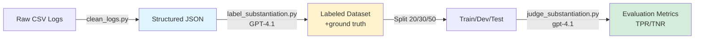

# PRD: Comprehensive Tutorial Documentation for AI Evaluation Course

## 1. Introduction/Overview

### Problem Statement
The recipe-chatbot repository serves as the practical codebase for an AI evaluations course, containing 5 homeworks (hw1-hw5) and 3 lessons (lesson-4, lesson-7, lesson-8) that progressively teach evaluation methodologies. While each homework/lesson has basic README files, they lack comprehensive tutorials that guide students through the concepts, implementation details, and design decisions behind each evaluation technique.

Students currently face:
- **Steep learning curve** understanding why certain evaluation approaches are used
- **Implementation gaps** between conceptual understanding and code execution
- **Limited context** on design decisions and trade-offs
- **Difficulty adapting** techniques to their own AI evaluation projects

### Goal
Create a comprehensive tutorial documentation system that provides detailed, concept-driven walkthroughs for each homework and lesson, with worked examples, interactive Jupyter notebooks, architectural diagrams, and clear explanations that enable students to deeply understand AI evaluation methodologies and adapt them to novel projects.

### Target Audience
- **Primary**: Students enrolled in an AI evaluations course (instructor-provided material)
- **Secondary**: Junior to mid-level developers learning systematic LLM evaluation
- **Skill level**: Basic Python proficiency, familiarity with LLMs, minimal prior evaluation experience

## 2. Goals

1. **Deep Understanding**: Students understand both the "what" and "why" behind each evaluation methodology
2. **Practical Execution**: Students can run, modify, and extend each homework/lesson independently
3. **Transferable Knowledge**: Students can adapt evaluation techniques to their own AI projects
4. **Visual Learning**: Complex pipelines and architectures are clarified through diagrams and flowcharts
5. **Self-Service**: Tutorials reduce instructor support burden by preemptively answering common questions
6. **Consistency**: All tutorials follow a unified structure and style, enabling progressive learning

## 3. User Stories

### US-1: First-Time Student
**As a** student encountering AI evaluation for the first time,
**I want** step-by-step tutorials with clear conceptual explanations,
**So that** I can understand the purpose and methodology behind each evaluation technique before diving into code.

### US-2: Hands-On Learner
**As a** student who learns by doing,
**I want** interactive Jupyter notebooks with executable code cells and real outputs,
**So that** I can experiment with evaluation techniques and see immediate results.

### US-3: Visual Learner
**As a** student who processes information visually,
**I want** architectural diagrams, data flow charts, and pipeline visualizations,
**So that** I can quickly grasp complex system interactions and evaluation workflows.

### US-4: Practical Implementer
**As a** developer working on my own AI chatbot project,
**I want** tutorials that explain design decisions and alternatives,
**So that** I can adapt these evaluation techniques to my specific use case.

### US-5: Self-Directed Learner
**As a** student working through the course independently,
**I want** tutorials with worked examples showing expected outputs and common pitfalls,
**So that** I can troubleshoot issues without needing to contact the instructor.

### US-6: Advanced Student
**As a** student who has completed the basic homeworks,
**I want** consistent tutorial structure across all lessons,
**So that** I can efficiently navigate to the information I need as topics become more advanced.

## 4. Functional Requirements

### FR-1: Tutorial Organization
1.1. Each homework directory (`homeworks/hw1/`, `homeworks/hw2/`, etc.) MUST contain individual tutorial files for each major concept or script
1.2. Each lesson directory (`lesson-4/`, `lesson-7/`, `lesson-8/`) MUST contain individual tutorial files for each evaluation pipeline component
1.3. Tutorial filenames MUST follow the pattern: `[concept]_tutorial.md` or `[concept]_tutorial.ipynb`
1.4. Each directory MUST have a `TUTORIAL_INDEX.md` that lists all tutorials with brief descriptions and recommended reading order

**Example Structure**:
```
homeworks/hw2/
├── TUTORIAL_INDEX.md                    # Overview and navigation
├── error_analysis_concepts.md           # Conceptual foundation
├── dimension_generation_tutorial.ipynb  # Interactive walkthrough
├── open_coding_tutorial.md              # Open coding methodology
├── taxonomy_building_tutorial.md        # Axial coding and taxonomy
└── visual_analysis_tutorial.ipynb       # Spreadsheet analysis patterns
```

### FR-2: Worked Examples with Expected Outputs
2.1. Each tutorial MUST include at least one complete worked example showing inputs and expected outputs
2.2. Jupyter notebook tutorials MUST include pre-executed cells with visible outputs
2.3. Command-line examples MUST show both the command and representative output
2.4. Examples MUST use real data from the course datasets (not toy examples)
2.5. Each example MUST include commentary explaining what to observe in the output

**Example**:
```python
# Example: Running BM25 retrieval on a synthetic query
query = "What air fryer settings for frozen chicken tenders?"
results = retrieve_bm25(query, top_k=5)

# Expected output (showing top result):
# Rank 1: "Air Fryer Chicken Tenders" (score: 15.3)
# Recipe includes: 400°F for 12-15 minutes, flip halfway
#
# Why this works: The query contains exact matches for "air fryer",
# "chicken tenders", and "frozen" appears in the recipe notes.
```

### FR-3: Interactive Jupyter Notebooks
3.1. Complex workflows (hw2 error analysis, hw3 judge evaluation, hw4 retrieval) MUST have Jupyter notebook versions
3.2. Notebooks MUST include:
   - Markdown cells explaining concepts before code blocks
   - Inline comments within code cells
   - Output cells showing execution results
   - Visualization cells (matplotlib, seaborn) where applicable
3.3. Notebooks MUST be executable in order from top to bottom without errors
3.4. Notebooks MUST use relative paths compatible with the repository structure
3.5. Notebooks MUST include a "Setup" cell at the top with all imports and configuration

### FR-4: Architectural Diagrams
4.1. Each multi-step evaluation pipeline MUST have a visual diagram showing:
   - Data flow between components
   - Decision points and branching logic
   - Input/output data structures at each stage
   - External dependencies (LLM APIs, databases)
4.2. Diagrams MUST use Mermaid syntax (rendered natively in Markdown on GitHub)
4.3. Complex diagrams MAY also include exported PNG/SVG versions for clarity
4.4. Each diagram MUST have a caption explaining what it represents

**Example**:


### FR-5: Tutorial Content Structure
5.1. Each tutorial MUST begin with:
   - **Learning Objectives**: 2-4 bullet points stating what students will learn
   - **Prerequisites**: Required knowledge, prior homeworks, environment assumptions
   - **Estimated Time**: Realistic completion time (reading + exercises)

5.2. Each tutorial MUST include a **Concepts** section explaining:
   - The evaluation methodology being taught
   - Why this approach is used (motivation)
   - When to use it (applicability)
   - Key terminology and definitions

5.3. Each tutorial MUST include an **Implementation Walkthrough** section with:
   - Code architecture overview
   - Step-by-step explanation of key functions/classes
   - Data structures and their purposes
   - Design decisions and trade-offs

5.4. Each tutorial MUST include a **Common Pitfalls** section addressing:
   - Frequent student errors
   - Edge cases to watch for
   - Debugging tips
   - Performance considerations

5.5. Each tutorial MUST conclude with:
   - **Key Takeaways**: 3-5 bullet summary of main concepts
   - **Further Reading**: Links to papers, blog posts, or documentation
   - **Adaptations**: Ideas for applying the technique to other projects

### FR-6: Homework-Specific Tutorials

#### Homework 1 Tutorials (Basic Setup)
6.1. `system_prompt_engineering_tutorial.md`:
   - Principles of effective system prompts
   - Role definition, constraints, output formatting
   - Examples of good vs. bad prompts
   - Testing and iteration strategies

6.2. `query_diversity_tutorial.md`:
   - Designing comprehensive test query sets
   - Dimension identification (cuisine, dietary, meal type)
   - Coverage analysis techniques

#### Homework 2 Tutorials (Error Analysis)
6.3. `error_analysis_concepts.md`:
   - Qualitative vs. quantitative evaluation
   - Open coding methodology (Sec 3.2 reference)
   - Axial coding and taxonomy building (Sec 3.3 reference)
   - When to use error analysis vs. automated metrics

6.4. `dimension_generation_tutorial.ipynb`:
   - Interactive walkthrough of dimension identification
   - LLM-based tuple generation with examples
   - Validation and filtering strategies
   - CSV output formatting

6.5. `failure_mode_taxonomy_tutorial.md`:
   - Building structured failure taxonomies
   - Writing clear definitions with examples
   - Iterative refinement process
   - Using taxonomies for targeted improvements

#### Homework 3 Tutorials (LLM-as-Judge)
6.6. `llm_judge_concepts.md`:
   - LLM-as-Judge evaluation paradigm
   - When to use judges vs. rule-based metrics
   - Judge bias and correction techniques
   - Statistical confidence intervals

6.7. `data_labeling_tutorial.ipynb`:
   - Ground truth creation workflow
   - Labeling strategies (manual, automated, hybrid)
   - Inter-annotator agreement
   - Train/dev/test split rationale

6.8. `judge_development_tutorial.ipynb`:
   - Prompt engineering for judges
   - Few-shot example selection
   - Structured output with Pydantic
   - Iterative refinement on dev set

6.9. `bias_correction_tutorial.md`:
   - TPR/TNR calculation and interpretation
   - Using judgy library for statistical correction
   - Confidence interval interpretation
   - When correction is necessary vs. optional

#### Homework 4 Tutorials (Retrieval Evaluation)
6.10. `rag_evaluation_concepts.md`:
   - RAG architecture overview
   - Retrieval vs. generation evaluation
   - BM25 algorithm intuition (non-mathematical)
   - Semantic vs. lexical search trade-offs

6.11. `synthetic_query_generation_tutorial.ipynb`:
   - Salient fact extraction from recipes
   - Query generation strategies
   - Parallel processing with ThreadPoolExecutor
   - Quality review and filtering

6.12. `retrieval_metrics_tutorial.md`:
   - Recall@k interpretation and use cases
   - MRR (Mean Reciprocal Rank) calculation
   - When to use each metric
   - Expected performance baselines

6.13. `query_rewrite_agent_tutorial.ipynb` (optional):
   - Agent-enhanced retrieval architecture
   - Query rewriting strategies
   - Performance comparison methodology
   - Cost-benefit analysis

#### Homework 5 Tutorials (Failure Analysis)
6.14. `transition_analysis_concepts.md`:
   - Failure transition matrices
   - State-based agent modeling
   - Bottleneck identification techniques
   - Using heatmaps for pattern discovery

6.15. `heatmap_visualization_tutorial.ipynb`:
   - Data loading and preprocessing
   - Matrix construction from traces
   - Visualization with seaborn/matplotlib
   - Interpreting heatmap patterns

#### Lesson 4 Tutorials (Substantiation Evaluation)
6.16. `substantiation_concepts.md`:
   - Defining substantiation vs. hallucination
   - Tool grounding principles
   - Verifiability criteria
   - Real-world applications

6.17. `data_preprocessing_tutorial.md`:
   - CSV to JSON conversion rationale
   - Handling malformed data
   - Incremental processing patterns
   - Schema design for traces

6.18. `parallel_labeling_tutorial.ipynb`:
   - ThreadPoolExecutor for LLM calls
   - Rate limiting and retry logic
   - Progress tracking with tqdm
   - Cost optimization strategies

6.19. `judge_evaluation_pipeline_tutorial.ipynb`:
   - End-to-end evaluation workflow
   - Deterministic dataset splitting
   - Few-shot example selection strategies
   - Metric reporting and interpretation

#### Lesson 7 Tutorials (Custom Inspection Interface)
6.20. `trace_inspection_concepts.md`:
   - Manual inspection vs. automated evaluation
   - When human review is necessary
   - Annotation interface design principles
   - Exporting annotated data

6.21. `csv_conversion_tutorial.md`:
   - JSON to CSV transformation
   - Formatting for human readability
   - Handling nested data structures
   - Tool call summarization

6.22. `labeling_tool_tutorial.md` (if building web interface):
   - FastHTML/MonsterUI overview
   - Building simple annotation UIs
   - Session management and persistence
   - Export formats for downstream analysis

#### Lesson 8 Tutorials (Model Cascades)
6.23. `model_cascade_concepts.md`:
   - Cascade vs. single-model architecture
   - Cost-accuracy trade-offs
   - Routing strategies (confidence-based, query complexity)
   - Use cases and when to cascade

6.24. `spam_classification_tutorial.ipynb`:
   - Binary classification evaluation
   - Logprob-based confidence scoring
   - Cascade implementation walkthrough
   - Cost analysis and optimization

### FR-7: Visual Style and Tone
7.1. Tutorials MUST use a **mix of formal concepts and casual walkthroughs**:
   - Formal language for theoretical concepts and definitions
   - Conversational tone for code walkthroughs and examples
   - Direct second-person ("you") when guiding through steps
   - Technical precision without unnecessary jargon

7.2. Code comments MUST be clear and pedagogical:
   - Explain *why*, not just *what*
   - Highlight design decisions
   - Point out alternative approaches where relevant

7.3. Diagrams MUST follow consistent visual conventions:
   - Data = blue rectangles
   - Processes = white rectangles with rounded corners
   - Models/LLMs = yellow rectangles
   - Outputs/Results = green rectangles
   - Decision points = diamonds

### FR-8: Prerequisites Handling
8.1. Tutorials MUST assume students have already set up the development environment
8.2. Tutorials MAY reference `env.example` for required API keys but MUST NOT duplicate setup instructions
8.3. Tutorials MUST state any homework dependencies (e.g., "Complete HW2 before starting HW3")
8.4. Tutorials MUST list Python package requirements at the top if specific to that homework/lesson

### FR-9: Success Validation
9.1. Each tutorial MUST include a **Validation** section showing how students can verify success:
   - Expected file outputs with sizes/formats
   - Metric ranges indicating correct implementation
   - Visual outputs (plots, tables) to compare against
   - Command to run for automated validation (if applicable)

9.2. Jupyter notebooks MUST include assertion cells that validate intermediate results

### FR-10: Cross-Referencing and Navigation
10.1. Tutorials MUST link to relevant sections in the main course guide (`AI_EVALUATION_COMPLETE_GUIDE.md`)
10.2. Tutorials MUST link to related tutorials (e.g., hw3 judge tutorial links to hw2 taxonomy tutorial)
10.3. Tutorials MUST link to actual code files being discussed using relative paths
10.4. Each tutorial MUST have a "Related Tutorials" section at the end

## 5. Non-Goals (Out of Scope)

### NG-1: Environment Setup Documentation
- Tutorials will NOT include Python installation, virtual environment setup, or API key acquisition
- These are covered in the main README and `env.example`

### NG-2: Automated Assessment
- Tutorials will NOT include auto-grading scripts or test suites for student submissions
- Validation sections are for self-assessment only

### NG-3: Video Content
- Tutorials will NOT include embedded video walkthroughs
- All content must be text, code, and static diagrams

### NG-4: Real-Time Collaboration Features
- Tutorials will NOT include live coding environments or collaborative editing
- Students work individually through static notebooks and markdown

### NG-5: External Hosting
- Tutorials will NOT be published to external platforms (Medium, ReadTheDocs)
- All content remains in the GitHub repository

### NG-6: Homework Solutions
- Tutorials will NOT provide complete, copy-paste solutions to homework assignments
- They provide guidance, concepts, and patterns but require students to implement

### NG-7: Production Deployment
- Tutorials will NOT cover deploying evaluation systems to production
- Focus remains on learning and experimentation

## 6. Design Considerations

### DC-1: Tutorial Discovery
- Primary entry point: `README.md` in each homework/lesson directory links to `TUTORIAL_INDEX.md`
- Secondary entry point: Main repo `README.md` has "Tutorials" section linking to all indices
- Tertiary entry point: `CLAUDE.md` updated with tutorial workflow instructions

### DC-2: Jupyter Notebook vs. Markdown
**Use Jupyter notebooks when**:
- Interactive exploration is valuable (data analysis, visualization)
- Students need to modify parameters and see results
- Output inspection is important (dataframes, plots, metrics)

**Use Markdown when**:
- Content is primarily conceptual or theoretical
- Code examples are illustrative, not meant to be executed
- Reading flow should not be interrupted by code execution

### DC-3: Diagram Generation Workflow
- Use Mermaid syntax for all flowcharts and sequence diagrams
- Use Graphviz DOT for complex system architectures (if needed)
- Export high-resolution PNGs for diagrams with >10 nodes
- Store diagram source in a `diagrams/` subdirectory in each homework/lesson

### DC-4: Code Snippet Extraction
- Prefer linking to actual code files over duplicating code in tutorials
- Use GitHub's line-specific linking (e.g., `backend/utils.py#L23-L45`)
- Duplicate code snippets only when adding heavy annotation
- Maintain line number references to source files for updates

### DC-5: Dataset Privacy
- All examples must use provided synthetic or public datasets
- Never include actual user data or proprietary information
- Sanitize any traces that might contain sensitive information

## 7. Technical Considerations

### TC-1: Repository Structure Impact
Creating tutorials will add the following structure to each homework/lesson:

```
homeworks/hwX/
├── README.md                    # Existing, update with link to tutorials
├── TUTORIAL_INDEX.md            # NEW: Navigation page
├── concepts/                    # NEW: Conceptual tutorials
│   └── [concept]_concepts.md
├── notebooks/                   # NEW: Interactive tutorials
│   └── [concept]_tutorial.ipynb
├── diagrams/                    # NEW: Visual aids
│   ├── [diagram].mmd            # Mermaid source
│   └── [diagram].png            # Exported image
└── [existing homework files]
```

### TC-2: Jupyter Notebook Execution
- All notebooks must use the project's virtual environment
- Notebooks must set working directory to project root for consistent imports
- Notebooks must use `.env` file for API keys (never hardcode)
- Include a "Quick Setup" cell at the top:
  ```python
  import sys
  sys.path.insert(0, '../..')  # Add project root to path
  from dotenv import load_dotenv
  load_dotenv('../../.env')
  ```

### TC-3: Mermaid Diagram Limitations
- GitHub renders Mermaid natively, but some IDEs do not
- Provide VS Code extension recommendation in main README
- Complex diagrams (>20 nodes) should also have PNG exports
- Test rendering on GitHub preview before committing

### TC-4: Code Example Maintenance
- When source code changes, tutorials must be updated
- Use GitHub Actions to detect broken file references (future enhancement)
- Maintain a `TUTORIAL_CHANGELOG.md` documenting which tutorials need updates
- Version tutorials with homework assignment versions if applicable

### TC-5: LLM API Usage in Tutorials
- Interactive notebooks that call LLM APIs must warn students of costs
- Provide estimated costs for running each notebook
- Use caching (litellm disk cache) to reduce repeat costs
- Offer "cached results" versions of notebooks for cost-free learning

### TC-6: Performance Considerations
- Notebooks with parallel processing (ThreadPoolExecutor) should default to conservative worker counts
- Include CPU/memory requirements for computationally intensive tutorials
- Provide "quick run" and "full run" options for time-consuming evaluations
- Example: "Quick run: 10 queries (~2 min), Full run: 100 queries (~15 min)"

## 8. Success Metrics

### SM-1: Adaptability (Primary Success Criterion)
**Target**: 80% of students can adapt tutorial techniques to a novel AI evaluation scenario

**Measurement**:
- Final project assessment where students must evaluate a different type of AI system
- Survey question: "Rate your confidence adapting these techniques (1-5 scale)"
- Code review of student projects checking for correct application of methodologies

**Why This Matters**: The course goal is not to memorize recipe bot evaluation, but to develop transferable evaluation skills.

### SM-2: Comprehension
**Target**: 90% of students correctly explain evaluation concepts in short-answer assessments

**Measurement**:
- Concept check quizzes after each homework
- Questions about "why" (not just "how")
- Example: "Why use TPR/TNR instead of accuracy for judge evaluation?"

### SM-3: Independent Execution
**Target**: 85% of students complete homeworks without instructor clarification questions

**Measurement**:
- Track support requests per homework before and after tutorials
- Categorize questions (setup issues, conceptual confusion, implementation details)
- Expect 50% reduction in implementation and concept questions

### SM-4: Tutorial Engagement
**Target**: 70% of students access tutorial content (tracked via GitHub analytics)

**Measurement**:
- GitHub page views for tutorial files
- Jupyter notebook download/execution (self-reported survey)
- Time spent on course materials (LMS analytics if available)

### SM-5: Code Quality
**Target**: Student implementations demonstrate understanding of design patterns from tutorials

**Measurement**:
- Rubric assessing: proper error handling, type hints, documentation, structured outputs
- Compare submissions before/after tutorial introduction
- Check for cargo-cult coding vs. thoughtful implementation

## 9. Open Questions

### OQ-1: Notebook Execution Environment
**Question**: Should students execute notebooks locally, or should we provide a cloud environment (Google Colab, JupyterHub)?

**Options**:
- A. Local execution only (requires proper setup)
- B. Colab-compatible notebooks (some limitations on file access)
- C. Course-provided JupyterHub (requires infrastructure)
- D. Both local and Colab versions

**Decision Needed By**: Before tutorial creation begins

### OQ-2: Tutorial Review Process
**Question**: How should tutorials be reviewed for technical accuracy and pedagogical quality?

**Options**:
- A. Instructor review only
- B. Peer review by TAs or advanced students
- C. Pilot testing with a small cohort
- D. Iterative refinement based on student feedback

**Decision Needed By**: After first draft of tutorials

### OQ-3: Versioning Strategy
**Question**: How should tutorials be versioned as the codebase evolves?

**Options**:
- A. Tutorials live in main branch, updated with code changes
- B. Separate branches per course offering (Fall2024, Spring2025)
- C. Version tags in tutorial filenames (hw2_tutorial_v1.md)
- D. Git tags for each course iteration

**Decision Needed By**: Before first course offering using tutorials

### OQ-4: Student Contributions
**Question**: Should students be allowed to contribute improvements to tutorials?

**Options**:
- A. No, instructor maintains all tutorials
- B. Yes, via pull requests with instructor review
- C. Yes, with TA approval for minor fixes only
- D. Yes, with a "student tips" section separate from main content

**Decision Needed By**: After initial deployment

### OQ-5: Internationalization
**Question**: Should tutorials support non-English languages?

**Options**:
- A. English only (current)
- B. Provide translation guidelines for community translations
- C. Officially support 1-2 additional languages
- D. Use LLM-based translation for accessibility

**Decision Needed By**: Future consideration (not MVP)

### OQ-6: Interactive Elements Beyond Code
**Question**: Should tutorials include interactive quizzes, polls, or self-assessment tools?

**Options**:
- A. No, keep it simple (text + code)
- B. Yes, using Jupyter widgets for in-notebook quizzes
- C. Yes, linking to external quiz platforms (Google Forms, Kahoot)
- D. Yes, using H5P or similar embedded tools

**Decision Needed By**: After evaluating student engagement with basic tutorials

### OQ-7: Tutorial Maintenance Schedule
**Question**: How often should tutorials be reviewed and updated?

**Options**:
- A. After each code change that affects tutorial content
- B. Once per semester before course starts
- C. Annually during summer review period
- D. On-demand when students report issues

**Decision Needed By**: Before second course offering

## 10. Appendix: Example Tutorial Outline

### Sample: `homeworks/hw3/notebooks/judge_development_tutorial.ipynb`

**Cell 1 - Markdown: Title and Learning Objectives**
```markdown
# LLM-as-Judge Development Tutorial (HW3)

## Learning Objectives
By completing this tutorial, you will:
- Understand the LLM-as-Judge evaluation paradigm
- Learn to craft effective judge prompts with few-shot examples
- Implement structured output parsing with Pydantic
- Evaluate judge performance using TPR and TNR metrics

## Prerequisites
- Completed HW2 (Error Analysis and Failure Taxonomies)
- Labeled dataset with ground truth (from `label_data.py`)
- OpenAI API key configured in `.env`

## Estimated Time
45-60 minutes (reading + exercises)
```

**Cell 2 - Markdown: Conceptual Foundation**
```markdown
## What is LLM-as-Judge?

LLM-as-Judge is an evaluation technique where a language model acts as an
automated evaluator for another LLM's outputs. Instead of writing complex
rule-based evaluation logic, we leverage an LLM's reasoning capabilities to
assess quality along specific dimensions.

### When to Use LLM-as-Judge
- ✅ Subjective quality metrics (helpfulness, tone, coherence)
- ✅ Complex criteria that are hard to formalize (dietary adherence with edge cases)
- ✅ Rapid iteration on evaluation criteria
- ❌ Simple pattern matching (use regex instead)
- ❌ Factual accuracy with known ground truth (use exact match metrics)

[Diagram showing Judge evaluation flow]
```

**Cell 3 - Python: Setup and Imports**
```python
import sys
sys.path.insert(0, '../..')  # Add project root
from dotenv import load_dotenv
load_dotenv('../../.env')

import pandas as pd
from pydantic import BaseModel
import litellm
from typing import List, Dict

# Configuration
JUDGE_MODEL = "gpt-4.1-nano"  # Cheaper model for judging
litellm.set_verbose = False

print("✓ Environment configured")
```

**Cell 4 - Markdown: Data Loading Explanation**
**Cell 5 - Python: Load and Split Data**
**Cell 6 - Markdown: Judge Prompt Design Principles**
**Cell 7 - Python: Define Judge Prompt Template**
**Cell 8 - Markdown: Few-Shot Example Selection Strategy**
**Cell 9 - Python: Select Balanced Few-Shot Examples**
**Cell 10 - Markdown: Structured Output with Pydantic**
**Cell 11 - Python: Define Output Schema**
**Cell 12 - Markdown: Running the Judge**
**Cell 13 - Python: Execute Judge on Dev Set**
**Cell 14 - Markdown: Calculating Performance Metrics**
**Cell 15 - Python: Compute TPR and TNR**
**Cell 16 - Markdown: Interpreting Results**
**Cell 17 - Markdown: Common Pitfalls**
**Cell 18 - Markdown: Key Takeaways and Further Reading**

---

## Document Metadata

- **PRD Version**: 1.0
- **Created**: 2025-10-29
- **Author**: AI Evaluations Course Team
- **Target Completion**: Q1 2026
- **Dependencies**: None (documentation only)
- **Estimated Effort**: 40-60 hours for full tutorial suite
