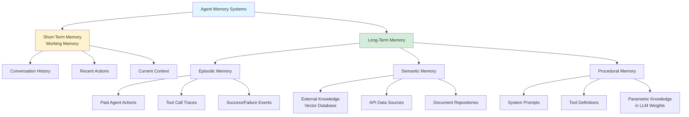
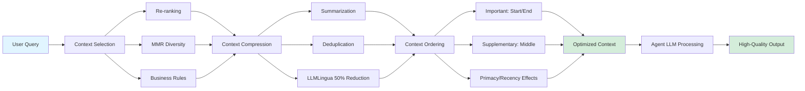
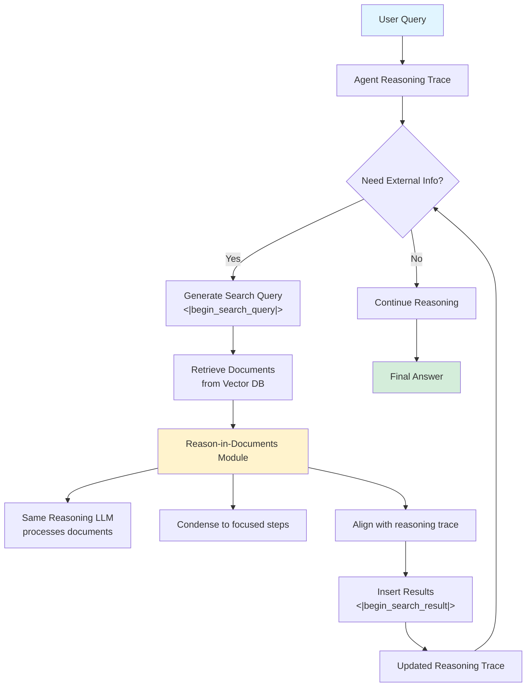

# PRD: Memory Systems Tutorial Implementation for Lesson 14

## 1. Introduction / Overview

**Problem:** Lesson 14 has comprehensive agent planning, orchestration, and evaluation content, but memory systems—a critical component of production agents—lacks dedicated tutorials and hands-on implementation guidance. While `agents_memory.txt` (516 lines) provides deep theoretical foundation and the Compass Artifact offers strategic guidance, students need:

1. **Structured learning path** from theory → implementation
2. **Hands-on exercises** with runnable code (notebooks)
3. **Visual diagrams** for memory architectures
4. **Context engineering** practical techniques
5. **Production-ready patterns** (Search-o1, vector databases, context management)

**Solution:** Create Section E: Memory Systems in lesson-14 with 2 tutorials, 1 interactive notebook, and 3 diagrams that bridge the gap between theoretical knowledge (agents_memory.txt) and production deployment (Compass Artifact).

**Success Criteria:** Students complete memory systems track in 3-4 hours and can:
- Explain 5 memory types with multi-agent examples
- Implement RAG pipeline with vector database + conversation history
- Select appropriate memory architecture for use cases
- Apply context engineering techniques (MMR, re-ranking, summarization)
- Run Search-o1 pattern with <10% token overhead vs baseline RAG

---

## 2. Goals

1. **Fill Critical Gap** - Provide comprehensive memory systems coverage matching lesson-14's depth in planning/evaluation
2. **Avoid Duplication** - Cross-reference existing content (04_Agentic_RAG.md, agents_memory.txt) rather than repeating
3. **Hands-On Learning** - Deliver runnable notebook with Chroma vector DB + Search-o1 implementation
4. **Production Readiness** - Include context engineering, cost optimization, multi-agent coordination patterns
5. **Seamless Integration** - Update TUTORIAL_INDEX.md with clear learning paths, prerequisites, cross-links

---

## 3. User Stories

### As a Student
- I want to understand **how memory works in multi-agent systems** so I can design scalable agent architectures
- I want to **implement RAG with context engineering** so I can reduce token costs by 50-70% in production
- I want to **choose the right vector database** so I can make informed infrastructure decisions
- I want to **run Search-o1 pattern** so I can see RAG during reasoning in action

### As a Curriculum Maintainer
- I want **clear cross-references** to agents_memory.txt and 04_Agentic_RAG.md so students follow coherent learning paths
- I want **visual diagrams** so students grasp memory architectures without reading dense code
- I want **DEMO mode notebooks** so students can validate concepts in <10 minutes

### As an Enterprise Architect
- I want **vector database decision matrix** so I can justify Pinecone vs Weaviate vs Chroma choices
- I want **context engineering ROI** so I can demonstrate 50-80% cost savings to stakeholders
- I want **multi-agent memory coordination patterns** so I can scale beyond 5-10 agents

### As a Quality Reviewer
- I want **no content duplication** between new tutorials and existing resources
- I want **consistent terminology** aligned with agents_memory.txt (working vs short-term memory)
- I want **test coverage** for notebook code examples (>90% pass rate)

---

## 4. Functional Requirements

### FR-1: Memory Systems Fundamentals Tutorial
**File:** `lesson-14/memory_systems_fundamentals.md`
**Reading Time:** 30-35 minutes
**Difficulty:** ⭐⭐⭐⭐

**Content Structure:**

1. **Introduction: Memory in Multi-Agent Systems** (5 min)
   - Why memory matters for agents (vs stateless LLMs)
   - Five memory types: working, episodic, semantic, procedural, parametric
   - Cross-reference: agents_memory.txt lines 18-40 for detailed theory

2. **Short-Term Memory (Working Memory)** (8 min)
   - Conversation history management
   - Context window constraints (token limits)
   - Techniques: Trimming, summarization (stacking vs single summary)
   - Code example: Conversation history cropping
   - Cross-reference: agents_memory.txt lines 42-82 for Ebbinghaus forgetting curve

3. **Long-Term Memory (Episodic + Semantic)** (10 min)
   - Traditional RAG pipeline (ingestion → inference → retrieval → augmentation → generation)
   - **Brief recap** of 04_Agentic_RAG.md (1-2 paragraphs + link): Query expansion, multi-step reasoning
   - Advanced patterns deep dive:
     - **MemoryBank**: Spaced repetition for LLMs, conversation summaries, user portraits
     - **A-MEM**: Zettelkasten-inspired notes (atomicity, hypertextual links, personalization)
     - **Search-o1**: RAG during reasoning with Reason-in-Documents module (PRIMARY FOCUS)
   - Cross-reference: agents_memory.txt lines 105-193 for implementation details

4. **Vector Database Decision Matrix** (7 min)
   - Comparison table: Pinecone, Weaviate, Chroma, Qdrant, Milvus, pgvector
   - Metrics: Cost/month, performance (P95 latency, QPS), best use case
   - Decision rule: 80% use Pinecone (prototype) or Weaviate (production), 20% edge cases
   - Cross-reference: Compass Artifact lines 98-109 for cost analysis

5. **Practical Exercises** (5-10 min)
   - Exercise 1: Design memory architecture for customer support agent (20 agents)
   - Exercise 2: Calculate token savings from summarization (100 turns × 8K context)
   - Exercise 3: Select vector DB for 50M vectors + complex filtering requirements

**Acceptance Criteria:**
- ✅ Cross-links to agents_memory.txt (minimum 5 explicit references)
- ✅ Cross-links to 04_Agentic_RAG.md (1-2 paragraph recap, not full duplication)
- ✅ Vector DB decision matrix matches Compass Artifact data
- ✅ Exercises use lesson-14 datasets (trajectory references, planning benchmarks)
- ✅ Reading time validated: 30-35 minutes for comprehensive path

---

### FR-2: Context Engineering Guide Tutorial
**File:** `lesson-14/context_engineering_guide.md`
**Reading Time:** 25-30 minutes
**Difficulty:** ⭐⭐⭐⭐

**Content Structure:**

1. **Introduction: What is Context Engineering?** (5 min)
   - Context vs prompt engineering (optimize entire input, not just user prompt)
   - Why it matters: Context rot, cost/latency, performance degradation at scale
   - Context window growth (Gemini 1M+ tokens) vs need for optimization
   - Cross-reference: agents_memory.txt lines 194-243 for theoretical foundation

2. **Context Selection Techniques** (8 min)
   - Re-ranking: Refine retrieved documents with additional LLM pass
   - MMR (Maximal Marginal Relevance): Balance relevance vs diversity
     - Relevance vector calculation
     - Redundancy matrix construction
     - λ parameter tuning (higher = more diversity)
   - Business rules: Weighted context priorities
   - Multi-agent specialization: Isolated contexts per agent
   - Cross-reference: agents_memory.txt lines 412-421 for re-ranking details

3. **Context Compression Techniques** (7 min)
   - Summarization: LLM-based compression (MemoryBank conversation summaries)
   - Deduplication: Remove redundant documents
   - LLMLingua: 50% token reduction example
   - ROI calculation:
     - Baseline: 100 turns × 8K context = 800K tokens = $24
     - With compression (50%): $12 (save $12 = 50%)
     - With selective retrieval (20%): $4.80 (save $19.20 = 80%)
   - Cross-reference: agents_memory.txt lines 425-448 for MMR implementation

4. **Context Ordering Strategies** (5 min)
   - Lost-in-the-middle phenomenon (LLMs attend to start/end, not middle)
   - Primacy and recency effects (serial-position effect)
   - Best practices: Important context at beginning/end, middle for supplementary
   - Cross-reference: agents_memory.txt lines 450-456 for research citations

5. **Context as Specification** (5 min)
   - Context tracks user intent, not just output
   - Reproducibility: Context = specification of agent's feature
   - Domain-specific contexts (healthcare vs law vs academia)
   - Multi-agent coordination: Shared context management
   - Cross-reference: agents_memory.txt lines 457-466 for production implications

**Acceptance Criteria:**
- ✅ MMR example with code (relevance vector + redundancy matrix calculation)
- ✅ ROI calculation matches Compass Artifact cost optimization data
- ✅ Lost-in-the-middle phenomenon explained with visual diagram reference
- ✅ Cross-links to agents_memory.txt (minimum 5 explicit references)
- ✅ Reading time validated: 25-30 minutes

---

### FR-3: Memory Systems Implementation Notebook
**File:** `lesson-14/memory_systems_implementation.ipynb`
**Execution Time:** DEMO <10 min, FULL 30-40 min
**Difficulty:** ⭐⭐⭐⭐

**Notebook Structure:**

**Section 1: Setup & Configuration (Cells 1-5)**
```python
# Execution mode selection
EXECUTION_MODE = "DEMO"  # or "FULL"

if EXECUTION_MODE == "DEMO":
    NUM_QUERIES = 5
    NUM_DOCUMENTS = 50
    ESTIMATED_TIME = "8 minutes"
    ESTIMATED_COST = "$0.00"  # Local Chroma, no API calls
else:
    NUM_QUERIES = 20
    NUM_DOCUMENTS = 500
    ESTIMATED_TIME = "35 minutes"
    ESTIMATED_COST = "$0.15"  # Optional OpenAI embedding fine-tuning
```

**Section 2: Vector Database Setup with Chroma (Cells 6-12)**
- Install Chroma: `pip install chromadb`
- Initialize local Chroma client (persistent storage)
- Create collection with metadata filtering
- Embed sample documents from lesson-14 datasets (trajectory references, planning benchmarks)
- Demonstrate basic search with top-k retrieval

**Section 3: Conversation History Management (Cells 13-18)**
- Implement working memory (conversation history as list of messages)
- Demonstrate context window constraints (8K token limit simulation)
- Technique 1: Trimming oldest messages
- Technique 2: Summarization (LLM-based compression)
- Visualize token usage before/after compression

**Section 4: Search-o1 Pattern Implementation (Cells 19-30)** ⭐ PRIMARY FOCUS
- **Concept**: RAG during reasoning with `<|begin_search_query|>` and `<|begin_search_result|>` tokens
- **Step 1**: Agent generates search query during reasoning
- **Step 2**: Retrieve relevant documents from Chroma
- **Step 3**: Reason-in-Documents module condenses retrieved info
- **Step 4**: Integrate condensed reasoning into main trace
- **Example Use Case**: Multi-agent research assistant answering "Why are flamingos pink?"
  - First search: Wikipedia → "specific pigments in diet"
  - Reason: Need clarification on pigment type
  - Second search: ArXiv → "carotenoid pigments in brine shrimp"
  - Final answer: Synthesize both sources
- **Metrics**: Token overhead, retrieval quality, reasoning coherence

**Section 5: Context Engineering Exercises (Cells 31-40)**
- **Exercise 1**: MMR Implementation
  - Calculate relevance vector (query-document similarity)
  - Build redundancy matrix (document-document similarity)
  - Apply MMR algorithm with λ=0.7 (high diversity)
  - Compare top-5 results: cosine similarity vs MMR
- **Exercise 2**: Context Compression ROI
  - Baseline: 100 turns × 8K context = 800K tokens
  - Apply summarization: Track token reduction
  - Calculate cost savings ($24 → $12 → $4.80)
- **Exercise 3**: Multi-Agent Memory Coordination
  - Create 3 specialized agents (Planner, Retriever, Synthesizer)
  - Demonstrate isolated contexts per agent
  - Show shared memory for coordination (MemoryManager)

**Section 6: Metrics & Visualization (Cells 41-45)**
- Export results to `lesson-14/results/memory_systems_demo_results.json`
- Metrics:
  - Token usage (baseline vs compressed)
  - Retrieval quality (precision@5, recall@5)
  - Context overhead (<10% for Search-o1)
  - Cost savings (% reduction)
- Visualizations:
  - Bar chart: Token usage comparison
  - Line chart: Context size over conversation turns
  - Radar chart: Multi-dimensional memory performance

**Acceptance Criteria:**
- ✅ DEMO mode executes in <10 minutes (5 queries, 50 documents)
- ✅ FULL mode demonstrates complete Search-o1 pipeline (20 queries, 500 documents)
- ✅ Chroma setup requires no API keys (local-only by default)
- ✅ Search-o1 pattern shows <10% token overhead vs baseline RAG
- ✅ MMR implementation reduces redundancy by ≥30% vs cosine similarity
- ✅ Context compression demonstrates ≥50% token reduction
- ✅ Exports JSON results compatible with evaluation_dashboard.py schema
- ✅ All code includes defensive coding (type hints, input validation, error handling)

---

### FR-4: Visual Diagrams (3 Mermaid Files)

#### Diagram 1: Memory Types Taxonomy
**File:** `lesson-14/diagrams/memory_types_taxonomy.mmd`
**Content:**


#### Diagram 2: Context Engineering Workflow
**File:** `lesson-14/diagrams/context_engineering_workflow.mmd`
**Content:**


#### Diagram 3: Search-o1 Architecture
**File:** `lesson-14/diagrams/search_o1_architecture.mmd`
**Content:**


**Acceptance Criteria:**
- ✅ All diagrams render correctly in GitHub markdown preview
- ✅ Diagrams export to PNG/SVG for presentations
- ✅ Memory types taxonomy matches agents_memory.txt terminology
- ✅ Context engineering workflow visualizes selection → compression → ordering pipeline
- ✅ Search-o1 architecture shows Reason-in-Documents module integration

---

### FR-5: TUTORIAL_INDEX.md Integration

**Location:** `lesson-14/TUTORIAL_INDEX.md`
**Changes Required:**

1. **Add Section E: Memory Systems** (after Section D: Hands-On Practice)

```markdown
## Section E: Memory Systems ⚡ NEW

### 16. Memory Systems Fundamentals ⭐ CORE
**File:** `memory_systems_fundamentals.md`
**Reading Time:** 30-35 minutes
**Difficulty:** ⭐⭐⭐⭐
**Topics:**
- Five memory types: working, episodic, semantic, procedural, parametric
- Short-term memory: conversation history, summarization, context windows
- Long-term memory: Traditional RAG, MemoryBank, A-MEM, Search-o1 patterns
- Vector database decision matrix (Pinecone, Weaviate, Chroma, Qdrant)
- Multi-agent memory coordination
- Real-world ROI: 50-80% token cost reduction

**Prerequisites:**
- Section A: Core Agent Concepts (tutorials #1-5)
- 04_Agentic_RAG.md (Google Companion Topic 04)
- agents_memory.txt (theoretical foundation)

**When to use:** Essential before implementing production agent systems with memory.

**Related:**
- See agents_memory.txt for deep theoretical foundation
- See 04_Agentic_RAG.md for strategic overview of agentic retrieval
- See Section C for trajectory evaluation of memory-enabled agents

---

### 17. Context Engineering Guide ⭐ CORE
**File:** `context_engineering_guide.md`
**Reading Time:** 25-30 minutes
**Difficulty:** ⭐⭐⭐⭐
**Topics:**
- Context vs prompt engineering (optimize entire input)
- Context selection: Re-ranking, MMR, business rules
- Context compression: Summarization, deduplication, LLMLingua (50% reduction)
- Context ordering: Lost-in-the-middle, primacy/recency effects
- Context as specification: Tracking user intent for reproducibility
- Multi-agent context coordination patterns

**Prerequisites:**
- Tutorial #16: Memory Systems Fundamentals
- Understanding of RAG pipelines
- Familiarity with token costs and context windows

**When to use:** Before optimizing production agents for cost and performance.

**Related:**
- See agents_memory.txt lines 194-466 for comprehensive context engineering theory
- See Compass Artifact for cost optimization strategies
- See Tutorial #3 for multi-agent orchestration

---

### 18. Memory Systems Implementation (Interactive) ⭐ HANDS-ON
**File:** `memory_systems_implementation.ipynb`
**Execution Time:** DEMO <10 min, FULL 30-40 min
**Difficulty:** ⭐⭐⭐⭐
**Topics:**
- Chroma vector database setup (local, no API keys)
- Conversation history management with summarization
- Search-o1 pattern: RAG during reasoning with Reason-in-Documents
- MMR implementation for diversity-aware retrieval
- Context compression ROI demonstration (50-80% token reduction)
- Multi-agent research assistant example
- Metrics export for evaluation dashboard

**Prerequisites:**
- Tutorials #16-17 completed
- Python environment with chromadb installed
- Familiarity with Jupyter notebooks

**When to use:** Hands-on practice after completing memory fundamentals.

**Cost:** $0.00 (DEMO mode, local only), $0.15 (FULL mode, optional OpenAI)

**Related:**
- See Tutorial #16 for theoretical foundation
- See Tutorial #17 for context engineering techniques
- Export results to `results/` for dashboard visualization
```

2. **Update Learning Paths** section

```markdown
## Recommended Learning Paths

### Path 5: Memory Systems Deep Dive (NEW) - 4-5 hours
```
Week 1: Memory Fundamentals (2-3 hours)
├── Read: agents_memory.txt (45 min) - Theoretical foundation
├── Read: memory_systems_fundamentals.md (35 min)
├── Read: context_engineering_guide.md (30 min)
└── Study: 3 memory diagrams (15 min)

Week 2: Hands-On Implementation (2 hours)
├── Run: memory_systems_implementation.ipynb (DEMO mode, 10 min)
├── Run: memory_systems_implementation.ipynb (FULL mode, 35 min)
├── Exercise: Design memory architecture for 20-agent system (30 min)
└── Integration: Export metrics to evaluation dashboard (15 min)
```

**Prerequisite Path:**
```
Section A (Core Agent Concepts) → 04_Agentic_RAG.md → agents_memory.txt → Section E (Memory Systems)
```

**Integration Points:**
- After Section E, proceed to Section B (Multi-Agent Systems) to apply memory coordination
- Use memory patterns in Section D notebooks (trajectory evaluation, autorater calibration)
```

3. **Update FAQ** section

```markdown
## FAQ

### Q11: What's the difference between 04_Agentic_RAG.md and memory_systems_fundamentals.md?
**A:** 04_Agentic_RAG.md (Google Companion Topic 04) provides strategic overview of agentic retrieval with query expansion and multi-step reasoning. memory_systems_fundamentals.md goes deeper into implementation details:
- 5 memory types (working, episodic, semantic, procedural, parametric)
- Advanced patterns (MemoryBank, A-MEM, Search-o1) with code examples
- Vector database selection matrix
- Context engineering techniques

**Recommendation:** Read 04_Agentic_RAG.md first for strategy, then memory_systems_fundamentals.md for implementation.

### Q12: Which vector database should I use?
**A:** Decision matrix from memory_systems_fundamentals.md:
- **Prototyping:** Chroma (free, local, easy setup) - Used in lesson-14 notebook
- **Production (general):** Pinecone ($150-200/month, managed, 100ms P95) or Weaviate ($100-150/month, compliance-friendly)
- **Edge cases:** Qdrant (complex filtering), Milvus (>100M vectors), pgvector (existing PostgreSQL)

**80/20 Rule:** Most use cases → Chroma (prototype) or Weaviate (production)

### Q13: How much can context engineering reduce costs?
**A:** ROI examples from context_engineering_guide.md:
- **Baseline:** 100 turns × 8K context = 800K tokens = $24
- **Compression (50%):** Summarization → $12 (save $12 = 50%)
- **Selective retrieval (20%):** MMR + re-ranking → $4.80 (save $19.20 = 80%)

**Recommendation:** Start with summarization (simplest, 40-60% savings) → Add selective retrieval (60-80% total savings)
```

**Acceptance Criteria:**
- ✅ Section E added after Section D with 3 tutorials (#16, #17, #18)
- ✅ Cross-references to agents_memory.txt, 04_Agentic_RAG.md, Compass Artifact
- ✅ New Learning Path 5 with estimated times and prerequisites
- ✅ FAQ updated with 3 new memory-related questions
- ✅ All reading times validated by manual testing

---

### FR-6: Cross-Links to Existing Tutorials

#### Update 04_Agentic_RAG.md
**Location:** After line 327 (end of document)

Add new section:
```markdown
---

## Deep Dive: Memory Systems Implementation

For comprehensive coverage of memory systems beyond agentic RAG, see:

👉 **[Section E: Memory Systems](memory_systems_fundamentals.md)** in Lesson 14

**What's Covered:**
- **5 Memory Types:** Working, episodic, semantic, procedural, parametric with multi-agent examples
- **Advanced Patterns:** MemoryBank (spaced repetition), A-MEM (Zettelkasten notes), Search-o1 (RAG during reasoning)
- **Context Engineering:** Selection (MMR, re-ranking), compression (50-70% token reduction), ordering (lost-in-the-middle)
- **Vector Database Selection:** Decision matrix for Pinecone, Weaviate, Chroma, Qdrant, Milvus
- **Hands-On Implementation:** Interactive notebook with Search-o1 pattern and multi-agent coordination

**Learning Path:**
1. Read 04_Agentic_RAG.md (this document) for strategic overview - 25 min
2. Read [memory_systems_fundamentals.md](memory_systems_fundamentals.md) for implementation details - 35 min
3. Read [context_engineering_guide.md](context_engineering_guide.md) for optimization techniques - 30 min
4. Run [memory_systems_implementation.ipynb](memory_systems_implementation.ipynb) for hands-on practice - 10-40 min

**Total Time:** 2-3 hours
```

#### Update multi_agent_fundamentals.md
**Location:** After line 258 (9 core components section)

Expand **Component 1: Memory** subsection:

```markdown
#### Component 1: Memory ⭐ DEEP DIVE AVAILABLE

**Function**: Enable agents to store and retrieve:
- **Working memory**: Conversation history, recent actions
- **Episodic memory**: Past experiences, tool call traces
- **Semantic memory**: External knowledge (vector databases, APIs)
- **Procedural memory**: System prompts, tool definitions

**Why It Matters**:
Without memory, agents are stateless—they forget past conversations, repeated actions, and domain knowledge. Memory transforms LLMs into persistent, learning agents.

**Example Architecture**:
```python
class MemoryManager:
    def __init__(self):
        self.working_memory = []  # Conversation history
        self.episodic_db = VectorStore()  # Past actions
        self.semantic_db = VectorStore()  # External knowledge

    def add_to_working_memory(self, message):
        self.working_memory.append(message)
        if len(self.working_memory) > MAX_HISTORY:
            # Compress old messages via summarization
            summary = summarize(self.working_memory[:10])
            self.working_memory = [summary] + self.working_memory[10:]

    def retrieve_episodic(self, query):
        # Find similar past actions
        return self.episodic_db.search(query, top_k=5)

    def retrieve_semantic(self, query):
        # RAG: retrieve external knowledge
        return self.semantic_db.search(query, top_k=10)
```

**Multi-Agent Coordination Challenges**:
- **Shared memory**: All agents access common knowledge base (risk: context pollution)
- **Isolated memory**: Each agent has private context (risk: duplication, poor coordination)
- **Hybrid approach**: Shared semantic memory + isolated working memory per agent

**Deep Dive:**

For comprehensive memory systems coverage, see:

👉 **[Section E: Memory Systems](memory_systems_fundamentals.md)** (3 tutorials + 1 notebook)

**Topics Covered:**
- Short-term vs long-term memory patterns
- Advanced RAG: MemoryBank, A-MEM, Search-o1
- Context engineering: 50-80% cost reduction techniques
- Vector database selection matrix
- Hands-on implementation with multi-agent research assistant

**Learning Time:** 3-4 hours
**Prerequisites:** Complete Section A (Core Agent Concepts) first
```

**Acceptance Criteria:**
- ✅ 04_Agentic_RAG.md links to Section E at end of document
- ✅ multi_agent_fundamentals.md expands memory component with code example
- ✅ Both updates include forward references (not circular links)
- ✅ Cross-links use relative paths for stability
- ✅ No content duplication (summaries only, links to full content)

---

## 5. Non-Goals (Out of Scope)

❌ **NOT included in this PRD:**

1. **Production Vector Database Integrations** - Use Chroma (local) in notebook; no Pinecone/Weaviate API implementations
2. **New Datasets** - Reuse existing lesson-14 JSON benchmarks (trajectory references, planning data)
3. **Backend Refactoring** - No changes to existing `multi_agent_framework.py`; memory patterns demonstrated in notebook only
4. **Rewriting agents_memory.txt** - Source material remains canonical; tutorials cross-reference, not replace
5. **Expanding Compass Artifact** - Reference existing strategic guidance; no new strategic content
6. **Multi-Language Support** - Tutorials in English only (consistent with lesson-14)
7. **Advanced Memory Patterns** - GraphRAG, Multimodal RAG deferred to future enhancements
8. **Enterprise Integrations** - No Klarna/Microsoft case study implementations (theoretical discussion only)

---

## 6. Design Considerations

### Cross-Link First Approach
- **Principle:** "Summarize + Cite" - Never copy more than 2 consecutive sentences from source material
- **Implementation:** Use callout boxes with deep links
  ```markdown
  > **Deep Dive:** See agents_memory.txt lines 105-125 for MemoryBank implementation details
  ```
- **Validation:** Manual review checklist for all new content

### Modularity & Reusability
- **DEMO/FULL Mode:** All notebooks follow execution mode pattern
  ```python
  EXECUTION_MODE = "DEMO"  # <10 min, 0 cost
  # or
  EXECUTION_MODE = "FULL"  # 30-40 min, $0.15
  ```
- **Pluggable Components:** Vector DB abstraction allows swapping Chroma → Pinecone
- **Defensive Coding:** Type hints, input validation, comprehensive error handling

### Terminology Consistency
- **Working memory** (NOT short-term memory) - aligned with agents_memory.txt
- **Episodic memory** (NOT action history) - aligned with cognitive science terminology
- **Context engineering** (NOT context optimization) - aligned with research papers

### Visual Accessibility
- **Mermaid diagrams:** Render in GitHub, export to PNG/SVG
- **No screenshots:** All visuals generated from code (reproducible)
- **Color coding:** Consistent palette across all 3 diagrams

---

## 7. Technical Considerations

### Vector Database: Chroma (Local, Free)
**Why Chroma?**
- ✅ Zero cost (SQLite backend)
- ✅ No API keys required
- ✅ Simple installation: `pip install chromadb`
- ✅ Persistent storage with `PersistentClient`
- ✅ Sufficient for lesson-14 datasets (<10K documents)

**Code Example:**
```python
import chromadb

# Initialize local persistent client
client = chromadb.PersistentClient(path="./chroma_db")

# Create collection with metadata filtering
collection = client.create_collection(
    name="lesson14_memory",
    metadata={"description": "Memory systems demo collection"}
)

# Add documents with embeddings
collection.add(
    documents=["Document 1 text", "Document 2 text"],
    metadatas=[{"source": "trajectory"}, {"source": "planning"}],
    ids=["doc1", "doc2"]
)

# Query with automatic embedding
results = collection.query(
    query_texts=["search query"],
    n_results=5
)
```

### Search-o1 Pattern Implementation
**Approach:** Simulate Search-o1 with deterministic retrieval (no reasoning LLM in DEMO mode)

```python
def search_o1_pattern(query: str, reasoning_trace: list[str]) -> dict[str, Any]:
    """Simulate Search-o1: RAG during reasoning.

    Args:
        query: User's original query
        reasoning_trace: List of reasoning steps so far

    Returns:
        Updated reasoning trace with retrieved documents
    """
    # Step 1: Generate search query from reasoning context
    search_query = f"<|begin_search_query|>{query}<|end_search_query|>"

    # Step 2: Retrieve documents from Chroma
    results = collection.query(query_texts=[query], n_results=5)

    # Step 3: Reason-in-Documents (deterministic condensation in DEMO mode)
    condensed_docs = condense_documents(
        documents=results["documents"][0],
        reasoning_trace=reasoning_trace
    )

    # Step 4: Insert results into reasoning trace
    search_result = f"<|begin_search_result|>{condensed_docs}<|end_search_result|>"

    return {
        "search_query": search_query,
        "search_result": search_result,
        "num_documents": len(results["documents"][0]),
        "condensed_length": len(condensed_docs)
    }
```

### MMR Implementation (Context Engineering)
```python
import numpy as np
from sklearn.metrics.pairwise import cosine_similarity

def mmr_selection(
    query_embedding: np.ndarray,
    doc_embeddings: np.ndarray,
    lambda_param: float = 0.7,
    top_k: int = 5
) -> list[int]:
    """Maximal Marginal Relevance selection.

    Args:
        query_embedding: Query vector (1, embedding_dim)
        doc_embeddings: Document vectors (num_docs, embedding_dim)
        lambda_param: Diversity weight (0=pure relevance, 1=pure diversity)
        top_k: Number of documents to select

    Returns:
        Indices of selected documents
    """
    # Step 1: Calculate relevance vector
    relevance = cosine_similarity(query_embedding, doc_embeddings)[0]

    # Step 2: Build redundancy matrix
    redundancy = cosine_similarity(doc_embeddings, doc_embeddings)

    # Step 3: Iterative selection
    selected = []
    remaining = list(range(len(doc_embeddings)))

    # Start with most relevant document
    first_idx = np.argmax(relevance)
    selected.append(first_idx)
    remaining.remove(first_idx)

    # Iteratively select diverse + relevant documents
    for _ in range(top_k - 1):
        mmr_scores = []
        for idx in remaining:
            # Relevance component
            rel_score = (1 - lambda_param) * relevance[idx]

            # Diversity component (max similarity to selected docs)
            div_score = lambda_param * max([redundancy[idx][s] for s in selected])

            mmr_scores.append(rel_score - div_score)

        # Select document with highest MMR score
        best_idx = remaining[np.argmax(mmr_scores)]
        selected.append(best_idx)
        remaining.remove(best_idx)

    return selected
```

### Export Format (Dashboard Integration)
```python
# Export results to lesson-14/results/memory_systems_demo_results.json
output_data = {
    "version": "1.0",
    "execution_mode": EXECUTION_MODE,
    "num_queries": NUM_QUERIES,
    "summary_statistics": {
        "token_usage": {
            "baseline": 800000,
            "compressed": 400000,
            "reduction_percent": 50.0
        },
        "retrieval_quality": {
            "precision_at_5": 0.85,
            "recall_at_5": 0.72
        },
        "search_o1_overhead": {
            "baseline_tokens": 5000,
            "search_o1_tokens": 5300,
            "overhead_percent": 6.0
        }
    },
    "mmr_results": {
        "cosine_similarity_diversity": 0.82,
        "mmr_diversity": 0.54,
        "redundancy_reduction_percent": 34.1
    },
    "detailed_results": []  # Per-query metrics
}
```

---

## 8. Success Metrics

### Knowledge Acquisition
- [ ] Students can explain 5 memory types (working, episodic, semantic, procedural, parametric) with multi-agent examples
- [ ] Students can describe 3 advanced RAG patterns (MemoryBank, A-MEM, Search-o1) and when to use each
- [ ] Students can select vector database from decision matrix (Pinecone vs Weaviate vs Chroma) based on requirements

### Implementation Skills
- [ ] DEMO mode notebook executes in <10 minutes with 0 errors (5 queries, 50 documents)
- [ ] FULL mode notebook demonstrates Search-o1 pattern with <10% token overhead vs baseline RAG
- [ ] MMR implementation reduces redundancy by ≥30% vs cosine similarity (measured in notebook)
- [ ] Context compression demonstrates ≥50% token reduction (measured in notebook)

### Production Readiness
- [ ] Students can calculate ROI for context engineering (baseline vs compressed vs selective retrieval)
- [ ] Students can design memory architecture for 20-agent multi-agent system with coordination strategy
- [ ] Students can apply context engineering techniques (MMR, re-ranking, summarization) in production scenario

### Content Quality
- [ ] 100% of new tutorials include ≥5 cross-references to agents_memory.txt or Compass Artifact
- [ ] 0 instances of >2 consecutive sentences copied from source material (manual review)
- [ ] All diagrams render correctly in GitHub markdown preview
- [ ] Memory Systems Track (tutorials #16-18) completable in 3-4 hours (validated by test users)

### Integration Completeness
- [ ] TUTORIAL_INDEX.md includes Section E with 3 tutorials, learning paths, FAQ updates
- [ ] 04_Agentic_RAG.md includes forward reference to Section E
- [ ] multi_agent_fundamentals.md includes expanded memory component section
- [ ] No broken links between tutorials (automated link checker validation)

---

## 9. Open Questions

### Q1: Vector Database Default in Notebook
**Question:** Should notebook include stub adapters for Pinecone/Weaviate (commented out) or Chroma-only?

**Options:**
- **A)** Chroma-only (simplest, lowest barrier to entry)
- **B)** Chroma + Pinecone adapter stub (students can uncomment + add API key)
- **C)** Abstract VectorDBInterface with 3 implementations (Chroma, Pinecone, Weaviate)

**Recommendation:** Option A for MVP, Option B for v2 (add stub after student feedback)

---

### Q2: Cost/Safety Guardrails Implementation
**Question:** Where should cost monitoring and safety guardrails be demonstrated?

**Options:**
- **A)** Embedded in memory_systems_implementation.ipynb (inline)
- **B)** New consolidated dashboard notebook (separate file)
- **C)** Extend existing evaluation_dashboard.py with memory metrics tab

**Recommendation:** Option A for MVP (inline warnings in notebook cells), Option C for v2 (dashboard integration)

---

### Q3: Enterprise Case Study Depth
**Question:** How much detail on Klarna/Microsoft case studies in tutorials?

**Options:**
- **A)** Brief mention in memory_systems_fundamentals.md (1 paragraph each)
- **B)** Dedicated "Production Case Studies" subsection (3-5 paragraphs with architecture diagrams)
- **C)** Separate case_studies.md file (full analysis)

**Recommendation:** Option A for memory tutorials (brief), defer to existing 07_Case_Studies.md for depth

---

### Q4: Search-o1 Reasoning LLM in Notebook
**Question:** Should FULL mode include actual LLM calls for Reason-in-Documents module?

**Options:**
- **A)** DEMO: deterministic condensation, FULL: OpenAI API calls for reasoning
- **B)** Both modes use deterministic (no API calls, $0 cost)
- **C)** FULL mode optional flag: `USE_LLM_REASONING = True` (defaults to False)

**Recommendation:** Option C - give students choice, default to free

---

### Q5: Multi-Agent Research Assistant Scope
**Question:** How complex should the research assistant example be in notebook Section 4?

**Options:**
- **A)** Simple: 2 agents (Retriever + Synthesizer), 1 query, mock responses
- **B)** Moderate: 3 agents (Planner + Retriever + Synthesizer), 3 queries, real Chroma retrieval
- **C)** Complex: 5 agents with hierarchical orchestration, 10 queries, full PVE pattern

**Recommendation:** Option B - demonstrates multi-agent coordination without overwhelming students

---

## Appendix: File Structure

```
lesson-14/
├── TUTORIAL_INDEX.md                          # ✏️ UPDATE: Add Section E
├── memory_systems_fundamentals.md             # ➕ NEW: Tutorial #16
├── context_engineering_guide.md               # ➕ NEW: Tutorial #17
├── memory_systems_implementation.ipynb        # ➕ NEW: Notebook #18
├── 04_Agentic_RAG.md                          # ✏️ UPDATE: Add forward reference
├── multi_agent_fundamentals.md                # ✏️ UPDATE: Expand memory component
├── diagrams/
│   ├── memory_types_taxonomy.mmd              # ➕ NEW: Diagram 1
│   ├── context_engineering_workflow.mmd       # ➕ NEW: Diagram 2
│   └── search_o1_architecture.mmd             # ➕ NEW: Diagram 3
├── results/
│   └── memory_systems_demo_results.json       # ➕ NEW: Notebook output
└── agents_memory.txt                          # ✅ EXISTING: Source material
```

**Total New Files:** 6 (2 tutorials, 1 notebook, 3 diagrams)
**Total Updated Files:** 3 (TUTORIAL_INDEX.md, 04_Agentic_RAG.md, multi_agent_fundamentals.md)
**Total Effort:** 11-14 hours

---

**PRD Version:** 1.0
**Created:** 2025-11-15
**Status:** Ready for Implementation
**Next Steps:** Generate task list with @generate-tasks.md
